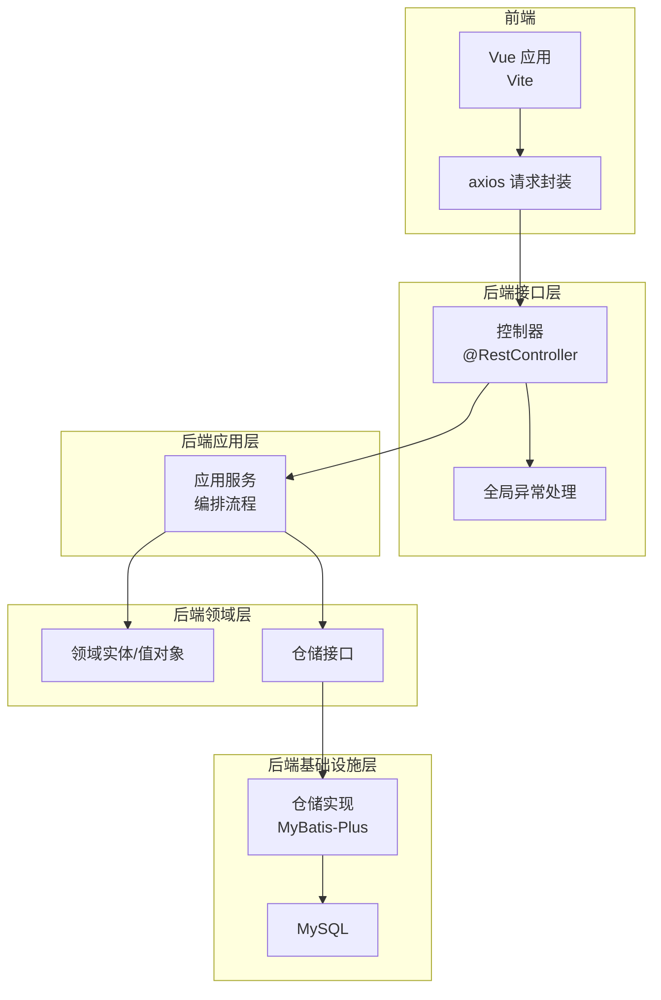
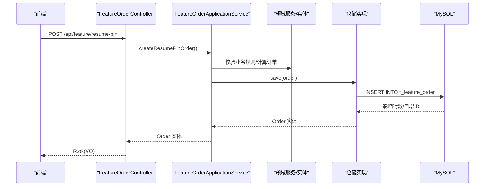
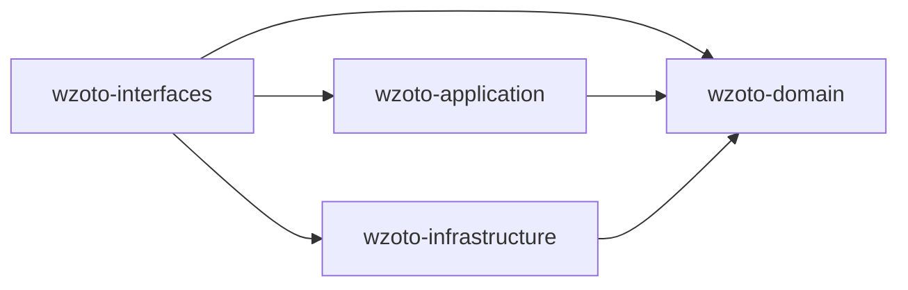
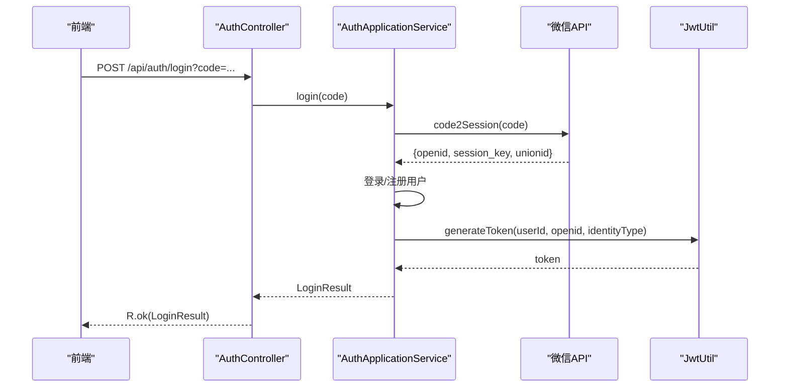
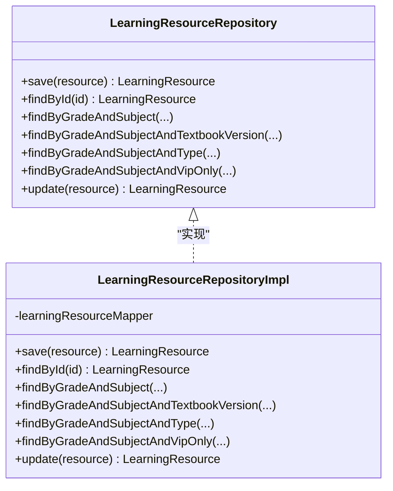

# 代码规范

<cite>
**本文引用的文件**
- [wzoto-backend/pom.xml](file://wzoto-backend/pom.xml)
- [application.yml](file://wzoto-backend/wzoto-interfaces/src/main/resources/application.yml)
- [GlobalExceptionHandler.java](file://wzoto-backend/wzoto-interfaces/src/main/java/com/wzoto/interfaces/common/GlobalExceptionHandler.java)
- [User.java](file://wzoto-backend/wzoto-domain/src/main/java/com/wzoto/domain/entity/User.java)
- [AuthApplicationService.java](file://wzoto-backend/wzoto-application/src/main/java/com/wzoto/application/service/AuthApplicationService.java)
- [FeatureOrderController.java](file://wzoto-backend/wzoto-interfaces/src/main/java/com/wzoto/interfaces/controller/FeatureOrderController.java)
- [MicroCourseController.java](file://wzoto-backend/wzoto-interfaces/src/main/java/com/wzoto/interfaces/controller/MicroCourseController.java)
- [LearningResourceRepository.java](file://wzoto-backend/wzoto-domain/src/main/java/com/wzoto/domain/repository/LearningResourceRepository.java)
- [LearningResourceRepositoryImpl.java](file://wzoto-backend/wzoto-infrastructure/src/main/java/com/wzoto/infrastructure/repository/LearningResourceRepositoryImpl.java)
- [SubjectRepositoryImpl.java](file://wzoto-backend/wzoto-infrastructure/src/main/java/com/wzoto/infrastructure/repository/SubjectRepositoryImpl.java)
- [init_all_learning_tables.sql](file://wzoto-backend/sql/init_all_learning_tables.sql)
- [package.json](file://wzoto-frontend/package.json)
- [request.js](file://wzoto-frontend/src/utils/request.js)
- [HelloWorld.vue](file://wzoto-frontend/src/components/HelloWorld.vue)
</cite>

## 目录
1. [简介](#简介)
2. [项目结构](#项目结构)
3. [核心组件](#核心组件)
4. [架构总览](#架构总览)
5. [详细组件分析](#详细组件分析)
6. [依赖关系分析](#依赖关系分析)
7. [性能考量](#性能考量)
8. [故障排查指南](#故障排查指南)
9. [结论](#结论)
10. [附录](#附录)

## 简介
本规范文档面向 wzoto 项目的后端（Java/Spring Boot）、前端（Vue/Vite）与数据库（MySQL/MyBatis-Plus），统一编码风格、工程组织、异常与日志、Git 工作流、数据库设计、文件组织以及代码质量工具配置，确保团队协作一致性与可维护性。

## 项目结构
- 后端采用分层架构：接口层（interfaces）、应用层（application）、领域层（domain）、基础设施层（infrastructure）。
- 前端基于 Vite + Vue 3，API 调用通过 axios 封装并集中处理鉴权与错误。
- 数据库脚本集中于 sql 目录，使用 MyBatis-Plus 进行持久化。

图表来源
- [FeatureOrderController.java:1-76](file://wzoto-backend/wzoto-interfaces/src/main/java/com/wzoto/interfaces/controller/FeatureOrderController.java#L1-L76)
- [AuthApplicationService.java:1-119](file://wzoto-backend/wzoto-application/src/main/java/com/wzoto/application/service/AuthApplicationService.java#L1-L119)
- [LearningResourceRepository.java:1-28](file://wzoto-backend/wzoto-domain/src/main/java/com/wzoto/domain/repository/LearningResourceRepository.java#L1-L28)
- [LearningResourceRepositoryImpl.java:1-40](file://wzoto-backend/wzoto-infrastructure/src/main/java/com/wzoto/infrastructure/repository/LearningResourceRepositoryImpl.java#L1-L40)
- [application.yml:1-51](file://wzoto-backend/wzoto-interfaces/src/main/resources/application.yml#L1-L51)

章节来源
- [wzoto-backend/pom.xml:21-26](file://wzoto-backend/pom.xml#L21-L26)
- [application.yml:1-51](file://wzoto-backend/wzoto-interfaces/src/main/resources/application.yml#L1-L51)

## 核心组件
- 接口层：REST 控制器统一返回 R 结果对象；使用 @Slf4j 记录关键操作日志；路径以 /api 为前缀。
- 应用层：编排外部调用（如微信登录）、领域服务与 JWT 生成；方法标注事务边界。
- 领域层：实体包含业务规则（如身份不可随意切换）；仓储接口定义数据访问契约。
- 基础设施层：仓储实现使用 MyBatis-Plus 的 LambdaQueryWrapper 构建查询；PO 与 Entity 双向转换。
- 前端：axios 拦截器注入 Authorization 头，统一处理 401 跳转登录与错误提示。

章节来源
- [FeatureOrderController.java:1-76](file://wzoto-backend/wzoto-interfaces/src/main/java/com/wzoto/interfaces/controller/FeatureOrderController.java#L1-L76)
- [AuthApplicationService.java:1-119](file://wzoto-backend/wzoto-application/src/main/java/com/wzoto/application/service/AuthApplicationService.java#L1-L119)
- [User.java:1-93](file://wzoto-backend/wzoto-domain/src/main/java/com/wzoto/domain/entity/User.java#L1-L93)
- [LearningResourceRepository.java:1-28](file://wzoto-backend/wzoto-domain/src/main/java/com/wzoto/domain/repository/LearningResourceRepository.java#L1-L28)
- [LearningResourceRepositoryImpl.java:1-40](file://wzoto-backend/wzoto-infrastructure/src/main/java/com/wzoto/infrastructure/repository/LearningResourceRepositoryImpl.java#L1-L40)
- [request.js:1-59](file://wzoto-frontend/src/utils/request.js#L1-L59)

## 架构总览
下图展示一次“创建功能订单”的请求链路：前端发起 HTTP → 控制器接收 → 应用服务编排 → 领域服务校验 → 仓储实现持久化 → 返回统一响应。

图表来源
- [FeatureOrderController.java:26-35](file://wzoto-backend/wzoto-interfaces/src/main/java/com/wzoto/interfaces/controller/FeatureOrderController.java#L26-L35)
- [LearningResourceRepositoryImpl.java:26-32](file://wzoto-backend/wzoto-infrastructure/src/main/java/com/wzoto/infrastructure/repository/LearningResourceRepositoryImpl.java#L26-L32)

## 详细组件分析

### Java 编码规范
- 包结构与分层
  - 接口层：com.wzoto.interfaces.controller、dto、vo、common
  - 应用层：com.wzoto.application.service
  - 领域层：com.wzoto.domain.entity、service、repository、valobj、context
  - 基础设施层：com.wzoto.infrastructure.repository、mapper、pojo、config、util
- 类命名约定
  - 控制器：XxxController
  - 应用服务：XxxApplicationService
  - 领域实体：名词单数 XxxEntity（示例中直接使用 Xxx）
  - 仓储接口：XxxRepository；实现：XxxRepositoryImpl
  - PO：XxxPO；DTO/VO：XxxDTO/XxxVO
- 方法命名规范
  - 动词+名词：createXxx、updateXxx、deleteXxx、getXxx、listXxx
  - 领域行为：selectIdentity、bindPhone、isVerified 等表达业务语义
- 注释标准
  - 类与方法需说明职责与关键规则（如身份不可切换）
  - 对外接口建议提供路径与用途注释
- 包结构组织
  - 按分层与领域划分，避免跨层直接耦合
- 异常处理规范
  - 统一由 GlobalExceptionHandler 捕获并返回 R
  - 参数校验失败、绑定失败、非法状态、运行时异常分别映射到合适的 HTTP 状态码
- 日志使用规范
  - 使用 @Slf4j 注解；关键入口与异常点记录 info/warn/error
  - 敏感信息脱敏；避免在日志中输出完整令牌或密码

章节来源
- [FeatureOrderController.java:1-76](file://wzoto-backend/wzoto-interfaces/src/main/java/com/wzoto/interfaces/controller/FeatureOrderController.java#L1-L76)
- [AuthApplicationService.java:1-119](file://wzoto-backend/wzoto-application/src/main/java/com/wzoto/application/service/AuthApplicationService.java#L1-L119)
- [User.java:1-93](file://wzoto-backend/wzoto-domain/src/main/java/com/wzoto/domain/entity/User.java#L1-L93)
- [GlobalExceptionHandler.java:1-67](file://wzoto-backend/wzoto-interfaces/src/main/java/com/wzoto/interfaces/common/GlobalExceptionHandler.java#L1-L67)

### Vue 组件规范
- 组件命名约定
  - 文件名与组件名使用 PascalCase（如 HelloWorld.vue）
- Props 定义规范
  - 明确类型、默认值与必填标记；保持最小暴露面
- 事件命名规范
  - 使用小写连字符命名（如 update:model-value、item-click）
- 样式组织方式
  - 优先使用 scoped 样式；公共样式放入 assets/styles
- 组件复用原则
  - 将通用 UI 抽取为独立组件；页面级组件专注业务编排

章节来源
- [HelloWorld.vue:1-96](file://wzoto-frontend/src/components/HelloWorld.vue#L1-L96)

### Git 提交规范
- 分支命名策略
  - feature/xxx、fix/xxx、refactor/xxx、hotfix/xxx
- 提交信息格式
  - <type>(<scope>): <subject>
  - type: feat|fix|docs|style|refactor|test|chore
- 代码审查流程
  - 强制 PR 评审；至少一名 reviewer 批准
- 合并策略
  - 主分支保护；禁止直接 push；使用 squash merge 或 rebase

[本节为通用流程说明，不直接引用具体文件]

### 数据库设计规范
- 表命名约定
  - 业务前缀 t_ + 名词复数或单数（如 t_user、t_subject）
- 字段命名规范
  - 下划线分隔；时间字段 created_at/updated_at；逻辑删除 deleted
- 索引设计原则
  - 高频查询条件建索引；复合索引遵循最左前缀；避免过度索引
- SQL 编写规范
  - 使用 source 管理初始化脚本；DDL 幂等（IF NOT EXISTS）；批量插入时注意事务与批大小

章节来源
- [init_all_learning_tables.sql:1-31](file://wzoto-backend/sql/init_all_learning_tables.sql#L1-L31)

### 文件组织规范
- 目录结构约定
  - 后端：按分层模块组织；sql 存放 DDL/DML；scripts 存放辅助脚本
  - 前端：src/api 按模块拆分；src/components 存放可复用组件；src/utils 存放工具
- 配置文件管理
  - application.yml 管理数据库、Redis、JWT、AI 等；敏感信息通过环境变量注入
- 资源文件组织
  - 静态资源放 public/assets；样式集中管理

章节来源
- [application.yml:1-51](file://wzoto-backend/wzoto-interfaces/src/main/resources/application.yml#L1-L51)
- [package.json:1-27](file://wzoto-frontend/package.json#L1-L27)

### 代码质量工具
- SonarQube
  - 建议在 CI 集成 SonarScanner；开启重复率、复杂度、安全漏洞扫描
- ESLint
  - 推荐启用 Vue 官方规则集；统一缩进、分号、引号等
- Prettier
  - 统一格式化；与 ESLint 冲突规则通过 eslint-config-prettier 解决
- 前端构建与依赖
  - 使用 Vite 构建；依赖版本锁定于 package-lock.json

章节来源
- [package.json:1-27](file://wzoto-frontend/package.json#L1-L27)

## 依赖关系分析
- 后端模块依赖
  - interfaces 依赖 application、domain、infrastructure
  - application 依赖 domain
  - infrastructure 依赖 domain（接口）
- 前端依赖
  - axios、pinia、vue-router、element-plus、echarts、sass

图表来源
- [wzoto-backend/pom.xml:21-26](file://wzoto-backend/pom.xml#L21-L26)

章节来源
- [wzoto-backend/pom.xml:21-26](file://wzoto-backend/pom.xml#L21-L26)

## 性能考量
- 数据库
  - 合理使用索引；避免 N+1 查询；分页查询限制返回条数
- 缓存
  - 热点数据可引入 Redis 缓存（已在配置中预留）
- 日志
  - 生产环境降低日志级别；避免频繁 I/O
- 前端
  - 按需加载路由与组件；图片与静态资源压缩

[本节提供通用指导，不直接分析具体文件]

## 故障排查指南
- 统一异常处理
  - 参数校验失败、绑定失败、非法状态、运行时异常均被 GlobalExceptionHandler 捕获并返回 R
- 前端错误处理
  - request.js 拦截器统一处理 401 跳转登录与网络错误提示
- 常见问题定位
  - 检查 application.yml 中的数据库、Redis、JWT 配置
  - 查看控制器与服务层日志，确认入参与返回值

章节来源
- [GlobalExceptionHandler.java:1-67](file://wzoto-backend/wzoto-interfaces/src/main/java/com/wzoto/interfaces/common/GlobalExceptionHandler.java#L1-L67)
- [request.js:1-59](file://wzoto-frontend/src/utils/request.js#L1-L59)
- [application.yml:1-51](file://wzoto-backend/wzoto-interfaces/src/main/resources/application.yml#L1-L51)

## 结论
本规范明确了 wzoto 项目在 Java、Vue、数据库、Git、文件组织与质量工具方面的统一约定。通过分层架构、统一异常与日志、标准化命名与脚本管理，提升团队效率与系统可维护性。建议在新功能开发中严格遵循本规范，并在 CI 中集成质量门禁。

## 附录

### 登录流程时序（微信登录）

图表来源
- [AuthApplicationService.java:26-57](file://wzoto-backend/wzoto-application/src/main/java/com/wzoto/application/service/AuthApplicationService.java#L26-L57)

### 仓储实现类图（学习资源）

图表来源
- [LearningResourceRepository.java:1-28](file://wzoto-backend/wzoto-domain/src/main/java/com/wzoto/domain/repository/LearningResourceRepository.java#L1-L28)
- [LearningResourceRepositoryImpl.java:1-40](file://wzoto-backend/wzoto-infrastructure/src/main/java/com/wzoto/infrastructure/repository/LearningResourceRepositoryImpl.java#L1-L40)