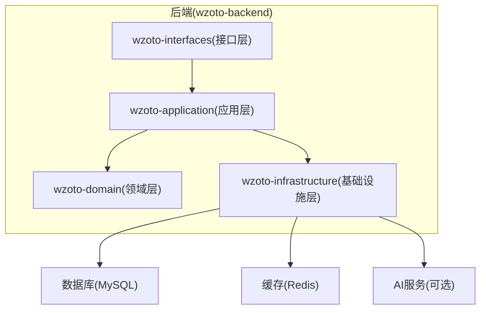
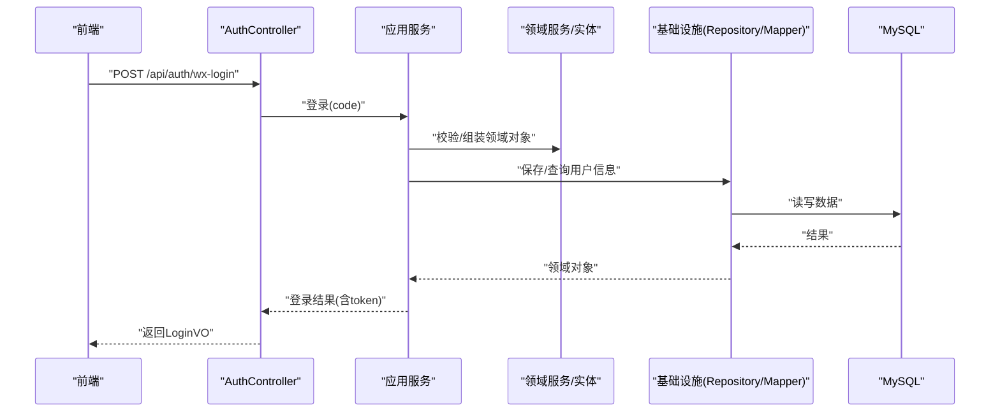
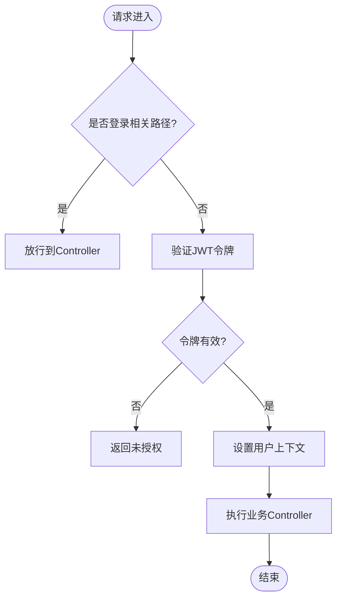
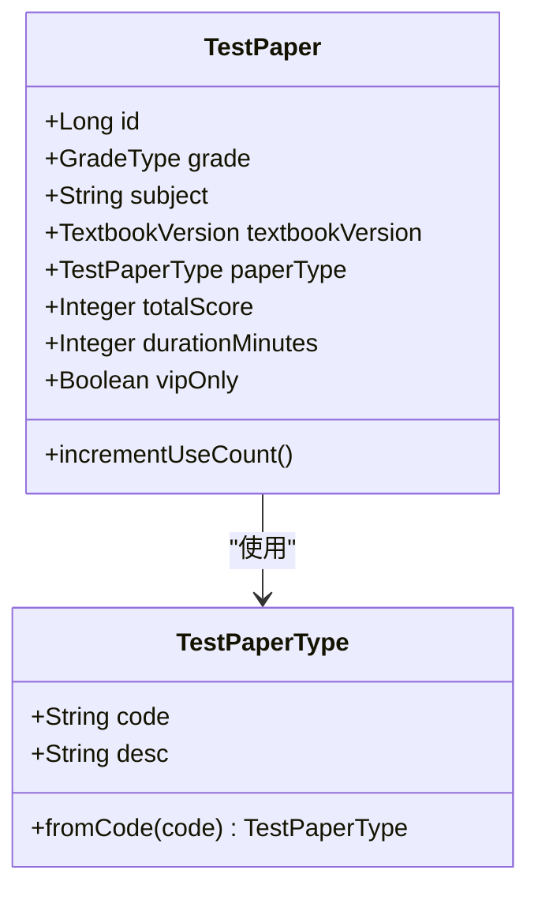
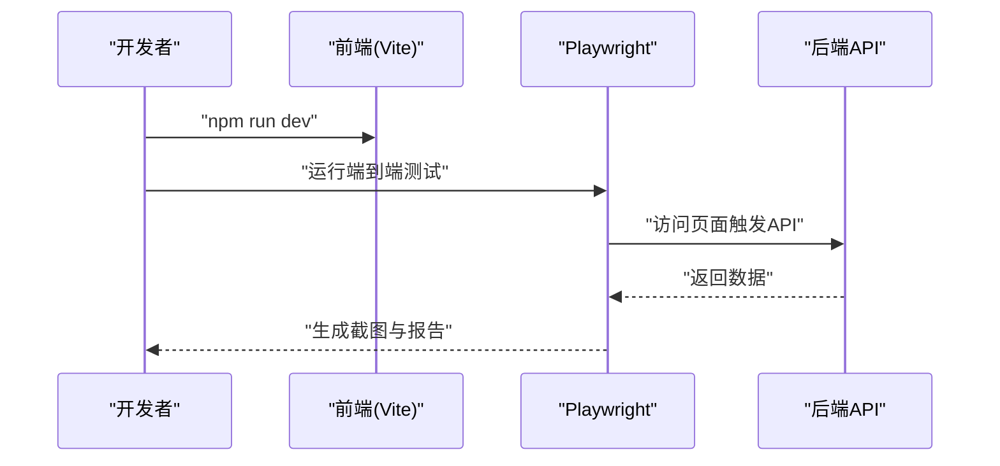
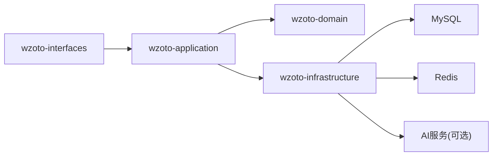

# 开发工作流

<cite>
**本文引用的文件**
- [wzoto-backend/pom.xml](file://wzoto-backend/pom.xml)
- [wzoto-backend/wzoto-application/pom.xml](file://wzoto-backend/wzoto-application/pom.xml)
- [wzoto-backend/wzoto-domain/pom.xml](file://wzoto-backend/wzoto-domain/pom.xml)
- [wzoto-backend/wzoto-infrastructure/pom.xml](file://wzoto-backend/wzoto-infrastructure/pom.xml)
- [wzoto-backend/wzoto-interfaces/pom.xml](file://wzoto-backend/wzoto-interfaces/pom.xml)
- [wzoto-backend/wzoto-interfaces/src/main/resources/application.yml](file://wzoto-backend/wzoto-interfaces/src/main/resources/application.yml)
- [wzoto-backend/wzoto-interfaces/src/main/java/com/wzoto/WzotoApplication.java](file://wzoto-backend/wzoto-interfaces/src/main/java/com/wzoto/WzotoApplication.java)
- [wzoto-backend/wzoto-interfaces/src/main/java/com/wzoto/interfaces/controller/AuthController.java](file://wzoto-backend/wzoto-interfaces/src/main/java/com/wzoto/interfaces/controller/AuthController.java)
- [wzoto-backend/wzoto-infrastructure/src/main/java/com/wzoto/infrastructure/config/WebMvcConfig.java](file://wzoto-backend/wzoto-infrastructure/src/main/java/com/wzoto/infrastructure/config/WebMvcConfig.java)
- [wzoto-backend/wzoto-domain/src/main/java/com/wzoto/domain/entity/TestPaper.java](file://wzoto-backend/wzoto-domain/src/main/java/com/wzoto/domain/entity/TestPaper.java)
- [wzoto-backend/wzoto-domain/src/main/java/com/wzoto/domain/valobj/TestPaperType.java](file://wzoto-backend/wzoto-domain/src/main/java/com/wzoto/domain/valobj/TestPaperType.java)
- [wzoto-backend/sql/seed_data_paper_audio.sql](file://wzoto-backend/sql/seed_data_paper_audio.sql)
- [wzoto-frontend/package.json](file://wzoto-frontend/package.json)
- [wzoto-frontend/tests/auto-test.mjs](file://wzoto-frontend/tests/auto-test.mjs)
</cite>

## 目录
1. [简介](#简介)
2. [项目结构](#项目结构)
3. [核心组件](#核心组件)
4. [架构总览](#架构总览)
5. [详细组件分析](#详细组件分析)
6. [依赖分析](#依赖分析)
7. [性能考虑](#性能考虑)
8. [故障排查指南](#故障排查指南)
9. [结论](#结论)
10. [附录](#附录)

## 简介
本文件为 wzoto 项目的标准化开发工作流程规范，覆盖需求分析、开发流程、代码审查、测试、发布、协作与持续集成等全链路环节。文档基于仓库现有后端 DDD 分层（domain/application/infrastructure/interfaces）、前端 Vue 工程以及 Playwright 自动化测试脚本进行梳理，确保流程可落地、可度量、可追溯。

## 项目结构
- 后端采用 Maven 多模块聚合工程，按 DDD 分层组织：
  - domain：领域实体、值对象、仓储接口、领域服务
  - application：应用服务编排，无业务逻辑
  - infrastructure：基础设施实现（MyBatis-Plus、Redis、JWT、配置）
  - interfaces：表示层（Controller、DTO/VO、统一响应、全局异常）
- 前端为 Vue + Vite 工程，使用 Element Plus、Pinia、ECharts，并内置 Playwright 端到端测试脚本
- 数据库脚本位于 sql 目录，用于初始化与种子数据

**图示来源**
- [wzoto-backend/pom.xml:21-26](file://wzoto-backend/pom.xml#L21-L26)
- [wzoto-backend/wzoto-infrastructure/pom.xml:16-71](file://wzoto-backend/wzoto-infrastructure/pom.xml#L16-L71)

**章节来源**
- [wzoto-backend/pom.xml:1-126](file://wzoto-backend/pom.xml#L1-L126)

## 核心组件
- 启动入口与扫描配置：Spring Boot 启动类启用 MapperScan 与重试注解
- Web MVC 配置：注册 JWT 拦截器，排除登录相关路径；开启全局 CORS
- 认证控制器：提供微信登录、身份选择、手机号绑定、开发环境直登等能力
- 领域模型：以 TestPaper 为例展示实体与值对象的组合关系
- 前端工程：Vite 构建脚本、Playwright 端到端测试脚本
- 配置中心：application.yml 管理数据库、Redis、JWT、微信、AI 等外部依赖

**章节来源**
- [wzoto-backend/wzoto-interfaces/src/main/java/com/wzoto/WzotoApplication.java:1-19](file://wzoto-backend/wzoto-interfaces/src/main/java/com/wzoto/WzotoApplication.java#L1-L19)
- [wzoto-backend/wzoto-infrastructure/src/main/java/com/wzoto/infrastructure/config/WebMvcConfig.java:1-42](file://wzoto-backend/wzoto-infrastructure/src/main/java/com/wzoto/infrastructure/config/WebMvcConfig.java#L1-L42)
- [wzoto-backend/wzoto-interfaces/src/main/java/com/wzoto/interfaces/controller/AuthController.java:1-149](file://wzoto-backend/wzoto-interfaces/src/main/java/com/wzoto/interfaces/controller/AuthController.java#L1-L149)
- [wzoto-backend/wzoto-domain/src/main/java/com/wzoto/domain/entity/TestPaper.java:1-46](file://wzoto-backend/wzoto-domain/src/main/java/com/wzoto/domain/entity/TestPaper.java#L1-L46)
- [wzoto-backend/wzoto-domain/src/main/java/com/wzoto/domain/valobj/TestPaperType.java:1-32](file://wzoto-backend/wzoto-domain/src/main/java/com/wzoto/domain/valobj/TestPaperType.java#L1-L32)
- [wzoto-frontend/package.json:1-27](file://wzoto-frontend/package.json#L1-L27)
- [wzoto-backend/wzoto-interfaces/src/main/resources/application.yml:1-51](file://wzoto-backend/wzoto-interfaces/src/main/resources/application.yml#L1-L51)

## 架构总览
后端遵循 DDD 分层，请求从 Controller 进入，调用 Application Service 编排用例，领域服务承载业务规则，Repository 抽象数据访问，Infrastructure 提供具体实现（MyBatis-Plus、Redis、JWT）。前端通过 API 与后端交互，并使用 Playwright 执行端到端测试。

**图示来源**
- [wzoto-backend/wzoto-interfaces/src/main/java/com/wzoto/interfaces/controller/AuthController.java:65-75](file://wzoto-backend/wzoto-interfaces/src/main/java/com/wzoto/interfaces/controller/AuthController.java#L65-L75)
- [wzoto-backend/wzoto-infrastructure/pom.xml:16-71](file://wzoto-backend/wzoto-infrastructure/pom.xml#L16-L71)

## 详细组件分析

### 认证与鉴权流程
- 登录接口：支持微信登录、身份选择、手机号绑定与开发环境直登
- 鉴权拦截：WebMvcConfig 对 /api/** 注册 JWT 拦截器，排除登录相关路径
- 上下文：UserContext 获取当前用户ID，结合 Repository 查询用户信息

**图示来源**
- [wzoto-backend/wzoto-infrastructure/src/main/java/com/wzoto/infrastructure/config/WebMvcConfig.java:21-31](file://wzoto-backend/wzoto-infrastructure/src/main/java/com/wzoto/infrastructure/config/WebMvcConfig.java#L21-L31)
- [wzoto-backend/wzoto-interfaces/src/main/java/com/wzoto/interfaces/controller/AuthController.java:34-127](file://wzoto-backend/wzoto-interfaces/src/main/java/com/wzoto/interfaces/controller/AuthController.java#L34-L127)

**章节来源**
- [wzoto-backend/wzoto-infrastructure/src/main/java/com/wzoto/infrastructure/config/WebMvcConfig.java:1-42](file://wzoto-backend/wzoto-infrastructure/src/main/java/com/wzoto/infrastructure/config/WebMvcConfig.java#L1-L42)
- [wzoto-backend/wzoto-interfaces/src/main/java/com/wzoto/interfaces/controller/AuthController.java:1-149](file://wzoto-backend/wzoto-interfaces/src/main/java/com/wzoto/interfaces/controller/AuthController.java#L1-L149)

### 领域模型与值对象
- 实体 TestPaper 包含年级、科目、教材版本、类型、题目JSON、VIP限制等字段
- 值对象 TestPaperType 定义试卷类型枚举并提供 fromCode 转换方法
- 领域内通过值对象保证状态一致性，实体封装行为（如使用计数自增）

**图示来源**
- [wzoto-backend/wzoto-domain/src/main/java/com/wzoto/domain/entity/TestPaper.java:1-46](file://wzoto-backend/wzoto-domain/src/main/java/com/wzoto/domain/entity/TestPaper.java#L1-L46)
- [wzoto-backend/wzoto-domain/src/main/java/com/wzoto/domain/valobj/TestPaperType.java:1-32](file://wzoto-backend/wzoto-domain/src/main/java/com/wzoto/domain/valobj/TestPaperType.java#L1-L32)

**章节来源**
- [wzoto-backend/wzoto-domain/src/main/java/com/wzoto/domain/entity/TestPaper.java:1-46](file://wzoto-backend/wzoto-domain/src/main/java/com/wzoto/domain/entity/TestPaper.java#L1-L46)
- [wzoto-backend/wzoto-domain/src/main/java/com/wzoto/domain/valobj/TestPaperType.java:1-32](file://wzoto-backend/wzoto-domain/src/main/java/com/wzoto/domain/valobj/TestPaperType.java#L1-L32)

### 前端工程与端到端测试
- 构建脚本：dev/build/preview 命令由 Vite 驱动
- 依赖：Vue、Element Plus、Pinia、ECharts、Axios、Playwright
- 端到端测试：Playwright 脚本自动截图、记录 API 调用、生成 HTML 报告

**图示来源**
- [wzoto-frontend/package.json:6-25](file://wzoto-frontend/package.json#L6-L25)
- [wzoto-frontend/tests/auto-test.mjs:1-340](file://wzoto-frontend/tests/auto-test.mjs#L1-L340)

**章节来源**
- [wzoto-frontend/package.json:1-27](file://wzoto-frontend/package.json#L1-L27)
- [wzoto-frontend/tests/auto-test.mjs:1-340](file://wzoto-frontend/tests/auto-test.mjs#L1-L340)

## 依赖分析
- 后端模块依赖：
  - interfaces 依赖 application 与 infrastructure
  - application 依赖 domain 与 infrastructure
  - infrastructure 依赖 domain，并引入 MyBatis-Plus、Redis、JWT、OKHttp、JSON 等
- 前端依赖：
  - 运行时：Vue、Element Plus、Pinia、ECharts、Axios
  - 开发时：Vite、Playwright

**图示来源**
- [wzoto-backend/wzoto-interfaces/pom.xml:16-41](file://wzoto-backend/wzoto-interfaces/pom.xml#L16-L41)
- [wzoto-backend/wzoto-application/pom.xml:16-41](file://wzoto-backend/wzoto-application/pom.xml#L16-L41)
- [wzoto-backend/wzoto-infrastructure/pom.xml:16-71](file://wzoto-backend/wzoto-infrastructure/pom.xml#L16-L71)

**章节来源**
- [wzoto-backend/wzoto-interfaces/pom.xml:1-60](file://wzoto-backend/wzoto-interfaces/pom.xml#L1-L60)
- [wzoto-backend/wzoto-application/pom.xml:1-43](file://wzoto-backend/wzoto-application/pom.xml#L1-L43)
- [wzoto-backend/wzoto-infrastructure/pom.xml:1-73](file://wzoto-backend/wzoto-infrastructure/pom.xml#L1-L73)

## 性能考虑
- 数据库连接与 SQL：
  - 使用 MyBatis-Plus 简化 CRUD，注意分页与索引设计
  - 日志输出级别在开发环境开启，生产建议降低以减少 I/O
- 缓存策略：
  - Redis 用于会话或热点数据缓存，合理设置过期时间
- 外部服务：
  - AI 服务默认关闭，避免不必要的网络开销；按需启用并配置超时与重试
- 前端：
  - 合理使用 ECharts 渲染大数据集，按需懒加载
  - 使用 Axios 拦截器统一处理错误与重试

[本节为通用指导，不直接分析具体文件]

## 故障排查指南
- 启动失败：
  - 检查 application.yml 中数据库、Redis、JWT、微信、AI 配置是否正确
  - 确认端口占用与环境变量注入
- 登录失败：
  - 核对微信登录参数与回调地址
  - 检查 JWT 密钥与有效期配置
- 跨域问题：
  - 确认 WebMvcConfig 的 CORS 配置允许前端域名与凭据
- 测试失败：
  - 检查 Playwright 浏览器安装与端口冲突
  - 核对前后端服务地址与路由

**章节来源**
- [wzoto-backend/wzoto-interfaces/src/main/resources/application.yml:1-51](file://wzoto-backend/wzoto-interfaces/src/main/resources/application.yml#L1-L51)
- [wzoto-backend/wzoto-infrastructure/src/main/java/com/wzoto/infrastructure/config/WebMvcConfig.java:21-41](file://wzoto-backend/wzoto-infrastructure/src/main/java/com/wzoto/infrastructure/config/WebMvcConfig.java#L21-L41)
- [wzoto-frontend/tests/auto-test.mjs:1-340](file://wzoto-frontend/tests/auto-test.mjs#L1-L340)

## 结论
本工作流以 DDD 分层与前后端分离为基础，结合 Playwright 端到端测试与统一的配置管理，形成从需求到发布的闭环。建议在团队内严格执行分支策略、代码审查标准与自动化流水线，保障交付质量与效率。

## 附录

### 标准化开发工作流程（落地清单）

- 需求分析流程
  - 需求评审：明确范围、验收标准、风险点
  - 技术方案设计：分层职责、接口契约、数据模型
  - 工作量评估：按任务拆分与复杂度评估

- 开发流程
  - 功能分支创建：feature/xxx
  - 代码实现：遵循 DDD 分层与命名规范
  - 单元测试编写：覆盖关键领域逻辑
  - 集成测试验证：接口联调与数据准备

- 代码审查流程
  - Pull Request 创建：关联需求与测试报告
  - 审查标准：可读性、健壮性、性能、安全
  - 反馈处理：评论-修改-复验闭环
  - 合并确认：至少一名负责人批准

- 测试流程
  - 单元测试覆盖率：建议≥80%
  - 接口测试：Postman/Apifox 用例集
  - 端到端测试：Playwright 脚本定期执行
  - 性能测试：压测关键接口与页面

- 发布流程
  - 版本标签管理：vX.Y.Z 语义化版本
  - 构建打包：Maven 构建后端，Vite 构建前端
  - 部署验证：健康检查、冒烟测试
  - 回滚策略：快速回退至上一稳定版本

- 协作流程
  - 任务分配：看板与优先级
  - 进度跟踪：每日站会与周报
  - 问题上报：缺陷分级与修复SLA
  - 知识分享：技术沉淀与复盘

- 持续集成
  - 自动化构建：提交即构建
  - 代码质量检查：静态扫描与规范校验
  - 自动化测试：单元、接口、端到端
  - 部署流水线：预发与生产环境灰度

[本节为流程规范说明，不直接分析具体文件]