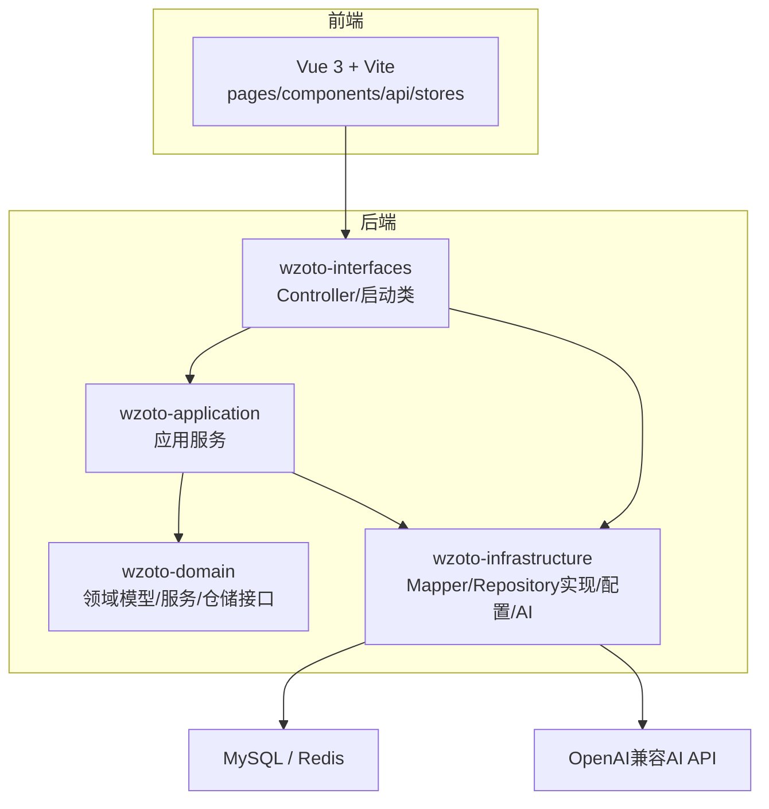
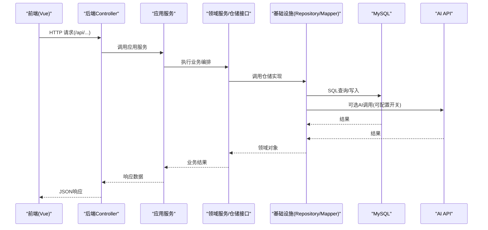
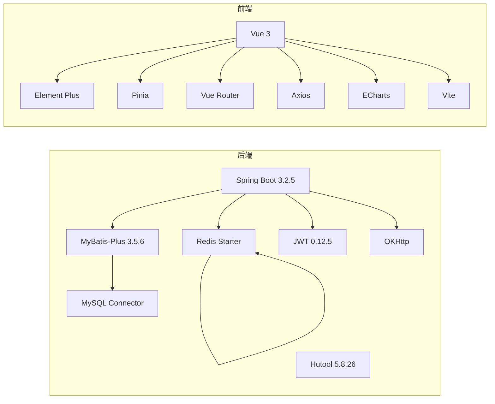

# 开发指南

<cite>
**本文引用的文件**
- [wzoto-backend/pom.xml](file://wzoto-backend/pom.xml)
- [wzoto-backend/wzoto-infrastructure/pom.xml](file://wzoto-backend/wzoto-infrastructure/pom.xml)
- [wzoto-backend/wzoto-application/pom.xml](file://wzoto-backend/wzoto-application/pom.xml)
- [wzoto-backend/wzoto-interfaces/src/main/resources/application.yml](file://wzoto-backend/wzoto-interfaces/src/main/resources/application.yml)
- [wzoto-backend/wzoto-interfaces/src/main/java/com/wzoto/WzotoApplication.java](file://wzoto-backend/wzoto-interfaces/src/main/java/com/wzoto/WzotoApplication.java)
- [wzoto-backend/wzoto-interfaces/src/main/java/com/wzoto/interfaces/common/GlobalExceptionHandler.java](file://wzoto-backend/wzoto-interfaces/src/main/java/com/wzoto/interfaces/common/GlobalExceptionHandler.java)
- [wzoto-frontend/package.json](file://wzoto-frontend/package.json)
- [wzoto-frontend/vite.config.js](file://wzoto-frontend/vite.config.js)
- [wzoto-frontend/src/main.js](file://wzoto-frontend/src/main.js)
- [wzoto-backend/sql/init_all_learning_tables.sql](file://wzoto-backend/sql/init_all_learning_tables.sql)
- [wzoto-backend/sql/init_test_data.sql](file://wzoto-backend/sql/init_test_data.sql)
- [wzoto-backend/scripts/generate-learning-resources.mjs](file://wzoto-backend/scripts/generate-learning-resources.mjs)
- [docs/单页面原型说明文档.md](file://docs/单页面原型说明文档.md)
</cite>

## 目录
1. [简介](#简介)
2. [项目结构](#项目结构)
3. [核心组件](#核心组件)
4. [架构总览](#架构总览)
5. [详细组件分析](#详细组件分析)
6. [依赖分析](#依赖分析)
7. [性能考虑](#性能考虑)
8. [故障排查指南](#故障排查指南)
9. [结论](#结论)
10. [附录](#附录)

## 简介
本指南面向wzoto项目的开发者，覆盖开发环境搭建、代码规范、项目结构、开发工作流、新功能开发流程、性能优化与常见问题排查等。项目采用前后端分离架构：后端基于Spring Boot 3 + MyBatis-Plus的DDD分层（domain/application/infrastructure/interfaces），前端基于Vue 3 + Vite + Element Plus + Pinia + Vue Router。

## 项目结构
- 后端模块划分
  - wzoto-domain：领域模型、值对象、领域服务、仓储接口
  - wzoto-application：应用服务，编排用例，无业务逻辑
  - wzoto-infrastructure：基础设施实现，包括MyBatis Mapper、Repository实现、配置、工具类、AI集成
  - wzoto-interfaces：Web接口层，Controller、DTO/VO、全局异常处理、启动入口
- 前端工程
  - src/pages：按功能域组织页面
  - src/components：可复用组件
  - src/api：按模块划分的API封装
  - src/stores：Pinia状态管理
  - vite.config.js：Vite构建与代理配置
- 数据库脚本
  - sql：建表、初始化数据、测试数据、资源生成脚本等

图表来源
- [wzoto-backend/pom.xml:21-26](file://wzoto-backend/pom.xml#L21-L26)
- [wzoto-backend/wzoto-interfaces/src/main/java/com/wzoto/WzotoApplication.java:11-13](file://wzoto-backend/wzoto-interfaces/src/main/java/com/wzoto/WzotoApplication.java#L11-L13)
- [wzoto-backend/wzoto-infrastructure/pom.xml:16-70](file://wzoto-backend/wzoto-infrastructure/pom.xml#L16-L70)
- [wzoto-frontend/package.json:11-24](file://wzoto-frontend/package.json#L11-L24)

章节来源
- [wzoto-backend/pom.xml:21-26](file://wzoto-backend/pom.xml#L21-L26)
- [wzoto-frontend/package.json:11-24](file://wzoto-frontend/package.json#L11-L24)

## 核心组件
- 启动与扫描
  - Spring Boot启动类启用重试注解并扫描Mapper包
- 配置中心
  - application.yml集中配置服务器端口、上下文路径、数据源、Redis、MyBatis-Plus、JWT、微信、AI开关与参数、日志级别
- 全局异常处理
  - 统一捕获参数校验、绑定异常、运行时异常等，返回标准响应体
- 前端应用
  - Vue 3 + Pinia + Element Plus + Vue Router，Vite代理到后端8080端口

章节来源
- [wzoto-backend/wzoto-interfaces/src/main/java/com/wzoto/WzotoApplication.java:11-13](file://wzoto-backend/wzoto-interfaces/src/main/java/com/wzoto/WzotoApplication.java#L11-L13)
- [wzoto-backend/wzoto-interfaces/src/main/resources/application.yml:1-51](file://wzoto-backend/wzoto-interfaces/src/main/resources/application.yml#L1-L51)
- [wzoto-backend/wzoto-interfaces/src/main/java/com/wzoto/interfaces/common/GlobalExceptionHandler.java:14-66](file://wzoto-backend/wzoto-interfaces/src/main/java/com/wzoto/interfaces/common/GlobalExceptionHandler.java#L14-L66)
- [wzoto-frontend/src/main.js:1-16](file://wzoto-frontend/src/main.js#L1-L16)
- [wzoto-frontend/vite.config.js:12-19](file://wzoto-frontend/vite.config.js#L12-L19)

## 架构总览
后端采用DDD四层：
- interfaces：接收HTTP请求，参数校验，调用应用服务
- application：用例编排，事务边界，协调领域服务与仓储
- domain：核心业务规则与实体、值对象、领域服务
- infrastructure：持久化、缓存、第三方服务（AI）等实现

前端通过Vite代理将/api请求转发至后端8080端口，使用Element Plus提供UI能力，Pinia管理状态。

图表来源
- [wzoto-backend/wzoto-interfaces/src/main/java/com/wzoto/WzotoApplication.java:11-13](file://wzoto-backend/wzoto-interfaces/src/main/java/com/wzoto/WzotoApplication.java#L11-L13)
- [wzoto-backend/wzoto-infrastructure/pom.xml:16-70](file://wzoto-backend/wzoto-infrastructure/pom.xml#L16-L70)
- [wzoto-backend/wzoto-interfaces/src/main/resources/application.yml:32-46](file://wzoto-backend/wzoto-interfaces/src/main/resources/application.yml#L32-L46)
- [wzoto-frontend/vite.config.js:12-19](file://wzoto-frontend/vite.config.js#L12-L19)

## 详细组件分析

### 后端启动与配置
- 启动类
  - 启用Spring Boot自动装配、Mapper扫描、重试机制
- 应用配置
  - 数据源、Redis、MyBatis-Plus映射、逻辑删除、日志级别
  - JWT密钥、过期时间；微信AppId/Secret；AI开关、BaseURL、API Key、模型、温度等
- 建议
  - 生产环境务必通过环境变量注入敏感信息（MYSQL_PASSWORD、REDIS_*、JWT_SECRET、WECHAT_*、AI_*）

章节来源
- [wzoto-backend/wzoto-interfaces/src/main/java/com/wzoto/WzotoApplication.java:11-13](file://wzoto-backend/wzoto-interfaces/src/main/java/com/wzoto/WzotoApplication.java#L11-L13)
- [wzoto-backend/wzoto-interfaces/src/main/resources/application.yml:1-51](file://wzoto-backend/wzoto-interfaces/src/main/resources/application.yml#L1-L51)

### 全局异常处理
- 统一捕获非法参数、状态异常、参数校验失败、绑定失败、运行时异常及系统异常
- 输出警告或错误日志，返回统一响应格式
- 便于前端统一处理错误提示

章节来源
- [wzoto-backend/wzoto-interfaces/src/main/java/com/wzoto/interfaces/common/GlobalExceptionHandler.java:14-66](file://wzoto-backend/wzoto-interfaces/src/main/java/com/wzoto/interfaces/common/GlobalExceptionHandler.java#L14-L66)

### 前端工程与代理
- 技术栈
  - Vue 3、Element Plus、Pinia、Vue Router、ECharts、Axios
- 开发服务器
  - Vite代理/api到http://localhost:8080，解决跨域问题
- 应用初始化
  - 挂载Pinia、Router、Element Plus中文语言包

章节来源
- [wzoto-frontend/package.json:11-24](file://wzoto-frontend/package.json#L11-L24)
- [wzoto-frontend/vite.config.js:12-19](file://wzoto-frontend/vite.config.js#L12-L19)
- [wzoto-frontend/src/main.js:1-16](file://wzoto-frontend/src/main.js#L1-L16)

### 数据库与脚本
- 建库与表
  - 学习资源相关表、练习题库、微课、试卷音频、知识点、课程观看记录等
- 测试数据
  - 提供初始测试数据脚本，便于本地联调
- 资源生成
  - 提供Node脚本批量生成学习资源SQL，支持分批插入与统计

章节来源
- [wzoto-backend/sql/init_all_learning_tables.sql:1-200](file://wzoto-backend/sql/init_all_learning_tables.sql#L1-L200)
- [wzoto-backend/sql/init_test_data.sql:1-200](file://wzoto-backend/sql/init_test_data.sql#L1-L200)
- [wzoto-backend/scripts/generate-learning-resources.mjs:510-531](file://wzoto-backend/scripts/generate-learning-resources.mjs#L510-L531)

## 依赖分析
- 后端依赖
  - Spring Boot 3.2.5、MyBatis-Plus 3.5.6、Hutool 5.8.26、JWT 0.12.5、OKHttp、JSON库
  - MySQL驱动、Redis Starter
- 前端依赖
  - Vue 3、Element Plus、Pinia、Vue Router、ECharts、Axios、Sass、Vite、Playwright

图表来源
- [wzoto-backend/pom.xml:28-90](file://wzoto-backend/pom.xml#L28-L90)
- [wzoto-backend/wzoto-infrastructure/pom.xml:16-70](file://wzoto-backend/wzoto-infrastructure/pom.xml#L16-L70)
- [wzoto-frontend/package.json:11-24](file://wzoto-frontend/package.json#L11-L24)

章节来源
- [wzoto-backend/pom.xml:28-90](file://wzoto-backend/pom.xml#L28-L90)
- [wzoto-backend/wzoto-infrastructure/pom.xml:16-70](file://wzoto-backend/wzoto-infrastructure/pom.xml#L16-L70)
- [wzoto-frontend/package.json:11-24](file://wzoto-frontend/package.json#L11-L24)

## 性能考虑
- 后端
  - 合理使用MyBatis-Plus分页与条件构造，避免全表扫描
  - 对热点数据使用Redis缓存（如字典、配置、短时效列表）
  - 开启重试注解用于外部调用（如AI）的幂等与容错
  - 合理设置日志级别，生产关闭DEBUG
- 前端
  - 使用路由懒加载与组件按需引入减少首屏体积
  - 图片与静态资源走CDN，启用Gzip/Brotli压缩
  - 列表分页与虚拟滚动，避免一次性渲染大量节点
  - 网络请求合并与防抖节流，减少重复请求
- 数据库
  - 为高频查询字段建立索引，避免SELECT *
  - 大字段分表或归档，控制单表规模
  - 慢查询分析与执行计划优化

[本节为通用指导，不直接分析具体文件]

## 故障排查指南
- 启动与配置
  - 检查application.yml中数据库、Redis、JWT、微信、AI等配置是否正确，生产环境使用环境变量注入
  - 确认端口未被占用，上下文路径正确
- 接口报错
  - 查看全局异常处理器输出的日志，定位参数校验失败或业务异常
  - 使用浏览器Network面板与后端日志对照，核对请求参数与响应体
- 数据库问题
  - 检查连接串、账号密码、时区、字符集
  - 使用SQL脚本初始化或回滚，确保表结构与数据一致
- 前端代理
  - 确认vite.config.js中代理目标地址与后端端口一致
  - 检查跨域与CORS配置（如需）
- AI调用
  - 根据开关控制是否启用真实AI调用，调试阶段可保持Mock模式
  - 检查BaseURL、API Key、模型名称与温度参数

章节来源
- [wzoto-backend/wzoto-interfaces/src/main/resources/application.yml:1-51](file://wzoto-backend/wzoto-interfaces/src/main/resources/application.yml#L1-L51)
- [wzoto-backend/wzoto-interfaces/src/main/java/com/wzoto/interfaces/common/GlobalExceptionHandler.java:14-66](file://wzoto-backend/wzoto-interfaces/src/main/java/com/wzoto/interfaces/common/GlobalExceptionHandler.java#L14-L66)
- [wzoto-frontend/vite.config.js:12-19](file://wzoto-frontend/vite.config.js#L12-L19)

## 结论
wzoto项目采用清晰的DDD分层与现代化前端技术栈，具备良好的扩展性与可维护性。通过统一的异常处理、完善的配置管理与脚本化工具，能够快速搭建本地开发环境并进行联调。建议在团队内统一代码规范与工作流，持续优化性能与稳定性。

[本节为总结性内容，不直接分析具体文件]

## 附录

### 开发环境搭建
- 后端
  - JDK 21、Maven、MySQL、Redis
  - 导入多模块工程，编译打包
  - 执行sql脚本初始化数据库与测试数据
  - 修改application.yml或环境变量配置数据库、Redis、JWT、微信、AI
  - 启动WzotoApplication
- 前端
  - Node.js（推荐18+）、pnpm/yarn/npm
  - 安装依赖，启动开发服务器
  - 通过Vite代理访问后端接口
- IDE与插件
  - IDEA：Lombok、MyBatisX、Spring Boot Assistant、Alibaba Java Coding Guidelines
  - VS Code：Vue Official、ESLint、Prettier、Volar、GitLens
- 调试工具
  - 后端：IDE断点、日志、Postman/Apifox
  - 前端：浏览器开发者工具、Network、Console、Vue Devtools

[本节为通用指导，不直接分析具体文件]

### 代码规范
- Java编码规范
  - 遵循阿里巴巴Java开发手册
  - 统一命名：包名小写、类名驼峰、方法名动词短语、常量全大写
  - 使用Lombok简化样板代码，避免过度使用
  - 异常处理：抛出明确异常，结合全局异常处理器统一返回
- Vue组件规范
  - 组件命名PascalCase，单文件组件拆分清晰
  - 样式使用SCSS，模块化命名
  - 状态管理使用Pinia，避免在组件内散落状态
  - API封装统一使用Axios实例，拦截器处理token与错误
- Git提交规范
  - 分支策略：feature/*、bugfix/*、release/*、hotfix/*
  - 提交信息：feat/fix/docs/style/refactor/test/chore等前缀
  - 合并策略：Pull Request + 至少一人Review后合并

[本节为通用指导，不直接分析具体文件]

### 项目结构约定
- 包命名
  - com.wzoto.interfaces.controller、com.wzoto.application.service、com.wzoto.domain.entity/service/repository、com.wzoto.infrastructure.mapper/repository/config/util
- 文件命名
  - Controller以Resource结尾，Service以ApplicationService结尾，Entity与PO区分清晰
  - DTO/VO按模块分包，避免污染领域模型
- 前端目录
  - pages按功能域组织，components按类型组织，api按模块组织，stores按模块组织

[本节为通用指导，不直接分析具体文件]

### 开发工作流
- 分支管理
  - 从develop拉取feature分支，完成后提交PR
  - 主分支保护，禁止直接推送
- 代码审查
  - 至少一名Reviewer，关注设计、可读性、性能与安全性
- 合并策略
  - Squash Merge或Rebase Merge，保持历史整洁
  - 发布前进行回归测试与性能验证

[本节为通用指导，不直接分析具体文件]

### 新功能开发指南
- 需求分析
  - 明确用户故事、验收标准、边界条件
- 设计文档
  - 接口定义（入参/出参/错误码）、领域模型变更、数据库变更
- 代码实现
  - 先Domain再Application，最后Infrastructure与Interfaces
  - 编写单元测试与集成测试
- 测试验证
  - 本地联调、自动化测试、性能压测
  - 灰度发布与监控告警

[本节为通用指导，不直接分析具体文件]

### 性能优化清单
- 代码优化
  - 避免N+1查询，合理使用JOIN或批量查询
  - 减少对象创建与GC压力
- 数据库优化
  - 索引优化、慢查询治理、读写分离
- 前端优化
  - 资源压缩、懒加载、缓存策略、骨架屏与错误降级

[本节为通用指导，不直接分析具体文件]

### 常见问题排查
- 启动失败
  - 检查端口占用、数据库连接、Redis连接、环境变量
- 接口400/422
  - 查看全局异常处理器日志，定位参数校验失败
- 接口500
  - 查看运行时异常堆栈，定位空指针、越界、外部依赖异常
- 前端无法请求后端
  - 检查代理配置、跨域、Token携带

章节来源
- [wzoto-backend/wzoto-interfaces/src/main/resources/application.yml:1-51](file://wzoto-backend/wzoto-interfaces/src/main/resources/application.yml#L1-L51)
- [wzoto-backend/wzoto-interfaces/src/main/java/com/wzoto/interfaces/common/GlobalExceptionHandler.java:14-66](file://wzoto-backend/wzoto-interfaces/src/main/java/com/wzoto/interfaces/common/GlobalExceptionHandler.java#L14-L66)
- [wzoto-frontend/vite.config.js:12-19](file://wzoto-frontend/vite.config.js#L12-L19)

### 效率提升技巧
- 模板与脚手架
  - 使用IDEA Live Templates快速生成CRUD代码
  - 前端使用Vite插件与组件库加速开发
- 自动化
  - 使用脚本批量生成SQL与测试数据
  - 配置ESLint/Prettier与Git Hooks保证代码质量
- 文档与协作
  - 使用在线文档与API文档工具，保持接口契约同步

[本节为通用指导，不直接分析具体文件]