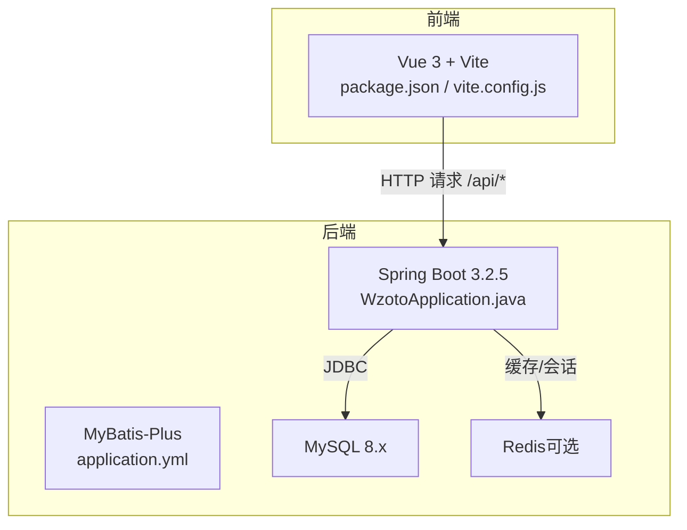
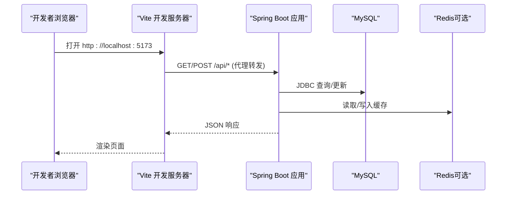
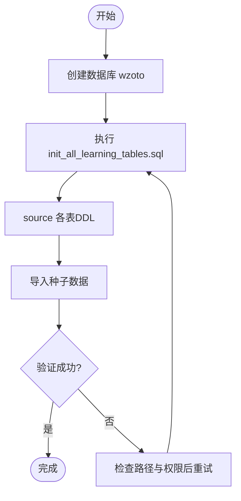
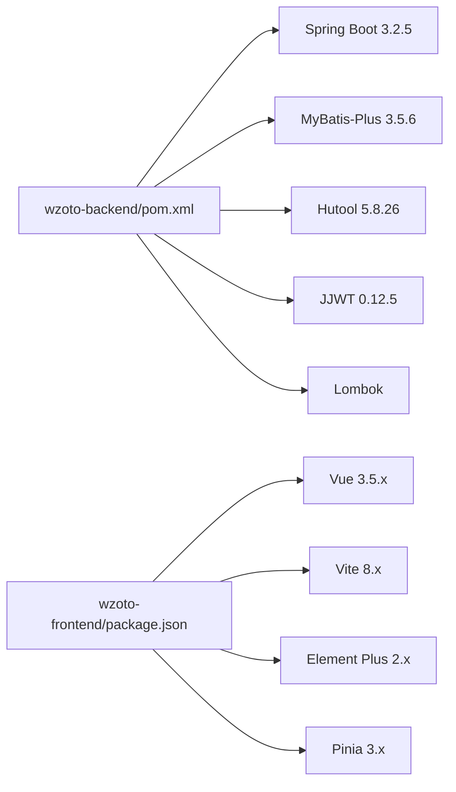

# 开发环境搭建

<cite>
**本文引用的文件**
- [wzoto-backend/pom.xml](file://wzoto-backend/pom.xml)
- [wzoto-backend/wzoto-interfaces/src/main/resources/application.yml](file://wzoto-backend/wzoto-interfaces/src/main/resources/application.yml)
- [wzoto-backend/wzoto-interfaces/pom.xml](file://wzoto-backend/wzoto-interfaces/pom.xml)
- [wzoto-backend/wzoto-interfaces/src/main/java/com/wzoto/WzotoApplication.java](file://wzoto-backend/wzoto-interfaces/src/main/java/com/wzoto/WzotoApplication.java)
- [wzoto-frontend/package.json](file://wzoto-frontend/package.json)
- [wzoto-frontend/vite.config.js](file://wzoto-frontend/vite.config.js)
- [wzoto-frontend/src/main.js](file://wzoto-frontend/src/main.js)
- [wzoto-backend/sql/init_all_learning_tables.sql](file://wzoto-backend/sql/init_all_learning_tables.sql)
</cite>

## 目录
1. [简介](#简介)
2. [项目结构](#项目结构)
3. [核心组件](#核心组件)
4. [架构总览](#架构总览)
5. [详细组件分析](#详细组件分析)
6. [依赖分析](#依赖分析)
7. [性能考虑](#性能考虑)
8. [故障排查指南](#故障排查指南)
9. [结论](#结论)
10. [附录](#附录)

## 简介
本指南面向wzoto项目的开发者，提供从零开始搭建本地开发环境的完整步骤。内容覆盖：
- Java 21 与 Maven 安装配置
- Node.js 与 npm 安装配置
- IDE 推荐设置（IntelliJ IDEA、VS Code）
- MySQL 数据库准备与初始化脚本执行
- 前后端服务启动流程
- 环境变量与敏感信息配置（application.yml、微信API密钥、AI服务）
- 常见问题定位与解决（端口冲突、依赖下载失败、数据库连接问题）

## 项目结构
wzoto采用前后端分离架构：
- 后端：基于Spring Boot 3.2.5的多模块Maven工程，使用MyBatis-Plus进行数据访问，JWT鉴权，支持Redis缓存，模块化分层清晰（domain/infrastructure/application/interfaces）。
- 前端：基于Vue 3 + Vite的SPA应用，Element Plus UI库，Pinia状态管理，通过Vite代理转发到后端接口。

图表来源
- [wzoto-backend/wzoto-interfaces/src/main/java/com/wzoto/WzotoApplication.java:1-19](file://wzoto-backend/wzoto-interfaces/src/main/java/com/wzoto/WzotoApplication.java#L1-L19)
- [wzoto-backend/wzoto-interfaces/src/main/resources/application.yml:1-51](file://wzoto-backend/wzoto-interfaces/src/main/resources/application.yml#L1-L51)
- [wzoto-frontend/package.json:1-27](file://wzoto-frontend/package.json#L1-L27)
- [wzoto-frontend/vite.config.js:1-21](file://wzoto-frontend/vite.config.js#L1-L21)

章节来源
- [wzoto-backend/pom.xml:1-126](file://wzoto-backend/pom.xml#L1-L126)
- [wzoto-backend/wzoto-interfaces/pom.xml:1-60](file://wzoto-backend/wzoto-interfaces/pom.xml#L1-L60)
- [wzoto-backend/wzoto-interfaces/src/main/resources/application.yml:1-51](file://wzoto-backend/wzoto-interfaces/src/main/resources/application.yml#L1-L51)
- [wzoto-frontend/package.json:1-27](file://wzoto-frontend/package.json#L1-L27)
- [wzoto-frontend/vite.config.js:1-21](file://wzoto-frontend/vite.config.js#L1-L21)

## 核心组件
- 后端入口：WzotoApplication 启动类，启用Spring Boot自动装配、Mapper扫描与重试机制。
- 数据访问：MyBatis-Plus作为ORM框架，全局开启驼峰映射、逻辑删除等。
- 安全与认证：JWT令牌生成与校验（secret可通过环境变量注入）。
- 外部集成：
  - 微信登录/支付相关：AppId与AppSecret通过环境变量注入。
  - AI能力：OpenAI兼容API，开关、模型、温度等均可通过环境变量控制。
- 前端构建：Vite开发服务器，默认将/api请求代理至http://localhost:8080。

章节来源
- [wzoto-backend/wzoto-interfaces/src/main/java/com/wzoto/WzotoApplication.java:1-19](file://wzoto-backend/wzoto-interfaces/src/main/java/com/wzoto/WzotoApplication.java#L1-L19)
- [wzoto-backend/wzoto-interfaces/src/main/resources/application.yml:1-51](file://wzoto-backend/wzoto-interfaces/src/main/resources/application.yml#L1-L51)
- [wzoto-frontend/vite.config.js:1-21](file://wzoto-frontend/vite.config.js#L1-L21)

## 架构总览
下图展示了开发环境下的关键组件交互：前端通过Vite代理调用后端REST API；后端通过MyBatis-Plus访问MySQL，并可连接Redis；敏感配置通过环境变量注入，避免硬编码。

图表来源
- [wzoto-frontend/vite.config.js:12-18](file://wzoto-frontend/vite.config.js#L12-L18)
- [wzoto-backend/wzoto-interfaces/src/main/resources/application.yml:6-17](file://wzoto-backend/wzoto-interfaces/src/main/resources/application.yml#L6-L17)

## 详细组件分析

### 环境与工具链
- Java 21
  - 要求：JDK 21（maven.compiler.source/target=21）
  - 验证：java -version
- Maven
  - 要求：Maven 3.8+（配合Spring Boot 3.2.5）
  - 验证：mvn -v
- Node.js 与 npm
  - 要求：Node.js 18+（Vite 8.x 推荐）
  - 验证：node -v, npm -v

章节来源
- [wzoto-backend/pom.xml:28-37](file://wzoto-backend/pom.xml#L28-L37)
- [wzoto-frontend/package.json:21-25](file://wzoto-frontend/package.json#L21-L25)

### 数据库与环境变量
- MySQL
  - 版本：建议8.x
  - 字符集：utf8mb4
  - 创建数据库：wzoto
  - 初始化脚本：按顺序执行sql目录中的DDL与种子数据脚本（例如init_all_learning_tables.sql会source多个表定义与种子数据）
- Redis（可选）
  - 若启用，需配置host/port/password/database
- 环境变量（application.yml中通过${...}注入）
  - MYSQL_PASSWORD：数据库密码
  - REDIS_HOST/REDIS_PORT/REDIS_PASSWORD：Redis连接参数
  - JWT_SECRET：JWT签名密钥（至少32字符）
  - WECHAT_APP_ID/WECHAT_APP_SECRET：微信开放平台或小程序配置
  - AI_ENABLED/AI_BASE_URL/AI_API_KEY/AI_MODEL/AI_TEMPERATURE：AI服务开关与参数

章节来源
- [wzoto-backend/wzoto-interfaces/src/main/resources/application.yml:6-46](file://wzoto-backend/wzoto-interfaces/src/main/resources/application.yml#L6-L46)
- [wzoto-backend/sql/init_all_learning_tables.sql:1-31](file://wzoto-backend/sql/init_all_learning_tables.sql#L1-L31)

### IDE与插件推荐
- IntelliJ IDEA
  - Lombok：启用注解处理器，确保编译期生成getter/setter等代码
  - MyBatis-Plus：安装插件以获得SQL提示与实体映射增强
  - Vue支持：可安装Vue.js插件以支持模板语法高亮与跳转
  - 注意：在Settings > Build > Compiler > Annotation Processors中勾选“Enable annotation processing”
- VS Code（前端）
  - Vue Language Features（Volar）
  - ESLint、Prettier
  - Element Plus Snippets（可选）
  - SCSS/Sass支持

章节来源
- [wzoto-backend/pom.xml:93-104](file://wzoto-backend/pom.xml#L93-L104)
- [wzoto-backend/pom.xml:106-124](file://wzoto-backend/pom.xml#L106-L124)
- [wzoto-frontend/package.json:11-25](file://wzoto-frontend/package.json#L11-L25)

### 后端服务启动
- 进入后端根目录：wzoto-backend
- 构建并运行：
  - mvn clean install
  - 运行主类：com.wzoto.WzotoApplication
- 默认监听端口：8080（可在application.yml中修改）
- 启动后访问：http://localhost:8080

章节来源
- [wzoto-backend/wzoto-interfaces/src/main/java/com/wzoto/WzotoApplication.java:11-18](file://wzoto-backend/wzoto-interfaces/src/main/java/com/wzoto/WzotoApplication.java#L11-L18)
- [wzoto-backend/wzoto-interfaces/src/main/resources/application.yml:1-4](file://wzoto-backend/wzoto-interfaces/src/main/resources/application.yml#L1-L4)

### 前端服务启动
- 进入前端目录：wzoto-frontend
- 安装依赖：npm install
- 启动开发服务器：npm run dev
- 默认访问：http://localhost:5173
- 接口代理：所有/api请求将被转发到http://localhost:8080

章节来源
- [wzoto-frontend/package.json:6-9](file://wzoto-frontend/package.json#L6-L9)
- [wzoto-frontend/vite.config.js:12-18](file://wzoto-frontend/vite.config.js#L12-L18)

### 数据库初始化流程
- 创建数据库wzoto
- 执行初始化脚本：
  - 先执行init_all_learning_tables.sql（该脚本会source多个表定义与种子数据）
  - 按需执行其他业务表与测试数据脚本
- 确认表结构与数据已就绪

图表来源
- [wzoto-backend/sql/init_all_learning_tables.sql:17-30](file://wzoto-backend/sql/init_all_learning_tables.sql#L17-L30)

章节来源
- [wzoto-backend/sql/init_all_learning_tables.sql:1-31](file://wzoto-backend/sql/init_all_learning_tables.sql#L1-L31)

## 依赖分析
- 后端技术栈
  - Spring Boot 3.2.5（父POM）
  - MyBatis-Plus 3.5.6
  - Hutool 5.8.26
  - JJWT 0.12.5
  - Lombok（编译期注解处理）
- 前端技术栈
  - Vue 3.5.x
  - Vite 8.x
  - Element Plus 2.x
  - Pinia 3.x
  - Axios、ECharts等

图表来源
- [wzoto-backend/pom.xml:28-90](file://wzoto-backend/pom.xml#L28-L90)
- [wzoto-frontend/package.json:11-25](file://wzoto-frontend/package.json#L11-L25)

章节来源
- [wzoto-backend/pom.xml:28-90](file://wzoto-backend/pom.xml#L28-L90)
- [wzoto-frontend/package.json:11-25](file://wzoto-frontend/package.json#L11-L25)

## 性能考虑
- 数据库连接池：生产环境建议配置合理的连接池大小与超时时间（当前为默认值）
- Redis缓存：热点数据可借助Redis降低数据库压力
- 日志级别：开发阶段可使用debug便于定位问题，生产环境建议调整为info或warn
- 前端构建：Vite具备快速热更新，适合开发调试

[本节为通用指导，不直接分析具体文件]

## 故障排查指南
- 端口冲突
  - 现象：后端8080或前端5173端口被占用
  - 解决：修改application.yml中的server.port或vite.config.js中的server.port
- 依赖下载失败
  - 现象：Maven或npm安装依赖缓慢或失败
  - 解决：配置国内镜像源（Maven中央仓库镜像、npm淘宝镜像），或使用代理网络
- 数据库连接失败
  - 现象：启动时报错无法连接MySQL
  - 排查：
    - 确认数据库地址、端口、用户名、密码正确
    - 检查MYSQL_PASSWORD环境变量是否设置
    - 确认数据库wzoto存在且字符集为utf8mb4
    - 检查防火墙与安全组策略
- Redis连接失败
  - 现象：应用启动或运行时出现Redis连接异常
  - 排查：
    - 确认REDIS_HOST/REDIS_PORT/REDIS_PASSWORD是否正确
    - 检查Redis服务是否启动及网络可达
- 微信/AI服务配置错误
  - 现象：调用微信或AI接口返回鉴权失败或空结果
  - 排查：
    - 确认WECHAT_APP_ID/WECHAT_APP_SECRET已正确配置
    - 确认AI_ENABLED、AI_BASE_URL、AI_API_KEY、AI_MODEL等环境变量有效

章节来源
- [wzoto-backend/wzoto-interfaces/src/main/resources/application.yml:1-46](file://wzoto-backend/wzoto-interfaces/src/main/resources/application.yml#L1-L46)

## 结论
按照本指南完成Java 21、Maven、Node.js、IDE、MySQL与Redis的环境准备后，即可顺利启动wzoto前后端服务。通过环境变量管理敏感配置，结合Vite代理与MyBatis-Plus的数据访问能力，可以快速开展功能开发与联调。遇到问题时，优先检查端口、依赖、数据库与外部服务配置。

[本节为总结性内容，不直接分析具体文件]

## 附录
- 常用命令
  - 后端：mvn clean install；运行WzotoApplication主类
  - 前端：npm install；npm run dev
- 配置文件位置
  - 后端：wzoto-backend/wzoto-interfaces/src/main/resources/application.yml
  - 前端：wzoto-frontend/vite.config.js
- 数据库脚本
  - 初始化：wzoto-backend/sql/init_all_learning_tables.sql
  - 其他业务表与测试数据：wzoto-backend/sql目录下对应脚本

[本节为补充信息，不直接分析具体文件]