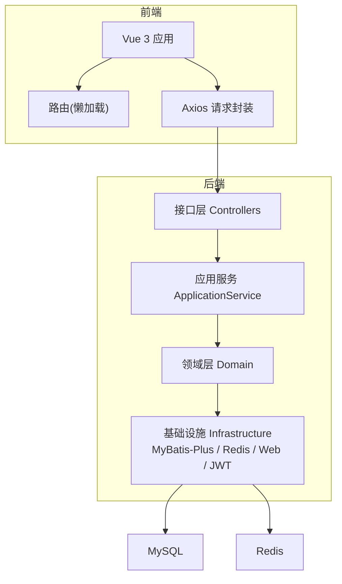
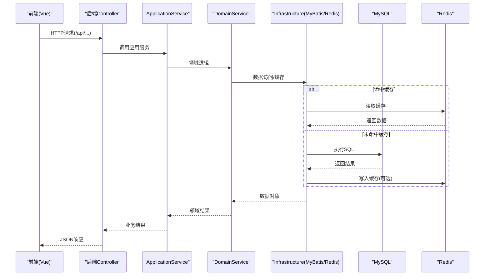
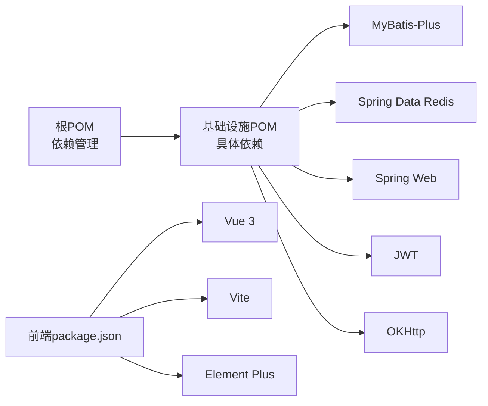

# 性能优化

<cite>
**本文引用的文件**
- [wzoto-backend/pom.xml](file://wzoto-backend/pom.xml)
- [wzoto-backend/wzoto-infrastructure/pom.xml](file://wzoto-backend/wzoto-infrastructure/pom.xml)
- [wzoto-backend/wzoto-interfaces/src/main/resources/application.yml](file://wzoto-backend/wzoto-interfaces/src/main/resources/application.yml)
- [wzoto-frontend/package.json](file://wzoto-frontend/package.json)
- [wzoto-frontend/vite.config.js](file://wzoto-frontend/vite.config.js)
- [wzoto-frontend/src/utils/request.js](file://wzoto-frontend/src/utils/request.js)
- [wzoto-frontend/src/router/index.js](file://wzoto-frontend/src/router/index.js)
- [wzoto-backend/sql/init_all_learning_tables.sql](file://wzoto-backend/sql/init_all_learning_tables.sql)
</cite>

## 目录
1. [简介](#简介)
2. [项目结构](#项目结构)
3. [核心组件](#核心组件)
4. [架构总览](#架构总览)
5. [详细组件分析](#详细组件分析)
6. [依赖关系分析](#依赖关系分析)
7. [性能考虑](#性能考虑)
8. [故障排查指南](#故障排查指南)
9. [结论](#结论)
10. [附录](#附录)

## 简介
本文件面向wzoto项目的全面性能优化策略，覆盖后端数据库与缓存、前端构建与网络、内存与并发、监控与容量规划、压测与稳定性等维度。内容基于仓库中实际配置与代码结构，给出可落地的优化建议与实施路径，帮助在现有Spring Boot + Vue技术栈上实现稳定、高效、可扩展的系统。

## 项目结构
- 后端采用DDD分层：domain（领域）、application（应用服务）、infrastructure（基础设施：MyBatis-Plus、Redis、Web、JWT、OKHttp等）、interfaces（控制器与DTO/VO）。
- 前端使用Vue 3 + Vite，路由采用动态导入实现懒加载；HTTP客户端基于axios封装统一拦截器；开发环境通过Vite代理转发到后端。
- 数据库相关DDL与种子脚本集中在sql目录，学习资源相关表由聚合脚本初始化。

**图示来源**
- [wzoto-backend/wzoto-interfaces/src/main/resources/application.yml:1-51](file://wzoto-backend/wzoto-interfaces/src/main/resources/application.yml#L1-L51)
- [wzoto-backend/wzoto-infrastructure/pom.xml:16-71](file://wzoto-backend/wzoto-infrastructure/pom.xml#L16-L71)
- [wzoto-frontend/src/router/index.js:1-250](file://wzoto-frontend/src/router/index.js#L1-L250)
- [wzoto-frontend/src/utils/request.js:1-59](file://wzoto-frontend/src/utils/request.js#L1-L59)

**章节来源**
- [wzoto-backend/pom.xml:21-26](file://wzoto-backend/pom.xml#L21-L26)
- [wzoto-backend/wzoto-infrastructure/pom.xml:16-71](file://wzoto-backend/wzoto-infrastructure/pom.xml#L16-L71)
- [wzoto-frontend/vite.config.js:1-21](file://wzoto-frontend/vite.config.js#L1-L21)
- [wzoto-backend/sql/init_all_learning_tables.sql:1-31](file://wzoto-backend/sql/init_all_learning_tables.sql#L1-L31)

## 核心组件
- 后端基础设施层引入MyBatis-Plus、Spring Data Redis、Spring Web、JWT、OKHttp等关键能力，支撑数据访问、缓存、HTTP服务、鉴权与AI调用。
- 应用配置包含数据库连接、Redis连接、MyBatis-Plus全局配置、JWT与微信/AI开关等。
- 前端路由已采用按需import的懒加载，减少首屏体积；axios封装统一注入Authorization并处理401跳转。

**章节来源**
- [wzoto-backend/wzoto-infrastructure/pom.xml:16-71](file://wzoto-backend/wzoto-infrastructure/pom.xml#L16-L71)
- [wzoto-backend/wzoto-interfaces/src/main/resources/application.yml:6-51](file://wzoto-backend/wzoto-interfaces/src/main/resources/application.yml#L6-L51)
- [wzoto-frontend/src/router/index.js:4-189](file://wzoto-frontend/src/router/index.js#L4-L189)
- [wzoto-frontend/src/utils/request.js:1-59](file://wzoto-frontend/src/utils/request.js#L1-L59)

## 架构总览
下图展示一次典型请求从前端到后端的调用链，以及涉及的缓存与数据库访问点，便于定位性能瓶颈与优化切入点。

**图示来源**
- [wzoto-backend/wzoto-interfaces/src/main/resources/application.yml:6-51](file://wzoto-backend/wzoto-interfaces/src/main/resources/application.yml#L6-L51)
- [wzoto-backend/wzoto-infrastructure/pom.xml:16-71](file://wzoto-backend/wzoto-infrastructure/pom.xml#L16-L71)

## 详细组件分析

### 后端数据库与缓存
- 现状
  - 使用MyBatis-Plus作为ORM，启用逻辑删除与驼峰映射，日志输出至控制台。
  - 集成Spring Data Redis，支持按环境变量配置host/port/password/database。
  - 数据库驱动为mysql-connector-j，URL指向本地MySQL实例。
- 优化建议
  - 连接池：引入或显式配置HikariCP（如未默认启用），调整最大连接数、空闲超时、连接验证等参数，避免连接耗尽与抖动。
  - SQL与索引：结合业务查询建立复合索引，避免全表扫描；对高频过滤字段（如subject_id、resource_type、status）建立合适索引；分页查询限制limit。
  - 读写分离与分库分表：读多写少场景可考虑只读副本；热点表按时间或租户维度拆分。
  - 缓存策略：热点数据（课程目录、知识点树、用户信息）入Redis，设置合理TTL与失效策略；写扩散与一致性通过事件或延迟双删保障。
  - 批量操作：合并小事务为大事务，减少往返；大批量插入使用批处理。
  - 慢查询治理：开启慢查询日志，定期分析Top N慢SQL，持续优化。

**章节来源**
- [wzoto-backend/wzoto-interfaces/src/main/resources/application.yml:6-51](file://wzoto-backend/wzoto-interfaces/src/main/resources/application.yml#L6-L51)
- [wzoto-backend/wzoto-infrastructure/pom.xml:22-53](file://wzoto-backend/wzoto-infrastructure/pom.xml#L22-L53)

### 后端异步与并发
- 现状
  - 使用Spring Web提供REST接口；JWT用于鉴权；OKHttp用于外部AI调用。
- 优化建议
  - 线程模型：合理配置Tomcat线程池大小（maxThreads、acceptCount），根据CPU核数与IO占比调优。
  - 异步化：对外部耗时调用（AI、OCR、语音）采用@Async或CompletableFuture，配合独立线程池隔离，避免阻塞主线程。
  - 限流与熔断：对第三方API增加重试退避与熔断降级，防止雪崩。
  - 锁与一致性：分布式场景使用Redisson实现分布式锁，避免超卖与重复提交。

**章节来源**
- [wzoto-backend/wzoto-infrastructure/pom.xml:46-71](file://wzoto-backend/wzoto-infrastructure/pom.xml#L46-L71)
- [wzoto-backend/wzoto-interfaces/src/main/resources/application.yml:31-51](file://wzoto-backend/wzoto-interfaces/src/main/resources/application.yml#L31-L51)

### 前端性能优化
- 现状
  - 路由已采用动态import实现懒加载，减少首屏包体。
  - axios封装统一注入Authorization、超时与错误处理。
  - Vite开发服务器通过代理转发/api到后端。
- 优化建议
  - 代码分割与预取：按页面/功能模块继续细粒度拆分；对首屏关键资源使用prefetch/preload。
  - 图片与媒体：使用现代格式（WebP/AVIF）、响应式图片、CDN加速；视频走CDN并启用分片与断点续传。
  - 浏览器缓存：静态资源开启强缓存（content-hash），接口使用ETag/Last-Modified；合理设置Cache-Control。
  - 网络优化：合并小请求、开启Gzip/Brotli、HTTP/2；必要时引入Service Worker做离线与缓存策略。
  - 构建优化：Tree-shaking、压缩、分包策略（vendor/业务/公共库分离）。

**章节来源**
- [wzoto-frontend/src/router/index.js:4-189](file://wzoto-frontend/src/router/index.js#L4-L189)
- [wzoto-frontend/src/utils/request.js:1-59](file://wzoto-frontend/src/utils/request.js#L1-L59)
- [wzoto-frontend/vite.config.js:12-19](file://wzoto-frontend/vite.config.js#L12-L19)

### 内存优化
- 后端
  - JVM参数：根据容器/物理机内存设置堆大小、元空间、GC算法（G1/ZGC），开启GC日志与JFR采样。
  - 对象复用：对频繁创建的小对象使用对象池（如ByteBuffer、正则Pattern）；避免大对象长期驻留。
  - 泄漏检测：定期运行MAT/JProfiler，关注ThreadLocal、监听器、缓存未释放。
- 前端
  - 组件卸载清理：移除定时器、事件监听、订阅；避免闭包引用导致内存泄漏。
  - 大数据渲染：虚拟滚动、分页加载；图表按需销毁实例。

[本节为通用指导，不直接分析具体文件]

### 监控与可观测性
- 后端
  - 指标：接入Micrometer+Prometheus/Grafana，暴露QPS、RT、错误率、JVM指标、DB连接池状态。
  - APM：集成SkyWalking/Arthas进行链路追踪与在线诊断。
  - 日志：结构化日志，集中采集（ELK/Loki），敏感信息脱敏。
- 前端
  - 性能埋点：首屏时间、FCP/LCP、错误率、接口耗时；上报至监控平台。
  - 用户体验：长任务拆分、骨架屏、错误边界与降级提示。

[本节为通用指导，不直接分析具体文件]

### 容量规划与扩展
- 容量评估：以峰值QPS、平均RT、P99目标为依据，估算CPU/内存/带宽/DB连接数需求。
- 负载均衡：Nginx/Ingress按权重与健康检查分发；会话无状态化，借助Redis共享。
- 水平扩展：无状态服务多副本部署；数据库读写分离与分片；缓存集群化。

[本节为通用指导，不直接分析具体文件]

### 压力测试与稳定性
- 工具：JMeter/k6/locust进行基准与负载测试；混沌工程注入故障验证韧性。
- 场景：登录、浏览、播放、AI问答等核心链路；逐步加压观察拐点。
- 回归：压测后对比优化前后指标，固化基线。

[本节为通用指导，不直接分析具体文件]

## 依赖关系分析
- 后端依赖管理集中在根POM，子模块通过dependencyManagement统一版本，降低冲突风险。
- 基础设施层依赖MyBatis-Plus、Redis、Web、JWT、OKJson等，形成数据访问与外部调用能力。
- 前端依赖Vue生态与Element Plus，构建工具为Vite。

**图示来源**
- [wzoto-backend/pom.xml:39-91](file://wzoto-backend/pom.xml#L39-L91)
- [wzoto-backend/wzoto-infrastructure/pom.xml:16-71](file://wzoto-backend/wzoto-infrastructure/pom.xml#L16-L71)
- [wzoto-frontend/package.json:11-25](file://wzoto-frontend/package.json#L11-L25)

**章节来源**
- [wzoto-backend/pom.xml:39-91](file://wzoto-backend/pom.xml#L39-L91)
- [wzoto-backend/wzoto-infrastructure/pom.xml:16-71](file://wzoto-backend/wzoto-infrastructure/pom.xml#L16-L71)
- [wzoto-frontend/package.json:11-25](file://wzoto-frontend/package.json#L11-L25)

## 性能考虑
- 数据库
  - 索引设计：为高频查询条件建立复合索引；覆盖索引减少回表；避免过度索引影响写入。
  - 查询优化：避免SELECT *；合理使用JOIN与子查询；分页使用游标或keyset分页替代offset深翻页。
  - 连接池：根据并发与RT调整连接数与超时；监控连接等待与活跃数。
- 缓存
  - 热点数据优先缓存；缓存穿透/击穿/雪崩防护（空值缓存、互斥锁、随机过期）。
  - 缓存与DB一致性：先更新DB再删缓存，或采用延迟双删；必要时引入消息队列最终一致。
- 前端
  - 懒加载与预加载平衡；静态资源CDN与强缓存；接口请求合并与去抖节流。
  - 首屏优化：关键CSS内联、JS按需加载、图片懒加载与占位。
- 并发
  - 线程池隔离不同业务域；限流保护热点接口；幂等设计避免重复提交。
- 监控
  - 全链路追踪与指标看板；慢查询与慢接口告警；容量预警与弹性伸缩。

[本节为通用指导，不直接分析具体文件]

## 故障排查指南
- 常见问题定位
  - 接口超时：检查网络、下游依赖、线程池饱和、DB连接池耗尽。
  - 缓存异常：核对Key命名、TTL、序列化、集群连通性与权限。
  - 前端401：确认Token注入与有效期；刷新Token流程是否完整。
- 工具与方法
  - 后端：开启慢查询日志、APM链路追踪、JVM GC日志；使用arthas在线诊断。
  - 前端：Network面板查看请求耗时与失败原因；Performance面板分析渲染瓶颈。
- 快速恢复
  - 降级：关闭非核心功能（如AI）；切换Mock或只读模式。
  - 扩容：临时增加实例与缓存节点；提升DB只读副本。

**章节来源**
- [wzoto-backend/wzoto-interfaces/src/main/resources/application.yml:48-51](file://wzoto-backend/wzoto-interfaces/src/main/resources/application.yml#L48-L51)
- [wzoto-frontend/src/utils/request.js:25-59](file://wzoto-frontend/src/utils/request.js#L25-L59)

## 结论
通过对数据库与缓存、前后端构建与网络、内存与并发、监控与容量、压测与稳定性的系统化优化，wzoto可在现有架构基础上显著提升吞吐、降低延迟并增强稳定性。建议分阶段推进：先补齐监控与基线，再聚焦慢查询与缓存命中率，最后完善异步化与弹性扩展。

[本节为总结性内容，不直接分析具体文件]

## 附录
- 数据库初始化脚本位于sql目录，学习资源相关表由聚合脚本统一创建与灌入数据，便于环境搭建与回归。

**章节来源**
- [wzoto-backend/sql/init_all_learning_tables.sql:1-31](file://wzoto-backend/sql/init_all_learning_tables.sql#L1-L31)