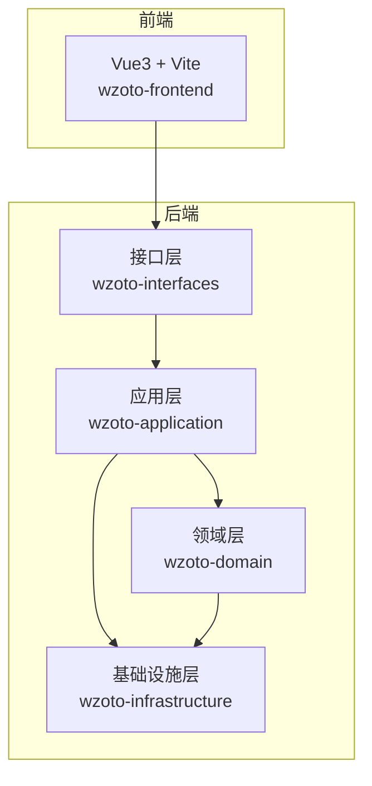
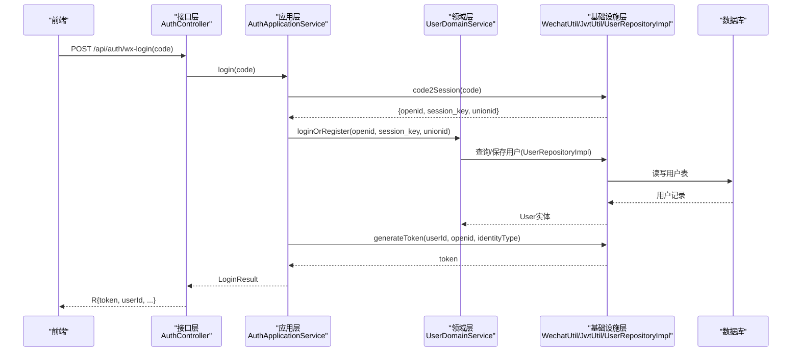
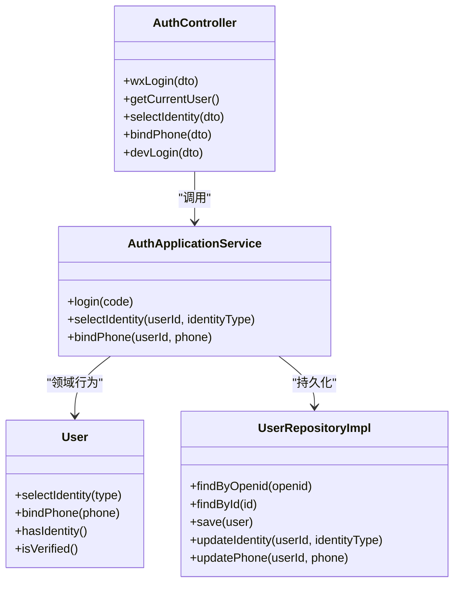
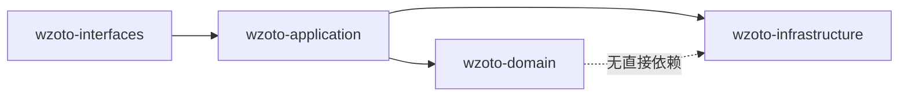

# 新功能开发指南

<cite>
**本文引用的文件**
- [wzoto-backend/pom.xml](file://wzoto-backend/pom.xml)
- [wzoto-domain/pom.xml](file://wzoto-backend/wzoto-domain/pom.xml)
- [wzoto-application/pom.xml](file://wzoto-backend/wzoto-application/pom.xml)
- [wzoto-infrastructure/pom.xml](file://wzoto-backend/wzoto-infrastructure/pom.xml)
- [wzoto-interfaces/pom.xml](file://wzoto-backend/wzoto-interfaces/pom.xml)
- [application.yml](file://wzoto-backend/wzoto-interfaces/src/main/resources/application.yml)
- [User.java](file://wzoto-backend/wzoto-domain/src/main/java/com/wzoto/domain/entity/User.java)
- [AuthApplicationService.java](file://wzoto-backend/wzoto-application/src/main/java/com/wzoto/application/service/AuthApplicationService.java)
- [AuthController.java](file://wzoto-backend/wzoto-interfaces/src/main/java/com/wzoto/interfaces/controller/AuthController.java)
- [UserRepositoryImpl.java](file://wzoto-backend/wzoto-infrastructure/src/main/java/com/wzoto/infrastructure/repository/UserRepositoryImpl.java)
- [package.json](file://wzoto-frontend/package.json)
- [单页面原型说明文档.md](file://docs/单页面原型说明文档.md)
</cite>

## 目录
1. [简介](#简介)
2. [项目结构](#项目结构)
3. [核心组件](#核心组件)
4. [架构总览](#架构总览)
5. [详细组件分析](#详细组件分析)
6. [依赖关系分析](#依赖关系分析)
7. [性能考虑](#性能考虑)
8. [故障排查指南](#故障排查指南)
9. [结论](#结论)
10. [附录](#附录)

## 简介
本指南面向wzoto项目的“新功能开发”，覆盖从需求分析、设计、开发、测试、文档到部署与运维的全流程，并结合现有DDD分层架构（领域层、应用层、基础设施层、接口层）给出可操作的实践建议。同时提供前端（Vue3 + Vite）与后端（Spring Boot 3 + MyBatis-Plus + Redis + JWT）的协作方式、数据持久化策略、API契约与发布上线注意事项，帮助团队高效、稳定地交付高质量功能。

## 项目结构
wzoto采用多模块Maven工程，后端按DDD四层组织：
- 接口层（wzoto-interfaces）：REST控制器、DTO/VO、统一响应、全局异常
- 应用层（wzoto-application）：用例编排、事务边界、跨领域协调
- 领域层（wzoto-domain）：实体、值对象、仓储接口、领域服务
- 基础设施层（wzoto-infrastructure）：MyBatis-Plus Mapper、Repository实现、配置、工具类、外部系统适配（微信、AI等）

前端为Vue3 + Vite工程，包含路由、页面、组件、状态管理、API封装与样式。

图表来源
- [wzoto-backend/pom.xml:21-26](file://wzoto-backend/pom.xml#L21-L26)
- [wzoto-interfaces/pom.xml:16-24](file://wzoto-backend/wzoto-interfaces/pom.xml#L16-L24)
- [wzoto-application/pom.xml:16-24](file://wzoto-backend/wzoto-application/pom.xml#L16-L24)
- [wzoto-domain/pom.xml:16-27](file://wzoto-backend/wzoto-domain/pom.xml#L16-L27)
- [wzoto-infrastructure/pom.xml:16-71](file://wzoto-backend/wzoto-infrastructure/pom.xml#L16-L71)

章节来源
- [wzoto-backend/pom.xml:1-26](file://wzoto-backend/pom.xml#L1-L26)
- [wzoto-interfaces/pom.xml:1-60](file://wzoto-backend/wzoto-interfaces/pom.xml#L1-L60)
- [wzoto-application/pom.xml:1-43](file://wzoto-backend/wzoto-application/pom.xml#L1-L43)
- [wzoto-domain/pom.xml:1-29](file://wzoto-backend/wzoto-domain/pom.xml#L1-L29)
- [wzoto-infrastructure/pom.xml:1-73](file://wzoto-backend/wzoto-infrastructure/pom.xml#L1-L73)

## 核心组件
- 认证登录链路：接口层AuthController → 应用层AuthApplicationService → 领域层UserDomainService → 基础设施层WechatUtil/JwtUtil/UserRepositoryImpl
- 用户实体与规则：User实体承载身份选择、绑定手机号、认证状态等业务规则
- 配置中心：application.yml集中管理数据库、Redis、JWT、微信、AI等配置项
- 前端能力：基于Vue3/Vite构建，使用Element Plus、Pinia、ECharts等生态

章节来源
- [AuthController.java:24-149](file://wzoto-backend/wzoto-interfaces/src/main/java/com/wzoto/interfaces/controller/AuthController.java#L24-L149)
- [AuthApplicationService.java:17-119](file://wzoto-backend/wzoto-application/src/main/java/com/wzoto/application/service/AuthApplicationService.java#L17-L119)
- [User.java:12-93](file://wzoto-backend/wzoto-domain/src/main/java/com/wzoto/domain/entity/User.java#L12-L93)
- [application.yml:1-51](file://wzoto-backend/wzoto-interfaces/src/main/resources/application.yml#L1-L51)
- [package.json:1-27](file://wzoto-frontend/package.json#L1-L27)

## 架构总览
下图展示一次“微信登录”的端到端调用链，体现前后端交互与DDD分层职责。

图表来源
- [AuthController.java:65-75](file://wzoto-backend/wzoto-interfaces/src/main/java/com/wzoto/interfaces/controller/AuthController.java#L65-L75)
- [AuthApplicationService.java:26-57](file://wzoto-backend/wzoto-application/src/main/java/com/wzoto/application/service/AuthApplicationService.java#L26-L57)
- [UserRepositoryImpl.java:27-55](file://wzoto-backend/wzoto-infrastructure/src/main/java/com/wzoto/infrastructure/repository/UserRepositoryImpl.java#L27-L55)

## 详细组件分析

### 认证与授权（登录、身份选择、手机号绑定）
- 接口层暴露REST端点：微信登录、获取当前用户、选择身份、绑定手机号、开发环境便捷登录
- 应用层编排：调用微信接口获取会话信息，委托领域服务完成登录/注册，生成JWT并返回
- 领域层约束：User实体保证“身份一经选择不可随意切换”等核心规则
- 基础设施层实现：通过MyBatis-Plus进行持久化，结合JwtUtil签发令牌，WechatUtil对接微信API

图表来源
- [AuthController.java:24-149](file://wzoto-backend/wzoto-interfaces/src/main/java/com/wzoto/interfaces/controller/AuthController.java#L24-L149)
- [AuthApplicationService.java:17-119](file://wzoto-backend/wzoto-application/src/main/java/com/wzoto/application/service/AuthApplicationService.java#L17-L119)
- [User.java:12-93](file://wzoto-backend/wzoto-domain/src/main/java/com/wzoto/domain/entity/User.java#L12-L93)
- [UserRepositoryImpl.java:16-123](file://wzoto-backend/wzoto-infrastructure/src/main/java/com/wzoto/infrastructure/repository/UserRepositoryImpl.java#L16-L123)

章节来源
- [AuthController.java:24-149](file://wzoto-backend/wzoto-interfaces/src/main/java/com/wzoto/interfaces/controller/AuthController.java#L24-L149)
- [AuthApplicationService.java:17-119](file://wzoto-backend/wzoto-application/src/main/java/com/wzoto/application/service/AuthApplicationService.java#L17-L119)
- [User.java:12-93](file://wzoto-backend/wzoto-domain/src/main/java/com/wzoto/domain/entity/User.java#L12-L93)
- [UserRepositoryImpl.java:16-123](file://wzoto-backend/wzoto-infrastructure/src/main/java/com/wzoto/infrastructure/repository/UserRepositoryImpl.java#L16-L123)

### 配置与环境
- 数据库：MySQL连接、逻辑删除字段配置
- 缓存：Redis主机、端口、密码、库号
- 安全：JWT密钥、过期时间
- 第三方：微信AppId/Secret、AI开关与模型参数
- 日志：包级日志级别

章节来源
- [application.yml:1-51](file://wzoto-backend/wzoto-interfaces/src/main/resources/application.yml#L1-L51)

### 前端工程与页面规范
- 技术栈：Vue3、Vite、Element Plus、Pinia、ECharts、Axios
- 页面原型：家长端首页、老师列表、老师详情、发布招聘、简历编辑等，含筛选、日历、异常态等统一规范
- 建议：新增页面遵循原型规范，复用组件与样式；表单校验与错误提示统一；网络异常与空态处理一致

章节来源
- [package.json:1-27](file://wzoto-frontend/package.json#L1-L27)
- [单页面原型说明文档.md:1-800](file://docs/单页面原型说明文档.md#L1-L800)

## 依赖关系分析
- 模块依赖方向：interfaces → application → domain；application → infrastructure；domain仅依赖基础框架与验证注解
- 运行时依赖：Spring Boot Web、MyBatis-Plus、Redis、JWT、Hutool、OKHttp、JSON解析库
- 前端依赖：UI组件库、状态管理、HTTP客户端、图表库、打包工具

图表来源
- [wzoto-interfaces/pom.xml:16-24](file://wzoto-backend/wzoto-interfaces/pom.xml#L16-L24)
- [wzoto-application/pom.xml:16-24](file://wzoto-backend/wzoto-application/pom.xml#L1-L24)
- [wzoto-domain/pom.xml:16-27](file://wzoto-backend/wzoto-domain/pom.xml#L16-L27)
- [wzoto-infrastructure/pom.xml:16-71](file://wzoto-backend/wzoto-infrastructure/pom.xml#L16-L71)

章节来源
- [wzoto-backend/pom.xml:21-26](file://wzoto-backend/pom.xml#L21-L26)
- [wzoto-infrastructure/pom.xml:16-71](file://wzoto-backend/wzoto-infrastructure/pom.xml#L16-L71)

## 性能考虑
- 数据库访问：合理使用索引与分页；避免N+1查询；批量操作优先
- 缓存策略：热点数据（如字典、配置、课程树）入Redis；注意缓存穿透/击穿/雪崩防护
- 接口限流与重试：对外部依赖（微信、AI）增加超时与重试退避
- 日志与监控：关键路径打点，关注慢请求与异常率
- 前端优化：路由懒加载、组件按需引入、图片与静态资源压缩、首屏骨架屏

[本节为通用指导，不直接分析具体文件]

## 故障排查指南
- 登录失败：检查微信code有效性、session_key获取、用户是否存在、JWT配置是否正确
- 权限问题：确认JWT是否携带正确身份标识，拦截器是否放行
- 数据库异常：核对连接串、账号密码、时区与字符集；查看SQL执行日志
- 缓存异常：检查Redis连通性、密码与库号；清理脏数据
- AI调用：确认AI_ENABLED、base-url、api-key、model与temperature配置；必要时回退Mock模式

章节来源
- [application.yml:1-51](file://wzoto-backend/wzoto-interfaces/src/main/resources/application.yml#L1-L51)
- [AuthApplicationService.java:26-57](file://wzoto-backend/wzoto-application/src/main/java/com/wzoto/application/service/AuthApplicationService.java#L26-L57)
- [AuthController.java:65-75](file://wzoto-backend/wzoto-interfaces/src/main/java/com/wzoto/interfaces/controller/AuthController.java#L65-L75)

## 结论
wzoto项目具备清晰的DDD分层与完善的工程化基础。新功能开发应严格遵循分层职责：在领域层定义业务规则与实体行为，在应用层编排用例与事务边界，在基础设施层实现持久化与外部集成，在接口层收敛对外契约。配合前端原型规范与统一的异常/空态处理，可显著提升交付质量与可维护性。

[本节为总结性内容，不直接分析具体文件]

## 附录

### 需求分析阶段
- 用户需求理解：明确角色（家长/学生/教师）、目标与痛点，梳理关键场景与期望结果
- 业务场景分析：绘制用例图与流程图，识别主流程与异常分支
- 技术可行性评估：评估现有DDD模块扩展点、第三方依赖接入成本与风险
- 影响范围分析：确定涉及的模块、接口、数据表与前端页面，评估回归范围

### 设计阶段
- 领域模型设计：提炼实体、值对象与聚合根，定义领域服务与仓储接口
- 接口设计：定义RESTful端点、请求/响应体、状态码与错误码；保持向后兼容
- 数据库设计：ER建模、索引规划、分表/归档策略；编写迁移脚本与种子数据
- UI/UX设计：遵循原型规范，统一交互与视觉；完善空态、加载与异常态

### 开发阶段
- 后端DDD分层实现
  - 领域层：新增实体/值对象/领域服务，确保不变式与业务规则内聚
  - 应用层：新增用例服务，编排领域服务与基础设施调用，设置事务边界
  - 基础设施层：实现仓储、Mapper、PO转换；接入外部服务（微信/AI）
  - 接口层：新增Controller、DTO/VO，统一响应与异常处理
- 前端组件开发：按原型拆分组件，复用状态管理与API封装
- API接口开发：前后端联调，契约先行，版本化管理
- 数据持久化实现：编写迁移脚本，准备测试数据，确保幂等与一致性

### 测试阶段
- 单元测试：覆盖领域服务与值对象校验
- 接口测试：基于Swagger或Postman进行契约测试
- 集成测试：串联数据库、缓存与外部依赖（Mock/沙箱）
- 用户验收测试：按原型走查关键路径，收集反馈

### 文档阶段
- API文档更新：同步接口变更与示例
- 用户手册编写：面向家长/学生/教师的操作指引
- 技术文档维护：架构图、数据字典、部署手册与排障指南

### 部署阶段
- 环境配置：区分开发/测试/生产环境变量（数据库、Redis、JWT、微信、AI）
- 灰度发布：按流量或用户群逐步放量，观察指标与错误率
- 监控配置：APM、日志采集、告警阈值与通知渠道
- 故障预案：降级策略（如AI回退Mock）、熔断与限流、回滚方案

### 经验总结
- 最佳实践：领域驱动、契约先行、小步快跑、持续集成
- 常见问题：配置漂移、缓存不一致、外部依赖超时、并发冲突
- 性能优化：SQL优化、缓存命中、异步化与批处理、前端资源优化