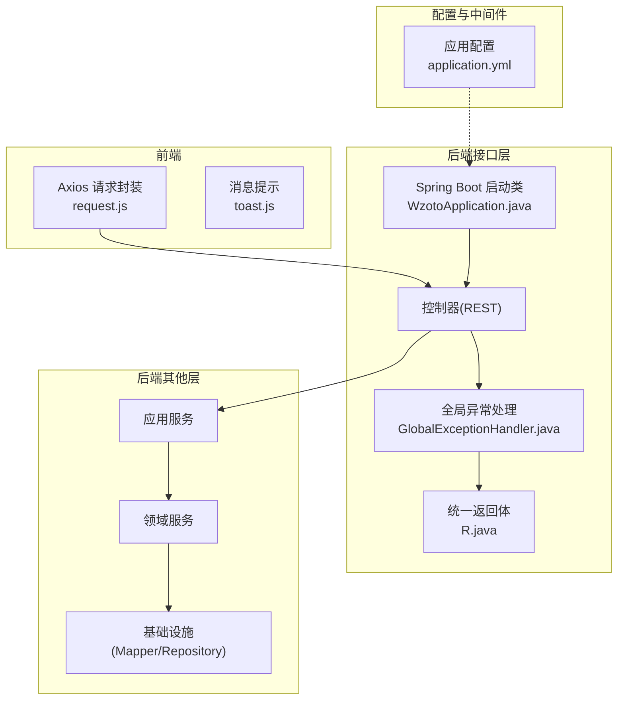
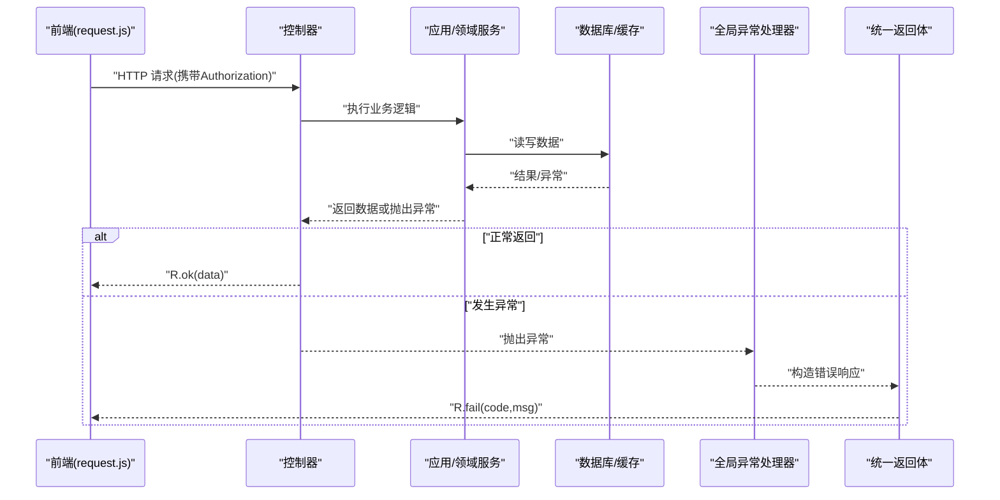
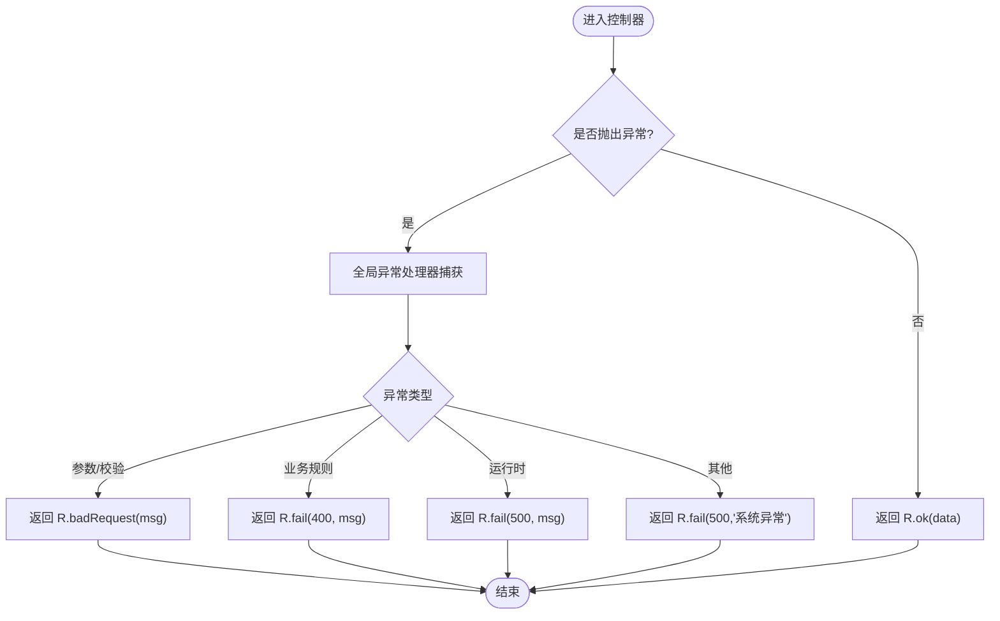
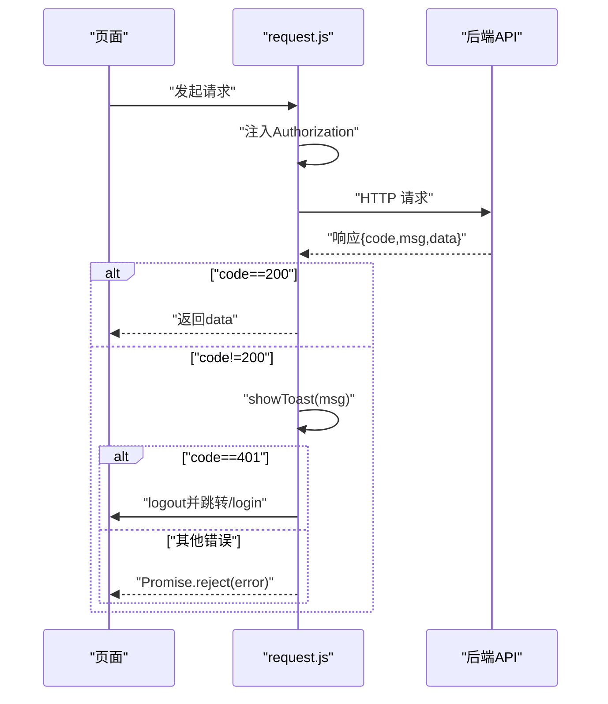
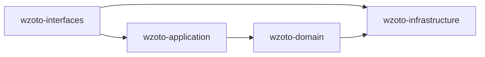

# 问题排查与调试

<cite>
**本文引用的文件**
- [WzotoApplication.java](file://wzoto-backend/wzoto-interfaces/src/main/java/com/wzoto/WzotoApplication.java)
- [application.yml](file://wzoto-backend/wzoto-interfaces/src/main/resources/application.yml)
- [GlobalExceptionHandler.java](file://wzoto-backend/wzoto-interfaces/src/main/java/com/wzoto/interfaces/common/GlobalExceptionHandler.java)
- [R.java](file://wzoto-backend/wzoto-interfaces/src/main/java/com/wzoto/interfaces/common/R.java)
- [request.js](file://wzoto-frontend/src/utils/request.js)
- [toast.js](file://wzoto-frontend/src/utils/toast.js)
- [pom.xml](file://wzoto-backend/pom.xml)
</cite>

## 目录
1. [简介](#简介)
2. [项目结构](#项目结构)
3. [核心组件](#核心组件)
4. [架构总览](#架构总览)
5. [详细组件分析](#详细组件分析)
6. [依赖分析](#依赖分析)
7. [性能考虑](#性能考虑)
8. [故障排查指南](#故障排查指南)
9. [监控告警](#监控告警)
10. [故障恢复](#故障恢复)
11. [结论](#结论)

## 简介
本文件为 wzoto 项目的问题排查与调试体系文档，覆盖启动失败、数据库连接、API 调用异常、前端渲染错误等常见问题；提供后端与前端调试技巧、日志分析方法、性能定位手段；并给出全局异常处理、错误码规范、国际化与用户友好提示建议；同时包含日志管理、监控告警、健康检查、系统状态监控以及备份恢复、降级熔断与灾难恢复策略。

## 项目结构
后端采用分层架构：接口层（wzoto-interfaces）暴露 REST API 并集中处理异常与统一返回；应用层（wzoto-application）编排业务用例；领域层（wzoto-domain）承载领域模型与领域服务；基础设施层（wzoto-infrastructure）实现数据访问与外部能力集成。前端基于 Vue + Vite，使用 Axios 封装请求拦截与统一错误提示。

图表来源
- [WzotoApplication.java:1-19](file://wzoto-backend/wzoto-interfaces/src/main/java/com/wzoto/WzotoApplication.java#L1-L19)
- [application.yml:1-51](file://wzoto-backend/wzoto-interfaces/src/main/resources/application.yml#L1-L51)
- [GlobalExceptionHandler.java:1-67](file://wzoto-backend/wzoto-interfaces/src/main/java/com/wzoto/interfaces/common/GlobalExceptionHandler.java#L1-L67)
- [R.java:1-43](file://wzoto-backend/wzoto-interfaces/src/main/java/com/wzoto/interfaces/common/R.java#L1-L43)
- [request.js:1-59](file://wzoto-frontend/src/utils/request.js#L1-L59)
- [toast.js:1-14](file://wzoto-frontend/src/utils/toast.js#L1-L14)

章节来源
- [WzotoApplication.java:1-19](file://wzoto-backend/wzoto-interfaces/src/main/java/com/wzoto/WzotoApplication.java#L1-L19)
- [application.yml:1-51](file://wzoto-backend/wzoto-interfaces/src/main/resources/application.yml#L1-L51)
- [pom.xml:1-126](file://wzoto-backend/pom.xml#L1-L126)

## 核心组件
- 启动入口：Spring Boot 启动类启用 Mapper 扫描与重试注解，负责装配与启动。
- 全局异常处理：捕获参数校验、绑定、运行时异常等，统一记录日志并返回标准错误响应。
- 统一返回体：定义 code/msg/data 的通用结构，便于前后端一致交互。
- 前端请求封装：自动注入 Authorization 头、统一处理成功/失败、网络异常与 401 跳转登录。
- 应用配置：数据库、Redis、MyBatis-Plus、JWT、微信、AI、日志级别等关键配置。

章节来源
- [WzotoApplication.java:1-19](file://wzoto-backend/wzoto-interfaces/src/main/java/com/wzoto/WzotoApplication.java#L1-L19)
- [GlobalExceptionHandler.java:1-67](file://wzoto-backend/wzoto-interfaces/src/main/java/com/wzoto/interfaces/common/GlobalExceptionHandler.java#L1-L67)
- [R.java:1-43](file://wzoto-backend/wzoto-interfaces/src/main/java/com/wzoto/interfaces/common/R.java#L1-L43)
- [request.js:1-59](file://wzoto-frontend/src/utils/request.js#L1-L59)
- [application.yml:1-51](file://wzoto-backend/wzoto-interfaces/src/main/resources/application.yml#L1-L51)

## 架构总览
下图展示一次典型 API 请求从前端到后端的调用链路与异常处理路径。

图表来源
- [request.js:13-55](file://wzoto-frontend/src/utils/request.js#L13-L55)
- [GlobalExceptionHandler.java:18-66](file://wzoto-backend/wzoto-interfaces/src/main/java/com/wzoto/interfaces/common/GlobalExceptionHandler.java#L18-L66)
- [R.java:19-41](file://wzoto-backend/wzoto-interfaces/src/main/java/com/wzoto/interfaces/common/R.java#L19-L41)

## 详细组件分析

### 全局异常处理与错误码规范
- 异常分类与映射：
  - 参数非法/校验失败：返回 400，msg 为具体字段错误拼接信息。
  - 业务规则违反：返回 400，msg 为业务语义描述。
  - 运行时异常：返回 500，msg 为异常信息。
  - 未捕获异常：返回 500，msg 为用户友好提示。
- 日志记录：warn/error 级别分别记录参数/业务/系统异常，附带堆栈便于定位。
- 统一返回：通过 R 的 ok/fail/unauthorized/badRequest 等方法输出一致结构。

图表来源
- [GlobalExceptionHandler.java:18-66](file://wzoto-backend/wzoto-interfaces/src/main/java/com/wzoto/interfaces/common/GlobalExceptionHandler.java#L18-L66)
- [R.java:19-41](file://wzoto-backend/wzoto-interfaces/src/main/java/com/wzoto/interfaces/common/R.java#L19-L41)

章节来源
- [GlobalExceptionHandler.java:18-66](file://wzoto-backend/wzoto-interfaces/src/main/java/com/wzoto/interfaces/common/GlobalExceptionHandler.java#L18-L66)
- [R.java:19-41](file://wzoto-backend/wzoto-interfaces/src/main/java/com/wzoto/interfaces/common/R.java#L19-L41)

### 前端请求拦截与错误提示
- 请求拦截：自动注入 Authorization 头，便于鉴权。
- 响应拦截：
  - 业务码非 200：弹出 toast 提示，并在 401 时清除本地状态并跳转登录页。
  - 网络异常：区分 HTTP 状态码，提示“网络错误(status)”或“网络连接失败”。
- 提示工具：基于 Element Plus Message 的轻量 Toast。

图表来源
- [request.js:13-55](file://wzoto-frontend/src/utils/request.js#L13-L55)
- [toast.js:1-14](file://wzoto-frontend/src/utils/toast.js#L1-L14)

章节来源
- [request.js:13-55](file://wzoto-frontend/src/utils/request.js#L13-L55)
- [toast.js:1-14](file://wzoto-frontend/src/utils/toast.js#L1-L14)

### 应用配置与启动
- 端口与上下文：默认 8080，根上下文。
- 数据源：MySQL 驱动、连接串、用户名密码（支持环境变量）。
- Redis：主机、端口、密码、库号（支持环境变量）。
- MyBatis-Plus：Mapper 扫描路径、驼峰转换、SQL 输出、逻辑删除字段。
- JWT：密钥与过期时间（支持环境变量）。
- 微信/AI：开关、基础地址、密钥、模型与温度（支持环境变量）。
- 日志级别：com.wzoto 与 MyBatis-Plus 均设为 debug，便于开发期排障。

章节来源
- [application.yml:1-51](file://wzoto-backend/wzoto-interfaces/src/main/resources/application.yml#L1-L51)
- [WzotoApplication.java:1-19](file://wzoto-backend/wzoto-interfaces/src/main/java/com/wzoto/WzotoApplication.java#L1-L19)

## 依赖分析
- 构建与版本：Spring Boot 3.2.5，Java 21，多模块聚合工程。
- 关键依赖：
  - MyBatis-Plus：数据持久化增强。
  - Hutool：通用工具集。
  - JJWT：JWT 编解码。
- 模块划分：domain、infrastructure、application、interfaces 四层解耦，利于测试与维护。

图表来源
- [pom.xml:21-26](file://wzoto-backend/pom.xml#L21-L26)

章节来源
- [pom.xml:1-126](file://wzoto-backend/pom.xml#L1-L126)

## 性能考虑
- SQL 性能：
  - 开启 MyBatis-Plus SQL 输出（已配置），结合慢查询日志定位耗时语句。
  - 建议在数据库侧开启慢查询阈值，配合索引优化。
- 缓存与并发：
  - Redis 用于热点数据缓存，注意缓存穿透/击穿/雪崩防护。
  - 合理设置超时与重试，避免级联放大。
- 资源与线程：
  - 关注 JVM 内存与 GC 行为，必要时调整堆大小与收集器。
  - 对 CPU 密集型任务进行异步化或分片处理。
- 网络优化：
  - 前端请求合并、分页与懒加载，减少首屏压力。
  - 后端接口限流与幂等设计，防止恶意刷量。

[本节为通用性能建议，不直接分析具体文件]

## 故障排查指南

### 启动失败排查
- 检查端口占用与上下文路径：确认 server.port 与 context-path 未被占用。
- 检查数据库与 Redis 连通性：核对 application.yml 中的 URL、账号、密码与环境变量。
- 检查 MyBatis-Plus 配置：mapper-locations 是否正确，逻辑删除字段是否匹配实体。
- 查看启动日志：重点关注 DataSource、Redis、Mapper 扫描报错。

章节来源
- [application.yml:1-51](file://wzoto-backend/wzoto-interfaces/src/main/resources/application.yml#L1-L51)
- [WzotoApplication.java:1-19](file://wzoto-backend/wzoto-interfaces/src/main/java/com/wzoto/WzotoApplication.java#L1-L19)

### 数据库连接问题
- 常见原因：URL/账号/密码错误、时区/SSL 参数不当、网络不可达、权限不足。
- 排查步骤：
  - 使用命令行直连数据库验证连通性。
  - 检查环境变量 MYSQL_PASSWORD、REDIS_HOST/PORT/PASSWORD 是否生效。
  - 临时将日志级别调至 debug，观察连接池与 SQL 执行情况。
  - 若使用代理/防火墙，确认白名单与端口开放。

章节来源
- [application.yml:6-17](file://wzoto-backend/wzoto-interfaces/src/main/resources/application.yml#L6-L17)

### API 调用异常
- 前端侧：
  - 检查 Authorization 是否注入，token 是否过期。
  - 关注 request.js 的响应拦截：code 非 200 会提示并可能跳转登录。
- 后端侧：
  - 全局异常处理器会捕获并返回统一错误结构，查看服务端日志定位异常点。
  - 参数校验失败会返回 400，包含字段错误信息。

章节来源
- [request.js:13-55](file://wzoto-frontend/src/utils/request.js#L13-L55)
- [GlobalExceptionHandler.java:18-66](file://wzoto-backend/wzoto-interfaces/src/main/java/com/wzoto/interfaces/common/GlobalExceptionHandler.java#L18-L66)
- [R.java:19-41](file://wzoto-backend/wzoto-interfaces/src/main/java/com/wzoto/interfaces/common/R.java#L19-L41)

### 前端渲染错误
- 路由与页面：检查路由配置与页面组件导入是否正确。
- 状态管理：确认 user store 中 token 与用户信息初始化。
- 第三方库：Element Plus 消息组件是否正常引入。
- 控制台与网络面板：查看 JS 报错与接口返回码。

[本节为通用前端排查建议，不直接分析具体文件]

### 调试技巧
- 后端调试：
  - 使用 IDE 远程/本地断点调试，结合日志输出定位。
  - 利用 Spring Boot Actuator（如需）暴露健康检查与指标端点。
- 前端调试：
  - 浏览器开发者工具 Network/Console 查看请求与错误。
  - 使用 Vite 热更新快速迭代。
- 日志分析：
  - 开发环境日志级别为 debug，生产建议调整为 info/warn。
  - 关注 com.wzoto 与 MyBatis-Plus 日志，结合 traceId 追踪链路。

章节来源
- [application.yml:48-51](file://wzoto-backend/wzoto-interfaces/src/main/resources/application.yml#L48-L51)

### 错误处理最佳实践
- 全局异常处理：已实现参数、业务、运行时与系统异常的捕获与日志记录。
- 错误码规范：统一使用 R 的 code/msg/data 结构，400/401/500 语义清晰。
- 国际化建议：在 R 中增加 i18n key，前端根据 locale 显示用户友好文案。
- 用户提示：前端通过 toast 提示错误，401 自动登出并跳转登录。

章节来源
- [GlobalExceptionHandler.java:18-66](file://wzoto-backend/wzoto-interfaces/src/main/java/com/wzoto/interfaces/common/GlobalExceptionHandler.java#L18-L66)
- [R.java:19-41](file://wzoto-backend/wzoto-interfaces/src/main/java/com/wzoto/interfaces/common/R.java#L19-L41)
- [request.js:25-55](file://wzoto-frontend/src/utils/request.js#L25-L55)

### 日志管理
- 日志级别：当前 com.wzoto 与 MyBatis-Plus 均为 debug，适合开发调试。
- 日志格式：建议统一 JSON 格式，包含时间、级别、traceId、模块、消息。
- 日志收集：生产建议使用 ELK/Loki 等集中式收集与分析。
- 敏感信息：避免在日志中打印密码、token 等敏感数据。

章节来源
- [application.yml:48-51](file://wzoto-backend/wzoto-interfaces/src/main/resources/application.yml#L48-L51)

### 性能问题定位
- 慢查询分析：结合数据库慢查询日志与 MyBatis-Plus SQL 输出，定位耗时 SQL 并优化索引。
- 内存泄漏检测：使用 VisualVM/JProfiler 分析堆快照，关注大对象与未释放引用。
- CPU 使用率分析：通过 top/jstack 定位热点线程与方法。
- 网络请求优化：前端分页、懒加载、合并请求；后端缓存、异步化、限流。

[本节为通用性能定位建议，不直接分析具体文件]

## 监控告警
- 关键指标监控：QPS、延迟、错误率、JVM 内存/GC、数据库连接池、Redis 命中率。
- 异常告警配置：对 5xx、慢请求、数据库连接失败等设置阈值告警。
- 健康检查接口：可暴露 /actuator/health（如启用 Actuator）供负载均衡与健康探针使用。
- 系统状态监控：CPU、内存、磁盘、网络带宽与 I/O。

[本节为通用监控建议，不直接分析具体文件]

## 故障恢复
- 备份恢复策略：定期全量+增量备份数据库，演练恢复流程。
- 降级方案：非核心功能（如 AI 报告）在高峰期或依赖不可用时降级为缓存或空数据。
- 熔断机制：对外部依赖（如 AI 服务）配置熔断与回退，避免雪崩。
- 灾难恢复计划：制定多可用区部署、跨机房容灾与数据同步策略。

[本节为通用恢复策略建议，不直接分析具体文件]

## 结论
本项目已具备较完善的全局异常处理、统一返回结构与前端请求拦截机制，配合应用配置与日志级别，可满足开发与日常排障需求。建议在生产环境完善监控告警、日志收集与性能观测，并建立备份恢复与熔断降级策略，以提升系统稳定性与可维护性。