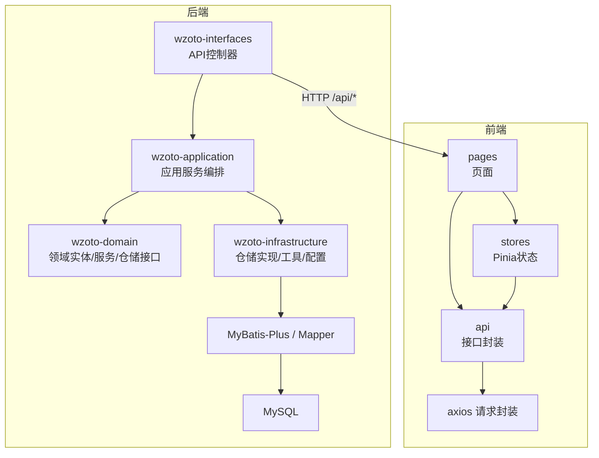
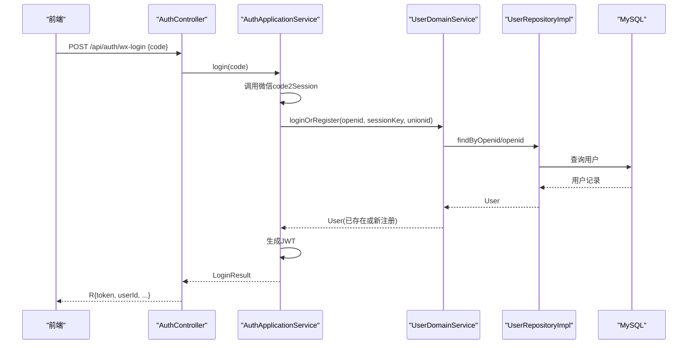
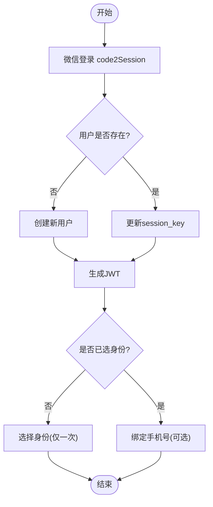
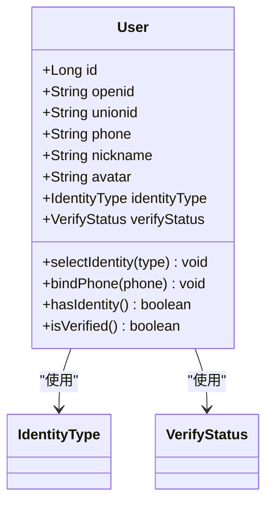
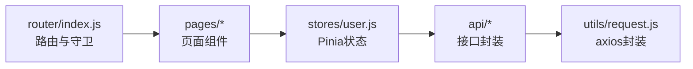
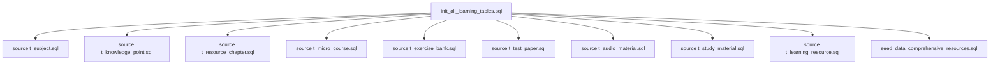
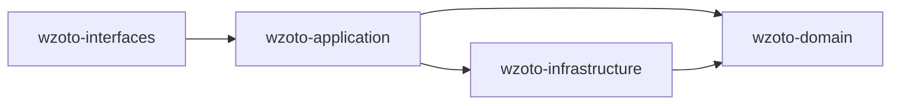

# 项目结构

<cite>
**本文引用的文件**
- [wzoto-backend/pom.xml](file://wzoto-backend/pom.xml)
- [application.yml](file://wzoto-backend/wzoto-interfaces/src/main/resources/application.yml)
- [User.java](file://wzoto-backend/wzoto-domain/src/main/java/com/wzoto/domain/entity/User.java)
- [UserDomainService.java](file://wzoto-backend/wzoto-domain/src/main/java/com/wzoto/domain/service/UserDomainService.java)
- [AuthApplicationService.java](file://wzoto-backend/wzoto-application/src/main/java/com/wzoto/application/service/AuthApplicationService.java)
- [AuthController.java](file://wzoto-backend/wzoto-interfaces/src/main/java/com/wzoto/interfaces/controller/AuthController.java)
- [UserRepositoryImpl.java](file://wzoto-backend/wzoto-infrastructure/src/main/java/com/wzoto/infrastructure/repository/UserRepositoryImpl.java)
- [index.js](file://wzoto-frontend/src/router/index.js)
- [user.js](file://wzoto-frontend/src/stores/user.js)
- [auth.js](file://wzoto-frontend/src/api/auth.js)
- [package.json](file://wzoto-frontend/package.json)
- [init_all_learning_tables.sql](file://wzoto-backend/sql/init_all_learning_tables.sql)
</cite>

## 目录
1. [简介](#简介)
2. [项目结构](#项目结构)
3. [核心组件](#核心组件)
4. [架构总览](#架构总览)
5. [详细组件分析](#详细组件分析)
6. [依赖关系分析](#依赖关系分析)
7. [性能考量](#性能考量)
8. [故障排查指南](#故障排查指南)
9. [结论](#结论)
10. [附录](#附录)

## 简介
本项目“学霸到家”是一个面向线下1对1家教撮合与学习资源管理的平台，采用后端DDD分层架构与前端模块化组织。后端通过domain层定义实体与领域服务、application层编排业务流程、infrastructure层实现数据访问与外部服务集成、interfaces层暴露REST API；前端基于Vue3 + Vite构建，按pages/components/stores/api/utils进行模块化组织，并通过Pinia管理状态、Ax封装HTTP请求。数据库脚本集中管理初始化、测试数据与版本迁移。配置通过application.yml与环境变量管理，支持JWT鉴权、微信登录、AI能力开关等。

## 项目结构
整体采用前后端分离：
- 后端（Spring Boot 3 + MyBatis-Plus）：多模块Maven工程，严格遵循DDD四层划分
- 前端（Vue3 + Vite + Pinia + Element Plus）：模块化页面与组件，统一路由守卫与状态管理
- 数据库：MySQL，SQL脚本集中存放于sql目录，包含DDL、种子数据与增量迁移
- 配置：application.yml集中管理数据库、Redis、JWT、微信、AI等配置项，敏感信息通过环境变量注入

图表来源
- [wzoto-backend/pom.xml:21-26](file://wzoto-backend/pom.xml#L21-L26)
- [application.yml:6-30](file://wzoto-backend/wzoto-interfaces/src/main/resources/application.yml#L6-L30)

章节来源
- [wzoto-backend/pom.xml:1-126](file://wzoto-backend/pom.xml#L1-L126)
- [application.yml:1-51](file://wzoto-backend/wzoto-interfaces/src/main/resources/application.yml#L1-L51)

## 核心组件
- 领域层（domain）
  - 实体：如用户User，承载业务规则（身份选择不可随意切换、绑定手机号等）
  - 领域服务：封装跨实体的复杂业务逻辑（如登录注册、身份选择、绑定手机）
  - 值对象：IdentityType、VerifyStatus等枚举化业务常量
  - 仓储接口：定义持久化契约，解耦具体实现
- 应用层（application）
  - 应用服务：编排第三方调用（微信code2Session）、领域服务、JWT生成等流程
  - 事务边界：关键流程使用@Transactional保证一致性
- 基础设施层（infrastructure）
  - 仓储实现：将领域实体与PO转换，使用MyBatis-Plus进行CRUD
  - 工具类：JwtUtil、WechatUtil等
  - 配置：WebMvcConfig、MybatisMetaObjectHandler等
- 接口层（interfaces）
  - 控制器：对外暴露REST API，参数校验、统一响应封装
  - DTO/VO：入参与出参模型，屏蔽内部领域模型

章节来源
- [User.java:12-93](file://wzoto-backend/wzoto-domain/src/main/java/com/wzoto/domain/entity/User.java#L12-L93)
- [UserDomainService.java:20-76](file://wzoto-backend/wzoto-domain/src/main/java/com/wzoto/domain/service/UserDomainService.java#L20-L76)
- [AuthApplicationService.java:26-119](file://wzoto-backend/wzoto-application/src/main/java/com/wzoto/application/service/AuthApplicationService.java#L26-L119)
- [UserRepositoryImpl.java:16-123](file://wzoto-backend/wzoto-infrastructure/src/main/java/com/wzoto/infrastructure/repository/UserRepositoryImpl.java#L16-L123)
- [AuthController.java:21-149](file://wzoto-backend/wzoto-interfaces/src/main/java/com/wzoto/interfaces/controller/AuthController.java#L21-L149)

## 架构总览
后端采用严格的DDD分层，职责清晰、耦合度低；前端以路由为中心组织页面，结合Pinia与API封装形成清晰的请求链路。数据库脚本集中管理，便于环境初始化与版本演进。

图表来源
- [AuthController.java:65-75](file://wzoto-backend/wzoto-interfaces/src/main/java/com/wzoto/interfaces/controller/AuthController.java#L65-L75)
- [AuthApplicationService.java:26-57](file://wzoto-backend/wzoto-application/src/main/java/com/wzoto/application/service/AuthApplicationService.java#L26-L57)
- [UserDomainService.java:20-46](file://wzoto-backend/wzoto-domain/src/main/java/com/wzoto/domain/service/UserDomainService.java#L20-L46)
- [UserRepositoryImpl.java:27-34](file://wzoto-backend/wzoto-infrastructure/src/main/java/com/wzoto/infrastructure/repository/UserRepositoryImpl.java#L27-L34)

## 详细组件分析

### 认证与授权流程（微信登录、身份选择、绑定手机）
- 控制器接收请求，校验并委托应用服务
- 应用服务编排微信登录、领域服务、JWT生成
- 领域服务执行业务规则（自动注册、身份选择限制、绑定手机）
- 基础设施层完成数据持久化与对象映射

图表来源
- [AuthApplicationService.java:26-119](file://wzoto-backend/wzoto-application/src/main/java/com/wzoto/application/service/AuthApplicationService.java#L26-L119)
- [UserDomainService.java:20-76](file://wzoto-backend/wzoto-domain/src/main/java/com/wzoto/domain/service/UserDomainService.java#L20-L76)
- [User.java:61-93](file://wzoto-backend/wzoto-domain/src/main/java/com/wzoto/domain/entity/User.java#L61-L93)

章节来源
- [AuthController.java:65-127](file://wzoto-backend/wzoto-interfaces/src/main/java/com/wzoto/interfaces/controller/AuthController.java#L65-L127)
- [AuthApplicationService.java:26-119](file://wzoto-backend/wzoto-application/src/main/java/com/wzoto/application/service/AuthApplicationService.java#L26-L119)
- [UserDomainService.java:20-76](file://wzoto-backend/wzoto-domain/src/main/java/com/wzoto/domain/service/UserDomainService.java#L20-L76)
- [User.java:61-93](file://wzoto-backend/wzoto-domain/src/main/java/com/wzoto/domain/entity/User.java#L61-L93)

### 领域实体与值对象设计
- 实体User承载用户核心属性与行为，内置业务规则（身份不可随意切换、是否已认证等）
- 值对象IdentityType、VerifyStatus等用于表达业务语义，避免魔法字符串
- 仓储接口抽象数据访问，实现层负责PO与领域实体双向转换

图表来源
- [User.java:12-93](file://wzoto-backend/wzoto-domain/src/main/java/com/wzoto/domain/entity/User.java#L12-L93)

章节来源
- [User.java:12-93](file://wzoto-backend/wzoto-domain/src/main/java/com/wzoto/domain/entity/User.java#L12-L93)

### 前端模块化结构与路由守卫
- pages：按功能域组织页面（家长端、学生端、AI、预约等）
- components：可复用UI组件
- stores：Pinia状态管理（用户信息、登录态、权限判断）
- api：按模块封装HTTP接口，统一使用request工具
- router：集中路由定义与守卫，控制登录、身份、角色访问

图表来源
- [index.js:1-250](file://wzoto-frontend/src/router/index.js#L1-L250)
- [user.js:1-126](file://wzoto-frontend/src/stores/user.js#L1-L126)
- [auth.js:1-30](file://wzoto-frontend/src/api/auth.js#L1-L30)

章节来源
- [index.js:1-250](file://wzoto-frontend/src/router/index.js#L1-L250)
- [user.js:1-126](file://wzoto-frontend/src/stores/user.js#L1-L126)
- [auth.js:1-30](file://wzoto-frontend/src/api/auth.js#L1-L30)

### 数据库脚本管理
- 初始化脚本：一次性创建学习资源相关表并导入综合种子数据
- 测试数据脚本：针对练习、微课、试卷音频、学科知识点等场景的测试数据
- 版本迁移脚本：v2扩展字段与增量变更，便于迭代升级
- 表结构脚本：按业务域拆分DDL，便于维护与回滚

图表来源
- [init_all_learning_tables.sql:1-31](file://wzoto-backend/sql/init_all_learning_tables.sql#L1-L31)

章节来源
- [init_all_learning_tables.sql:1-31](file://wzoto-backend/sql/init_all_learning_tables.sql#L1-L31)

### 配置文件管理
- 服务器与上下文：端口、上下文路径
- 数据源：MySQL连接、时区、字符集
- Redis：地址、端口、密码、库号
- MyBatis-Plus：Mapper扫描、驼峰映射、日志、逻辑删除
- 业务配置：JWT密钥与过期时间、微信AppID/Secret、AI开关与模型参数
- 日志级别：com.wzoto与MyBatis-Plus调试输出

章节来源
- [application.yml:1-51](file://wzoto-backend/wzoto-interfaces/src/main/resources/application.yml#L1-L51)

### 依赖管理
- Maven多模块：父POM统一管理版本与依赖，子模块domain/infrastructure/application/interfaces
- Java版本：21，编译目标一致
- 关键依赖：MyBatis-Plus、Hutool、JWT、Lombok、SLF4J
- NPM依赖：Vue3、Vite、Element Plus、Pinia、ECharts、Axios、Sass
- 版本兼容性：Spring Boot 3.x要求Java 17+，项目使用Java 21满足要求

章节来源
- [wzoto-backend/pom.xml:1-126](file://wzoto-backend/pom.xml#L1-L126)
- [package.json:1-27](file://wzoto-frontend/package.json#L1-L27)

### 扩展点设计
- 插件化架构：AI能力通过配置开关启用真实或Mock实现，便于接入不同供应商
- 接口抽象：仓储接口隔离实现，便于替换存储或引入缓存
- 配置化设计：JWT、微信、AI等通过环境变量注入，支持多环境部署

章节来源
- [application.yml:31-47](file://wzoto-backend/wzoto-interfaces/src/main/resources/application.yml#L31-L47)

## 依赖关系分析
后端模块间依赖方向：interfaces -> application -> domain；application同时依赖infrastructure提供的外部能力；infrastructure依赖domain的仓储接口。

图表来源
- [wzoto-backend/pom.xml:21-26](file://wzoto-backend/pom.xml#L21-L26)

章节来源
- [wzoto-backend/pom.xml:21-26](file://wzoto-backend/pom.xml#L21-L26)

## 性能考量
- 数据库访问：使用MyBatis-Plus简化CRUD，合理索引与分页提升查询性能
- 缓存策略：Redis可用于会话、验证码、热点数据缓存（配置已预留）
- 异步处理：AI调用可能耗时，建议引入异步任务或流式响应优化体验
- 前端优化：路由懒加载、组件按需引入、图片与静态资源CDN加速
- 日志与监控：开启必要日志级别，结合APM定位瓶颈

[本节为通用指导，不直接分析具体文件]

## 故障排查指南
- 登录失败
  - 检查微信code有效性、网络连通性
  - 查看application.yml中微信AppID/Secret是否正确
  - 确认JWT密钥长度与安全设置
- 身份选择异常
  - 领域规则禁止重复选择，确保前端引导正确
  - 检查UserDomainService与User实体的规则实现
- 数据不一致
  - 应用服务方法使用事务注解，检查异常分支是否回滚
  - 仓储实现中PO与实体转换是否遗漏字段
- 前端路由跳转异常
  - 检查路由meta中的权限标记（needIdentity、parentOnly、studentOnly）
  - 确认Pinia状态同步与本地存储token一致性

章节来源
- [AuthApplicationService.java:26-119](file://wzoto-backend/wzoto-application/src/main/java/com/wzoto/application/service/AuthApplicationService.java#L26-L119)
- [UserDomainService.java:20-76](file://wzoto-backend/wzoto-domain/src/main/java/com/wzoto/domain/service/UserDomainService.java#L20-L76)
- [UserRepositoryImpl.java:27-123](file://wzoto-backend/wzoto-infrastructure/src/main/java/com/wzoto/infrastructure/repository/UserRepositoryImpl.java#L27-L123)
- [index.js:197-247](file://wzoto-frontend/src/router/index.js#L197-L247)
- [user.js:31-126](file://wzoto-frontend/src/stores/user.js#L31-L126)

## 结论
本项目采用清晰的DDD分层与前端模块化组织，具备良好的可维护性与扩展性。通过配置化与接口抽象，能够灵活接入第三方服务与替换实现。数据库脚本集中管理，便于环境初始化与版本演进。建议在后续迭代中持续完善缓存策略、异步处理与监控体系，以提升系统稳定性与用户体验。

[本节为总结性内容，不直接分析具体文件]

## 附录
- 关键API示例
  - 微信登录：POST /api/auth/wx-login
  - 获取当前用户：GET /api/auth/me
  - 选择身份：POST /api/auth/select-identity
  - 绑定手机：POST /api/auth/bind-phone
- 前端入口与构建
  - 开发：npm run dev
  - 构建：npm run build
  - 预览：npm run preview

章节来源
- [AuthController.java:65-127](file://wzoto-backend/wzoto-interfaces/src/main/java/com/wzoto/interfaces/controller/AuthController.java#L65-L127)
- [package.json:6-10](file://wzoto-frontend/package.json#L6-L10)