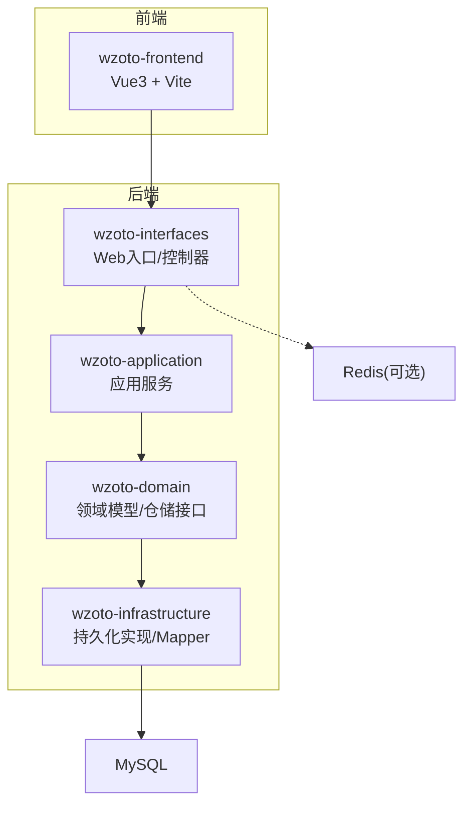
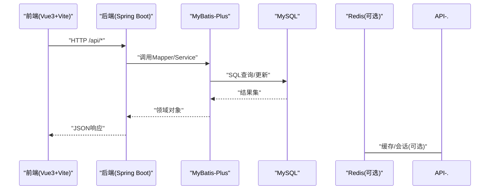
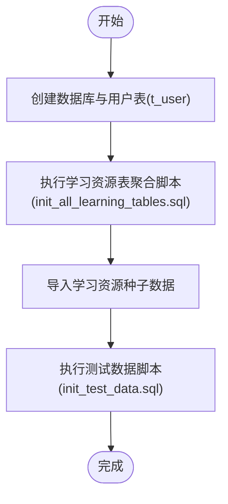
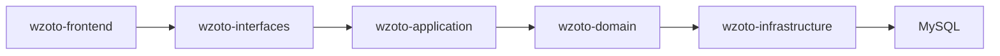

# 快速开始

<cite>
**本文引用的文件**
- [wzoto-backend/pom.xml](file://wzoto-backend/pom.xml)
- [application.yml](file://wzoto-backend/wzoto-interfaces/src/main/resources/application.yml)
- [WzotoApplication.java](file://wzoto-backend/wzoto-interfaces/src/main/java/com/wzoto/WzotoApplication.java)
- [package.json](file://wzoto-frontend/package.json)
- [vite.config.js](file://wzoto-frontend/vite.config.js)
- [init_all_learning_tables.sql](file://wzoto-backend/sql/init_all_learning_tables.sql)
- [init_test_data.sql](file://wzoto-backend/sql/init_test_data.sql)
- [t_user.sql](file://wzoto-backend/sql/t_user.sql)
</cite>

## 目录
1. [简介](#简介)
2. [项目结构](#项目结构)
3. [核心组件](#核心组件)
4. [架构总览](#架构总览)
5. [详细组件分析](#详细组件分析)
6. [依赖分析](#依赖分析)
7. [性能考虑](#性能考虑)
8. [故障排查指南](#故障排查指南)
9. [结论](#结论)
10. [附录](#附录)

## 简介
本指南面向首次接触 wzoto 项目的开发者，目标是在最短时间内完成环境搭建、数据库初始化、前后端启动与联调。后端基于 Spring Boot + MyBatis-Plus，前端基于 Vue 3 + Vite，数据库为 MySQL（可选 Redis）。通过本指南，你将：
- 准备 Java 21、Node.js、MySQL 等基础环境
- 配置并启动后端服务
- 安装依赖并启动前端开发服务器
- 按顺序执行数据库脚本，完成表结构与测试数据初始化
- 解决常见环境问题，确保本地开发顺畅

## 项目结构
wzoto 采用多模块 Maven 工程，前后端分离：
- 后端：wzoto-backend（包含 domain、infrastructure、application、interfaces 四个子模块）
- 前端：wzoto-frontend（Vue 3 + Vite）
- 数据库脚本：wzoto-backend/sql（DDL 与种子数据）

图表来源
- [WzotoApplication.java:11-14](file://wzoto-backend/wzoto-interfaces/src/main/java/com/wzoto/WzotoApplication.java#L11-L14)
- [application.yml:6-17](file://wzoto-backend/wzoto-interfaces/src/main/resources/application.yml#L6-L17)

章节来源
- [wzoto-backend/pom.xml:21-26](file://wzoto-backend/pom.xml#L21-L26)
- [wzoto-backend/pom.xml:28-37](file://wzoto-backend/pom.xml#L28-L37)

## 核心组件
- 后端启动类：Spring Boot 主程序，启用 Mapper 扫描与重试机制
- 应用配置：端口、上下文路径、数据源、MyBatis-Plus、JWT、微信、AI 等
- 前端构建：Vite + Vue 插件，开发代理指向后端
- 数据库脚本：学习资源相关表创建与种子数据、测试用户与会员数据

章节来源
- [WzotoApplication.java:11-14](file://wzoto-backend/wzoto-interfaces/src/main/java/com/wzoto/WzotoApplication.java#L11-L14)
- [application.yml:1-51](file://wzoto-backend/wzoto-interfaces/src/main/resources/application.yml#L1-L51)
- [package.json:6-25](file://wzoto-frontend/package.json#L6-L25)
- [vite.config.js:5-20](file://wzoto-frontend/vite.config.js#L5-L20)
- [init_all_learning_tables.sql:1-31](file://wzoto-backend/sql/init_all_learning_tables.sql#L1-L31)
- [init_test_data.sql:1-26](file://wzoto-backend/sql/init_test_data.sql#L1-L26)

## 架构总览
系统由前端页面发起请求，经 Vite 开发服务器代理到后端 Spring Boot 服务；后端通过 MyBatis-Plus 访问 MySQL，可选使用 Redis。

图表来源
- [application.yml:6-17](file://wzoto-backend/wzoto-interfaces/src/main/resources/application.yml#L6-L17)
- [vite.config.js:12-18](file://wzoto-frontend/vite.config.js#L12-L18)

## 详细组件分析

### 后端环境与配置
- 运行环境：Java 21（Maven 编译源/目标均为 21）
- 框架与版本：Spring Boot 3.2.5，MyBatis-Plus 3.5.6，Hutool 5.8.26，JWT 0.12.5
- 端口与上下文：默认 8080，根路径 /
- 数据源：MySQL 驱动与连接串、用户名、密码（支持环境变量覆盖）
- 缓存：Redis 主机、端口、密码、库号（支持环境变量覆盖）
- MyBatis-Plus：映射位置、驼峰转换、日志输出、逻辑删除字段
- 业务配置：JWT 密钥与过期时间、微信 AppId/Secret、AI 开关与参数

章节来源
- [wzoto-backend/pom.xml:7-12](file://wzoto-backend/pom.xml#L7-L12)
- [wzoto-backend/pom.xml:28-37](file://wzoto-backend/pom.xml#L28-L37)
- [application.yml:1-51](file://wzoto-backend/wzoto-interfaces/src/main/resources/application.yml#L1-L51)

### 前端开发与代理
- 包管理与脚本：npm scripts 提供 dev/build/preview
- 依赖：Vue 3、Element Plus、ECharts、Pinia、Axios、Sass、Vue Router
- 构建工具：Vite + @vitejs/plugin-vue
- 开发代理：将 /api 请求转发至 http://localhost:8080

章节来源
- [package.json:6-25](file://wzoto-frontend/package.json#L6-L25)
- [vite.config.js:5-20](file://wzoto-frontend/vite.config.js#L5-L20)

### 数据库初始化流程
- 基础库与用户表：先创建数据库与 t_user 表
- 学习资源体系：执行聚合脚本 init_all_learning_tables.sql，内部会依次 source 学科、知识点、章节、微课、题库、试卷、音频、学习资料、学习资源等表，并导入 comprehensive 种子数据
- 测试数据：执行 init_test_data.sql，预置管理员、家长、学生等账号与会员、AI 报告数据（依赖 t_user、t_membership、t_ai_report 已存在）

图表来源
- [t_user.sql:4-26](file://wzoto-backend/sql/t_user.sql#L4-L26)
- [init_all_learning_tables.sql:7-31](file://wzoto-backend/sql/init_all_learning_tables.sql#L7-L31)
- [init_test_data.sql:1-26](file://wzoto-backend/sql/init_test_data.sql#L1-L26)

章节来源
- [t_user.sql:4-26](file://wzoto-backend/sql/t_user.sql#L4-L26)
- [init_all_learning_tables.sql:7-31](file://wzoto-backend/sql/init_all_learning_tables.sql#L7-L31)
- [init_test_data.sql:1-26](file://wzoto-backend/sql/init_test_data.sql#L1-L26)

## 依赖分析
- 后端模块依赖：interfaces 依赖 application，application 依赖 domain，domain 依赖 infrastructure（通过仓库接口解耦）
- 外部依赖：Spring Boot 生态、MyBatis-Plus、JWT、Hutool
- 前端依赖：Vue 3 生态、UI 组件库、状态管理、网络请求、图表

图表来源
- [wzoto-backend/pom.xml:21-26](file://wzoto-backend/pom.xml#L21-L26)
- [application.yml:6-17](file://wzoto-backend/wzoto-interfaces/src/main/resources/application.yml#L6-L17)

章节来源
- [wzoto-backend/pom.xml:21-26](file://wzoto-backend/pom.xml#L21-L26)

## 性能考虑
- 数据库索引：用户表、会员表等关键列已建立索引，建议保持默认索引策略
- 日志级别：开发阶段可开启 MyBatis SQL 日志便于定位问题，生产建议降低日志级别
- 缓存：如启用 Redis，可将热点数据或会话信息放入缓存以降低数据库压力
- 前端代理：开发期使用 Vite 代理减少跨域问题，避免额外网关开销

[本节为通用指导，不直接分析具体文件]

## 故障排查指南
- 无法连接数据库
  - 检查 application.yml 中数据源 URL、用户名、密码是否正确
  - 确认 MySQL 服务已启动且端口 3306 可达
  - 若使用环境变量覆盖密码，请确保变量名与值正确
- 启动时报错找不到 Mapper
  - 确认启动类已启用 MapperScan，扫描路径与 mapper 包一致
  - 检查 MyBatis-Plus 的 mapper-locations 是否包含 XML 映射文件
- 前端请求 404 或跨域
  - 确认 vite.config.js 中 /api 代理目标地址与后端端口一致
  - 确认后端服务已启动且 context-path 为 /
- 登录失败或鉴权异常
  - 检查 JWT 密钥与过期时间配置
  - 确认已通过 init_test_data.sql 插入测试用户
- 学习资源页面空白
  - 确认已执行 init_all_learning_tables.sql 及 seed 数据
  - 检查 t_subject、t_knowledge_point、t_resource_chapter 等表是否有数据

章节来源
- [application.yml:6-17](file://wzoto-backend/wzoto-interfaces/src/main/resources/application.yml#L6-L17)
- [WzotoApplication.java:11-14](file://wzoto-backend/wzoto-interfaces/src/main/java/com/wzoto/WzotoApplication.java#L11-L14)
- [vite.config.js:12-18](file://wzoto-frontend/vite.config.js#L12-L18)
- [init_test_data.sql:1-26](file://wzoto-backend/sql/init_test_data.sql#L1-L26)
- [init_all_learning_tables.sql:7-31](file://wzoto-backend/sql/init_all_learning_tables.sql#L7-L31)

## 结论
按照本指南完成环境准备、数据库初始化与前后端启动后，即可在本地运行 wzoto 项目。建议在开发过程中优先保证数据库与后端稳定，再逐步完善前端功能与联调。遇到问题时，优先对照“故障排查指南”逐项核对配置与依赖。

[本节为总结性内容，不直接分析具体文件]

## 附录

### 环境要求清单
- Java 21（Maven 编译源/目标）
- Node.js（用于前端 npm 与 Vite）
- MySQL（默认 localhost:3306，数据库名 wzoto）
- Redis（可选，默认 localhost:6379）

章节来源
- [wzoto-backend/pom.xml:28-37](file://wzoto-backend/pom.xml#L28-L37)
- [application.yml:6-17](file://wzoto-backend/wzoto-interfaces/src/main/resources/application.yml#L6-L17)

### 后端启动步骤
- 进入 wzoto-backend 目录
- 使用 Maven 构建并启动（IDEA 可直接运行 WzotoApplication）
- 默认监听端口 8080，上下文路径 /

章节来源
- [WzotoApplication.java:11-18](file://wzoto-backend/wzoto-interfaces/src/main/java/com/wzoto/WzotoApplication.java#L11-L18)
- [application.yml:1-4](file://wzoto-backend/wzoto-interfaces/src/main/resources/application.yml#L1-L4)

### 前端启动步骤
- 进入 wzoto-frontend 目录
- 执行 npm install 安装依赖
- 执行 npm run dev 启动开发服务器
- 浏览器访问 http://localhost:5173（Vite 默认端口），/api 请求将被代理到后端

章节来源
- [package.json:6-25](file://wzoto-frontend/package.json#L6-L25)
- [vite.config.js:12-18](file://wzoto-frontend/vite.config.js#L12-L18)

### 数据库初始化步骤与注意事项
- 创建数据库与用户表：执行 t_user.sql（会自动创建数据库与表）
- 初始化学习资源表与数据：执行 init_all_learning_tables.sql（内部会依次 source 多个表定义与种子数据）
- 插入测试数据：执行 init_test_data.sql（需确保 t_user、t_membership、t_ai_report 已存在）
- 注意：
  - 所有脚本均使用 utf8mb4 字符集
  - 如需重复初始化，请先清理已有数据或根据脚本中的 DROP/IF NOT EXISTS 行为处理
  - 若修改了数据库连接信息，请同步更新 application.yml

章节来源
- [t_user.sql:4-26](file://wzoto-backend/sql/t_user.sql#L4-L26)
- [init_all_learning_tables.sql:7-31](file://wzoto-backend/sql/init_all_learning_tables.sql#L7-L31)
- [init_test_data.sql:1-26](file://wzoto-backend/sql/init_test_data.sql#L1-L26)
- [application.yml:6-17](file://wzoto-backend/wzoto-interfaces/src/main/resources/application.yml#L6-L17)