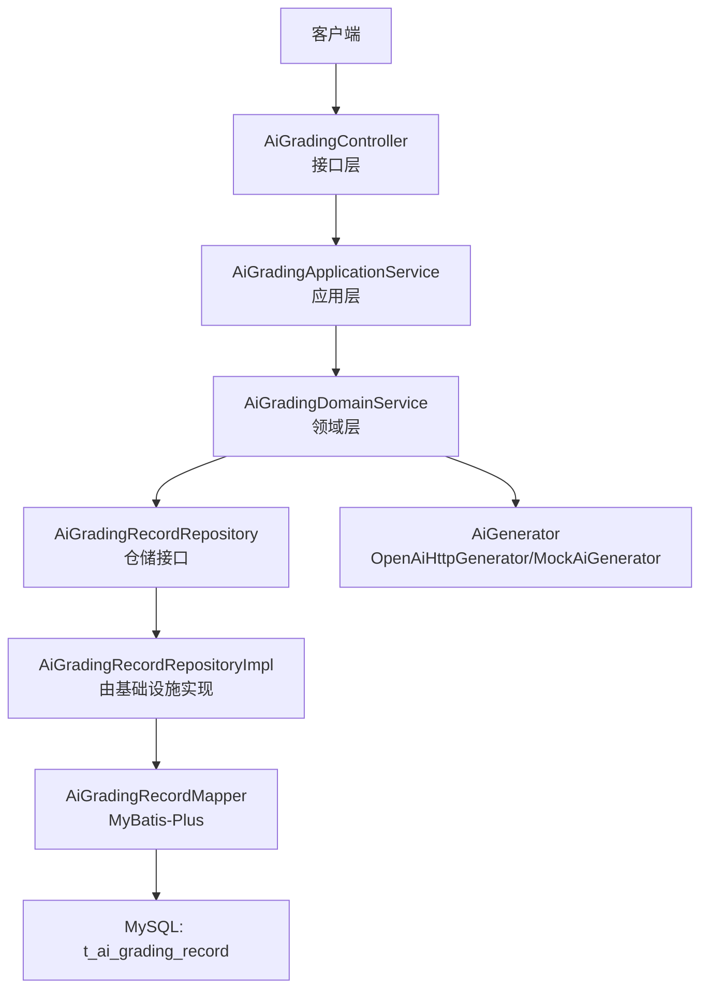
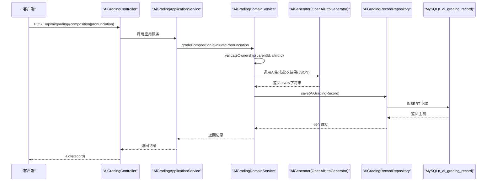
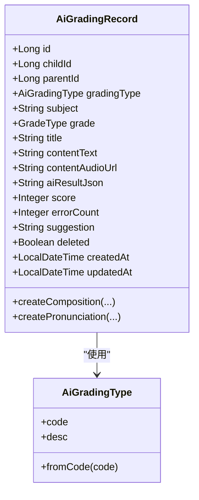
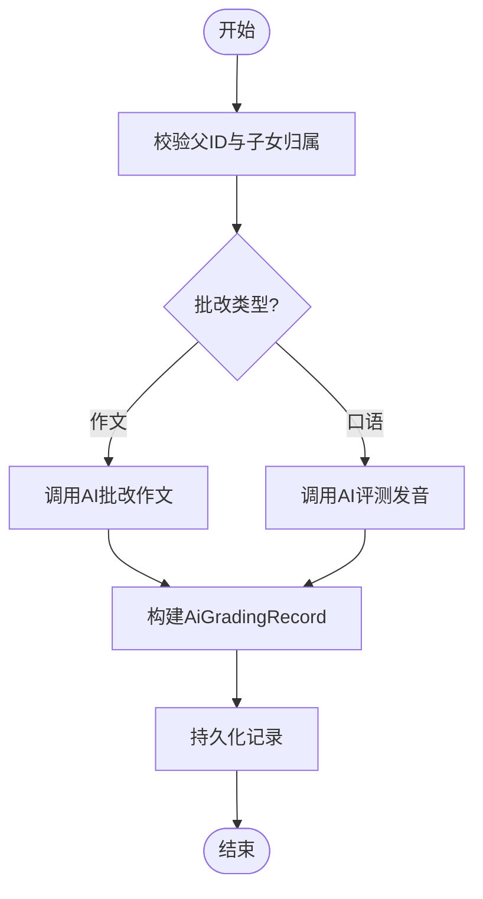
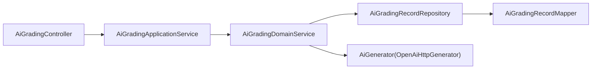

# AI作业批改记录表

<cite>
**本文引用的文件列表**
- [t_ai_grading_record.sql](file://wzoto-backend/sql/t_ai_grading_record.sql)
- [AiGradingRecord.java](file://wzoto-backend/wzoto-domain/src/main/java/com/wzoto/domain/entity/AiGradingRecord.java)
- [AiGradingType.java](file://wzoto-backend/wzoto-domain/src/main/java/com/wzoto/domain/valobj/AiGradingType.java)
- [AiGradingApplicationService.java](file://wzoto-backend/wzoto-application/src/main/java/com/wzoto/application/service/AiGradingApplicationService.java)
- [AiGradingDomainService.java](file://wzoto-backend/wzoto-domain/src/main/java/com/wzoto/domain/service/AiGradingDomainService.java)
- [AiGradingRecordPO.java](file://wzoto-backend/wzoto-infrastructure/src/main/java/com/wzoto/infrastructure/pojo/AiGradingRecordPO.java)
- [AiGradingRecordMapper.java](file://wzoto-backend/wzoto-infrastructure/src/main/java/com/wzoto/infrastructure/mapper/AiGradingRecordMapper.java)
- [AiGradingRecordRepository.java](file://wzoto-backend/wzoto-domain/src/main/java/com/wzoto/domain/repository/AiGradingRecordRepository.java)
- [AiGradingController.java](file://wzoto-backend/wzoto-interfaces/src/main/java/com/wzoto/interfaces/controller/AiGradingController.java)
- [OpenAiHttpGenerator.java](file://wzoto-backend/wzoto-infrastructure/src/main/java/com/wzoto/infrastructure/ai/OpenAiHttpGenerator.java)
- [CompositionGradeDTO.java](file://wzoto-backend/wzoto-interfaces/src/main/java/com/wzoto/interfaces/dto/CompositionGradeDTO.java)
- [PronunciationEvalDTO.java](file://wzoto-backend/wzoto-interfaces/src/main/java/com/wzoto/interfaces/dto/PronunciationEvalDTO.java)
</cite>

## 目录
1. [引言](#引言)
2. [项目结构](#项目结构)
3. [核心组件](#核心组件)
4. [架构总览](#架构总览)
5. [详细组件分析](#详细组件分析)
6. [依赖关系分析](#依赖关系分析)
7. [性能与扩展性](#性能与扩展性)
8. [故障排查指南](#故障排查指南)
9. [结论](#结论)
10. [附录：字段与数据模型说明](#附录字段与数据模型说明)

## 引言
本文件围绕 t_ai_grading_record 表及其在系统中的完整实现，系统化阐述AI作业批改记录的存储结构、评分标准定义、反馈信息格式、非结构化数据处理方式、机器学习结果存储策略、批量批改支持方案、批改质量评估机制、错误识别算法、个性化反馈生成方法、数据分析与教学效果评估指标，以及版本管理与追溯机制。目标是帮助开发者、产品与教研人员准确理解并高效使用该能力。

## 项目结构
围绕AI批改能力，系统采用分层架构：接口层暴露REST API；应用层编排业务流程；领域层封装业务规则与实体；基础设施层负责持久化与外部AI服务调用。

图表来源
- [AiGradingController.java:1-42](file://wzoto-backend/wzoto-interfaces/src/main/java/com/wzoto/interfaces/controller/AiGradingController.java#L1-L42)
- [AiGradingApplicationService.java:1-40](file://wzoto-backend/wzoto-application/src/main/java/com/wzoto/application/service/AiGradingApplicationService.java#L1-L40)
- [AiGradingDomainService.java:1-89](file://wzoto-backend/wzoto-domain/src/main/java/com/wzoto/domain/service/AiGradingDomainService.java#L1-L89)
- [AiGradingRecordRepository.java:1-13](file://wzoto-backend/wzoto-domain/src/main/java/com/wzoto/domain/repository/AiGradingRecordRepository.java#L1-L13)
- [AiGradingRecordMapper.java:1-10](file://wzoto-backend/wzoto-infrastructure/src/main/java/com/wzoto/infrastructure/mapper/AiGradingRecordMapper.java#L1-L10)
- [OpenAiHttpGenerator.java:1-394](file://wzoto-backend/wzoto-infrastructure/src/main/java/com/wzoto/infrastructure/ai/OpenAiHttpGenerator.java#L1-L394)

章节来源
- [AiGradingController.java:1-42](file://wzoto-backend/wzoto-interfaces/src/main/java/com/wzoto/interfaces/controller/AiGradingController.java#L1-L42)
- [AiGradingApplicationService.java:1-40](file://wzoto-backend/wzoto-application/src/main/java/com/wzoto/application/service/AiGradingApplicationService.java#L1-L40)
- [AiGradingDomainService.java:1-89](file://wzoto-backend/wzoto-domain/src/main/java/com/wzoto/domain/service/AiGradingDomainService.java#L1-L89)
- [AiGradingRecordRepository.java:1-13](file://wzoto-backend/wzoto-domain/src/main/java/com/wzoto/domain/repository/AiGradingRecordRepository.java#L1-L13)
- [AiGradingRecordMapper.java:1-10](file://wzoto-backend/wzoto-infrastructure/src/main/java/com/wzoto/infrastructure/mapper/AiGradingRecordMapper.java#L1-L10)
- [OpenAiHttpGenerator.java:1-394](file://wzoto-backend/wzoto-infrastructure/src/main/java/com/wzoto/infrastructure/ai/OpenAiHttpGenerator.java#L1-L394)

## 核心组件
- 数据表：t_ai_grading_record，用于持久化每次AI批改的元数据与结果。
- 领域实体：AiGradingRecord，承载批改记录的业务语义与工厂方法。
- 值对象：AiGradingType，限定批改类型（作文/口语）。
- 应用服务：AiGradingApplicationService，协调用户上下文与领域服务。
- 领域服务：AiGradingDomainService，实现批改流程、权限校验、结果落库。
- 基础设施：OpenAiHttpGenerator，通过HTTP调用OpenAI兼容API完成作文批改与口语评测；MockAiGenerator提供离线降级能力。
- 持久化：AiGradingRecordPO + AiGradingRecordMapper，基于MyBatis-Plus映射到数据库。

章节来源
- [t_ai_grading_record.sql:1-28](file://wzoto-backend/sql/t_ai_grading_record.sql#L1-L28)
- [AiGradingRecord.java:1-67](file://wzoto-backend/wzoto-domain/src/main/java/com/wzoto/domain/entity/AiGradingRecord.java#L1-L67)
- [AiGradingType.java:1-31](file://wzoto-backend/wzoto-domain/src/main/java/com/wzoto/domain/valobj/AiGradingType.java#L1-L31)
- [AiGradingApplicationService.java:1-40](file://wzoto-backend/wzoto-application/src/main/java/com/wzoto/application/service/AiGradingApplicationService.java#L1-L40)
- [AiGradingDomainService.java:1-89](file://wzoto-backend/wzoto-domain/src/main/java/com/wzoto/domain/service/AiGradingDomainService.java#L1-L89)
- [OpenAiHttpGenerator.java:1-394](file://wzoto-backend/wzoto-infrastructure/src/main/java/com/wzoto/infrastructure/ai/OpenAiHttpGenerator.java#L1-L394)
- [AiGradingRecordPO.java:1-32](file://wzoto-backend/wzoto-infrastructure/src/main/java/com/wzoto/infrastructure/pojo/AiGradingRecordPO.java#L1-L32)
- [AiGradingRecordMapper.java:1-10](file://wzoto-backend/wzoto-infrastructure/src/main/java/com/wzoto/infrastructure/mapper/AiGradingRecordMapper.java#L1-L10)

## 架构总览
下图展示了从前端发起请求到AI批改结果落库的端到端流程，包括权限校验、AI调用、结果解析与持久化。

图表来源
- [AiGradingController.java:1-42](file://wzoto-backend/wzoto-interfaces/src/main/java/com/wzoto/interfaces/controller/AiGradingController.java#L1-L42)
- [AiGradingApplicationService.java:1-40](file://wzoto-backend/wzoto-application/src/main/java/com/wzoto/application/service/AiGradingApplicationService.java#L1-L40)
- [AiGradingDomainService.java:1-89](file://wzoto-backend/wzoto-domain/src/main/java/com/wzoto/domain/service/AiGradingDomainService.java#L1-L89)
- [OpenAiHttpGenerator.java:1-394](file://wzoto-backend/wzoto-infrastructure/src/main/java/com/wzoto/infrastructure/ai/OpenAiHttpGenerator.java#L1-L394)

## 详细组件分析

### 数据表设计：t_ai_grading_record
- 用途：存储每次AI批改的元数据与结果，支撑作文批改与口语评测两类场景。
- 关键字段
  - grading_type：批改类型，枚举值 COMPOSITION（作文批改）、PRONUNCIATION（口语评测）。
  - subject：学科，如 CHINESE、ENGLISH。
  - grade：年级，便于按学段统计与分析。
  - title：标题（作文题目或跟读单词）。
  - content_text：文本内容（作文正文），用于非结构化文本输入。
  - content_audio_url：音频URL（口语录音），用于非结构化音频输入。
  - ai_result_json：AI批改结果JSON，包含分数、纠错、建议等结构化输出。
  - score：AI评分（0-100），便于快速检索与排序。
  - error_count：错误数量（错别字/病句/发音错误），用于错误密度分析。
  - suggestion：优化建议摘要，面向家长/学生展示。
  - deleted：逻辑删除标记。
  - created_at/updated_at：时间戳，支持审计与排序。
- 索引：child_id、parent_id、grading_type、subject、created_at，提升查询效率。

章节来源
- [t_ai_grading_record.sql:1-28](file://wzoto-backend/sql/t_ai_grading_record.sql#L1-L28)

### 领域实体与值对象
- AiGradingRecord：领域实体，封装创建作文/口语记录的工厂方法，统一初始化默认值（如deleted=false）。
- AiGradingType：值对象，限定批改类型并提供fromCode转换，保证类型安全。

图表来源
- [AiGradingRecord.java:1-67](file://wzoto-backend/wzoto-domain/src/main/java/com/wzoto/domain/entity/AiGradingRecord.java#L1-L67)
- [AiGradingType.java:1-31](file://wzoto-backend/wzoto-domain/src/main/java/com/wzoto/domain/valobj/AiGradingType.java#L1-L31)

章节来源
- [AiGradingRecord.java:1-67](file://wzoto-backend/wzoto-domain/src/main/java/com/wzoto/domain/entity/AiGradingRecord.java#L1-L67)
- [AiGradingType.java:1-31](file://wzoto-backend/wzoto-domain/src/main/java/com/wzoto/domain/valobj/AiGradingType.java#L1-L31)

### 应用与领域服务
- AiGradingApplicationService：接收请求参数，注入当前用户上下文（parentId），委派给领域服务。
- AiGradingDomainService：
  - 权限校验：validateOwnership确保操作者为子女档案所有者。
  - 作文批改：gradeComposition调用AI生成JSON结果，构造记录并保存。
  - 口语评测：evaluatePronunciation调用AI生成JSON结果，构造记录并保存。
  - 历史查询：getHistory/getHistoryByType按childId或类型查询。

图表来源
- [AiGradingDomainService.java:1-89](file://wzoto-backend/wzoto-domain/src/main/java/com/wzoto/domain/service/AiGradingDomainService.java#L1-L89)

章节来源
- [AiGradingApplicationService.java:1-40](file://wzoto-backend/wzoto-application/src/main/java/com/wzoto/application/service/AiGradingApplicationService.java#L1-L40)
- [AiGradingDomainService.java:1-89](file://wzoto-backend/wzoto-domain/src/main/java/com/wzoto/domain/service/AiGradingDomainService.java#L1-L89)

### 接口层与数据传输对象
- AiGradingController：暴露三个接口
  - POST /api/ai/grading/composition：作文批改
  - POST /api/ai/grading/pronunciation：口语评测
  - GET /api/ai/grading/history/{childId}：查询历史
- DTO：
  - CompositionGradeDTO：校验childId、subject、title、content必填。
  - PronunciationEvalDTO：校验childId必填，可选title/audioUrl/audioTranscript。

章节来源
- [AiGradingController.java:1-42](file://wzoto-backend/wzoto-interfaces/src/main/java/com/wzoto/interfaces/controller/AiGradingController.java#L1-L42)
- [CompositionGradeDTO.java:1-19](file://wzoto-backend/wzoto-interfaces/src/main/java/com/wzoto/interfaces/dto/CompositionGradeDTO.java#L1-L19)
- [PronunciationEvalDTO.java:1-15](file://wzoto-backend/wzoto-interfaces/src/main/java/com/wzoto/interfaces/dto/PronunciationEvalDTO.java#L1-L15)

### AI能力与结果存储
- OpenAiHttpGenerator：通过HTTP调用OpenAI兼容接口，返回JSON字符串，包含评分、纠错、建议等结构化字段。
- 降级策略：当API失败或异常时，返回预设的降级JSON，保证系统可用性。
- 结果存储：ai_result_json字段以MEDIUMTEXT存储完整JSON，score/error_count/suggestion为冗余字段，便于快速检索与展示。

章节来源
- [OpenAiHttpGenerator.java:1-394](file://wzoto-backend/wzoto-infrastructure/src/main/java/com/wzoto/infrastructure/ai/OpenAiHttpGenerator.java#L1-L394)
- [AiGradingDomainService.java:1-89](file://wzoto-backend/wzoto-domain/src/main/java/com/wzoto/domain/service/AiGradingDomainService.java#L1-L89)
- [t_ai_grading_record.sql:1-28](file://wzoto-backend/sql/t_ai_grading_record.sql#L1-L28)

## 依赖关系分析
- 控制器依赖应用服务，应用服务依赖领域服务，领域服务依赖仓储接口与AI生成器。
- 仓储接口由基础设施实现，通过MyBatis-Plus Mapper访问数据库。
- AI生成器可替换（OpenAiHttpGenerator或MockAiGenerator），通过配置开关启用。

图表来源
- [AiGradingController.java:1-42](file://wzoto-backend/wzoto-interfaces/src/main/java/com/wzoto/interfaces/controller/AiGradingController.java#L1-L42)
- [AiGradingApplicationService.java:1-40](file://wzoto-backend/wzoto-application/src/main/java/com/wzoto/application/service/AiGradingApplicationService.java#L1-L40)
- [AiGradingDomainService.java:1-89](file://wzoto-backend/wzoto-domain/src/main/java/com/wzoto/domain/service/AiGradingDomainService.java#L1-L89)
- [AiGradingRecordRepository.java:1-13](file://wzoto-backend/wzoto-domain/src/main/java/com/wzoto/domain/repository/AiGradingRecordRepository.java#L1-L13)
- [AiGradingRecordMapper.java:1-10](file://wzoto-backend/wzoto-infrastructure/src/main/java/com/wzoto/infrastructure/mapper/AiGradingRecordMapper.java#L1-L10)
- [OpenAiHttpGenerator.java:1-394](file://wzoto-backend/wzoto-infrastructure/src/main/java/com/wzoto/infrastructure/ai/OpenAiHttpGenerator.java#L1-L394)

章节来源
- [AiGradingRecordRepository.java:1-13](file://wzoto-backend/wzoto-domain/src/main/java/com/wzoto/domain/repository/AiGradingRecordRepository.java#L1-L13)
- [AiGradingRecordMapper.java:1-10](file://wzoto-backend/wzoto-infrastructure/src/main/java/com/wzoto/infrastructure/mapper/AiGradingRecordMapper.java#L1-L10)

## 性能与扩展性
- 查询性能：通过索引（child_id、parent_id、grading_type、subject、created_at）优化常见查询路径。
- 写入性能：ai_result_json使用MEDIUMTEXT，适合存储较大JSON；建议在高频写入场景考虑异步落库或分片存储。
- 可扩展性：AiGenerator接口解耦AI实现，可无缝切换不同供应商或本地模型；可通过配置开关控制启用。
- 批处理建议：当前接口为单条处理，若需批量批改，可在应用层增加批量入口，内部循环调用领域服务，并结合事务与重试策略保障一致性。

[本节为通用指导，不直接分析具体文件]

## 故障排查指南
- AI调用失败：OpenAiHttpGenerator在异常时返回降级JSON，检查日志中的状态码与响应体，确认网络与鉴权配置。
- 权限错误：AiGradingDomainService.validateOwnership会抛出非法参数异常，核对parentId与childId归属关系。
- 数据不一致：检查ai_result_json与score/error_count/suggestion是否同步更新；必要时以JSON为准进行二次解析。
- 查询为空：确认索引是否存在，检查deleted是否为0，验证查询条件是否正确。

章节来源
- [OpenAiHttpGenerator.java:1-394](file://wzoto-backend/wzoto-infrastructure/src/main/java/com/wzoto/infrastructure/ai/OpenAiHttpGenerator.java#L1-L394)
- [AiGradingDomainService.java:1-89](file://wzoto-backend/wzoto-domain/src/main/java/com/wzoto/domain/service/AiGradingDomainService.java#L1-L89)

## 结论
t_ai_grading_record表与配套服务构成了完整的AI作业批改能力闭环：从接口接入、权限校验、AI生成、结果解析到持久化存储，均具备清晰的职责划分与良好的扩展性。通过结构化JSON存储与非结构化输入（文本/音频）的统一抽象，系统能够灵活支持作文批改与口语评测，并为后续的数据分析与教学评估奠定基础。

[本节为总结性内容，不直接分析具体文件]

## 附录：字段与数据模型说明

### 字段含义与用途
- grading_type：批改类型，COMPOSITION（作文批改）、PRONUNCIATION（口语评测）。
- score：AI评分（0-100），用于快速检索与排序。
- feedback：对应suggestion字段，作为优化建议摘要，面向用户展示。
- correction：体现在ai_result_json的结构化纠错数组中，结合error_count统计错误密度。

章节来源
- [t_ai_grading_record.sql:1-28](file://wzoto-backend/sql/t_ai_grading_record.sql#L1-L28)
- [AiGradingRecord.java:1-67](file://wzoto-backend/wzoto-domain/src/main/java/com/wzoto/domain/entity/AiGradingRecord.java#L1-L67)

### 非结构化数据处理
- 文本：content_text存储作文正文，便于全文检索与NLP处理。
- 音频：content_audio_url存储录音URL，配合语音转写（audioTranscript）进入AI评测流程。

章节来源
- [t_ai_grading_record.sql:1-28](file://wzoto-backend/sql/t_ai_grading_record.sql#L1-L28)
- [PronunciationEvalDTO.java:1-15](file://wzoto-backend/wzoto-interfaces/src/main/java/com/wzoto/interfaces/dto/PronunciationEvalDTO.java#L1-L15)

### 机器学习结果存储
- ai_result_json：以MEDIUMTEXT存储完整JSON，包含score、errors、suggestions、overallComment等字段，便于回溯与再分析。
- 冗余字段：score、error_count、suggestion用于快速查询与展示，减少解析开销。

章节来源
- [OpenAiHttpGenerator.java:1-394](file://wzoto-backend/wzoto-infrastructure/src/main/java/com/wzoto/infrastructure/ai/OpenAiHttpGenerator.java#L1-L394)
- [t_ai_grading_record.sql:1-28](file://wzoto-backend/sql/t_ai_grading_record.sql#L1-L28)

### 批量批改支持
- 当前接口为单条处理；建议在应用层新增批量接口，内部循环调用领域服务，结合事务与重试策略保障一致性。
- 可引入消息队列进行异步批处理，提升吞吐与容错能力。

[本节为通用指导，不直接分析具体文件]

### 批改质量评估机制
- 质量维度：score（总分）、error_count（错误密度）、suggestion（建议质量）、ai_result_json（完整性）。
- 评估方法：定期抽样人工复核，计算一致性与偏差；对低分样本进行专项分析。

[本节为通用指导，不直接分析具体文件]

### 错误识别算法
- 作文：errors数组包含错别字、病句等定位信息，结合error_count统计。
- 口语：pronunciationDetails与suggestions描述发音问题与改进建议。

章节来源
- [OpenAiHttpGenerator.java:1-394](file://wzoto-backend/wzoto-infrastructure/src/main/java/com/wzoto/infrastructure/ai/OpenAiHttpGenerator.java#L1-L394)

### 个性化反馈生成
- suggestion字段提供摘要建议；ai_result_json包含更详细的个性化指导，可按学段与学科定制提示词模板。

章节来源
- [OpenAiHttpGenerator.java:1-394](file://wzoto-backend/wzoto-infrastructure/src/main/java/com/wzoto/infrastructure/ai/OpenAiHttpGenerator.java#L1-L394)
- [t_ai_grading_record.sql:1-28](file://wzoto-backend/sql/t_ai_grading_record.sql#L1-L28)

### 批改数据分析方法与教学效果评估指标
- 分析方法：按child_id、subject、grade、grading_type聚合统计平均分、错误率、趋势变化；结合时间序列观察进步曲线。
- 评估指标：平均分提升幅度、错误率下降比例、建议采纳率（通过后续提交对比）、个体差异分析（方差与离群点）。

[本节为通用指导，不直接分析具体文件]

### 版本管理与追溯机制
- 版本管理：建议在ai_result_json中增加version字段，标识Prompt/模型版本，便于回溯与A/B测试。
- 追溯机制：利用created_at/updated_at与deleted字段实现审计追踪；结合索引支持按时间与类型检索。

[本节为通用指导，不直接分析具体文件]