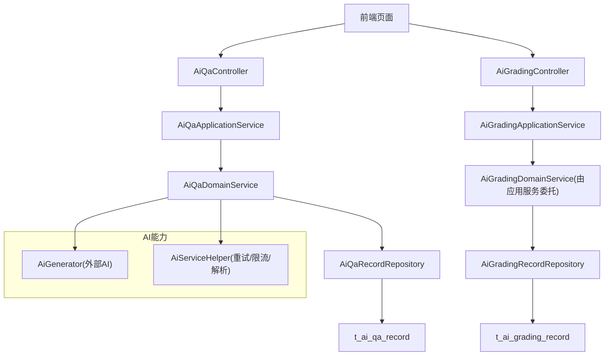
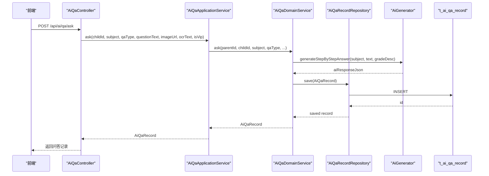
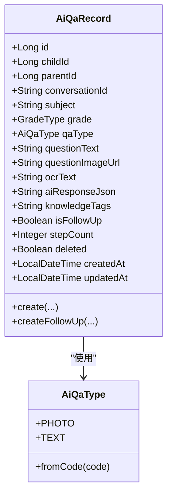
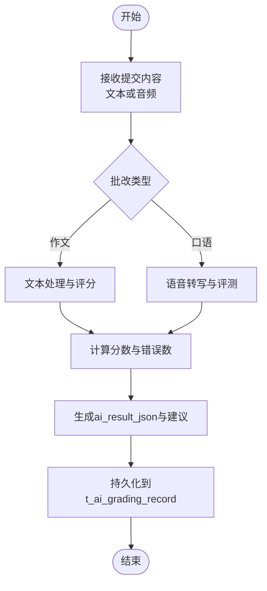
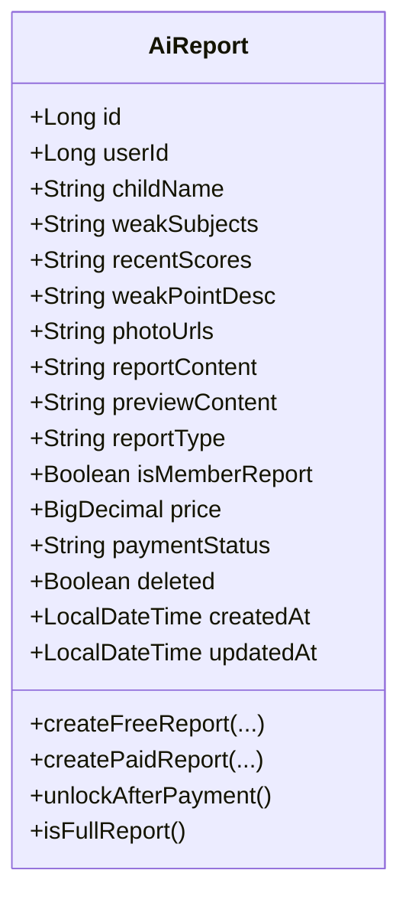
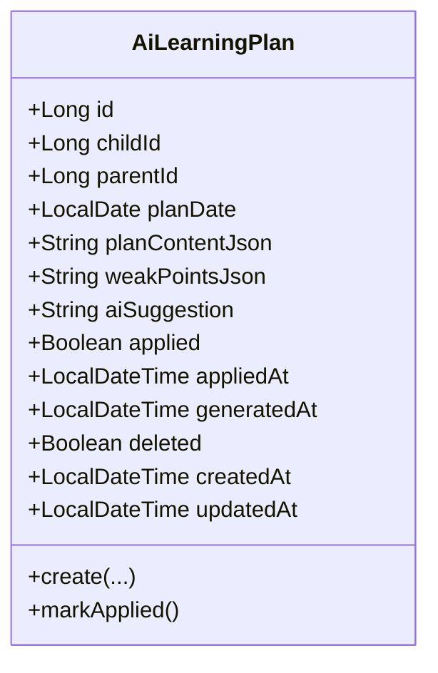
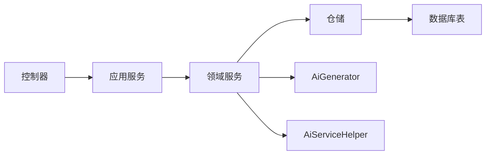

# AI功能表

<cite>
**本文引用的文件**
- [t_ai_qa_record.sql](file://wzoto-backend/sql/t_ai_qa_record.sql)
- [t_ai_grading_record.sql](file://wzoto-backend/sql/t_ai_grading_record.sql)
- [t_ai_report.sql](file://wzoto-backend/sql/t_ai_report.sql)
- [t_ai_learning_plan.sql](file://wzoto-backend/sql/t_ai_learning_plan.sql)
- [AiQaRecord.java](file://wzoto-backend/wzoto-domain/src/main/java/com/wzoto/domain/entity/AiQaRecord.java)
- [AiGradingRecord.java](file://wzoto-backend/wzoto-domain/src/main/java/com/wzoto/domain/entity/AiGradingRecord.java)
- [AiReport.java](file://wzoto-backend/wzoto-domain/src/main/java/com/wzoto/domain/entity/AiReport.java)
- [AiLearningPlan.java](file://wzoto-backend/wzoto-domain/src/main/java/com/wzoto/domain/entity/AiLearningPlan.java)
- [AiQaType.java](file://wzoto-backend/wzoto-domain/src/main/java/com/wzoto/domain/valobj/AiQaType.java)
- [AiGradingType.java](file://wzoto-backend/wzoto-domain/src/main/java/com/wzoto/domain/valobj/AiGradingType.java)
- [AiQaApplicationService.java](file://wzoto-backend/wzoto-application/src/main/java/com/wzoto/application/service/AiQaApplicationService.java)
- [AiGradingApplicationService.java](file://wzoto-backend/wzoto-application/src/main/java/com/wzoto/application/service/AiGradingApplicationService.java)
- [AiReportApplicationService.java](file://wzoto-backend/wzoto-application/src/main/java/com/wzoto/application/service/AiReportApplicationService.java)
- [AiLearningPlanApplicationService.java](file://wzoto-backend/wzoto-application/src/main/java/com/wzoto/application/service/AiLearningPlanApplicationService.java)
- [AiQaController.java](file://wzoto-backend/wzoto-interfaces/src/main/java/com/wzoto/interfaces/controller/AiQaController.java)
- [AiGradingController.java](file://wzoto-backend/wzoto-interfaces/src/main/java/com/wzoto/interfaces/controller/AiGradingController.java)
- [AiQaDomainService.java](file://wzoto-backend/wzoto-domain/src/main/java/com/wzoto/domain/service/AiQaDomainService.java)
- [AiServiceHelper.java](file://wzoto-backend/wzoto-infrastructure/src/main/java/com/wzoto/infrastructure/ai/AiServiceHelper.java)
</cite>

## 目录
1. [简介](#简介)
2. [项目结构](#项目结构)
3. [核心组件](#核心组件)
4. [架构总览](#架构总览)
5. [详细组件分析](#详细组件分析)
6. [依赖关系分析](#依赖关系分析)
7. [性能考虑](#性能考虑)
8. [故障排查指南](#故障排查指南)
9. [结论](#结论)
10. [附录](#附录)

## 简介
本文件聚焦于wzoto项目的AI功能数据模型与相关服务，围绕以下四张核心表展开：
- t_ai_qa_record：AI问答记录，支撑对话历史、上下文管理与回答质量评估。
- t_ai_grading_record：AI批改记录，承载作文批改与口语评测结果、评分标准与反馈信息。
- t_ai_report：学情诊断报告，提供学习分析、能力评估与个性化建议的存储与展示。
- t_ai_learning_plan：学习计划，支持计划生成、执行跟踪与动态调整。

同时，文档总结了AI数据模型的特点（非结构化数据处理、机器学习结果存储、实时数据分析），并给出查询优化与缓存策略建议，以及数据安全与隐私保护措施。

## 项目结构
AI功能在分层架构中实现：
- 接口层：控制器暴露REST API，负责参数校验与日志埋点。
- 应用层：应用服务编排业务流程，协调领域服务与外部AI能力。
- 领域层：领域实体与值对象表达业务概念；领域服务封装核心规则（如权限校验、次数限制）。
- 基础设施层：持久化映射、AI调用辅助工具（重试、限流、JSON解析等）。

图表来源
- [AiQaController.java:1-51](file://wzoto-backend/wzoto-interfaces/src/main/java/com/wzoto/interfaces/controller/AiQaController.java#L1-L51)
- [AiGradingController.java:1-42](file://wzoto-backend/wzoto-interfaces/src/main/java/com/wzoto/interfaces/controller/AiGradingController.java#L1-L42)
- [AiQaApplicationService.java:1-43](file://wzoto-backend/wzoto-application/src/main/java/com/wzoto/application/service/AiQaApplicationService.java#L1-L43)
- [AiGradingApplicationService.java:1-40](file://wzoto-backend/wzoto-application/src/main/java/com/wzoto/application/service/AiGradingApplicationService.java#L1-L40)
- [AiQaDomainService.java:1-106](file://wzoto-backend/wzoto-domain/src/main/java/com/wzoto/domain/service/AiQaDomainService.java#L1-L106)
- [AiServiceHelper.java:1-66](file://wzoto-backend/wzoto-infrastructure/src/main/java/com/wzoto/infrastructure/ai/AiServiceHelper.java#L1-L66)

章节来源
- [AiQaController.java:1-51](file://wzoto-backend/wzoto-interfaces/src/main/java/com/wzoto/interfaces/controller/AiQaController.java#L1-L51)
- [AiGradingController.java:1-42](file://wzoto-backend/wzoto-interfaces/src/main/java/com/wzoto/interfaces/controller/AiGradingController.java#L1-L42)
- [AiQaApplicationService.java:1-43](file://wzoto-backend/wzoto-application/src/main/java/com/wzoto/application/service/AiQaApplicationService.java#L1-L43)
- [AiGradingApplicationService.java:1-40](file://wzoto-backend/wzoto-application/src/main/java/com/wzoto/application/service/AiGradingApplicationService.java#L1-L40)
- [AiQaDomainService.java:1-106](file://wzoto-backend/wzoto-domain/src/main/java/com/wzoto/domain/service/AiQaDomainService.java#L1-L106)
- [AiServiceHelper.java:1-66](file://wzoto-backend/wzoto-infrastructure/src/main/java/com/wzoto/infrastructure/ai/AiServiceHelper.java#L1-L66)

## 核心组件
- 问答记录（AiQaRecord）：承载提问类型（拍照/文字）、问题文本与图片、OCR识别文本、AI回复JSON、知识点标签、是否追问、步骤数等。
- 批改记录（AiGradingRecord）：承载批改类型（作文/口语）、学科年级、标题、内容文本或音频URL、AI结果JSON、分数、错误数与建议摘要。
- 学情报告（AiReport）：承载薄弱学科、近期成绩、薄弱点描述、照片URL、完整报告与预览内容、报告类型、会员免费标识、价格与支付状态。
- 学习计划（AiLearningPlan）：承载计划日期、计划内容JSON、薄弱点JSON、AI建议、是否已应用到学习任务及时间戳。

章节来源
- [t_ai_qa_record.sql:5-29](file://wzoto-backend/sql/t_ai_qa_record.sql#L5-L29)
- [t_ai_grading_record.sql:5-27](file://wzoto-backend/sql/t_ai_grading_record.sql#L5-L27)
- [t_ai_report.sql:4-23](file://wzoto-backend/sql/t_ai_report.sql#L4-L23)
- [t_ai_learning_plan.sql:5-23](file://wzoto-backend/sql/t_ai_learning_plan.sql#L5-L23)
- [AiQaRecord.java:1-73](file://wzoto-backend/wzoto-domain/src/main/java/com/wzoto/domain/entity/AiQaRecord.java#L1-L73)
- [AiGradingRecord.java:1-67](file://wzoto-backend/wzoto-domain/src/main/java/com/wzoto/domain/entity/AiGradingRecord.java#L1-L67)
- [AiReport.java:1-106](file://wzoto-backend/wzoto-domain/src/main/java/com/wzoto/domain/entity/AiReport.java#L1-L106)
- [AiLearningPlan.java:1-56](file://wzoto-backend/wzoto-domain/src/main/java/com/wzoto/domain/entity/AiLearningPlan.java#L1-L56)

## 架构总览
AI功能通过“控制器→应用服务→领域服务→仓储→数据库”的分层路径完成数据读写与业务编排；AI能力通过领域服务统一接入，基础设施层提供重试、限流与JSON字段提取等通用能力。

图表来源
- [AiQaController.java:25-31](file://wzoto-backend/wzoto-interfaces/src/main/java/com/wzoto/interfaces/controller/AiQaController.java#L25-L31)
- [AiQaApplicationService.java:21-27](file://wzoto-backend/wzoto-application/src/main/java/com/wzoto/application/service/AiQaApplicationService.java#L21-L27)
- [AiQaDomainService.java:34-57](file://wzoto-backend/wzoto-domain/src/main/java/com/wzoto/domain/service/AiQaDomainService.java#L34-L57)

## 详细组件分析

### 问答记录（t_ai_qa_record）设计
- 对话历史与上下文管理
  - conversation_id用于聚合同一轮对话的多条记录，支持追问场景。
  - is_follow_up标记是否为追问，便于区分首问与续问。
  - subject/grade限定学科与年级，配合AiQaType区分拍照搜题与文字提问。
- 回答质量评估
  - ai_response_json保存AI分步解析、知识点、变式题等结构化输出。
  - knowledge_tags用于后续知识图谱关联与检索。
  - step_count可用于衡量回答复杂度与教学深度。
- 索引与查询优化
  - 针对child_id、parent_id、conversation_id、subject、created_at建立索引，支持按子女、家长、会话、学科与时间范围的高效查询。
  - 复合索引idx_child_subject支持按子女+学科的批量统计。

图表来源
- [AiQaRecord.java:1-73](file://wzoto-backend/wzoto-domain/src/main/java/com/wzoto/domain/entity/AiQaRecord.java#L1-L73)
- [AiQaType.java:1-31](file://wzoto-backend/wzoto-domain/src/main/java/com/wzoto/domain/valobj/AiQaType.java#L1-L31)

章节来源
- [t_ai_qa_record.sql:5-29](file://wzoto-backend/sql/t_ai_qa_record.sql#L5-L29)
- [AiQaRecord.java:1-73](file://wzoto-backend/wzoto-domain/src/main/java/com/wzoto/domain/entity/AiQaRecord.java#L1-L73)
- [AiQaType.java:1-31](file://wzoto-backend/wzoto-domain/src/main/java/com/wzoto/domain/valobj/AiQaType.java#L1-L31)
- [AiQaDomainService.java:34-106](file://wzoto-backend/wzoto-domain/src/main/java/com/wzoto/domain/service/AiQaDomainService.java#L34-L106)

### 批改记录（t_ai_grading_record）设计
- 批改结果与评分标准
  - grading_type区分作文批改与口语评测；subject/grade限定学科与年级。
  - score为AI评分（0-100），error_count统计错别字/病句/发音错误数量。
  - suggestion提供优化建议摘要，便于用户快速理解改进方向。
- 反馈信息
  - ai_result_json保存详细的批改结果（含纠错定位、评分维度、改进建议等）。
  - content_text/content_audio_url分别承载文本与音频输入，适配不同题型。
- 索引与查询优化
  - 针对grading_type、subject、created_at建立索引，支持按类型、学科与时间的筛选与排序。

图表来源
- [t_ai_grading_record.sql:5-27](file://wzoto-backend/sql/t_ai_grading_record.sql#L5-L27)
- [AiGradingRecord.java:1-67](file://wzoto-backend/wzoto-domain/src/main/java/com/wzoto/domain/entity/AiGradingRecord.java#L1-L67)
- [AiGradingType.java:1-31](file://wzoto-backend/wzoto-domain/src/main/java/com/wzoto/domain/valobj/AiGradingType.java#L1-L31)

章节来源
- [t_ai_grading_record.sql:5-27](file://wzoto-backend/sql/t_ai_grading_record.sql#L5-L27)
- [AiGradingRecord.java:1-67](file://wzoto-backend/wzoto-domain/src/main/java/com/wzoto/domain/entity/AiGradingRecord.java#L1-L67)
- [AiGradingType.java:1-31](file://wzoto-backend/wzoto-domain/src/main/java/com/wzoto/domain/valobj/AiGradingType.java#L1-L31)
- [AiGradingApplicationService.java:20-38](file://wzoto-backend/wzoto-application/src/main/java/com/wzoto/application/service/AiGradingApplicationService.java#L20-L38)

### 学情报告（t_ai_report）设计
- 学习分析与能力评估
  - weak_subjects、recent_scores、weak_point_desc描述薄弱学科、近期成绩与薄弱知识点。
  - photo_urls支持试卷/错题照片引用，增强诊断依据。
- 个性化建议
  - report_content为AI生成的完整报告（JSON），preview_content为非会员可见的预览摘要。
- 付费与会员机制
  - report_type区分PREVIEW/FULL；is_member_report标识是否会员免费；price与payment_status控制付费解锁流程。
- 索引与查询优化
  - 针对user_id、created_at建立索引，支持按用户与时间范围查询报告列表。

图表来源
- [AiReport.java:1-106](file://wzoto-backend/wzoto-domain/src/main/java/com/wzoto/domain/entity/AiReport.java#L1-L106)
- [t_ai_report.sql:4-23](file://wzoto-backend/sql/t_ai_report.sql#L4-L23)

章节来源
- [t_ai_report.sql:4-23](file://wzoto-backend/sql/t_ai_report.sql#L4-L23)
- [AiReport.java:1-106](file://wzoto-backend/wzoto-domain/src/main/java/com/wzoto/domain/entity/AiReport.java#L1-L106)
- [AiReportApplicationService.java:23-79](file://wzoto-backend/wzoto-application/src/main/java/com/wzoto/application/service/AiReportApplicationService.java#L23-L79)

### 学习计划（t_ai_learning_plan）设计
- 计划生成
  - plan_content_json包含任务列表、时间安排与知识点目标；weak_points_json基于学情分析的薄弱点集合。
  - ai_suggestion提供AI学习建议。
- 执行跟踪与动态调整
  - applied/applied_at标记是否已应用到学习任务，便于追踪执行进度。
  - generated_at记录AI生成时间，支持回溯与版本对比。
- 索引与查询优化
  - 针对child_id、plan_date、applied建立索引，支持按子女、日期与执行状态的查询。

图表来源
- [AiLearningPlan.java:1-56](file://wzoto-backend/wzoto-domain/src/main/java/com/wzoto/domain/entity/AiLearningPlan.java#L1-L56)
- [t_ai_learning_plan.sql:5-23](file://wzoto-backend/sql/t_ai_learning_plan.sql#L5-L23)

章节来源
- [t_ai_learning_plan.sql:5-23](file://wzoto-backend/sql/t_ai_learning_plan.sql#L5-L23)
- [AiLearningPlan.java:1-56](file://wzoto-backend/wzoto-domain/src/main/java/com/wzoto/domain/entity/AiLearningPlan.java#L1-L56)
- [AiLearningPlanApplicationService.java:20-38](file://wzoto-backend/wzoto-application/src/main/java/com/wzoto/application/service/AiLearningPlanApplicationService.java#L20-L38)

## 依赖关系分析
- 控制器与应用服务：控制器仅做参数校验与日志埋点，具体逻辑下沉至应用服务。
- 应用服务与领域服务：应用服务编排流程，领域服务实现核心规则（如所有权校验、次数限制）。
- 领域服务与仓储：领域服务通过仓储访问数据库；AI能力通过AiGenerator注入。
- 基础设施辅助：AiServiceHelper提供重试、限流与JSON字段提取等通用能力。

图表来源
- [AiQaController.java:1-51](file://wzoto-backend/wzoto-interfaces/src/main/java/com/wzoto/interfaces/controller/AiQaController.java#L1-L51)
- [AiQaApplicationService.java:1-43](file://wzoto-backend/wzoto-application/src/main/java/com/wzoto/application/service/AiQaApplicationService.java#L1-L43)
- [AiQaDomainService.java:1-106](file://wzoto-backend/wzoto-domain/src/main/java/com/wzoto/domain/service/AiQaDomainService.java#L1-L106)
- [AiServiceHelper.java:1-66](file://wzoto-backend/wzoto-infrastructure/src/main/java/com/wzoto/infrastructure/ai/AiServiceHelper.java#L1-L66)

章节来源
- [AiQaController.java:1-51](file://wzoto-backend/wzoto-interfaces/src/main/java/com/wzoto/interfaces/controller/AiQaController.java#L1-L51)
- [AiQaApplicationService.java:1-43](file://wzoto-backend/wzoto-application/src/main/java/com/wzoto/application/service/AiQaApplicationService.java#L1-L43)
- [AiQaDomainService.java:1-106](file://wzoto-backend/wzoto-domain/src/main/java/com/wzoto/domain/service/AiQaDomainService.java#L1-L106)
- [AiServiceHelper.java:1-66](file://wzoto-backend/wzoto-infrastructure/src/main/java/com/wzoto/infrastructure/ai/AiServiceHelper.java#L1-L66)

## 性能考虑
- 查询优化
  - 充分利用现有索引：child_id、parent_id、conversation_id、subject、grading_type、plan_date、user_id、created_at等。
  - 对高频查询采用分页与投影，避免全量加载大字段（如ai_response_json、report_content）。
  - 对复杂条件组合（如按子女+学科+时间范围）可考虑覆盖索引或物化视图。
- 缓存策略
  - 会话级缓存：conversation_id对应的对话历史可使用短时缓存降低重复读取。
  - 报告预览缓存：preview_content可按user_id+report_id进行缓存，减少频繁生成。
  - AI结果缓存：对相同subject/question/grade的AI回答可进行短期缓存，提高响应速度。
- 并发与限流
  - 借助AiServiceHelper的每日调用次数检查与重试机制，保护后端与第三方AI服务。
  - 对免费用户的每日答疑次数进行限制，避免滥用。

[本节为通用指导，不直接分析具体文件]

## 故障排查指南
- 常见异常
  - 无权操作：当parentId与childId不匹配时抛出非法参数异常，需检查用户上下文与权限校验。
  - 会话不存在：追问时若conversation_id无效将报错，需确认会话创建与传递是否正确。
  - 次数超限：免费用户超过每日限制会抛出异常，需引导开通会员或等待次日重置。
- 调试建议
  - 查看控制器日志埋点（BI日志），确认请求参数与用户ID。
  - 检查AiServiceHelper的重试与限流日志，定位AI调用失败原因。
  - 核对数据库索引命中情况，必要时添加或调整索引。

章节来源
- [AiQaDomainService.java:99-104](file://wzoto-backend/wzoto-domain/src/main/java/com/wzoto/domain/service/AiQaDomainService.java#L99-L104)
- [AiServiceHelper.java:14-43](file://wzoto-backend/wzoto-infrastructure/src/main/java/com/wzoto/infrastructure/ai/AiServiceHelper.java#L14-L43)

## 结论
wzoto的AI功能以四张核心表为基础，结合分层架构与领域驱动设计，实现了问答记录、批改记录、学情报告与学习计划的完整闭环。通过合理的索引设计与缓存策略，系统具备良好的可扩展性与性能表现。建议在后续迭代中持续完善AI结果的评估指标、强化数据安全与隐私保护，并扩展更多个性化学习推荐能力。

[本节为总结性内容，不直接分析具体文件]

## 附录
- AI数据模型特点
  - 非结构化数据处理：大量JSON字段（ai_response_json、plan_content_json、report_content）承载AI输出，便于灵活扩展。
  - 机器学习结果存储：score、error_count、weak_point_desc等字段量化AI评估结果，支持后续分析与可视化。
  - 实时数据分析：通过conversation_id、created_at等字段支持实时对话回放与趋势分析。
- 数据安全与隐私保护建议
  - 数据脱敏：对外展示时隐藏敏感字段（如photo_urls、content_audio_url）。
  - 访问控制：严格校验parentId与childId的归属关系，防止越权访问。
  - 最小化采集：仅收集必要字段，定期清理过期数据。
  - 传输加密：全站HTTPS，敏感数据传输加密。
  - 审计与合规：记录关键操作日志，满足合规要求。

[本节为通用指导，不直接分析具体文件]