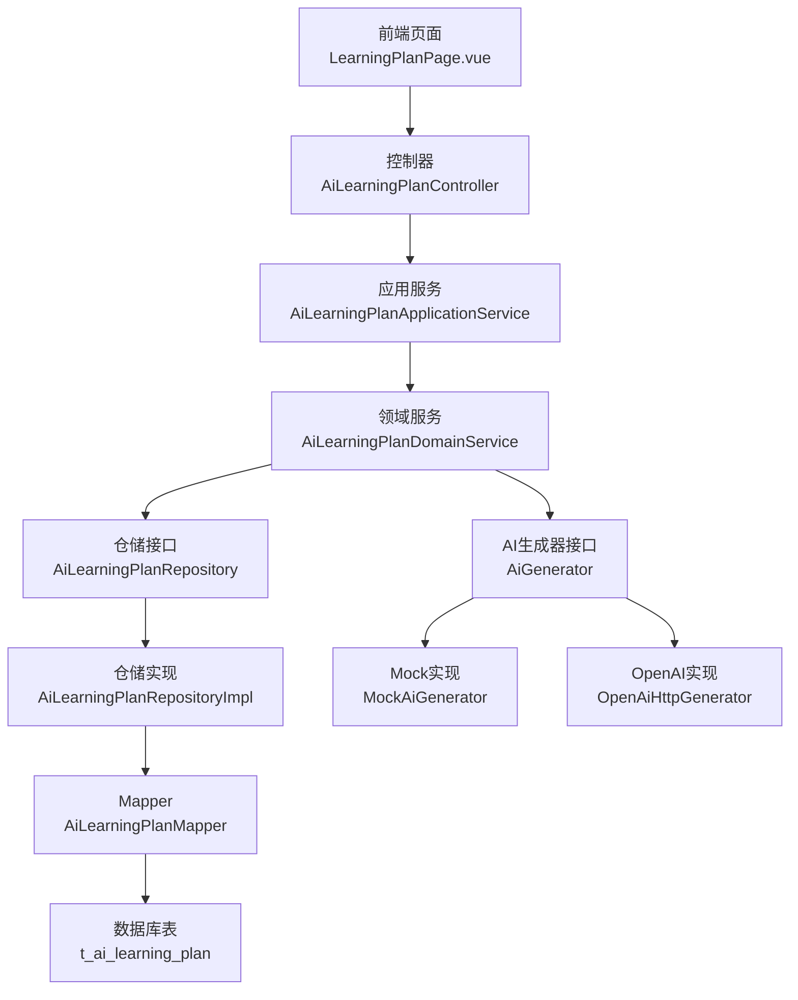
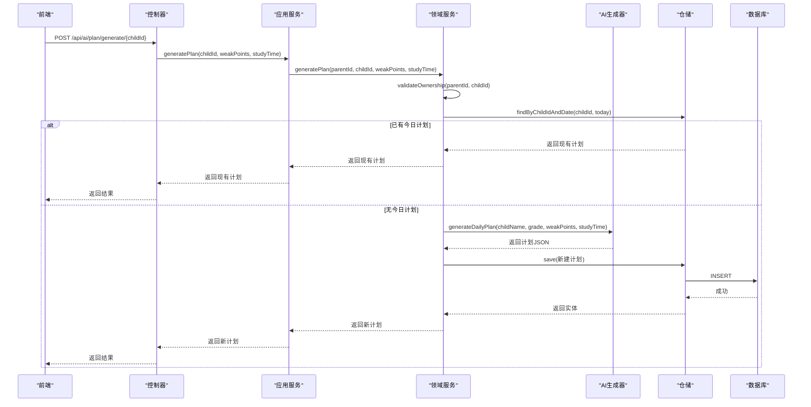
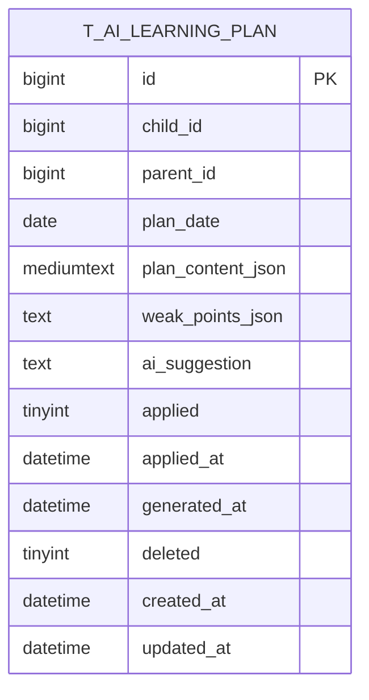
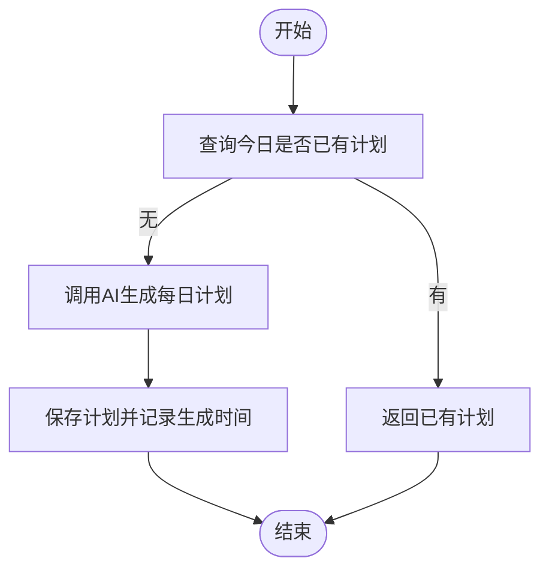
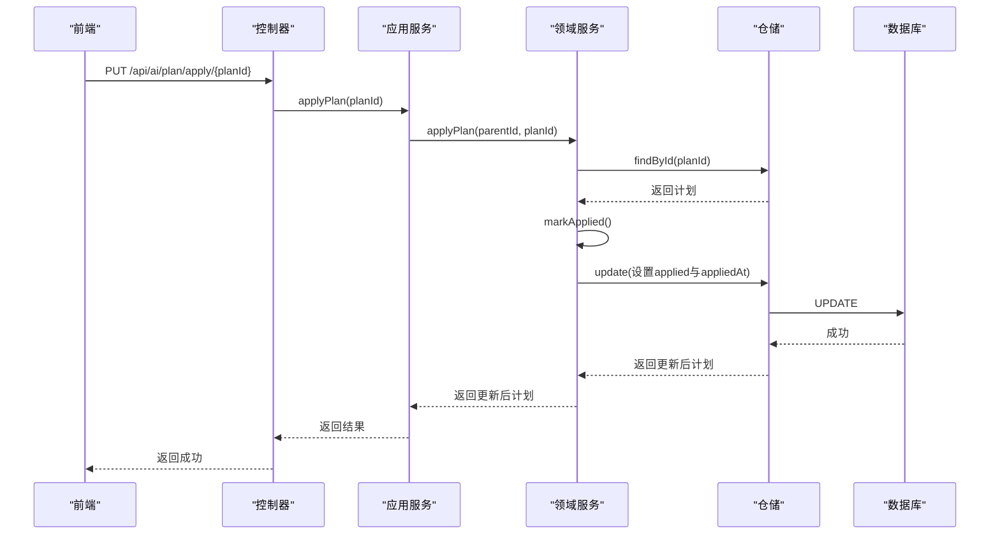
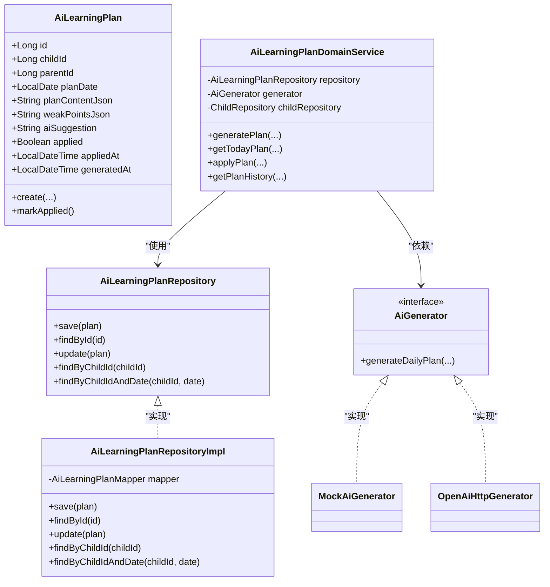
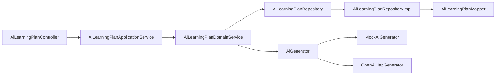

# AI学习计划表

<cite>
**本文引用的文件**
- [t_ai_learning_plan.sql](file://wzoto-backend/sql/t_ai_learning_plan.sql)
- [AiLearningPlan.java](file://wzoto-backend/wzoto-domain/src/main/java/com/wzoto/domain/entity/AiLearningPlan.java)
- [AiLearningPlanApplicationService.java](file://wzoto-backend/wzoto-application/src/main/java/com/wzoto/application/service/AiLearningPlanApplicationService.java)
- [AiLearningPlanDomainService.java](file://wzoto-backend/wzoto-domain/src/main/java/com/wzoto/domain/service/AiLearningPlanDomainService.java)
- [AiLearningPlanRepository.java](file://wzoto-backend/wzoto-domain/src/main/java/com/wzoto/domain/repository/AiLearningPlanRepository.java)
- [AiLearningPlanRepositoryImpl.java](file://wzoto-backend/wzoto-infrastructure/src/main/java/com/wzoto/infrastructure/repository/AiLearningPlanRepositoryImpl.java)
- [AiLearningPlanMapper.java](file://wzoto-backend/wzoto-infrastructure/src/main/java/com/wzoto/infrastructure/mapper/AiLearningPlanMapper.java)
- [AiLearningPlanPO.java](file://wzoto-backend/wzoto-infrastructure/src/main/java/com/wzoto/infrastructure/pojo/AiLearningPlanPO.java)
- [AiGenerator.java](file://wzoto-backend/wzoto-domain/src/main/java/com/wzoto/domain/repository/AiGenerator.java)
- [MockAiGenerator.java](file://wzoto-backend/wzoto-infrastructure/src/main/java/com/wzoto/infrastructure/ai/MockAiGenerator.java)
- [OpenAiHttpGenerator.java](file://wzoto-backend/wzoto-infrastructure/src/main/java/com/wzoto/infrastructure/ai/OpenAiHttpGenerator.java)
- [application.yml](file://wzoto-backend/wzoto-interfaces/src/main/resources/application.yml)
- [AiLearningPlanController.java](file://wzoto-backend/wzoto-interfaces/src/main/java/com/wzoto/interfaces/controller/AiLearningPlanController.java)
- [LearningPlanPage.vue](file://wzoto-frontend/src/pages/learning/LearningPlanPage.vue)
</cite>

## 目录
1. [引言](#引言)
2. [项目结构](#项目结构)
3. [核心组件](#核心组件)
4. [架构总览](#架构总览)
5. [详细组件分析](#详细组件分析)
6. [依赖关系分析](#依赖关系分析)
7. [性能与可扩展性](#性能与可扩展性)
8. [故障排查指南](#故障排查指南)
9. [结论](#结论)
10. [附录](#附录)

## 引言
本文件围绕 t_ai_learning_plan 表及其在系统中的设计、生成、执行跟踪与动态调整策略，提供从数据模型到服务编排的完整说明。重点涵盖：
- 智能计划生成：基于学情（薄弱点、年级、可用学习时间）由AI生成每日学习计划，并以JSON结构化存储。
- 执行跟踪机制：通过“已应用”标记与应用时间记录计划落地状态，便于后续统计与评估。
- 动态调整策略：结合学习配置（时长、学科权重、专项开关）与AI建议，形成可演进的个性化学习路径。
- 字段含义与算法：解释 plan_content_json、weak_points_json、applied/applied_at 等关键字段；说明难度自适应与时间优化思路。
- 监控与评估：提供完成度统计与效果评估指标建议，并给出计划调整与路径优化方法。
- 模板管理与批量生成：说明如何通过AI接口与前端交互实现模板化与批量化能力。

## 项目结构
围绕AI学习计划的核心代码分布在四层：
- 接口层：REST控制器暴露计划生成、查询、应用与历史查询接口。
- 应用层：编排领域服务，处理上下文与参数校验。
- 领域层：定义实体、仓储接口与领域服务，封装业务规则（如所有权校验、去重生成）。
- 基础设施层：MyBatis-Plus映射、PO对象、仓储实现、AI生成器实现（Mock与OpenAI兼容）。

图表来源
- [AiLearningPlanController.java:1-47](file://wzoto-backend/wzoto-interfaces/src/main/java/com/wzoto/interfaces/controller/AiLearningPlanController.java#L1-L47)
- [AiLearningPlanApplicationService.java:1-40](file://wzoto-backend/wzoto-application/src/main/java/com/wzoto/application/service/AiLearningPlanApplicationService.java#L1-L40)
- [AiLearningPlanDomainService.java:1-91](file://wzoto-backend/wzoto-domain/src/main/java/com/wzoto/domain/service/AiLearningPlanDomainService.java#L1-L91)
- [AiLearningPlanRepository.java:1-15](file://wzoto-backend/wzoto-domain/src/main/java/com/wzoto/domain/repository/AiLearningPlanRepository.java#L1-L15)
- [AiLearningPlanRepositoryImpl.java:1-96](file://wzoto-backend/wzoto-infrastructure/src/main/java/com/wzoto/infrastructure/repository/AiLearningPlanRepositoryImpl.java#L1-L96)
- [AiLearningPlanMapper.java:1-10](file://wzoto-backend/wzoto-infrastructure/src/main/java/com/wzoto/infrastructure/mapper/AiLearningPlanMapper.java#L1-L10)
- [t_ai_learning_plan.sql:1-24](file://wzoto-backend/sql/t_ai_learning_plan.sql#L1-L24)
- [AiGenerator.java:1-37](file://wzoto-backend/wzoto-domain/src/main/java/com/wzoto/domain/repository/AiGenerator.java#L1-L37)
- [MockAiGenerator.java:1-302](file://wzoto-backend/wzoto-infrastructure/src/main/java/com/wzoto/infrastructure/ai/MockAiGenerator.java#L1-L302)
- [OpenAiHttpGenerator.java:1-394](file://wzoto-backend/wzoto-infrastructure/src/main/java/com/wzoto/infrastructure/ai/OpenAiHttpGenerator.java#L1-L394)

章节来源
- [t_ai_learning_plan.sql:1-24](file://wzoto-backend/sql/t_ai_learning_plan.sql#L1-L24)
- [AiLearningPlanController.java:1-47](file://wzoto-backend/wzoto-interfaces/src/main/java/com/wzoto/interfaces/controller/AiLearningPlanController.java#L1-L47)
- [AiLearningPlanApplicationService.java:1-40](file://wzoto-backend/wzoto-application/src/main/java/com/wzoto/application/service/AiLearningPlanApplicationService.java#L1-L40)
- [AiLearningPlanDomainService.java:1-91](file://wzoto-backend/wzoto-domain/src/main/java/com/wzoto/domain/service/AiLearningPlanDomainService.java#L1-L91)
- [AiLearningPlanRepositoryImpl.java:1-96](file://wzoto-backend/wzoto-infrastructure/src/main/java/com/wzoto/infrastructure/repository/AiLearningPlanRepositoryImpl.java#L1-L96)
- [AiLearningPlanPO.java:1-30](file://wzoto-backend/wzoto-infrastructure/src/main/java/com/wzoto/infrastructure/pojo/AiLearningPlanPO.java#L1-L30)
- [application.yml:1-51](file://wzoto-backend/wzoto-interfaces/src/main/resources/application.yml#L1-L51)

## 核心组件
- 数据模型与持久化
  - 表 t_ai_learning_plan：记录子女ID、家长ID、计划日期、计划内容JSON、薄弱点JSON、AI建议、是否已应用及应用时间、生成时间、逻辑删除与审计字段。
  - 领域实体 AiLearningPlan：提供创建与“已应用”状态变更方法。
  - PO对象 AiLearningPlanPO：与表结构映射，含逻辑删除与自动填充时间。
  - Mapper与仓储：提供按子女与日期的查询、历史列表、保存与更新。
- 领域服务与业务规则
  - 生成计划：校验家长对子女的所有权；若当日已有计划则直接返回；否则调用AI生成器生成计划并落库。
  - 获取今日计划：按子女与今日日期查询。
  - 应用计划：将计划标记为已应用并记录应用时间。
  - 历史查询：按子女维度倒序返回计划历史。
- AI生成器
  - 接口 AiGenerator：定义 generateDailyPlan 等方法。
  - Mock实现：开发环境默认使用，输出结构化JSON计划。
  - OpenAI实现：生产环境通过HTTP调用兼容API，具备降级与错误日志。
- 控制器与前端
  - 控制器暴露 /api/ai/plan 下的生成、查询、应用、历史接口。
  - 前端页面支持选择子女、查看/生成/应用AI计划，以及保存学习配置（时长、权重、专项开关）。

章节来源
- [AiLearningPlan.java:1-56](file://wzoto-backend/wzoto-domain/src/main/java/com/wzoto/domain/entity/AiLearningPlan.java#L1-L56)
- [AiLearningPlanPO.java:1-30](file://wzoto-backend/wzoto-infrastructure/src/main/java/com/wzoto/infrastructure/pojo/AiLearningPlanPO.java#L1-L30)
- [AiLearningPlanRepositoryImpl.java:1-96](file://wzoto-backend/wzoto-infrastructure/src/main/java/com/wzoto/infrastructure/repository/AiLearningPlanRepositoryImpl.java#L1-L96)
- [AiLearningPlanDomainService.java:1-91](file://wzoto-backend/wzoto-domain/src/main/java/com/wzoto/domain/service/AiLearningPlanDomainService.java#L1-L91)
- [AiGenerator.java:1-37](file://wzoto-backend/wzoto-domain/src/main/java/com/wzoto/domain/repository/AiGenerator.java#L1-L37)
- [MockAiGenerator.java:223-246](file://wzoto-backend/wzoto-infrastructure/src/main/java/com/wzoto/infrastructure/ai/MockAiGenerator.java#L223-L246)
- [OpenAiHttpGenerator.java:362-371](file://wzoto-backend/wzoto-infrastructure/src/main/java/com/wzoto/infrastructure/ai/OpenAiHttpGenerator.java#L362-L371)
- [AiLearningPlanController.java:1-47](file://wzoto-backend/wzoto-interfaces/src/main/java/com/wzoto/interfaces/controller/AiLearningPlanController.java#L1-L47)
- [LearningPlanPage.vue:57-70](file://wzoto-frontend/src/pages/learning/LearningPlanPage.vue#L57-L70)

## 架构总览
下图展示一次“生成AI计划”的端到端流程，包括权限校验、去重、AI生成与持久化。

图表来源
- [AiLearningPlanController.java:22-28](file://wzoto-backend/wzoto-interfaces/src/main/java/com/wzoto/interfaces/controller/AiLearningPlanController.java#L22-L28)
- [AiLearningPlanApplicationService.java:20-23](file://wzoto-backend/wzoto-application/src/main/java/com/wzoto/application/service/AiLearningPlanApplicationService.java#L20-L23)
- [AiLearningPlanDomainService.java:30-50](file://wzoto-backend/wzoto-domain/src/main/java/com/wzoto/domain/service/AiLearningPlanDomainService.java#L30-L50)
- [AiLearningPlanRepositoryImpl.java:51-58](file://wzoto-backend/wzoto-infrastructure/src/main/java/com/wzoto/infrastructure/repository/AiLearningPlanRepositoryImpl.java#L51-L58)
- [MockAiGenerator.java:223-246](file://wzoto-backend/wzoto-infrastructure/src/main/java/com/wzoto/infrastructure/ai/MockAiGenerator.java#L223-L246)
- [OpenAiHttpGenerator.java:362-371](file://wzoto-backend/wzoto-infrastructure/src/main/java/com/wzoto/infrastructure/ai/OpenAiHttpGenerator.java#L362-L371)

## 详细组件分析

### 数据模型与字段语义
- id：主键自增。
- child_id：子女ID，用于关联学生档案。
- parent_id：家长用户ID，用于权限校验与隔离。
- plan_date：计划日期，按天粒度生成与查询。
- plan_content_json：计划内容JSON，包含任务列表、时间安排、知识点目标等。
- weak_points_json：薄弱点JSON，来源于错题分析或学情诊断。
- ai_suggestion：AI学习建议文本。
- applied：是否已应用到学习任务（0否/1是），用于追踪落地状态。
- applied_at：应用时间，记录计划被采纳的时间点。
- generated_at：AI生成时间，用于统计生成效率与时效性。
- deleted：逻辑删除标记。
- created_at/updated_at：审计时间戳。

图表来源
- [t_ai_learning_plan.sql:5-23](file://wzoto-backend/sql/t_ai_learning_plan.sql#L5-L23)

章节来源
- [t_ai_learning_plan.sql:1-24](file://wzoto-backend/sql/t_ai_learning_plan.sql#L1-L24)
- [AiLearningPlan.java:15-55](file://wzoto-backend/wzoto-domain/src/main/java/com/wzoto/domain/entity/AiLearningPlan.java#L15-L55)
- [AiLearningPlanPO.java:8-29](file://wzoto-backend/wzoto-infrastructure/src/main/java/com/wzoto/infrastructure/pojo/AiLearningPlanPO.java#L8-L29)

### 智能计划生成算法与个性化
- 输入要素
  - 子女信息：姓名、年级（来自 Child 实体）。
  - 薄弱点：来自错题分析或学情诊断（weakPointsJson）。
  - 可用学习时间：前端配置的学习时长（studyTime）。
- 生成流程
  - 校验家长对子女的所有权。
  - 检查当日是否已有计划，避免重复生成。
  - 调用 AI 生成器 generateDailyPlan，产出结构化计划JSON。
  - 保存计划并记录生成时间。
- 个性化与难度自适应
  - 通过薄弱点聚焦（weakPointsFocus）与任务类型（微课、练习、复习、口语）组合，体现学科与知识点侧重。
  - 根据可用时间（studyTime）控制任务总量与时长分配。
  - 年级（grade）影响任务内容与难度表达。
- 时间优化
  - 以时间段划分任务（如 09:00-09:30），结合休息间隔，提升学习效率。
  - 可将“专项练习”与“错题复习”穿插安排，强化薄弱环节。

图表来源
- [AiLearningPlanDomainService.java:30-50](file://wzoto-backend/wzoto-domain/src/main/java/com/wzoto/domain/service/AiLearningPlanDomainService.java#L30-L50)
- [MockAiGenerator.java:223-246](file://wzoto-backend/wzoto-infrastructure/src/main/java/com/wzoto/infrastructure/ai/MockAiGenerator.java#L223-L246)
- [OpenAiHttpGenerator.java:362-371](file://wzoto-backend/wzoto-infrastructure/src/main/java/com/wzoto/infrastructure/ai/OpenAiHttpGenerator.java#L362-L371)

章节来源
- [AiLearningPlanDomainService.java:1-91](file://wzoto-backend/wzoto-domain/src/main/java/com/wzoto/domain/service/AiLearningPlanDomainService.java#L1-L91)
- [AiGenerator.java:1-37](file://wzoto-backend/wzoto-domain/src/main/java/com/wzoto/domain/repository/AiGenerator.java#L1-L37)
- [MockAiGenerator.java:223-246](file://wzoto-backend/wzoto-infrastructure/src/main/java/com/wzoto/infrastructure/ai/MockAiGenerator.java#L223-L246)
- [OpenAiHttpGenerator.java:362-371](file://wzoto-backend/wzoto-infrastructure/src/main/java/com/wzoto/infrastructure/ai/OpenAiHttpGenerator.java#L362-L371)

### 执行跟踪与动态调整
- 执行跟踪
  - applied 字段标识计划是否已应用到学习任务。
  - applied_at 记录应用时间，便于统计与回溯。
  - 前端提供“一键应用”按钮，触发应用接口。
- 动态调整策略
  - 基于薄弱点变化（weak_points_json）与学习配置（时长、权重、专项开关）重新生成计划。
  - 当某科目权重提高时，增加相关任务数量或时长；专项开关开启时插入对应练习。
  - 结合历史计划（history）进行趋势分析，逐步优化任务结构与难度。
- 完成度统计与效果评估指标（建议）
  - 完成率：已应用计划数 / 总计划数。
  - 任务达成率：已完成任务数 / 计划任务总数。
  - 薄弱点改善度：对比前后弱项分布变化。
  - 学习时长利用率：实际学习时长 / 计划时长。
  - 效果指标：成绩提升、正确率变化、错题复发率下降。

图表来源
- [AiLearningPlanController.java:36-40](file://wzoto-backend/wzoto-interfaces/src/main/java/com/wzoto/interfaces/controller/AiLearningPlanController.java#L36-L40)
- [AiLearningPlanApplicationService.java:30-33](file://wzoto-backend/wzoto-application/src/main/java/com/wzoto/application/service/AiLearningPlanApplicationService.java#L30-L33)
- [AiLearningPlanDomainService.java:64-74](file://wzoto-backend/wzoto-domain/src/main/java/com/wzoto/domain/service/AiLearningPlanDomainService.java#L64-L74)
- [AiLearningPlanRepositoryImpl.java:37-41](file://wzoto-backend/wzoto-infrastructure/src/main/java/com/wzoto/infrastructure/repository/AiLearningPlanRepositoryImpl.java#L37-L41)

章节来源
- [AiLearningPlanDomainService.java:64-74](file://wzoto-backend/wzoto-domain/src/main/java/com/wzoto/domain/service/AiLearningPlanDomainService.java#L64-L74)
- [AiLearningPlanRepositoryImpl.java:37-41](file://wzoto-backend/wzoto-infrastructure/src/main/java/com/wzoto/infrastructure/repository/AiLearningPlanRepositoryImpl.java#L37-L41)
- [LearningPlanPage.vue:204-213](file://wzoto-frontend/src/pages/learning/LearningPlanPage.vue#L204-L213)

### 计划模板管理与批量生成
- 模板管理
  - 通过 AI 生成器的系统提示词（system prompt）与用户提示（user prompt）定义计划模板结构，确保输出JSON稳定。
  - 可在不同场景（如计算专项、应用题专项、背单词专项）切换模板，快速生成对应计划。
- 批量生成
  - 前端可为多个子女分别调用生成接口，或在后端扩展批量接口（按子女列表循环生成）。
  - 结合学习配置（dailyDurationMinutes、学科权重、专项开关）作为输入，统一生成多子女计划。
- 实施要点
  - 保证每个子女的薄弱点与可用时间准确传入。
  - 对生成失败进行重试与降级（使用Mock或默认模板）。
  - 记录每次生成的耗时与结果，用于质量评估。

章节来源
- [OpenAiHttpGenerator.java:40-68](file://wzoto-backend/wzoto-infrastructure/src/main/java/com/wzoto/infrastructure/ai/OpenAiHttpGenerator.java#L40-L68)
- [MockAiGenerator.java:223-246](file://wzoto-backend/wzoto-infrastructure/src/main/java/com/wzoto/infrastructure/ai/MockAiGenerator.java#L223-L246)
- [LearningPlanPage.vue:16-44](file://wzoto-frontend/src/pages/learning/LearningPlanPage.vue#L16-L44)

### 类图与组件关系

图表来源
- [AiLearningPlan.java:15-55](file://wzoto-backend/wzoto-domain/src/main/java/com/wzoto/domain/entity/AiLearningPlan.java#L15-L55)
- [AiLearningPlanRepository.java:1-15](file://wzoto-backend/wzoto-domain/src/main/java/com/wzoto/domain/repository/AiLearningPlanRepository.java#L1-L15)
- [AiLearningPlanRepositoryImpl.java:1-96](file://wzoto-backend/wzoto-infrastructure/src/main/java/com/wzoto/infrastructure/repository/AiLearningPlanRepositoryImpl.java#L1-L96)
- [AiLearningPlanDomainService.java:1-91](file://wzoto-backend/wzoto-domain/src/main/java/com/wzoto/domain/service/AiLearningPlanDomainService.java#L1-L91)
- [AiGenerator.java:1-37](file://wzoto-backend/wzoto-domain/src/main/java/com/wzoto/domain/repository/AiGenerator.java#L1-L37)
- [MockAiGenerator.java:1-302](file://wzoto-backend/wzoto-infrastructure/src/main/java/com/wzoto/infrastructure/ai/MockAiGenerator.java#L1-L302)
- [OpenAiHttpGenerator.java:1-394](file://wzoto-backend/wzoto-infrastructure/src/main/java/com/wzoto/infrastructure/ai/OpenAiHttpGenerator.java#L1-L394)

## 依赖关系分析
- 控制器依赖应用服务，应用服务依赖领域服务，领域服务依赖仓储与AI生成器。
- 仓储实现依赖Mapper与MyBatis-Plus条件构造器，完成SQL生成与结果映射。
- AI生成器通过配置开关（enabled）决定使用Mock或OpenAI实现。
- 前端通过REST接口与后端交互，读取/生成/应用计划，并维护本地学习配置。

图表来源
- [AiLearningPlanController.java:1-47](file://wzoto-backend/wzoto-interfaces/src/main/java/com/wzoto/interfaces/controller/AiLearningPlanController.java#L1-L47)
- [AiLearningPlanApplicationService.java:1-40](file://wzoto-backend/wzoto-application/src/main/java/com/wzoto/application/service/AiLearningPlanApplicationService.java#L1-L40)
- [AiLearningPlanDomainService.java:1-91](file://wzoto-backend/wzoto-domain/src/main/java/com/wzoto/domain/service/AiLearningPlanDomainService.java#L1-L91)
- [AiLearningPlanRepositoryImpl.java:1-96](file://wzoto-backend/wzoto-infrastructure/src/main/java/com/wzoto/infrastructure/repository/AiLearningPlanRepositoryImpl.java#L1-L96)
- [application.yml:31-46](file://wzoto-backend/wzoto-interfaces/src/main/resources/application.yml#L31-L46)

章节来源
- [application.yml:31-46](file://wzoto-backend/wzoto-interfaces/src/main/resources/application.yml#L31-L46)

## 性能与可扩展性
- 索引优化
  - 表已针对 child_id、plan_date、child_id+plan_date、applied 建立索引，提升查询与筛选效率。
- 并发与幂等
  - 生成计划前检查当日是否已有计划，避免重复写入。
  - 应用计划采用原子更新（设置applied与appliedAt），减少竞争条件。
- 缓存与降级
  - 可引入Redis缓存今日计划，降低数据库压力。
  - AI调用失败时自动降级至Mock或默认模板，保障可用性。
- 扩展点
  - 新增计划模板：在AI生成器中扩展系统提示词与用户提示，适配不同教学场景。
  - 批量生成：在后端扩展批量接口，支持多子女并行生成（注意限流与超时）。
  - 监控埋点：记录生成耗时、成功率、应用率等指标，支撑持续优化。

[本节为通用指导，不直接分析具体文件]

## 故障排查指南
- 常见问题
  - 生成失败：检查AI配置（base-url、api-key、model、temperature）是否正确；查看日志中的异常与降级输出。
  - 重复生成：确认当日是否已有计划；必要时清理历史计划后再试。
  - 应用失败：检查planId是否存在且属于当前家长；确认权限校验通过。
- 定位步骤
  - 查看控制器日志（BI埋点）与领域服务日志，确认请求链路。
  - 检查仓储实现SQL与结果映射，确认数据一致性。
  - 核对AI生成器输出是否符合预期JSON结构。
- 恢复策略
  - 启用Mock模式快速验证流程。
  - 对失败请求进行重试与补偿（如重新生成计划）。
  - 通过历史查询与统计指标定位问题范围。

章节来源
- [application.yml:31-46](file://wzoto-backend/wzoto-interfaces/src/main/resources/application.yml#L31-L46)
- [OpenAiHttpGenerator.java:104-117](file://wzoto-backend/wzoto-infrastructure/src/main/java/com/wzoto/infrastructure/ai/OpenAiHttpGenerator.java#L104-L117)
- [AiLearningPlanDomainService.java:84-89](file://wzoto-backend/wzoto-domain/src/main/java/com/wzoto/domain/service/AiLearningPlanDomainService.java#L84-L89)

## 结论
t_ai_learning_plan 表与配套服务构成了AI学习计划的核心闭环：以学情为基础，AI生成个性化计划；通过“已应用”标记与应用时间实现执行跟踪；借助学习配置与薄弱点变化进行动态调整。系统具备良好的可扩展性与容错能力，支持模板化管理与批量生成。建议在此基础上完善监控指标与统计分析，持续优化学习路径与效果。

[本节为总结性内容，不直接分析具体文件]

## 附录
- API概览
  - 生成计划：POST /api/ai/plan/generate/{childId}?weakPoints=...&studyTime=...
  - 获取今日计划：GET /api/ai/plan/today/{childId}
  - 应用计划：PUT /api/ai/plan/apply/{planId}
  - 历史查询：GET /api/ai/plan/history/{childId}
- 前端交互
  - 选择子女、查看/生成/应用AI计划。
  - 保存每日学习配置（时长、权重、专项开关）。

章节来源
- [AiLearningPlanController.java:22-45](file://wzoto-backend/wzoto-interfaces/src/main/java/com/wzoto/interfaces/controller/AiLearningPlanController.java#L22-L45)
- [LearningPlanPage.vue:57-70](file://wzoto-frontend/src/pages/learning/LearningPlanPage.vue#L57-L70)
- [LearningPlanPage.vue:16-44](file://wzoto-frontend/src/pages/learning/LearningPlanPage.vue#L16-L44)