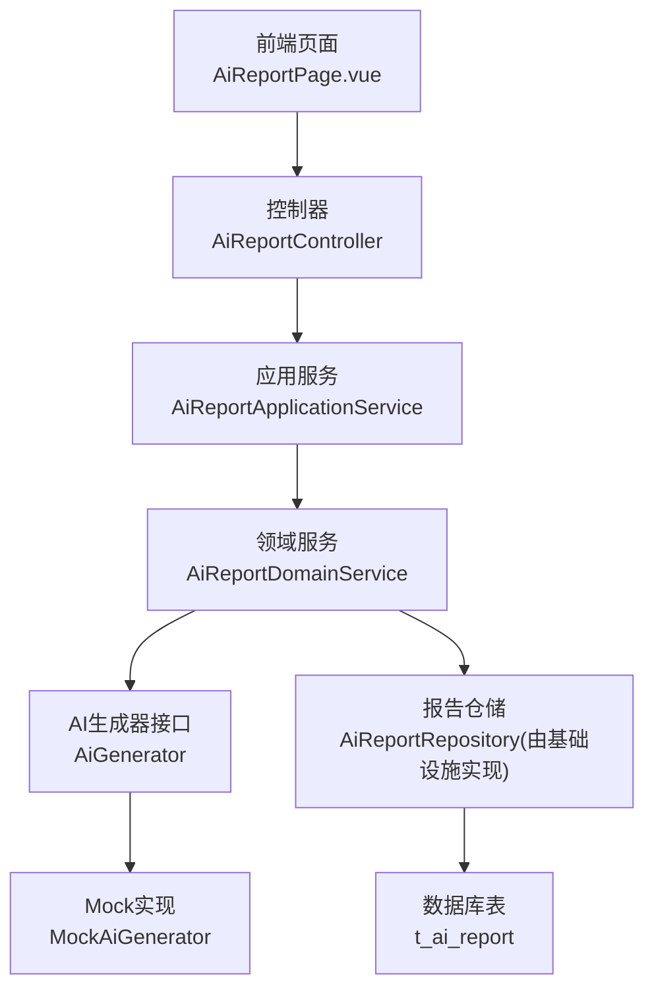
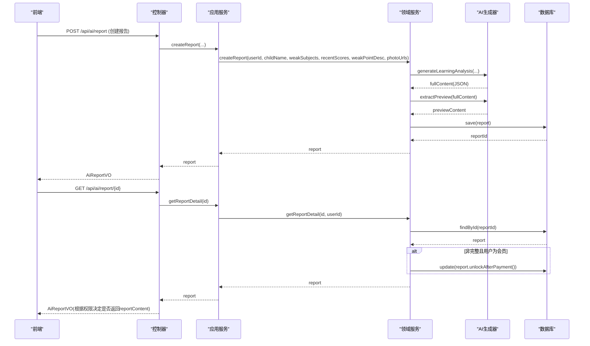
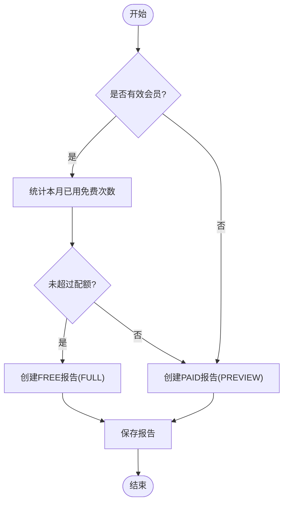
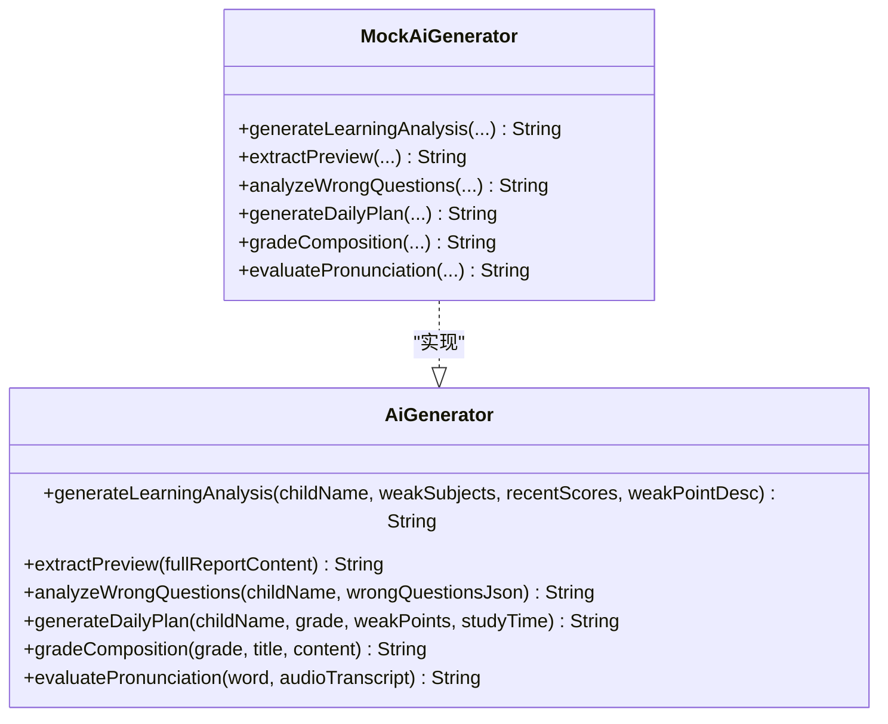
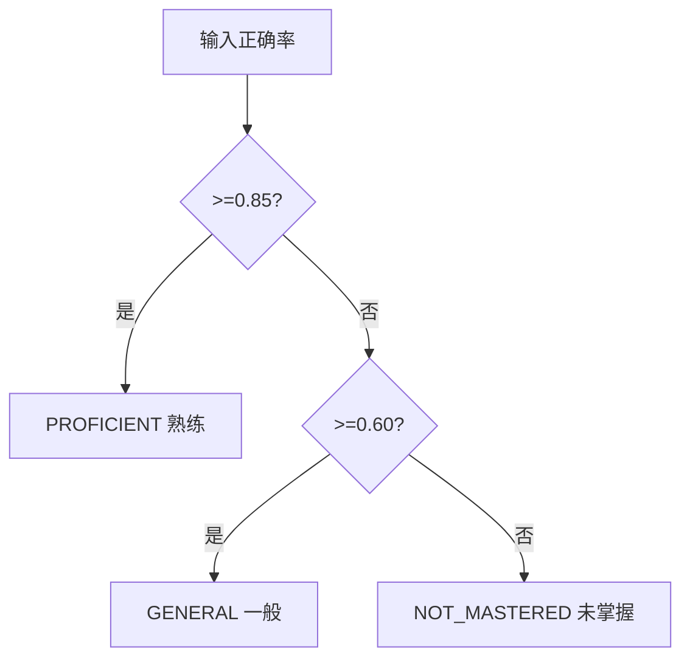
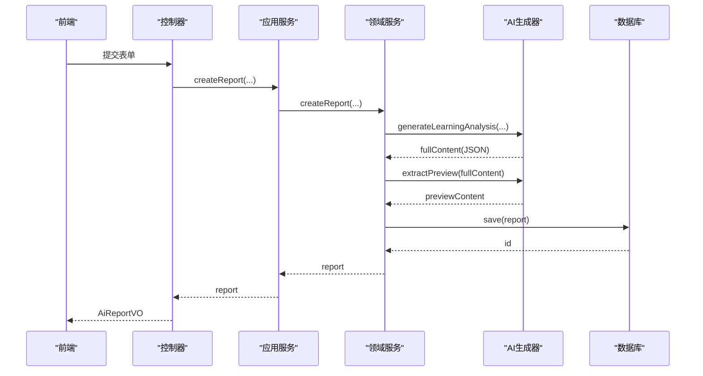
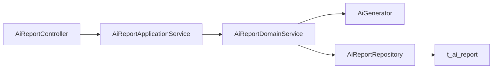

# AI学情报告表

<cite>
**本文引用的文件**
- [t_ai_report.sql](file://wzoto-backend/sql/t_ai_report.sql)
- [AiReport.java](file://wzoto-backend/wzoto-domain/src/main/java/com/wzoto/domain/entity/AiReport.java)
- [AiReportDomainService.java](file://wzoto-backend/wzoto-domain/src/main/java/com/wzoto/domain/service/AiReportDomainService.java)
- [AiReportApplicationService.java](file://wzoto-backend/wzoto-application/src/main/java/com/wzoto/application/service/AiReportApplicationService.java)
- [AiReportController.java](file://wzoto-backend/wzoto-interfaces/src/main/java/com/wzoto/interfaces/controller/AiReportController.java)
- [CreateAiReportDTO.java](file://wzoto-backend/wzoto-interfaces/src/main/java/com/wzoto/interfaces/dto/ai/CreateAiReportDTO.java)
- [AiReportVO.java](file://wzoto-backend/wzoto-interfaces/src/main/java/com/wzoto/interfaces/vo/ai/AiReportVO.java)
- [AiGenerator.java](file://wzoto-backend/wzoto-domain/src/main/java/com/wzoto/domain/repository/AiGenerator.java)
- [MockAiGenerator.java](file://wzoto-backend/wzoto-infrastructure/src/main/java/com/wzoto/infrastructure/ai/MockAiGenerator.java)
- [AiReportPO.java](file://wzoto-backend/wzoto-infrastructure/src/main/java/com/wzoto/infrastructure/pojo/AiReportPO.java)
- [MasteryLevel.java](file://wzoto-backend/wzoto-domain/src/main/java/com/wzoto/domain/valobj/MasteryLevel.java)
- [LearningReportVO.java](file://wzoto-backend/wzoto-interfaces/src/main/java/com/wzoto/interfaces/vo/learning/LearningReportVO.java)
- [AiReportPage.vue](file://wzoto-frontend/src/pages/ai/AiReportPage.vue)
- [ai.js](file://wzoto-frontend/src/api/ai.js)
</cite>

## 目录
1. [简介](#简介)
2. [项目结构](#项目结构)
3. [核心组件](#核心组件)
4. [架构总览](#架构总览)
5. [详细组件分析](#详细组件分析)
6. [依赖关系分析](#依赖关系分析)
7. [性能与扩展性](#性能与扩展性)
8. [故障排查指南](#故障排查指南)
9. [结论](#结论)
10. [附录](#附录)

## 简介
本文件围绕AI学情报告表（t_ai_report）进行系统化说明，覆盖学习分析报告结构、能力评估模型、个性化建议生成、字段含义、多维学习能力评估、知识掌握度分析、学习趋势预测、报告生成算法、数据可视化支持、家长端展示格式、数据分析与教学干预建议，以及报告版本管理与历史对比功能。文档以代码为依据，提供可追溯的引用与图示，帮助读者快速理解并落地使用。

## 项目结构
围绕AI学情报告的核心实现分为四层：
- 接口层：控制器暴露REST API，负责入参校验与响应封装
- 应用层：编排业务流程，协调领域服务
- 领域层：定义实体、值对象与领域规则（会员配额、付费解锁等）
- 基础设施层：持久化对象映射、AI生成器实现（Mock/真实）

图表来源
- [AiReportController.java:31-95](file://wzoto-backend/wzoto-interfaces/src/main/java/com/wzoto/interfaces/controller/AiReportController.java#L31-L95)
- [AiReportApplicationService.java:23-79](file://wzoto-backend/wzoto-application/src/main/java/com/wzoto/application/service/AiReportApplicationService.java#L23-L79)
- [AiReportDomainService.java:33-138](file://wzoto-backend/wzoto-domain/src/main/java/com/wzoto/domain/service/AiReportDomainService.java#L33-L138)
- [AiGenerator.java:7-36](file://wzoto-backend/wzoto-domain/src/main/java/com/wzoto/domain/repository/AiGenerator.java#L7-L36)
- [MockAiGenerator.java:17-71](file://wzoto-backend/wzoto-infrastructure/src/main/java/com/wzoto/infrastructure/ai/MockAiGenerator.java#L17-L71)
- [t_ai_report.sql:4-23](file://wzoto-backend/sql/t_ai_report.sql#L4-L23)

章节来源
- [AiReportController.java:31-95](file://wzoto-backend/wzoto-interfaces/src/main/java/com/wzoto/interfaces/controller/AiReportController.java#L31-L95)
- [AiReportApplicationService.java:23-79](file://wzoto-backend/wzoto-application/src/main/java/com/wzoto/application/service/AiReportApplicationService.java#L23-L79)
- [AiReportDomainService.java:33-138](file://wzoto-backend/wzoto-domain/src/main/java/com/wzoto/domain/service/AiReportDomainService.java#L33-L138)
- [t_ai_report.sql:4-23](file://wzoto-backend/sql/t_ai_report.sql#L4-L23)

## 核心组件
- 报告实体与值对象
  - AiReport：承载报告主数据、内容、类型、支付状态等，并提供创建免费/付费报告与解锁方法
  - MasteryLevel：知识点掌握度枚举（未掌握/一般/熟练），支持按正确率换算
- 领域服务
  - AiReportDomainService：核心业务规则（会员免费配额、付费解锁、权限校验、报告详情返回策略）
- 应用服务
  - AiReportApplicationService：对外暴露创建、查询、付费解锁、会员状态等方法
- 接口层
  - AiReportController：REST API（创建、列表、详情、付费解锁、会员状态）
  - CreateAiReportDTO：创建报告的入参校验
  - AiReportVO：对外返回的报告视图对象
- 基础设施
  - AiGenerator：AI生成器接口（学习分析、预览提取、错题分析、学习计划等）
  - MockAiGenerator：开发环境下的模拟实现，输出结构化JSON用于前端渲染
  - AiReportPO：数据库持久化对象映射
- 数据库
  - t_ai_report：报告存储表，包含报告类型、掌握程度、薄弱点、推荐内容等关键字段

章节来源
- [AiReport.java:14-105](file://wzoto-backend/wzoto-domain/src/main/java/com/wzoto/domain/entity/AiReport.java#L14-L105)
- [MasteryLevel.java:9-47](file://wzoto-backend/wzoto-domain/src/main/java/com/wzoto/domain/valobj/MasteryLevel.java#L9-L47)
- [AiReportDomainService.java:33-138](file://wzoto-backend/wzoto-domain/src/main/java/com/wzoto/domain/service/AiReportDomainService.java#L33-L138)
- [AiReportApplicationService.java:23-79](file://wzoto-backend/wzoto-application/src/main/java/com/wzoto/application/service/AiReportApplicationService.java#L23-L79)
- [AiReportController.java:31-95](file://wzoto-backend/wzoto-interfaces/src/main/java/com/wzoto/interfaces/controller/AiReportController.java#L31-L95)
- [CreateAiReportDTO.java:9-28](file://wzoto-backend/wzoto-interfaces/src/main/java/com/wzoto/interfaces/dto/ai/CreateAiReportDTO.java#L9-L28)
- [AiReportVO.java:12-33](file://wzoto-backend/wzoto-interfaces/src/main/java/com/wzoto/interfaces/vo/ai/AiReportVO.java#L12-L33)
- [AiGenerator.java:7-36](file://wzoto-backend/wzoto-domain/src/main/java/com/wzoto/domain/repository/AiGenerator.java#L7-L36)
- [MockAiGenerator.java:17-71](file://wzoto-backend/wzoto-infrastructure/src/main/java/com/wzoto/infrastructure/ai/MockAiGenerator.java#L17-L71)
- [AiReportPO.java:12-38](file://wzoto-backend/wzoto-infrastructure/src/main/java/com/wzoto/infrastructure/pojo/AiReportPO.java#L12-L38)
- [t_ai_report.sql:4-23](file://wzoto-backend/sql/t_ai_report.sql#L4-L23)

## 架构总览
报告生成与访问的关键流程如下：

图表来源
- [AiReportController.java:31-95](file://wzoto-backend/wzoto-interfaces/src/main/java/com/wzoto/interfaces/controller/AiReportController.java#L31-L95)
- [AiReportApplicationService.java:23-79](file://wzoto-backend/wzoto-application/src/main/java/com/wzoto/application/service/AiReportApplicationService.java#L23-L79)
- [AiReportDomainService.java:33-138](file://wzoto-backend/wzoto-domain/src/main/java/com/wzoto/domain/service/AiReportDomainService.java#L33-L138)
- [AiGenerator.java:7-36](file://wzoto-backend/wzoto-domain/src/main/java/com/wzoto/domain/repository/AiGenerator.java#L7-L36)
- [MockAiGenerator.java:17-71](file://wzoto-backend/wzoto-infrastructure/src/main/java/com/wzoto/infrastructure/ai/MockAiGenerator.java#L17-L71)

## 详细组件分析

### 报告表设计与字段语义
- 表名：t_ai_report
- 关键字段与含义
  - user_id：家长用户ID
  - child_name：子女姓名
  - weak_subjects：薄弱学科（逗号分隔）
  - recent_scores：近期考试分数
  - weak_point_desc：薄弱知识点描述
  - photo_urls：试卷/错题照片URL（逗号分隔）
  - report_content：AI生成报告完整内容（JSON格式）
  - preview_content：AI生成报告预览内容（非会员可见）
  - report_type：报告类型（PREVIEW预览/FULL完整）
  - is_member_report：是否会员免费报告（0否/1是）
  - price：报告价格
  - payment_status：支付状态（UNPAID/PAID/FREE）
  - deleted：逻辑删除标记
  - created_at/updated_at：时间戳

章节来源
- [t_ai_report.sql:4-23](file://wzoto-backend/sql/t_ai_report.sql#L4-L23)
- [AiReportPO.java:12-38](file://wzoto-backend/wzoto-infrastructure/src/main/java/com/wzoto/infrastructure/pojo/AiReportPO.java#L12-L38)

### 领域实体与行为
- AiReport
  - 提供createFreeReport/createPaidReport工厂方法，设置默认类型、价格、支付状态
  - unlockAfterPayment：付费后从PREVIEW升级为FULL，支付状态改为PAID
  - isFullReport：判断是否为完整报告
- 价值：将“报告类型”“支付状态”“是否会员报告”等业务规则内聚在实体中，便于复用与测试

章节来源
- [AiReport.java:14-105](file://wzoto-backend/wzoto-domain/src/main/java/com/wzoto/domain/entity/AiReport.java#L14-L105)

### 领域服务与业务规则
- 会员免费配额：每月最多2份免费完整报告
- 非会员：默认生成PREVIEW，需付费解锁
- 权限控制：仅本人可查看/操作报告
- 自动升级：若查看的是PREVIEW且当前用户为会员，自动升级为FULL

图表来源
- [AiReportDomainService.java:33-70](file://wzoto-backend/wzoto-domain/src/main/java/com/wzoto/domain/service/AiReportDomainService.java#L33-L70)

章节来源
- [AiReportDomainService.java:33-138](file://wzoto-backend/wzoto-domain/src/main/java/com/wzoto/domain/service/AiReportDomainService.java#L33-L138)

### AI生成器与报告内容结构
- AiGenerator接口定义了学习分析、预览提取、错题分析、学习计划、作文批改、口语评测等方法
- MockAiGenerator.generateLearningAnalysis输出结构化JSON，包含：
  - weaknessAnalysis：薄弱学科分析数组（subject、points、severity）
  - knowledgeGraph：知识图谱（coreGaps、foundationLevel）
  - suggestion：辅导建议（direction、frequency、duration、keyActions）
  - recommendedTutorProfile：推荐教员画像（subjects、education、traits）
- extractPreview从完整内容中提取片段作为预览

图表来源
- [AiGenerator.java:7-36](file://wzoto-backend/wzoto-domain/src/main/java/com/wzoto/domain/repository/AiGenerator.java#L7-L36)
- [MockAiGenerator.java:17-71](file://wzoto-backend/wzoto-infrastructure/src/main/java/com/wzoto/infrastructure/ai/MockAiGenerator.java#L17-L71)

章节来源
- [AiGenerator.java:7-36](file://wzoto-backend/wzoto-domain/src/main/java/com/wzoto/domain/repository/AiGenerator.java#L7-L36)
- [MockAiGenerator.java:17-71](file://wzoto-backend/wzoto-infrastructure/src/main/java/com/wzoto/infrastructure/ai/MockAiGenerator.java#L17-L71)

### 能力评估模型与掌握度
- MasteryLevel：未掌握/一般/熟练，支持按正确率换算（≥0.85熟练，≥0.60一般，否则未掌握）
- 结合LearningReportVO中的masteryMap与subjectAccuracy，可在前端以红黄绿三色可视化呈现各知识点掌握情况

图表来源
- [MasteryLevel.java:38-46](file://wzoto-backend/wzoto-domain/src/main/java/com/wzoto/domain/valobj/MasteryLevel.java#L38-L46)

章节来源
- [MasteryLevel.java:9-47](file://wzoto-backend/wzoto-domain/src/main/java/com/wzoto/domain/valobj/MasteryLevel.java#L9-L47)
- [LearningReportVO.java:10-21](file://wzoto-backend/wzoto-interfaces/src/main/java/com/wzoto/interfaces/vo/learning/LearningReportVO.java#L10-L21)

### 报告生成算法与数据流
- 输入：childName、weakSubjects、recentScores、weakPointDesc、photoUrls
- 处理：
  - 调用AI生成器生成完整报告JSON
  - 提取预览内容
  - 根据会员状态决定报告类型与价格
  - 保存至数据库
- 输出：AiReportVO（根据权限决定是否返回reportContent）

图表来源
- [AiReportController.java:31-42](file://wzoto-backend/wzoto-interfaces/src/main/java/com/wzoto/interfaces/controller/AiReportController.java#L31-L42)
- [AiReportApplicationService.java:23-31](file://wzoto-backend/wzoto-application/src/main/java/com/wzoto/application/service/AiReportApplicationService.java#L23-L31)
- [AiReportDomainService.java:33-70](file://wzoto-backend/wzoto-domain/src/main/java/com/wzoto/domain/service/AiReportDomainService.java#L33-L70)
- [AiGenerator.java:7-12](file://wzoto-backend/wzoto-domain/src/main/java/com/wzoto/domain/repository/AiGenerator.java#L7-L12)

章节来源
- [AiReportController.java:31-42](file://wzoto-backend/wzoto-interfaces/src/main/java/com/wzoto/interfaces/controller/AiReportController.java#L31-L42)
- [AiReportApplicationService.java:23-31](file://wzoto-backend/wzoto-application/src/main/java/com/wzoto/application/service/AiReportApplicationService.java#L23-L31)
- [AiReportDomainService.java:33-70](file://wzoto-backend/wzoto-domain/src/main/java/com/wzoto/domain/service/AiReportDomainService.java#L33-L70)

### 家长端展示与数据可视化
- 报告结果页根据reportType区分显示：
  - FULL：解析reportContent JSON，渲染薄弱分析、知识图谱、辅导建议、推荐教员画像
  - PREVIEW：显示previewContent，并提供付费解锁入口
- 历史报告列表：展示最近诊断记录，支持点击查看详情
- 可视化：通过颜色标签（严重/较重/中等/轻度）与知识缺口高亮提升可读性

章节来源
- [AiReportPage.vue:60-139](file://wzoto-frontend/src/pages/ai/AiReportPage.vue#L60-L139)
- [AiReportPage.vue:195-202](file://wzoto-frontend/src/pages/ai/AiReportPage.vue#L195-L202)
- [AiReportController.java:99-120](file://wzoto-backend/wzoto-interfaces/src/main/java/com/wzoto/interfaces/controller/AiReportController.java#L99-L120)

### 报告版本管理与历史对比
- 版本管理：
  - report_type标识PREVIEW/FULL
  - payment_status标识UNPAID/PAID/FREE
  - is_member_report标识是否会员免费
- 历史对比：
  - 通过GET /api/ai/reports获取历史报告列表
  - 前端可按时间排序，对比不同次诊断的薄弱点与建议变化
  - 建议在后续扩展中增加“对比视图”，横向比较多次诊断的knowledgeGraph与suggestion差异

章节来源
- [AiReportController.java:44-53](file://wzoto-backend/wzoto-interfaces/src/main/java/com/wzoto/interfaces/controller/AiReportController.java#L44-L53)
- [AiReportPage.vue:129-139](file://wzoto-frontend/src/pages/ai/AiReportPage.vue#L129-L139)
- [ai.js:10-15](file://wzoto-frontend/src/api/ai.js#L10-L15)

## 依赖关系分析
- 控制器依赖应用服务；应用服务依赖领域服务；领域服务依赖AI生成器与仓储；仓储依赖数据库
- 关键耦合点：
  - 领域服务对AiGenerator的调用（可通过配置切换Mock/真实实现）
  - 控制器对AiReportVO的转换（屏蔽敏感字段或根据权限裁剪）

图表来源
- [AiReportController.java:31-95](file://wzoto-backend/wzoto-interfaces/src/main/java/com/wzoto/interfaces/controller/AiReportController.java#L31-L95)
- [AiReportApplicationService.java:23-79](file://wzoto-backend/wzoto-application/src/main/java/com/wzoto/application/service/AiReportApplicationService.java#L23-L79)
- [AiReportDomainService.java:33-138](file://wzoto-backend/wzoto-domain/src/main/java/com/wzoto/domain/service/AiReportDomainService.java#L33-L138)

章节来源
- [AiReportController.java:31-95](file://wzoto-backend/wzoto-interfaces/src/main/java/com/wzoto/interfaces/controller/AiReportController.java#L31-L95)
- [AiReportApplicationService.java:23-79](file://wzoto-backend/wzoto-application/src/main/java/com/wzoto/application/service/AiReportApplicationService.java#L23-L79)
- [AiReportDomainService.java:33-138](file://wzoto-backend/wzoto-domain/src/main/java/com/wzoto/domain/service/AiReportDomainService.java#L33-L138)

## 性能与扩展性
- 性能要点
  - 报告内容为大文本（MEDIUMTEXT），建议分页/懒加载详情
  - 预览内容独立存储，减少非会员请求的数据量
  - 索引：user_id、created_at已建立，利于查询效率
- 扩展建议
  - 引入缓存：热门报告或预览内容可短期缓存
  - 异步生成：AI生成耗时较长时，采用任务队列+轮询/回调
  - 多租户/隔离：按用户维度严格权限校验，避免越权访问

[本节为通用指导，不直接分析具体文件]

## 故障排查指南
- 常见问题
  - 报告不存在：检查reportId是否存在于数据库
  - 无权查看/操作：确认userId与报告归属一致
  - 已是完整报告：重复解锁会抛出异常
  - 预览内容异常：检查AI生成器返回JSON结构是否符合预期
- 定位步骤
  - 查看控制器日志与异常信息
  - 检查领域服务抛出的非法参数/状态异常
  - 核对AI生成器输出结构与前端解析逻辑

章节来源
- [AiReportDomainService.java:83-115](file://wzoto-backend/wzoto-domain/src/main/java/com/wzoto/domain/service/AiReportDomainService.java#L83-L115)
- [AiReportController.java:55-74](file://wzoto-backend/wzoto-interfaces/src/main/java/com/wzoto/interfaces/controller/AiReportController.java#L55-L74)
- [MockAiGenerator.java:50-71](file://wzoto-backend/wzoto-infrastructure/src/main/java/com/wzoto/infrastructure/ai/MockAiGenerator.java#L50-L71)

## 结论
t_ai_report表与配套的后端服务形成了完整的AI学情报告闭环：从数据采集（薄弱学科、分数、描述、图片）、AI生成（分析与建议）、权限与计费（会员配额/付费解锁）、到前端展示（完整/预览模式与可视化）。通过明确的字段设计、清晰的领域规则与可扩展的AI生成器接口，系统具备良好的可维护性与演进空间。建议后续增强历史对比、趋势预测与更丰富的可视化能力，以提升家长端体验与教学干预效果。

[本节为总结性内容，不直接分析具体文件]

## 附录

### API参考
- 创建报告：POST /api/ai/report
- 我的报告列表：GET /api/ai/reports
- 报告详情：GET /api/ai/report/{id}
- 付费解锁：POST /api/ai/report/{id}/pay
- 会员状态：GET /api/ai/membership-status

章节来源
- [AiReportController.java:31-95](file://wzoto-backend/wzoto-interfaces/src/main/java/com/wzoto/interfaces/controller/AiReportController.java#L31-L95)
- [ai.js:6-36](file://wzoto-frontend/src/api/ai.js#L6-L36)

### 数据结构参考
- 报告实体：AiReport
- 报告视图：AiReportVO
- 创建入参：CreateAiReportDTO
- 持久化对象：AiReportPO
- 掌握度：MasteryLevel
- 学习报告视图：LearningReportVO

章节来源
- [AiReport.java:14-105](file://wzoto-backend/wzoto-domain/src/main/java/com/wzoto/domain/entity/AiReport.java#L14-L105)
- [AiReportVO.java:12-33](file://wzoto-backend/wzoto-interfaces/src/main/java/com/wzoto/interfaces/vo/ai/AiReportVO.java#L12-L33)
- [CreateAiReportDTO.java:9-28](file://wzoto-backend/wzoto-interfaces/src/main/java/com/wzoto/interfaces/dto/ai/CreateAiReportDTO.java#L9-L28)
- [AiReportPO.java:12-38](file://wzoto-backend/wzoto-infrastructure/src/main/java/com/wzoto/infrastructure/pojo/AiReportPO.java#L12-L38)
- [MasteryLevel.java:9-47](file://wzoto-backend/wzoto-domain/src/main/java/com/wzoto/domain/valobj/MasteryLevel.java#L9-L47)
- [LearningReportVO.java:10-21](file://wzoto-backend/wzoto-interfaces/src/main/java/com/wzoto/interfaces/vo/learning/LearningReportVO.java#L10-L21)