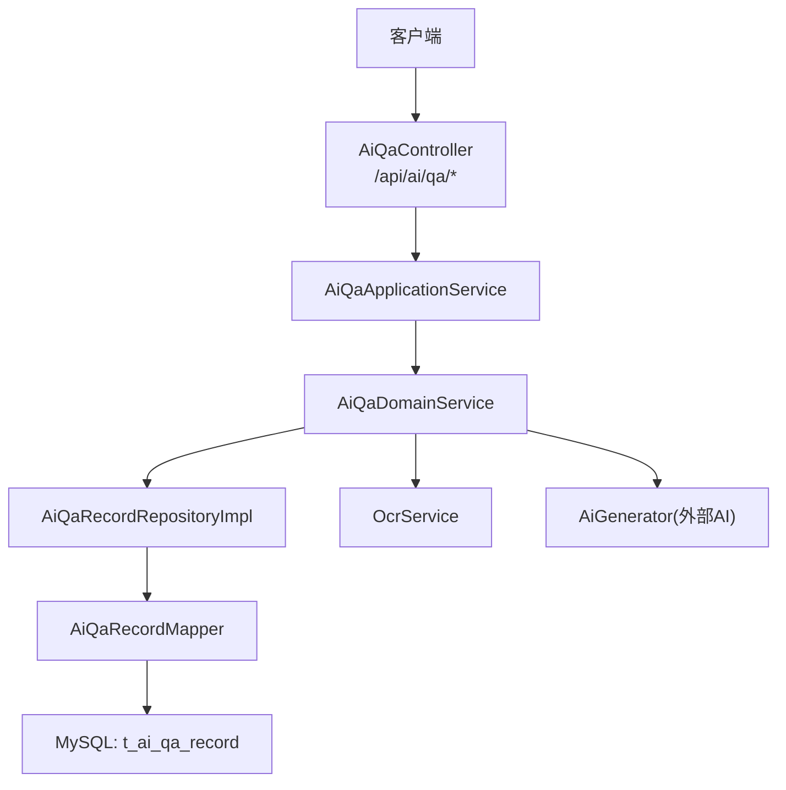
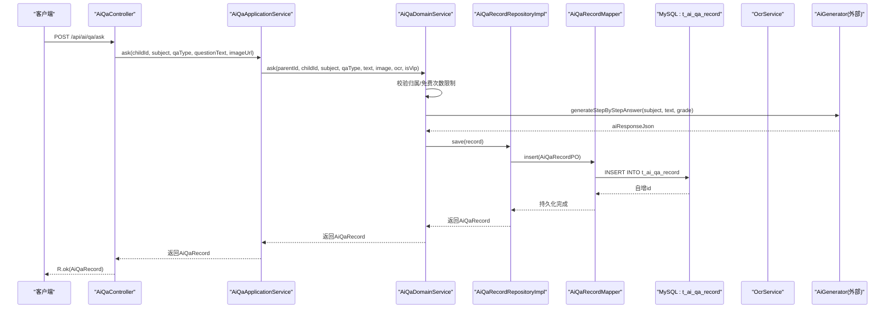
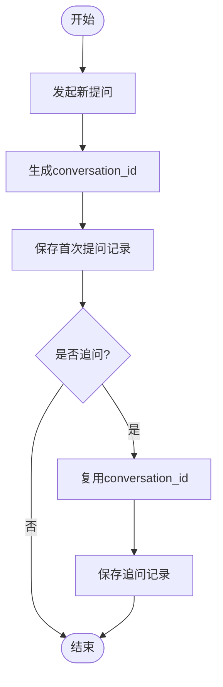
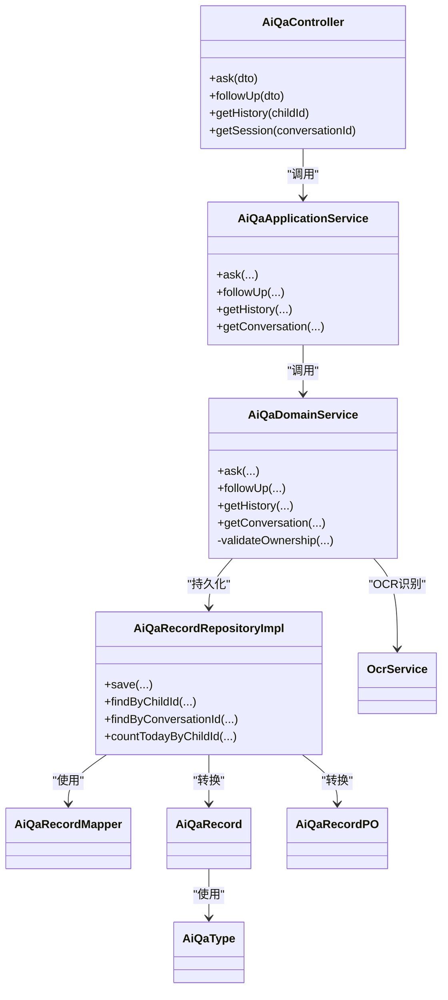

# AI问答记录表

<cite>
**本文引用的文件**
- [t_ai_qa_record.sql](file://wzoto-backend/sql/t_ai_qa_record.sql)
- [AiQaRecord.java](file://wzoto-backend/wzoto-domain/src/main/java/com/wzoto/domain/entity/AiQaRecord.java)
- [AiQaRecordPO.java](file://wzoto-backend/wzoto-infrastructure/src/main/java/com/wzoto/infrastructure/pojo/AiQaRecordPO.java)
- [AiQaType.java](file://wzoto-backend/wzoto-domain/src/main/java/com/wzoto/domain/valobj/AiQaType.java)
- [AiQaRecordRepositoryImpl.java](file://wzoto-backend/wzoto-infrastructure/src/main/java/com/wzoto/infrastructure/repository/AiQaRecordRepositoryImpl.java)
- [AiQaRecordMapper.java](file://wzoto-backend/wzoto-infrastructure/src/main/java/com/wzoto/infrastructure/mapper/AiQaRecordMapper.java)
- [AiQaDomainService.java](file://wzoto-backend/wzoto-domain/src/main/java/com/wzoto/domain/service/AiQaDomainService.java)
- [AiQaApplicationService.java](file://wzoto-backend/wzoto-application/src/main/java/com/wzoto/application/service/AiQaApplicationService.java)
- [AiQaController.java](file://wzoto-backend/wzoto-interfaces/src/main/java/com/wzoto/interfaces/controller/AiQaController.java)
- [OcrService.java](file://wzoto-backend/wzoto-infrastructure/src/main/java/com/wzoto/infrastructure/ai/OcrService.java)
</cite>

## 目录
1. [简介](#简介)
2. [项目结构](#项目结构)
3. [核心组件](#核心组件)
4. [架构总览](#架构总览)
5. [详细组件分析](#详细组件分析)
6. [依赖关系分析](#依赖关系分析)
7. [性能与索引优化](#性能与索引优化)
8. [数据查询示例](#数据查询示例)
9. [数据安全与隐私保护](#数据安全与隐私保护)
10. [故障排查指南](#故障排查指南)
11. [结论](#结论)

## 简介
本文件围绕 t_ai_qa_record 表，系统性说明其设计目标、字段含义、对话历史管理、上下文关联机制（会话ID）、OCR文字提取与图片URL管理、AI回复JSON结构设计、多维度索引策略、典型查询场景与性能调优建议，以及数据安全与隐私保护措施。该表用于支撑“拍照搜题+文字提问”的AI分步启发式答疑能力，并支持追问续问、按子女/家长/学科/时间等多维度检索。

## 项目结构
围绕AI问答记录的数据流贯穿接口层、应用层、领域层与基础设施层：
- 接口层：暴露REST API，接收提问与追问请求，返回统一响应。
- 应用层：编排业务调用，注入当前用户上下文，校验参数。
- 领域层：实现核心业务规则（权限校验、次数限制、会话生成、AI调用）。
- 基础设施层：持久化仓储实现、MyBatis映射、OCR服务封装。

图表来源
- [AiQaController.java:1-51](file://wzoto-backend/wzoto-interfaces/src/main/java/com/wzoto/interfaces/controller/AiQaController.java#L1-L51)
- [AiQaApplicationService.java:1-43](file://wzoto-backend/wzoto-application/src/main/java/com/wzoto/application/service/AiQaApplicationService.java#L1-L43)
- [AiQaDomainService.java:1-106](file://wzoto-backend/wzoto-domain/src/main/java/com/wzoto/domain/service/AiQaDomainService.java#L1-L106)
- [AiQaRecordRepositoryImpl.java:1-117](file://wzoto-backend/wzoto-infrastructure/src/main/java/com/wzoto/infrastructure/repository/AiQaRecordRepositoryImpl.java#L1-L117)
- [AiQaRecordMapper.java:1-10](file://wzoto-backend/wzoto-infrastructure/src/main/java/com/wzoto/infrastructure/mapper/AiQaRecordMapper.java#L1-L10)
- [OcrService.java:1-38](file://wzoto-backend/wzoto-infrastructure/src/main/java/com/wzoto/infrastructure/ai/OcrService.java#L1-L38)

章节来源
- [AiQaController.java:1-51](file://wzoto-backend/wzoto-interfaces/src/main/java/com/wzoto/interfaces/controller/AiQaController.java#L1-L51)
- [AiQaApplicationService.java:1-43](file://wzoto-backend/wzoto-application/src/main/java/com/wzoto/application/service/AiQaApplicationService.java#L1-L43)
- [AiQaDomainService.java:1-106](file://wzoto-backend/wzoto-domain/src/main/java/com/wzoto/domain/service/AiQaDomainService.java#L1-L106)
- [AiQaRecordRepositoryImpl.java:1-117](file://wzoto-backend/wzoto-infrastructure/src/main/java/com/wzoto/infrastructure/repository/AiQaRecordRepositoryImpl.java#L1-L117)
- [AiQaRecordMapper.java:1-10](file://wzoto-backend/wzoto-infrastructure/src/main/java/com/wzoto/infrastructure/mapper/AiQaRecordMapper.java#L1-L10)
- [OcrService.java:1-38](file://wzoto-backend/wzoto-infrastructure/src/main/java/com/wzoto/infrastructure/ai/OcrService.java#L1-L38)

## 核心组件
- 表结构与实体映射
  - 数据库表：t_ai_qa_record，定义主键、业务字段、软删除与审计时间戳，以及多维索引。
  - 领域实体：AiQaRecord，提供创建新提问与追问的工厂方法，封装类型值对象。
  - 持久化对象：AiQaRecordPO，使用MyBatis注解映射表结构，自动填充审计字段。
- 类型与枚举
  - AiQaType：区分拍照搜题与文字提问，提供编码转换。
- 仓储与映射
  - AiQaRecordRepositoryImpl：实现按子女、学科、会话、当日计数等查询；负责PO与Entity双向转换。
  - AiQaRecordMapper：继承BaseMapper，提供基础CRUD。
- 领域与应用服务
  - AiQaDomainService：权限校验、免费次数限制、会话ID生成、AI回答生成、保存记录。
  - AiQaApplicationService：从上下文中获取当前家长ID，组装领域服务调用。
- 接口控制器
  - AiQaController：对外暴露提问、追问、历史、会话查询接口，统一返回格式。
- OCR服务
  - OcrService：预留百度/腾讯OCR接口，开发阶段使用Mock实现。

章节来源
- [t_ai_qa_record.sql:1-30](file://wzoto-backend/sql/t_ai_qa_record.sql#L1-L30)
- [AiQaRecord.java:1-73](file://wzoto-backend/wzoto-domain/src/main/java/com/wzoto/domain/entity/AiQaRecord.java#L1-L73)
- [AiQaRecordPO.java:1-33](file://wzoto-backend/wzoto-infrastructure/src/main/java/com/wzoto/infrastructure/pojo/AiQaRecordPO.java#L1-L33)
- [AiQaType.java:1-31](file://wzoto-backend/wzoto-domain/src/main/java/com/wzoto/domain/valobj/AiQaType.java#L1-L31)
- [AiQaRecordRepositoryImpl.java:1-117](file://wzoto-backend/wzoto-infrastructure/src/main/java/com/wzoto/infrastructure/repository/AiQaRecordRepositoryImpl.java#L1-L117)
- [AiQaRecordMapper.java:1-10](file://wzoto-backend/wzoto-infrastructure/src/main/java/com/wzoto/infrastructure/mapper/AiQaRecordMapper.java#L1-L10)
- [AiQaDomainService.java:1-106](file://wzoto-backend/wzoto-domain/src/main/java/com/wzoto/domain/service/AiQaDomainService.java#L1-L106)
- [AiQaApplicationService.java:1-43](file://wzoto-backend/wzoto-application/src/main/java/com/wzoto/application/service/AiQaApplicationService.java#L1-L43)
- [AiQaController.java:1-51](file://wzoto-backend/wzoto-interfaces/src/main/java/com/wzoto/interfaces/controller/AiQaController.java#L1-L51)
- [OcrService.java:1-38](file://wzoto-backend/wzoto-infrastructure/src/main/java/com/wzoto/infrastructure/ai/OcrService.java#L1-L38)

## 架构总览
AI问答流程包括：接口接收请求→应用服务解析上下文→领域服务校验与限流→调用AI生成答案→持久化记录→返回结果。OCR服务在拍照场景下可提取题目文本，作为AI输入的一部分。

图表来源
- [AiQaController.java:25-31](file://wzoto-backend/wzoto-interfaces/src/main/java/com/wzoto/interfaces/controller/AiQaController.java#L25-L31)
- [AiQaApplicationService.java:21-27](file://wzoto-backend/wzoto-application/src/main/java/com/wzoto/application/service/AiQaApplicationService.java#L21-L27)
- [AiQaDomainService.java:34-57](file://wzoto-backend/wzoto-domain/src/main/java/com/wzoto/domain/service/AiQaDomainService.java#L34-L57)
- [AiQaRecordRepositoryImpl.java:25-31](file://wzoto-backend/wzoto-infrastructure/src/main/java/com/wzoto/infrastructure/repository/AiQaRecordRepositoryImpl.java#L25-L31)
- [AiQaRecordMapper.java:7-9](file://wzoto-backend/wzoto-infrastructure/src/main/java/com/wzoto/infrastructure/mapper/AiQaRecordMapper.java#L7-L9)

## 详细组件分析

### 表设计与字段语义
- 主键与会话追踪
  - id：自增主键，唯一标识每条问答记录。
  - conversation_id：同一轮对话共享的会话ID，用于将多次提问与追问串联为一次学习会话。
- 主体与上下文
  - child_id：子女ID，用于限定数据范围与权限校验。
  - parent_id：家长用户ID，用于访问控制与统计。
  - subject：学科（如数学、语文、英语），用于分类检索与个性化推荐。
  - grade：年级，结合学科用于AI回答的学段适配。
- 提问内容与来源
  - qa_type：提问类型，区分拍照搜题与文字提问。
  - question_text：文字问题内容。
  - question_image_url：拍照上传的图片URL，便于回溯原始题目。
  - ocr_text：OCR识别提取的文字，作为AI输入的补充或替代。
- AI回复与知识点
  - ai_response_json：AI回复结构化JSON，包含分步解析、知识点、变式题等，便于前端渲染与二次加工。
  - knowledge_tags：知识点标签（逗号分隔），用于知识图谱关联与学习路径推荐。
- 追问与步骤
  - is_follow_up：是否为追问，标记续问行为。
  - step_count：解题步骤数，辅助评估回答复杂度。
- 审计与软删除
  - deleted：逻辑删除标志。
  - created_at/updated_at：审计时间戳，自动填充。

章节来源
- [t_ai_qa_record.sql:5-29](file://wzoto-backend/sql/t_ai_qa_record.sql#L5-L29)
- [AiQaRecord.java:20-71](file://wzoto-backend/wzoto-domain/src/main/java/com/wzoto/domain/entity/AiQaRecord.java#L20-L71)
- [AiQaRecordPO.java:10-32](file://wzoto-backend/wzoto-infrastructure/src/main/java/com/wzoto/infrastructure/pojo/AiQaRecordPO.java#L10-L32)

### 对话历史管理与上下文关联机制
- 会话ID设计原理
  - 每次发起新提问时，领域服务生成唯一的conversation_id，并将本次及后续追问记录绑定到同一会话。
  - 通过conversation_id可完整还原一次学习会话的上下文，支持按会话拉取对话序列。
- 追问机制
  - 追问记录is_follow_up=true，且保持相同的conversation_id，确保上下文连贯。
  - 领域服务在追问前会校验会话是否存在，避免无效续问。

图表来源
- [AiQaDomainService.java:34-57](file://wzoto-backend/wzoto-domain/src/main/java/com/wzoto/domain/service/AiQaDomainService.java#L34-L57)
- [AiQaDomainService.java:62-82](file://wzoto-backend/wzoto-domain/src/main/java/com/wzoto/domain/service/AiQaDomainService.java#L62-L82)

章节来源
- [AiQaDomainService.java:34-82](file://wzoto-backend/wzoto-domain/src/main/java/com/wzoto/domain/service/AiQaDomainService.java#L34-L82)

### OCR文字提取存储与图片URL管理
- OCR服务
  - OcrService提供图片文字识别接口，当前为Mock实现，生产环境可替换为百度/腾讯OCR。
  - 识别结果写入ocr_text字段，便于后续分析与展示。
- 图片URL管理
  - question_image_url存储图片地址，便于回溯原始题目与多媒体展示。
  - 建议在OSS/CDN侧配置访问鉴权与防盗链，保障资源安全。

章节来源
- [OcrService.java:14-36](file://wzoto-backend/wzoto-infrastructure/src/main/java/com/wzoto/infrastructure/ai/OcrService.java#L14-L36)
- [t_ai_qa_record.sql:13-15](file://wzoto-backend/sql/t_ai_qa_record.sql#L13-L15)

### AI回复JSON结构设计
- ai_response_json用于承载AI的结构化回复，建议包含：
  - 分步解析：逐步推理过程，便于教学展示。
  - 知识点：关联knowledge_tags，形成知识图谱。
  - 变式题：举一反三的练习建议。
- 前端可根据JSON结构进行卡片化渲染、折叠展开、高亮关键步骤。

章节来源
- [t_ai_qa_record.sql:16](file://wzoto-backend/sql/t_ai_qa_record.sql#L16)
- [AiQaDomainService.java:47-53](file://wzoto-backend/wzoto-domain/src/main/java/com/wzoto/domain/service/AiQaDomainService.java#L47-L53)

### 索引优化策略
- 单列索引
  - idx_child_id：按子女快速定位历史记录。
  - idx_parent_id：按家长统计与审计。
  - idx_conversation_id：按会话拉取对话序列。
  - idx_subject：按学科筛选。
  - idx_created_at：按时间排序与范围查询。
- 复合索引
  - idx_child_subject：按子女+学科组合查询，提升细分维度检索效率。
- 查询模式匹配
  - 历史记录：child_id + created_at DESC。
  - 会话详情：conversation_id + created_at ASC。
  - 学科统计：child_id + subject + created_at。

章节来源
- [t_ai_qa_record.sql:23-28](file://wzoto-backend/sql/t_ai_qa_record.sql#L23-L28)
- [AiQaRecordRepositoryImpl.java:40-62](file://wzoto-backend/wzoto-infrastructure/src/main/java/com/wzoto/infrastructure/repository/AiQaRecordRepositoryImpl.java#L40-L62)

## 依赖关系分析
- 控制器依赖应用服务，应用服务依赖领域服务，领域服务依赖仓储与外部AI/OCR。
- 仓储实现依赖MyBatis Mapper，Mapper直接操作数据库表。
- 领域服务通过值对象AiQaType与GradeType保证类型安全与一致性。

图表来源
- [AiQaController.java:1-51](file://wzoto-backend/wzoto-interfaces/src/main/java/com/wzoto/interfaces/controller/AiQaController.java#L1-L51)
- [AiQaApplicationService.java:1-43](file://wzoto-backend/wzoto-application/src/main/java/com/wzoto/application/service/AiQaApplicationService.java#L1-L43)
- [AiQaDomainService.java:1-106](file://wzoto-backend/wzoto-domain/src/main/java/com/wzoto/domain/service/AiQaDomainService.java#L1-L106)
- [AiQaRecordRepositoryImpl.java:1-117](file://wzoto-backend/wzoto-infrastructure/src/main/java/com/wzoto/infrastructure/repository/AiQaRecordRepositoryImpl.java#L1-L117)
- [AiQaRecordMapper.java:1-10](file://wzoto-backend/wzoto-infrastructure/src/main/java/com/wzoto/infrastructure/mapper/AiQaRecordMapper.java#L1-L10)
- [OcrService.java:1-38](file://wzoto-backend/wzoto-infrastructure/src/main/java/com/wzoto/infrastructure/ai/OcrService.java#L1-L38)
- [AiQaRecord.java:1-73](file://wzoto-backend/wzoto-domain/src/main/java/com/wzoto/domain/entity/AiQaRecord.java#L1-L73)
- [AiQaRecordPO.java:1-33](file://wzoto-backend/wzoto-infrastructure/src/main/java/com/wzoto/infrastructure/pojo/AiQaRecordPO.java#L1-L33)
- [AiQaType.java:1-31](file://wzoto-backend/wzoto-domain/src/main/java/com/wzoto/domain/valobj/AiQaType.java#L1-L31)

## 性能与索引优化
- 查询路径优化
  - 历史记录：优先使用idx_child_id + created_at DESC，避免全表扫描。
  - 会话详情：使用idx_conversation_id + created_at ASC，保证顺序读取。
  - 学科统计：利用idx_child_subject减少过滤成本。
- 分页与裁剪
  - 对历史列表与学科统计建议增加分页与字段裁剪，减少网络传输与内存占用。
- 缓存策略
  - 高频会话可引入Redis缓存，降低重复查询压力。
- 写入优化
  - 批量插入追问记录时可考虑批处理，减少事务开销。
- 监控与慢查询
  - 开启慢查询日志，定期分析执行计划，必要时调整索引或SQL。

[本节为通用性能指导，不直接分析具体文件]

## 数据查询示例
以下为基于现有索引与仓储方法的查询思路（以自然语言描述）：
- 按子女查询历史
  - 条件：child_id
  - 排序：created_at DESC
  - 适用索引：idx_child_id
- 按会话查询对话
  - 条件：conversation_id
  - 排序：created_at ASC
  - 适用索引：idx_conversation_id
- 按子女+学科查询
  - 条件：child_id, subject
  - 排序：created_at DESC
  - 适用索引：idx_child_subject
- 当日次数统计（免费用户限流）
  - 条件：child_id, created_at >= 今日起始时间
  - 适用索引：idx_child_id + idx_created_at（联合扫描）

章节来源
- [AiQaRecordRepositoryImpl.java:40-71](file://wzoto-backend/wzoto-infrastructure/src/main/java/com/wzoto/infrastructure/repository/AiQaRecordRepositoryImpl.java#L40-L71)
- [t_ai_qa_record.sql:23-28](file://wzoto-backend/sql/t_ai_qa_record.sql#L23-L28)

## 数据安全与隐私保护
- 访问控制
  - 领域服务校验parent_id与child_id的归属关系，防止越权访问。
- 数据脱敏
  - 对外返回时建议对敏感信息（如图片URL、OCR文本）进行脱敏或按需裁剪。
- 传输安全
  - 接口需启用HTTPS，防止中间人攻击。
- 存储安全
  - 图片与OCR文本建议存储在受控的OSS/CDN，并设置访问策略与生命周期。
- 合规与审计
  - 记录created_at/updated_at与deleted标志，满足审计与合规要求。
  - 对频繁访问与异常行为进行告警与限流。

章节来源
- [AiQaDomainService.java:99-104](file://wzoto-backend/wzoto-domain/src/main/java/com/wzoto/domain/service/AiQaDomainService.java#L99-L104)
- [t_ai_qa_record.sql:20-22](file://wzoto-backend/sql/t_ai_qa_record.sql#L20-L22)

## 故障排查指南
- 常见问题
  - 会话不存在：追问前校验会话存在性，若为空则提示重新发起提问。
  - 免费次数用尽：非VIP用户达到每日上限后拒绝继续提问。
  - OCR识别失败：检查图片URL有效性与服务可用性，必要时降级为纯文字提问。
- 日志与诊断
  - 关注领域服务日志输出，确认conversation_id生成与AI调用结果。
  - 检查仓储层SQL执行计划，确认索引命中情况。
- 恢复策略
  - 对异常中断的请求，可通过conversation_id重试或回滚至上一稳定状态。

章节来源
- [AiQaDomainService.java:62-82](file://wzoto-backend/wzoto-domain/src/main/java/com/wzoto/domain/service/AiQaDomainService.java#L62-L82)
- [AiQaDomainService.java:34-57](file://wzoto-backend/wzoto-domain/src/main/java/com/wzoto/domain/service/AiQaDomainService.java#L34-L57)
- [OcrService.java:20-36](file://wzoto-backend/wzoto-infrastructure/src/main/java/com/wzoto/infrastructure/ai/OcrService.java#L20-L36)

## 结论
t_ai_qa_record表通过会话ID、多维度索引与结构化AI回复，实现了高效的对话历史管理与上下文关联。结合权限校验、限流策略与OCR能力，系统能够稳定支撑拍照搜题与文字提问的AI答疑场景。建议在生产环境中完善OCR接入、图片资源安全策略与缓存机制，持续优化查询性能与用户体验。

[本节为总结性内容，不直接分析具体文件]