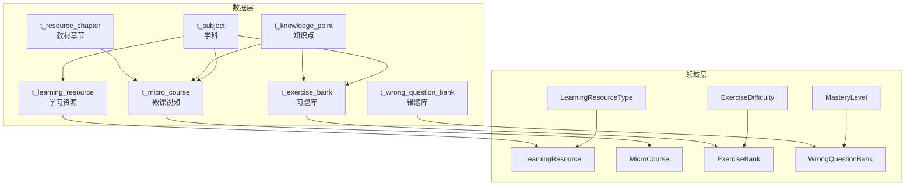
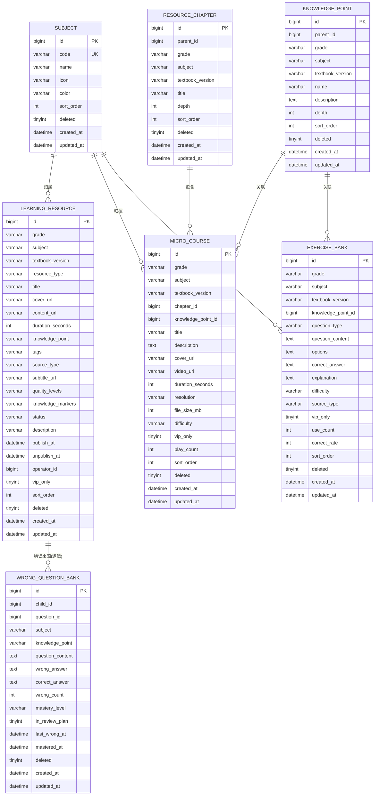
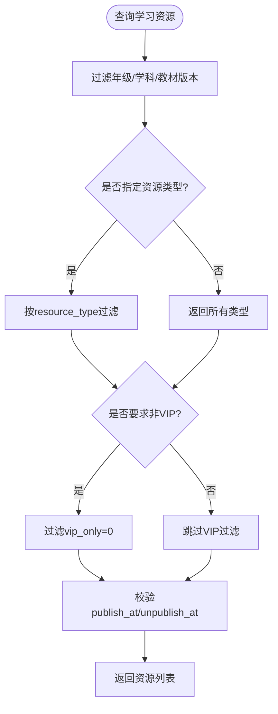
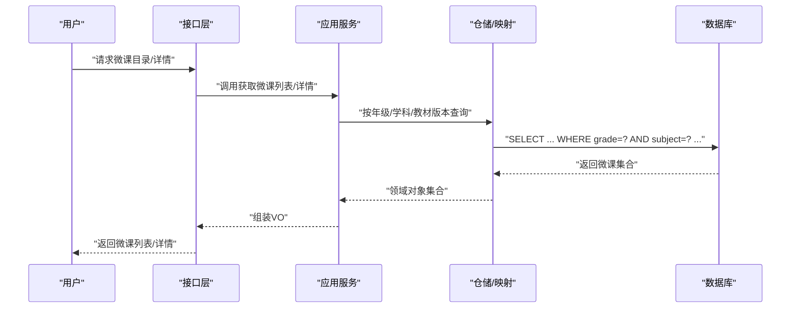
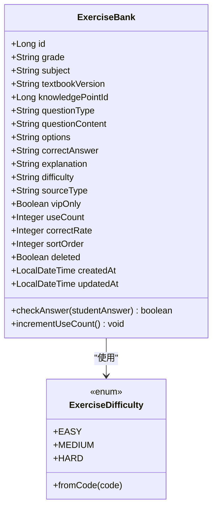
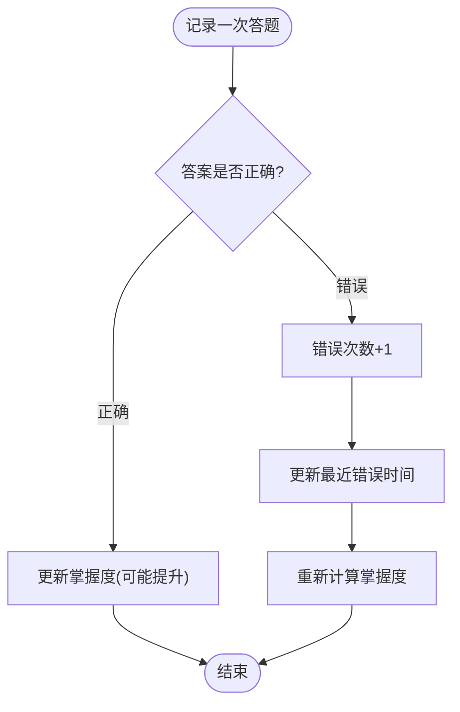
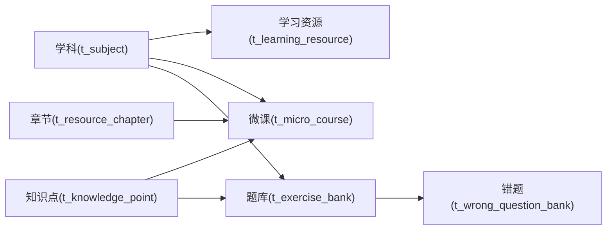

# 学习系统表

<cite>
**本文引用的文件**
- [t_learning_resource.sql](file://wzoto-backend/sql/t_learning_resource.sql)
- [t_micro_course.sql](file://wzoto-backend/sql/t_micro_course.sql)
- [t_exercise_bank.sql](file://wzoto-backend/sql/t_exercise_bank.sql)
- [t_wrong_question_bank.sql](file://wzoto-backend/sql/t_wrong_question_bank.sql)
- [t_resource_chapter.sql](file://wzoto-backend/sql/t_resource_chapter.sql)
- [t_knowledge_point.sql](file://wzoto-backend/sql/t_knowledge_point.sql)
- [t_subject.sql](file://wzoto-backend/sql/t_subject.sql)
- [LearningResource.java](file://wzoto-backend/wzoto-domain/src/main/java/com/wzoto/domain/entity/LearningResource.java)
- [MicroCourse.java](file://wzoto-backend/wzoto-domain/src/main/java/com/wzoto/domain/entity/MicroCourse.java)
- [ExerciseBank.java](file://wzoto-backend/wzoto-domain/src/main/java/com/wzoto/domain/entity/ExerciseBank.java)
- [WrongQuestionBank.java](file://wzoto-backend/wzoto-domain/src/main/java/com/wzoto/domain/entity/WrongQuestionBank.java)
- [LearningResourceType.java](file://wzoto-backend/wzoto-domain/src/main/java/com/wzoto/domain/valobj/LearningResourceType.java)
- [ExerciseDifficulty.java](file://wzoto-backend/wzoto-domain/src/main/java/com/wzoto/domain/valobj/ExerciseDifficulty.java)
- [MasteryLevel.java](file://wzoto-backend/wzoto-domain/src/main/java/com/wzoto/domain/valobj/MasteryLevel.java)
</cite>

## 目录
1. [简介](#简介)
2. [项目结构](#项目结构)
3. [核心组件](#核心组件)
4. [架构总览](#架构总览)
5. [详细组件分析](#详细组件分析)
6. [依赖关系分析](#依赖关系分析)
7. [性能考虑](#性能考虑)
8. [故障排查指南](#故障排查指南)
9. [结论](#结论)
10. [附录](#附录)

## 简介
本文件面向wzoto学习系统的“学习资源、微课、题库、错题本”四大核心数据域，系统化梳理表结构设计、字段语义、关联关系与数据流转，并结合领域实体中的业务规则，给出查询优化、性能调优、一致性与事务处理建议。文档兼顾技术深度与可读性，帮助开发者快速理解并高效扩展学习系统的数据层。

## 项目结构
围绕学习资源体系，后端采用分层设计：SQL脚本定义持久化模型；domain层提供领域实体与值对象（枚举）表达业务规则；infrastructure层通过Mapper实现数据访问；application层编排业务流程；interfaces层暴露API。本节聚焦数据层（SQL与领域实体），为后续章节的深入分析奠定基础。

图表来源
- [t_learning_resource.sql:1-36](file://wzoto-backend/sql/t_learning_resource.sql#L1-L36)
- [t_micro_course.sql:1-32](file://wzoto-backend/sql/t_micro_course.sql#L1-L32)
- [t_exercise_bank.sql:1-31](file://wzoto-backend/sql/t_exercise_bank.sql#L1-L31)
- [t_wrong_question_bank.sql:1-28](file://wzoto-backend/sql/t_wrong_question_bank.sql#L1-L28)
- [t_resource_chapter.sql:1-21](file://wzoto-backend/sql/t_resource_chapter.sql#L1-L21)
- [t_knowledge_point.sql:1-23](file://wzoto-backend/sql/t_knowledge_point.sql#L1-L23)
- [t_subject.sql:1-16](file://wzoto-backend/sql/t_subject.sql#L1-L16)
- [LearningResource.java:1-153](file://wzoto-backend/wzoto-domain/src/main/java/com/wzoto/domain/entity/LearningResource.java#L1-L153)
- [MicroCourse.java:1-52](file://wzoto-backend/wzoto-domain/src/main/java/com/wzoto/domain/entity/MicroCourse.java#L1-L52)
- [ExerciseBank.java:1-52](file://wzoto-backend/wzoto-domain/src/main/java/com/wzoto/domain/entity/ExerciseBank.java#L1-L52)
- [WrongQuestionBank.java:1-133](file://wzoto-backend/wzoto-domain/src/main/java/com/wzoto/domain/entity/WrongQuestionBank.java#L1-L133)
- [LearningResourceType.java:1-33](file://wzoto-backend/wzoto-domain/src/main/java/com/wzoto/domain/valobj/LearningResourceType.java#L1-L33)
- [ExerciseDifficulty.java:1-32](file://wzoto-backend/wzoto-domain/src/main/java/com/wzoto/domain/valobj/ExerciseDifficulty.java#L1-L32)
- [MasteryLevel.java:1-48](file://wzoto-backend/wzoto-domain/src/main/java/com/wzoto/domain/valobj/MasteryLevel.java#L1-L48)

章节来源
- [t_learning_resource.sql:1-36](file://wzoto-backend/sql/t_learning_resource.sql#L1-L36)
- [t_micro_course.sql:1-32](file://wzoto-backend/sql/t_micro_course.sql#L1-L32)
- [t_exercise_bank.sql:1-31](file://wzoto-backend/sql/t_exercise_bank.sql#L1-L31)
- [t_wrong_question_bank.sql:1-28](file://wzoto-backend/sql/t_wrong_question_bank.sql#L1-L28)
- [t_resource_chapter.sql:1-21](file://wzoto-backend/sql/t_resource_chapter.sql#L1-L21)
- [t_knowledge_point.sql:1-23](file://wzoto-backend/sql/t_knowledge_point.sql#L1-L23)
- [t_subject.sql:1-16](file://wzoto-backend/sql/t_subject.sql#L1-L16)
- [LearningResource.java:1-153](file://wzoto-backend/wzoto-domain/src/main/java/com/wzoto/domain/entity/LearningResource.java#L1-L153)
- [MicroCourse.java:1-52](file://wzoto-backend/wzoto-domain/src/main/java/com/wzoto/domain/entity/MicroCourse.java#L1-L52)
- [ExerciseBank.java:1-52](file://wzoto-backend/wzoto-domain/src/main/java/com/wzoto/domain/entity/ExerciseBank.java#L1-L52)
- [WrongQuestionBank.java:1-133](file://wzoto-backend/wzoto-domain/src/main/java/com/wzoto/domain/entity/WrongQuestionBank.java#L1-L133)
- [LearningResourceType.java:1-33](file://wzoto-backend/wzoto-domain/src/main/java/com/wzoto/domain/valobj/LearningResourceType.java#L1-L33)
- [ExerciseDifficulty.java:1-32](file://wzoto-backend/wzoto/domain/valobj/ExerciseDifficulty.java#L1-L32)
- [MasteryLevel.java:1-48](file://wzoto-backend/wzoto-domain/src/main/java/com/wzoto/domain/valobj/MasteryLevel.java#L1-L48)

## 核心组件
- 学习资源表 t_learning_resource：承载多类型学习资源（视频、练习、PDF、题目），支持年级/学科/教材版本维度组织，提供VIP可见控制、发布周期、标签与知识点标记等能力。
- 微课表 t_micro_course：按年级/学科/教材版本组织微课，关联章节与知识点，记录播放次数与难度等级，支撑课程树与进度统计。
- 题库表 t_exercise_bank：管理题目分类（题型）、难度等级、答案与解析，支持来源标注与使用统计，便于AI生成与人工维护混合。
- 错题本表 t_wrong_question_bank：以子女为单位记录错误，跟踪错误次数、掌握度、复习计划参与状态，驱动个性化复习策略。

章节来源
- [t_learning_resource.sql:1-36](file://wzoto-backend/sql/t_learning_resource.sql#L1-L36)
- [t_micro_course.sql:1-32](file://wzoto-backend/sql/t_micro_course.sql#L1-L32)
- [t_exercise_bank.sql:1-31](file://wzoto-backend/sql/t_exercise_bank.sql#L1-L31)
- [t_wrong_question_bank.sql:1-28](file://wzoto-backend/sql/t_wrong_question_bank.sql#L1-L28)

## 架构总览
学习资源体系以“学科-年级-教材版本”为主线，章节与知识点作为导航骨架，微课与资源挂载于章节/知识点之上，题目与错题分别服务于练习与巩固闭环。

图表来源
- [t_subject.sql:1-16](file://wzoto-backend/sql/t_subject.sql#L1-L16)
- [t_knowledge_point.sql:1-23](file://wzoto-backend/sql/t_knowledge_point.sql#L1-L23)
- [t_resource_chapter.sql:1-21](file://wzoto-backend/sql/t_resource_chapter.sql#L1-L21)
- [t_learning_resource.sql:1-36](file://wzoto-backend/sql/t_learning_resource.sql#L1-L36)
- [t_micro_course.sql:1-32](file://wzoto-backend/sql/t_micro_course.sql#L1-L32)
- [t_exercise_bank.sql:1-31](file://wzoto-backend/sql/t_exercise_bank.sql#L1-L31)
- [t_wrong_question_bank.sql:1-28](file://wzoto-backend/sql/t_wrong_question_bank.sql#L1-L28)

## 详细组件分析

### 学习资源表 t_learning_resource
- 资源类型管理：通过resource_type区分视频、练习、PDF、题目；结合source_type标识视频源（MP4/B站/智慧教育平台等）。
- 内容存储方式：content_url指向资源地址；video类资源可附带subtitle_url与quality_levels（多清晰度）；knowledge_markers用于知识点时间轴标记。
- 访问权限控制：vip_only控制仅会员可见；publish_at/unpublish_at控制发布时间窗口；status控制上架/下架。
- 索引与查询：针对grade+subject、textbook_version、resource_type、vip_only、knowledge_point建立索引，支持按年级/学科/教材/类型/知识点快速检索。

图表来源
- [t_learning_resource.sql:1-36](file://wzoto-backend/sql/t_learning_resource.sql#L1-L36)
- [LearningResource.java:1-153](file://wzoto-backend/wzoto-domain/src/main/java/com/wzoto/domain/entity/LearningResource.java#L1-L153)
- [LearningResourceType.java:1-33](file://wzoto-backend/wzoto-domain/src/main/java/com/wzoto/domain/valobj/LearningResourceType.java#L1-L33)

章节来源
- [t_learning_resource.sql:1-36](file://wzoto-backend/sql/t_learning_resource.sql#L1-L36)
- [LearningResource.java:1-153](file://wzoto-backend/wzoto-domain/src/main/java/com/wzoto/domain/entity/LearningResource.java#L1-L153)
- [LearningResourceType.java:1-33](file://wzoto-backend/wzoto-domain/src/main/java/com/wzoto/domain/valobj/LearningResourceType.java#L1-L33)

### 微课表 t_micro_course
- 课程结构与章节管理：chapter_id关联教材章节，形成“册-单元-课”的层级导航；knowledge_point_id关联知识点，支持知识图谱式学习路径。
- 播放进度跟踪：play_count记录播放次数；结合前端播放日志（如课程观看记录表）可实现更细粒度的进度追踪（当前表提供基础计数）。
- 难度与VIP：difficulty控制难度梯度；vip_only控制付费可见。
- 索引与查询：针对grade+subject、textbook_version、chapter_id、knowledge_point_id、vip_only、difficulty建立索引，利于目录加载与推荐。

图表来源
- [t_micro_course.sql:1-32](file://wzoto-backend/sql/t_micro_course.sql#L1-L32)
- [t_resource_chapter.sql:1-21](file://wzoto-backend/sql/t_resource_chapter.sql#L1-L21)
- [MicroCourse.java:1-52](file://wzoto-backend/wzoto-domain/src/main/java/com/wzoto/domain/entity/MicroCourse.java#L1-L52)

章节来源
- [t_micro_course.sql:1-32](file://wzoto-backend/sql/t_micro_course.sql#L1-L32)
- [t_resource_chapter.sql:1-21](file://wzoto-backend/sql/t_resource_chapter.sql#L1-L21)
- [MicroCourse.java:1-52](file://wzoto-backend/wzoto-domain/src/main/java/com/wzoto/domain/entity/MicroCourse.java#L1-L52)

### 题库表 t_exercise_bank
- 题目分类与题型管理：question_type支持选择、填空、判断、简答等；options用于选择题选项JSON；correct_answer存储标准答案。
- 难度等级：difficulty分为基础/提高/挑战，便于分层训练与自适应出题。
- 来源与统计：source_type标注系统/AI/自定义来源；use_count与correct_rate用于题目质量评估与热题推荐。
- 索引与查询：针对grade+subject、knowledge_point_id、question_type、difficulty、source_type、vip_only建立索引，支持多维筛选与统计。

图表来源
- [t_exercise_bank.sql:1-31](file://wzoto-backend/sql/t_exercise_bank.sql#L1-L31)
- [ExerciseBank.java:1-52](file://wzoto-backend/wzoto-domain/src/main/java/com/wzoto/domain/entity/ExerciseBank.java#L1-L52)
- [ExerciseDifficulty.java:1-32](file://wzoto-backend/wzoto-domain/src/main/java/com/wzoto/domain/valobj/ExerciseDifficulty.java#L1-L32)

章节来源
- [t_exercise_bank.sql:1-31](file://wzoto-backend/sql/t_exercise_bank.sql#L1-L31)
- [ExerciseBank.java:1-52](file://wzoto-backend/wzoto-domain/src/main/java/com/wzoto/domain/entity/ExerciseBank.java#L1-L52)
- [ExerciseDifficulty.java:1-32](file://wzoto-backend/wzoto-domain/src/main/java/com/wzoto/domain/valobj/ExerciseDifficulty.java#L1-L32)

### 错题本表 t_wrong_question_bank
- 错误记录：child_id定位学生，question_id关联题目，subject/knowledge_point用于归类；wrong_answer/correct_answer便于复盘。
- 复习策略：in_review_plan标记是否加入复习计划；last_wrong_at辅助间隔重复算法；mastery_level表示掌握程度。
- 掌握程度评估：根据错误次数或正确率动态调整掌握度（NOT_MASTERED/GENERAL/PROFICIENT），支持可视化红黄绿展示。
- 索引与查询：针对child_id、subject、knowledge_point、mastery_level、in_review_plan及复合索引child_id+mastery_level，便于按学生维度统计与推送。

图表来源
- [t_wrong_question_bank.sql:1-28](file://wzoto-backend/sql/t_wrong_question_bank.sql#L1-L28)
- [WrongQuestionBank.java:1-133](file://wzoto-backend/wzoto-domain/src/main/java/com/wzoto/domain/entity/WrongQuestionBank.java#L1-L133)
- [MasteryLevel.java:1-48](file://wzoto-backend/wzoto-domain/src/main/java/com/wzoto/domain/valobj/MasteryLevel.java#L1-L48)

章节来源
- [t_wrong_question_bank.sql:1-28](file://wzoto-backend/sql/t_wrong_question_bank.sql#L1-L28)
- [WrongQuestionBank.java:1-133](file://wzoto-backend/wzoto-domain/src/main/java/com/wzoto/domain/entity/WrongQuestionBank.java#L1-L133)
- [MasteryLevel.java:1-48](file://wzoto-backend/wzoto-domain/src/main/java/com/wzoto/domain/valobj/MasteryLevel.java#L1-L48)

## 依赖关系分析
- 学科/年级/教材版本：作为主维度贯穿资源、微课、题目，确保内容组织的一致性。
- 章节与知识点：章节提供课程导航，知识点提供知识图谱锚点；微课与题目均可关联知识点，形成“学-练-测”闭环。
- 资源与错题：错题来源于题目作答失败，结合知识点与学科进行归因分析，驱动复习计划。

图表来源
- [t_subject.sql:1-16](file://wzoto-backend/sql/t_subject.sql#L1-L16)
- [t_knowledge_point.sql:1-23](file://wzoto-backend/sql/t_knowledge_point.sql#L1-L23)
- [t_resource_chapter.sql:1-21](file://wzoto-backend/sql/t_resource_chapter.sql#L1-L21)
- [t_learning_resource.sql:1-36](file://wzoto-backend/sql/t_learning_resource.sql#L1-L36)
- [t_micro_course.sql:1-32](file://wzoto-backend/sql/t_micro_course.sql#L1-L32)
- [t_exercise_bank.sql:1-31](file://wzoto-backend/sql/t_exercise_bank.sql#L1-L31)
- [t_wrong_question_bank.sql:1-28](file://wzoto-backend/sql/t_wrong_question_bank.sql#L1-L28)

章节来源
- [t_subject.sql:1-16](file://wzoto-backend/sql/t_subject.sql#L1-L16)
- [t_knowledge_point.sql:1-23](file://wzoto-backend/sql/t_knowledge_point.sql#L1-L23)
- [t_resource_chapter.sql:1-21](file://wzoto-backend/sql/t_resource_chapter.sql#L1-L21)
- [t_learning_resource.sql:1-36](file://wzoto-backend/sql/t_learning_resource.sql#L1-L36)
- [t_micro_course.sql:1-32](file://wzoto-backend/sql/t_micro_course.sql#L1-L32)
- [t_exercise_bank.sql:1-31](file://wzoto-backend/sql/t_exercise_bank.sql#L1-L31)
- [t_wrong_question_bank.sql:1-28](file://wzoto-backend/sql/t_wrong_question_bank.sql#L1-L28)

## 性能考虑
- 索引策略
  - 高频查询维度已建索引：年级+学科、教材版本、资源类型、知识点、难度、VIP、章节ID、知识点ID等。
  - 建议：对错题本增加复合索引（child_id, mastery_level, in_review_plan）以优化学生维度的复习推送；对微课目录加载可考虑覆盖索引（grade, subject, textbook_version, sort_order）。
- 分页与排序
  - 使用基于主键或唯一索引的分页，避免深分页；对sort_order字段建立索引以提升目录排序性能。
- 读写分离与缓存
  - 微课目录、资源目录等读多写少场景可引入缓存（如Redis），降低数据库压力。
  - 播放次数、使用次数等高并发写入可采用异步落库或批量合并。
- JSON字段
  - tags、quality_levels、knowledge_markers、question_content、options等JSON字段便于扩展，但应避免在WHERE中直接解析；必要时拆分子表或建立冗余列以加速过滤。
- 统计指标
  - correct_rate、use_count、play_count等统计字段需定期汇总或增量更新，避免实时全量计算。

[本节为通用性能建议，不直接分析具体文件]

## 故障排查指南
- 资源不可见问题
  - 检查vip_only与用户会员状态；核对publish_at/unpublish_at时间窗口；确认status是否为上架状态。
- 微课无法播放
  - 校验video_url有效性；检查分辨率与文件大小；确认VIP限制与权限。
- 题目显示异常
  - 检查question_content/options/correct_answer的JSON格式；确认难度与题型匹配；核对知识点关联。
- 错题统计不准确
  - 核对错误次数累加逻辑与最近错误时间更新；检查掌握度重算阈值与颜色映射；确认复习计划标记一致性。

章节来源
- [t_learning_resource.sql:1-36](file://wzoto-backend/sql/t_learning_resource.sql#L1-L36)
- [t_micro_course.sql:1-32](file://wzoto-backend/sql/t_micro_course.sql#L1-L32)
- [t_exercise_bank.sql:1-31](file://wzoto-backend/sql/t_exercise_bank.sql#L1-L31)
- [t_wrong_question_bank.sql:1-28](file://wzoto-backend/sql/t_wrong_question_bank.sql#L1-L28)
- [LearningResource.java:1-153](file://wzoto-backend/wzoto-domain/src/main/java/com/wzoto/domain/entity/LearningResource.java#L1-L153)
- [MicroCourse.java:1-52](file://wzoto-backend/wzoto-domain/src/main/java/com/wzoto/domain/entity/MicroCourse.java#L1-L52)
- [ExerciseBank.java:1-52](file://wzoto-backend/wzoto-domain/src/main/java/com/wzoto/domain/entity/ExerciseBank.java#L1-L52)
- [WrongQuestionBank.java:1-133](file://wzoto-backend/wzoto-domain/src/main/java/com/wzoto/domain/entity/WrongQuestionBank.java#L1-L133)

## 结论
本学习系统表结构围绕“学科-年级-教材版本”主线，构建了资源、微课、题库与错题本的完整闭环。通过合理的索引设计与领域实体业务规则，既保证了查询效率，又实现了灵活的内容组织与个性化学习路径。建议在后续迭代中持续完善统计指标、缓存策略与异步处理机制，进一步提升系统可扩展性与用户体验。

[本节为总结性内容，不直接分析具体文件]

## 附录
- 数据一致性保证与事务处理建议
  - 跨表更新（如微课播放次数、题目使用次数、错题掌握度）应置于同一事务中，确保原子性。
  - 对于高并发写场景，采用乐观锁（版本号）或分布式锁防止竞态条件。
  - 对关键操作（创建资源、发布/下架、加入复习计划）记录审计日志，便于追溯。
  - 定时任务用于修正统计指标（如correct_rate、play_count）与清理软删除数据。

[本节为通用实践建议，不直接分析具体文件]