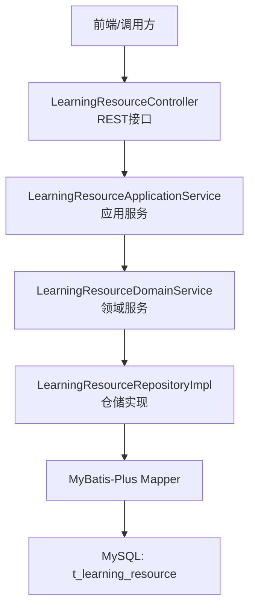
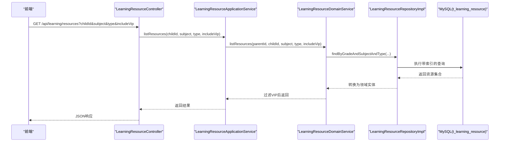
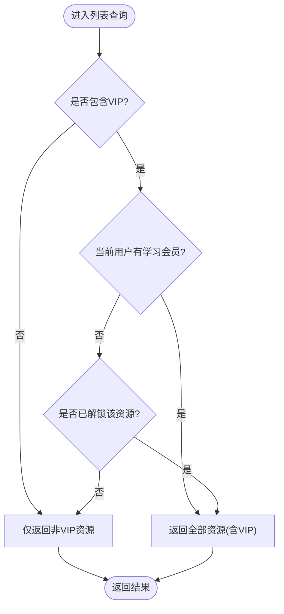
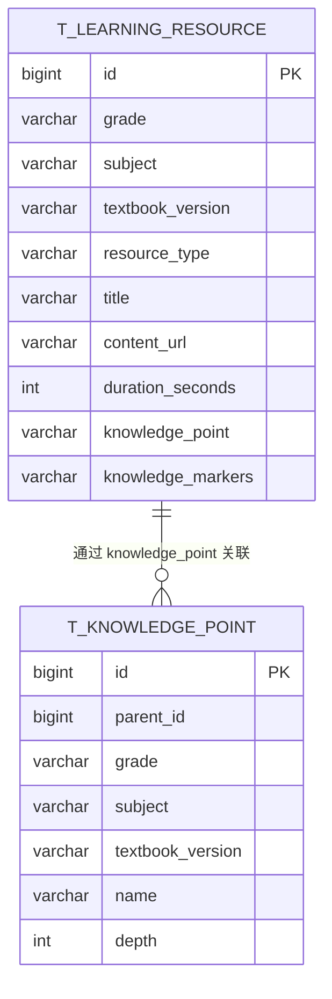
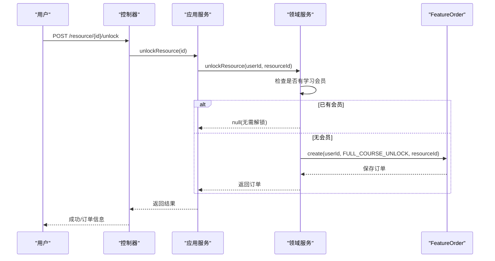
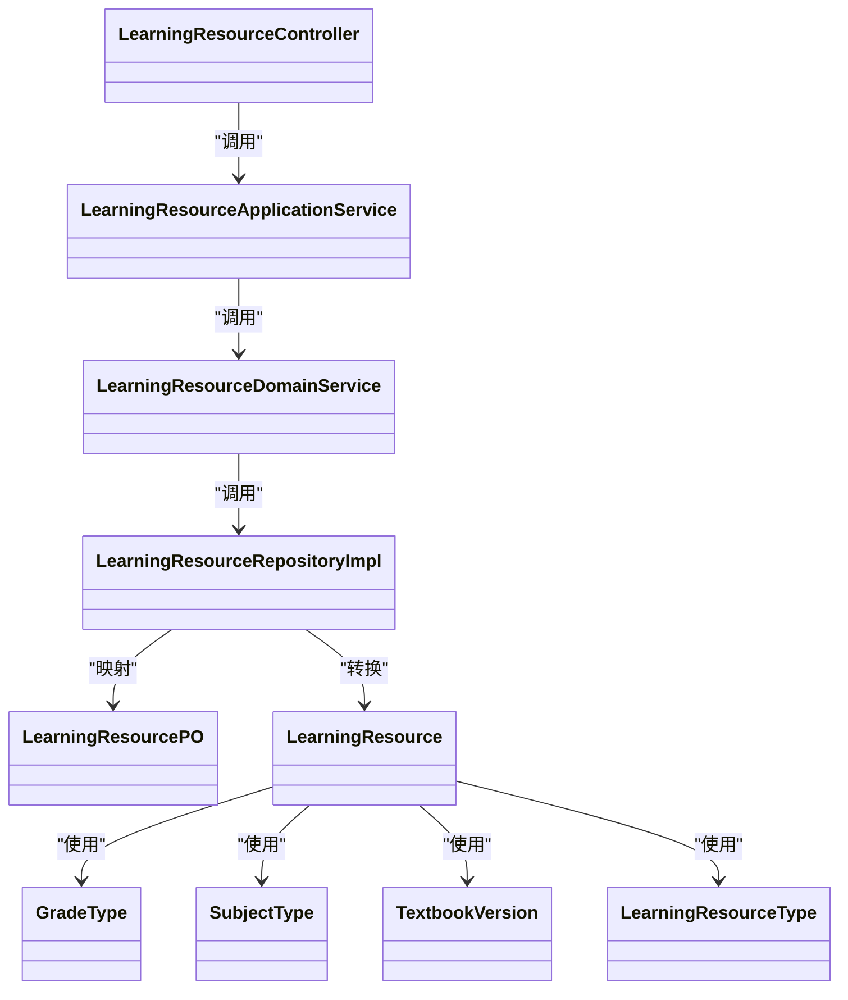

# 学习资源表设计

<cite>
**本文引用的文件**
- [t_learning_resource.sql](file://wzoto-backend/sql/t_learning_resource.sql)
- [LearningResource.java](file://wzoto-backend/wzoto-domain/src/main/java/com/wzoto/domain/entity/LearningResource.java)
- [LearningResourceType.java](file://wzoto-backend/wzoto-domain/src/main/java/com/wzoto/domain/valobj/LearningResourceType.java)
- [GradeType.java](file://wzoto-backend/wzoto-domain/src/main/java/com/wzoto/domain/valobj/GradeType.java)
- [SubjectType.java](file://wzoto-backend/wzoto-domain/src/main/java/com/wzoto/domain/valobj/SubjectType.java)
- [TextbookVersion.java](file://wzoto-backend/wzoto-domain/src/main/java/com/wzoto/domain/valobj/TextbookVersion.java)
- [LearningResourceApplicationService.java](file://wzoto-backend/wzoto-application/src/main/java/com/wzoto/application/service/LearningResourceApplicationService.java)
- [LearningResourceController.java](file://wzoto-backend/wzoto-interfaces/src/main/java/com/wzoto/interfaces/controller/LearningResourceController.java)
- [LearningResourceDomainService.java](file://wzoto-backend/wzoto-domain/src/main/java/com/wzoto/domain/service/LearningResourceDomainService.java)
- [LearningResourceRepositoryImpl.java](file://wzoto-backend/wzoto-infrastructure/src/main/java/com/wzoto/infrastructure/repository/LearningResourceRepositoryImpl.java)
- [LearningResourcePO.java](file://wzoto-backend/wzoto-infrastructure/src/main/java/com/wzoto/infrastructure/pojo/LearningResourcePO.java)
- [t_knowledge_point.sql](file://wzoto-backend/sql/t_knowledge_point.sql)
- [KnowledgePoint.java](file://wzoto-backend/wzoto-domain/src/main/java/com/wzoto/domain/entity/KnowledgePoint.java)
- [init_all_learning_tables.sql](file://wzoto-backend/sql/init_all_learning_tables.sql)
- [seed_data_comprehensive_resources.sql](file://wzoto-backend/sql/seed_data_comprehensive_resources.sql)
</cite>

## 目录
1. [简介](#简介)
2. [项目结构](#项目结构)
3. [核心组件](#核心组件)
4. [架构总览](#架构总览)
5. [详细组件分析](#详细组件分析)
6. [依赖关系分析](#依赖关系分析)
7. [性能考虑](#性能考虑)
8. [故障排查指南](#故障排查指南)
9. [结论](#结论)
10. [附录](#附录)

## 简介
本文件围绕 t_learning_resource（学习资源表）进行系统化文档化，覆盖资源类型管理、年级与学科分类、教材版本支持、内容存储架构、视频特性、知识点关联、权限控制、查询优化以及数据一致性与事务处理机制。目标是为产品、研发与运维提供统一的设计与实现参考。

## 项目结构
围绕学习资源的代码采用分层架构：接口层（Controller）、应用服务层（Application Service）、领域服务层（Domain Service）、仓储实现（Infrastructure Repository），以及数据库持久化（SQL DDL）。领域对象通过值对象枚举约束资源类型、年级、学科与教材版本，保证强类型与一致性。

图表来源
- [LearningResourceController.java:27-51](file://wzoto-backend/wzoto-interfaces/src/main/java/com/wzoto/interfaces/controller/LearningResourceController.java#L27-L51)
- [LearningResourceApplicationService.java:24-38](file://wzoto-backend/wzoto-application/src/main/java/com/wzoto/application/service/LearningResourceApplicationService.java#L24-L38)
- [LearningResourceDomainService.java:37-86](file://wzoto-backend/wzoto-domain/src/main/java/com/wzoto/domain/service/LearningResourceDomainService.java#L37-L86)
- [LearningResourceRepositoryImpl.java:26-81](file://wzoto-backend/wzoto-infrastructure/src/main/java/com/wzoto/infrastructure/repository/LearningResourceRepositoryImpl.java#L26-L81)
- [t_learning_resource.sql:4-35](file://wzoto-backend/sql/t_learning_resource.sql#L4-L35)

章节来源
- [LearningResourceController.java:17-79](file://wzoto-backend/wzoto-interfaces/src/main/java/com/wzoto/interfaces/controller/LearningResourceController.java#L17-L79)
- [LearningResourceApplicationService.java:14-40](file://wzoto-backend/wzoto-application/src/main/java/com/wzoto/application/service/LearningResourceApplicationService.java#L14-L40)
- [LearningResourceDomainService.java:21-113](file://wzoto-backend/wzoto-domain/src/main/java/com/wzoto/domain/service/LearningResourceDomainService.java#L21-L113)
- [LearningResourceRepositoryImpl.java:17-137](file://wzoto-backend/wzoto-infrastructure/src/main/java/com/wzoto/infrastructure/repository/LearningResourceRepositoryImpl.java#L17-L137)
- [t_learning_resource.sql:1-36](file://wzoto-backend/sql/t_learning_resource.sql#L1-L36)

## 核心组件
- 领域实体 LearningResource：承载资源主数据与行为（创建、VIP标记、排序更新、类型判断等）。
- 值对象枚举：
  - GradeType：GRADE_1~GRADE_6 小学年级。
  - SubjectType：MATH/CHINESE/ENGLISH 学科。
  - TextbookVersion：人教版、北师大版等多版本扩展。
  - LearningResourceType：VIDEO/EXERCISE/PDF/QUESTION 资源类型。
- 应用服务 LearningResourceApplicationService：对外暴露资源列表、详情、解锁能力。
- 领域服务 LearningResourceDomainService：按年级/学科/教材版本过滤、会员校验、解锁订单创建。
- 仓储实现 LearningResourceRepositoryImpl：基于 MyBatis-Plus 的查询封装与 PO/Entity 转换。
- 持久化对象 LearningResourcePO：映射 t_learning_resource 表字段。
- 数据库表 t_learning_resource：DDL 定义索引与字段语义。

章节来源
- [LearningResource.java:21-152](file://wzoto-backend/wzoto-domain/src/main/java/com/wzoto/domain/entity/LearningResource.java#L21-L152)
- [GradeType.java:9-45](file://wzoto-backend/wzoto-domain/src/main/java/com/wzoto/domain/valobj/GradeType.java#L9-L45)
- [SubjectType.java:9-35](file://wzoto-backend/wzoto-domain/src/main/java/com/wzoto/domain/valobj/SubjectType.java#L9-L35)
- [TextbookVersion.java:9-35](file://wzoto-backend/wzoto-domain/src/main/java/com/wzoto/domain/valobj/TextbookVersion.java#L9-L35)
- [LearningResourceType.java:9-32](file://wzoto-backend/wzoto-domain/src/main/java/com/wzoto/domain/valobj/LearningResourceType.java#L9-L32)
- [LearningResourceApplicationService.java:24-38](file://wzoto-backend/wzoto-application/src/main/java/com/wzoto/application/service/LearningResourceApplicationService.java#L24-L38)
- [LearningResourceDomainService.java:37-113](file://wzoto-backend/wzoto-domain/src/main/java/com/wzoto/domain/service/LearningResourceDomainService.java#L37-L113)
- [LearningResourceRepositoryImpl.java:26-137](file://wzoto-backend/wzoto-infrastructure/src/main/java/com/wzoto/infrastructure/repository/LearningResourceRepositoryImpl.java#L26-L137)
- [LearningResourcePO.java:11-69](file://wzoto-backend/wzoto-infrastructure/src/main/java/com/wzoto/infrastructure/pojo/LearningResourcePO.java#L11-L69)
- [t_learning_resource.sql:4-35](file://wzoto-backend/sql/t_learning_resource.sql#L4-L35)

## 架构总览
下图展示从请求到数据落库的完整链路，并标注关键职责边界。

图表来源
- [LearningResourceController.java:27-35](file://wzoto-backend/wzoto-interfaces/src/main/java/com/wzoto/interfaces/controller/LearningResourceController.java#L27-L35)
- [LearningResourceApplicationService.java:24-29](file://wzoto-backend/wzoto-application/src/main/java/com/wzoto/application/service/LearningResourceApplicationService.java#L24-L29)
- [LearningResourceDomainService.java:37-57](file://wzoto-backend/wzoto-domain/src/main/java/com/wzoto/domain/service/LearningResourceDomainService.java#L37-L57)
- [LearningResourceRepositoryImpl.java:53-58](file://wzoto-backend/wzoto-infrastructure/src/main/java/com/wzoto/infrastructure/repository/LearningResourceRepositoryImpl.java#L53-L58)
- [t_learning_resource.sql:30-34](file://wzoto-backend/sql/t_learning_resource.sql#L30-L34)

## 详细组件分析

### 资源类型管理与访问控制
- 资源类型：VIDEO（动画微课）、EXERCISE（互动练习）、PDF（PDF资料）、QUESTION（题库题目），由 LearningResourceType 枚举严格限定，新增类型需扩展枚举并在入库时校验。
- 访问控制：
  - vip_only：仅会员可见的资源开关。
  - status：资源状态（如发布/下架）。
  - publish_at/unpublish_at：发布时间与下架时间窗口控制。
  - 领域服务在列表查询时结合用户是否持有学习会员或单次解锁订单决定是否包含 VIP 资源。

图表来源
- [LearningResourceDomainService.java:37-57](file://wzoto-backend/wzoto-domain/src/main/java/com/wzoto/domain/service/LearningResourceDomainService.java#L37-L57)
- [LearningResourceDomainService.java:73-86](file://wzoto-backend/wzoto-domain/src/main/java/com/wzoto/domain/service/LearningResourceDomainService.java#L73-L86)
- [LearningResource.java:111-137](file://wzoto-backend/wzoto-domain/src/main/java/com/wzoto/domain/entity/LearningResource.java#L111-L137)
- [t_learning_resource.sql:20-25](file://wzoto-backend/sql/t_learning_resource.sql#L20-L25)

章节来源
- [LearningResourceType.java:9-32](file://wzoto-backend/wzoto-domain/src/main/java/com/wzoto/domain/valobj/LearningResourceType.java#L9-L32)
- [LearningResource.java:94-152](file://wzoto-backend/wzoto-domain/src/main/java/com/wzoto/domain/entity/LearningResource.java#L94-L152)
- [LearningResourceDomainService.java:37-113](file://wzoto-backend/wzoto-domain/src/main/java/com/wzoto/domain/service/LearningResourceDomainService.java#L37-L113)
- [t_learning_resource.sql:20-25](file://wzoto-backend/sql/t_learning_resource.sql#L20-L25)

### 年级与学科分类体系
- 年级：GRADE_1~GRADE_6，使用 GradeType 枚举统一管理，支持按代码或数字查找。
- 学科：MATH/CHINESE/ENGLISH，使用 SubjectType 枚举统一管理，便于前端渲染图标与颜色。
- 子节查询：通过 child.grade 与 child.subject 定位资源范围，确保资源与学段匹配。

章节来源
- [GradeType.java:9-45](file://wzoto-backend/wzoto-domain/src/main/java/com/wzoto/domain/valobj/GradeType.java#L9-L45)
- [SubjectType.java:9-35](file://wzoto-backend/wzoto-domain/src/main/java/com/wzoto/domain/valobj/SubjectType.java#L9-L35)
- [LearningResourceDomainService.java:37-57](file://wzoto-backend/wzoto-domain/src/main/java/com/wzoto/domain/service/LearningResourceDomainService.java#L37-L57)

### 教材版本支持与扩展性
- textbook_version：支持人教版、北师大版、冀教版、苏教版、外研版、沪教版及其他版本，通过 TextbookVersion 枚举集中管理。
- 扩展性：新增版本仅需扩展枚举，并在入库/查询路径中保持一致；领域服务按 child.textbookVersion 精准筛选资源。

章节来源
- [TextbookVersion.java:9-35](file://wzoto-backend/wzoto-domain/src/main/java/com/wzoto/domain/valobj/TextbookVersion.java#L9-L35)
- [LearningResourceRepositoryImpl.java:47-51](file://wzoto-backend/wzoto-infrastructure/src/main/java/com/wzoto/infrastructure/repository/LearningResourceRepositoryImpl.java#L47-L51)
- [LearningResourceDomainService.java:37-57](file://wzoto-backend/wzoto-domain/src/main/java/com/wzoto/domain/service/LearningResourceDomainService.java#L37-L57)

### 内容存储架构
- content_url：资源内容URL，用于指向实际媒体或文档托管地址（如对象存储CDN）。
- cover_url：封面图URL，建议独立域名或CDN加速，配合缩略图策略提升首屏加载速度。
- subtitle_url：字幕文件URL，建议与视频同域或同源，避免跨域问题；可结合浏览器原生字幕能力或播放器插件。
- 建议：所有URL应做签名鉴权与防盗链；对大文件采用分片上传与断点续传；静态资源走CDN。

章节来源
- [LearningResourcePO.java:28-44](file://wzoto-backend/wzoto-infrastructure/src/main/java/com/wzoto/infrastructure/pojo/LearningResourcePO.java#L28-L44)
- [LearningResource.java:41-66](file://wzoto-backend/wzoto-domain/src/main/java/com/wzoto/domain/entity/LearningResource.java#L41-L66)

### 视频特性支持
- duration_seconds：记录视频时长（秒），用于进度保存与统计。
- quality_levels：画质等级JSON，支持多码率自适应播放。
- source_type：多源视频支持（MP4/BILIBILI/SMARTEDU/UPLOAD/CUSTOM），便于接入不同播放源与解析策略。
- 建议：根据 source_type 动态选择播放器与解析器；quality_levels 由转码流水线生成并回填。

章节来源
- [LearningResource.java:47-66](file://wzoto-backend/wzoto-domain/src/main/java/com/wzoto/domain/entity/LearningResource.java#L47-L66)
- [LearningResourcePO.java:31-44](file://wzoto-backend/wzoto-infrastructure/src/main/java/com/wzoto/infrastructure/pojo/LearningResourcePO.java#L31-L44)
- [seed_data_comprehensive_resources.sql:1560-1565](file://wzoto-backend/sql/seed_data_comprehensive_resources.sql#L1560-L1565)

### 知识点关联与知识图谱集成
- knowledge_point：字符串字段，指向知识点名称或ID，便于快速检索与聚合。
- knowledge_markers：知识点标记JSON，可扩展为多维标签（如难度、考点、题型）。
- 关联表：t_knowledge_point 提供树形结构（年级+学科+教材版本），depth 表示层级深度，支持叶子节点判定。
- 建议：将 knowledge_point 与 t_knowledge_point.id 建立外键或逻辑关联，形成稳定图谱；knowledge_markers 可用于推荐与个性化学习路径。

图表来源
- [t_learning_resource.sql:4-35](file://wzoto-backend/sql/t_learning_resource.sql#L4-L35)
- [t_knowledge_point.sql:5-22](file://wzoto-backend/sql/t_knowledge_point.sql#L5-L22)
- [KnowledgePoint.java:20-38](file://wzoto-backend/wzoto-domain/src/main/java/com/wzoto/domain/entity/KnowledgePoint.java#L20-L38)

章节来源
- [t_knowledge_point.sql:5-22](file://wzoto-backend/sql/t_knowledge_point.sql#L5-L22)
- [KnowledgePoint.java:20-38](file://wzoto-backend/wzoto-domain/src/main/java/com/wzoto/domain/entity/KnowledgePoint.java#L20-L38)
- [LearningResource.java:50-66](file://wzoto-backend/wzoto-domain/src/main/java/com/wzoto/domain/entity/LearningResource.java#L50-L66)

### 权限控制机制
- vip_only：布尔位，标识是否为会员专属资源。
- status：资源状态（如 PUBLISHED），可在列表查询时进一步过滤。
- publish_at/unpublish_at：时间窗口控制，超出范围视为不可见或下架。
- 解锁流程：若用户无学习会员且资源为VIP，则创建 FeatureOrder 完成单次解锁；后续访问可直接放行。

图表来源
- [LearningResourceController.java:43-51](file://wzoto-backend/wzoto-interfaces/src/main/java/com/wzoto/interfaces/controller/LearningResourceController.java#L43-L51)
- [LearningResourceApplicationService.java:35-38](file://wzoto-backend/wzoto-application/src/main/java/com/wzoto/application/service/LearningResourceApplicationService.java#L35-L38)
- [LearningResourceDomainService.java:73-86](file://wzoto-backend/wzoto-domain/src/main/java/com/wzoto/domain/service/LearningResourceDomainService.java#L73-L86)

章节来源
- [LearningResourceDomainService.java:73-113](file://wzoto-backend/wzoto-domain/src/main/java/com/wzoto/domain/service/LearningResourceDomainService.java#L73-L113)
- [LearningResourceController.java:43-51](file://wzoto-backend/wzoto-interfaces/src/main/java/com/wzoto/interfaces/controller/LearningResourceController.java#L43-L51)
- [LearningResourceApplicationService.java:35-38](file://wzoto-backend/wzoto-application/src/main/java/com/wzoto/application/service/LearningResourceApplicationService.java#L35-L38)

### 查询优化建议
- 索引设计：
  - 复合索引 idx_grade_subject：高频按年级+学科查询。
  - 单列索引 idx_textbook_version、idx_resource_type、idx_vip_only、idx_knowledge_point：支撑细分过滤。
- 查询策略：
  - 优先使用 repository 提供的条件构造方法，避免全表扫描。
  - 列表查询默认按 sortOrder 升序、createdAt 降序排序，利于分页与缓存。
- 性能优化：
  - 对 VIP 过滤在应用层进行，减少数据库压力。
  - 热点资源（如热门微课）可引入缓存层（Redis）缓存VO视图。
  - 大字段（如 quality_levels、knowledge_markers）按需读取，避免冗余传输。

章节来源
- [t_learning_resource.sql:30-34](file://wzoto-backend/sql/t_learning_resource.sql#L30-L34)
- [LearningResourceRepositoryImpl.java:74-81](file://wzoto-backend/wzoto-infrastructure/src/main/java/com/wzoto/infrastructure/repository/LearningResourceRepositoryImpl.java#L74-L81)
- [LearningResourceDomainService.java:37-57](file://wzoto-backend/wzoto-domain/src/main/java/com/wzoto/domain/service/LearningResourceDomainService.java#L37-L57)

### 数据一致性与事务处理
- 软删除：deleted 字段配合 @TableLogic 实现逻辑删除，避免物理删除导致的数据不一致。
- 自动填充：created_at、updated_at 由基础设施层自动填充，保证审计字段一致性。
- 事务边界：
  - 解锁流程涉及会员校验与订单创建，建议在领域服务或应用服务层开启事务，确保订单与权限变更原子性。
  - 批量导入/初始化脚本（如 init_all_learning_tables.sql）应在测试环境验证后再上线生产。
- 数据完整性：
  - 年级、学科、教材版本、资源类型均通过枚举约束，防止非法值入库。
  - 建议对 knowledge_point 与 t_knowledge_point 建立逻辑外键或校验规则，保持图谱一致性。

章节来源
- [LearningResourcePO.java:60-67](file://wzoto-backend/wzoto-infrastructure/src/main/java/com/wzoto/infrastructure/pojo/LearningResourcePO.java#L60-L67)
- [init_all_learning_tables.sql:18-31](file://wzoto-backend/sql/init_all_learning_tables.sql#L18-L31)
- [LearningResourceDomainService.java:73-86](file://wzoto-backend/wzoto-domain/src/main/java/com/wzoto/domain/service/LearningResourceDomainService.java#L73-L86)

## 依赖关系分析
- 控制器依赖应用服务，应用服务依赖领域服务，领域服务依赖仓储实现，仓储实现依赖 MyBatis-Plus Mapper 与数据库。
- 领域实体依赖值对象枚举，保证类型安全。
- 知识点与资源通过 knowledge_point 字段形成弱耦合关联，便于扩展。

图表来源
- [LearningResourceController.java:27-51](file://wzoto-backend/wzoto-interfaces/src/main/java/com/wzoto/interfaces/controller/LearningResourceController.java#L27-L51)
- [LearningResourceApplicationService.java:24-38](file://wzoto-backend/wzoto-application/src/main/java/com/wzoto/application/service/LearningResourceApplicationService.java#L24-L38)
- [LearningResourceDomainService.java:37-113](file://wzoto-backend/wzoto-domain/src/main/java/com/wzoto/domain/service/LearningResourceDomainService.java#L37-L113)
- [LearningResourceRepositoryImpl.java:26-137](file://wzoto-backend/wzoto-infrastructure/src/main/java/com/wzoto/infrastructure/repository/LearningResourceRepositoryImpl.java#L26-L137)
- [LearningResourcePO.java:11-69](file://wzoto-backend/wzoto-infrastructure/src/main/java/com/wzoto/infrastructure/pojo/LearningResourcePO.java#L11-L69)
- [LearningResource.java:21-152](file://wzoto-backend/wzoto-domain/src/main/java/com/wzoto/domain/entity/LearningResource.java#L21-L152)
- [GradeType.java:9-45](file://wzoto-backend/wzoto-domain/src/main/java/com/wzoto/domain/valobj/GradeType.java#L9-L45)
- [SubjectType.java:9-35](file://wzoto-backend/wzoto-domain/src/main/java/com/wzoto/domain/valobj/SubjectType.java#L9-L35)
- [TextbookVersion.java:9-35](file://wzoto-backend/wzoto-domain/src/main/java/com/wzoto/domain/valobj/TextbookVersion.java#L9-L35)
- [LearningResourceType.java:9-32](file://wzoto-backend/wzoto-domain/src/main/java/com/wzoto/domain/valobj/LearningResourceType.java#L9-L32)

## 性能考虑
- 查询侧：充分利用 idx_grade_subject 等索引，避免全表扫描；列表查询默认排序已优化。
- 存储侧：content_url、cover_url、subtitle_url 建议使用CDN；quality_levels、knowledge_markers 作为JSON字段，注意序列化开销。
- 并发侧：解锁流程涉及订单写入，需加锁或幂等处理，避免重复下单。
- 缓存侧：对热点资源列表与详情进行缓存，降低数据库压力。

[本节为通用性能建议，不直接分析具体文件]

## 故障排查指南
- 资源不可见：
  - 检查 status、publish_at、unpublish_at 是否符合当前时间。
  - 确认用户是否具备会员或已解锁该资源。
- VIP资源无法访问：
  - 核查会员状态与解锁订单是否有效。
  - 检查领域服务中的会员校验与订单创建逻辑。
- 查询性能差：
  - 检查是否命中索引；必要时增加复合索引。
  - 评估是否存在N+1查询或大字段回表。
- 数据不一致：
  - 检查软删除标志 deleted 是否正确设置。
  - 核对枚举值是否与数据库一致，避免非法值。

章节来源
- [LearningResourceDomainService.java:37-113](file://wzoto-backend/wzoto-domain/src/main/java/com/wzoto/domain/service/LearningResourceDomainService.java#L37-L113)
- [LearningResourcePO.java:60-67](file://wzoto-backend/wzoto-infrastructure/src/main/java/com/wzoto/infrastructure/pojo/LearningResourcePO.java#L60-L67)
- [t_learning_resource.sql:20-34](file://wzoto-backend/sql/t_learning_resource.sql#L20-L34)

## 结论
t_learning_resource 以强类型枚举与分层架构为基础，实现了资源类型、年级学科、教材版本的规范化管理，并通过VIP限制、状态与时间窗口控制保障访问安全。结合知识点树与多源视频支持，系统具备良好的扩展性与可维护性。建议在生产环境中完善事务边界、缓存策略与监控告警，进一步提升稳定性与性能。

[本节为总结性内容，不直接分析具体文件]

## 附录
- 初始化脚本：init_all_learning_tables.sql 提供一键建表与种子数据导入。
- 种子数据：seed_data_comprehensive_resources.sql 包含丰富的学习资源示例，便于联调与演示。

章节来源
- [init_all_learning_tables.sql:18-31](file://wzoto-backend/sql/init_all_learning_tables.sql#L18-L31)
- [seed_data_comprehensive_resources.sql:1560-1565](file://wzoto-backend/sql/seed_data_comprehensive_resources.sql#L1560-L1565)