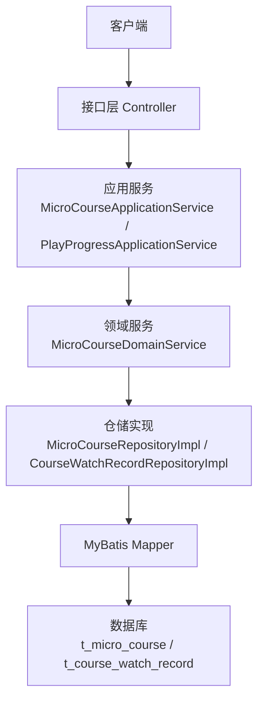
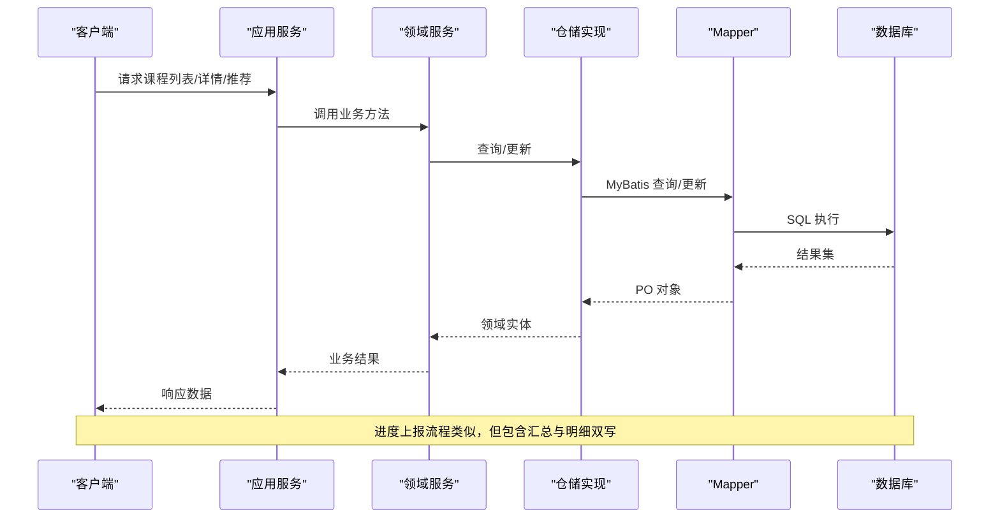
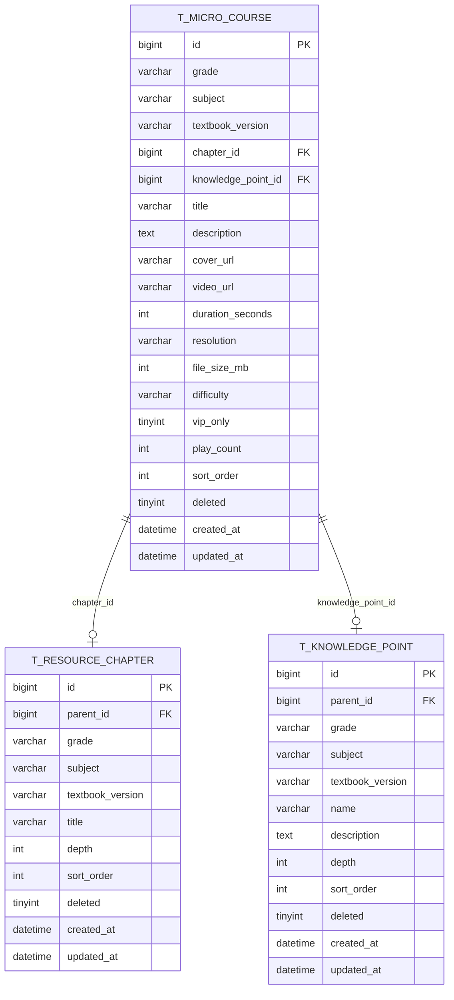
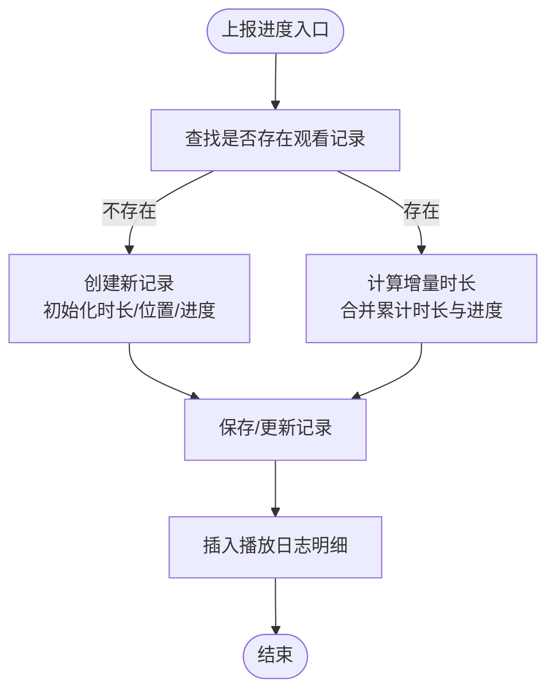
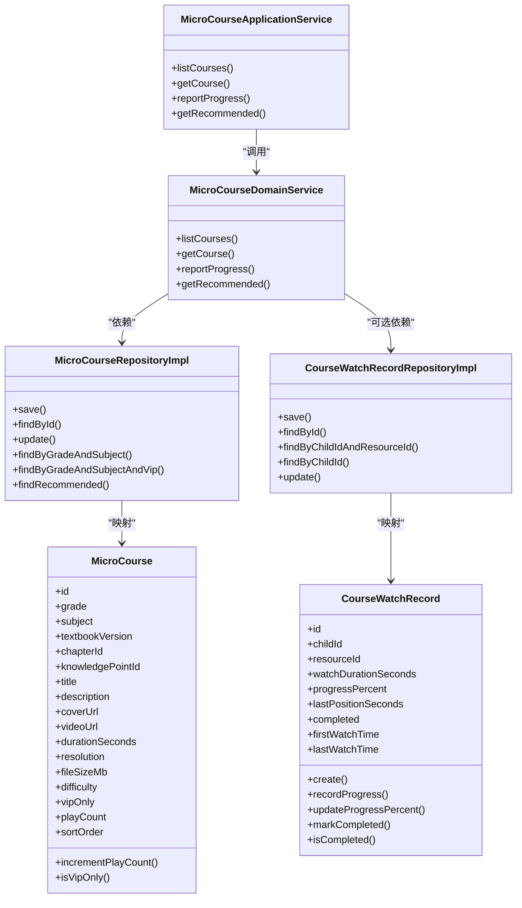

# 微课表设计

<cite>
**本文引用的文件**
- [t_micro_course.sql](file://wzoto-backend/sql/t_micro_course.sql)
- [t_course_watch_record.sql](file://wzoto-backend/sql/t_course_watch_record.sql)
- [MicroCourse.java](file://wzoto-backend/wzoto-domain/src/main/java/com/wzoto/domain/entity/MicroCourse.java)
- [CourseWatchRecord.java](file://wzoto-backend/wzoto-domain/src/main/java/com/wzoto/domain/entity/CourseWatchRecord.java)
- [MicroCourseApplicationService.java](file://wzoto-backend/wzoto-application/src/main/java/com/wzoto/application/service/MicroCourseApplicationService.java)
- [MicroCourseDomainService.java](file://wzoto-backend/wzoto-domain/src/main/java/com/wzoto/domain/service/MicroCourseDomainService.java)
- [MicroCourseRepositoryImpl.java](file://wzoto-backend/wzoto-infrastructure/src/main/java/com/wzoto/infrastructure/repository/MicroCourseRepositoryImpl.java)
- [MicroCourseMapper.java](file://wzoto-backend/wzoto-infrastructure/src/main/java/com/wzoto/infrastructure/mapper/MicroCourseMapper.java)
- [PlayProgressApplicationService.java](file://wzoto-backend/wzoto-application/src/main/java/com/wzoto/application/service/PlayProgressApplicationService.java)
- [CourseWatchRecordRepositoryImpl.java](file://wzoto-backend/wzoto-infrastructure/src/main/java/com/wzoto/infrastructure/repository/CourseWatchRecordRepositoryImpl.java)
- [t_knowledge_point.sql](file://wzoto-backend/sql/t_knowledge_point.sql)
- [t_resource_chapter.sql](file://wzoto-backend/sql/t_resource_chapter.sql)
- [seed_data_micro_course.sql](file://wzoto-backend/sql/seed_data_micro_course.sql)
</cite>

## 目录
1. [简介](#简介)
2. [项目结构](#项目结构)
3. [核心组件](#核心组件)
4. [架构总览](#架构总览)
5. [详细组件分析](#详细组件分析)
6. [依赖关系分析](#依赖关系分析)
7. [性能考虑](#性能考虑)
8. [故障排查指南](#故障排查指南)
9. [结论](#结论)
10. [附录](#附录)

## 简介
本文件围绕“微课表 t_micro_course”及其相关能力，系统化说明课程结构设计、播放进度跟踪、元数据管理、状态与权限控制、知识点关联、资源管理、性能优化与数据完整性保障。目标读者既包括后端开发者，也包括产品与运营人员，帮助快速理解并正确使用该模块。

## 项目结构
本模块采用分层架构：接口层（Controller）→ 应用服务（Application Service）→ 领域服务（Domain Service）→ 仓储实现（Repository Impl）→ 持久化（Mapper/SQL）。微课与观看记录分别由独立实体与仓储管理，并通过领域服务编排业务规则。

图表来源
- [MicroCourseApplicationService.java:21-37](file://wzoto-backend/wzoto-application/src/main/java/com/wzoto/application/service/MicroCourseApplicationService.java#L21-L37)
- [MicroCourseDomainService.java:25-68](file://wzoto-backend/wzoto-domain/src/main/java/com/wzoto/domain/service/MicroCourseDomainService.java#L25-L68)
- [MicroCourseRepositoryImpl.java:24-73](file://wzoto-backend/wzoto-infrastructure/src/main/java/com/wzoto/infrastructure/repository/MicroCourseRepositoryImpl.java#L24-L73)
- [CourseWatchRecordRepositoryImpl.java:23-59](file://wzoto-backend/wzoto-infrastructure/src/main/java/com/wzoto/infrastructure/repository/CourseWatchRecordRepositoryImpl.java#L23-L59)

章节来源
- [MicroCourseApplicationService.java:21-37](file://wzoto-backend/wzoto-application/src/main/java/com/wzoto/application/service/MicroCourseApplicationService.java#L21-L37)
- [MicroCourseDomainService.java:25-68](file://wzoto-backend/wzoto-domain/src/main/java/com/wzoto/domain/service/MicroCourseDomainService.java#L25-L68)

## 核心组件
- 微课实体 MicroCourse：承载课程标题、描述、封面、视频链接、时长、难度、是否会员专享、播放次数、排序等元数据，并提供播放计数自增等方法。
- 观看记录实体 CourseWatchRecord：维护子女ID、资源ID、累计观看时长、进度百分比、最后播放位置、完成状态及时间戳，提供创建、记录进度、更新进度百分比、标记完成等行为。
- 应用服务：
  - MicroCourseApplicationService：对外暴露课程列表、详情、上报进度、推荐等能力。
  - PlayProgressApplicationService：负责断点续播、进度汇总与明细日志写入。
- 领域服务：MicroCourseDomainService：封装课程查询、权限校验、推荐逻辑与播放次数上报。
- 仓储实现：
  - MicroCourseRepositoryImpl：按年级、学科、VIP筛选、推荐（按播放量排序）等查询。
  - CourseWatchRecordRepositoryImpl：按子女+资源唯一查询、更新、列表查询等。

章节来源
- [MicroCourse.java:20-51](file://wzoto-backend/wzoto-domain/src/main/java/com/wzoto/domain/entity/MicroCourse.java#L20-L51)
- [CourseWatchRecord.java:18-119](file://wzoto-backend/wzoto-domain/src/main/java/com/wzoto/domain/entity/CourseWatchRecord.java#L18-L119)
- [MicroCourseApplicationService.java:21-37](file://wzoto-backend/wzoto-application/src/main/java/com/wzoto/application/service/MicroCourseApplicationService.java#L21-L37)
- [PlayProgressApplicationService.java:32-74](file://wzoto-backend/wzoto-application/src/main/java/com/wzoto/application/service/PlayProgressApplicationService.java#L32-L74)
- [MicroCourseDomainService.java:25-68](file://wzoto-backend/wzoto-domain/src/main/java/com/wzoto/domain/service/MicroCourseDomainService.java#L25-L68)
- [MicroCourseRepositoryImpl.java:24-73](file://wzoto-backend/wzoto-infrastructure/src/main/java/com/wzoto/infrastructure/repository/MicroCourseRepositoryImpl.java#L24-L73)
- [CourseWatchRecordRepositoryImpl.java:23-59](file://wzoto-backend/wzoto-infrastructure/src/main/java/com/wzoto/infrastructure/repository/CourseWatchRecordRepositoryImpl.java#L23-L59)

## 架构总览
下图展示从前端到数据库的完整调用链，涵盖课程列表、详情、进度上报与断点续播。

图表来源
- [MicroCourseApplicationService.java:21-37](file://wzoto-backend/wzoto-application/src/main/java/com/wzoto/application/service/MicroCourseApplicationService.java#L21-L37)
- [MicroCourseDomainService.java:25-68](file://wzoto-backend/wzoto-domain/src/main/java/com/wzoto/domain/service/MicroCourseDomainService.java#L25-L68)
- [MicroCourseRepositoryImpl.java:24-73](file://wzoto-backend/wzoto-infrastructure/src/main/java/com/wzoto/infrastructure/repository/MicroCourseRepositoryImpl.java#L24-L73)
- [CourseWatchRecordRepositoryImpl.java:23-59](file://wzoto-backend/wzoto-infrastructure/src/main/java/com/wzoto/infrastructure/repository/CourseWatchRecordRepositoryImpl.java#L23-L59)

## 详细组件分析

### 课程结构设计：层级、章节、课时
- 课程层级关系
  - 通过 grade（年级）、subject（学科）、textbook_version（教材版本）进行多维组织。
  - chapter_id 指向教材章节树（t_resource_chapter），knowledge_point_id 指向知识点树（t_knowledge_point），形成“课程—章节—知识点”的映射。
- 章节组织方式
  - t_resource_chapter 以 parent_id 自关联构建多级目录（册/单元/课/章），支持 depth 与 sort_order 控制层级与顺序。
- 课时安排逻辑
  - t_micro_course 中的 sort_order 决定同级课时排序；difficulty 标识难度；duration_seconds 表示课时长度；vip_only 控制访问范围。
  - 种子数据覆盖多年级、多学科，便于演示与测试。

图表来源
- [t_micro_course.sql:4-31](file://wzoto-backend/sql/t_micro_course.sql#L4-L31)
- [t_resource_chapter.sql:5-20](file://wzoto-backend/sql/t_resource_chapter.sql#L5-L20)
- [t_knowledge_point.sql:5-22](file://wzoto-backend/sql/t_knowledge_point.sql#L5-L22)

章节来源
- [t_micro_course.sql:4-31](file://wzoto-backend/sql/t_micro_course.sql#L4-L31)
- [t_resource_chapter.sql:5-20](file://wzoto-backend/sql/t_resource_chapter.sql#L5-L20)
- [t_knowledge_point.sql:5-22](file://wzoto-backend/sql/t_knowledge_point.sql#L5-L22)
- [seed_data_micro_course.sql:7-156](file://wzoto-backend/sql/seed_data_micro_course.sql#L7-L156)

### 播放进度跟踪：course_watch_record 关联与断点续播
- 关联设计
  - t_course_watch_record 通过 child_id 与 resource_id 建立“子女—资源”的一对一进度记录（唯一索引 uk_child_resource）。
  - 字段 watch_duration_seconds、progress_percent、last_position_seconds、completed 共同构成进度快照。
- 学习进度持久化机制
  - PlayProgressApplicationService.reportProgress 在每次上报时：
    - 若不存在记录则新建并初始化；若存在则计算增量时长并合并进度。
    - 同时插入播放日志明细（会话级），用于分析与审计。
- 断点续播实现
  - 获取断点：getProgress(childId, resourceId) 返回最近一次记录的 last_position_seconds。
  - 前端据此定位播放起点，实现无缝续播体验。
- 完成判定
  - 领域实体中 progress_percent >= 90 即视为完成，或显式 markCompleted 将进度置为 100%。

图表来源
- [PlayProgressApplicationService.java:32-66](file://wzoto-backend/wzoto-application/src/main/java/com/wzoto/application/service/PlayProgressApplicationService.java#L32-L66)
- [CourseWatchRecord.java:61-119](file://wzoto-backend/wzoto-domain/src/main/java/com/wzoto/domain/entity/CourseWatchRecord.java#L61-L119)
- [CourseWatchRecordRepositoryImpl.java:37-59](file://wzoto-backend/wzoto-infrastructure/src/main/java/com/wzoto/infrastructure/repository/CourseWatchRecordRepositoryImpl.java#L37-L59)

章节来源
- [t_course_watch_record.sql:4-20](file://wzoto-backend/sql/t_course_watch_record.sql#L4-L20)
- [PlayProgressApplicationService.java:32-74](file://wzoto-backend/wzoto-application/src/main/java/com/wzoto/application/service/PlayProgressApplicationService.java#L32-L74)
- [CourseWatchRecord.java:61-119](file://wzoto-backend/wzoto-domain/src/main/java/com/wzoto/domain/entity/CourseWatchRecord.java#L61-L119)

### 课程元数据管理：标题、描述、封面、标签等
- 基本信息存储
  - title、description、cover_url、video_url、resolution、file_size_mb、duration_seconds 等字段完整描述课程元数据。
  - grade、subject、textbook_version、difficulty、sort_order 用于分类与排序。
  - vip_only 控制是否为会员专属内容。
- 扩展建议
  - 可结合标签体系（如 tags JSON 或关联表）增强检索与推荐维度。
  - 可通过 thumbnail_url 与 cover_url 分离缩略图与封面图，提升加载性能。

章节来源
- [t_micro_course.sql:4-31](file://wzoto-backend/sql/t_micro_course.sql#L4-L31)
- [MicroCourse.java:20-51](file://wzoto-backend/wzoto-domain/src/main/java/com/wzoto/domain/entity/MicroCourse.java#L20-L51)

### 课程状态管理与发布流程、审核机制、版本控制
- 当前实现
  - 使用 deleted 软删除标志；未看到显式的发布/审核状态字段。
  - 播放次数 play_count 作为热度指标，可用于推荐与榜单。
- 建议方案
  - 增加 status 枚举（草稿/待审/已发布/已下架）与 audit_by/audit_time 字段，完善发布与审核流。
  - 引入 version 或 revision 字段，配合变更日志，支持内容回滚与对比。
  - 对敏感字段（如视频URL）变更增加审批流与操作审计。

章节来源
- [t_micro_course.sql:4-31](file://wzoto-backend/sql/t_micro_course.sql#L4-L31)
- [MicroCourse.java:20-51](file://wzoto-backend/wzoto-domain/src/main/java/com/wzoto/domain/entity/MicroCourse.java#L20-L51)

### 课程与知识点的关联：映射、学习路径、个性化推荐
- 映射关系
  - t_micro_course.knowledge_point_id 直接关联知识点树节点，便于按知识点聚合课程。
  - t_micro_course.chapter_id 关联教材章节树，支撑按章节导航。
- 学习路径规划
  - 基于知识点树的 parent_id 与 depth，可生成自上而下的学习路径（册→单元→章→节→知识点）。
  - 结合学生掌握度（可另建掌握度表）动态调整路径。
- 个性化推荐算法
  - 当前推荐按 grade + subject + play_count 降序，简单有效。
  - 可扩展为协同过滤或基于内容的推荐（结合难度、知识点、历史观看行为）。

章节来源
- [t_micro_course.sql:4-31](file://wzoto-backend/sql/t_micro_course.sql#L4-L31)
- [t_knowledge_point.sql:5-22](file://wzoto-backend/sql/t_knowledge_point.sql#L5-L22)
- [MicroCourseRepositoryImpl.java:65-73](file://wzoto-backend/wzoto-infrastructure/src/main/java/com/wzoto/infrastructure/repository/MicroCourseRepositoryImpl.java#L65-L73)
- [MicroCourseDomainService.java:58-68](file://wzoto-backend/wzoto-domain/src/main/java/com/wzoto/domain/service/MicroCourseDomainService.java#L58-L68)

### 课程资源管理：视频、课件、练习题集成
- 视频资源
  - video_url 存储播放地址；duration_seconds、resolution、file_size_mb 辅助播放器与CDN策略。
- 课件附件
  - 可在 t_micro_course 扩展 attachment_url 或新增资源子表，支持 PDF/PPT 等多格式。
- 练习题集成
  - 可建立 exercise_id 或练习集合字段，或在知识点维度统一挂载练习，形成“学-练-测”闭环。

章节来源
- [t_micro_course.sql:4-31](file://wzoto-backend/sql/t_micro_course.sql#L4-L31)

### 课程权限控制：免费与付费、会员专属
- 当前实现
  - vip_only 字段区分免费与会员专属；查询时可按 vipOnly 过滤。
- 访问控制建议
  - 在应用层结合用户会员状态进行鉴权，拒绝非会员访问 VIP 课程。
  - 对视频直链增加签名或鉴权参数，防止盗链。

章节来源
- [t_micro_course.sql:4-31](file://wzoto-backend/sql/t_micro_course.sql#L4-L31)
- [MicroCourseRepositoryImpl.java:55-63](file://wzoto-backend/wzoto-infrastructure/src/main/java/com/wzoto/infrastructure/repository/MicroCourseRepositoryImpl.java#L55-L63)

## 依赖关系分析
- 耦合与内聚
  - 领域实体高内聚：MicroCourse、CourseWatchRecord 各自封装业务规则。
  - 应用服务编排清晰：MicroCourseApplicationService 与 PlayProgressApplicationService 职责明确。
  - 仓储实现解耦数据库细节：通过 PO/Entity 转换屏蔽底层差异。
- 外部依赖
  - MyBatis Plus 简化 CRUD；LambdaQueryWrapper 构建条件查询。
  - 数据库索引优化查询性能（年级+学科、章节、知识点、VIP、难度等）。

图表来源
- [MicroCourse.java:20-51](file://wzoto-backend/wzoto-domain/src/main/java/com/wzoto/domain/entity/MicroCourse.java#L20-L51)
- [CourseWatchRecord.java:18-119](file://wzoto-backend/wzoto-domain/src/main/java/com/wzoto/domain/entity/CourseWatchRecord.java#L18-L119)
- [MicroCourseApplicationService.java:21-37](file://wzoto-backend/wzoto-application/src/main/java/com/wzoto/application/service/MicroCourseApplicationService.java#L21-L37)
- [MicroCourseDomainService.java:25-68](file://wzoto-backend/wzoto-domain/src/main/java/com/wzoto/domain/service/MicroCourseDomainService.java#L25-L68)
- [MicroCourseRepositoryImpl.java:24-73](file://wzoto-backend/wzoto-infrastructure/src/main/java/com/wzoto/infrastructure/repository/MicroCourseRepositoryImpl.java#L24-L73)
- [CourseWatchRecordRepositoryImpl.java:23-59](file://wzoto-backend/wzoto-infrastructure/src/main/java/com/wzoto/infrastructure/repository/CourseWatchRecordRepositoryImpl.java#L23-L59)

章节来源
- [MicroCourseRepositoryImpl.java:24-73](file://wzoto-backend/wzoto-infrastructure/src/main/java/com/wzoto/infrastructure/repository/MicroCourseRepositoryImpl.java#L24-L73)
- [CourseWatchRecordRepositoryImpl.java:23-59](file://wzoto-backend/wzoto-infrastructure/src/main/java/com/wzoto/infrastructure/repository/CourseWatchRecordRepositoryImpl.java#L23-L59)

## 性能考虑
- 课程列表查询优化
  - 利用复合索引 idx_grade_subject、idx_textbook_version、idx_vip_only、idx_difficulty 加速筛选。
  - 使用 sortOrder 与 createdAt 排序，避免全表扫描。
- 热门课程缓存策略
  - 对 getRecommended 结果进行 Redis 缓存，键可按 grade+subject 划分，设置合理过期时间。
  - 播放次数更新后失效或延迟刷新缓存，避免频繁写放大。
- 并发访问处理
  - 上报进度采用“先查后更”，在高并发下可能产生竞态；建议使用行级锁或原子更新（如基于 last_position_seconds 的版本号）。
  - 播放日志明细可异步落库（消息队列削峰），降低主链路压力。
- 大数据量优化
  - 对 t_course_watch_record 定期归档历史明细至冷存储，保留近 N 天热数据。
  - 对 t_micro_course 的 cover_url/video_url 使用 CDN 与分片传输，减轻源站压力。

[本节为通用性能建议，不直接分析具体文件]

## 故障排查指南
- 常见问题定位
  - 进度不更新：检查 findByChildIdAndResourceId 是否能查到记录；确认 recordProgress 与 updateProgressPercent 的参数合法性。
  - 断点续播异常：核对 last_position_seconds 与视频时长；确保前端传参 currentTime/duration/percent 一致。
  - 推荐不准：检查 play_count 是否递增；确认 findRecommended 的排序与限制条件。
- 日志与监控
  - 关注播放日志明细（会话级）与汇总记录的一致性。
  - 对异常抛出（非法参数、越界进度）进行告警与埋点。
- 数据一致性
  - 汇总记录与明细日志应成对出现；必要时提供补偿任务修复不一致。

章节来源
- [PlayProgressApplicationService.java:32-74](file://wzoto-backend/wzoto-application/src/main/java/com/wzoto/application/service/PlayProgressApplicationService.java#L32-L74)
- [CourseWatchRecord.java:79-119](file://wzoto-backend/wzoto-domain/src/main/java/com/wzoto/domain/entity/CourseWatchRecord.java#L79-L119)

## 结论
本模块以清晰的领域模型与分层架构实现了微课课程的元数据管理、章节与知识点关联、播放进度跟踪与断点续播、以及基础的权限控制与推荐能力。建议在后续迭代中补充发布审核流程、版本控制、标签体系与更丰富的推荐算法，并持续优化并发与缓存策略，以提升用户体验与系统稳定性。

## 附录
- 关键表结构参考
  - t_micro_course：微课视频主表，含年级、学科、教材版本、章节与知识点关联、元数据、VIP 控制、播放统计等。
  - t_course_watch_record：观看记录表，维护累计时长、进度百分比、最后位置、完成状态与时间戳。
  - t_resource_chapter：教材章节目录树，支持多级结构与排序。
  - t_knowledge_point：知识点树，支持多级结构与排序。
- 示例数据
  - seed_data_micro_course.sql 提供多年级、多学科的课程样例，便于本地调试与演示。

章节来源
- [t_micro_course.sql:4-31](file://wzoto-backend/sql/t_micro_course.sql#L4-L31)
- [t_course_watch_record.sql:4-20](file://wzoto-backend/sql/t_course_watch_record.sql#L4-L20)
- [t_resource_chapter.sql:5-20](file://wzoto-backend/sql/t_resource_chapter.sql#L5-L20)
- [t_knowledge_point.sql:5-22](file://wzoto-backend/sql/t_knowledge_point.sql#L5-L22)
- [seed_data_micro_course.sql:7-156](file://wzoto-backend/sql/seed_data_micro_course.sql#L7-L156)