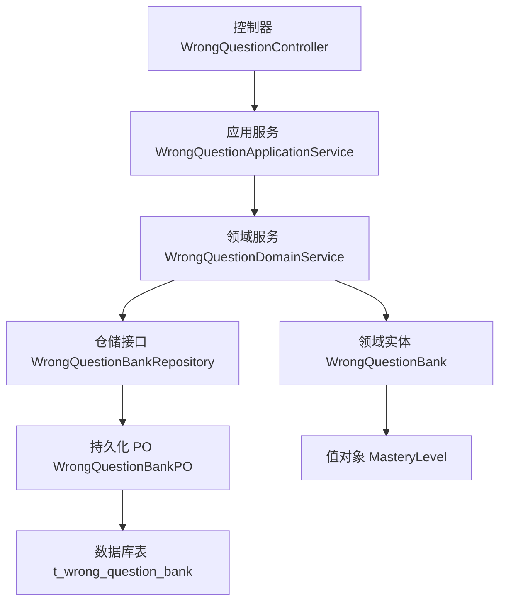
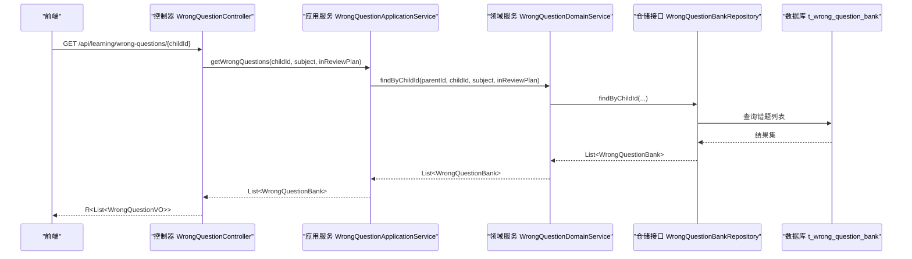
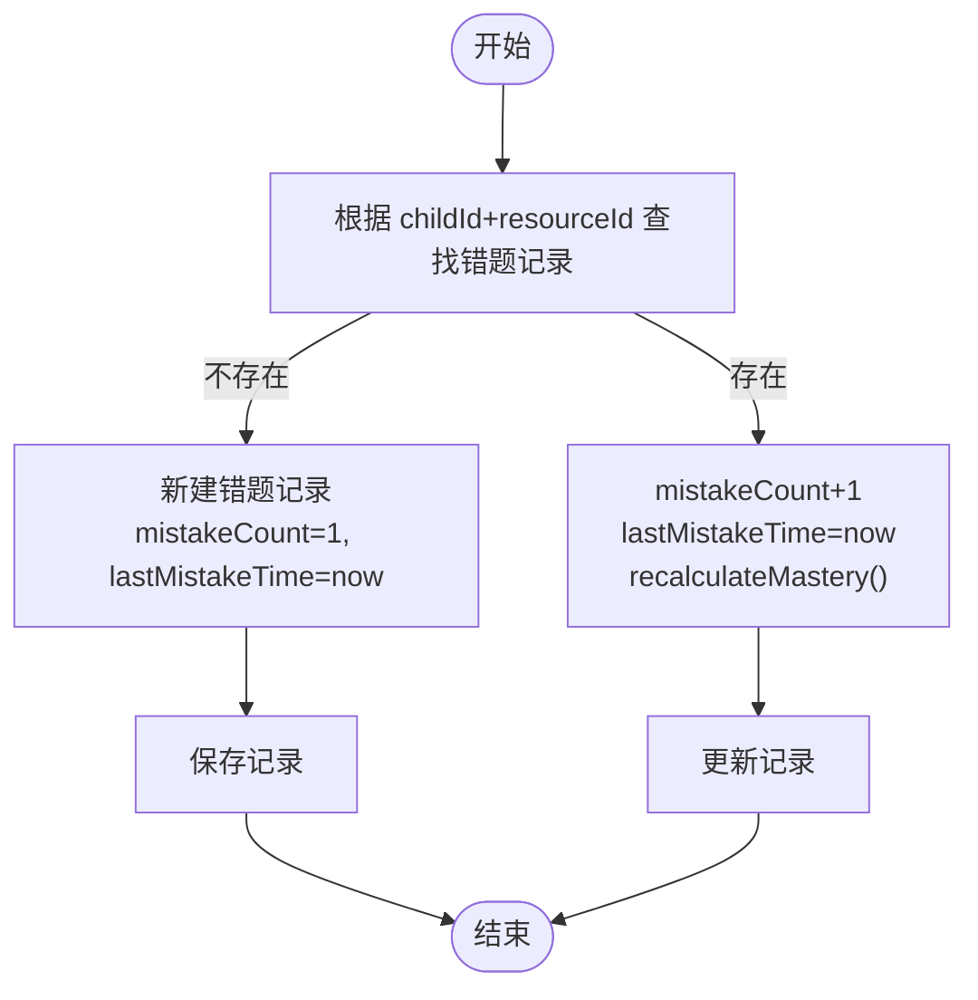
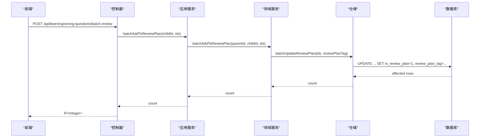
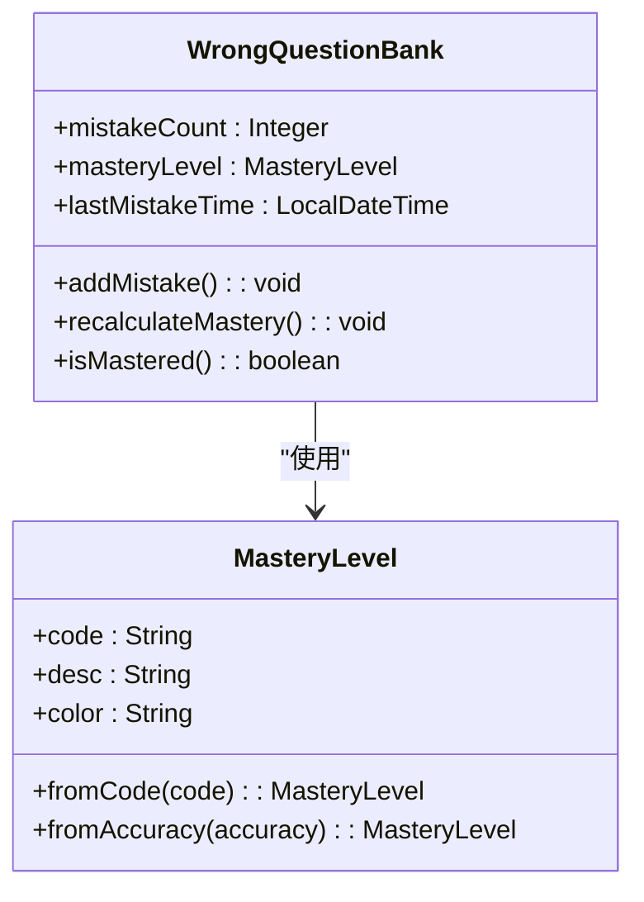
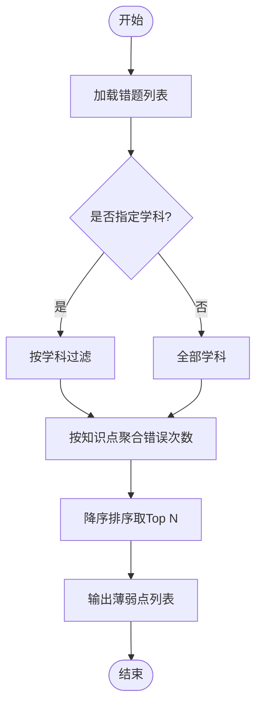
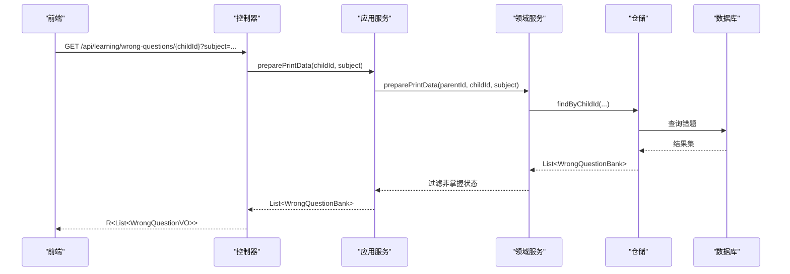
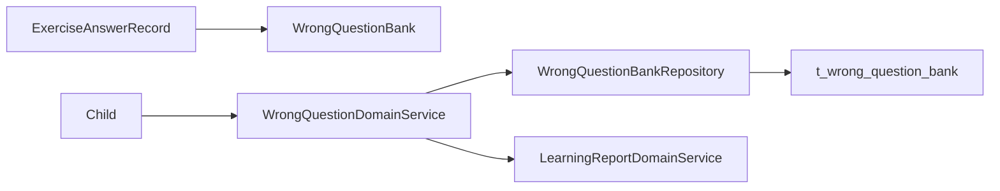

# 错题本表设计

<cite>
**本文引用的文件**
- [t_wrong_question_bank.sql](file://wzoto-backend/sql/t_wrong_question_bank.sql)
- [WrongQuestionBank.java](file://wzoto-backend/wzoto-domain/src/main/java/com/wzoto/domain/entity/WrongQuestionBank.java)
- [MasteryLevel.java](file://wzoto-backend/wzoto-domain/src/main/java/com/wzoto/domain/valobj/MasteryLevel.java)
- [WrongQuestionApplicationService.java](file://wzoto-backend/wzoto-application/src/main/java/com/wzoto/application/service/WrongQuestionApplicationService.java)
- [WrongQuestionDomainService.java](file://wzoto-backend/wzoto-domain/src/main/java/com/wzoto/domain/service/WrongQuestionDomainService.java)
- [WrongQuestionBankRepository.java](file://wzoto-backend/wzoto-domain/src/main/java/com/wzoto/domain/repository/WrongQuestionBankRepository.java)
- [WrongQuestionBankMapper.java](file://wzoto-backend/wzoto-infrastructure/src/main/java/com/wzoto/infrastructure/mapper/WrongQuestionBankMapper.java)
- [WrongQuestionBankPO.java](file://wzoto-backend/wzoto-infrastructure/src/main/java/com/wzoto/infrastructure/pojo/WrongQuestionBankPO.java)
- [WrongQuestionController.java](file://wzoto-backend/wzoto-interfaces/src/main/java/com/wzoto/interfaces/controller/WrongQuestionController.java)
- [WrongQuestionVO.java](file://wzoto-backend/wzoto-interfaces/src/main/java/com/wzoto/interfaces/vo/learning/WrongQuestionVO.java)
- [ExerciseAnswerRecord.java](file://wzoto-backend/wzoto-domain/src/main/java/com/wzoto/domain/entity/ExerciseAnswerRecord.java)
- [LearningReportDomainService.java](file://wzoto-backend/wzoto-domain/src/main/java/com/wzoto/domain/service/LearningReportDomainService.java)
</cite>

## 目录
1. [简介](#简介)
2. [项目结构](#项目结构)
3. [核心组件](#核心组件)
4. [架构总览](#架构总览)
5. [详细组件分析](#详细组件分析)
6. [依赖关系分析](#依赖关系分析)
7. [性能考虑](#性能考虑)
8. [故障排查指南](#故障排查指南)
9. [结论](#结论)
10. [附录](#附录)

## 简介
本文件围绕错题本表 t_wrong_question_bank 的设计与实现，系统化说明错误记录机制、复习策略、掌握度评估、统计分析、去重机制、导出功能、与练习系统集成、数据同步与隐私合规、以及性能优化方案。目标是帮助开发者与产品人员快速理解并正确使用错题本能力。

## 项目结构
错题本相关代码采用分层架构：接口层（Controller）→ 应用服务（Application Service）→ 领域服务（Domain Service）→ 仓储接口（Repository）→ 基础设施实现（Mapper/PO）。数据库表定义位于 SQL 脚本中，领域实体封装业务规则，值对象统一枚举类型。

图表来源
- [WrongQuestionController.java:1-71](file://wzoto-backend/wzoto-interfaces/src/main/java/com/wzoto/interfaces/controller/WrongQuestionController.java#L1-L71)
- [WrongQuestionApplicationService.java:1-45](file://wzoto-backend/wzoto-application/src/main/java/com/wzoto/application/service/WrongQuestionApplicationService.java#L1-L45)
- [WrongQuestionDomainService.java:1-101](file://wzoto-backend/wzoto-domain/src/main/java/com/wzoto/domain/service/WrongQuestionDomainService.java#L1-L101)
- [WrongQuestionBankRepository.java:1-28](file://wzoto-backend/wzoto-domain/src/main/java/com/wzoto/domain/repository/WrongQuestionBankRepository.java#L1-L28)
- [WrongQuestionBankPO.java:1-45](file://wzoto-backend/wzoto-infrastructure/src/main/java/com/wzoto/infrastructure/pojo/WrongQuestionBankPO.java#L1-L45)
- [t_wrong_question_bank.sql:1-28](file://wzoto-backend/sql/t_wrong_question_bank.sql#L1-L28)
- [WrongQuestionBank.java:1-133](file://wzoto-backend/wzoto-domain/src/main/java/com/wzoto/domain/entity/WrongQuestionBank.java#L1-L133)
- [MasteryLevel.java:1-48](file://wzoto-backend/wzoto-domain/src/main/java/com/wzoto/domain/valobj/MasteryLevel.java#L1-L48)

章节来源
- [t_wrong_question_bank.sql:1-28](file://wzoto-backend/sql/t_wrong_question_bank.sql#L1-L28)
- [WrongQuestionBank.java:1-133](file://wzoto-backend/wzoto-domain/src/main/java/com/wzoto/domain/entity/WrongQuestionBank.java#L1-L133)
- [WrongQuestionDomainService.java:1-101](file://wzoto-backend/wzoto-domain/src/main/java/com/wzoto/domain/service/WrongQuestionDomainService.java#L1-L101)

## 核心组件
- 数据库表 t_wrong_question_bank：存储子女维度下的错题记录，包含学科、知识点、错误次数、掌握度、是否加入复习计划、最近错误时间等字段，并提供多维度索引以支撑查询与统计。
- 领域实体 WrongQuestionBank：封装错题的业务行为，如创建、增加错误、标记掌握、加入/移除复习计划、重新计算掌握度等。
- 值对象 MasteryLevel：定义掌握度枚举（未掌握/一般/熟练），支持按正确率换算。
- 应用服务 WrongQuestionApplicationService：对外提供错题列表、批量加入复习计划、标记掌握、准备打印数据等用例。
- 领域服务 WrongQuestionDomainService：实现跨实体的业务编排，如查询、权限校验、批量更新、错题记录同步、打印数据准备等。
- 仓储接口与实现：定义 CRUD 与批量操作，基础设施层通过 MyBatis-Plus Mapper 执行 SQL。
- 控制器与 VO：暴露 REST 接口，返回前端所需视图对象。

章节来源
- [WrongQuestionBank.java:1-133](file://wzoto-backend/wzoto-domain/src/main/java/com/wzoto/domain/entity/WrongQuestionBank.java#L1-L133)
- [MasteryLevel.java:1-48](file://wzoto-backend/wzoto-domain/src/main/java/com/wzoto/domain/valobj/MasteryLevel.java#L1-L48)
- [WrongQuestionApplicationService.java:1-45](file://wzoto-backend/wzoto-application/src/main/java/com/wzoto/application/service/WrongQuestionApplicationService.java#L1-L45)
- [WrongQuestionDomainService.java:1-101](file://wzoto-backend/wzoto-domain/src/main/java/com/wzoto/domain/service/WrongQuestionDomainService.java#L1-L101)
- [WrongQuestionBankRepository.java:1-28](file://wzoto-backend/wzoto-domain/src/main/java/com/wzoto/domain/repository/WrongQuestionBankRepository.java#L1-L28)
- [WrongQuestionBankMapper.java:1-21](file://wzoto-backend/wzoto-infrastructure/src/main/java/com/wzoto/infrastructure/mapper/WrongQuestionBankMapper.java#L1-L21)
- [WrongQuestionBankPO.java:1-45](file://wzoto-backend/wzoto-infrastructure/src/main/java/com/wzoto/infrastructure/pojo/WrongQuestionBankPO.java#L1-L45)
- [WrongQuestionController.java:1-71](file://wzoto-backend/wzoto-interfaces/src/main/java/com/wzoto/interfaces/controller/WrongQuestionController.java#L1-L71)
- [WrongQuestionVO.java:1-25](file://wzoto-backend/wzoto-interfaces/src/main/java/com/wzoto/interfaces/vo/learning/WrongQuestionVO.java#L1-L25)

## 架构总览
错题本在系统中的调用链如下：前端请求进入控制器，应用服务进行参数处理与上下文获取，领域服务完成权限校验与业务编排，仓储层访问数据库，最终返回结果。

图表来源
- [WrongQuestionController.java:26-33](file://wzoto-backend/wzoto-interfaces/src/main/java/com/wzoto/interfaces/controller/WrongQuestionController.java#L26-L33)
- [WrongQuestionApplicationService.java:23-26](file://wzoto-backend/wzoto-application/src/main/java/com/wzoto/application/service/WrongQuestionApplicationService.java#L23-L26)
- [WrongQuestionDomainService.java:28-40](file://wzoto-backend/wzoto-domain/src/main/java/com/wzoto/domain/service/WrongQuestionDomainService.java#L28-L40)
- [WrongQuestionBankRepository.java:18-20](file://wzoto-backend/wzoto-domain/src/main/java/com/wzoto/domain/repository/WrongQuestionBankRepository.java#L18-L20)
- [t_wrong_question_bank.sql:1-28](file://wzoto-backend/sql/t_wrong_question_bank.sql#L1-L28)

## 详细组件分析

### 错误记录机制
- 触发时机：当练习作答记录判定为错误时，系统应调用领域服务的记录方法，将错题写入或累计到错题库。
- 去重合并：根据 childId + resourceId 判断是否存在已有错题；若存在则增加错误次数并更新时间戳，否则新建记录。
- 时间戳：每次错误都会更新最近错误时间，便于后续复习调度与趋势分析。
- 关联信息：记录学科与知识点，便于后续统计薄弱点与个性化推荐。

图表来源
- [WrongQuestionDomainService.java:82-92](file://wzoto-backend/wzoto-domain/src/main/java/com/wzoto/domain/service/WrongQuestionDomainService.java#L82-L92)
- [WrongQuestionBank.java:65-87](file://wzoto-backend/wzoto-domain/src/main/java/com/wzoto/domain/entity/WrongQuestionBank.java#L65-L87)

章节来源
- [WrongQuestionDomainService.java:82-92](file://wzoto-backend/wzoto-domain/src/main/java/com/wzoto/domain/service/WrongQuestionDomainService.java#L82-L92)
- [WrongQuestionBank.java:65-87](file://wzoto-backend/wzoto-domain/src/main/java/com/wzoto/domain/entity/WrongQuestionBank.java#L65-L87)
- [ExerciseAnswerRecord.java:64-80](file://wzoto-backend/wzoto-domain/src/main/java/com/wzoto/domain/entity/ExerciseAnswerRecord.java#L64-L80)

### 复习策略设计
- 加入复习计划：支持批量将错题加入复习计划，并为每条记录打上复习计划标签（基于日期生成），便于后续调度。
- 间隔算法：当前实现使用“计划标签”作为分组标识，具体间隔策略可在上层调度器中扩展（例如结合艾宾浩斯曲线与最近错误时间）。
- 个性化计划：可通过学科、知识点、掌握度筛选待复习题目，形成个性化清单。

图表来源
- [WrongQuestionController.java:35-45](file://wzoto-backend/wzoto-interfaces/src/main/java/com/wzoto/interfaces/controller/WrongQuestionController.java#L35-L45)
- [WrongQuestionApplicationService.java:28-32](file://wzoto-backend/wzoto-application/src/main/java/com/wzoto/application/service/WrongQuestionApplicationService.java#L28-L32)
- [WrongQuestionDomainService.java:45-54](file://wzoto-backend/wzoto-domain/src/main/java/com/wzoto/domain/service/WrongQuestionDomainService.java#L45-L54)
- [WrongQuestionBankMapper.java:17-19](file://wzoto-backend/wzoto-infrastructure/src/main/java/com/wzoto/infrastructure/mapper/WrongQuestionBankMapper.java#L17-L19)

章节来源
- [WrongQuestionDomainService.java:45-54](file://wzoto-backend/wzoto-domain/src/main/java/com/wzoto/domain/service/WrongQuestionDomainService.java#L45-L54)
- [WrongQuestionBankMapper.java:17-19](file://wzoto-backend/wzoto-infrastructure/src/main/java/com/wzoto/infrastructure/mapper/WrongQuestionBankMapper.java#L17-L19)

### 掌握程度评估
- 枚举定义：掌握度分为未掌握、一般、熟练，并附带颜色标识用于前端展示。
- 计算方法：
  - 基于错误次数：错误次数≥3为未掌握，≥1为一般，0为熟练。
  - 基于正确率：≥0.85为熟练，≥0.60为一般，否则未掌握。
- 能力趋势：通过 lastMistakeTime 与 mistakeCount 的变化可观察掌握度演进，配合报告模块进行趋势分析。

图表来源
- [MasteryLevel.java:10-47](file://wzoto-backend/wzoto-domain/src/main/java/com/wzoto/domain/valobj/MasteryLevel.java#L10-L47)
- [WrongQuestionBank.java:36-131](file://wzoto-backend/wzoto-domain/src/main/java/com/wzoto/domain/entity/WrongQuestionBank.java#L36-L131)

章节来源
- [MasteryLevel.java:10-47](file://wzoto-backend/wzoto-domain/src/main/java/com/wzoto/domain/valobj/MasteryLevel.java#L10-L47)
- [WrongQuestionBank.java:115-131](file://wzoto-backend/wzoto-domain/src/main/java/com/wzoto/domain/entity/WrongQuestionBank.java#L115-L131)

### 错题统计分析
- 错误率统计：结合练习作答记录与错题记录，可计算各知识点错误率。
- 薄弱点识别：按知识点聚合错误次数，排序输出 Top N 薄弱点。
- 学习进步追踪：通过掌握度变化与最近错误时间推移，评估学习成效。

图表来源
- [LearningReportDomainService.java:107-124](file://wzoto-backend/wzoto-domain/src/main/java/com/wzoto/domain/service/LearningReportDomainService.java#L107-L124)

章节来源
- [LearningReportDomainService.java:107-124](file://wzoto-backend/wzoto-domain/src/main/java/com/wzoto/domain/service/LearningReportDomainService.java#L107-L124)

### 错题去重机制
- 合并策略：以 childId + resourceId 作为唯一键，避免重复条目。
- 重复错误识别：同一题目的多次错误会累加 mistakeCount，并更新 lastMistakeTime。
- 精简算法：可将已掌握（PROFICIENT）的错题从复习计划中移除，减少干扰。

章节来源
- [WrongQuestionDomainService.java:82-92](file://wzoto-backend/wzoto-domain/src/main/java/com/wzoto/domain/service/WrongQuestionDomainService.java#L82-L92)
- [WrongQuestionBank.java:83-87](file://wzoto-backend/wzoto-domain/src/main/java/com/wzoto/domain/entity/WrongQuestionBank.java#L83-L87)

### 错题导出功能
- 数据准备：支持按学科筛选非掌握状态的错题，用于打印或导出。
- 打印格式：后端提供结构化数据，前端可按模板渲染为 PDF/图片。
- 分享功能：可将导出的错题集打包分享（由前端或外部服务实现）。

图表来源
- [WrongQuestionController.java:26-33](file://wzoto-backend/wzoto-interfaces/src/main/java/com/wzoto/interfaces/controller/WrongQuestionController.java#L26-L33)
- [WrongQuestionApplicationService.java:40-43](file://wzoto-backend/wzoto-application/src/main/java/com/wzoto/application/service/WrongQuestionApplicationService.java#L40-L43)
- [WrongQuestionDomainService.java:72-77](file://wzoto-backend/wzoto-domain/src/main/java/com/wzoto/domain/service/WrongQuestionDomainService.java#L72-L77)

章节来源
- [WrongQuestionDomainService.java:72-77](file://wzoto-backend/wzoto-domain/src/main/java/com/wzoto/domain/service/WrongQuestionDomainService.java#L72-L77)
- [WrongQuestionVO.java:10-24](file://wzoto-backend/wzoto-interfaces/src/main/java/com/wzoto/interfaces/vo/learning/WrongQuestionVO.java#L10-L24)

### 与练习系统的集成
- 错题重做：基于错题记录中的 resourceId，可定向推送原题或变式题进行巩固练习。
- 针对性推荐：结合知识点与掌握度，优先推荐薄弱知识点的题目。
- 效果验证：通过再次作答的正确率与耗时，更新掌握度与趋势指标。

章节来源
- [ExerciseAnswerRecord.java:64-80](file://wzoto-backend/wzoto-domain/src/main/java/com/wzoto/domain/entity/ExerciseAnswerRecord.java#L64-L80)
- [WrongQuestionBank.java:83-87](file://wzoto-backend/wzoto-domain/src/main/java/com/wzoto/domain/entity/WrongQuestionBank.java#L83-L87)

### 数据同步机制
- 多设备同步：以 childId 为维度进行数据隔离与查询，确保不同设备登录同一家长账号后数据一致。
- 云端备份恢复：建议对 t_wrong_question_bank 及相关表定期备份，支持按时间段恢复。
- 数据迁移：新增字段或索引变更时，需编写迁移脚本并确保幂等性。

章节来源
- [t_wrong_question_bank.sql:1-28](file://wzoto-backend/sql/t_wrong_question_bank.sql#L1-L28)
- [WrongQuestionDomainService.java:28-40](file://wzoto-backend/wzoto-domain/src/main/java/com/wzoto/domain/service/WrongQuestionDomainService.java#L28-L40)

### 数据隐私保护与合规性
- 权限校验：所有操作均通过 parentId + childId 校验归属权，防止越权访问。
- 最小化采集：仅记录必要字段（学科、知识点、错误次数、时间戳等），不存储敏感个人信息。
- 审计日志：关键操作记录用户 ID 与操作内容，便于追溯。

章节来源
- [WrongQuestionDomainService.java:94-99](file://wzoto-backend/wzoto-domain/src/main/java/com/wzoto/domain/service/WrongQuestionDomainService.java#L94-L99)
- [WrongQuestionController.java:30-32](file://wzoto-backend/wzoto-interfaces/src/main/java/com/wzoto/interfaces/controller/WrongQuestionController.java#L30-L32)

## 依赖关系分析
错题本模块依赖练习作答记录、儿童档案、学习报告等模块，形成稳定的协作关系。

图表来源
- [ExerciseAnswerRecord.java:20-57](file://wzoto-backend/wzoto-domain/src/main/java/com/wzoto/domain/entity/ExerciseAnswerRecord.java#L20-L57)
- [WrongQuestionDomainService.java:1-101](file://wzoto-backend/wzoto-domain/src/main/java/com/wzoto/domain/service/WrongQuestionDomainService.java#L1-L101)
- [WrongQuestionBankRepository.java:1-28](file://wzoto-backend/wzoto-domain/src/main/java/com/wzoto/domain/repository/WrongQuestionBankRepository.java#L1-L28)
- [t_wrong_question_bank.sql:1-28](file://wzoto-backend/sql/t_wrong_question_bank.sql#L1-L28)
- [LearningReportDomainService.java:107-124](file://wzoto-backend/wzoto-domain/src/main/java/com/wzoto/domain/service/LearningReportDomainService.java#L107-L124)

章节来源
- [WrongQuestionDomainService.java:1-101](file://wzoto-backend/wzoto-domain/src/main/java/com/wzoto/domain/service/WrongQuestionDomainService.java#L1-L101)
- [LearningReportDomainService.java:107-124](file://wzoto-backend/wzoto-domain/src/main/java/com/wzoto/domain/service/LearningReportDomainService.java#L107-L124)

## 性能考虑
- 查询优化：利用 child_id、subject、knowledge_point、mastery_level、in_review_plan 等索引提升检索效率。
- 异步处理：统计计算与导出任务可异步化，避免阻塞主流程。
- 缓存策略：对高频查询（如某子女的错题列表）引入短期缓存，降低数据库压力。
- 批量操作：批量加入复习计划使用单条 SQL 更新，减少往返开销。

章节来源
- [t_wrong_question_bank.sql:21-26](file://wzoto-backend/sql/t_wrong_question_bank.sql#L21-L26)
- [WrongQuestionBankMapper.java:17-19](file://wzoto-backend/wzoto-infrastructure/src/main/java/com/wzoto/infrastructure/mapper/WrongQuestionBankMapper.java#L17-L19)

## 故障排查指南
- 无权操作异常：检查 parentId 与 childId 的归属关系是否正确。
- 记录不存在：确认传入的 wrongQuestionId 是否有效且未被删除。
- 批量更新失败：检查 ids 是否为空及 SQL 拼接是否正确。
- 数据不一致：核对 lastMistakeTime 与 mistakeCount 是否与作答记录一致。

章节来源
- [WrongQuestionDomainService.java:59-67](file://wzoto-backend/wzoto-domain/src/main/java/com/wzoto/domain/service/WrongQuestionDomainService.java#L59-L67)
- [WrongQuestionDomainService.java:94-99](file://wzoto-backend/wzoto-domain/src/main/java/com/wzoto/domain/service/WrongQuestionDomainService.java#L94-L99)
- [WrongQuestionBankMapper.java:17-19](file://wzoto-backend/wzoto-infrastructure/src/main/java/com/wzoto/infrastructure/mapper/WrongQuestionBankMapper.java#L17-L19)

## 结论
错题本表与配套服务实现了完整的错误记录、复习计划管理、掌握度评估与统计分析能力。通过清晰的层次划分与严格的权限校验，系统在可扩展性与安全性方面具备良好基础。未来可在复习间隔算法、个性化推荐与异步统计方面持续优化。

## 附录
- 字段说明：
  - child_id：子女ID，用于数据隔离。
  - resource_id：题目ID，用于去重与重做。
  - subject：学科，用于分类与筛选。
  - knowledge_point：知识点，用于薄弱点识别。
  - mistake_count：错误次数，用于掌握度计算。
  - mastery_level：掌握度，用于状态展示与筛选。
  - in_review_plan：是否加入复习计划，用于调度。
  - review_plan_tag：复习计划标签，用于分组。
  - last_mistake_time：最近错误时间，用于趋势分析与间隔计算。
  - deleted：逻辑删除标志。
  - created_at/updated_at：时间戳，用于审计与排序。

章节来源
- [t_wrong_question_bank.sql:4-27](file://wzoto-backend/sql/t_wrong_question_bank.sql#L4-L27)
- [WrongQuestionBankPO.java:15-43](file://wzoto-backend/wzoto-infrastructure/src/main/java/com/wzoto/infrastructure/pojo/WrongQuestionBankPO.java#L15-L43)