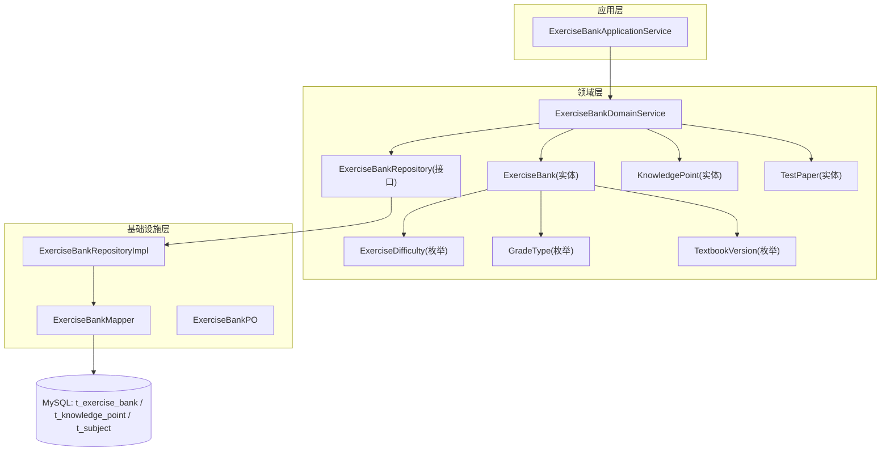
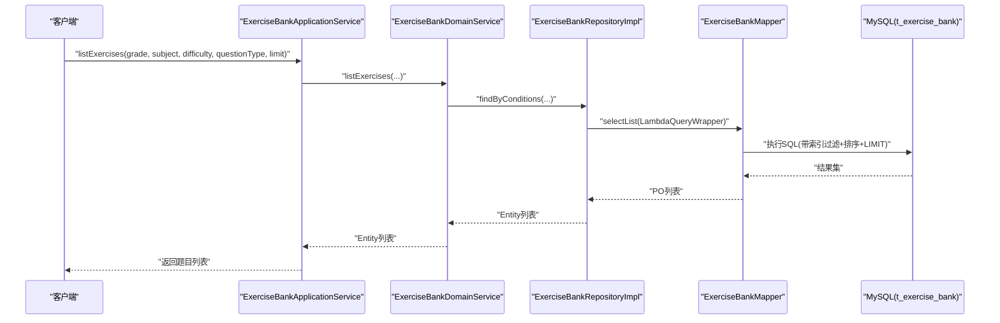
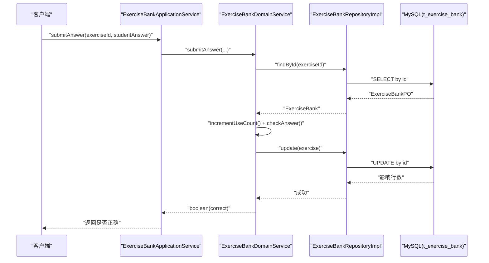
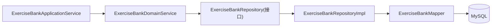
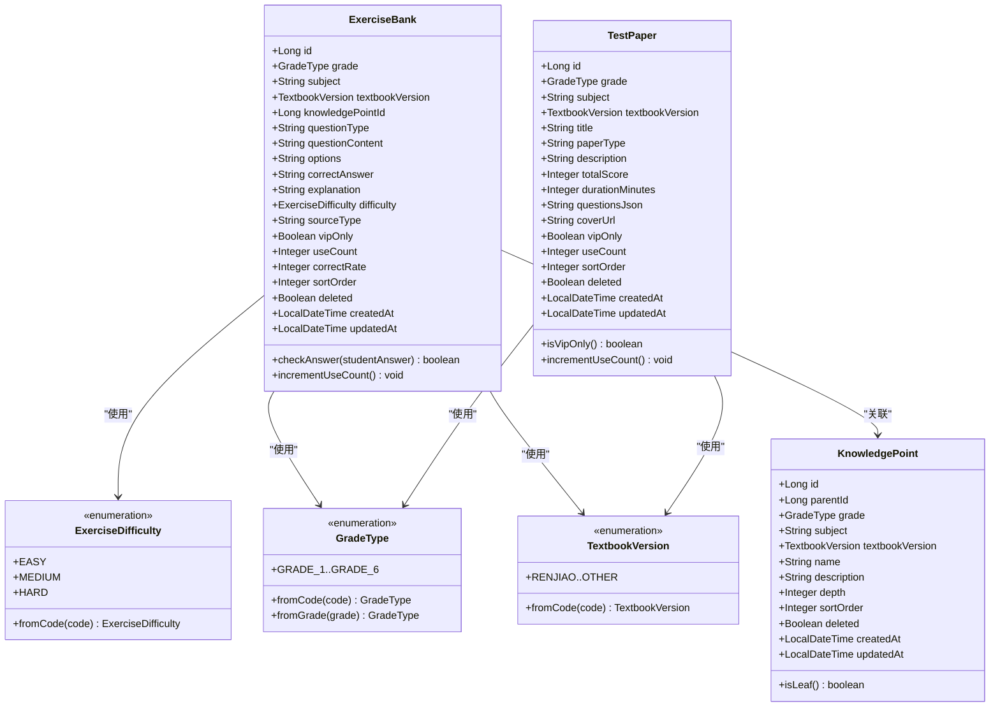

# 题库表设计

<cite>
**本文引用的文件**
- [t_exercise_bank.sql](file://wzoto-backend/sql/t_exercise_bank.sql)
- [ExerciseBank.java](file://wzoto-backend/wzoto-domain/src/main/java/com/wzoto/domain/entity/ExerciseBank.java)
- [ExerciseDifficulty.java](file://wzoto-backend/wzoto-domain/src/main/java/com/wzoto/domain/valobj/ExerciseDifficulty.java)
- [GradeType.java](file://wzoto-backend/wzoto-domain/src/main/java/com/wzoto/domain/valobj/GradeType.java)
- [TextbookVersion.java](file://wzoto-backend/wzoto-domain/src/main/java/com/wzoto/domain/valobj/TextbookVersion.java)
- [KnowledgePoint.java](file://wzoto-backend/wzoto-domain/src/main/java/com/wzoto/domain/entity/KnowledgePoint.java)
- [TestPaper.java](file://wzoto-backend/wzoto-domain/src/main/java/com/wzoto/domain/entity/TestPaper.java)
- [ExerciseBankApplicationService.java](file://wzoto-backend/wzoto-application/src/main/java/com/wzoto/application/service/ExerciseBankApplicationService.java)
- [ExerciseBankDomainService.java](file://wzoto-backend/wzoto-domain/src/main/java/com/wzoto/domain/service/ExerciseBankDomainService.java)
- [ExerciseBankRepository.java](file://wzoto-backend/wzoto-domain/src/main/java/com/wzoto/domain/repository/ExerciseBankRepository.java)
- [ExerciseBankRepositoryImpl.java](file://wzoto-backend/wzoto-infrastructure/src/main/java/com/wzoto/infrastructure/repository/ExerciseBankRepositoryImpl.java)
- [ExerciseBankMapper.java](file://wzoto-backend/wzoto-infrastructure/src/main/java/com/wzoto/infrastructure/mapper/ExerciseBankMapper.java)
- [ExerciseBankPO.java](file://wzoto-backend/wzoto-infrastructure/src/main/java/com/wzoto/infrastructure/pojo/ExerciseBankPO.java)
- [t_knowledge_point.sql](file://wzoto-backend/sql/t_knowledge_point.sql)
- [t_subject.sql](file://wzoto-backend/sql/t_subject.sql)
</cite>

## 目录
1. [简介](#简介)
2. [项目结构](#项目结构)
3. [核心组件](#核心组件)
4. [架构总览](#架构总览)
5. [详细组件分析](#详细组件分析)
6. [依赖关系分析](#依赖关系分析)
7. [性能与查询优化](#性能与查询优化)
8. [故障排查指南](#故障排查指南)
9. [结论](#结论)
10. [附录](#附录)

## 简介
本文件围绕题库表 t_exercise_bank 的设计与实现，系统阐述多维度分类（学科、年级、教材版本、章节/知识点）、难度等级体系、题型管理、题目内容结构化存储、知识点关联、质量评估指标、版本与修订策略、智能出题策略、查询优化方案以及数据一致性与批量操作优化。文档同时结合领域模型、仓储实现与应用服务，给出端到端的数据流与调用序列图，帮助读者快速理解并扩展题库能力。

## 项目结构
围绕题库的核心代码分布在应用层、领域层与基础设施层：
- 应用层：暴露对外服务能力（如按条件查询、提交答案、获取试卷等）
- 领域层：定义实体、值对象与领域服务（如 ExerciseBank、ExerciseDifficulty、ExerciseBankDomainService）
- 基础设施层：持久化映射与数据库访问（如 PO、Mapper、Repository 实现）

图表来源
- [ExerciseBankApplicationService.java:21-41](file://wzoto-backend/wzoto-application/src/main/java/com/wzoto/application/service/ExerciseBankApplicationService.java#L21-L41)
- [ExerciseBankDomainService.java:28-85](file://wzoto-backend/wzoto-domain/src/main/java/com/wzoto/domain/service/ExerciseBankDomainService.java#L28-L85)
- [ExerciseBankRepository.java:8-15](file://wzoto-backend/wzoto-domain/src/main/java/com/wzoto/domain/repository/ExerciseBankRepository.java#L8-L15)
- [ExerciseBankRepositoryImpl.java:24-72](file://wzoto-backend/wzoto-infrastructure/src/main/java/com/wzoto/infrastructure/repository/ExerciseBankRepositoryImpl.java#L24-L72)
- [ExerciseBankMapper.java:7-9](file://wzoto-backend/wzoto-infrastructure/src/main/java/com/wzoto/infrastructure/mapper/ExerciseBankMapper.java#L7-L9)
- [ExerciseBankPO.java:8-34](file://wzoto-backend/wzoto-infrastructure/src/main/java/com/wzoto/infrastructure/pojo/ExerciseBankPO.java#L8-L34)

章节来源
- [ExerciseBankApplicationService.java:21-41](file://wzoto-backend/wzoto-application/src/main/java/com/wzoto/application/service/ExerciseBankApplicationService.java#L21-L41)
- [ExerciseBankDomainService.java:28-85](file://wzoto-backend/wzoto-domain/src/main/java/com/wzoto/domain/service/ExerciseBankDomainService.java#L28-L85)
- [ExerciseBankRepositoryImpl.java:24-72](file://wzoto-backend/wzoto-infrastructure/src/main/java/com/wzoto/infrastructure/repository/ExerciseBankRepositoryImpl.java#L24-L72)

## 核心组件
- 题库实体与值对象
  - 题库实体包含年级、学科、教材版本、知识点、题型、题干与选项、答案、解析、难度、来源、是否仅会员、使用次数、正确率、排序等字段，并提供答案校验与使用次数自增方法
  - 难度枚举定义基础/提高/挑战三级；年级枚举覆盖小学一到六年级；教材版本枚举支持多版本
- 领域服务
  - 提供按条件查询、获取详情、提交答案自动批改、获取试卷列表等能力
- 仓储与持久化
  - 通过 MyBatis-Plus 的 BaseMapper 与 Lambda 查询构建器实现复杂条件检索，并按排序号升序返回结果

章节来源
- [ExerciseBank.java:20-50](file://wzoto-backend/wzoto-domain/src/main/java/com/wzoto/domain/entity/ExerciseBank.java#L20-L50)
- [ExerciseDifficulty.java:9-31](file://wzoto-backend/wzoto-domain/src/main/java/com/wzoto/domain/valobj/ExerciseDifficulty.java#L9-L31)
- [GradeType.java:9-45](file://wzoto-backend/wzoto-domain/src/main/java/com/wzoto/domain/valobj/GradeType.java#L9-L45)
- [TextbookVersion.java:9-35](file://wzoto-backend/wzoto-domain/src/main/java/com/wzoto/domain/valobj/TextbookVersion.java#L9-L35)
- [ExerciseBankDomainService.java:28-85](file://wzoto-backend/wzoto-domain/src/main/java/com/wzoto/domain/service/ExerciseBankDomainService.java#L28-L85)
- [ExerciseBankRepositoryImpl.java:45-72](file://wzoto-backend/wzoto-infrastructure/src/main/java/com/wzoto/infrastructure/repository/ExerciseBankRepositoryImpl.java#L45-L72)

## 架构总览
题库系统采用分层架构：应用服务接收请求并委托领域服务处理业务规则；领域服务通过仓储接口访问数据；基础设施层负责将领域对象与数据库表进行映射与转换。

图表来源
- [ExerciseBankApplicationService.java:21-24](file://wzoto-backend/wzoto-application/src/main/java/com/wzoto/application/service/ExerciseBankApplicationService.java#L21-L24)
- [ExerciseBankDomainService.java:28-31](file://wzoto-backend/wzoto-domain/src/main/java/com/wzoto/domain/service/ExerciseBankDomainService.java#L28-L31)
- [ExerciseBankRepositoryImpl.java:63-72](file://wzoto-backend/wzoto-infrastructure/src/main/java/com/wzoto/infrastructure/repository/ExerciseBankRepositoryImpl.java#L63-L72)
- [ExerciseBankMapper.java:7-9](file://wzoto-backend/wzoto-infrastructure/src/main/java/com/wzoto/infrastructure/mapper/ExerciseBankMapper.java#L7-L9)
- [t_exercise_bank.sql:4-30](file://wzoto-backend/sql/t_exercise_bank.sql#L4-L30)

## 详细组件分析

### 题库表结构与多维度分类
- 表结构要点
  - 主键 id
  - 维度字段：grade（年级）、subject（学科）、textbook_version（教材版本）、knowledge_point_id（知识点ID）
  - 题型与内容：question_type（选择题/填空题/判断题/简答题等）、question_content（题干JSON）、options（选项JSON数组，选择题用）
  - 答案与解析：correct_answer（正确答案）、explanation（答案解析）
  - 难度与来源：difficulty（EASY/MEDIUM/HARD）、source_type（SYSTEM/AI生成/USER自定义）
  - 运营属性：vip_only（是否仅会员）、use_count（使用次数）、correct_rate（正确率百分比）、sort_order（排序号）
  - 审计与软删：deleted、created_at、updated_at
  - 索引：idx_grade_subject、idx_knowledge_point_id、idx_question_type、idx_difficulty、idx_source_type、idx_vip_only
- 多维度分类管理
  - 学科：由 t_subject 表维护，code 唯一，供题目与资源统一引用
  - 年级：GradeType 枚举限定范围，保证一致性
  - 教材版本：TextbookVersion 枚举支持多版本适配
  - 章节/知识点：通过 t_knowledge_point 树形结构组织，题目以 knowledge_point_id 关联到叶子节点，便于精准定位与统计

章节来源
- [t_exercise_bank.sql:4-30](file://wzoto-backend/sql/t_exercise_bank.sql#L4-L30)
- [t_subject.sql:4-15](file://wzoto-backend/sql/t_subject.sql#L4-L15)
- [t_knowledge_point.sql:5-22](file://wzoto-backend/sql/t_knowledge_point.sql#L5-L22)
- [GradeType.java:9-45](file://wzoto-backend/wzoto-domain/src/main/java/com/wzoto/domain/valobj/GradeType.java#L9-L45)
- [TextbookVersion.java:9-35](file://wzoto-backend/wzoto-domain/src/main/java/com/wzoto/domain/valobj/TextbookVersion.java#L9-L35)
- [KnowledgePoint.java:20-38](file://wzoto-backend/wzoto-domain/src/main/java/com/wzoto/domain/entity/KnowledgePoint.java#L20-L38)

### 难度等级设计与自适应出题
- 难度等级
  - 使用 ExerciseDifficulty 枚举定义 EASY/MEDIUM/HARD，分别对应基础/提高/挑战
  - 在查询时可通过 difficulty 参数精确筛选
- 难度系数计算（建议）
  - 可基于 correct_rate 反推难度系数：例如系数 = f(1 - correct_rate)，并结合 use_count 做置信度加权
  - 可在离线任务中定期更新 correct_rate，或在答题后增量更新
- 自适应出题算法（建议）
  - 输入：学生历史薄弱知识点、目标难度区间、题型分布
  - 过程：按知识点聚合候选题 -> 按难度梯度采样 -> 去重与多样性约束 -> 输出题单
  - 输出：个性化练习或组卷 JSON（与 TestPaper.questionsJson 配合）

章节来源
- [ExerciseDifficulty.java:9-31](file://wzoto-backend/wzoto-domain/src/main/java/com/wzoto/domain/valobj/ExerciseDifficulty.java#L9-L31)
- [ExerciseBankDomainService.java:28-31](file://wzoto-backend/wzoto-domain/src/main/java/com/wzoto/domain/service/ExerciseBankDomainService.java#L28-L31)
- [ExerciseBank.java:42-50](file://wzoto-backend/wzoto-domain/src/main/java/com/wzoto/domain/entity/ExerciseBank.java#L42-L50)

### 题型管理系统与存储结构
- 题型类型
  - 选择题：question_type=CHOICE，options 为选项 JSON 数组
  - 填空题：question_type=FILL，通常无 options
  - 判断题：question_type=TRUE_FALSE，答案通常为 TRUE/FALSE
  - 解答题：question_type=SHORT_ANSWER，答案可为文本片段
- 存储结构
  - question_content：题干 JSON，统一承载题干信息
  - options：选项 JSON 数组，仅选择题使用
  - correct_answer：标准化答案，便于自动判分
  - explanation：解析文本，用于讲评与复习

章节来源
- [t_exercise_bank.sql:10-14](file://wzoto-backend/sql/t_exercise_bank.sql#L10-L14)
- [ExerciseBankPO.java:17-21](file://wzoto-backend/wzoto-infrastructure/src/main/java/com/wzoto/infrastructure/pojo/ExerciseBankPO.java#L17-L21)

### 题目内容结构化存储
- 题干与选项
  - 使用 JSON 格式存储，便于前端渲染与扩展
- 答案与解析
  - 答案字段支持字符串匹配（大小写不敏感），解析字段用于展示讲解
- 判题逻辑
  - 实体提供 checkAnswer 方法，对 studentAnswer 与 correct_answer 进行规范化比较

章节来源
- [ExerciseBank.java:42-50](file://wzoto-backend/wzoto-domain/src/main/java/com/wzoto/domain/entity/ExerciseBank.java#L42-L50)
- [ExerciseBankPO.java:17-21](file://wzoto-backend/wzoto-infrastructure/src/main/java/com/wzoto/infrastructure/pojo/ExerciseBankPO.java#L17-L21)

### 知识点关联与薄弱点识别
- 关联方式
  - 题目通过 knowledge_point_id 指向 t_knowledge_point 的叶子节点，形成“题目-知识点”的强关联
- 覆盖统计
  - 可按知识点聚合题目数量、使用次数、正确率，形成覆盖率与掌握度视图
- 薄弱点识别
  - 结合错题记录与知识点错误计数，输出 Top-N 薄弱知识点（参考学习报告中的弱项统计思路）

章节来源
- [t_exercise_bank.sql:9](file://wzoto-backend/sql/t_exercise_bank.sql#L9)
- [t_knowledge_point.sql:5-22](file://wzoto-backend/sql/t_knowledge_point.sql#L5-L22)
- [KnowledgePoint.java:20-38](file://wzoto-backend/wzoto-domain/src/main/java/com/wzoto/domain/entity/KnowledgePoint.java#L20-L38)
- [LearningReportDomainService.java:107-123](file://wzoto-backend/wzoto-domain/src/main/java/com/wzoto/domain/service/LearningReportDomainService.java#L107-L123)

### 题目质量评估
- 使用频率
  - use_count 记录题目被使用的次数，可用于热度分析与推荐
- 正确率分析
  - correct_rate 表示百分比，可结合 use_count 评估样本可信度
- 有效性评估（建议）
  - 低使用且低正确率的题目可标记为待优化；高使用但正确率异常的题目需复核题意或答案

章节来源
- [t_exercise_bank.sql:18-19](file://wzoto-backend/sql/t_exercise_bank.sql#L18-L19)
- [ExerciseBank.java:47-50](file://wzoto-backend/wzoto-domain/src/main/java/com/wzoto/domain/entity/ExerciseBank.java#L47-L50)

### 题目版本管理与批量更新
- 版本控制（建议）
  - 当前表未内置版本字段，建议在应用层引入 version 字段或通过独立版本表记录修订历史
  - 批量更新时，先创建新版本记录，再切换引用，确保回滚能力
- 批量更新机制（建议）
  - 使用事务包裹多条更新，失败整体回滚
  - 对热点字段（如 correct_rate、use_count）采用增量更新，减少锁竞争

章节来源
- [ExerciseBankDomainService.java:47-56](file://wzoto-backend/wzoto-domain/src/main/java/com/wzoto/domain/service/ExerciseBankDomainService.java#L47-L56)
- [ExerciseBankRepositoryImpl.java:39-43](file://wzoto-backend/wzoto-infrastructure/src/main/java/com/wzoto/infrastructure/repository/ExerciseBankRepositoryImpl.java#L39-L43)

### 智能出题策略
- 基于知识点的随机抽题
  - 通过 findByKnowledgePoint 或 findByConditions 获取候选集，再进行随机抽样
- 难度梯度设计
  - 按 EASY/MEDIUM/HARD 分层采样，保证题单难度曲线合理
- 个性化练习生成
  - 结合学生薄弱知识点与目标难度，生成定制题单，并以 TestPaper.questionsJson 形式输出

章节来源
- [ExerciseBankDomainService.java:83-85](file://wzoto-backend/wzoto-domain/src/main/java/com/wzoto/domain/service/ExerciseBankDomainService.java#L83-L85)
- [ExerciseBankRepositoryImpl.java:55-60](file://wzoto-backend/wzoto-infrastructure/src/main/java/com/wzoto/infrastructure/repository/ExerciseBankRepositoryImpl.java#L55-L60)
- [TestPaper.java:20-46](file://wzoto-backend/wzoto-domain/src/main/java/com/wzoto/domain/entity/TestPaper.java#L20-L46)

### 提交答案与自动批改流程

图表来源
- [ExerciseBankApplicationService.java:30-32](file://wzoto-backend/wzoto-application/src/main/java/com/wzoto/application/service/ExerciseBankApplicationService.java#L30-L32)
- [ExerciseBankDomainService.java:47-56](file://wzoto-backend/wzoto-domain/src/main/java/com/wzoto/domain/service/ExerciseBankDomainService.java#L47-L56)
- [ExerciseBankRepositoryImpl.java:33-43](file://wzoto-backend/wzoto-infrastructure/src/main/java/com/wzoto/infrastructure/repository/ExerciseBankRepositoryImpl.java#L33-L43)

## 依赖关系分析
- 模块耦合
  - 应用服务依赖领域服务；领域服务依赖仓储接口；基础设施实现仓储并通过 Mapper 访问数据库
- 外部依赖
  - MyBatis-Plus 提供 BaseMapper 与 Lambda 查询构建器
  - MySQL 提供索引加速查询
- 潜在循环依赖
  - 当前分层清晰，未见循环依赖

图表来源
- [ExerciseBankApplicationService.java:21-41](file://wzoto-backend/wzoto-application/src/main/java/com/wzoto/application/service/ExerciseBankApplicationService.java#L21-L41)
- [ExerciseBankDomainService.java:28-85](file://wzoto-backend/wzoto-domain/src/main/java/com/wzoto/domain/service/ExerciseBankDomainService.java#L28-L85)
- [ExerciseBankRepository.java:8-15](file://wzoto-backend/wzoto-domain/src/main/java/com/wzoto/domain/repository/ExerciseBankRepository.java#L8-L15)
- [ExerciseBankRepositoryImpl.java:24-72](file://wzoto-backend/wzoto-infrastructure/src/main/java/com/wzoto/infrastructure/repository/ExerciseBankRepositoryImpl.java#L24-L72)
- [ExerciseBankMapper.java:7-9](file://wzoto-backend/wzoto-infrastructure/src/main/java/com/wzoto/infrastructure/mapper/ExerciseBankMapper.java#L7-L9)

## 性能与查询优化
- 复杂条件查询优化
  - 利用 idx_grade_subject、idx_knowledge_point_id、idx_question_type、idx_difficulty、idx_source_type、idx_vip_only 组合过滤
  - 使用 LambdaQueryWrapper 动态拼接条件，避免全表扫描
- 大数据量分页处理
  - 当前实现使用 LIMIT 限制返回条数；建议在上层增加分页参数（offset/limit）或使用游标分页
- 热点题目缓存
  - 对高频访问的题目或题单可在应用层引入缓存（如 Redis），设置合理过期策略
- 数据一致性与批量操作
  - 提交答案时先读取、再更新 use_count 与正确率，建议使用事务保证一致性
  - 批量更新时合并多次写入，降低数据库压力

章节来源
- [ExerciseBankRepositoryImpl.java:63-72](file://wzoto-backend/wzoto-infrastructure/src/main/java/com/wzoto/infrastructure/repository/ExerciseBankRepositoryImpl.java#L63-L72)
- [t_exercise_bank.sql:24-29](file://wzoto-backend/sql/t_exercise_bank.sql#L24-L29)
- [ExerciseBankDomainService.java:47-56](file://wzoto-backend/wzoto-domain/src/main/java/com/wzoto/domain/service/ExerciseBankDomainService.java#L47-L56)

## 故障排查指南
- 常见错误
  - 题目不存在：当根据 ID 查询不到题目时会抛出非法参数异常
  - 无效的难度/年级/教材版本：值对象的 fromCode 方法在无法匹配时会抛出非法参数异常
- 排查步骤
  - 检查传入的 grade、subject、difficulty、questionType 是否为合法枚举值
  - 确认数据库索引是否存在且命中
  - 查看日志中做题结果与更新行数的记录

章节来源
- [ExerciseBankDomainService.java:36-41](file://wzoto-backend/wzoto-domain/src/main/java/com/wzoto/domain/service/ExerciseBankDomainService.java#L36-L41)
- [ExerciseBankDomainService.java:47-51](file://wzoto-backend/wzoto-domain/src/main/java/com/wzoto/domain/service/ExerciseBankDomainService.java#L47-L51)
- [ExerciseDifficulty.java:23-30](file://wzoto-backend/wzoto-domain/src/main/java/com/wzoto/domain/valobj/ExerciseDifficulty.java#L23-L30)
- [GradeType.java:28-44](file://wzoto-backend/wzoto-domain/src/main/java/com/wzoto/domain/valobj/GradeType.java#L28-L44)
- [TextbookVersion.java:27-34](file://wzoto-backend/wzoto-domain/src/main/java/com/wzoto/domain/valobj/TextbookVersion.java#L27-L34)

## 结论
t_exercise_bank 作为题库核心表，通过多维分类、结构化内容与严格枚举约束，支撑了灵活的题目管理与智能出题。结合领域服务与仓储实现，系统在查询效率、可扩展性与一致性方面具备良好基础。后续可在版本管理、自适应出题与缓存策略上进一步增强，以满足更大规模与更个性化的教学场景。

## 附录
- 类关系图（实体与值对象）

图表来源
- [ExerciseBank.java:20-50](file://wzoto-backend/wzoto-domain/src/main/java/com/wzoto/domain/entity/ExerciseBank.java#L20-L50)
- [KnowledgePoint.java:20-38](file://wzoto-backend/wzoto-domain/src/main/java/com/wzoto/domain/entity/KnowledgePoint.java#L20-L38)
- [TestPaper.java:20-46](file://wzoto-backend/wzoto-domain/src/main/java/com/wzoto/domain/entity/TestPaper.java#L20-L46)
- [ExerciseDifficulty.java:9-31](file://wzoto-backend/wzoto-domain/src/main/java/com/wzoto/domain/valobj/ExerciseDifficulty.java#L9-L31)
- [GradeType.java:9-45](file://wzoto-backend/wzoto-domain/src/main/java/com/wzoto/domain/valobj/GradeType.java#L9-L45)
- [TextbookVersion.java:9-35](file://wzoto-backend/wzoto-domain/src/main/java/com/wzoto/domain/valobj/TextbookVersion.java#L9-L35)