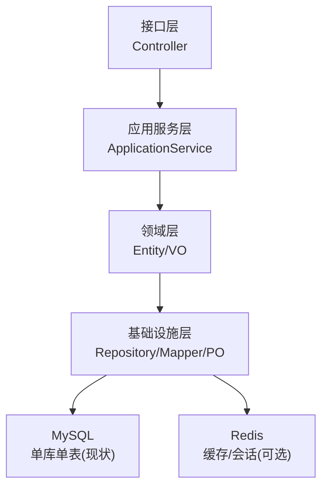
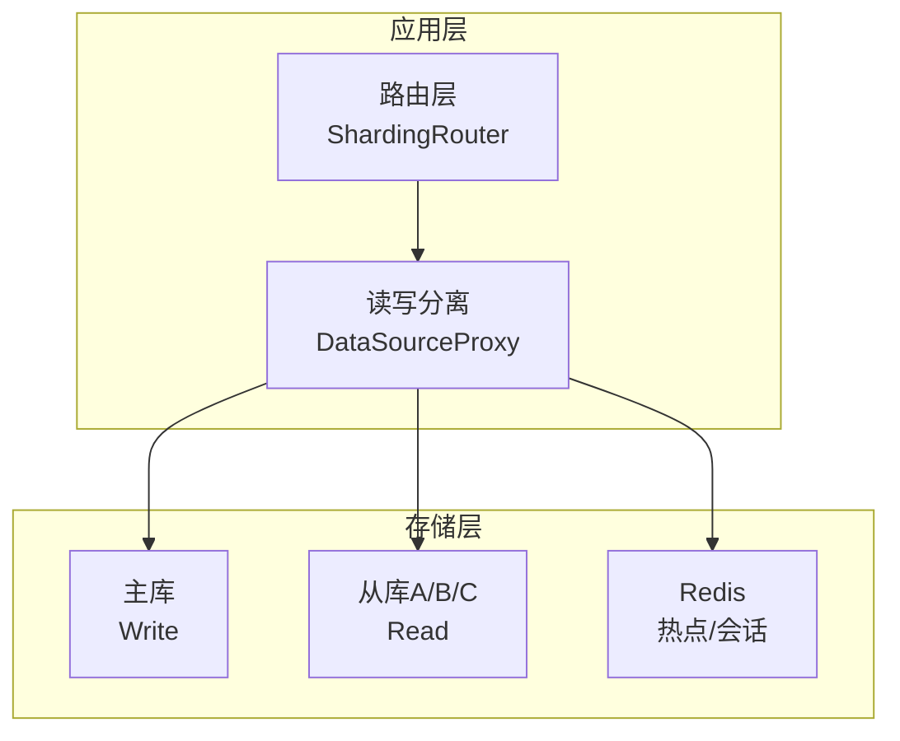
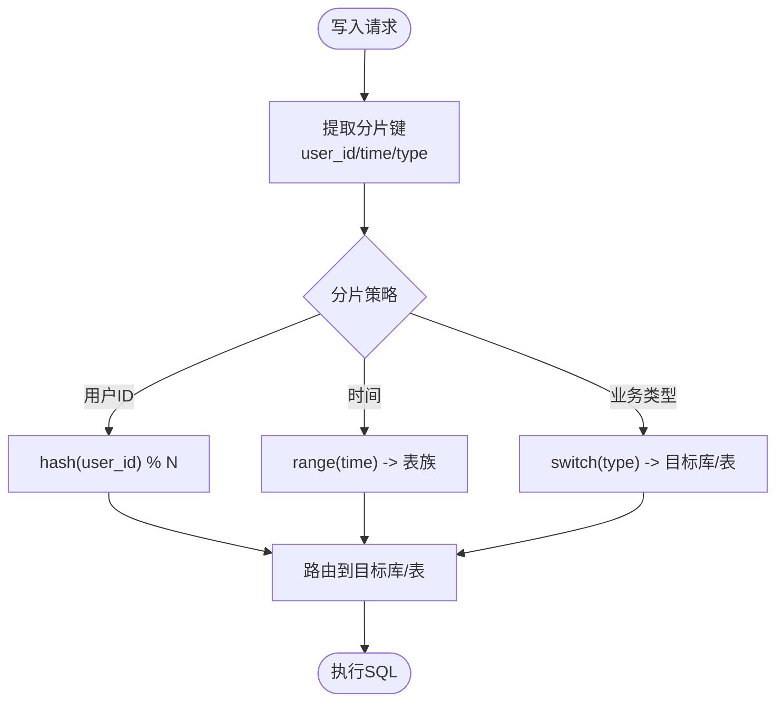
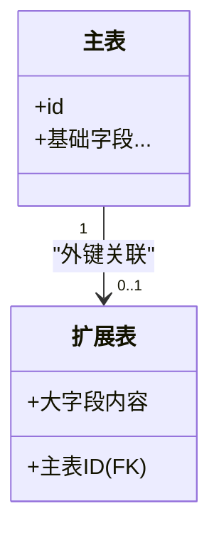
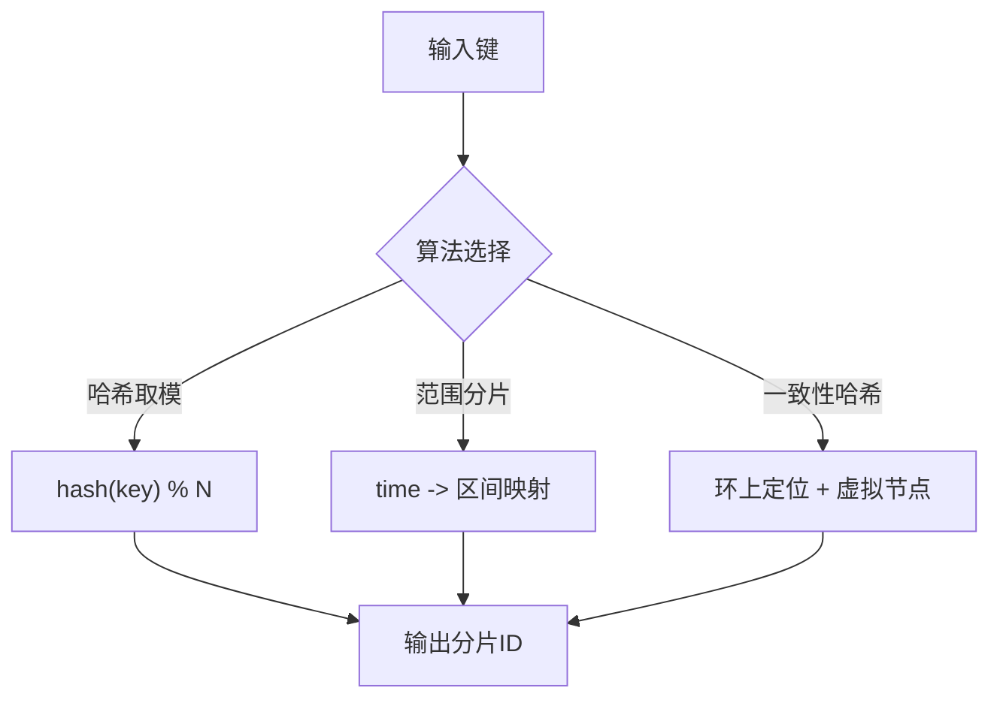
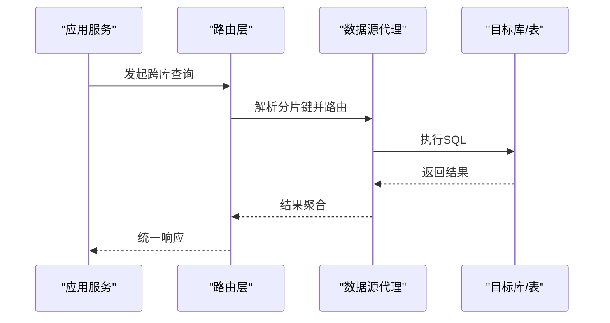
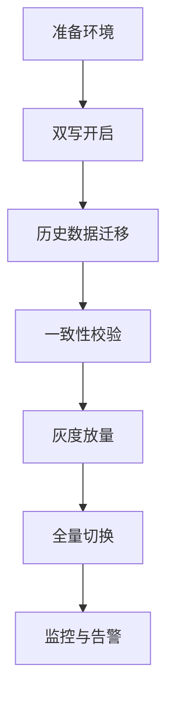
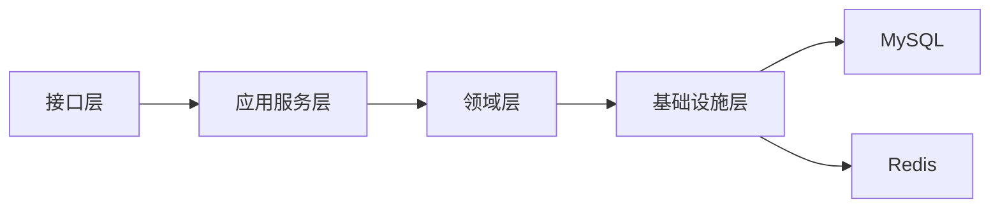

# 分库分表方案

<cite>
**本文引用的文件**
- [wzoto-backend/pom.xml](file://wzoto-backend/pom.xml)
- [application.yml](file://wzoto-backend/wzoto-interfaces/src/main/resources/application.yml)
- [t_user.sql](file://wzoto-backend/sql/t_user.sql)
- [t_child.sql](file://wzoto-backend/sql/t_child.sql)
- [t_booking.sql](file://wzoto-backend/sql/t_booking.sql)
- [t_learning_resource.sql](file://wzoto-backend/sql/t_learning_resource.sql)
- [User.java](file://wzoto-backend/wzoto-domain/src/main/java/com/wzoto/domain/entity/User.java)
- [Child.java](file://wzoto-backend/wzoto-domain/src/main/java/com/wzoto/domain/entity/Child.java)
- [UserRepositoryImpl.java](file://wzoto-backend/wzoto-infrastructure/src/main/java/com/wzoto/infrastructure/repository/UserRepositoryImpl.java)
- [MybatisMetaObjectHandler.java](file://wzoto-backend/wzoto-infrastructure/src/main/java/com/wzoto/infrastructure/config/MybatisMetaObjectHandler.java)
</cite>

## 目录
1. [引言](#引言)
2. [项目结构](#项目结构)
3. [核心组件](#核心组件)
4. [架构总览](#架构总览)
5. [详细组件分析](#详细组件分析)
6. [依赖关系分析](#依赖关系分析)
7. [性能考量](#性能考量)
8. [故障排查指南](#故障排查指南)
9. [结论](#结论)
10. [附录](#附录)

## 引言
本方案面向wzoto后端系统，围绕“水平分表、垂直分表、分片算法、跨库查询、数据迁移与灰度发布”等主题，给出可落地的设计与实施路径。当前代码库采用单体Spring Boot + MyBatis-Plus + MySQL + Redis的架构，尚未内置分库分表中间件。本文在尊重现有代码结构的基础上，提出渐进式演进路线：先通过应用层路由与读写分离提升扩展性，再按需引入分片能力与分布式事务治理。

## 项目结构
- 分层架构清晰：接口层（Controller）、应用服务层（Application Service）、领域层（Domain Entity/Value Object）、基础设施层（Mapper/PO/Repository实现）。
- 数据库配置集中在application.yml，使用单库单实例；实体与持久化对象在domain与infrastructure之间通过Repository解耦。
- 关键表包括用户、子女档案、预约订单、学习资源等，具备典型的多租户/多业务特征，适合按用户ID、时间、业务类型进行水平拆分；同时存在大字段与冷热数据差异，适合垂直拆分。

**图表来源**
- [application.yml:6-17](file://wzoto-backend/wzoto-interfaces/src/main/resources/application.yml#L6-L17)
- [UserRepositoryImpl.java:23-123](file://wzoto-backend/wzoto-infrastructure/src/main/java/com/wzoto/infrastructure/repository/UserRepositoryImpl.java#L23-L123)

**章节来源**
- [wzoto-backend/pom.xml:21-26](file://wzoto-backend/pom.xml#L21-L26)
- [application.yml:6-17](file://wzoto-backend/wzoto-interfaces/src/main/resources/application.yml#L6-L17)

## 核心组件
- 用户域：User实体包含身份选择、绑定手机号、认证状态等业务规则，适合作为分片键（user_id）的核心维度。
- 子女档案：Child实体以parent_id关联家长，天然支持按家长ID做水平分片。
- 预约订单：Booking含parent_id、tutor_id、booking_date等维度，适合按时间+用户双维分片或按业务类型分片。
- 学习资源：LearningResource为大表候选，可按年级/学科/版本等维度拆分，并考虑冷热分离与大字段拆分。

**章节来源**
- [User.java:20-93](file://wzoto-backend/wzoto-domain/src/main/java/com/wzoto/domain/entity/User.java#L20-L93)
- [Child.java:20-122](file://wzoto-backend/wzoto-domain/src/main/java/com/wzoto/domain/entity/Child.java#L20-L122)
- [t_booking.sql:1-23](file://wzoto-backend/sql/t_booking.sql#L1-L23)
- [t_learning_resource.sql:4-35](file://wzoto-backend/sql/t_learning_resource.sql#L4-L35)

## 架构总览
建议采用“应用层路由 + 读写分离 + 分片策略”的渐进式架构：
- 应用层路由：在Repository或DAO层根据分片键计算目标库/表，屏蔽上层调用复杂度。
- 读写分离：主库写、从库读，缓解读压力。
- 分片策略：按用户ID哈希取模、按时间范围、按业务类型枚举路由。
- 全局ID：采用雪花算法或类似方案生成无冲突ID，避免跨库JOIN。
- 分布式事务：优先最终一致性（消息/补偿），必要时引入TCC/SAGA。

[此图为概念性架构图，不直接映射具体源码文件]

## 详细组件分析

### 水平分表策略
- 按用户ID分表
  - 适用场景：用户相关强隔离的数据，如t_user、t_child、t_booking（按parent_id）。
  - 分片键：user_id/parent_id。
  - 路由规则：hash(user_id) % N 或 基于一致性哈希的虚拟节点映射。
  - 收益：热点用户隔离、扩容时仅迁移部分数据。
- 按时间分表
  - 适用场景：日志、记录类大表，如t_course_watch_record、t_exercise_answer_record。
  - 分片键：日期/月份（如yyyyMM）。
  - 路由规则：range(time) -> 表名后缀。
  - 收益：历史数据归档、清理便捷、查询局部化。
- 按业务类型分表
  - 适用场景：多业务线并存且访问模式差异大，如AI相关表、学习资源表。
  - 分片键：business_type（枚举）。
  - 路由规则：switch(business_type) -> 对应库/表族。
  - 收益：业务隔离、独立扩缩容。

[此图为概念性流程图，不直接映射具体源码文件]

### 垂直分表设计
- 读写分离
  - 主库负责写，从库承担读流量；通过DataSource代理或框架配置实现。
  - 结合MyBatis-Plus的多数据源或自定义路由，将读操作指向从库。
- 冷热数据分离
  - 热数据：近期活跃数据放主库或高性能实例；冷数据：归档至低成本存储或只读副本。
  - 通过时间分片与异步归档任务实现。
- 大字段拆分
  - 将content_url、tags、knowledge_markers等大字段拆到扩展表，主表保留轻量元数据。
  - 读取时按需加载，降低IO与网络开销。

[此图为概念性类图，不直接映射具体源码文件]

### 分片算法选择
- 哈希取模
  - 优点：均匀分布、扩容需重排但可控。
  - 缺点：扩容引发数据迁移。
- 范围分片
  - 优点：按时间自然切分，便于归档。
  - 缺点：热点倾斜风险。
- 一致性哈希
  - 优点：扩容影响面小。
  - 缺点：实现复杂、需虚拟节点平衡负载。

[此图为概念性流程图，不直接映射具体源码文件]

### 跨库查询处理
- 全局ID生成
  - 采用雪花算法或类似方案，保证跨库唯一性与有序性。
- 分布式事务
  - 优先最终一致性：本地消息表 + 可靠消息投递 + 幂等消费。
  - 必要时采用TCC/SAGA，减少跨库强一致成本。
- 跨库JOIN优化
  - 尽量避免跨库JOIN；通过冗余字段、异步聚合、ES/ClickHouse等搜索引擎/OLAP替代。
  - 若必须JOIN，尽量在同一分片内完成或通过应用层合并结果集。

[此图为概念性时序图，不直接映射具体源码文件]

### 分库分表实施
- 数据迁移方案
  - 双写阶段：新旧库并行写入，校验一致性。
  - 历史数据分批迁移：按分片键分段导入，控制锁与延迟。
  - 回滚预案：保留旧库只读，快速切换。
- 灰度发布策略
  - 按用户ID段或业务类型逐步放量，观察指标后全量。
  - 功能开关控制路由逻辑，支持秒级回切。
- 回滚机制
  - 配置中心动态切换路由策略。
  - 数据不一致检测与修复脚本。

[此图为概念性流程图，不直接映射具体源码文件]

## 依赖关系分析
- 模块依赖
  - 接口层依赖应用服务层；应用服务层依赖领域层；领域层不依赖基础设施层。
  - 基础设施层实现Repository接口，屏蔽数据库细节。
- 外部依赖
  - MyBatis-Plus用于ORM与分页；Hutool工具库；JWT鉴权；Redis缓存。
- 潜在耦合点
  - Repository实现中直接构造查询条件，未来引入分片时需在此处抽象路由逻辑。
  - application.yml集中配置数据源，后续需扩展为多数据源配置。

**图表来源**
- [wzoto-backend/pom.xml:21-26](file://wzoto-backend/pom.xml#L21-L26)
- [application.yml:6-17](file://wzoto-backend/wzoto-interfaces/src/main/resources/application.yml#L6-L17)

**章节来源**
- [wzoto-backend/pom.xml:58-90](file://wzoto-backend/pom.xml#L58-L90)
- [application.yml:6-17](file://wzoto-backend/wzoto-interfaces/src/main/resources/application.yml#L6-L17)

## 性能考量
- 热点用户隔离：按user_id分片避免单表热点。
- 读写分离：读多写少场景显著降低主库压力。
- 冷热分离：历史数据归档，提升热数据命中率。
- 大字段拆分：减少行宽，提高缓存命中率与传输效率。
- 索引优化：针对高频查询建立复合索引，避免全表扫描。
- 连接池与超时：合理设置连接池大小与超时，防止雪崩。

[本节提供通用指导，不直接分析具体文件]

## 故障排查指南
- 数据源配置错误
  - 检查application.yml中的数据库URL、用户名、密码及Redis配置。
- 自动填充失效
  - 确认MybatisMetaObjectHandler已注册，createdAt/updatedAt是否正确填充。
- 查询异常
  - 检查LambdaQueryWrapper构建是否遗漏deleted过滤导致脏数据干扰。
- 性能问题
  - 通过慢查询日志定位未命中索引的SQL，补充索引或改写SQL。

**章节来源**
- [application.yml:6-17](file://wzoto-backend/wzoto-interfaces/src/main/resources/application.yml#L6-L17)
- [MybatisMetaObjectHandler.java:15-29](file://wzoto-backend/wzoto-infrastructure/src/main/java/com/wzoto/infrastructure/config/MybatisMetaObjectHandler.java#L15-L29)
- [UserRepositoryImpl.java:27-83](file://wzoto-backend/wzoto-infrastructure/src/main/java/com/wzoto/infrastructure/repository/UserRepositoryImpl.java#L27-L83)

## 结论
wzoto当前为单体架构，具备向分库分表演进的坚实基础。建议优先落地应用层路由与读写分离，结合用户ID、时间、业务类型三维度分片策略，逐步引入全局ID与分布式事务治理。通过冷热分离与大字段拆分优化存储与查询性能，配合灰度发布与回滚机制保障平滑演进。

[本节总结性内容，不直接分析具体文件]

## 附录
- 关键表DDL参考
  - 用户表：t_user
  - 子女档案表：t_child
  - 预约订单表：t_booking
  - 学习资源表：t_learning_resource
- 领域实体参考
  - User：身份选择、绑定手机号、认证状态
  - Child：家长归属、年级与教材版本维护

**章节来源**
- [t_user.sql:7-26](file://wzoto-backend/sql/t_user.sql#L7-L26)
- [t_child.sql:4-17](file://wzoto-backend/sql/t_child.sql#L4-L17)
- [t_booking.sql:1-23](file://wzoto-backend/sql/t_booking.sql#L1-L23)
- [t_learning_resource.sql:4-35](file://wzoto-backend/sql/t_learning_resource.sql#L4-L35)
- [User.java:20-93](file://wzoto-backend/wzoto-domain/src/main/java/com/wzoto/domain/entity/User.java#L20-L93)
- [Child.java:20-122](file://wzoto-backend/wzoto-domain/src/main/java/com/wzoto/domain/entity/Child.java#L20-L122)