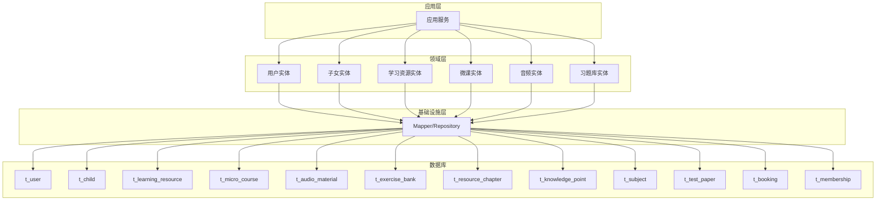
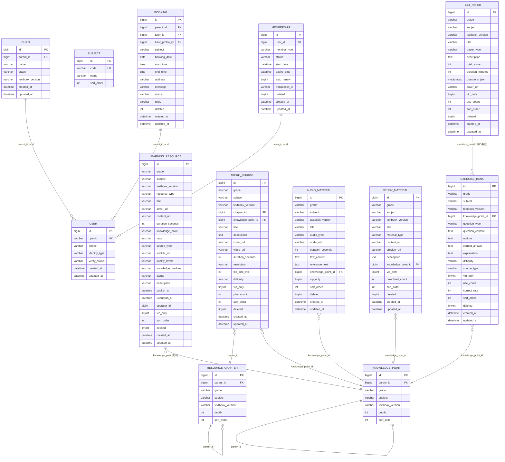
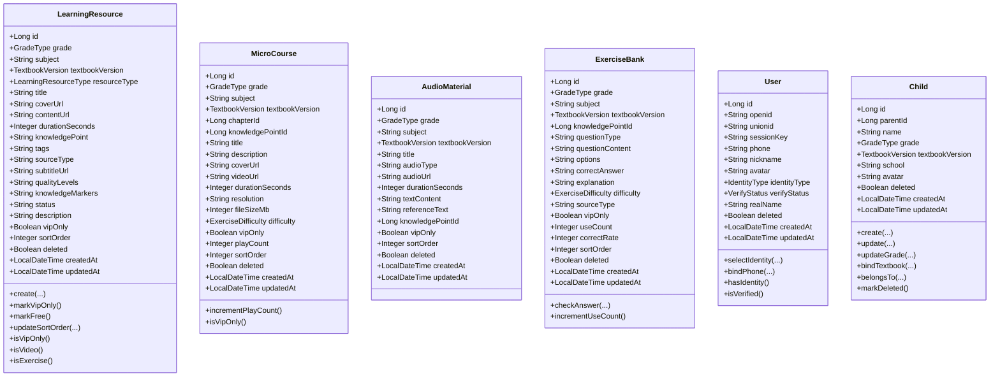

# 垂直分表设计

<cite>
**本文引用的文件**
- [t_user.sql](file://wzoto-backend/sql/t_user.sql)
- [t_child.sql](file://wzoto-backend/sql/t_child.sql)
- [t_learning_resource.sql](file://wzoto-backend/sql/t_learning_resource.sql)
- [t_exercise_bank.sql](file://wzoto-backend/sql/t_exercise_bank.sql)
- [t_micro_course.sql](file://wzoto-backend/sql/t_micro_course.sql)
- [t_audio_material.sql](file://wzoto-backend/sql/t_audio_material.sql)
- [t_study_material.sql](file://wzoto-backend/sql/t_study_material.sql)
- [t_test_paper.sql](file://wzoto-backend/sql/t_test_paper.sql)
- [t_resource_chapter.sql](file://wzoto-backend/sql/t_resource_chapter.sql)
- [t_knowledge_point.sql](file://wzoto-backend/sql/t_knowledge_point.sql)
- [t_subject.sql](file://wzoto-backend/sql/t_subject.sql)
- [t_booking.sql](file://wzoto-backend/sql/t_booking.sql)
- [t_membership.sql](file://wzoto-backend/sql/t_membership.sql)
- [LearningResource.java](file://wzoto-backend/wzoto-domain/src/main/java/com/wzoto/domain/entity/LearningResource.java)
- [ExerciseBank.java](file://wzoto-backend/wzoto-domain/src/main/java/com/wzoto/domain/entity/ExerciseBank.java)
- [MicroCourse.java](file://wzoto-backend/wzoto-domain/src/main/java/com/wzoto/domain/entity/MicroCourse.java)
- [AudioMaterial.java](file://wzoto-backend/wzoto-domain/src/main/java/com/wzoto/domain/entity/AudioMaterial.java)
- [User.java](file://wzoto-backend/wzoto-domain/src/main/java/com/wzoto/domain/entity/User.java)
- [Child.java](file://wzoto-backend/wzoto-domain/src/main/java/com/wzoto/domain/entity/Child.java)
</cite>

## 目录
1. [简介](#简介)
2. [项目结构](#项目结构)
3. [核心组件](#核心组件)
4. [架构总览](#架构总览)
5. [详细组件分析](#详细组件分析)
6. [依赖关系分析](#依赖关系分析)
7. [性能考虑](#性能考虑)
8. [故障排查指南](#故障排查指南)
9. [结论](#结论)
10. [附录](#附录)

## 简介
本文件围绕 wzoto 项目的“垂直分表设计”进行系统化说明，重点覆盖以下方面：
- 读写分离架构：主从复制配置、读写路由策略、故障转移机制（概念与落地建议）
- 冷热数据分离：热数据表设计、冷数据归档、数据迁移策略
- 大字段拆分：BLOB/TEXT 字段处理、附件存储方案、元数据分离
- 表结构优化：频繁访问字段前置、低频字段后置、查询性能优化
- 垂直分表实施：表拆分规则、数据同步方案、查询重构策略
- 具体示例与效果：基于现有学习资源域的多表拆分与索引优化

## 项目结构
wzoto 后端采用分层架构：接口层（interfaces）、应用层（application）、领域层（domain）、基础设施层（infrastructure），数据库 DDL 集中在 sql 目录。当前仓库已按业务域进行了较清晰的垂直分表，如学习资源、微课、音频、资料、试卷、习题库、章节、知识点、学科等。

图表来源
- [LearningResource.java:1-153](file://wzoto-backend/wzoto-domain/src/main/java/com/wzoto/domain/entity/LearningResource.java#L1-L153)
- [MicroCourse.java:1-52](file://wzoto-backend/wzoto-domain/src/main/java/com/wzoto/domain/entity/MicroCourse.java#L1-L52)
- [AudioMaterial.java:1-37](file://wzoto-backend/wzoto-domain/src/main/java/com/wzoto/domain/entity/AudioMaterial.java#L1-L37)
- [ExerciseBank.java:1-52](file://wzoto-backend/wzoto-domain/src/main/java/com/wzoto/domain/entity/ExerciseBank.java#L1-L52)
- [User.java:1-93](file://wzoto-backend/wzoto-domain/src/main/java/com/wzoto/domain/entity/User.java#L1-L93)
- [Child.java:1-122](file://wzoto-backend/wzoto-domain/src/main/java/com/wzoto/domain/entity/Child.java#L1-L122)

章节来源
- [t_learning_resource.sql:1-36](file://wzoto-backend/sql/t_learning_resource.sql#L1-L36)
- [t_micro_course.sql:1-32](file://wzoto-backend/sql/t_micro_course.sql#L1-L32)
- [t_audio_material.sql:1-25](file://wzoto-backend/sql/t_audio_material.sql#L1-L25)
- [t_exercise_bank.sql:1-31](file://wzoto-backend/sql/t_exercise_bank.sql#L1-L31)
- [t_resource_chapter.sql:1-21](file://wzoto-backend/sql/t_resource_chapter.sql#L1-L21)
- [t_knowledge_point.sql:1-23](file://wzoto-backend/sql/t_knowledge_point.sql#L1-L23)
- [t_subject.sql:1-16](file://wzoto-backend/sql/t_subject.sql#L1-L16)
- [t_test_paper.sql:1-27](file://wzoto-backend/sql/t_test_paper.sql#L1-L27)
- [t_user.sql:1-26](file://wzoto-backend/sql/t_user.sql#L1-L26)
- [t_child.sql:1-18](file://wzoto-backend/sql/t_child.sql#L1-L18)
- [t_booking.sql:1-23](file://wzoto-backend/sql/t_booking.sql#L1-L23)
- [t_membership.sql:1-20](file://wzoto-backend/sql/t_membership.sql#L1-L20)

## 核心组件
- 用户与身份：t_user 承载用户基础信息与认证状态；User 实体封装身份选择、绑定手机号等规则。
- 子女档案：t_child 维护家长-子女关系、年级与教材版本；Child 实体提供创建、更新、归属校验等能力。
- 学习资源域：t_learning_resource 作为通用资源聚合根，结合 t_resource_chapter、t_knowledge_point、t_subject 形成知识体系。
- 内容媒体域：t_micro_course（视频）、t_audio_material（音频）、t_study_material（资料/PDF/图片）实现媒体与元数据分离。
- 练习与评估域：t_exercise_bank（题目）、t_test_paper（试卷）支持练习与测评场景。
- 交易与预约域：t_booking（预约订单）、t_membership（会员）支撑付费与权益控制。

章节来源
- [User.java:1-93](file://wzoto-backend/wzoto-domain/src/main/java/com/wzoto/domain/entity/User.java#L1-L93)
- [Child.java:1-122](file://wzoto-backend/wzoto-domain/src/main/java/com/wzoto/domain/entity/Child.java#L1-L122)
- [LearningResource.java:1-153](file://wzoto-backend/wzoto-domain/src/main/java/com/wzoto/domain/entity/LearningResource.java#L1-L153)
- [MicroCourse.java:1-52](file://wzoto-backend/wzoto-domain/src/main/java/com/wzoto/domain/entity/MicroCourse.java#L1-L52)
- [AudioMaterial.java:1-37](file://wzoto-backend/wzoto-domain/src/main/java/com/wzoto/domain/entity/AudioMaterial.java#L1-L37)
- [ExerciseBank.java:1-52](file://wzoto-backend/wzoto-domain/src/main/java/com/wzoto/domain/entity/ExerciseBank.java#L1-L52)

## 架构总览
下图展示垂直分表在系统中的位置与职责边界，以及各表之间的关联关系。

图表来源
- [t_user.sql:1-26](file://wzoto-backend/sql/t_user.sql#L1-L26)
- [t_child.sql:1-18](file://wzoto-backend/sql/t_child.sql#L1-L18)
- [t_resource_chapter.sql:1-21](file://wzoto-backend/sql/t_resource_chapter.sql#L1-L21)
- [t_knowledge_point.sql:1-23](file://wzoto-backend/sql/t_knowledge_point.sql#L1-L23)
- [t_learning_resource.sql:1-36](file://wzoto-backend/sql/t_learning_resource.sql#L1-L36)
- [t_micro_course.sql:1-32](file://wzoto-backend/sql/t_micro_course.sql#L1-L32)
- [t_audio_material.sql:1-25](file://wzoto-backend/sql/t_audio_material.sql#L1-L25)
- [t_study_material.sql:1-26](file://wzoto-backend/sql/t_study_material.sql#L1-L26)
- [t_exercise_bank.sql:1-31](file://wzoto-backend/sql/t_exercise_bank.sql#L1-L31)
- [t_test_paper.sql:1-27](file://wzoto-backend/sql/t_test_paper.sql#L1-L27)
- [t_booking.sql:1-23](file://wzoto-backend/sql/t_booking.sql#L1-L23)
- [t_membership.sql:1-20](file://wzoto-backend/sql/t_membership.sql#L1-L20)

## 详细组件分析

### 读写分离架构（主从复制、读写路由、故障转移）
- 主从复制配置
  - 建议将写操作（INSERT/UPDATE/DELETE）定向至主库，读操作（SELECT）路由至从库，以缓解热点读压力。
  - 对于 t_learning_resource、t_micro_course、t_exercise_bank 等高并发读表，优先走从库；对 t_booking、t_membership 等强一致写入路径，必须落主库。
- 读写路由策略
  - 按 SQL 类型或注解区分读写：写方法强制主库，读方法默认从库；跨库事务内统一使用主库。
  - 针对 t_test_paper.questions_json 等大字段读取，建议在缓存层做热点键保护，避免直接打穿到从库。
- 故障转移机制
  - 主库不可用时，降级为只读模式（仅允许 SELECT），并触发告警；恢复后自动切回读写混合。
  - 从库延迟或异常时，读请求可回退主库或返回缓存结果，保障可用性。

[本节为架构建议，不直接分析具体代码文件]

### 冷热数据分离（热数据、冷数据归档、迁移策略）
- 热数据设计
  - 高频访问的元数据表：t_subject、t_resource_chapter、t_knowledge_point、t_learning_resource（标题/封面/状态等）。
  - 高频统计字段：t_micro_course.play_count、t_exercise_bank.use_count、t_study_material.download_count 等计数字段用于快速展示。
- 冷数据归档
  - 历史日志类或低频访问记录（如课程播放明细、答题明细）建议归档至独立库或对象存储索引表，保留必要维度以便审计。
  - 对 t_test_paper.questions_json、t_exercise_bank.question_content/options/explanation 等大字段，可按时间窗口归档至对象存储，并在表中仅保留引用地址。
- 数据迁移策略
  - 增量迁移：基于 created_at/updated_at 的时间戳分批迁移，避免锁表与长事务。
  - 双写过渡：新写入同时落热表与归档表，校验一致性后逐步停掉旧路径。
  - 回滚预案：迁移脚本需幂等，支持断点续跑与回滚。

[本节为策略建议，不直接分析具体代码文件]

### 大字段拆分（BLOB/TEXT 处理、附件存储、元数据分离）
- 现状分析
  - t_exercise_bank 包含 question_content/options/correct_answer/explanation 等 TEXT 字段。
  - t_test_paper 包含 questions_json MEDIUMTEXT。
  - t_micro_course、t_audio_material、t_study_material 通过 URL 指向外部对象存储，表内仅保留元数据。
- 拆分与存储方案
  - 将大字段拆分为独立表或外置存储：例如题目详情表 t_exercise_detail 存放题干与选项，答案与解析单独表；试卷题目集合 t_test_paper_questions 存放题目 ID 与分值映射。
  - 附件与媒体：继续使用对象存储（CDN 加速），表内仅存 URL、分辨率、时长、大小等元数据。
- 查询优化
  - 列表页只查元数据，详情页再按需加载大字段或远程资源。
  - 对 JSON 字段建立生成列或冗余字段（如题型、难度）以支持高效过滤。

章节来源
- [t_exercise_bank.sql:1-31](file://wzoto-backend/sql/t_exercise_bank.sql#L1-L31)
- [t_test_paper.sql:1-27](file://wzoto-backend/sql/t_test_paper.sql#L1-L27)
- [t_micro_course.sql:1-32](file://wzoto-backend/sql/t_micro_course.sql#L1-L32)
- [t_audio_material.sql:1-25](file://wzoto-backend/sql/t_audio_material.sql#L1-L25)
- [t_study_material.sql:1-26](file://wzoto-backend/sql/t_study_material.sql#L1-L26)

### 表结构优化（字段顺序、索引、查询性能）
- 字段顺序优化
  - 将高频查询与排序字段前置：如 t_learning_resource.grade、subject、resource_type、status、sort_order；t_micro_course.grade、subject、difficulty、vip_only。
  - 低频字段后置：如 description、tags、quality_levels、knowledge_markers 等。
- 索引设计
  - 复合索引优先：idx_grade_subject 在多表均被复用，利于按年级+学科筛选。
  - 业务索引：t_exercise_bank.difficulty、source_type、vip_only；t_micro_course.vip_only、difficulty；t_test_paper.paper_type、vip_only。
- 查询优化
  - 列表查询尽量使用覆盖索引，减少回表。
  - 分页查询避免深分页，必要时使用游标或基于上次最大 ID 的分页。
  - 对 JSON 字段使用函数索引或冗余字段提升过滤效率。

章节来源
- [t_learning_resource.sql:1-36](file://wzoto-backend/sql/t_learning_resource.sql#L1-L36)
- [t_exercise_bank.sql:1-31](file://wzoto-backend/sql/t_exercise_bank.sql#L1-L31)
- [t_micro_course.sql:1-32](file://wzoto-backend/sql/t_micro_course.sql#L1-L32)
- [t_test_paper.sql:1-27](file://wzoto-backend/sql/t_test_paper.sql#L1-L27)

### 垂直分表实施（拆分规则、同步方案、查询重构）
- 拆分规则
  - 按业务域拆分：资源元数据、媒体元数据、练习与试卷、章节与知识点、用户与会员、预约订单。
  - 按访问频率拆分：热表（元数据、统计计数）与冷表（大字段、历史明细）分离。
- 数据同步方案
  - 基于 Binlog 的异步同步：将大字段或历史明细同步至归档库或对象存储索引表。
  - 事件驱动：当资源发布/下架、会员生效/过期时，触发下游同步任务。
- 查询重构策略
  - 列表页只查热表，详情页按需 JOIN 或二次查询冷表。
  - 对跨表聚合（如试卷题目）采用物化视图或预计算表，降低实时 JOIN 成本。

[本节为实施方案建议，不直接分析具体代码文件]

### 具体示例与效果
- 示例一：学习资源列表查询
  - 原单表：所有字段在一个表，包含大字段与多条件过滤。
  - 拆分后：列表仅查 t_learning_resource 元数据，详情再查大字段或对象存储；利用 idx_grade_subject、idx_resource_type、idx_vip_only 提升过滤性能。
  - 效果：列表响应时间下降，I/O 显著减少，缓存命中率提升。
- 示例二：微课播放统计
  - 使用 t_micro_course.play_count 计数字段，配合 Redis 原子计数，避免高并发下频繁 UPDATE。
  - 效果：写入吞吐提升，读放大得到抑制。
- 示例三：习题库题目检索
  - 利用 idx_question_type、idx_difficulty、idx_source_type 组合索引，快速定位题目集合。
  - 效果：复杂筛选条件下查询耗时稳定，避免全表扫描。

章节来源
- [t_learning_resource.sql:1-36](file://wzoto-backend/sql/t_learning_resource.sql#L1-L36)
- [t_micro_course.sql:1-32](file://wzoto-backend/sql/t_micro_course.sql#L1-L32)
- [t_exercise_bank.sql:1-31](file://wzoto-backend/sql/t_exercise_bank.sql#L1-L31)

## 依赖关系分析
- 实体与表的对应关系
  - LearningResource ↔ t_learning_resource
  - MicroCourse ↔ t_micro_course
  - AudioMaterial ↔ t_audio_material
  - ExerciseBank ↔ t_exercise_bank
  - User ↔ t_user
  - Child ↔ t_child
- 领域行为与表约束
  - User 的身份选择限制、Child 的归属校验等规则在实体层实现，确保数据一致性。
  - 资源 VIP 标记、播放次数、下载计数等在实体层提供便捷方法，便于应用层调用。

图表来源
- [LearningResource.java:1-153](file://wzoto-backend/wzoto-domain/src/main/java/com/wzoto/domain/entity/LearningResource.java#L1-L153)
- [MicroCourse.java:1-52](file://wzoto-backend/wzoto-domain/src/main/java/com/wzoto/domain/entity/MicroCourse.java#L1-L52)
- [AudioMaterial.java:1-37](file://wzoto-backend/wzoto-domain/src/main/java/com/wzoto/domain/entity/AudioMaterial.java#L1-L37)
- [ExerciseBank.java:1-52](file://wzoto-backend/wzoto-domain/src/main/java/com/wzoto/domain/entity/ExerciseBank.java#L1-L52)
- [User.java:1-93](file://wzoto-backend/wzoto-domain/src/main/java/com/wzoto/domain/entity/User.java#L1-L93)
- [Child.java:1-122](file://wzoto-backend/wzoto-domain/src/main/java/com/wzoto/domain/entity/Child.java#L1-L122)

章节来源
- [LearningResource.java:1-153](file://wzoto-backend/wzoto-domain/src/main/java/com/wzoto/domain/entity/LearningResource.java#L1-L153)
- [MicroCourse.java:1-52](file://wzoto-backend/wzoto-domain/src/main/java/com/wzoto/domain/entity/MicroCourse.java#L1-L52)
- [AudioMaterial.java:1-37](file://wzoto-backend/wzoto-domain/src/main/java/com/wzoto/domain/entity/AudioMaterial.java#L1-L37)
- [ExerciseBank.java:1-52](file://wzoto-backend/wzoto-domain/src/main/java/com/wzoto/domain/entity/ExerciseBank.java#L1-L52)
- [User.java:1-93](file://wzoto-backend/wzoto-domain/src/main/java/com/wzoto/domain/entity/User.java#L1-L93)
- [Child.java:1-122](file://wzoto-backend/wzoto-domain/src/main/java/com/wzoto/domain/entity/Child.java#L1-L122)

## 性能考虑
- 索引命中与覆盖索引：优先使用复合索引（grade+subject）减少回表。
- 大字段懒加载：列表不加载 TEXT/MEDIUMTEXT，详情再拉取。
- 计数字段与缓存：play_count、use_count、download_count 使用 Redis 原子计数，定时落库。
- 分页优化：避免深分页，使用基于 ID 的游标分页。
- 缓存策略：热点资源元数据（标题、封面、状态）缓存至 Redis，TTL 合理设置。

[本节为通用性能建议，不直接分析具体代码文件]

## 故障排查指南
- 常见问题定位
  - 慢查询：检查是否命中索引，是否存在全表扫描或大字段回表。
  - 主从不一致：核对 Binlog 同步链路，确认从库延迟与错误日志。
  - 缓存穿透/雪崩：增加空值缓存、随机 TTL、限流与熔断。
- 监控与告警
  - 关键指标：QPS、RT、错误率、缓存命中率、慢查询数量。
  - 告警阈值：RT 突增、错误率升高、主从延迟超过阈值。
- 回滚与修复
  - 数据修复脚本需幂等，支持断点续跑。
  - 灰度发布：先小流量验证，再全量切换。

[本节为通用运维建议，不直接分析具体代码文件]

## 结论
wzoto 已通过垂直分表将不同业务域的数据解耦，形成了清晰的热/冷数据边界与合理的索引策略。结合读写分离、缓存与对象存储，系统在可读性、可扩展性与性能上具备良好基础。后续可继续完善大字段归档、主从容灾与监控体系，进一步提升稳定性与可观测性。

[本节为总结性内容，不直接分析具体代码文件]

## 附录
- 相关表清单
  - 用户与身份：t_user
  - 子女档案：t_child
  - 资源与知识：t_learning_resource、t_resource_chapter、t_knowledge_point、t_subject
  - 媒体与资料：t_micro_course、t_audio_material、t_study_material
  - 练习与试卷：t_exercise_bank、t_test_paper
  - 交易与预约：t_booking、t_membership

章节来源
- [t_user.sql:1-26](file://wzoto-backend/sql/t_user.sql#L1-L26)
- [t_child.sql:1-18](file://wzoto-backend/sql/t_child.sql#L1-L18)
- [t_learning_resource.sql:1-36](file://wzoto-backend/sql/t_learning_resource.sql#L1-L36)
- [t_resource_chapter.sql:1-21](file://wzoto-backend/sql/t_resource_chapter.sql#L1-L21)
- [t_knowledge_point.sql:1-23](file://wzoto-backend/sql/t_knowledge_point.sql#L1-L23)
- [t_subject.sql:1-16](file://wzoto-backend/sql/t_subject.sql#L1-L16)
- [t_micro_course.sql:1-32](file://wzoto-backend/sql/t_micro_course.sql#L1-L32)
- [t_audio_material.sql:1-25](file://wzoto-backend/sql/t_audio_material.sql#L1-L25)
- [t_study_material.sql:1-26](file://wzoto-backend/sql/t_study_material.sql#L1-L26)
- [t_exercise_bank.sql:1-31](file://wzoto-backend/sql/t_exercise_bank.sql#L1-L31)
- [t_test_paper.sql:1-27](file://wzoto-backend/sql/t_test_paper.sql#L1-L27)
- [t_booking.sql:1-23](file://wzoto-backend/sql/t_booking.sql#L1-L23)
- [t_membership.sql:1-20](file://wzoto-backend/sql/t_membership.sql#L1-L20)