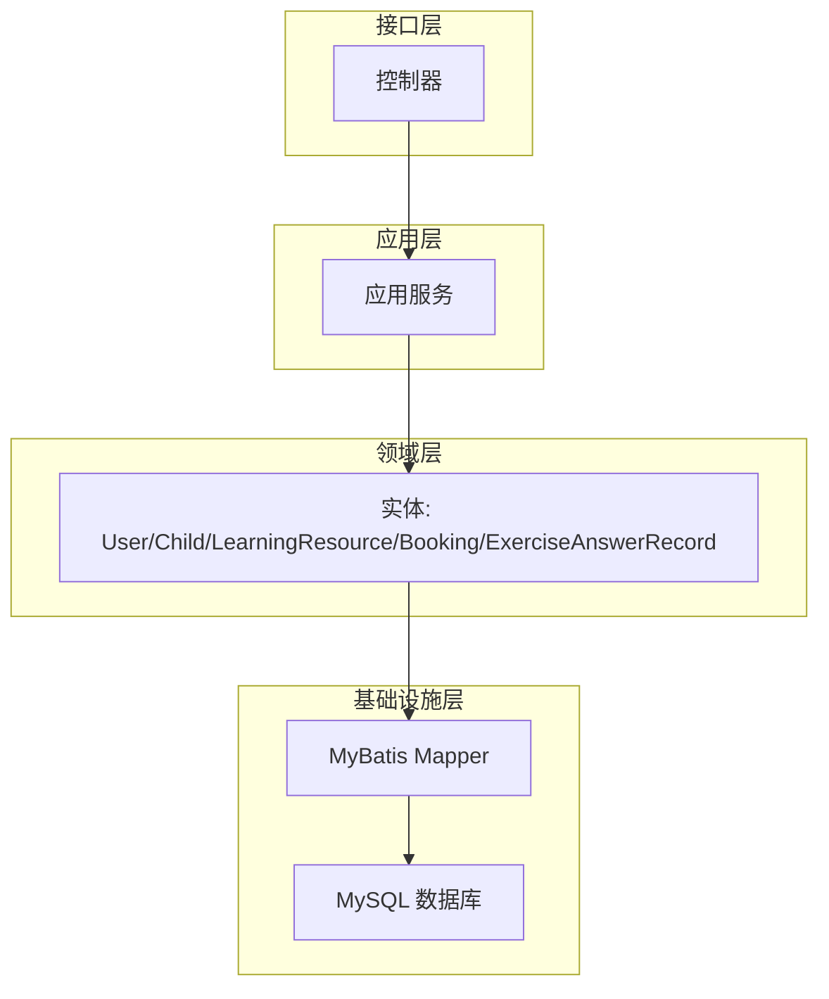
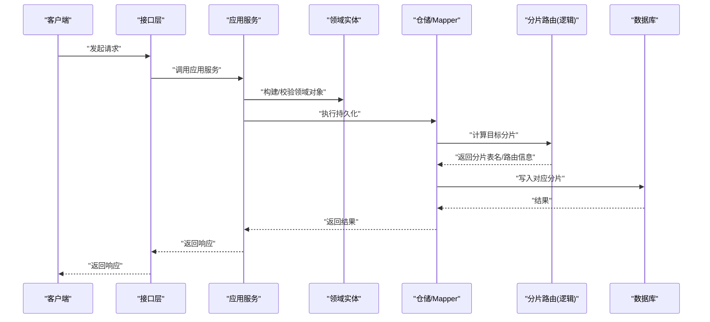
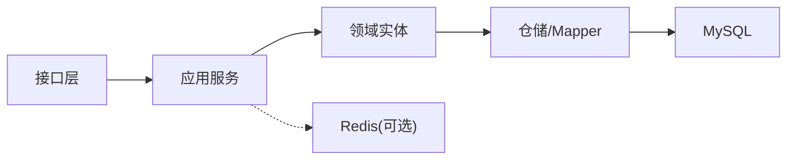
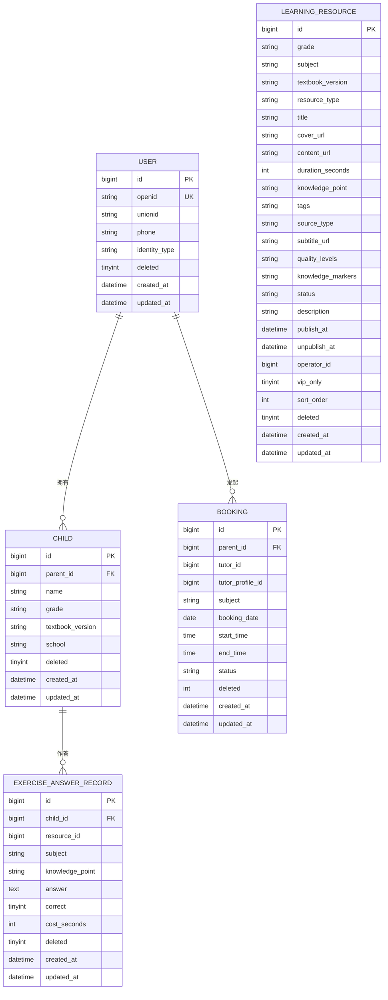

# 水平分表策略

<cite>
**本文引用的文件**
- [t_user.sql](file://wzoto-backend/sql/t_user.sql)
- [t_child.sql](file://wzoto-backend/sql/t_child.sql)
- [t_learning_resource.sql](file://wzoto-backend/sql/t_learning_resource.sql)
- [t_booking.sql](file://wzoto-backend/sql/t_booking.sql)
- [t_exercise_answer_record.sql](file://wzoto-backend/sql/t_exercise_answer_record.sql)
- [User.java](file://wzoto-backend/wzoto-domain/src/main/java/com/wzoto/domain/entity/User.java)
- [Child.java](file://wzoto-backend/wzoto-domain/src/main/java/com/wzoto/domain/entity/Child.java)
- [LearningResource.java](file://wzoto-backend/wzoto-domain/src/main/java/com/wzoto/domain/entity/LearningResource.java)
- [Booking.java](file://wzoto-backend/wzoto-domain/src/main/java/com/wzoto/domain/entity/Booking.java)
- [ExerciseAnswerRecord.java](file://wzoto-backend/wzoto-domain/src/main/java/com/wzoto/domain/entity/ExerciseAnswerRecord.java)
- [application.yml](file://wzoto-backend/wzoto-interfaces/src/main/resources/application.yml)
</cite>

## 目录
1. [引言](#引言)
2. [项目结构](#项目结构)
3. [核心组件](#核心组件)
4. [架构总览](#架构总览)
5. [详细组件分析](#详细组件分析)
6. [依赖分析](#依赖分析)
7. [性能考虑](#性能考虑)
8. [故障排查指南](#故障排查指南)
9. [结论](#结论)
10. [附录](#附录)

## 引言
本文件面向 wzoto 项目的水平分表设计与落地，结合现有数据库表结构与领域实体，给出按用户ID、时间维度、业务类型三种维度的分表策略；阐述哈希取模、范围分片、一致性哈希等分片算法的实现原理与适用性；对比雪花算法、数据库自增、UUID 的全局ID生成方案；设计数据分布策略（倾斜处理、热点处理、扩缩容）；并提供实施步骤（迁移工具、灰度发布、回滚机制），以及示例与性能测试建议。

## 项目结构
wzoto 后端采用分层架构：接口层（Controller）、应用服务层（Application Service）、领域层（Domain Entity/Value Object）、基础设施层（Mapper/Repository）。当前数据库表以单表形式存在，具备清晰的索引与字段语义，为后续水平分表提供良好基础。

图表来源
- [application.yml:19-29](file://wzoto-backend/wzoto-interfaces/src/main/resources/application.yml#L19-L29)

章节来源
- [application.yml:1-51](file://wzoto-backend/wzoto-interfaces/src/main/resources/application.yml#L1-L51)

## 核心组件
- 用户域：t_user、User 实体，主键 id，openid/unionid/phone 等标识，适合按 parent_id/user_id 进行分片。
- 子女域：t_child、Child 实体，parent_id 强关联家长，天然适合按 parent_id 分片。
- 学习资源域：t_learning_resource、LearningResource 实体，按年级/学科/教材版本组织，适合按业务类型或时间归档。
- 预约订单域：t_booking、Booking 实体，包含 booking_date、status 等，适合按时间维度分表。
- 作答记录域：t_exercise_answer_record、ExerciseAnswerRecord 实体，child_id/subject/resource_id，写入量大，适合按 child_id 或时间分片。

章节来源
- [t_user.sql:1-26](file://wzoto-backend/sql/t_user.sql#L1-L26)
- [t_child.sql:1-18](file://wzoto-backend/sql/t_child.sql#L1-L18)
- [t_learning_resource.sql:1-36](file://wzoto-backend/sql/t_learning_resource.sql#L1-L36)
- [t_booking.sql:1-23](file://wzoto-backend/sql/t_booking.sql#L1-L23)
- [t_exercise_answer_record.sql:1-23](file://wzoto-backend/sql/t_exercise_answer_record.sql#L1-L23)
- [User.java:1-93](file://wzoto-backend/wzoto-domain/src/main/java/com/wzoto/domain/entity/User.java#L1-L93)
- [Child.java:1-122](file://wzoto-backend/wzoto-domain/src/main/java/com/wzoto/domain/entity/Child.java#L1-L122)
- [LearningResource.java:1-153](file://wzoto-backend/wzoto-domain/src/main/java/com/wzoto/domain/entity/LearningResource.java#L1-L153)
- [Booking.java:1-114](file://wzoto-backend/wzoto-domain/src/main/java/com/wzoto/domain/entity/Booking.java#L1-L114)
- [ExerciseAnswerRecord.java:1-99](file://wzoto-backend/wzoto-domain/src/main/java/com/wzoto/domain/entity/ExerciseAnswerRecord.java#L1-L99)

## 架构总览
下图展示请求从接口到持久化的路径，并标注未来引入的分片路由位置（逻辑层计算目标分片）。

图表来源
- [application.yml:19-29](file://wzoto-backend/wzoto-interfaces/src/main/resources/application.yml#L19-L29)

## 详细组件分析

### 分表方案设计
- 按用户ID分表
  - 适用场景：用户隔离性强、跨表访问少、读写集中在单一用户的数据，如 t_user、t_child、t_booking、t_exercise_answer_record。
  - 优点：热点分散、查询路径短、易扩容。
  - 风险：跨用户聚合统计需走多分片或额外汇总库。
- 按时间维度分表
  - 适用场景：日志/流水型高写入表，如 t_exercise_answer_record、t_booking（按月份/季度）。
  - 优点：历史数据归档方便、冷热分离、清理成本低。
  - 风险：跨时间段查询复杂，需要路由合并。
- 按业务类型分表
  - 适用场景：资源类表 t_learning_resource，可按 resource_type 或 subject/textbook_version 拆分，便于独立治理与扩展。
  - 优点：业务边界清晰、可独立优化。
  - 风险：跨类型关联查询需跨库/跨表。

章节来源
- [t_child.sql:1-18](file://wzoto-backend/sql/t_child.sql#L1-L18)
- [t_booking.sql:1-23](file://wzoto-backend/sql/t_booking.sql#L1-L23)
- [t_exercise_answer_record.sql:1-23](file://wzoto-backend/sql/t_exercise_answer_record.sql#L1-L23)
- [t_learning_resource.sql:1-36](file://wzoto-backend/sql/t_learning_resource.sql#L1-L36)

### 分片算法
- 哈希取模算法
  - 原理：对分片键（如 user_id/child_id）做 hash 后对分片数取模，确定目标分片。
  - 特点：实现简单、均匀性好；但扩容时大量数据重分布。
  - 适用：用户相关表（t_user、t_child、t_booking、t_exercise_answer_record）。
- 范围分片算法
  - 原理：按分片键范围（如时间区间、ID段）划分分片。
  - 特点：扩容影响小、顺序扫描友好；但可能产生数据倾斜。
  - 适用：时间序列表（t_booking、t_exercise_answer_record 按日期/月）。
- 一致性哈希算法
  - 原理：将节点与数据映射到环上，减少扩容时的数据迁移量。
  - 特点：扩容代价低；实现复杂，需虚拟节点平衡负载。
  - 适用：分布式缓存/消息队列；在数据库分片中较少直接使用，可作为中间路由层策略。

章节来源
- [t_booking.sql:1-23](file://wzoto-backend/sql/t_booking.sql#L1-L23)
- [t_exercise_answer_record.sql:1-23](file://wzoto-backend/sql/t_exercise_answer_record.sql#L1-L23)

### 全局ID生成
- 雪花算法
  - 优点：高性能、有序、唯一；支持分布式。
  - 缺点：时钟回拨需处理；依赖机器时钟。
  - 适用：高并发写场景（作答记录、订单）。
- 数据库自增
  - 优点：简单可靠；天然有序。
  - 缺点：单点瓶颈；跨库难用。
  - 适用：中小规模、读多写少或集中式写入。
- UUID
  - 优点：无中心、生成快。
  - 缺点：无序导致索引碎片；存储开销大。
  - 适用：非主键标识或临时ID。

章节来源
- [t_exercise_answer_record.sql:1-23](file://wzoto-backend/sql/t_exercise_answer_record.sql#L1-L23)
- [t_booking.sql:1-23](file://wzoto-backend/sql/t_booking.sql#L1-L23)

### 数据分布策略
- 数据倾斜处理
  - 识别：监控热点分片QPS/CPU/IO。
  - 手段：二级分片（如 user_id%N + 子分片）、热点Key打散（加盐）、读写分离与缓存。
- 热点数据处理
  - 读热点：Redis 缓存、CDN、只读副本。
  - 写热点：批量写入、异步落盘、分片内局部锁。
- 扩容缩容方案
  - 在线扩容：新增分片→双写→数据迁移→切流→下线旧分片。
  - 缩容：反向流程，确保数据一致性。
  - 一致性：事务补偿、幂等重试、校验对账。

[本节为通用策略说明，不直接引用具体文件]

### 分表示例
- 按用户ID分表
  - t_user → t_user_{0..N-1}，分片键 user_id。
  - t_child → t_child_{0..N-1}，分片键 parent_id。
  - t_booking → t_booking_{0..N-1}，分片键 parent_id。
  - t_exercise_answer_record → t_exercise_answer_record_{0..N-1}，分片键 child_id。
- 按时间维度分表
  - t_booking → t_booking_YYYYMM，分片键 booking_date。
  - t_exercise_answer_record → t_exercise_answer_record_YYYYMM，分片键 created_at。
- 按业务类型分表
  - t_learning_resource → t_learning_resource_video / _exercise / _pdf / _question，或按 subject/textbook_version 拆分。

章节来源
- [t_user.sql:1-26](file://wzoto-backend/sql/t_user.sql#L1-L26)
- [t_child.sql:1-18](file://wzoto-backend/sql/t_child.sql#L1-L18)
- [t_booking.sql:1-23](file://wzoto-backend/sql/t_booking.sql#L1-L23)
- [t_exercise_answer_record.sql:1-23](file://wzoto-backend/sql/t_exercise_answer_record.sql#L1-L23)
- [t_learning_resource.sql:1-36](file://wzoto-backend/sql/t_learning_resource.sql#L1-L36)

### 实施步骤
- 数据迁移工具
  - 增量同步：基于 binlog 的CDC工具（如 Canal/Debezium）+ 目标分片库。
  - 全量迁移：分批导出导入，断点续传，数据校验（行数/校验和）。
  - 双写阶段：新旧库同时写入，保证一致性与可回滚。
- 灰度发布策略
  - 流量灰度：按用户ID尾号或白名单逐步放量。
  - 功能开关：配置中心控制分片开关与路由规则。
  - 观测指标：延迟、错误率、命中率、慢查询。
- 回滚机制设计
  - 快速回切：保留旧库只读，切换路由至旧库。
  - 数据补偿：差异比对与修复脚本。
  - 幂等保障：重复写入安全。

[本节为通用实施指导，不直接引用具体文件]

### 性能测试建议
- 压测目标
  - 写入吞吐：作答记录、订单创建。
  - 读取延迟：用户档案、资源列表。
  - 热点场景：热门资源/教员预约。
- 指标采集
  - QPS、P95/P99 延迟、CPU/内存/IO、连接池使用率、慢SQL。
- 基准参考
  - 单机 MySQL 单表百万级写入：约数千 TPS（视硬件与索引而定）。
  - 分片后线性扩展：关注路由与跨分片查询成本。
- 工具与方法
  - JMeter/Locust 压测；Prometheus/Grafana 监控；A/B 对比不同分片策略。

[本节为通用性能指导，不直接引用具体文件]

## 依赖分析
- 模块耦合
  - 接口层依赖应用服务；应用服务依赖领域实体；仓储依赖 MyBatis 与数据库。
- 外部依赖
  - MySQL 驱动、MyBatis-Plus、Redis（可选用于缓存/会话）。
- 潜在循环依赖
  - 当前分层清晰，未见循环依赖迹象。

图表来源
- [application.yml:19-29](file://wzoto-backend/wzoto-interfaces/src/main/resources/application.yml#L19-L29)

章节来源
- [application.yml:1-51](file://wzoto-backend/wzoto-interfaces/src/main/resources/application.yml#L1-L51)

## 性能考虑
- 索引优化：为高频查询列建立复合索引（如 child_id+subject、booking_date+status）。
- 分页与排序：避免深分页，使用游标或覆盖索引。
- 连接池与批处理：合理设置最大连接数，批量插入提升吞吐。
- 读写分离：读多写少场景启用只读副本。
- 缓存策略：热点数据入 Redis，注意过期与一致性。

[本节为通用性能建议，不直接引用具体文件]

## 故障排查指南
- 常见问题
  - 路由错误：检查分片键取值与路由规则是否匹配。
  - 数据不一致：核对双写与迁移阶段的幂等与补偿。
  - 热点过载：定位热点分片，增加缓存或二次分片。
- 诊断方法
  - 慢查询日志：定位热点SQL。
  - 监控告警：CPU/IO/连接数阈值告警。
  - 链路追踪：端到端耗时分析。
- 恢复策略
  - 降级：关闭非核心功能，保护主链路。
  - 回滚：切换路由至旧库，执行数据修复脚本。

[本节为通用故障排查建议，不直接引用具体文件]

## 结论
wzoto 当前表结构具备良好的分表基础。建议优先对用户相关表采用按用户ID分片，对时序写入表采用按时间维度分片，资源类表按业务类型分片以提升治理效率。配合合适的分片算法、全局ID策略与数据分布策略，可在保证一致性的前提下实现弹性扩展与稳定性能。

[本节为总结性内容，不直接引用具体文件]

## 附录
- 关键实体关系概览

图表来源
- [t_user.sql:1-26](file://wzoto-backend/sql/t_user.sql#L1-L26)
- [t_child.sql:1-18](file://wzoto-backend/sql/t_child.sql#L1-L18)
- [t_booking.sql:1-23](file://wzoto-backend/sql/t_booking.sql#L1-L23)
- [t_exercise_answer_record.sql:1-23](file://wzoto-backend/sql/t_exercise_answer_record.sql#L1-L23)
- [t_learning_resource.sql:1-36](file://wzoto-backend/sql/t_learning_resource.sql#L1-L36)