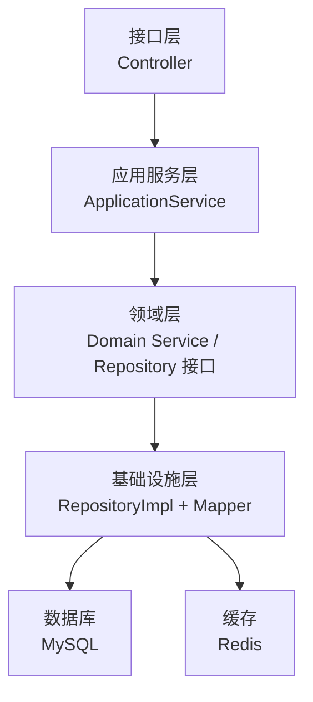
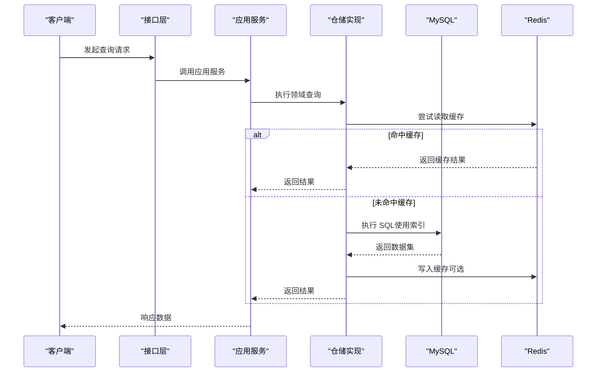
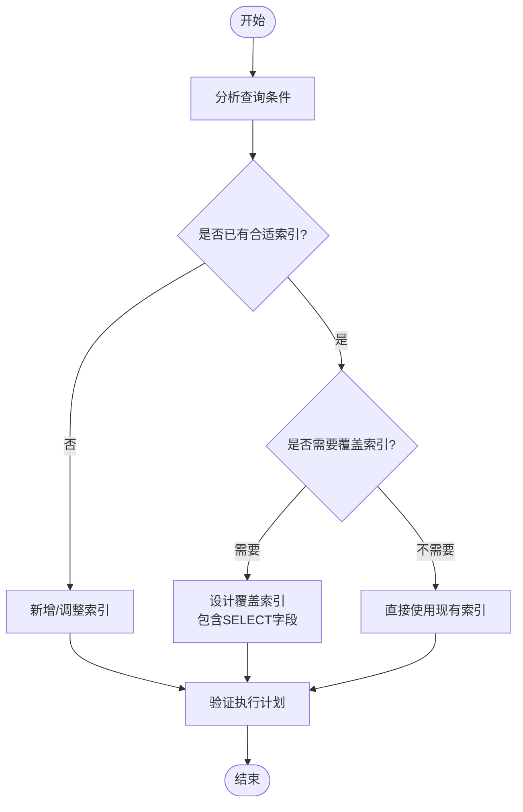
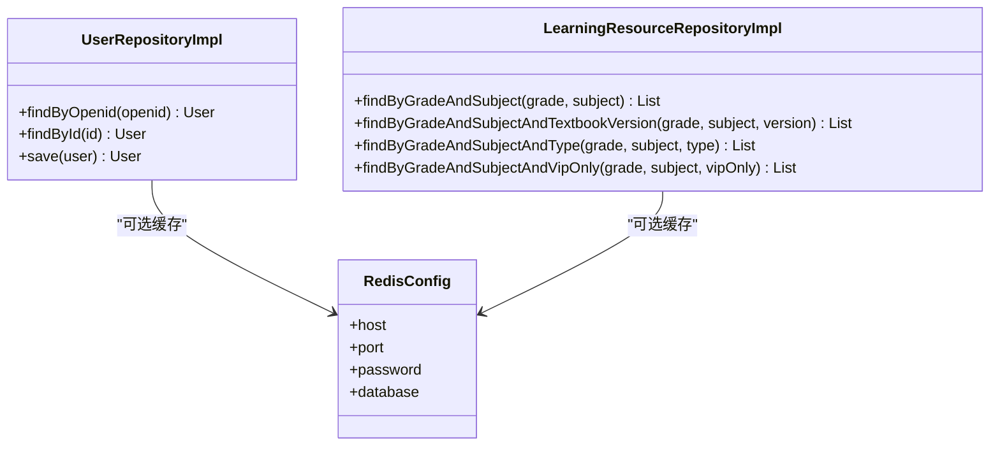
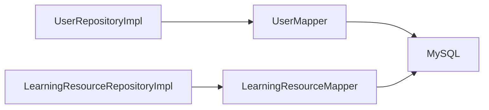

# 性能优化策略

<cite>
**本文引用的文件**
- [application.yml](file://wzoto-backend/wzoto-interfaces/src/main/resources/application.yml)
- [t_user.sql](file://wzoto-backend/sql/t_user.sql)
- [t_child.sql](file://wzoto-backend/sql/t_child.sql)
- [t_learning_resource.sql](file://wzoto-backend/sql/t_learning_resource.sql)
- [init_all_learning_tables.sql](file://wzoto-backend/sql/init_all_learning_tables.sql)
- [UserRepositoryImpl.java](file://wzoto-backend/wzoto-infrastructure/src/main/java/com/wzoto/infrastructure/repository/UserRepositoryImpl.java)
- [LearningResourceRepositoryImpl.java](file://wzoto-backend/wzoto-infrastructure/src/main/java/com/wzoto/infrastructure/repository/LearningResourceRepositoryImpl.java)
</cite>

## 目录
1. [简介](#简介)
2. [项目结构](#项目结构)
3. [核心组件](#核心组件)
4. [架构总览](#架构总览)
5. [详细组件分析](#详细组件分析)
6. [依赖关系分析](#依赖关系分析)
7. [性能考量](#性能考量)
8. [故障排查指南](#故障排查指南)
9. [结论](#结论)
10. [附录](#附录)

## 简介
本文件面向 wzoto 项目的数据库性能优化，围绕索引设计、查询优化、分库分表与读写分离、缓存策略、大数据量处理以及监控诊断等方面，给出可落地的方案与落地建议。内容基于仓库中的 DDL、仓储实现与配置进行解读，并结合常见业务场景提供实践路径与效果对比思路。

## 项目结构
- 数据访问层采用 MyBatis-Plus + Mapper 的方式，仓储实现类封装了领域实体与持久化对象之间的转换与查询构造。
- 数据库脚本集中在 sql 目录，包含用户、子女档案、学习资源等核心表的 DDL 与初始化脚本。
- 应用配置在 application.yml 中，定义了 MySQL 连接、Redis 连接、MyBatis-Plus 全局配置与日志级别。

**图表来源**
- [application.yml:6-17](file://wzoto-backend/wzoto-interfaces/src/main/resources/application.yml#L6-L17)
- [UserRepositoryImpl.java:20-34](file://wzoto-backend/wzoto-infrastructure/src/main/java/com/wzoto/infrastructure/repository/UserRepositoryImpl.java#L20-L34)
- [LearningResourceRepositoryImpl.java:20-44](file://wzoto-backend/wzoto-infrastructure/src/main/java/com/wzoto/infrastructure/repository/LearningResourceRepositoryImpl.java#L20-L44)

**章节来源**
- [application.yml:6-17](file://wzoto-backend/wzoto-interfaces/src/main/resources/application.yml#L6-L17)
- [init_all_learning_tables.sql:18-27](file://wzoto-backend/sql/init_all_learning_tables.sql#L18-L27)

## 核心组件
- 用户模块：用户表 t_user 定义主键与常用查询索引；仓储实现提供按 openid、id、昵称等查询能力。
- 学习资源模块：t_learning_resource 表针对年级、学科、教材版本、资源类型、VIP 可见性等维度建立复合/单列索引；仓储实现提供按年级+学科、年级+学科+教材版本、年级+学科+资源类型、年级+学科+VIP 等查询。
- 子女档案模块：t_child 表通过 parent_id、grade 建立索引以支撑家长端列表与筛选。

**章节来源**
- [t_user.sql:8-25](file://wzoto-backend/sql/t_user.sql#L8-L25)
- [t_learning_resource.sql:4-35](file://wzoto-backend/sql/t_learning_resource.sql#L4-L35)
- [t_child.sql:4-17](file://wzoto-backend/sql/t_child.sql#L4-L17)
- [UserRepositoryImpl.java:27-83](file://wzoto-backend/wzoto-infrastructure/src/main/java/com/wzoto/infrastructure/repository/UserRepositoryImpl.java#L27-L83)
- [LearningResourceRepositoryImpl.java:40-81](file://wzoto-backend/wzoto-infrastructure/src/main/java/com/wzoto/infrastructure/repository/LearningResourceRepositoryImpl.java#L40-L81)

## 架构总览
下图展示从请求到数据访问的调用链，突出仓储层对 MyBatis-Plus 查询构造的使用，以及与数据库和缓存的交互点。

**图表来源**
- [UserRepositoryImpl.java:27-34](file://wzoto-backend/wzoto-infrastructure/src/main/java/com/wzoto/infrastructure/repository/UserRepositoryImpl.java#L27-L34)
- [LearningResourceRepositoryImpl.java:40-81](file://wzoto-backend/wzoto-infrastructure/src/main/java/com/wzoto/infrastructure/repository/LearningResourceRepositoryImpl.java#L40-L81)
- [application.yml:6-17](file://wzoto-backend/wzoto-interfaces/src/main/resources/application.yml#L6-L17)

## 详细组件分析

### 索引优化策略
- 主键设计
  - 所有核心表均使用自增 BIGINT 主键，便于顺序插入与范围扫描。
  - 逻辑删除字段统一为 deleted，配合 MyBatis-Plus 全局配置自动过滤已删除记录。
- 复合索引
  - 学习资源表针对高频查询“年级+学科”建立复合索引 idx_grade_subject，并辅以 textbook_version、resource_type、vip_only、knowledge_point 等单列索引，覆盖多条件组合查询。
  - 子女档案表通过 idx_parent_id、idx_grade 支持家长端按家长与年级筛选。
- 覆盖索引
  - 对于仅返回少量字段的列表查询，可通过只选择必要字段或构建覆盖索引减少回表，降低 IO 成本。
  - 建议在排序字段（如 sort_order、created_at）参与查询时，将排序字段纳入索引尾部以提升排序效率。

**图表来源**
- [t_learning_resource.sql:30-34](file://wzoto-backend/sql/t_learning_resource.sql#L30-L34)
- [t_child.sql:15-16](file://wzoto-backend/sql/t_child.sql#L15-L16)
- [application.yml:19-29](file://wzoto-backend/wzoto-interfaces/src/main/resources/application.yml#L19-L29)

**章节来源**
- [t_user.sql:8-25](file://wzoto-backend/sql/t_user.sql#L8-L25)
- [t_learning_resource.sql:4-35](file://wzoto-backend/sql/t_learning_resource.sql#L4-L35)
- [t_child.sql:4-17](file://wzoto-backend/sql/t_child.sql#L4-L17)
- [application.yml:19-29](file://wzoto-backend/wzoto-interfaces/src/main/resources/application.yml#L19-L29)

### 查询优化技术
- 慢查询分析
  - 开启 MyBatis-Plus SQL 日志输出，结合数据库慢查询日志定位热点 SQL。
  - 使用 EXPLAIN/EXPLAIN ANALYZE 检查索引使用情况、扫描行数与临时表/文件排序。
- 执行计划优化
  - 确保 WHERE 条件与索引前导列一致，避免函数包裹导致索引失效。
  - 对 ORDER BY 与 GROUP BY 字段建立合适索引，减少排序开销。
- SQL 重写技巧
  - 避免 SELECT *，仅选择必要字段以减少网络传输与内存占用。
  - 将复杂条件拆分为多次简单查询，必要时引入中间表或物化视图。
  - 分页查询使用“延迟关联”或“游标分页”，避免深页全表扫描。

**章节来源**
- [application.yml:19-23](file://wzoto-backend/wzoto-interfaces/src/main/resources/application.yml#L19-L23)
- [UserRepositoryImpl.java:27-34](file://wzoto-backend/wzoto-infrastructure/src/main/java/com/wzoto/infrastructure/repository/UserRepositoryImpl.java#L27-L34)
- [LearningResourceRepositoryImpl.java:40-81](file://wzoto-backend/wzoto-infrastructure/src/main/java/com/wzoto/infrastructure/repository/LearningResourceRepositoryImpl.java#L40-L81)

### 分库分表与读写分离
- 水平分表
  - 学习资源表可按年级或学科进行水平拆分，缓解单表数据增长带来的写入与查询压力。
  - 子表命名规范与路由键需与查询条件一致，保证路由命中率。
- 垂直分表
  - 将大字段（如 content_url、tags、quality_levels、knowledge_markers）抽离至扩展表，减少主表行宽，提升缓存命中率。
- 读写分离
  - 读多写少场景可采用主从复制，将报表、列表查询路由到从库，减轻主库压力。
  - 注意事务内写后读的一致性要求，必要时强制走主库。

**章节来源**
- [t_learning_resource.sql:4-35](file://wzoto-backend/sql/t_learning_resource.sql#L4-L35)
- [application.yml:6-17](file://wzoto-backend/wzoto-interfaces/src/main/resources/application.yml#L6-L17)

### 缓存策略设计
- Redis 缓存
  - 配置已启用 Redis 连接，可在仓储层增加缓存层：热点用户信息、课程目录、知识点树等。
  - 缓存键设计需包含租户/用户上下文与查询维度，避免脏读。
- 查询缓存
  - 对不可变或低频变更的数据（如教材版本、年级枚举）做短期缓存，设置合理过期时间。
- 结果缓存
  - 对聚合统计、排行榜等重计算结果进行缓存，采用异步刷新与版本号控制一致性。

**图表来源**
- [UserRepositoryImpl.java:20-83](file://wzoto-backend/wzoto-infrastructure/src/main/java/com/wzoto/infrastructure/repository/UserRepositoryImpl.java#L20-L83)
- [LearningResourceRepositoryImpl.java:20-81](file://wzoto-backend/wzoto-infrastructure/src/main/java/com/wzoto/infrastructure/repository/LearningResourceRepositoryImpl.java#L20-L81)
- [application.yml:12-17](file://wzoto-backend/wzoto-interfaces/src/main/resources/application.yml#L12-L17)

**章节来源**
- [application.yml:12-17](file://wzoto-backend/wzoto-interfaces/src/main/resources/application.yml#L12-L17)
- [UserRepositoryImpl.java:27-34](file://wzoto-backend/wzoto-infrastructure/src/main/java/com/wzoto/infrastructure/repository/UserRepositoryImpl.java#L27-L34)
- [LearningResourceRepositoryImpl.java:40-81](file://wzoto-backend/wzoto-infrastructure/src/main/java/com/wzoto/infrastructure/repository/LearningResourceRepositoryImpl.java#L40-L81)

### 大数据量处理
- 分页查询优化
  - 使用基于主键或唯一索引的分页，避免深页 OFFSET 导致的扫描放大。
  - 对列表页采用“最后一条记录 ID”游标分页，提升稳定性。
- 批量操作
  - 批量插入/更新时使用分批提交，控制单次事务大小，避免锁竞争与长事务。
- 异步处理
  - 对耗时任务（如资源导入、报告生成）采用消息队列异步处理，解耦主流程。

**章节来源**
- [LearningResourceRepositoryImpl.java:40-81](file://wzoto-backend/wzoto-infrastructure/src/main/java/com/wzoto/infrastructure/repository/LearningResourceRepositoryImpl.java#L40-L81)
- [UserRepositoryImpl.java:42-64](file://wzoto-backend/wzoto-infrastructure/src/main/java/com/wzoto/infrastructure/repository/UserRepositoryImpl.java#L42-L64)

### 监控与诊断工具
- 指标收集
  - 开启 MyBatis-Plus SQL 日志，结合数据库慢查询日志收集热点 SQL。
  - 采集 QPS、RT、P99、错误率、连接池使用率等关键指标。
- 瓶颈识别
  - 通过 EXPLAIN 分析索引命中、扫描行数、临时表与文件排序。
  - 观察 CPU、IO、锁等待与长事务，定位热点表与热点行。
- 容量规划
  - 根据数据增长率评估分库分表时机，预留扩容空间。
  - 对冷热数据分层存储，归档历史数据。

**章节来源**
- [application.yml:19-23](file://wzoto-backend/wzoto-interfaces/src/main/resources/application.yml#L19-L23)
- [t_learning_resource.sql:4-35](file://wzoto-backend/sql/t_learning_resource.sql#L4-L35)

## 依赖关系分析
仓储实现依赖 MyBatis-Plus 的 LambdaQueryWrapper 构造查询，并通过 Mapper 执行 SQL。DDL 中的索引设计与查询条件相匹配，形成稳定的数据访问路径。

**图表来源**
- [UserRepositoryImpl.java:20-34](file://wzoto-backend/wzoto-infrastructure/src/main/java/com/wzoto/infrastructure/repository/UserRepositoryImpl.java#L20-L34)
- [LearningResourceRepositoryImpl.java:20-44](file://wzoto-backend/wzoto-infrastructure/src/main/java/com/wzoto/infrastructure/repository/LearningResourceRepositoryImpl.java#L20-L44)

**章节来源**
- [UserRepositoryImpl.java:20-83](file://wzoto-backend/wzoto-infrastructure/src/main/java/com/wzoto/infrastructure/repository/UserRepositoryImpl.java#L20-L83)
- [LearningResourceRepositoryImpl.java:20-81](file://wzoto-backend/wzoto-infrastructure/src/main/java/com/wzoto/infrastructure/repository/LearningResourceRepositoryImpl.java#L20-L81)

## 性能考量
- 索引维护成本：过多索引会增加写入与更新开销，需权衡读多写少的场景。
- 缓存一致性：缓存失效策略与并发更新需考虑，避免脏读与雪崩。
- 分页深度：深页分页应改用游标或基于索引的翻页，避免全表扫描。
- 事务边界：长事务会放大锁竞争，尽量缩短事务范围。
- 连接池与超时：合理配置连接池大小与超时时间，避免连接耗尽。

[本节为通用指导，不直接分析具体文件]

## 故障排查指南
- 常见问题
  - 索引未命中：检查 WHERE 条件是否与索引前导列匹配，避免函数包裹或隐式类型转换。
  - 慢查询：结合 EXPLAIN 分析扫描行数、临时表与文件排序，优化 SQL 或索引。
  - 缓存穿透/击穿：对空结果也缓存短时效值，加互斥锁防止缓存击穿。
- 定位步骤
  - 开启 SQL 日志，捕获慢查询。
  - 使用 EXPLAIN 分析执行计划。
  - 检查索引设计与查询条件一致性。
  - 评估缓存策略与失效机制。

**章节来源**
- [application.yml:19-23](file://wzoto-backend/wzoto-interfaces/src/main/resources/application.yml#L19-L23)
- [t_learning_resource.sql:30-34](file://wzoto-backend/sql/t_learning_resource.sql#L30-L34)

## 结论
通过对索引设计、查询优化、分库分表、缓存策略与大数据量处理的系统性优化，可显著提升 wzoto 数据库的性能与可扩展性。建议以实际业务流量与数据规模为驱动，逐步落地上述方案，并通过监控与诊断持续迭代优化。

[本节为总结性内容，不直接分析具体文件]

## 附录
- 参考脚本与实现
  - 学习资源相关表初始化脚本：[init_all_learning_tables.sql:18-27](file://wzoto-backend/sql/init_all_learning_tables.sql#L18-L27)
  - 用户表 DDL：[t_user.sql:8-25](file://wzoto-backend/sql/t_user.sql#L8-L25)
  - 子女档案表 DDL：[t_child.sql:4-17](file://wzoto-backend/sql/t_child.sql#L4-L17)
  - 学习资源表 DDL：[t_learning_resource.sql:4-35](file://wzoto-backend/sql/t_learning_resource.sql#L4-L35)
  - 用户仓储实现：[UserRepositoryImpl.java:20-83](file://wzoto-backend/wzoto-infrastructure/src/main/java/com/wzoto/infrastructure/repository/UserRepositoryImpl.java#L20-L83)
  - 学习资源仓储实现：[LearningResourceRepositoryImpl.java:20-81](file://wzoto-backend/wzoto-infrastructure/src/main/java/com/wzoto/infrastructure/repository/LearningResourceRepositoryImpl.java#L20-L81)
  - 应用配置（MySQL/Redis/MyBatis-Plus）：[application.yml:6-29](file://wzoto-backend/wzoto-interfaces/src/main/resources/application.yml#L6-L29)

**章节来源**
- [init_all_learning_tables.sql:18-27](file://wzoto-backend/sql/init_all_learning_tables.sql#L18-L27)
- [t_user.sql:8-25](file://wzoto-backend/sql/t_user.sql#L8-L25)
- [t_child.sql:4-17](file://wzoto-backend/sql/t_child.sql#L4-L17)
- [t_learning_resource.sql:4-35](file://wzoto-backend/sql/t_learning_resource.sql#L4-L35)
- [UserRepositoryImpl.java:20-83](file://wzoto-backend/wzoto-infrastructure/src/main/java/com/wzoto/infrastructure/repository/UserRepositoryImpl.java#L20-L83)
- [LearningResourceRepositoryImpl.java:20-81](file://wzoto-backend/wzoto-infrastructure/src/main/java/com/wzoto/infrastructure/repository/LearningResourceRepositoryImpl.java#L20-L81)
- [application.yml:6-29](file://wzoto-backend/wzoto-interfaces/src/main/resources/application.yml#L6-L29)