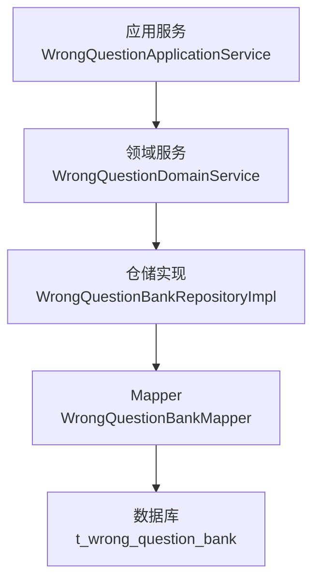
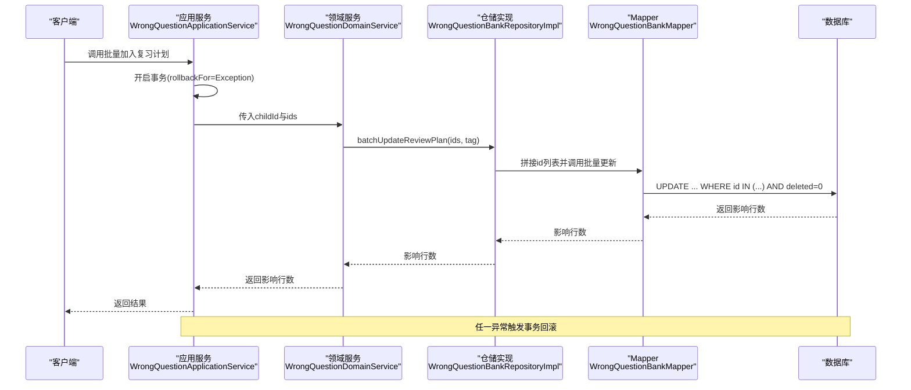
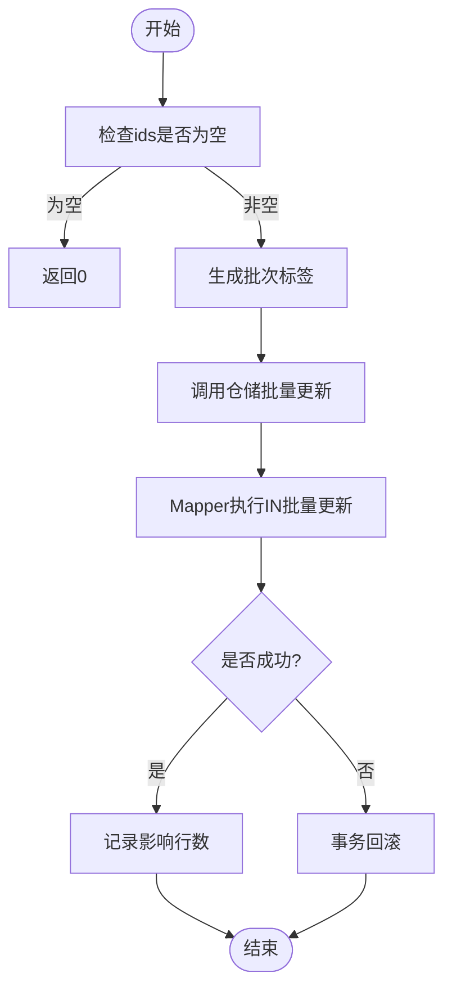
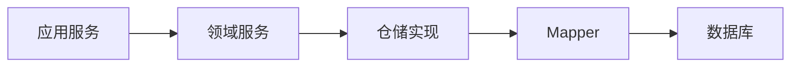

# 批量操作优化

<cite>
**本文引用的文件**
- [WrongQuestionBankRepositoryImpl.java](file://wzoto-backend/wzoto-infrastructure/src/main/java/com/wzoto/infrastructure/repository/WrongQuestionBankRepositoryImpl.java)
- [WrongQuestionBankMapper.java](file://wzoto-backend/wzoto-infrastructure/src/main/java/com/wzoto/infrastructure/mapper/WrongQuestionBankMapper.java)
- [WrongQuestionDomainService.java](file://wzoto-backend/wzoto-domain/src/main/java/com/wzoto/domain/service/WrongQuestionDomainService.java)
- [WrongQuestionApplicationService.java](file://wzoto-backend/wzoto-application/src/main/java/com/wzoto/application/service/WrongQuestionApplicationService.java)
- [application.yml](file://wzoto-backend/wzoto-interfaces/src/main/resources/application.yml)
- [pom.xml](file://wzoto-backend/pom.xml)
</cite>

## 目录
1. [简介](#简介)
2. [项目结构](#项目结构)
3. [核心组件](#核心组件)
4. [架构总览](#架构总览)
5. [详细组件分析](#详细组件分析)
6. [依赖关系分析](#依赖关系分析)
7. [性能考量](#性能考量)
8. [故障排查指南](#故障排查指南)
9. [结论](#结论)
10. [附录](#附录)

## 简介
本文件围绕 wzoto 后端的批量操作优化展开，聚焦于 MyBatis-Plus 的批量能力、事务批处理策略、大数据量处理方案以及 SQL 合并执行与索引、锁竞争等优化要点。文档以“错题管理”中的“批量加入复习计划”为切入点，结合仓储层、领域服务与应用服务的协作流程，给出可落地的最佳实践与调优建议。

## 项目结构
后端采用分层架构：接口层（Controller）→ 应用服务层 → 领域服务层 → 基础设施层（MyBatis-Plus Mapper/PO）。批量写入路径从应用服务进入，经领域服务编排，最终由仓储实现调用 Mapper 执行批量更新。

图表来源
- [WrongQuestionApplicationService.java:28-32](file://wzoto-backend/wzoto-application/src/main/java/com/wzoto/application/service/WrongQuestionApplicationService.java#L28-L32)
- [WrongQuestionDomainService.java:45-53](file://wzoto-backend/wzoto-domain/src/main/java/com/wzoto/domain/service/WrongQuestionDomainService.java#L45-L53)
- [WrongQuestionBankRepositoryImpl.java:83-94](file://wzoto-backend/wzoto-infrastructure/src/main/java/com/wzoto/infrastructure/repository/WrongQuestionBankRepositoryImpl.java#L83-L94)
- [WrongQuestionBankMapper.java:17-19](file://wzoto-backend/wzoto-infrastructure/src/main/java/com/wzoto/infrastructure/mapper/WrongQuestionBankMapper.java#L17-L19)

章节来源
- [pom.xml:21-26](file://wzoto-backend/pom.xml#L21-L26)
- [application.yml:19-29](file://wzoto-backend/wzoto-interfaces/src/main/resources/application.yml#L19-L29)

## 核心组件
- 应用服务：提供事务边界与对外方法入口，封装业务上下文（如当前用户ID），并调用领域服务完成批量操作。
- 领域服务：承载业务规则与编排逻辑，负责参数校验、生成批次标签、聚合结果日志等。
- 仓储实现：将领域对象转换为持久化对象，组织批量参数并调用 Mapper。
- Mapper：定义批量 SQL，通过 IN 列表进行批量更新。

章节来源
- [WrongQuestionApplicationService.java:28-32](file://wzoto-backend/wzoto-application/src/main/java/com/wzoto/application/service/WrongQuestionApplicationService.java#L28-L32)
- [WrongQuestionDomainService.java:45-53](file://wzoto-backend/wzoto-domain/src/main/java/com/wzoto/domain/service/WrongQuestionDomainService.java#L45-L53)
- [WrongQuestionBankRepositoryImpl.java:83-94](file://wzoto-backend/wzoto-infrastructure/src/main/java/com/wzoto/infrastructure/repository/WrongQuestionBankRepositoryImpl.java#L83-L94)
- [WrongQuestionBankMapper.java:17-19](file://wzoto-backend/wzoto-infrastructure/src/main/java/com/wzoto/infrastructure/mapper/WrongQuestionBankMapper.java#L17-L19)

## 架构总览
下图展示了“批量加入复习计划”的完整调用链与数据流向，体现事务边界在应用服务层，批量 SQL 在 Mapper 层执行。

图表来源
- [WrongQuestionApplicationService.java:28-32](file://wzoto-backend/wzoto-application/src/main/java/com/wzoto/application/service/WrongQuestionApplicationService.java#L28-L32)
- [WrongQuestionDomainService.java:45-53](file://wzoto-backend/wzoto-domain/src/main/java/com/wzoto/domain/service/WrongQuestionDomainService.java#L45-L53)
- [WrongQuestionBankRepositoryImpl.java:83-94](file://wzoto-backend/wzoto-infrastructure/src/main/java/com/wzoto/infrastructure/repository/WrongQuestionBankRepositoryImpl.java#L83-L94)
- [WrongQuestionBankMapper.java:17-19](file://wzoto-backend/wzoto-infrastructure/src/main/java/com/wzoto/infrastructure/mapper/WrongQuestionBankMapper.java#L17-L19)

## 详细组件分析

### 批量更新流程（错题复习计划）
- 应用服务：使用 @Transactional(rollbackFor = Exception.class) 声明事务边界，确保批量更新失败时整体回滚。
- 领域服务：生成批次标签（基于日期），调用仓储执行批量更新，并记录日志。
- 仓储实现：对 ids 进行空值过滤与拼接，避免空 IN 列表；当无有效 ID 时直接返回 0。
- Mapper：使用 UPDATE ... WHERE id IN (${ids}) AND deleted=0 进行批量更新，利用逻辑删除字段保证只更新未删除记录。

图表来源
- [WrongQuestionDomainService.java:45-53](file://wzoto-backend/wzoto-domain/src/main/java/com/wzoto/domain/service/WrongQuestionDomainService.java#L45-L53)
- [WrongQuestionBankRepositoryImpl.java:83-94](file://wzoto-backend/wzoto-infrastructure/src/main/java/com/wzoto/infrastructure/repository/WrongQuestionBankRepositoryImpl.java#L83-L94)
- [WrongQuestionBankMapper.java:17-19](file://wzoto-backend/wzoto-infrastructure/src/main/java/com/wzoto/infrastructure/mapper/WrongQuestionBankMapper.java#L17-L19)
- [WrongQuestionApplicationService.java:28-32](file://wzoto-backend/wzoto-application/src/main/java/com/wzoto/application/service/WrongQuestionApplicationService.java#L28-L32)

章节来源
- [WrongQuestionApplicationService.java:28-32](file://wzoto-backend/wzoto-application/src/main/java/com/wzoto/application/service/WrongQuestionApplicationService.java#L28-L32)
- [WrongQuestionDomainService.java:45-53](file://wzoto-backend/wzoto-domain/src/main/java/com/wzoto/domain/service/WrongQuestionDomainService.java#L45-L53)
- [WrongQuestionBankRepositoryImpl.java:83-94](file://wzoto-backend/wzoto-infrastructure/src/main/java/com/wzoto/infrastructure/repository/WrongQuestionBankRepositoryImpl.java#L83-L94)
- [WrongQuestionBankMapper.java:17-19](file://wzoto-backend/wzoto-infrastructure/src/main/java/com/wzoto/infrastructure/mapper/WrongQuestionBankMapper.java#L17-L19)

### MyBatis-Plus 批量插入与批量更新技巧
- 批量插入：可使用 MyBatis-Plus 提供的 saveBatch 方法，适合一次性插入大量记录；注意控制批次大小以避免单次 SQL 过大导致内存或网络压力。
- 批量更新：对于按主键集合更新的场景，可通过自定义 Mapper 的 IN 语句实现高效批量更新；若需条件更新，可结合 UpdateWrapper 或 XML 中动态 SQL。
- 逻辑删除：项目中启用逻辑删除（deleted 字段），批量更新时需显式包含 deleted=0 条件，避免误改已删除记录。

章节来源
- [application.yml:24-29](file://wzoto-backend/wzoto-interfaces/src/main/resources/application.yml#L24-L29)
- [WrongQuestionBankMapper.java:17-19](file://wzoto-backend/wzoto-infrastructure/src/main/java/com/wzoto/infrastructure/mapper/WrongQuestionBankMapper.java#L17-L19)

### 事务批处理：边界、提交与回滚
- 事务边界：在应用服务方法上标注 @Transactional(rollbackFor = Exception.class)，确保任何运行时异常均触发回滚。
- 批量提交策略：当前实现为单条事务内执行一次批量更新；对于超大数据集，建议在应用层分片（如每批固定数量）并在外层循环分批提交，以降低长事务风险。
- 回滚机制：任何步骤抛出异常（包括 Mapper 执行异常）都会使事务回滚，保证数据一致性。

章节来源
- [WrongQuestionApplicationService.java:28-32](file://wzoto-backend/wzoto-application/src/main/java/com/wzoto/application/service/WrongQuestionApplicationService.java#L28-L32)

### 大数据量处理：分片、内存与监控
- 分批次处理：在应用层对 ids 进行分片（例如每批 500~1000 条），逐批调用仓储执行，避免单次 IN 列表过长。
- 内存管理：避免一次性加载全部实体到内存；仅传递必要的主键集合，减少 PO/Entity 转换开销。
- 性能监控：通过日志记录每批影响行数与耗时，结合数据库慢查询日志定位瓶颈。

[本节为通用指导，不直接分析具体文件]

### 批量操作优化：SQL 合并、索引与锁竞争
- SQL 合并执行：使用 IN 列表合并多条更新为一次 SQL，显著降低往返次数与解析成本。
- 索引影响：确保 id 为主键索引；若存在高频过滤字段（如 child_id、subject），应评估是否建立合适索引以提升查询效率。
- 锁竞争避免：尽量缩小事务范围，避免在事务中进行长时间计算；必要时采用乐观锁或分段更新以减少行锁冲突。

[本节为通用指导，不直接分析具体文件]

### 最佳实践：批次大小、错误处理与重试
- 批次大小调优：根据数据库连接池、网络延迟与 SQL 复杂度，调整每批大小；通常 500~1000 较为平衡。
- 错误处理：捕获并记录异常，区分可重试与不可重试错误；对网络抖动或瞬时锁等待可采用有限次重试。
- 重试机制：对幂等的批量更新可引入指数退避重试；对非幂等操作需谨慎设计去重与补偿。

[本节为通用指导，不直接分析具体文件]

## 依赖关系分析
- 模块依赖：应用服务依赖领域服务，领域服务依赖仓储接口，仓储实现依赖 Mapper。
- 外部依赖：MyBatis-Plus 提供基础 CRUD 与配置；Spring 事务管理提供事务边界。

图表来源
- [pom.xml:21-26](file://wzoto-backend/pom.xml#L21-L26)
- [WrongQuestionApplicationService.java:28-32](file://wzoto-backend/wzoto-application/src/main/java/com/wzoto/application/service/WrongQuestionApplicationService.java#L28-L32)
- [WrongQuestionDomainService.java:45-53](file://wzoto-backend/wzoto-domain/src/main/java/com/wzoto/domain/service/WrongQuestionDomainService.java#L45-L53)
- [WrongQuestionBankRepositoryImpl.java:83-94](file://wzoto-backend/wzoto-infrastructure/src/main/java/com/wzoto/infrastructure/repository/WrongQuestionBankRepositoryImpl.java#L83-L94)
- [WrongQuestionBankMapper.java:17-19](file://wzoto-backend/wzoto-infrastructure/src/main/java/com/wzoto/infrastructure/mapper/WrongQuestionBankMapper.java#L17-L19)

章节来源
- [pom.xml:58-63](file://wzoto-backend/pom.xml#L58-L63)
- [application.yml:19-29](file://wzoto-backend/wzoto-interfaces/src/main/resources/application.yml#L19-L29)

## 性能考量
- 使用 IN 批量更新替代循环单条更新，减少 SQL 往返与解析开销。
- 合理设置批次大小，避免单次 SQL 过大导致内存溢出或网络超时。
- 关注数据库连接池与线程池配置，确保高并发下资源充足。
- 通过日志与慢查询分析定位热点表与慢 SQL，持续优化。

[本节为通用指导，不直接分析具体文件]

## 故障排查指南
- 事务未生效：确认方法被 Spring AOP 代理且标注了 @Transactional，同时异常类型符合 rollbackFor 配置。
- 批量更新影响行为 0：检查 ids 是否为空或无效；确认 deleted 字段状态是否符合预期。
- 性能退化：检查是否存在全表扫描或缺失索引；评估 IN 列表长度与批次大小。
- 日志缺失：确认日志级别与输出配置，便于追踪批量操作的执行过程。

章节来源
- [WrongQuestionApplicationService.java:28-32](file://wzoto-backend/wzoto-application/src/main/java/com/wzoto/application/service/WrongQuestionApplicationService.java#L28-L32)
- [WrongQuestionBankRepositoryImpl.java:83-94](file://wzoto-backend/wzoto-infrastructure/src/main/java/com/wzoto/infrastructure/repository/WrongQuestionBankRepositoryImpl.java#L83-L94)
- [application.yml:48-51](file://wzoto-backend/wzoto-interfaces/src/main/resources/application.yml#L48-L51)

## 结论
本项目通过仓储层与 Mapper 层的协作实现了高效的批量更新，结合应用服务的事务边界保证了数据一致性。针对大数据量场景，建议引入应用层分片与重试机制，并结合索引与锁策略进一步优化。通过合理的批次大小与监控手段，可在保证稳定性的前提下提升吞吐与响应速度。

[本节为总结性内容，不直接分析具体文件]

## 附录
- 相关配置
  - MyBatis-Plus 全局配置（逻辑删除、驼峰映射等）
  - 数据源与 Redis 配置
  - 日志级别与 SQL 输出

章节来源
- [application.yml:6-17](file://wzoto-backend/wzoto-interfaces/src/main/resources/application.yml#L6-L17)
- [application.yml:19-29](file://wzoto-backend/wzoto-interfaces/src/main/resources/application.yml#L19-L29)
- [application.yml:48-51](file://wzoto-backend/wzoto-interfaces/src/main/resources/application.yml#L48-L51)