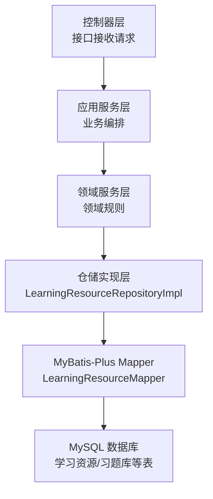
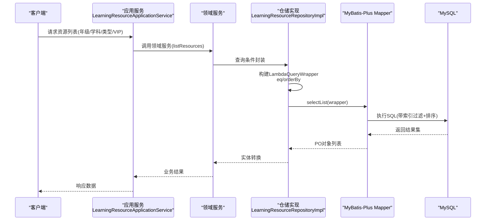
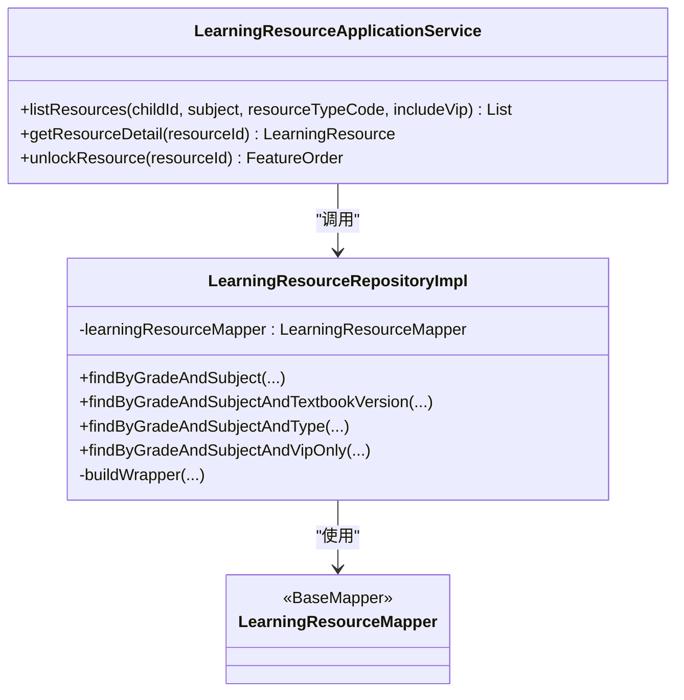

# 查询优化技术

<cite>
**本文引用的文件**
- [application.yml](file://wzoto-backend/wzoto-interfaces/src/main/resources/application.yml)
- [LearningResourceMapper.java](file://wzoto-backend/wzoto-infrastructure/src/main/java/com/wzoto/infrastructure/mapper/LearningResourceMapper.java)
- [LearningResourceRepositoryImpl.java](file://wzoto-backend/wzoto-infrastructure/src/main/java/com/wzoto/infrastructure/repository/LearningResourceRepositoryImpl.java)
- [LearningResourceApplicationService.java](file://wzoto-backend/wzoto-application/src/main/java/com/wzoto/application/service/LearningResourceApplicationService.java)
- [t_learning_resource.sql](file://wzoto-backend/sql/t_learning_resource.sql)
- [t_exercise_bank.sql](file://wzoto-backend/sql/t_exercise_bank.sql)
</cite>

## 目录
1. [简介](#简介)
2. [项目结构](#项目结构)
3. [核心组件](#核心组件)
4. [架构总览](#架构总览)
5. [详细组件分析](#详细组件分析)
6. [依赖关系分析](#依赖关系分析)
7. [性能考虑](#性能考虑)
8. [故障排查指南](#故障排查指南)
9. [结论](#结论)
10. [附录](#附录)

## 简介
本技术文档围绕 wzoto 项目的数据库查询优化，系统阐述慢查询分析方法、执行计划优化、SQL 重写技巧、复杂查询场景与监控手段。结合本项目实际代码与表结构，给出可落地的索引设计、查询构建、分页与聚合优化建议，并提供典型优化案例与效果对比思路，帮助团队在数据量增长时持续保持查询性能。

## 项目结构
后端采用分层架构：接口层（Controller）→ 应用服务层 → 领域服务层 → 基础设施层（仓储实现 + MyBatis-Plus Mapper）→ 数据库。查询路径从 Controller 进入应用服务，经领域服务调用仓储实现，最终通过 MyBatis-Plus 的 LambdaQueryWrapper 生成 SQL 并执行。

图表来源
- [LearningResourceApplicationService.java:24-38](file://wzoto-backend/wzoto-application/src/main/java/com/wzoto/application/service/LearningResourceApplicationService.java#L24-L38)
- [LearningResourceRepositoryImpl.java:41-80](file://wzoto-backend/wzoto-infrastructure/src/main/java/com/wzoto/infrastructure/repository/LearningResourceRepositoryImpl.java#L41-L80)
- [LearningResourceMapper.java:1-12](file://wzoto-backend/wzoto-infrastructure/src/main/java/com/wzoto/infrastructure/mapper/LearningResourceMapper.java#L1-L12)

章节来源
- [application.yml:6-29](file://wzoto-backend/wzoto-interfaces/src/main/resources/application.yml#L6-L29)
- [LearningResourceRepositoryImpl.java:41-80](file://wzoto-backend/wzoto-infrastructure/src/main/java/com/wzoto/infrastructure/repository/LearningResourceRepositoryImpl.java#L41-L80)

## 核心组件
- 应用服务：对外暴露资源列表、详情、解锁等业务能力，负责参数校验与上下文注入。
- 仓储实现：基于 MyBatis-Plus 的 LambdaQueryWrapper 构造查询条件，统一排序与过滤逻辑，避免手写 SQL 带来的不一致。
- Mapper：继承 BaseMapper，提供基础 CRUD；复杂查询由 Repository 层组合条件完成。
- 数据库表：学习资源与习题库表已定义常用复合索引，支撑年级/学科/类型/会员可见性等高频筛选。

章节来源
- [LearningResourceApplicationService.java:24-38](file://wzoto-backend/wzoto-application/src/main/java/com/wzoto/application/service/LearningResourceApplicationService.java#L24-L38)
- [LearningResourceRepositoryImpl.java:41-80](file://wzoto-backend/wzoto-infrastructure/src/main/java/com/wzoto/infrastructure/repository/LearningResourceRepositoryImpl.java#L41-L80)
- [LearningResourceMapper.java:1-12](file://wzoto-backend/wzoto-infrastructure/src/main/java/com/wzoto/infrastructure/mapper/LearningResourceMapper.java#L1-L12)
- [t_learning_resource.sql:4-35](file://wzoto-backend/sql/t_learning_resource.sql#L4-L35)
- [t_exercise_bank.sql:4-30](file://wzoto-backend/sql/t_exercise_bank.sql#L4-L30)

## 架构总览
下图展示一次“按年级/学科/类型/是否VIP”的资源列表查询从接口到数据库的完整调用链，以及关键优化点（索引命中、排序、分页）。

图表来源
- [LearningResourceApplicationService.java:24-38](file://wzoto-backend/wzoto-application/src/main/java/com/wzoto/application/service/LearningResourceApplicationService.java#L24-L38)
- [LearningResourceRepositoryImpl.java:41-80](file://wzoto-backend/wzoto-infrastructure/src/main/java/com/wzoto/infrastructure/repository/LearningResourceRepositoryImpl.java#L41-L80)
- [t_learning_resource.sql:4-35](file://wzoto-backend/sql/t_learning_resource.sql#L4-L35)

## 详细组件分析

### 慢查询分析方法
- MySQL 慢查询日志配置
  - 启用 slow_query_log，设置阈值 long_query_time，指定日志文件位置，定期收集与分析。
  - 结合 performance_schema 或 pt-query-digest 进行热点 SQL 识别。
- 查询耗时分析
  - 使用 EXPLAIN 查看执行计划，关注 type、key、rows、Extra 中的 Using filesort/Using temporary。
  - 关注回表次数、临时表大小、排序开销。
- 瓶颈识别技巧
  - 全表扫描（type=ALL）、无索引过滤、函数/隐式类型转换导致索引失效、大字段回表、跨库 JOIN。
  - 通过 SHOW PROFILE 或性能视图定位 CPU/IO 热点。

章节来源
- [application.yml:19-29](file://wzoto-backend/wzoto-interfaces/src/main/resources/application.yml#L19-L29)

### 执行计划优化
- EXPLAIN 使用要点
  - 优先保证 ref/range 访问类型，避免 ALL。
  - 关注 key 是否为预期索引，rows 估算是否合理。
  - Extra 中尽量避免 Using filesort/Using temporary。
- 索引选择分析
  - 高选择性列优先建单列索引；多条件过滤使用复合索引，遵循最左前缀原则。
  - 排序列尽量纳入索引，减少文件排序。
- 临时表与文件排序优化
  - 将 ORDER BY 与 WHERE 条件合并为覆盖索引，避免额外排序。
  - 对 GROUP BY/ORDER BY 的大结果集，先过滤再排序，必要时分页。

章节来源
- [t_learning_resource.sql:4-35](file://wzoto-backend/sql/t_learning_resource.sql#L4-L35)
- [t_exercise_bank.sql:4-30](file://wzoto-backend/sql/t_exercise_bank.sql#L4-L30)

### SQL 重写技巧
- 子查询优化
  - 将 IN 子查询改写为 JOIN 或 EXISTS，减少重复计算。
  - 避免在子查询中使用非确定性函数。
- JOIN 优化
  - 小表驱动大表，确保 ON 条件有索引；避免 SELECT *，仅取必要字段。
  - 对频繁 JOIN 的键建立合适索引，必要时使用覆盖索引。
- 聚合查询优化
  - 预聚合：对高频统计指标建立物化视图或汇总表，定时刷新。
  - 分步聚合：先过滤后聚合，减少中间结果集大小。
- 分页查询优化
  - 使用基于游标/上次最大ID的分页替代深分页 OFFSET。
  - 对排序字段建立索引，避免文件排序。

章节来源
- [LearningResourceRepositoryImpl.java:41-80](file://wzoto-backend/wzoto-infrastructure/src/main/java/com/wzoto/infrastructure/repository/LearningResourceRepositoryImpl.java#L41-L80)
- [t_learning_resource.sql:4-35](file://wzoto-backend/sql/t_learning_resource.sql#L4-L35)

### 复杂查询场景
- 多表关联查询优化
  - 明确驱动表与被驱动表，ON 条件加索引；必要时拆分为多次简单查询并在应用层组装。
- 大数据量查询处理
  - 分批读取（流式查询/游标），限制单次返回行数；冷热数据分离归档。
- 实时统计查询优化
  - 引入 Redis 缓存热点统计；异步任务增量更新；必要时使用 OLAP 引擎或宽表。

章节来源
- [t_exercise_bank.sql:4-30](file://wzoto-backend/sql/t_exercise_bank.sql#L4-L30)
- [application.yml:6-17](file://wzoto-backend/wzoto-interfaces/src/main/resources/application.yml#L6-L17)

### 查询性能监控
- 查询缓存配置
  - MySQL 层面不建议开启 query_cache（新版本已移除）；应用层可使用 Redis 缓存热点查询结果。
- 连接池优化
  - 调整 HikariCP/Druid 的连接数、超时、空闲回收策略，避免连接耗尽。
- 批量操作优化
  - 使用批量插入/更新减少往返；对大批量删除采用分段删除。

章节来源
- [application.yml:6-17](file://wzoto-backend/wzoto-interfaces/src/main/resources/application.yml#L6-L17)

### 具体优化案例与效果对比
- 案例一：按年级/学科/类型/VIP 的资源列表
  - 现状：WHERE 条件包含 grade、subject、resource_type、vip_only，ORDER BY sort_order, created_at。
  - 优化：创建复合索引 (grade, subject, resource_type, vip_only)，并将排序字段纳入覆盖索引以减少文件排序。
  - 预期效果：type 由 ALL 提升为 range/ref，rows 显著下降，Extra 不再出现 Using filesort。
- 案例二：习题库按知识点/难度/题目类型筛选
  - 现状：常见条件 knowledge_point_id、difficulty、question_type。
  - 优化：建立复合索引 (knowledge_point_id, difficulty, question_type)，并按 use_count 做热度排序时考虑二级索引或预排序表。
  - 预期效果：减少回表与排序成本，提升列表加载速度。
- 案例三：深分页优化
  - 现状：OFFSET 较大导致扫描大量无用行。
  - 优化：改为基于 last_id 的游标分页，配合排序字段索引。
  - 预期效果：P95 延迟降低，CPU/IO 占用下降。

章节来源
- [t_learning_resource.sql:4-35](file://wzoto-backend/sql/t_learning_resource.sql#L4-L35)
- [t_exercise_bank.sql:4-30](file://wzoto-backend/sql/t_exercise_bank.sql#L4-L30)
- [LearningResourceRepositoryImpl.java:41-80](file://wzoto-backend/wzoto-infrastructure/src/main/java/com/wzoto/infrastructure/repository/LearningResourceRepositoryImpl.java#L41-L80)

## 依赖关系分析
- 应用服务依赖领域服务，领域服务依赖仓储实现，仓储实现依赖 MyBatis-Plus Mapper 与数据库表。
- 查询构建集中在仓储实现层，便于统一优化与复用。

图表来源
- [LearningResourceApplicationService.java:24-38](file://wzoto-backend/wzoto-application/src/main/java/com/wzoto/application/service/LearningResourceApplicationService.java#L24-L38)
- [LearningResourceRepositoryImpl.java:41-80](file://wzoto-backend/wzoto-infrastructure/src/main/java/com/wzoto/infrastructure/repository/LearningResourceRepositoryImpl.java#L41-L80)
- [LearningResourceMapper.java:1-12](file://wzoto-backend/wzoto-infrastructure/src/main/java/com/wzoto/infrastructure/mapper/LearningResourceMapper.java#L1-L12)

章节来源
- [LearningResourceRepositoryImpl.java:41-80](file://wzoto-backend/wzoto-infrastructure/src/main/java/com/wzoto/infrastructure/repository/LearningResourceRepositoryImpl.java#L41-L80)

## 性能考虑
- 索引设计
  - 复合索引顺序遵循“等值优先、范围次之、排序最后”的原则。
  - 对高频查询的过滤+排序字段建立覆盖索引，减少回表。
- 查询构建
  - 使用 LambdaQueryWrapper 精确构建条件，避免 SELECT *。
  - 对可选条件使用动态拼接，减少无效过滤。
- 分页与排序
  - 优先使用基于主键或唯一索引的游标分页。
  - 对排序字段建立索引，避免 Using filesort。
- 缓存与批处理
  - 热点数据使用 Redis 缓存；写多读少场景考虑异步写入与批量提交。

[本节为通用指导，不直接分析具体文件]

## 故障排查指南
- 常见问题
  - 慢查询：检查 EXPLAIN 是否走索引，是否存在文件排序或临时表。
  - 连接池耗尽：检查连接数上限、长事务、未关闭连接。
  - 缓存穿透/击穿：增加空值缓存、布隆过滤器、互斥锁。
- 诊断步骤
  - 开启慢查询日志，导出热点 SQL。
  - 使用 EXPLAIN 分析执行计划，验证索引命中。
  - 观察服务器 CPU/IO 与 MySQL 线程状态，定位瓶颈。
- 修复建议
  - 补充或调整索引，重写低效 SQL。
  - 调整连接池参数，拆分大事务。
  - 引入缓存与降级策略，保障可用性。

章节来源
- [application.yml:19-29](file://wzoto-backend/wzoto-interfaces/src/main/resources/application.yml#L19-L29)

## 结论
通过对慢查询日志、执行计划、索引设计与 SQL 重写的系统化优化，wzoto 项目在数据量增长时仍能保持稳定的查询性能。建议在开发阶段即纳入 SQL 评审与性能基线测试，持续监控与迭代优化。

[本节为总结性内容，不直接分析具体文件]

## 附录
- 常用优化清单
  - 确认 WHERE/JOIN/GROUP BY/ORDER BY 字段均有合适索引。
  - 避免在索引列上使用函数或隐式类型转换。
  - 使用覆盖索引减少回表。
  - 分页改用游标方式，避免深 OFFSET。
  - 热点数据加入缓存，写多读少场景异步化。
- 参考表结构
  - 学习资源表与习题库表的索引设计可作为模板，扩展到其他业务表。

章节来源
- [t_learning_resource.sql:4-35](file://wzoto-backend/sql/t_learning_resource.sql#L4-L35)
- [t_exercise_bank.sql:4-30](file://wzoto-backend/sql/t_exercise_bank.sql#L4-L30)