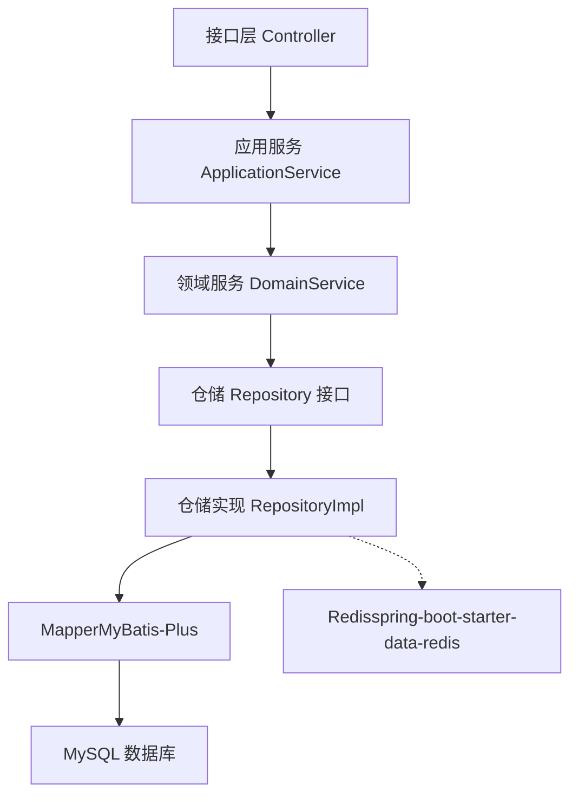
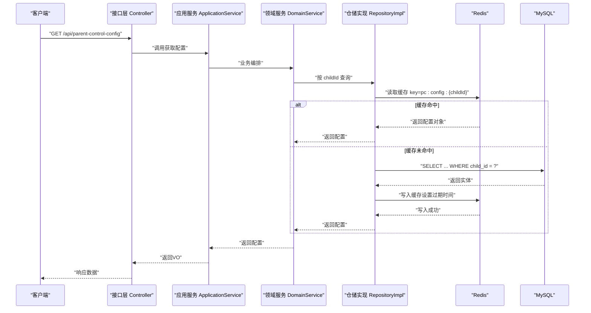
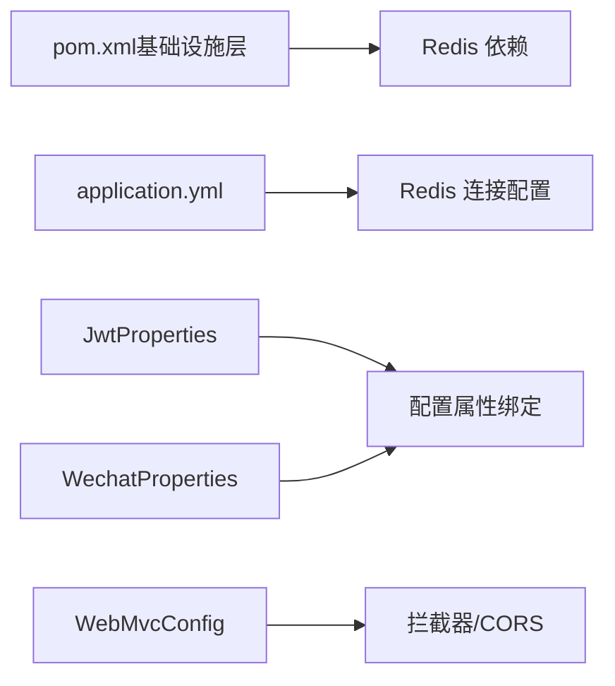

# 查询缓存策略

<cite>
**本文引用的文件**
- [application.yml](file://wzoto-backend/wzoto-interfaces/src/main/resources/application.yml)
- [pom.xml（基础设施层）](file://wzoto-backend/wzoto-infrastructure/pom.xml)
- [WebMvcConfig.java](file://wzoto-backend/wzoto-infrastructure/src/main/java/com/wzoto/infrastructure/config/WebMvcConfig.java)
- [JwtProperties.java](file://wzoto-backend/wzoto-infrastructure/src/main/java/com/wzoto/infrastructure/config/JwtProperties.java)
- [WechatProperties.java](file://wzoto-backend/wzoto-infrastructure/src/main/java/com/wzoto/infrastructure/config/WechatProperties.java)
- [ParentControlController.java](file://wzoto-backend/wzoto-interfaces/src/main/java/com/wzoto/interfaces/controller/ParentControlController.java)
- [ParentControlApplicationService.java](file://wzoto-backend/wzoto-application/src/main/java/com/wzoto/application/service/ParentControlApplicationService.java)
- [ParentControlDomainService.java](file://wzoto-backend/wzoto-domain/src/main/java/com/wzoto/domain/service/ParentControlDomainService.java)
- [ParentControlRepositoryImpl.java](file://wzoto-backend/wzoto-infrastructure/src/main/java/com/wzoto/infrastructure/repository/ParentControlConfigRepositoryImpl.java)
</cite>

## 目录
1. [简介](#简介)
2. [项目结构](#项目结构)
3. [核心组件](#核心组件)
4. [架构总览](#架构总览)
5. [详细组件分析](#详细组件分析)
6. [依赖关系分析](#依赖关系分析)
7. [性能考量](#性能考量)
8. [故障排查指南](#故障排查指南)
9. [结论](#结论)
10. [附录](#附录)

## 简介
本文件围绕 wzoto 项目的“查询缓存策略”进行系统化说明，覆盖 MySQL 查询缓存配置、应用层 Redis 缓存集成、缓存一致性保障、性能优化与最佳实践。当前仓库已具备 Redis 基础依赖与连接配置，但尚未发现显式的缓存读写实现代码；因此本文在给出落地方案的同时，严格基于现有配置与分层结构，提供可落地的扩展建议与流程图示，便于后续在仓储或服务层接入缓存。

## 项目结构
- 后端采用 DDD 分层：接口层（interfaces）、应用服务层（application）、领域层（domain）、基础设施层（infrastructure）。
- 基础设施层已引入 spring-boot-starter-data-redis，并配置了 Redis 连接信息；数据访问通过 MyBatis-Plus 的 Mapper 完成。
- 配置集中在 application.yml，包含数据库与 Redis 的基本连接参数。

图表来源
- [application.yml:6-17](file://wzoto-backend/wzoto-interfaces/src/main/resources/application.yml#L6-L17)
- [pom.xml（基础设施层）:25-28](file://wzoto-backend/wzoto-infrastructure/pom.xml#L25-L28)

章节来源
- [application.yml:6-17](file://wzoto-backend/wzoto-interfaces/src/main/resources/application.yml#L6-L17)
- [pom.xml（基础设施层）:25-28](file://wzoto-backend/wzoto-infrastructure/pom.xml#L25-L28)

## 核心组件
- 配置中心
  - application.yml：定义数据源与 Redis 连接参数，为缓存接入提供基础能力。
  - JwtProperties / WechatProperties：展示配置类化方式，可作为缓存相关配置（如键前缀、过期时间）的参考模式。
- 缓存基础设施
  - 依赖 spring-boot-starter-data-redis，具备 RedisTemplate/StringRedisTemplate 等能力，可在仓储或应用服务中注入使用。
- 典型读路径（以家长管控配置为例）
  - Controller -> ApplicationService -> DomainService -> RepositoryImpl -> Mapper -> MySQL
  - 可在 RepositoryImpl 或 ApplicationService 处接入 Redis 缓存，形成“先查缓存，未命中再查库并回填缓存”的模式。

章节来源
- [application.yml:6-17](file://wzoto-backend/wzoto-interfaces/src/main/resources/application.yml#L6-L17)
- [JwtProperties.java:10-26](file://wzoto-backend/wzoto-infrastructure/src/main/java/com/wzoto/infrastructure/config/JwtProperties.java#L10-L26)
- [WechatProperties.java:10-23](file://wzoto-backend/wzoto-infrastructure/src/main/java/com/wzoto/infrastructure/config/WechatProperties.java#L10-L23)
- [ParentControlController.java:56-74](file://wzoto-backend/wzoto-interfaces/src/main/java/com/wzoto/interfaces/controller/ParentControlController.java#L56-L74)
- [ParentControlApplicationService.java:21-42](file://wzoto-backend/wzoto-application/src/main/java/com/wzoto/application/service/ParentControlApplicationService.java#L21-L42)
- [ParentControlDomainService.java:41-60](file://wzoto-backend/wzoto-domain/src/main/java/com/wzoto/domain/service/ParentControlDomainService.java#L41-L60)
- [ParentControlRepositoryImpl.java:20-36](file://wzoto-backend/wzoto-infrastructure/src/main/java/com/wzoto/infrastructure/repository/ParentControlConfigRepositoryImpl.java#L20-L36)

## 架构总览
下图展示了“读多写少”场景下的缓存架构：请求经控制器进入应用服务，再由领域服务调度仓储；仓储在读取时优先访问 Redis，未命中则回源 MySQL 并回填缓存；写入时更新数据库并同步失效/更新缓存，保证一致性。

图表来源
- [ParentControlController.java:56-74](file://wzoto-backend/wzoto-interfaces/src/main/java/com/wzoto/interfaces/controller/ParentControlController.java#L56-L74)
- [ParentControlApplicationService.java:21-42](file://wzoto-backend/wzoto-application/src/main/java/com/wzoto/application/service/ParentControlApplicationService.java#L21-L42)
- [ParentControlDomainService.java:41-60](file://wzoto-backend/wzoto-domain/src/main/java/com/wzoto/domain/service/ParentControlDomainService.java#L41-L60)
- [ParentControlRepositoryImpl.java:20-36](file://wzoto-backend/wzoto-infrastructure/src/main/java/com/wzoto/infrastructure/repository/ParentControlConfigRepositoryImpl.java#L20-L36)
- [application.yml:6-17](file://wzoto-backend/wzoto-interfaces/src/main/resources/application.yml#L6-L17)

## 详细组件分析

### MySQL 查询缓存配置与调优
- query_cache_type
  - 作用：控制 MySQL 服务端是否启用查询缓存。
  - 现状：仓库未包含 MySQL 服务端配置文件片段，建议在数据库侧按需开启或关闭，并结合业务负载评估收益。
- 缓存大小调优
  - 关键参数：query_cache_size、query_cache_limit。
  - 建议：在高并发写场景下谨慎开启；若读远大于写且 SQL 稳定，可适度增大 size，并限制单条结果集大小 limit。
- 缓存失效机制
  - 触发条件：表数据变更导致对应查询结果失效。
  - 注意：MySQL 查询缓存粒度较粗，易造成锁竞争与失效风暴，生产环境更推荐应用层缓存。

章节来源
- [application.yml:6-17](file://wzoto-backend/wzoto-interfaces/src/main/resources/application.yml#L6-L17)

### 应用层缓存实现（Redis）
- 集成基础
  - 依赖：spring-boot-starter-data-redis（已在基础设施层声明）。
  - 配置：application.yml 中已配置 host/port/password/database。
- 缓存键设计
  - 建议格式：业务域:资源类型:标识{...}，例如 pc:config:{childId}、lr:list:{grade}:{subject}。
  - 命名规范：统一前缀、避免特殊字符、包含必要维度（用户/租户/范围）。
- 缓存更新策略
  - 写扩散：写后直接删除/更新相关缓存键，读时再懒加载。
  - 读扩散：订阅数据变更事件，主动刷新下游缓存（适合热点聚合数据）。
  - 结合事务：确保数据库与缓存的最终一致，必要时加幂等与重试。
- 示例接入点
  - 在 ParentControlRepositoryImpl 的 findById/findByChildId 等方法中增加缓存读取与回填逻辑。
  - 在 ParentControlDomainService.saveConfig/update 等写方法中，执行完数据库更新后清理/更新缓存键。

章节来源
- [pom.xml（基础设施层）:25-28](file://wzoto-backend/wzoto-infrastructure/pom.xml#L25-L28)
- [application.yml:6-17](file://wzoto-backend/wzoto-interfaces/src/main/resources/application.yml#L6-L17)
- [ParentControlRepositoryImpl.java:20-36](file://wzoto-backend/wzoto-infrastructure/src/main/java/com/wzoto/infrastructure/repository/ParentControlConfigRepositoryImpl.java#L20-L36)
- [ParentControlDomainService.java:41-60](file://wzoto-backend/wzoto-domain/src/main/java/com/wzoto/domain/service/ParentControlDomainService.java#L41-L60)

### 缓存一致性保障
- 缓存穿透防护
  - 空值缓存：对不存在的数据也缓存短 TTL，避免重复回源。
  - 布隆过滤器：在高频恶意查询场景下前置过滤非法 key。
- 缓存雪崩预防
  - 随机过期：为不同 key 添加抖动 TTL，避免集中过期。
  - 限流降级：热点 key 异常时快速失败或返回兜底数据。
  - 多级缓存：本地缓存 + 分布式缓存，降低瞬时压力。
- 热点数据保护
  - 热点识别：统计访问频次，对 TopN 热点单独处理（如独立分片、更长 TTL、本地缓存）。
  - 防抖与互斥：首次加载时加分布式锁，避免缓存击穿。

[本节为通用策略说明，不直接分析具体文件]

### 缓存性能优化
- 命中率监控
  - 指标：命中率、QPS、延迟分布、内存使用率、淘汰率。
  - 手段：通过 Redis INFO 与自定义埋点统计，结合日志与告警。
- 预热策略
  - 启动预热：服务启动后异步加载热点数据到缓存。
  - 增量预热：数据变更后增量更新相关缓存。
- 分布式缓存同步
  - 发布订阅：基于 Redis Pub/Sub 或消息队列广播失效/更新。
  - 版本化 Key：通过版本号或时间戳作为 key 后缀，简化失效策略。

[本节为通用策略说明，不直接分析具体文件]

### 缓存最佳实践
- 缓存粒度控制
  - 细粒度：按主键或唯一键缓存，减少脏读风险。
  - 粗粒度：聚合视图缓存，需配合强一致的失效策略。
- 过期时间设置
  - 业务驱动：根据数据变化频率设定 TTL，热点数据适当延长。
  - 抖动策略：TTL 加上随机偏移，避免同时过期。
- 内存使用优化
  - 合理序列化：选择紧凑格式（如 Protobuf/MessagePack）以降低体积。
  - 淘汰策略：LRU/LFU 结合业务冷热特征选择合适策略。
  - 容量规划：监控内存使用，及时扩容或拆分 key 空间。

[本节为通用策略说明，不直接分析具体文件]

## 依赖关系分析
- 基础设施层依赖 spring-boot-starter-data-redis，为缓存提供运行时能力。
- 配置类（JwtProperties、WechatProperties）展示了如何通过 @ConfigurationProperties 将外部配置注入到组件，可用于缓存相关配置（如键前缀、默认过期时间）。
- WebMvcConfig 负责拦截器与跨域配置，与缓存无直接耦合，但可作为全局缓存切面（AOP）的挂载点。

图表来源
- [pom.xml（基础设施层）:25-28](file://wzoto-backend/wzoto-infrastructure/pom.xml#L25-L28)
- [application.yml:6-17](file://wzoto-backend/wzoto-interfaces/src/main/resources/application.yml#L6-L17)
- [JwtProperties.java:10-26](file://wzoto-backend/wzoto-infrastructure/src/main/java/com/wzoto/infrastructure/config/JwtProperties.java#L10-L26)
- [WechatProperties.java:10-23](file://wzoto-backend/wzoto-infrastructure/src/main/java/com/wzoto/infrastructure/config/WechatProperties.java#L10-L23)
- [WebMvcConfig.java:15-41](file://wzoto-backend/wzoto-infrastructure/src/main/java/com/wzoto/infrastructure/config/WebMvcConfig.java#L15-L41)

章节来源
- [pom.xml（基础设施层）:25-28](file://wzoto-backend/wzoto-infrastructure/pom.xml#L25-L28)
- [application.yml:6-17](file://wzoto-backend/wzoto-interfaces/src/main/resources/application.yml#L6-L17)
- [JwtProperties.java:10-26](file://wzoto-backend/wzoto-infrastructure/src/main/java/com/wzoto/infrastructure/config/JwtProperties.java#L10-L26)
- [WechatProperties.java:10-23](file://wzoto-backend/wzoto-infrastructure/src/main/java/com/wzoto/infrastructure/config/WechatProperties.java#L10-L23)
- [WebMvcConfig.java:15-41](file://wzoto-backend/wzoto-infrastructure/src/main/java/com/wzoto/infrastructure/config/WebMvcConfig.java#L15-L41)

## 性能考量
- 读多写少场景优先采用缓存，显著降低数据库压力与响应延迟。
- 热点数据采用本地缓存+分布式缓存两级结构，进一步削峰。
- 对大对象或复杂查询结果，考虑分页与字段裁剪，减少缓存体积与网络开销。
- 通过压测对比开启缓存前后的 QPS、P95/P99 延迟、CPU 与 IO 占用，量化收益。

[本节为通用指导，不直接分析具体文件]

## 故障排查指南
- 无法连接 Redis
  - 检查 application.yml 中的 host/port/password/database 是否正确。
  - 确认防火墙与安全组放行端口。
- 缓存未命中或命中率低
  - 核对 key 生成规则是否一致（前后端、读写路径）。
  - 检查 TTL 是否过短或存在集中过期。
- 数据不一致
  - 确认写路径是否同步更新/删除缓存。
  - 对高并发写场景，考虑加分布式锁或采用最终一致模型。
- 内存溢出或淘汰频繁
  - 调整 maxmemory 与淘汰策略，观察命中率与延迟变化。
  - 对大 key 进行拆分或压缩。

章节来源
- [application.yml:6-17](file://wzoto-backend/wzoto-interfaces/src/main/resources/application.yml#L6-L17)

## 结论
本项目已具备 Redis 的基础依赖与连接配置，为应用层缓存提供了良好基座。建议优先在“读多写少”的高频查询路径（如家长管控配置、学习资源列表等）接入缓存，遵循统一的键设计与过期策略，并通过监控与压测持续优化。对于 MySQL 查询缓存，需谨慎评估其适用性，通常更推荐以应用层缓存为主、数据库侧索引与查询优化为辅的组合策略。

[本节为总结性内容，不直接分析具体文件]

## 附录
- 配置示例（参考现有 application.yml 的 Redis 配置段）
  - 主机、端口、密码、数据库编号等参数可按环境通过环境变量注入。
- 性能提升效果对比（建议指标）
  - 开启缓存前后：QPS、平均/尾延迟、数据库连接数、CPU 与 IO 使用率、缓存命中率。
  - 通过压测工具采集并对比，形成基线与回归报告。

[本节为补充说明，不直接分析具体文件]