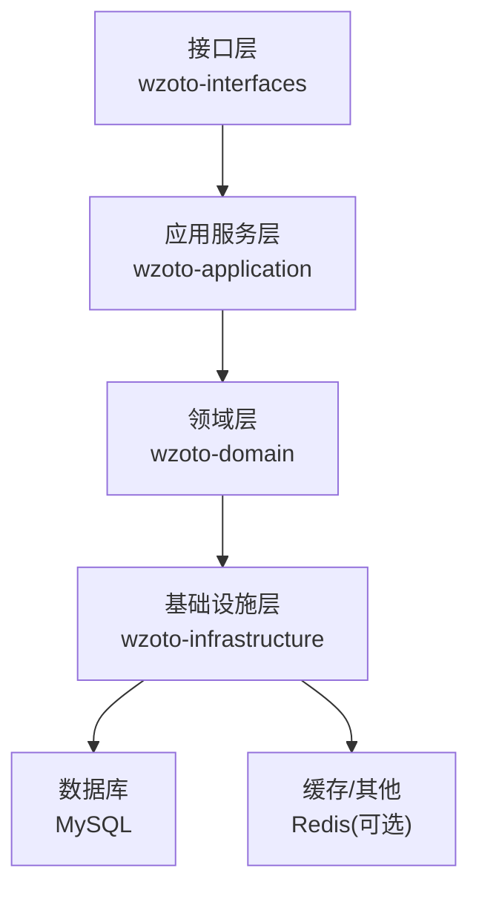
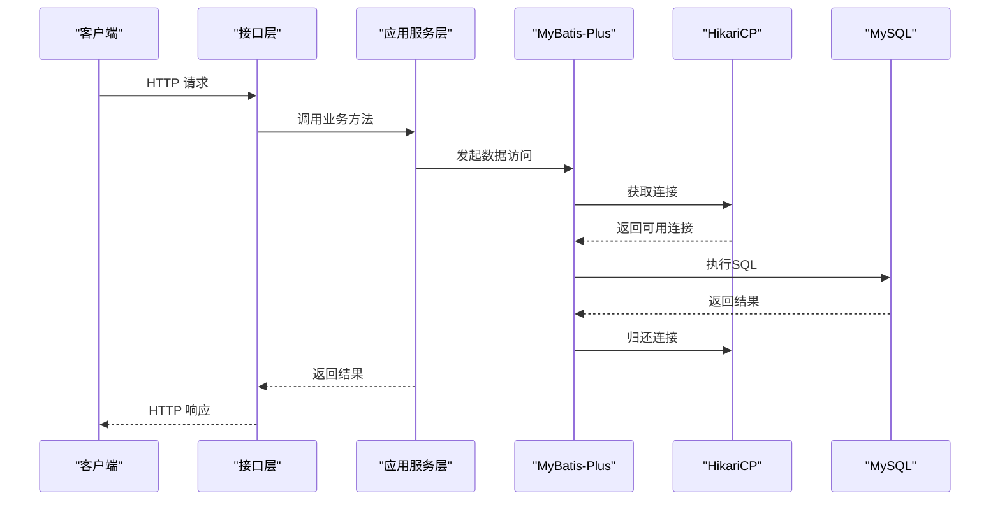
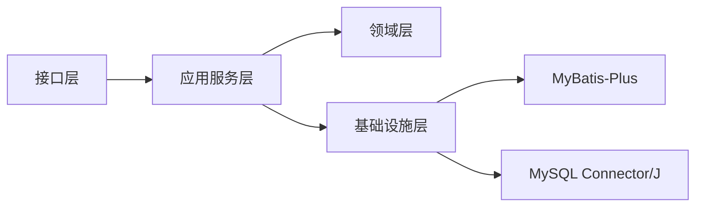

# 连接池优化

<cite>
**本文引用的文件**
- [application.yml](file://wzoto-backend/wzoto-interfaces/src/main/resources/application.yml)
- [pom.xml（根）](file://wzoto-backend/pom.xml)
- [pom.xml（基础设施层）](file://wzoto-backend/wzoto-infrastructure/pom.xml)
- [WebMvcConfig.java](file://wzoto-backend/wzoto-infrastructure/src/main/java/com/wzoto/infrastructure/config/WebMvcConfig.java)
- [AuthApplicationService.java](file://wzoto-backend/wzoto-application/src/main/java/com/wzoto/application/service/AuthApplicationService.java)
</cite>

## 目录
1. [简介](#简介)
2. [项目结构](#项目结构)
3. [核心组件](#核心组件)
4. [架构总览](#架构总览)
5. [详细组件分析](#详细组件分析)
6. [依赖关系分析](#依赖关系分析)
7. [性能考虑](#性能考虑)
8. [故障排查指南](#故障排查指南)
9. [结论](#结论)
10. [附录](#附录)

## 简介
本文件面向wzoto后端项目的数据库连接池优化，聚焦以下目标：
- 基于Spring Boot与MyBatis-Plus的默认HikariCP连接池进行参数调优（连接数、超时、健康检查等）。
- 建立连接池性能监控体系（状态、活跃连接、等待时间）。
- 实现连接泄漏检测与自动回收策略。
- 针对高并发场景提供扩容、负载均衡与故障转移建议。
- 给出最佳实践：连接复用、事务管理、批量操作优化，并附带可落地的配置示例与调优案例。

## 项目结构
wzoto后端采用分层架构：接口层（wzoto-interfaces）、应用服务层（wzoto-application）、领域层（wzoto-domain）、基础设施层（wzoto-infrastructure）。数据访问通过MyBatis-Plus完成，数据库驱动为MySQL Connector/J；连接池由Spring Boot自动装配HikariCP。

**图表来源**
- [application.yml:6-17](file://wzoto-backend/wzoto-interfaces/src/main/resources/application.yml#L6-L17)
- [pom.xml（基础设施层）:16-53](file://wzoto-backend/wzoto-infrastructure/pom.xml#L16-L53)

**章节来源**
- [application.yml:6-17](file://wzoto-backend/wzoto-interfaces/src/main/resources/application.yml#L6-L17)
- [pom.xml（根）:21-26](file://wzoto-backend/pom.xml#L21-L26)
- [pom.xml（基础设施层）:16-53](file://wzoto-backend/wzoto-infrastructure/pom.xml#L16-L53)

## 核心组件
- 数据源与连接池：Spring Boot自动装配HikariCP，使用MySQL Connector/J驱动。
- ORM与SQL执行：MyBatis-Plus负责SQL生成与执行，配合日志输出便于定位慢查询。
- 事务管理：应用服务层方法通过声明式事务注解控制事务边界，确保连接正确归还。
- Web拦截器：JWT鉴权拦截器位于接口层，与数据访问解耦。

**章节来源**
- [application.yml:6-23](file://wzoto-backend/wzoto-interfaces/src/main/resources/application.yml#L6-L23)
- [pom.xml（基础设施层）:22-53](file://wzoto-backend/wzoto-infrastructure/pom.xml#L22-L53)
- [AuthApplicationService.java:30-84](file://wzoto-backend/wzoto-application/src/main/java/com/wzoto/application/service/AuthApplicationService.java#L30-L84)
- [WebMvcConfig.java:15-42](file://wzoto-backend/wzoto-infrastructure/src/main/java/com/wzoto/infrastructure/config/WebMvcConfig.java#L15-L42)

## 架构总览
下图展示了从HTTP请求到数据库访问的连接生命周期，以及连接池在其中的作用。

**图表来源**
- [application.yml:6-23](file://wzoto-backend/wzoto-interfaces/src/main/resources/application.yml#L6-L23)
- [pom.xml（基础设施层）:22-53](file://wzoto-backend/wzoto-infrastructure/pom.xml#L22-L53)

## 详细组件分析

### 数据源与连接池配置（HikariCP）
当前项目未显式配置HikariCP，Spring Boot将使用默认值。建议在application.yml中显式配置以适配生产环境。关键参数说明与建议：
- 连接池大小
  - maximum-pool-size：最大连接数，建议根据CPU核数与数据库能力设置，通常=CPU核数或2倍CPU核数。
  - minimum-idle：最小空闲连接，建议接近maximum-pool-size以减少冷启动开销。
- 超时与健康检查
  - connection-timeout：获取连接超时，建议2-5秒。
  - idle-timeout：空闲连接超时，建议30万毫秒左右。
  - max-lifetime：连接最大生命周期，建议小于数据库wait_timeout。
  - keepalive-time：保活时间，避免防火墙断连。
  - validation-timeout：校验超时，建议1秒内。
  - connection-test-query：健康检查语句（如SELECT 1），用于快速探测连接可用性。
- 其他
  - leak-detection-threshold：连接泄漏检测阈值，建议开启并在压测时设置为合理值（如10-30秒）。
  - register-mbeans：启用MBean以便外部监控。

参考位置：
- 数据源与驱动配置：[application.yml:6-11](file://wzoto-backend/wzoto-interfaces/src/main/resources/application.yml#L6-L11)
- MySQL驱动依赖：[pom.xml（基础设施层）:50-53](file://wzoto-backend/wzoto-infrastructure/pom.xml#L50-L53)

**章节来源**
- [application.yml:6-11](file://wzoto-backend/wzoto-interfaces/src/main/resources/application.yml#L6-L11)
- [pom.xml（基础设施层）:50-53](file://wzoto-backend/wzoto-infrastructure/pom.xml#L50-L53)

### 连接池性能监控
- 指标采集
  - 启用MBean：spring.datasource.hikari.register-mbeans=true，便于JMX工具（如VisualVM、Prometheus JMX Exporter）采集。
  - 关键指标：活跃连接数、等待获取连接的线程数、连接创建/销毁速率、连接泄漏计数、平均获取耗时。
- 观测手段
  - Spring Boot Actuator + Micrometer：暴露/actuator/metrics，结合Prometheus/Grafana可视化。
  - 日志：MyBatis-Plus已开启SQL日志，有助于关联慢查询与连接占用时长。
- 告警策略
  - 当“等待连接”队列长度持续>0且增长，或平均获取耗时突增，触发告警。
  - 连接泄漏计数>0需立即排查。

参考位置：
- SQL日志开关：[application.yml:19-23](file://wzoto-backend/wzoto-interfaces/src/main/resources/application.yml#L19-L23)

**章节来源**
- [application.yml:19-23](file://wzoto-backend/wzoto-interfaces/src/main/resources/application.yml#L19-L23)

### 连接泄漏检测与自动回收
- 识别泄漏
  - 开启连接泄漏检测：spring.datasource.hikari.leak-detection-threshold=适当阈值（如10-30s），超过阈值的长时间持有将被记录。
  - 关注日志中的泄漏警告，定位未释放连接的业务路径。
- 自动回收
  - 通过max-lifetime与idle-timeout限制连接生命周期与空闲时间，防止僵尸连接。
  - 使用validation-timeout与connection-test-query确保无效连接被剔除。
- 调试工具
  - 结合MBean与Actuator观察连接池状态。
  - 使用线程Dump分析阻塞点，确认是否存在长事务或锁竞争。

**章节来源**
- [application.yml:6-11](file://wzoto-backend/wzoto-interfaces/src/main/resources/application.yml#L6-L11)

### 高并发场景优化
- 连接池扩容策略
  - 依据压测结果逐步提升maximum-pool-size，观察P95/P99延迟与错误率变化。
  - 若数据库CPU/IO饱和，优先优化SQL与索引，再考虑横向扩展数据库实例。
- 负载均衡配置
  - 多数据源或多实例：通过读写分离或分库分表降低单点压力。
  - 客户端侧重试与熔断：对瞬时抖动具备弹性。
- 故障转移机制
  - 主从切换：配置failover与read-only路由，保证读多写少场景的可用性。
  - 连接健康检查：确保失效节点及时剔除。

**章节来源**
- [application.yml:6-11](file://wzoto-backend/wzoto-interfaces/src/main/resources/application.yml#L6-L11)

### 最佳实践
- 连接复用优化
  - 避免在循环中频繁获取/释放连接；尽量合并SQL或使用批处理。
  - 减少N+1查询，合理使用JOIN与批量插入/更新。
- 事务管理
  - 缩小事务范围，仅包裹必要的写操作；避免在事务中进行远程调用或I/O。
  - 使用只读事务标注读多写少的查询，降低锁开销。
- 批量操作优化
  - 使用MyBatis-Plus的批量API或JDBC批处理，减少往返次数。
  - 分批提交，避免大事务导致锁竞争与内存压力。

参考位置：
- 事务使用示例：[AuthApplicationService.java:30-84](file://wzoto-backend/wzoto-application/src/main/java/com/wzoto/application/service/AuthApplicationService.java#L30-L84)

**章节来源**
- [AuthApplicationService.java:30-84](file://wzoto-backend/wzoto-application/src/main/java/com/wzoto/application/service/AuthApplicationService.java#L30-L84)

## 依赖关系分析
- 运行时依赖
  - MySQL Connector/J：数据库驱动。
  - MyBatis-Plus：ORM框架，封装连接获取与SQL执行。
  - Spring Boot Starter Data Source：自动装配HikariCP。
- 模块耦合
  - 接口层依赖应用服务层；应用服务层依赖领域与基础设施层；基础设施层直接依赖数据库驱动与ORM。

**图表来源**
- [pom.xml（根）:21-26](file://wzoto-backend/pom.xml#L21-L26)
- [pom.xml（基础设施层）:22-53](file://wzoto-backend/wzoto-infrastructure/pom.xml#L22-L53)

**章节来源**
- [pom.xml（根）:21-26](file://wzoto-backend/pom.xml#L21-L26)
- [pom.xml（基础设施层）:22-53](file://wzoto-backend/wzoto-infrastructure/pom.xml#L22-L53)

## 性能考虑
- 连接池大小与负载匹配：在高并发下，过小的池会导致排队等待，过大则增加上下文切换与数据库压力。
- 超时与重试：合理设置connection-timeout与重试策略，避免雪崩。
- 慢查询治理：通过SQL日志与慢查询分析，优化热点SQL与索引。
- 资源隔离：读写分离、分库分表，降低单库压力。
- 监控与告警：建立完善的指标与告警，及时发现瓶颈。

## 故障排查指南
- 症状：接口响应变慢或超时
  - 检查连接池是否耗尽：查看活跃连接数与等待队列。
  - 检查是否有长事务或未关闭的资源。
  - 查看SQL日志，定位慢查询。
- 症状：连接泄漏告警
  - 根据泄漏堆栈定位未释放连接的位置，修复代码或缩短事务范围。
- 症状：数据库连接频繁断开
  - 调整keepalive-time与max-lifetime，确保与网络与数据库策略一致。
- 常用手段
  - 启用MBean与Actuator指标。
  - 抓取线程Dump与GC日志，分析阻塞与资源争用。

**章节来源**
- [application.yml:19-23](file://wzoto-backend/wzoto-interfaces/src/main/resources/application.yml#L19-L23)

## 结论
通过对HikariCP参数的显式配置、完善监控与泄漏检测、结合事务与批量操作的优化，wzoto后端可在高并发场景下获得更稳定的数据库访问性能与更好的可观测性。建议在生产环境按上述方案落地，并结合压测与线上指标持续迭代调优。

## 附录

### 连接池配置示例（可直接放入application.yml）
以下为推荐的生产级HikariCP配置片段，请根据实际环境与压测结果微调：
- spring.datasource.hikari.maximum-pool-size：根据CPU与数据库能力设定（例如CPU核数或2倍）。
- spring.datasource.hikari.minimum-idle：建议接近maximum-pool-size。
- spring.datasource.hikari.connection-timeout：2000-5000ms。
- spring.datasource.hikari.idle-timeout：约300000ms。
- spring.datasource.hikari.max-lifetime：约1800000ms（需小于数据库wait_timeout）。
- spring.datasource.hikari.keepalive-time：约30000ms。
- spring.datasource.hikari.validation-timeout：1000ms。
- spring.datasource.hikari.connection-test-query：SELECT 1。
- spring.datasource.hikari.leak-detection-threshold：10000-30000ms（压测期可开启）。
- spring.datasource.hikari.register-mbeans：true（便于监控）。

参考位置：
- 数据源基础配置：[application.yml:6-11](file://wzoto-backend/wzoto-interfaces/src/main/resources/application.yml#L6-L11)

**章节来源**
- [application.yml:6-11](file://wzoto-backend/wzoto-interfaces/src/main/resources/application.yml#L6-L11)

### 性能调优案例（步骤化）
- 基线评估
  - 使用压测工具模拟峰值流量，记录P95/P99延迟、错误率、连接池指标。
- 参数调优
  - 逐步提升maximum-pool-size，观察延迟与错误率变化。
  - 调整超时与保活参数，减少网络抖动影响。
- 问题定位
  - 开启连接泄漏检测，定位未释放连接。
  - 分析慢查询日志，优化SQL与索引。
- 验证与回归
  - 再次压测，确认改善效果并固化配置。

**章节来源**
- [application.yml:19-23](file://wzoto-backend/wzoto-interfaces/src/main/resources/application.yml#L19-L23)