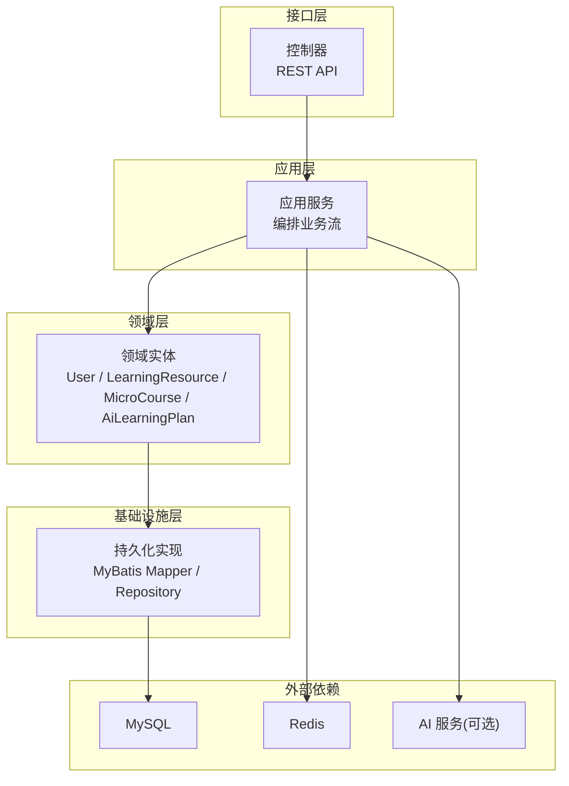
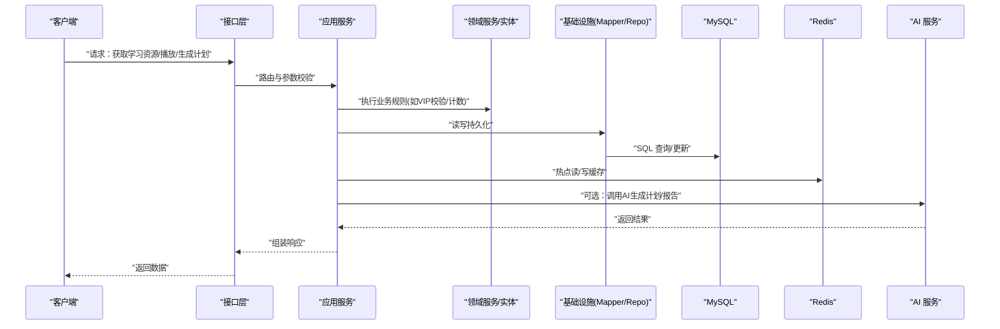
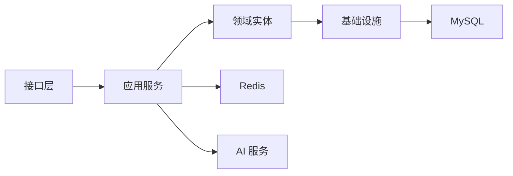
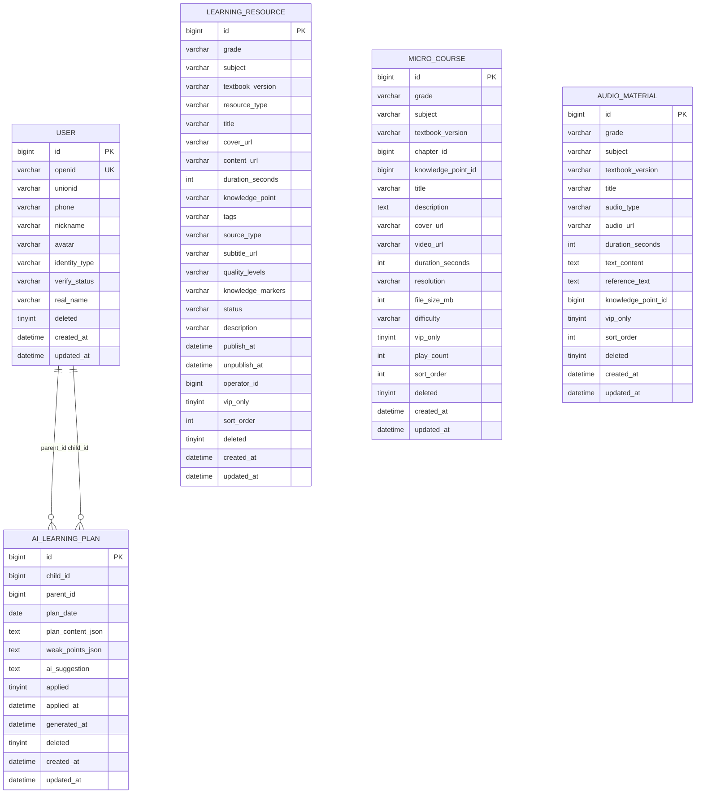

# 容量规划与预测

<cite>
**本文引用的文件**
- [application.yml](file://wzoto-backend/wzoto-interfaces/src/main/resources/application.yml)
- [t_user.sql](file://wzoto-backend/sql/t_user.sql)
- [t_learning_resource.sql](file://wzoto-backend/sql/t_learning_resource.sql)
- [t_micro_course.sql](file://wzoto-backend/sql/t_micro_course.sql)
- [t_audio_material.sql](file://wzoto-backend/sql/t_audio_material.sql)
- [init_all_learning_tables.sql](file://wzoto-backend/sql/init_all_learning_tables.sql)
- [User.java](file://wzoto-backend/wzoto-domain/src/main/java/com/wzoto/domain/entity/User.java)
- [LearningResource.java](file://wzoto-backend/wzoto-domain/src/main/java/com/wzoto/domain/entity/LearningResource.java)
- [MicroCourse.java](file://wzoto-backend/wzoto-domain/src/main/java/com/wzoto/domain/entity/MicroCourse.java)
- [AiLearningPlan.java](file://wzoto-backend/wzoto-domain/src/main/java/com/wzoto/domain/entity/AiLearningPlan.java)
</cite>

## 目录
1. [简介](#简介)
2. [项目结构](#项目结构)
3. [核心组件](#核心组件)
4. [架构总览](#架构总览)
5. [详细组件分析](#详细组件分析)
6. [依赖关系分析](#依赖关系分析)
7. [性能考虑](#性能考虑)
8. [故障排查指南](#故障排查指南)
9. [结论](#结论)
10. [附录](#附录)

## 简介
本文件面向 wzoto 项目的容量规划与预测，围绕数据增长、存储容量、计算资源、弹性伸缩与容量工具五大主题展开。内容基于仓库中的领域实体、数据库表结构与运行配置进行推导，给出可操作的容量评估方法、扩容策略与监控指标建议，帮助团队在用户增长、学习资源扩张与AI能力接入的背景下，持续保障系统稳定性与成本效率。

## 项目结构
wzoto 后端采用分层架构：接口层（Controller）、应用服务层（Application Service）、领域层（Domain Entity/Service/Repository）、基础设施层（Infrastructure）。数据库脚本位于 sql 目录，包含用户、学习资源、微课、音频等核心表的 DDL；运行时配置集中在 application.yml，定义数据库、Redis、JWT、微信与AI相关参数。

图表来源
- [application.yml:1-51](file://wzoto-backend/wzoto-interfaces/src/main/resources/application.yml#L1-L51)
- [User.java:1-93](file://wzoto-backend/wzoto-domain/src/main/java/com/wzoto/domain/entity/User.java#L1-L93)
- [LearningResource.java:1-153](file://wzoto-backend/wzoto-domain/src/main/java/com/wzoto/domain/entity/LearningResource.java#L1-L153)
- [MicroCourse.java:1-52](file://wzoto-backend/wzoto-domain/src/main/java/com/wzoto/domain/entity/MicroCourse.java#L1-L52)
- [AiLearningPlan.java:1-56](file://wzoto-backend/wzoto-domain/src/main/java/com/wzoto/domain/entity/AiLearningPlan.java#L1-L56)

章节来源
- [application.yml:1-51](file://wzoto-backend/wzoto-interfaces/src/main/resources/application.yml#L1-L51)

## 核心组件
- 用户域：承载家长与学生身份、认证状态与基础信息，是访问控制与权限的基础。
- 学习资源域：覆盖视频、习题、PDF、问答等多类型资源，支持年级、学科、教材版本、VIP 限制与排序。
- 微课域：聚焦视频微课的元数据、播放计数、难度与分辨率，支撑点播与统计。
- AI学习规划域：按日生成学习计划、弱项分析与建议，记录应用状态与时间戳。

这些实体直接映射到数据库表，构成容量规划的数据基座。

章节来源
- [User.java:1-93](file://wzoto-backend/wzoto-domain/src/main/java/com/wzoto/domain/entity/User.java#L1-L93)
- [LearningResource.java:1-153](file://wzoto-backend/wzoto-domain/src/main/java/com/wzoto/domain/entity/LearningResource.java#L1-L153)
- [MicroCourse.java:1-52](file://wzoto-backend/wzoto-domain/src/main/java/com/wzoto/domain/entity/MicroCourse.java#L1-L52)
- [AiLearningPlan.java:1-56](file://wzoto-backend/wzoto-domain/src/main/java/com/wzoto/domain/entity/AiLearningPlan.java#L1-L56)

## 架构总览
从容量视角看，系统的关键路径包括：用户登录鉴权、资源检索与播放、AI 学习规划生成与应用。各路径对数据库、缓存与外部AI服务的压力不同，需分别建模与监控。

图表来源
- [application.yml:1-51](file://wzoto-backend/wzoto-interfaces/src/main/resources/application.yml#L1-L51)
- [LearningResource.java:1-153](file://wzoto-backend/wzoto-domain/src/main/java/com/wzoto/domain/entity/LearningResource.java#L1-L153)
- [MicroCourse.java:1-52](file://wzoto-backend/wzoto-domain/src/main/java/com/wzoto/domain/entity/MicroCourse.java#L1-L52)
- [AiLearningPlan.java:1-56](file://wzoto-backend/wzoto-domain/src/main/java/com/wzoto/domain/entity/AiLearningPlan.java#L1-L56)

## 详细组件分析

### 数据增长预测
- 用户增长模型
  - 驱动因素：拉新渠道、转化率、留存率、家长-学生绑定比例。
  - 关键指标：新增用户数、活跃用户数、认证通过率、身份选择分布（家长/学生）。
  - 容量影响：t_user 表行数增长、索引维护成本、登录鉴权QPS。
- 学习资源增长趋势
  - 驱动因素：年级×学科×教材版本的矩阵扩展、资源类型多样化（视频/习题/PDF/问答）、VIP 资源占比。
  - 关键指标：资源总量、视频时长总量、封面/字幕/多画质元数据大小、发布频率。
  - 容量影响：t_learning_resource 表行数与JSON字段体积、搜索与过滤的索引压力。
- 存储需求预测
  - 微课与音频：视频/音频URL、分辨率、文件大小、播放次数统计。
  - 学习资源：封面图、字幕、多画质等级、知识点标记等JSON字段。
  - 容量影响：对象存储（OSS/S3）容量、CDN带宽、数据库BLOB/TEXT与JSON列膨胀。

章节来源
- [t_user.sql:1-26](file://wzoto-backend/sql/t_user.sql#L1-L26)
- [t_learning_resource.sql:1-36](file://wzoto-backend/sql/t_learning_resource.sql#L1-L36)
- [t_micro_course.sql:1-32](file://wzoto-backend/sql/t_micro_course.sql#L1-L32)
- [t_audio_material.sql:1-25](file://wzoto-backend/sql/t_audio_material.sql#L1-L25)

### 存储容量规划
- 数据库表空间规划
  - 主键与索引：用户表以 openid 唯一键、phone/identity_type/verify_status 索引；学习资源表按年级、学科、教材版本、资源类型、VIP 与知识点建立复合/单列索引；微课表按年级、学科、教材版本、章节、知识点、难度、VIP 建索引。
  - 行大小估算：关注 JSON 字段（quality_levels、knowledge_markers、plan_content_json、weak_points_json）与 TEXT 字段（description、text_content、reference_text），结合平均长度估算单行大小与页命中率。
  - 分区与归档：对历史日志或冷数据（如旧学习计划、过期资源）考虑按时间分区或归档至低成本存储。
- 文件存储扩容策略
  - 对象存储：视频、音频、封面图、字幕等静态资源上云（OSS/S3），启用分片上传与断点续传。
  - CDN：为视频与图片提供边缘加速，降低源站带宽压力。
  - 转码与多画质：统一转码输出多分辨率，按需加载，减少无效带宽消耗。
- 备份存储空间评估
  - 全量+增量备份策略，保留周期按合规要求设定。
  - 备份压缩与去重，跨地域复制用于灾备。
  - 定期演练恢复流程，验证RTO/RPO目标。

章节来源
- [t_user.sql:1-26](file://wzoto-backend/sql/t_user.sql#L1-L26)
- [t_learning_resource.sql:1-36](file://wzoto-backend/sql/t_learning_resource.sql#L1-L36)
- [t_micro_course.sql:1-32](file://wzoto-backend/sql/t_micro_course.sql#L1-L32)
- [t_audio_material.sql:1-25](file://wzoto-backend/sql/t_audio_material.sql#L1-L25)

### 计算资源评估
- 服务器资源配置
  - CPU/内存：根据并发会话数、GC停顿、JVM堆大小调优；热点接口（资源列表、播放鉴权）预留CPU余量。
  - 连接池：数据库连接池大小与超时策略匹配峰值QPS与慢查询时延。
  - 缓存：Redis 用于会话、热点资源清单、播放进度与计数器，设置合理淘汰策略与持久化。
- 容器化部署规划
  - 微服务拆分：将AI相关能力（如学习计划生成）独立为服务，便于单独扩缩容。
  - 资源限制：通过 requests/limits 约束Pod资源，避免争抢。
  - 健康检查：就绪/存活探针确保滚动升级安全。
- 负载均衡策略
  - 七层LB分发HTTP请求，开启会话保持（如需）与健康检查。
  - 针对大文件下载/播放，考虑直链回源或CDN回源策略。

章节来源
- [application.yml:1-51](file://wzoto-backend/wzoto-interfaces/src/main/resources/application.yml#L1-L51)

### 弹性伸缩机制
- 自动扩缩容配置
  - 基于CPU/内存/自定义指标（如QPS、P99延迟、Redis命中率）触发HPA。
  - 冷却时间与最小实例数防止抖动。
- 资源利用率监控
  - 采集JVM GC、线程池、数据库慢查询、Redis命中率、AI调用成功率与耗时。
  - 告警阈值：CPU>70%、内存>80%、错误率>1%、P99>500ms。
- 成本优化策略
  - 闲时降配、峰时弹性扩容；使用Spot实例承载非关键任务。
  - 缓存命中提升、批量写入、异步处理降低瞬时峰值。
  - AI调用限流与降级：高峰期排队或切换轻量模型。

[本节为通用指导，不直接分析具体文件]

### 容量规划工具
- 容量评估模型
  - 输入：用户增长率、资源增长率、平均会话时长、并发因子、缓存命中率、AI调用比例。
  - 输出：数据库IOPS、连接数、磁盘IO、对象存储吞吐、网络带宽、CPU/内存需求。
  - 公式示例：峰值QPS = 日均UV × 转化率 × 会话密度 × 并发系数；存储增长 = 基础大小 + 增量 × 时间跨度。
- 压力测试方案
  - 场景：登录鉴权、资源列表检索、视频播放鉴权、AI计划生成。
  - 工具：JMeter/Locust/K6；逐步加压至瓶颈，观察错误率与延迟。
  - 指标：TPS、P95/P99延迟、错误率、资源利用率。
- 性能基准测试
  - 基线：单机/容器环境下的稳定吞吐与延迟。
  - 回归：每次变更前后对比，确保无退化。
  - 压测后优化：索引、SQL、缓存、JVM与连接池调优。

[本节为通用指导，不直接分析具体文件]

### 容量规划案例与扩展策略
- 案例一：用户快速增长
  - 现象：t_user 表行数快速上升，登录鉴权QPS升高。
  - 措施：Redis缓存用户基本信息与令牌；数据库只读副本分担查询；索引优化与分页查询。
- 案例二：视频资源爆发式增长
  - 现象：t_learning_resource 与 t_micro_course 中JSON与URL字段增多，带宽压力增大。
  - 措施：对象存储+CDN；多画质转码；热门资源预热；播放计数落库改为异步批处理。
- 案例三：AI学习计划高峰
  - 现象：AI调用延迟高、失败率上升。
  - 措施：队列削峰、重试与退避；模型降级；限流与熔断；缓存历史计划。

[本节为概念性案例，不直接分析具体文件]

## 依赖关系分析
- 模块耦合
  - 接口层依赖应用服务；应用服务依赖领域实体与基础设施；基础设施依赖数据库与缓存。
- 外部依赖
  - MySQL：核心事务与复杂查询。
  - Redis：会话、热点数据、计数器。
  - AI 服务：可选，受开关与环境变量控制。
- 潜在风险
  - 循环依赖：应通过接口解耦。
  - 外部服务不可用：需熔断与降级。
  - 数据库热点：热点行/索引竞争，需分库分表或读写分离。

图表来源
- [application.yml:1-51](file://wzoto-backend/wzoto-interfaces/src/main/resources/application.yml#L1-L51)

章节来源
- [application.yml:1-51](file://wzoto-backend/wzoto-interfaces/src/main/resources/application.yml#L1-L51)

## 性能考虑
- 数据库
  - 索引设计：按查询模式建立复合索引，避免过度索引导致写放大。
  - SQL优化：避免SELECT *，使用覆盖索引与分页游标。
  - 连接池：根据CPU核数与连接等待时间调整最大连接数。
- 缓存
  - 热点Key：学习资源列表、用户信息、播放进度。
  - 失效策略：TTL+主动失效，避免雪崩。
- 对象存储与CDN
  - 分片与并行上传，断点续传。
  - 预取与预热，降低首帧延迟。
- JVM与容器
  - 堆大小与GC策略调优，避免长停顿。
  - Pod资源requests/limits合理设置，避免OOM。

[本节为通用指导，不直接分析具体文件]

## 故障排查指南
- 常见问题定位
  - 数据库慢查询：开启慢查询日志，分析执行计划，补充索引。
  - 缓存穿透/击穿：布隆过滤器、空值缓存、互斥锁。
  - AI服务异常：开关降级、重试与熔断，记录失败原因。
- 监控与告警
  - 指标：QPS、延迟、错误率、CPU/内存、磁盘IO、连接池使用率、缓存命中率。
  - 告警：阈值触发与通知通道（邮件/短信/IM）。
- 恢复策略
  - 回滚与热修复：灰度发布与快速回滚。
  - 数据恢复：备份验证与演练。

章节来源
- [application.yml:1-51](file://wzoto-backend/wzoto-interfaces/src/main/resources/application.yml#L1-L51)

## 结论
通过对用户、学习资源、微课与AI学习规划的实体与表结构分析，可以构建出贴合业务的容量预测模型与扩容策略。建议在上线前完成基线压测与容量评估，运行期持续监控关键指标并动态调整资源，确保在高增长与高并发场景下保持稳定与成本可控。

[本节为总结性内容，不直接分析具体文件]

## 附录

### 数据模型概览（ER图）

图表来源
- [t_user.sql:1-26](file://wzoto-backend/sql/t_user.sql#L1-L26)
- [t_learning_resource.sql:1-36](file://wzoto-backend/sql/t_learning_resource.sql#L1-L36)
- [t_micro_course.sql:1-32](file://wzoto-backend/sql/t_micro_course.sql#L1-L32)
- [t_audio_material.sql:1-25](file://wzoto-backend/sql/t_audio_material.sql#L1-L25)
- [AiLearningPlan.java:1-56](file://wzoto-backend/wzoto-domain/src/main/java/com/wzoto/domain/entity/AiLearningPlan.java#L1-L56)

### 初始化脚本说明
- 一次性创建所有学习资源相关表并导入种子数据，便于本地与测试环境快速搭建。

章节来源
- [init_all_learning_tables.sql:1-31](file://wzoto-backend/sql/init_all_learning_tables.sql#L1-L31)