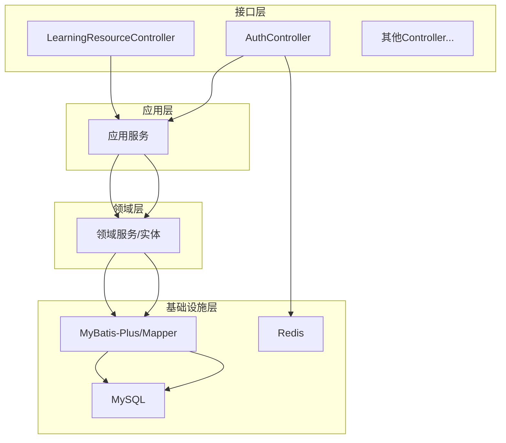
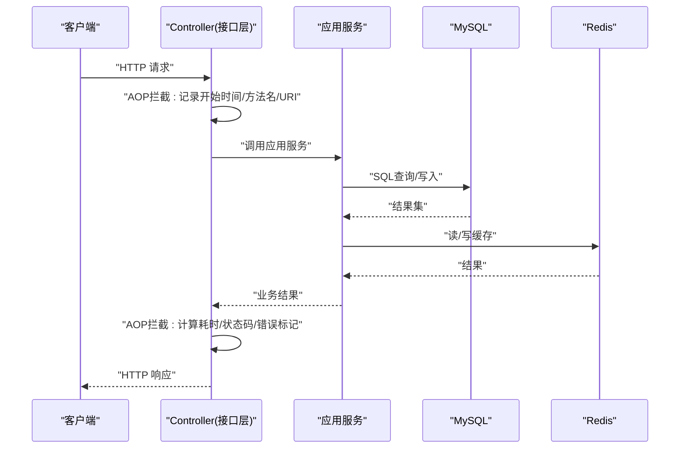
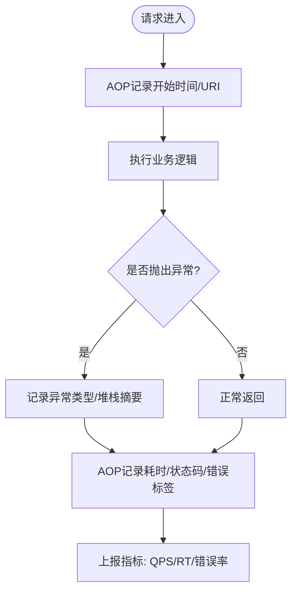
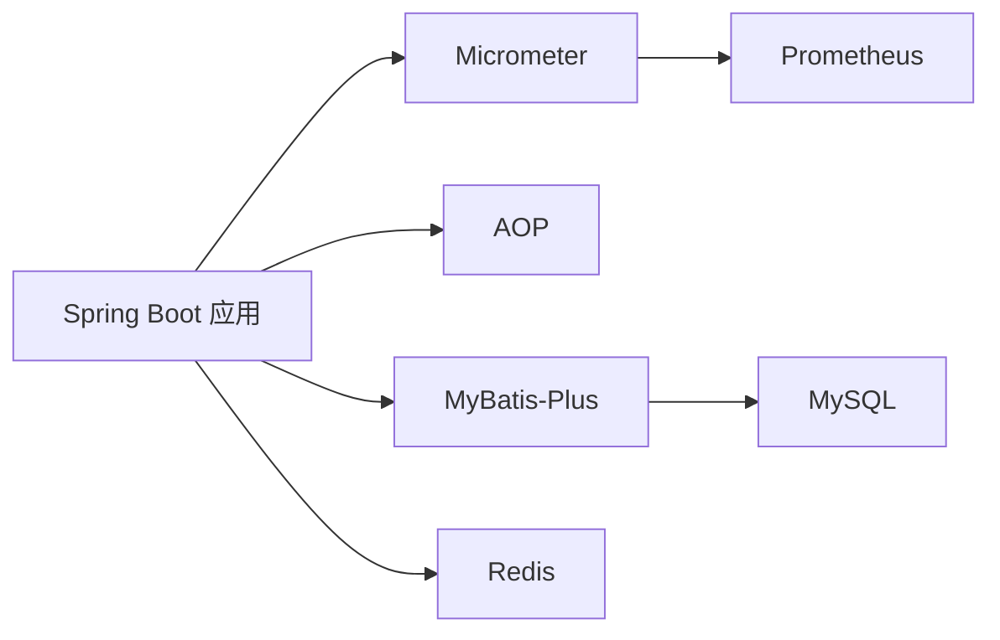

# 性能指标收集

<cite>
**本文引用的文件**
- [wzoto-backend/pom.xml](file://wzoto-backend/pom.xml)
- [wzoto-backend/wzoto-interfaces/src/main/resources/application.yml](file://wzoto-backend/wzoto-interfaces/src\main\resources\application.yml)
- [wzoto-backend/wzoto-interfaces/pom.xml](file://wzoto-backend/wzoto-interfaces/pom.xml)
- [wzoto-backend/wzoto-interfaces/src/main/java/com/wzoto/interfaces/common/GlobalExceptionHandler.java](file://wzoto-backend/wzoto-interfaces/src/main/java/com/wzoto/interfaces/common/GlobalExceptionHandler.java)
- [wzoto-backend/wzoto-interfaces/src/main/java/com/wzoto/interfaces/common/R.java](file://wzoto-backend/wzoto-interfaces/src/main/java/com/wzoto/interfaces/common/R.java)
- [wzoto-backend/wzoto-interfaces/src/main/java/com/wzoto/interfaces/controller/AuthController.java](file://wzoto-backend/wzoto-interfaces/src/main/java/com/wzoto/interfaces/controller/AuthController.java)
- [wzoto-backend/wzoto-interfaces/src/main/java/com/wzoto/interfaces/controller/LearningResourceController.java](file://wzoto-backend/wzoto-interfaces/src/main/java/com/wzoto/interfaces/controller/LearningResourceController.java)
- [build_log.txt](file://build_log.txt)
</cite>

## 目录
1. [简介](#简介)
2. [项目结构](#项目结构)
3. [核心组件](#核心组件)
4. [架构总览](#架构总览)
5. [详细组件分析](#详细组件分析)
6. [依赖分析](#依赖分析)
7. [性能考量](#性能考量)
8. [故障排查指南](#故障排查指南)
9. [结论](#结论)
10. [附录：配置与展示示例](#附录配置与展示示例)

## 简介
本文件为 wzoto 后端服务的“性能指标收集”专项文档，目标是在当前代码基础上，给出可落地的指标体系、采集方案、存储与可视化设计、告警机制与落地配置建议。内容覆盖关键指标定义（QPS、响应时间、错误率、资源使用率）、应用层埋点、数据库监控、中间件指标、时序库选型与保留策略、Grafana 仪表板设计与告警规则等，并提供可直接参考的配置路径与实现要点。

## 项目结构
wzoto 后端采用分层架构：接口层（控制器）、应用层（用例编排）、领域层（业务实体与领域服务）、基础设施层（数据访问与外部集成）。当前工程已具备 Spring Boot 3.2.5、MyBatis-Plus、Redis、MySQL 等基础能力，并引入了 AOP 依赖，为统一指标采集提供了良好切入点。

图表来源
- [wzoto-backend/wzoto-interfaces/src/main/java/com/wzoto/interfaces/controller/AuthController.java](file://wzoto-backend/wzoto-interfaces/src/main/java/com/wzoto/interfaces/controller/AuthController.java)
- [wzoto-backend/wzoto-interfaces/src/main/java/com/wzoto/interfaces/controller/LearningResourceController.java](file://wzoto-backend/wzoto-interfaces/src/main/java/com/wzoto/interfaces/controller/LearningResourceController.java)

章节来源
- [wzoto-backend/pom.xml:1-126](file://wzoto-backend/pom.xml#L1-L126)
- [wzoto-backend/wzoto-interfaces/src/main/resources/application.yml:1-51](file://wzoto-backend/wzoto-interfaces/src/main/resources/application.yml#L1-L51)

## 核心组件
- 统一返回体 R<T>：用于标准化响应码与消息，便于计算错误率。
- 全局异常处理器 GlobalExceptionHandler：集中捕获参数校验、业务异常等，便于统计错误率与记录日志。
- AOP 依赖：可用于横切关注点（请求耗时、QPS、错误率）的无侵入式采集。
- 数据源与缓存：MySQL + Redis，可通过连接池与客户端暴露的指标进行资源监控。

章节来源
- [wzoto-backend/wzoto-interfaces/src/main/java/com/wzoto/interfaces/common/R.java:1-43](file://wzoto-backend/wzoto-interfaces/src/main/java/com/wzoto/interfaces/common/R.java#L1-L43)
- [wzoto-backend/wzoto-interfaces/src/main/java/com/wzoto/interfaces/common/GlobalExceptionHandler.java:1-35](file://wzoto-backend/wzoto-interfaces/src/main/java/com/wzoto/interfaces/common/GlobalExceptionHandler.java#L1-L35)
- [wzoto-backend/wzoto-interfaces/pom.xml:33-36](file://wzoto-backend/wzoto-interfaces/pom.xml#L33-L36)

## 架构总览
下图展示了从请求进入、处理到落库/缓存的完整链路，以及在此链路上埋点采集的关键指标位置。

图表来源
- [wzoto-backend/wzoto-interfaces/src/main/java/com/wzoto/interfaces/controller/AuthController.java](file://wzoto-backend/wzoto-interfaces/src/main/java/com/wzoto/interfaces/controller/AuthController.java)
- [wzoto-backend/wzoto-interfaces/src/main/java/com/wzoto/interfaces/controller/LearningResourceController.java](file://wzoto-backend/wzoto-interfaces/src/main/java/com/wzoto/interfaces/controller/LearningResourceController.java)
- [wzoto-backend/wzoto-interfaces/src/main/resources/application.yml:6-17](file://wzoto-backend/wzoto-interfaces/src/main/resources/application.yml#L6-L17)

## 详细组件分析

### 关键指标定义与监控意义
- QPS（每秒查询数）：衡量系统吞吐能力，用于容量评估与扩容决策。
- 响应时间（RT）：端到端延迟分布（P50/P90/P99），反映用户体验与瓶颈定位。
- 错误率：服务端错误（如 5xx）与业务错误（如 4xx）占比，体现稳定性与健壮性。
- 资源使用率：CPU、内存、GC、线程池、连接池、磁盘IO、网络IO等，用于容量规划与异常根因分析。

说明：上述指标在后续采集方案中均有对应埋点或平台能力支撑。

### 应用层埋点方案
- 基于 AOP 的 Controller 级埋点：
  - 在接口层通过 AOP 拦截所有 Controller 方法，记录 URI、方法名、入参摘要、开始/结束时间、状态码、异常类型。
  - 输出指标：QPS、RT（均值、分位）、错误率（按状态码维度）。
- 基于全局异常处理的错误统计：
  - 在 GlobalExceptionHandler 中对不同异常分类计数，结合状态码聚合错误率。
- 业务关键路径埋点：
  - 对高价值接口（如登录、下单、学习资源加载）增加业务指标（如成功率、失败原因）。

图表来源
- [wzoto-backend/wzoto-interfaces/pom.xml:33-36](file://wzoto-backend/wzoto-interfaces/pom.xml#L33-L36)
- [wzoto-backend/wzoto-interfaces/src/main/java/com/wzoto/interfaces/common/GlobalExceptionHandler.java:1-35](file://wzoto-backend/wzoto-interfaces/src/main/java/com/wzoto/interfaces/common/GlobalExceptionHandler.java#L1-L35)

章节来源
- [wzoto-backend/wzoto-interfaces/pom.xml:33-36](file://wzoto-backend/wzoto-interfaces/pom.xml#L33-L36)
- [wzoto-backend/wzoto-interfaces/src/main/java/com/wzoto/interfaces/common/GlobalExceptionHandler.java:1-35](file://wzoto-backend/wzoto-interfaces/src/main/java/com/wzoto/interfaces/common/GlobalExceptionHandler.java#L1-L35)

### 数据库监控
- 连接池指标：活跃连接数、等待队列、空闲连接、获取/释放耗时、最大连接数使用率。
- SQL 指标：慢查询数量、平均执行时间、QPS、锁等待、死锁次数。
- 建议接入方式：
  - 使用连接池（如 HikariCP）暴露的 Micrometer 指标，或通过 MyBatis-Plus 的 SQL 日志与慢查询开关辅助定位。
  - 结合 MySQL 自身监控（如 performance_schema 或导出器）采集更细粒度指标。

章节来源
- [wzoto-backend/wzoto-interfaces/src/main/resources/application.yml:6-17](file://wzoto-backend/wzoto-interfaces/src/main/resources/application.yml#L6-L17)

### 中间件指标收集（Redis）
- 连接与命令：连接数、命中率、命令耗时、内存使用、持久化状态。
- 建议接入方式：
  - 通过 Redis 客户端暴露的 Micrometer 指标或 Redis Exporter 采集。
  - 结合应用侧缓存命中/未命中统计，形成业务视角的缓存健康度。

章节来源
- [wzoto-backend/wzoto-interfaces/src/main/resources/application.yml:12-17](file://wzoto-backend/wzoto-interfaces/src/main/resources/application.yml#L12-L17)

### 监控数据存储
- 时序数据库选择：Prometheus（开源、生态成熟）或云厂商托管 TSDB；若需长期归档与复杂查询，可搭配 Thanos/Cortex。
- 数据保留策略：
  - 热数据（小时级）：7-30 天
  - 温数据（分钟级）：30-90 天
  - 冷数据（小时/天级聚合）：90-365 天
- 数据压缩方案：
  - 启用 TSDB 内置压缩（如 Prometheus 的块压缩）
  - 降采样（downsample）：将高频指标聚合为低频指标以节省空间
  - 标签治理：控制标签基数，避免高基数字典膨胀

### 指标可视化（Grafana）
- 仪表板设计建议：
  - 概览页：QPS、RT（P50/P90/P99）、错误率、资源使用率（CPU/内存/GC）
  - 接口明细：Top N 接口 RT 趋势、错误率排行、QPS 排行
  - 数据库：连接池使用率、慢查询趋势、锁等待
  - 缓存：命中率、内存使用、命令耗时
- 关键指标展示：
  - 使用折线图展示趋势，热力图展示 RT 分布，仪表盘展示实时值
  - 提供多维度筛选（服务、实例、接口、状态码）

### 告警机制配置
- 阈值设置原则：
  - 基于历史基线（如 P95 RT 超过近7日均值+2倍标准差）
  - 结合业务 SLA（如错误率 > 1% 持续5分钟）
- 告警规则示例：
  - 接口错误率 > 5%（5分钟窗口）
  - P99 RT > 2s（10分钟窗口）
  - CPU > 80% 持续10分钟
  - 连接池使用率 > 90% 持续5分钟
- 通知渠道：
  - 企业微信/钉钉机器人、邮件、短信、电话（严重级别）
  - 告警收敛与升级策略（重复告警抑制、值班升级）

## 依赖分析
- 构建日志显示项目中存在 micrometer、dropwizard metrics 等依赖，表明具备接入统一指标体系的先决条件。
- AOP starter 已引入，便于无侵入式采集。
- 数据源与缓存已在 application.yml 中配置，便于后续接入连接池与客户端指标。

图表来源
- [build_log.txt:34-37](file://build_log.txt#L34-L37)
- [wzoto-backend/wzoto-interfaces/pom.xml:33-36](file://wzoto-backend/wzoto-interfaces/pom.xml#L33-L36)
- [wzoto-backend/wzoto-interfaces/src/main/resources/application.yml:6-17](file://wzoto-backend/wzoto-interfaces/src/main/resources/application.yml#L6-L17)

章节来源
- [build_log.txt:34-37](file://build_log.txt#L34-L37)
- [wzoto-backend/wzoto-interfaces/pom.xml:33-36](file://wzoto-backend/wzoto-interfaces/pom.xml#L33-L36)
- [wzoto-backend/wzoto-interfaces/src/main/resources/application.yml:6-17](file://wzoto-backend/wzoto-interfaces/src/main/resources/application.yml#L6-L17)

## 性能考量
- 指标采集开销控制：
  - 采样策略：对高频指标进行采样（如每N个请求上报一次）
  - 标签基数控制：避免过多样本导致存储与查询成本上升
  - 异步上报：指标上报走独立线程或批处理，降低主流程影响
- 数据库与缓存优化：
  - 合理设置连接池大小与超时，避免连接耗尽
  - 对热点数据加缓存，减少数据库压力
- 前端体验：
  - 对关键页面进行首屏渲染时间与接口 RT 的前端埋点，与后端指标联动分析

## 故障排查指南
- 快速定位问题：
  - 通过错误率与 RT 突增定位异常接口
  - 查看连接池与数据库慢查询，识别资源瓶颈
  - 检查 Redis 命中率与内存使用，判断缓存失效或热点键
- 日志与指标联动：
  - 在 GlobalExceptionHandler 中记录异常摘要与上下文，配合指标定位根因
  - 使用 TraceId 关联请求全链路日志与指标

章节来源
- [wzoto-backend/wzoto-interfaces/src/main/java/com/wzoto/interfaces/common/GlobalExceptionHandler.java:1-35](file://wzoto-backend/wzoto-interfaces/src/main/java/com/wzoto/interfaces/common/GlobalExceptionHandler.java#L1-L35)

## 结论
通过在接口层引入 AOP 埋点、结合数据库与缓存指标、统一接入 Micrometer 与 Prometheus，并在 Grafana 中构建可视化与告警，wzoto 可获得完整的性能观测能力。建议在灰度阶段逐步放开指标粒度，结合业务 SLA 制定告警规则，确保系统在稳定与可观测之间取得平衡。

## 附录：配置与展示示例

### 应用层埋点（AOP）实施要点
- 在 Controller 入口拦截，记录 URI、方法名、状态码、耗时
- 在异常分支记录错误类型与堆栈摘要
- 将指标上报至 Micrometer，由 Prometheus 抓取

章节来源
- [wzoto-backend/wzoto-interfaces/pom.xml:33-36](file://wzoto-backend/wzoto-interfaces/pom.xml#L33-L36)
- [wzoto-backend/wzoto-interfaces/src/main/java/com/wzoto/interfaces/common/GlobalExceptionHandler.java:1-35](file://wzoto-backend/wzoto-interfaces/src/main/java/com/wzoto/interfaces/common/GlobalExceptionHandler.java#L1-L35)

### 数据库与缓存监控
- 在 application.yml 中确认数据源与 Redis 配置
- 接入连接池与客户端指标，观察连接池使用率、慢查询、缓存命中率

章节来源
- [wzoto-backend/wzoto-interfaces/src/main/resources/application.yml:6-17](file://wzoto-backend/wzoto-interfaces/src/main/resources/application.yml#L6-L17)

### 指标可视化（Grafana）
- 创建“服务总览”面板：QPS、RT、错误率、CPU、内存
- 创建“接口详情”面板：按 URI 维度展示 RT 分布与错误率
- 创建“数据库/缓存”面板：连接池、慢查询、命中率

### 告警规则（示例）
- 接口错误率 > 5%（5分钟）
- P99 RT > 2s（10分钟）
- CPU > 80%（10分钟）
- 连接池使用率 > 90%（5分钟）