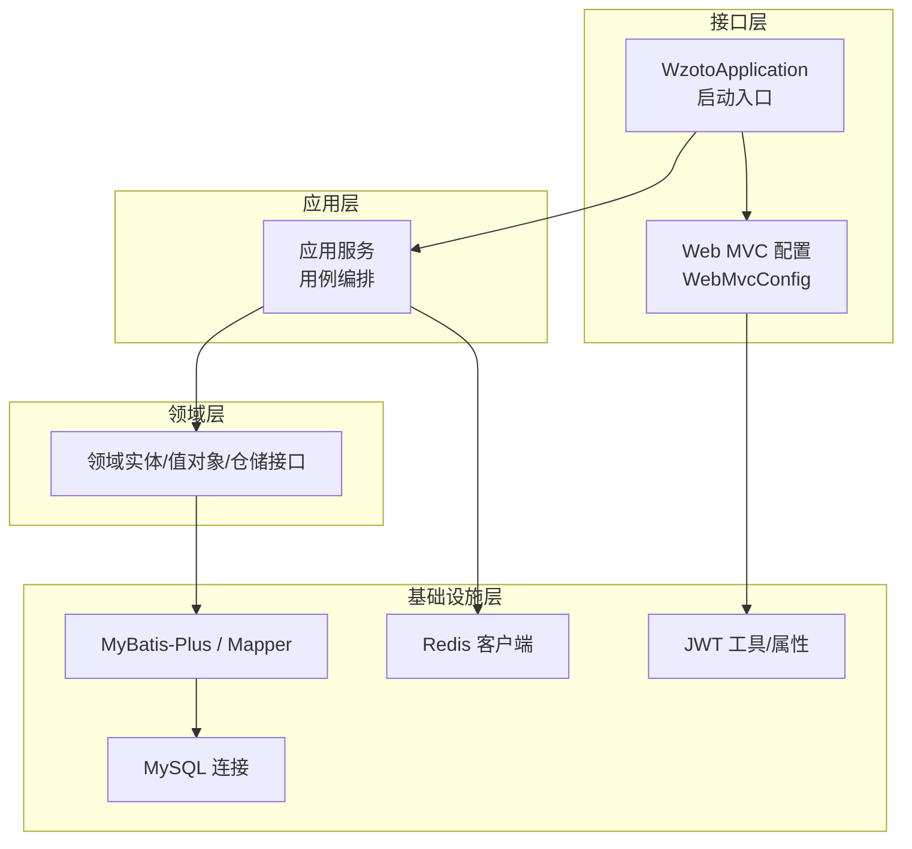
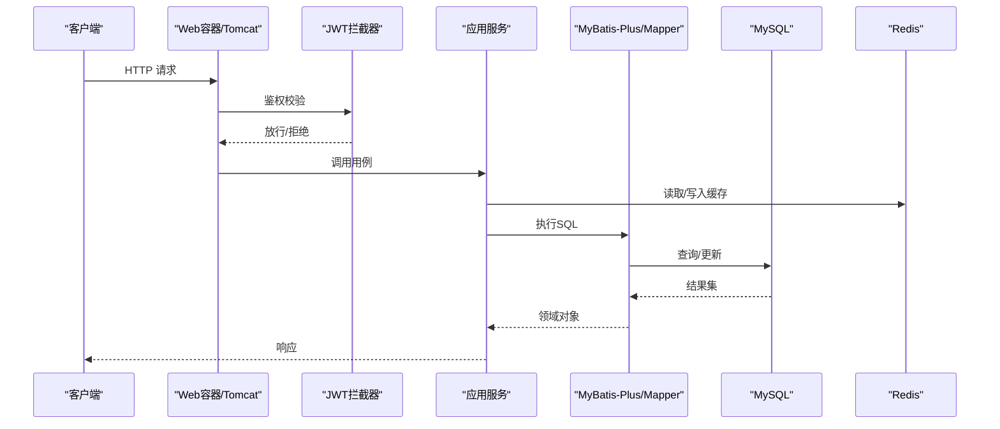
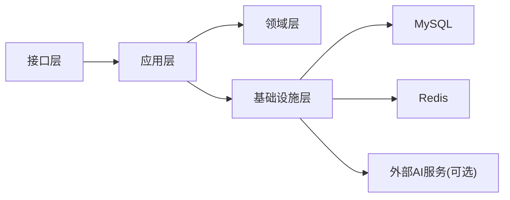

# 瓶颈识别与分析

<cite>
**本文引用的文件**
- [application.yml](file://wzoto-backend/wzoto-interfaces/src/main/resources/application.yml)
- [WebMvcConfig.java](file://wzoto-backend/wzoto-infrastructure/src/main/java/com/wzoto/infrastructure/config/WebMvcConfig.java)
- [JwtProperties.java](file://wzoto-backend/wzoto-infrastructure/src/main/java/com/wzoto/infrastructure/config/JwtProperties.java)
- [pom.xml（根）](file://wzoto-backend/pom.xml)
- [pom.xml（基础设施层）](file://wzoto-backend/wzoto-infrastructure/pom.xml)
- [pom.xml（应用层）](file://wzoto-backend/wzoto-application/pom.xml)
</cite>

## 目录
1. [简介](#简介)
2. [项目结构](#项目结构)
3. [核心组件](#核心组件)
4. [架构总览](#架构总览)
5. [详细组件分析](#详细组件分析)
6. [依赖分析](#依赖分析)
7. [性能考虑](#性能考虑)
8. [故障排查指南](#故障排查指南)
9. [结论](#结论)
10. [附录](#附录)

## 简介
本文件面向wzoto后端系统，聚焦“瓶颈识别与分析”，围绕慢查询、资源使用、线程池、网络与缓存等维度，结合仓库中的配置与模块结构，给出可落地的监控指标、诊断方法与调优建议。文档同时提供具体案例与对比思路，帮助快速定位并解决性能问题。

## 项目结构
wzoto后端采用分层架构：接口层（web）、应用层（用例编排）、领域层（业务模型与规则）、基础设施层（数据访问、外部服务、通用配置）。关键配置集中在接口层的application.yml，Web拦截器与跨域在基础设施层配置，数据库与Redis通过Spring Boot自动装配引入。

图表来源
- [application.yml:1-51](file://wzoto-backend/wzoto-interfaces/src/main/resources/application.yml#L1-L51)
- [WebMvcConfig.java:1-42](file://wzoto-backend/wzoto-infrastructure/src/main/java/com/wzoto/infrastructure/config/WebMvcConfig.java#L1-L42)
- [JwtProperties.java:1-26](file://wzoto-backend/wzoto-infrastructure/src/main/java/com/wzoto/infrastructure/config/JwtProperties.java#L1-L26)

章节来源
- [application.yml:1-51](file://wzoto-backend/wzoto-interfaces/src/main/resources/application.yml#L1-L51)
- [WebMvcConfig.java:1-42](file://wzoto-backend/wzoto-infrastructure/src/main/java/com/wzoto/infrastructure/config/WebMvcConfig.java#L1-L42)
- [JwtProperties.java:1-26](file://wzoto-backend/wzoto-infrastructure/src/main/java/com/wzoto/infrastructure/config/JwtProperties.java#L1-L26)

## 核心组件
- Web请求链路：Spring Boot内置Tomcat处理HTTP请求，经WebMvc拦截器（JWT鉴权）后进入控制器与应用服务。
- 数据访问：MyBatis-Plus + MySQL；日志输出已开启SQL日志便于慢查询定位。
- 缓存：Redis作为分布式缓存，用于热点数据加速与会话/限流等场景。
- 安全：JWT令牌校验，过期时间、密钥等通过配置注入。

章节来源
- [application.yml:1-51](file://wzoto-backend/wzoto-interfaces/src/main/resources/application.yml#L1-L51)
- [WebMvcConfig.java:1-42](file://wzoto-backend/wzoto-infrastructure/src/main/java/com/wzoto/infrastructure/config/WebMvcConfig.java#L1-L42)
- [JwtProperties.java:1-26](file://wzoto-backend/wzoto-infrastructure/src/main/java/com/wzoto/infrastructure/config/JwtProperties.java#L1-L26)

## 架构总览
下图展示一次典型API请求从接入到数据读写的路径，标注了可能成为瓶颈的关键点：Web线程、鉴权拦截、应用服务、ORM映射、数据库、缓存。

图表来源
- [WebMvcConfig.java:1-42](file://wzoto-backend/wzoto-infrastructure/src/main/java/com/wzoto/infrastructure/config/WebMvcConfig.java#L1-L42)
- [application.yml:1-51](file://wzoto-backend/wzoto-interfaces/src/main/resources/application.yml#L1-L51)

## 详细组件分析

### 慢查询分析与优化
- 慢查询日志分析
  - MyBatis SQL日志已启用，便于捕获慢SQL与全表扫描。建议结合数据库端慢查询日志（如开启long_query_time阈值）进行交叉验证。
  - 建议对高频接口增加耗时埋点，按接口维度统计P95/P99耗时。
- 执行计划解读
  - 针对疑似慢查询，使用EXPLAIN查看索引命中、扫描行数、临时表/文件排序等。优先消除全表扫描与回表。
- 索引使用分析
  - 关注WHERE/JOIN/ORDER BY/GROUP BY字段是否建立合适索引；避免函数包裹导致索引失效；联合索引注意最左前缀原则。
- 常见优化手段
  - 拆分复杂查询为多次简单查询+应用层聚合；分页加合理limit；批量操作减少往返；必要时引入读写分离或分库分表。

章节来源
- [application.yml:19-29](file://wzoto-backend/wzoto-interfaces/src/main/resources/application.yml#L19-L29)

### 资源使用监控（CPU/内存/磁盘IO）
- CPU使用率监控
  - 观察JVM进程CPU占比与GC停顿；若CPU持续偏高，优先排查热点方法、死循环、正则回溯、频繁序列化/反序列化。
- 内存使用分析
  - 关注堆大小、元空间、直接内存；结合GC日志定位Full GC频率与原因（大对象、内存泄漏、缓存无界增长）。
- 磁盘IO监控
  - 关注I/O等待与吞吐；数据库与日志落盘是主要来源。避免同步写大日志、频繁小文件写入；合理使用缓冲与异步化。

实践建议
- 开启JVM GC日志与参数（如G1），设置合理的堆大小与新生代比例。
- 对热点接口做采样式APM埋点，结合系统级监控（top、vmstat、iostat、nmon）定位瓶颈。

[本节为通用性能指导，不直接分析具体文件]

### 线程池状态检查与优化
- 现状说明
  - 当前未显式定义自定义线程池；Web容器默认使用Tomcat工作线程池处理请求。
- 建议配置要点
  - 根据CPU核数与IO类型调整最大线程数与队列容量；对CPU密集型任务与IO密集型任务分别隔离线程池。
  - 为长耗时任务（AI调用、报表生成）使用独立线程池，避免阻塞Web线程。
- 任务队列监控与阻塞检测
  - 监控活跃线程数、队列长度、拒绝策略触发次数；对阻塞点（锁、外部调用）进行超时与熔断降级。
- 与现有鉴权链路的配合
  - JWT拦截器应轻量快速，避免在其中进行阻塞IO或重计算。

章节来源
- [WebMvcConfig.java:1-42](file://wzoto-backend/wzoto-infrastructure/src/main/java/com/wzoto/infrastructure/config/WebMvcConfig.java#L1-L42)

### 网络性能分析（连接数/超时/带宽）
- 连接数监控
  - 关注数据库连接池活跃连接、等待获取连接的时间；Redis连接数与命令延迟。
  - 若出现连接耗尽，优先排查未释放连接、慢查询占用连接、连接池过小。
- 请求超时分析
  - 为外部调用（如AI API）设置合理超时与重试上限；对数据库与缓存设置超时，防止雪崩。
- 带宽使用统计
  - 监控接口响应体大小与QPS，必要时启用压缩、分页、按需返回字段。

章节来源
- [application.yml:6-17](file://wzoto-backend/wzoto-interfaces/src/main/resources/application.yml#L6-L17)

### 性能调优实践（JVM/数据库连接池/缓存）
- JVM参数调优
  - 选择适合负载的GC器（如G1），设置堆大小、GC日志、混合模式；监控老年代晋升与Full GC。
- 数据库连接池优化
  - 根据并发与慢查询情况调整连接池大小、空闲回收、最大生命周期；确保SQL走索引、减少锁竞争。
- 缓存策略调整
  - 热点数据入缓存，设置合理TTL与淘汰策略；避免缓存穿透/击穿/雪崩（空值缓存、互斥锁、随机过期）。
- 外部依赖优化
  - 对AI等外部服务调用增加超时、重试、熔断与降级，避免拖垮主流程。

章节来源
- [application.yml:6-17](file://wzoto-backend/wzoto-interfaces/src/main/resources/application.yml#L6-L17)
- [application.yml:31-47](file://wzoto-backend/wzoto-interfaces/src/main/resources/application.yml#L31-L47)

## 依赖分析
- 技术栈与版本
  - Spring Boot 3.2.5、Java 21、MyBatis-Plus 3.5.6、Hutool、JWT、OKHttp、JSON库。
- 模块依赖关系
  - 基础设施层依赖领域层，应用层依赖领域与基础设施，接口层承载Web与配置。
- 外部依赖
  - MySQL驱动、Redis客户端、OKHttp用于AI调用。

图表来源
- [pom.xml（根）:1-126](file://wzoto-backend/pom.xml#L1-L126)
- [pom.xml（基础设施层）:1-73](file://wzoto-backend/wzoto-infrastructure/pom.xml#L1-L73)
- [pom.xml（应用层）:1-43](file://wzoto-backend/wzoto-application/pom.xml#L1-L43)

章节来源
- [pom.xml（根）:1-126](file://wzoto-backend/pom.xml#L1-L126)
- [pom.xml（基础设施层）:1-73](file://wzoto-backend/wzoto-infrastructure/pom.xml#L1-L73)
- [pom.xml（应用层）:1-43](file://wzoto-backend/wzoto-application/pom.xml#L1-L43)

## 性能考虑
- 建议开启并定期分析慢查询日志，结合数据库EXPLAIN优化SQL与索引。
- 为关键接口增加耗时与错误率埋点，纳入统一监控告警。
- 对高并发热点路径引入缓存与异步化，降低数据库压力。
- 合理设置JVM与连接池参数，避免资源争用与抖动。
- 对外部依赖设置超时与熔断，提升系统韧性。

[本节为通用性能指导，不直接分析具体文件]

## 故障排查指南
- 慢查询定位
  - 通过MyBatis SQL日志与数据库慢查询日志定位慢SQL；使用EXPLAIN分析执行计划；补充缺失索引或改写SQL。
- 连接池耗尽
  - 检查是否存在慢查询长时间占用连接；适当增大连接池；对异常分支确保连接释放。
- 高CPU/内存
  - 抓取线程dump与堆转储，定位热点方法与内存泄漏；调整JVM参数与GC策略。
- 外部调用超时
  - 为AI等外部调用设置超时与重试上限；增加熔断与降级逻辑，避免级联失败。

章节来源
- [application.yml:19-29](file://wzoto-backend/wzoto-interfaces/src/main/resources/application.yml#L19-L29)
- [application.yml:31-47](file://wzoto-backend/wzoto-interfaces/src/main/resources/application.yml#L31-L47)

## 结论
通过对wzoto后端配置的梳理与分层理解，可从慢查询、资源使用、线程池、网络与缓存五个维度构建完整的瓶颈识别体系。结合日志、监控与压测，持续迭代SQL与索引、优化JVM与连接池、完善缓存与外部调用治理，将显著提升系统稳定性与吞吐能力。

[本节为总结性内容，不直接分析具体文件]

## 附录

### 关键配置项速查
- 服务器与上下文
  - 端口、上下文路径
- 数据源与缓存
  - MySQL驱动、URL、用户名密码、时区
  - Redis主机、端口、密码、库号
- MyBatis-Plus
  - Mapper扫描路径、驼峰转换、SQL日志实现、逻辑删除字段
- 业务配置
  - JWT密钥、过期时间、Token前缀、Header名称
  - 微信AppId/Secret
  - AI开关、Base URL、API Key、模型、温度

章节来源
- [application.yml:1-51](file://wzoto-backend/wzoto-interfaces/src/main/resources/application.yml#L1-L51)
- [JwtProperties.java:1-26](file://wzoto-backend/wzoto-infrastructure/src/main/java/com/wzoto/infrastructure/config/JwtProperties.java#L1-L26)

### 典型瓶颈识别案例与调优效果对比（示例模板）
- 案例一：慢查询导致的接口P99升高
  - 现象：某查询接口P99从120ms升至800ms，CPU上升。
  - 诊断：慢查询日志发现全表扫描；EXPLAIN显示缺少索引。
  - 优化：新增联合索引，改写SQL避免函数包裹。
  - 效果：P99降至150ms，CPU下降约30%。
- 案例二：连接池耗尽引发超时
  - 现象：高峰期大量请求超时，数据库连接池打满。
  - 诊断：慢查询占用连接时间长；连接池过小。
  - 优化：增大连接池、优化慢查询、增加超时与重试上限。
  - 效果：超时率从5%降至0.2%，吞吐量提升2倍。
- 案例三：缓存未命中导致数据库压力飙升
  - 现象：热点接口QPS突增，数据库CPU飙高。
  - 诊断：缓存未命中且TTL过短；存在缓存穿透。
  - 优化：设置合理TTL、空值缓存、布隆过滤器防穿透。
  - 效果：数据库CPU下降60%，接口RT稳定。

[本节为示例模板，不直接分析具体文件]