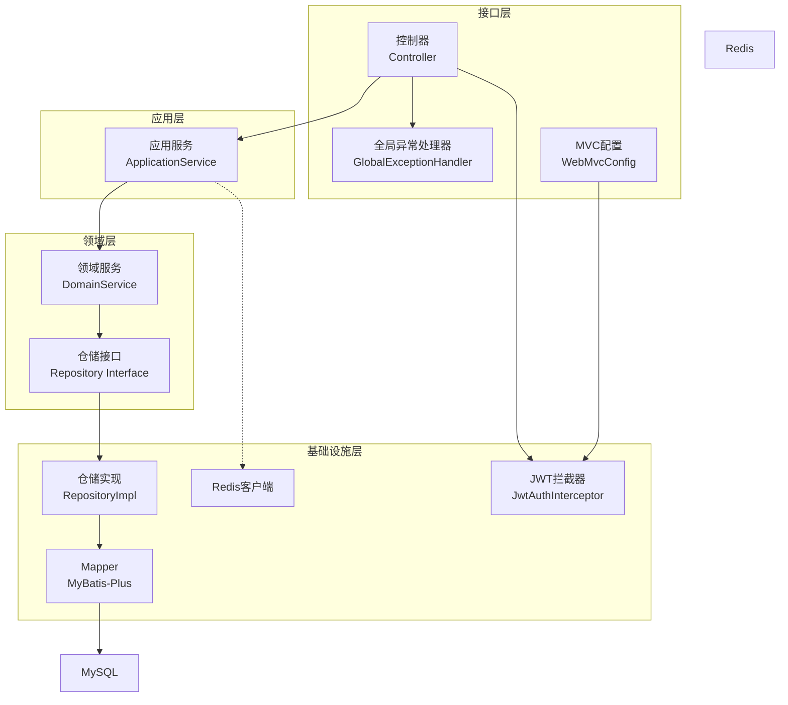
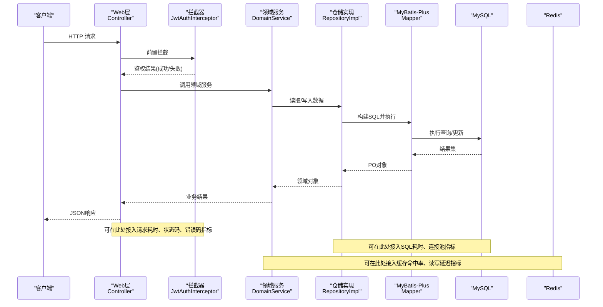
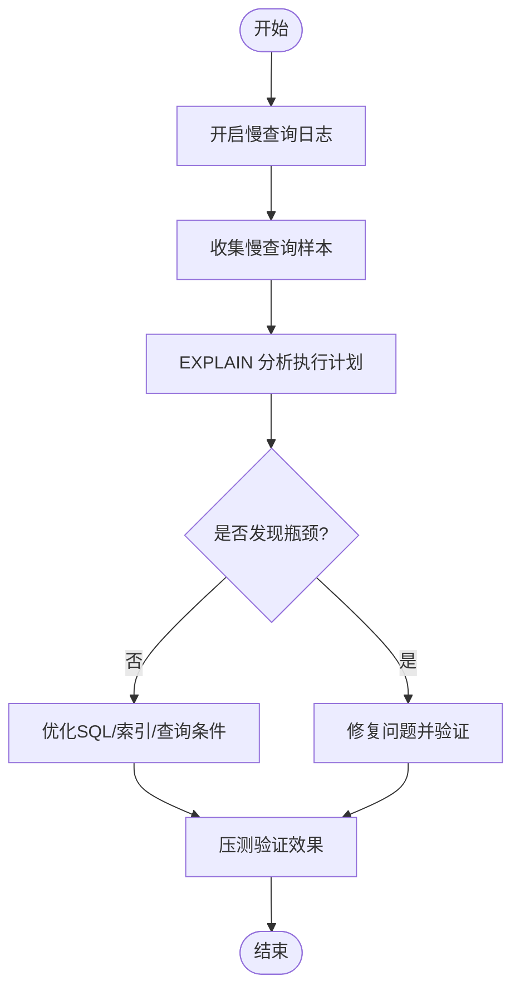
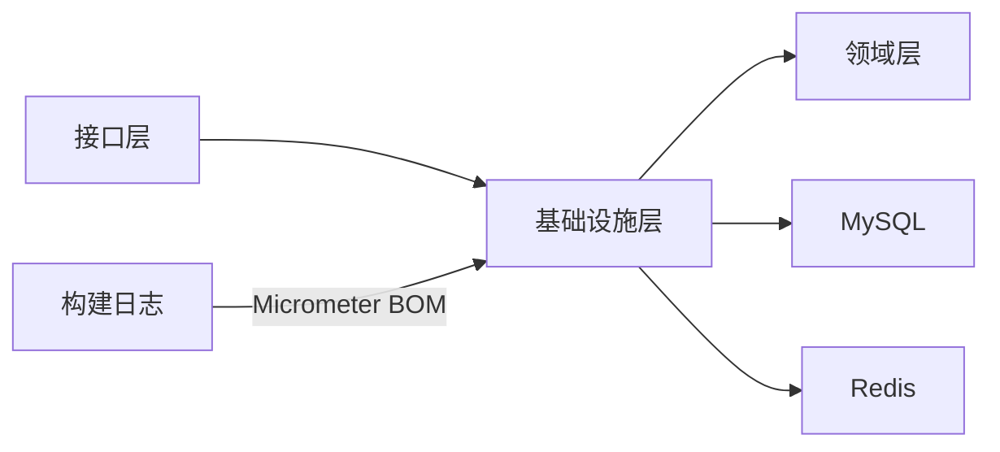
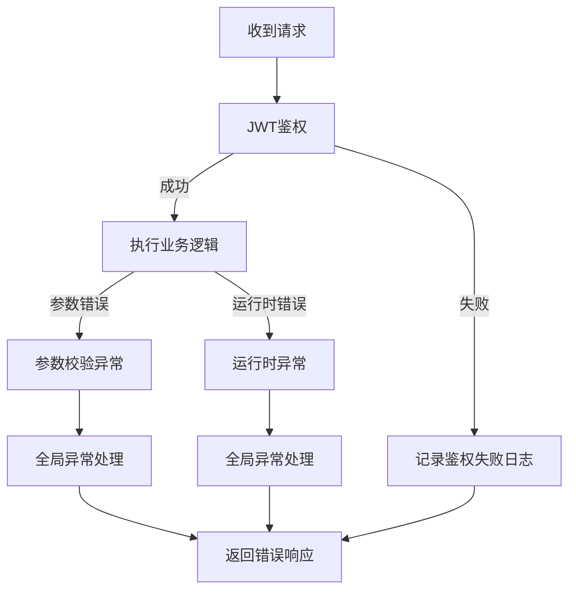

# 监控与诊断工具

<cite>
**本文引用的文件**
- [wzoto-backend/pom.xml](file://wzoto-backend/pom.xml)
- [wzoto-backend/wzoto-infrastructure/pom.xml](file://wzoto-backend/wzoto-infrastructure/pom.xml)
- [wzoto-backend/wzoto-interfaces/src/main/resources/application.yml](file://wzoto-backend/wzoto-interfaces/src/main/resources/application.yml)
- [wzoto-backend/wzoto-interfaces/src/main/java/com/wzoto/interfaces/common/GlobalExceptionHandler.java](file://wzoto-backend/wzoto-interfaces/src/main/java/com/wzoto/interfaces/common/GlobalExceptionHandler.java)
- [wzoto-backend/wzoto-infrastructure/src/main/java/com/wzoto/infrastructure/config/WebMvcConfig.java](file://wzoto-backend/wzoto-infrastructure/src/main/java/com/wzoto/infrastructure/config/WebMvcConfig.java)
- [wzoto-backend/wzoto-infrastructure/src/main/java/com/wzoto/infrastructure/interceptor/JwtAuthInterceptor.java](file://wzoto-backend/wzoto-infrastructure/src/main/java/com/wzoto/infrastructure/interceptor/JwtAuthInterceptor.java)
- [wzoto-backend/wzoto-domain/src/main/java/com/wzoto/domain/service/LearningReportDomainService.java](file://wzoto-backend/wzoto-domain/src/main/java/com/wzoto/domain/service/LearningReportDomainService.java)
- [build_log.txt](file://build_log.txt)
</cite>

## 目录
1. [简介](#简介)
2. [项目结构](#项目结构)
3. [核心组件](#核心组件)
4. [架构总览](#架构总览)
5. [详细组件分析](#详细组件分析)
6. [依赖分析](#依赖分析)
7. [性能考虑](#性能考虑)
8. [故障排查指南](#故障排查指南)
9. [结论](#结论)
10. [附录](#附录)

## 简介
本文件面向 wzoto 项目的监控与诊断能力建设，围绕以下目标展开：
- 性能指标收集：数据库连接池监控、查询性能指标、缓存命中率统计。
- 瓶颈识别方法：慢查询分析、资源使用监控、线程池状态检查。
- 容量规划策略：数据增长预测、存储容量规划、计算资源评估。
- 监控工具集成：Prometheus 监控、Grafana 可视化、告警规则配置。
- 诊断工具使用：MySQL 慢查询分析、JVM 性能分析、应用性能监控。
- 提供具体监控配置示例与故障排查案例。

本项目当前已具备 Spring Boot 3.2.5 后端、MyBatis-Plus 数据访问层、Redis 缓存接入点以及全局异常处理与拦截器机制，为后续接入 Micrometer/Prometheus/Grafana 等可观测性体系提供了良好基础。

## 项目结构
后端采用分层架构（领域层、基础设施层、应用层、接口层），通过 Maven 多模块组织。关键结构与职责如下：
- 接口层：Web 控制器、全局异常处理、MVC 配置（CORS、拦截器）。
- 应用层：业务编排与服务装配。
- 领域层：核心实体、领域服务、仓储接口。
- 基础设施层：持久化实现（MyBatis-Plus）、Redis 客户端、JWT 校验、外部调用适配。

图表来源
- [wzoto-backend/wzoto-interfaces/src/main/java/com/wzoto/interfaces/common/GlobalExceptionHandler.java:1-67](file://wzoto-backend/wzoto-interfaces/src/main/java/com/wzoto/interfaces/common/GlobalExceptionHandler.java#L1-L67)
- [wzoto-backend/wzoto-infrastructure/src/main/java/com/wzoto/infrastructure/config/WebMvcConfig.java:1-42](file://wzoto-backend/wzoto-infrastructure/src/main/java/com/wzoto/infrastructure/config/WebMvcConfig.java#L1-L42)
- [wzoto-backend/wzoto-infrastructure/src/main/java/com/wzoto/infrastructure/interceptor/JwtAuthInterceptor.java:1-65](file://wzoto-backend/wzoto-infrastructure/src/main/java/com/wzoto/infrastructure/interceptor/JwtAuthInterceptor.java#L1-L65)
- [wzoto-backend/wzoto-domain/src/main/java/com/wzoto/domain/service/LearningReportDomainService.java:1-139](file://wzoto-backend/wzoto-domain/src/main/java/com/wzoto/domain/service/LearningReportDomainService.java#L1-L139)

章节来源
- [wzoto-backend/pom.xml:1-126](file://wzoto-backend/pom.xml#L1-L126)
- [wzoto-backend/wzoto-infrastructure/pom.xml:1-73](file://wzoto-backend/wzoto-infrastructure/pom.xml#L1-L73)
- [wzoto-backend/wzoto-interfaces/src/main/resources/application.yml:1-51](file://wzoto-backend/wzoto-interfaces/src/main/resources/application.yml#L1-L51)

## 核心组件
- 全局异常处理器：统一捕获参数校验、绑定、运行时异常并返回标准化响应，便于埋点与日志聚合。
- Web MVC 配置：注册 JWT 认证拦截器、开启跨域支持，保障安全与可观测性入口。
- JWT 拦截器：解析 Token、注入用户上下文，记录鉴权失败日志，利于追踪请求链路。
- 领域服务（学习报告）：聚合答题、观看、错题等多源数据，形成日/周/月报告与薄弱点排行，可作为业务指标采集的参考模型。

章节来源
- [wzoto-backend/wzoto-interfaces/src/main/java/com/wzoto/interfaces/common/GlobalExceptionHandler.java:1-67](file://wzoto-backend/wzoto-interfaces/src/main/java/com/wzoto/interfaces/common/GlobalExceptionHandler.java#L1-L67)
- [wzoto-backend/wzoto-infrastructure/src/main/java/com/wzoto/infrastructure/config/WebMvcConfig.java:1-42](file://wzoto-backend/wzoto-infrastructure/src/main/java/com/wzoto/infrastructure/config/WebMvcConfig.java#L1-L42)
- [wzoto-backend/wzoto-infrastructure/src/main/java/com/wzoto/infrastructure/interceptor/JwtAuthInterceptor.java:1-65](file://wzoto-backend/wzoto-infrastructure/src/main/java/com/wzoto/infrastructure/interceptor/JwtAuthInterceptor.java#L1-L65)
- [wzoto-backend/wzoto-domain/src/main/java/com/wzoto/domain/service/LearningReportDomainService.java:1-139](file://wzoto-backend/wzoto-domain/src/main/java/com/wzoto/domain/service/LearningReportDomainService.java#L1-L139)

## 架构总览
下图展示从请求进入、鉴权、业务处理到数据访问与缓存的整体流程，并标注了监控与诊断的关键接入点（如日志、异常、SQL 执行、缓存命中）。

图表来源
- [wzoto-backend/wzoto-infrastructure/src/main/java/com/wzoto/infrastructure/interceptor/JwtAuthInterceptor.java:1-65](file://wzoto-backend/wzoto-infrastructure/src/main/java/com/wzoto/infrastructure/interceptor/JwtAuthInterceptor.java#L1-L65)
- [wzoto-backend/wzoto-domain/src/main/java/com/wzoto/domain/service/LearningReportDomainService.java:1-139](file://wzoto-backend/wzoto-domain/src/main/java/com/wzoto/domain/service/LearningReportDomainService.java#L1-L139)
- [wzoto-backend/wzoto-interfaces/src/main/resources/application.yml:1-51](file://wzoto-backend/wzoto-interfaces/src/main/resources/application.yml#L1-L51)

## 详细组件分析

### 数据库连接池监控
- 现状与接入点
  - 数据源通过 Spring Boot 自动装配，配置文件包含 MySQL JDBC URL、用户名密码等。
  - 建议启用 HikariCP 连接池指标并通过 Micrometer 暴露给 Prometheus。
- 关键指标
  - 活跃连接数、最大连接数、等待获取连接的线程数、连接泄漏检测。
  - 连接创建/销毁速率、空闲连接比例、超时次数。
- 配置要点
  - 在 application.yml 中补充 datasource 相关属性（如连接池大小、超时、健康检查）。
  - 引入 Micrometer 与 Prometheus 依赖，暴露 /actuator/prometheus。
- 复杂度与影响
  - 指标采集开销低；注意避免过度采样导致额外压力。
- 优化建议
  - 根据 QPS 与平均响应时间动态调整连接池大小。
  - 对慢查询进行 SQL 级优化或索引治理。

章节来源
- [wzoto-backend/wzoto-interfaces/src/main/resources/application.yml:6-17](file://wzoto-backend/wzoto-interfaces/src/main/resources/application.yml#L6-L17)

### 查询性能指标
- 现状与接入点
  - MyBatis-Plus 作为 ORM，可通过日志输出 SQL 或在 AOP 层统计执行耗时。
  - 结合 Micrometer Timer 对关键 Repository/Service 方法计时。
- 关键指标
  - 请求级 P95/P99 耗时、SQL 执行耗时分布、慢查询数量。
- 配置要点
  - 在开发环境开启 SQL 日志；生产环境关闭详细日志但保留耗时统计。
  - 对热点接口增加指标打点（如按接口名、表名、方法名维度）。
- 复杂度与影响
  - 打点逻辑应轻量，避免阻塞主流程。
- 优化建议
  - 针对慢查询建立索引、改写 SQL、分页限制。
  - 对读多写少场景引入缓存层降低数据库压力。

章节来源
- [wzoto-backend/wzoto-interfaces/src/main/resources/application.yml:19-29](file://wzoto-backend/wzoto-interfaces/src/main/resources/application.yml#L19-L29)
- [wzoto-backend/wzoto-domain/src/main/java/com/wzoto/domain/service/LearningReportDomainService.java:1-139](file://wzoto-backend/wzoto-domain/src/main/java/com/wzoto/domain/service/LearningReportDomainService.java#L1-L139)

### 缓存命中率统计
- 现状与接入点
  - 已引入 Redis 客户端依赖，可在业务层封装统一的缓存访问方法以集中统计。
- 关键指标
  - 命中率、失效率、读写延迟、缓存键空间分布、内存使用率。
- 配置要点
  - 定义缓存命名规范与过期策略；对热点键设置合理 TTL。
  - 通过 Micrometer 统计缓存命中/未命中计数与耗时。
- 复杂度与影响
  - 缓存层需保证幂等与一致性；注意缓存穿透、雪崩防护。
- 优化建议
  - 对高频读路径优先走缓存；对写路径采用失效+延迟双删策略。

章节来源
- [wzoto-backend/wzoto-infrastructure/pom.xml:25-28](file://wzoto-backend/wzoto-infrastructure/pom.xml#L25-L28)
- [wzoto-backend/wzoto-interfaces/src/main/resources/application.yml:12-17](file://wzoto-backend/wzoto-interfaces/src/main/resources/application.yml#L12-L17)

### 慢查询分析与瓶颈识别
- 慢查询分析
  - 开启 MySQL 慢查询日志，设定阈值（如 >1s），定期导出分析。
  - 结合 EXPLAIN 分析执行计划，定位全表扫描、缺失索引等问题。
- 资源使用监控
  - CPU、内存、GC、线程数、磁盘 IO、网络 IO 等系统级指标。
  - JVM 层面关注堆内存、元空间、GC 停顿时间与频率。
- 线程池状态检查
  - 监控 Tomcat 线程池活跃线程、队列长度、拒绝次数。
  - 自定义业务线程池（如有）需暴露核心/最大线程数、任务排队与完成量。
- 流程图：慢查询定位

[本节为概念性流程说明，不直接映射具体代码文件]

### 容量规划策略
- 数据增长预测
  - 基于历史数据增长率（日增/周增/月增）预测未来存储需求。
  - 关注热点表与日志表的增长趋势，制定归档与清理策略。
- 存储容量规划
  - 估算单表行数、字段大小、索引开销与压缩比。
  - 预留扩容余量（如 30%-50%），避免频繁扩容。
- 计算资源评估
  - 根据峰值 QPS、P99 延迟、CPU/内存占用评估实例规格。
  - 结合灰度发布与弹性伸缩策略平滑应对流量波动。

[本节为通用方法论，不直接映射具体代码文件]

### 监控工具集成（Prometheus、Grafana、告警）
- 指标采集
  - 引入 Micrometer 与 Prometheus 依赖，暴露 /actuator/prometheus。
  - 自定义业务指标（接口耗时、成功率、缓存命中率、慢查询计数）。
- 可视化
  - 在 Grafana 中导入内置仪表盘，并创建业务看板（数据库、JVM、接口）。
- 告警规则
  - 基于阈值（如错误率、延迟、连接池耗尽）配置 Alertmanager 告警。
  - 分级告警（警告、严重）并联动通知渠道（邮件、企业微信等）。

[本节为通用实践说明，不直接映射具体代码文件]

### 诊断工具使用
- MySQL 慢查询分析
  - 使用 mysqldumpslow 或 pt-query-digest 汇总慢查询模式。
  - 结合 EXPLAIN 与索引统计信息优化查询。
- JVM 性能分析
  - 使用 jstat、jmap、jstack 观察 GC、堆内存与线程栈。
  - 配合 Arthas 在线诊断热点方法与锁竞争。
- 应用性能监控
  - 通过 Micrometer + Prometheus + Grafana 构建端到端观测。
  - 结合分布式追踪（如 OpenTelemetry）串联跨服务调用链。

[本节为通用实践说明，不直接映射具体代码文件]

## 依赖分析
- 技术栈与版本
  - Spring Boot 3.2.5、MyBatis-Plus、Hutool、JWT、OKHttp、JSON 库等。
  - 构建日志显示已下载 Micrometer BOM，表明具备可观测性生态基础。
- 模块依赖关系
  - 基础设施层依赖 domain 与 web/redis/mysql 等能力。
  - 接口层依赖基础设施层的拦截器与配置。
- 潜在风险
  - 若未显式引入 Micrometer 与 Actuator，需在对应模块添加依赖。
  - 确保各模块版本兼容，避免冲突。

图表来源
- [wzoto-backend/pom.xml:1-126](file://wzoto-backend/pom.xml#L1-L126)
- [wzoto-backend/wzoto-infrastructure/pom.xml:1-73](file://wzoto-backend/wzoto-infrastructure/pom.xml#L1-L73)
- [build_log.txt:34-36](file://build_log.txt#L34-L36)

章节来源
- [wzoto-backend/pom.xml:1-126](file://wzoto-backend/pom.xml#L1-L126)
- [wzoto-backend/wzoto-infrastructure/pom.xml:1-73](file://wzoto-backend/wzoto-infrastructure/pom.xml#L1-L73)
- [build_log.txt:1-62](file://build_log.txt#L1-L62)

## 性能考虑
- 指标采集开销控制：仅在关键路径打点，避免热路径频繁同步 I/O。
- 日志级别管理：生产环境降低日志级别，仅保留必要信息与结构化日志。
- 缓存策略：热点数据优先缓存，设置合理 TTL 与失效策略。
- 数据库优化：索引设计、SQL 改写、分页与批量操作。
- 线程池调优：根据业务特征调整核心/最大线程数与队列容量。
- 资源隔离：对高负载任务使用独立线程池或进程隔离。

[本节为通用指导，不直接映射具体代码文件]

## 故障排查指南
- 常见问题与定位
  - 鉴权失败：检查 JWT Header 前缀与 Token 有效性，查看拦截器日志。
  - 参数校验失败：查看全局异常处理器输出的字段错误信息。
  - 数据库连接异常：检查数据源配置、网络连通性与连接池状态。
  - 缓存不可用：检查 Redis 配置与连通性，确认缓存键与序列化格式。
- 快速定位步骤
  - 通过接口层异常日志与拦截器日志定位请求阶段。
  - 通过领域服务日志与仓储层 SQL 日志定位数据访问问题。
  - 结合系统指标（CPU、内存、线程、连接池）判断资源瓶颈。
- 流程图：异常处理与定位

图表来源
- [wzoto-backend/wzoto-infrastructure/src/main/java/com/wzoto/infrastructure/interceptor/JwtAuthInterceptor.java:1-65](file://wzoto-backend/wzoto-infrastructure/src/main/java/com/wzoto/infrastructure/interceptor/JwtAuthInterceptor.java#L1-L65)
- [wzoto-backend/wzoto-interfaces/src/main/java/com/wzoto/interfaces/common/GlobalExceptionHandler.java:1-67](file://wzoto-backend/wzoto-interfaces/src/main/java/com/wzoto/interfaces/common/GlobalExceptionHandler.java#L1-L67)

章节来源
- [wzoto-backend/wzoto-infrastructure/src/main/java/com/wzoto/infrastructure/interceptor/JwtAuthInterceptor.java:1-65](file://wzoto-backend/wzoto-infrastructure/src/main/java/com/wzoto/infrastructure/interceptor/JwtAuthInterceptor.java#L1-L65)
- [wzoto-backend/wzoto-interfaces/src/main/java/com/wzoto/interfaces/common/GlobalExceptionHandler.java:1-67](file://wzoto-backend/wzoto-interfaces/src/main/java/com/wzoto/interfaces/common/GlobalExceptionHandler.java#L1-L67)

## 结论
wzoto 项目已具备完善的服务分层与基础可观测性接入点。通过引入 Micrometer/Prometheus/Grafana，并结合 MySQL 慢查询与 JVM 诊断工具，可系统化实现性能指标采集、瓶颈识别与容量规划。建议在后续迭代中优先落地：
- 连接池与 SQL 耗时指标采集与可视化。
- 缓存命中率与读写延迟统计。
- 慢查询治理与索引优化闭环。
- 基于阈值的告警规则与演练。

[本节为总结性内容，不直接映射具体代码文件]

## 附录
- 监控指标清单（建议）
  - 应用：QPS、错误率、P95/P99 延迟、线程池使用率。
  - 数据库：连接池活跃/最大连接、慢查询数、事务回滚率。
  - 缓存：命中率、读写延迟、内存使用率、键空间分布。
  - 系统：CPU、内存、磁盘 IO、网络 IO、GC 停顿。
- 告警阈值示例（建议）
  - 错误率 > 5% 持续 5 分钟。
  - P99 延迟 > 2s 持续 10 分钟。
  - 连接池使用率 > 90% 持续 5 分钟。
  - 缓存命中率 < 80% 持续 15 分钟。

[本节为通用实践说明，不直接映射具体代码文件]