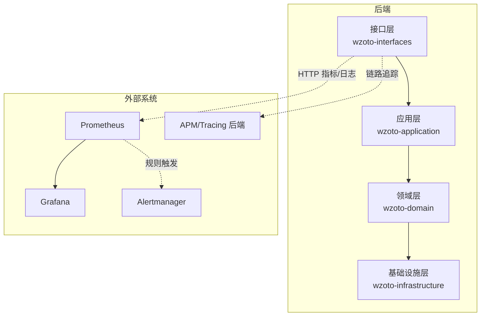
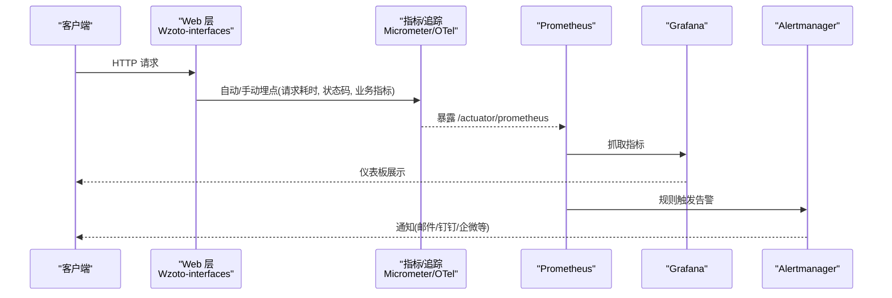
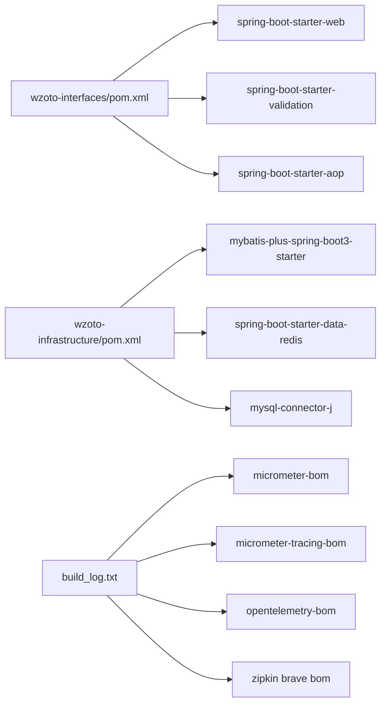

# 监控工具集成

<cite>
**本文引用的文件**
- [wzoto-backend/pom.xml](file://wzoto-backend/pom.xml)
- [wzoto-backend/wzoto-interfaces/pom.xml](file://wzoto-backend/wzoto-interfaces/pom.xml)
- [wzoto-backend/wzoto-infrastructure/pom.xml](file://wzoto-backend/wzoto-infrastructure/pom.xml)
- [wzoto-backend/wzoto-interfaces/src/main/resources/application.yml](file://wzoto-backend/wzoto-interfaces/src/main/resources/application.yml)
- [wzoto-backend/wzoto-infrastructure/src/main/java/com/wzoto/infrastructure/config/WebMvcConfig.java](file://wzoto-backend/wzoto-infrastructure/src/main/java/com/wzoto/infrastructure/config/WebMvcConfig.java)
- [wzoto-backend/wzoto-interfaces/src/main/java/com/wzoto/interfaces/common/GlobalExceptionHandler.java](file://wzoto-backend/wzoto-interfaces/src/main/java/com/wzoto/interfaces/common/GlobalExceptionHandler.java)
- [build_log.txt](file://build_log.txt)
- [wzoto-frontend/src/utils/track.js](file://wzoto-frontend/src/utils/track.js)
</cite>

## 目录
1. [简介](#简介)
2. [项目结构](#项目结构)
3. [核心组件](#核心组件)
4. [架构总览](#架构总览)
5. [详细组件分析](#详细组件分析)
6. [依赖分析](#依赖分析)
7. [性能考虑](#性能考虑)
8. [故障排查指南](#故障排查指南)
9. [结论](#结论)
10. [附录](#附录)

## 简介
本文件面向 wzoto 项目的“监控工具集成”目标，围绕 Prometheus 指标暴露、Grafana 可视化、告警系统（Alertmanager）与 APM（Micrometer Tracing/OpenTelemetry）集成提供可落地的方案与最佳实践。当前仓库尚未内置监控实现，但通过构建日志可见已引入 Micrometer、OpenTelemetry、Zipkin Brave 等生态依赖，具备快速接入的基础。本文将基于现有代码结构给出最小可行集成路径与配置要点，并给出示例化说明（以步骤和配置项为主，不直接粘贴代码）。

## 项目结构
后端采用 DDD 分层：
- 接口层（wzoto-interfaces）：Spring Boot Web、拦截器、全局异常处理
- 应用层（wzoto-application）：业务编排
- 领域层（wzoto-domain）：领域模型与服务
- 基础设施层（wzoto-infrastructure）：数据访问、Redis、配置、工具

前端为 Vue/Vite 工程，包含基础埋点工具（仅控制台输出），便于后续接入指标上报。

**图表来源**
- [wzoto-backend/wzoto-interfaces/pom.xml:16-41](file://wzoto-backend/wzoto-interfaces/pom.xml#L16-L41)
- [wzoto-backend/wzoto-infrastructure/pom.xml:16-71](file://wzoto-backend/wzoto-infrastructure/pom.xml#L16-L71)
- [build_log.txt:1-45](file://build_log.txt#L1-L45)

**章节来源**
- [wzoto-backend/pom.xml:1-126](file://wzoto-backend/prom.xml#L1-L126)
- [wzoto-backend/wzoto-interfaces/pom.xml:1-60](file://wzoto-backend/wzoto-interfaces/pom.xml#L1-L60)
- [wzoto-backend/wzoto-infrastructure/pom.xml:1-73](file://wzoto-backend/wzoto-infrastructure/pom.xml#L1-L73)

## 核心组件
- Spring Boot Web 与 MVC 配置：用于注册拦截器与跨域策略，可作为指标采集的切面入口（如请求耗时、错误率）。
- 全局异常处理器：统一捕获参数校验、业务异常与运行时异常，适合在此处记录错误指标与告警事件。
- 应用配置 application.yml：服务端口、上下文路径、数据库与 Redis 连接、AI 开关等；可扩展 metrics/tracing 相关配置。
- 构建依赖：Micrometer BOM、Micrometer Tracing BOM、OpenTelemetry BOM、Zipkin Brave BOM 等，表明具备指标与链路追踪能力基础。

**章节来源**
- [wzoto-backend/wzoto-interfaces/src/main/resources/application.yml:1-51](file://wzoto-backend/wzoto-interfaces/src/main/resources/application.yml#L1-L51)
- [wzoto-backend/wzoto-infrastructure/src/main/java/com/wzoto/infrastructure/config/WebMvcConfig.java:1-42](file://wzoto-backend/wzoto-infrastructure/src/main/java/com/wzoto/infrastructure/config/WebMvcConfig.java#L1-L42)
- [wzoto-backend/wzoto-interfaces/src/main/java/com/wzoto/interfaces/common/GlobalExceptionHandler.java:1-67](file://wzoto-backend/wzoto-interfaces/src/main/java/com/wzoto/interfaces/common/GlobalExceptionHandler.java#L1-L67)
- [build_log.txt:1-45](file://build_log.txt#L1-L45)

## 架构总览
下图展示从请求进入后端到指标暴露、可视化与告警的整体流程，以及 APM 链路追踪的集成位置。

**图表来源**
- [wzoto-backend/wzoto-interfaces/pom.xml:16-41](file://wzoto-backend/wzoto-interfaces/pom.xml#L16-L41)
- [build_log.txt:34-43](file://build_log.txt#L34-L43)

## 详细组件分析

### Prometheus 监控集成
- 指标暴露端点
  - 在 Spring Boot 应用中启用 Actuator 并暴露 /actuator/prometheus 给 Prometheus 抓取。
  - 建议开启 JVM、HTTP、DB、Redis 等默认指标，并结合业务自定义指标（如学习时长、任务完成率）。
- 抓取规则设置
  - 在 Prometheus 中配置 scrape_configs，指向后端服务的 /actuator/prometheus。
  - 合理设置 scrape_interval、metrics_path、labels（如 service、env、instance）。
- 服务发现配置
  - 若部署于容器/云原生环境，可使用 Prometheus Service Discovery（Kubernetes SD、Consul、File SD）自动发现实例。
  - 结合标签过滤不同环境（dev/staging/prod）与模块（interfaces/application/domain/infrastructure）。

提示：当前 application.yml 未包含 actuator/metrics 配置，需在配置文件中添加相应属性并在依赖中加入 spring-boot-starter-actuator 与 micrometer-registry-prometheus。

**章节来源**
- [wzoto-backend/wzoto-interfaces/src/main/resources/application.yml:1-51](file://wzoto-backend/wzoto-interfaces/src/main/resources/application.yml#L1-L51)
- [wzoto-backend/wzoto-interfaces/pom.xml:16-41](file://wzoto-backend/wzoto-interfaces/pom.xml#L16-L41)
- [build_log.txt:34-43](file://build_log.txt#L34-L43)

### Grafana 可视化
- 仪表板模板导入
  - 推荐导入 Spring Boot、JVM、Tomcat/Jetty、MySQL、Redis 官方模板，快速建立运行态视图。
  - 针对业务指标（如学习时长、任务完成度、错误率）创建自定义面板。
- 自定义图表创建
  - 使用 PromQL 查询指标，按服务、环境、接口维度聚合。
  - 将关键 KPI（QPS、延迟、错误率、资源使用率）放入首页看板。
- 权限管理配置
  - 使用角色/组织/文件夹级权限控制不同团队或环境的可视范围。
  - 对敏感指标进行隔离，避免越权查看。

[本节为通用实践说明，不直接分析具体代码文件]

### 告警系统配置（Alertmanager）
- Alertmanager 设置
  - 配置接收器（Receiver）与路由（Route），支持邮件、企业微信、钉钉、Slack 等渠道。
  - 设置抑制与静默规则，避免告警风暴。
- 告警规则编写
  - 在 Prometheus 中定义规则组（groups），按服务/模块划分。
  - 常见规则：高错误率、高延迟、低可用、资源耗尽、业务指标异常（如登录失败率突增）。
- 通知渠道集成
  - 根据企业规范选择通知方式，配置 webhook 或第三方平台 API。
  - 建议在告警中包含关键标签（service、env、instance、rule），便于定位。

[本节为通用实践说明，不直接分析具体代码文件]

### APM 工具集成（Micrometer Tracing / OpenTelemetry）
- 应用性能监控
  - 通过 Micrometer Tracing 与 OpenTelemetry 桥接，采集请求链路、方法耗时、依赖调用。
  - 将 trace/span 导出至 Jaeger、Zipkin、SkyWalking 或云厂商 APM。
- 链路追踪
  - 在 Web 层注入 TraceId，贯穿 Controller -> Service -> Repository -> 外部调用。
  - 为关键业务操作（如支付、学习报告生成）打点，便于问题定位。
- 分布式追踪
  - 跨服务调用时透传 trace context（如 W3C Trace Context）。
  - 结合服务发现与配置中心统一管理采样率与后端地址。

**章节来源**
- [build_log.txt:34-43](file://build_log.txt#L34-L43)

### 前端埋点与指标上报
- 当前 track.js 提供页面浏览与事件埋点函数，仅输出控制台日志。
- 建议后续对接后端指标收集接口或第三方分析平台，形成用户行为指标（PV/UV、转化率、停留时长）。

**章节来源**
- [wzoto-frontend/src/utils/track.js:1-14](file://wzoto-frontend/src/utils/track.js#L1-L14)

## 依赖分析
- 构建日志显示引入了 Micrometer BOM、Micrometer Tracing BOM、OpenTelemetry BOM、Zipkin Brave BOM，表明项目具备指标与链路追踪能力基础。
- 接口层依赖 spring-boot-starter-web、validation、aop，可用于实现统一的请求指标与异常指标采集。
- 基础设施层依赖 MyBatis-Plus、Redis、MySQL，可在数据库与缓存层增加性能指标采集。

**图表来源**
- [wzoto-backend/wzoto-interfaces/pom.xml:16-41](file://wzoto-backend/wzoto-interfaces/pom.xml#L16-L41)
- [wzoto-backend/wzoto-infrastructure/pom.xml:16-71](file://wzoto-backend/wzoto-infrastructure/pom.xml#L16-L71)
- [build_log.txt:1-45](file://build_log.txt#L1-L45)

**章节来源**
- [wzoto-backend/wzoto-interfaces/pom.xml:1-60](file://wzoto-backend/wzoto-interfaces/pom.xml#L1-L60)
- [wzoto-backend/wzoto-infrastructure/pom.xml:1-73](file://wzoto-backend/wzoto-infrastructure/pom.xml#L1-L73)
- [build_log.txt:1-45](file://build_log.txt#L1-L45)

## 性能考虑
- 指标粒度与采样
  - 对高频指标进行采样或聚合，避免过度采集导致存储与计算压力。
  - 对慢接口与热点接口单独统计，关注 P95/P99 延迟。
- 资源开销
  - 合理设置 JVM 与 GC 指标采集频率，避免影响主业务。
  - 链路追踪采样率在生产环境需保守配置，必要时按路径或租户差异化。
- 存储与查询优化
  - 使用合适的保留期与降采样策略，降低 Prometheus 存储成本。
  - Grafana 查询尽量使用高效 PromQL 表达式，减少全表扫描。

[本节为通用实践说明，不直接分析具体代码文件]

## 故障排查指南
- 全局异常与错误指标
  - 利用 GlobalExceptionHandler 统一捕获异常并记录日志，同时可在此处计数错误指标（如 4xx/5xx 比例）。
  - 结合 Prometheus 规则对错误率阈值进行告警。
- 拦截器与请求指标
  - 在 WebMvcConfig 注册的拦截器中，可记录请求耗时、入参摘要（脱敏）、出参状态码，形成 HTTP 指标。
- 配置与环境变量
  - application.yml 中的数据库、Redis、JWT、AI 等配置项可通过环境变量注入，便于多环境管理与安全。
- 常见问题
  - 无法抓取指标：检查 Actuator 是否启用、/actuator/prometheus 是否可达、网络与安全组策略。
  - 告警风暴：检查 Alertmanager 抑制与静默规则，确认分组与路由是否正确。
  - 链路缺失：检查 TraceId 透传、采样率、APM 后端连通性。

**章节来源**
- [wzoto-backend/wzoto-interfaces/src/main/java/com/wzoto/interfaces/common/GlobalExceptionHandler.java:1-67](file://wzoto-backend/wzoto-interfaces/src/main/java/com/wzoto/interfaces/common/GlobalExceptionHandler.java#L1-L67)
- [wzoto-backend/wzoto-infrastructure/src/main/java/com/wzoto/infrastructure/config/WebMvcConfig.java:1-42](file://wzoto-backend/wzoto-infrastructure/src/main/java/com/wzoto/infrastructure/config/WebMvcConfig.java#L1-L42)
- [wzoto-backend/wzoto-interfaces/src/main/resources/application.yml:1-51](file://wzoto-backend/wzoto-interfaces/src/main/resources/application.yml#L1-L51)

## 结论
本项目已具备接入 Prometheus/Grafana/Alertmanager/APM 的基础依赖与良好分层结构。建议优先完成 Actuator + Micrometer 指标暴露与基础看板搭建，再逐步完善告警规则与链路追踪。通过统一的异常处理与拦截器埋点，可快速获得稳定的运行态与业务态指标，支撑生产运维与持续优化。

[本节为总结性内容，不直接分析具体代码文件]

## 附录

### 监控最佳实践清单
- 监控架构设计
  - 分层采集：Web、业务、数据源、外部依赖分别采集指标与日志。
  - 统一标识：为所有指标添加 service、env、instance、version 等标签。
- 指标命名规范
  - 使用短横线分隔、语义清晰的前缀（如 http_server_requests_total、db_query_duration_seconds）。
  - 区分计数器、直方图、时序指标，避免重复与歧义。
- 告警分级策略
  - P0（严重）：服务不可用、核心功能失败、数据丢失风险。
  - P1（高）：性能退化、错误率升高、容量逼近上限。
  - P2（中）：非核心功能异常、次要依赖不稳定。
  - P3（低）：信息类告警、趋势预警。

[本节为通用实践说明，不直接分析具体代码文件]