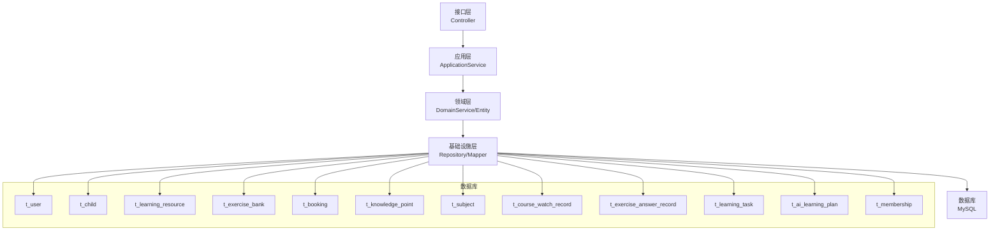
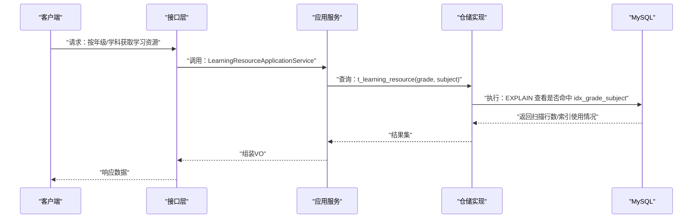
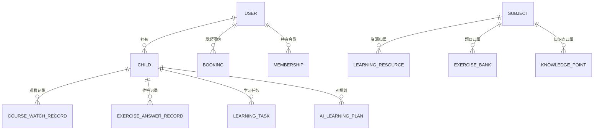

# 索引优化策略

<cite>
**本文引用的文件**
- [t_user.sql](file://wzoto-backend/sql/t_user.sql)
- [t_child.sql](file://wzoto-backend/sql/t_child.sql)
- [t_learning_resource.sql](file://wzoto-backend/sql/t_learning_resource.sql)
- [t_exercise_bank.sql](file://wzoto-backend/sql/t_exercise_bank.sql)
- [t_booking.sql](file://wzoto-backend/sql/t_booking.sql)
- [t_knowledge_point.sql](file://wzoto-backend/sql/t_knowledge_point.sql)
- [t_subject.sql](file://wzoto-backend/sql/t_subject.sql)
- [t_course_watch_record.sql](file://wzoto-backend/sql/t_course_watch_record.sql)
- [t_exercise_answer_record.sql](file://wzoto-backend/sql/t_exercise_answer_record.sql)
- [t_learning_task.sql](file://wzoto-backend/sql/t_learning_task.sql)
- [t_ai_learning_plan.sql](file://wzoto-backend/sql/t_ai_learning_plan.sql)
- [t_membership.sql](file://wzoto-backend/sql/t_membership.sql)
- [application.yml](file://wzoto-backend/wzoto-interfaces/src/main/resources/application.yml)
</cite>

## 目录
1. [引言](#引言)
2. [项目结构](#项目结构)
3. [核心组件](#核心组件)
4. [架构总览](#架构总览)
5. [详细组件分析](#详细组件分析)
6. [依赖关系分析](#依赖关系分析)
7. [性能考量](#性能考量)
8. [故障排查指南](#故障排查指南)
9. [结论](#结论)
10. [附录](#附录)

## 引言
本文件面向wzoto项目的数据库索引优化，围绕主键设计原则、复合索引设计、覆盖索引应用、索引维护与监控展开，并结合仓库中的SQL定义给出可落地的优化建议与测试方法。目标是在不改变业务语义的前提下，提升查询性能、降低回表成本、减少索引膨胀与维护开销。

## 项目结构
wzoto后端采用分层架构（接口层/应用层/领域层/基础设施层），数据访问通过MyBatis-Plus与MySQL交互。数据库DDL集中在sql目录下，涵盖用户、子女、学习资源、习题库、预约、知识点、学科、观看记录、作答记录、学习任务、AI规划、会员等核心实体。配置位于application.yml，启用逻辑删除与自增主键策略。

图表来源
- [application.yml:19-29](file://wzoto-backend/wzoto-interfaces/src/main/resources/application.yml#L19-L29)
- [t_user.sql:8-26](file://wzoto-backend/sql/t_user.sql#L8-L26)
- [t_child.sql:4-17](file://wzoto-backend/sql/t_child.sql#L4-L17)
- [t_learning_resource.sql:4-35](file://wzoto-backend/sql/t_learning_resource.sql#L4-L35)
- [t_exercise_bank.sql:4-30](file://wzoto-backend/sql/t_exercise_bank.sql#L4-L30)
- [t_booking.sql:1-23](file://wzoto-backend/sql/t_booking.sql#L1-L23)
- [t_knowledge_point.sql:5-22](file://wzoto-backend/sql/t_knowledge_point.sql#L5-L22)
- [t_subject.sql:4-15](file://wzoto-backend/sql/t_subject.sql#L4-L15)
- [t_course_watch_record.sql:4-20](file://wzoto-backend/sql/t_course_watch_record.sql#L4-L20)
- [t_exercise_answer_record.sql:4-22](file://wzoto-backend/sql/t_exercise_answer_record.sql#L4-L22)
- [t_learning_task.sql:4-24](file://wzoto-backend/sql/t_learning_task.sql#L4-L24)
- [t_ai_learning_plan.sql:5-23](file://wzoto-backend/sql/t_ai_learning_plan.sql#L5-L23)
- [t_membership.sql:4-19](file://wzoto-backend/sql/t_membership.sql#L4-L19)

章节来源
- [application.yml:1-51](file://wzoto-backend/wzoto-interfaces/src/main/resources/application.yml#L1-L51)

## 核心组件
- 主键设计：统一使用BIGINT自增ID作为主键，满足高并发写入与顺序插入的性能优势；唯一性约束通过UNIQUE KEY保障（如openid、code）。
- 常用查询列索引：为高频过滤条件建立单列或多列索引（如parent_id、grade、subject、status、created_at等）。
- 复合索引：针对多列联合查询场景（如年级+学科、家长+日期）创建复合索引，遵循最左前缀匹配原则。
- 覆盖索引：在统计与列表页场景中，尽量让查询字段包含在索引中，避免回表。
- 逻辑删除：全局启用deleted字段逻辑删除，配合索引需考虑过滤条件对索引选择性的影响。

章节来源
- [t_user.sql:8-26](file://wzoto-backend/sql/t_user.sql#L8-L26)
- [t_subject.sql:4-15](file://wzoto-backend/sql/t_subject.sql#L4-L15)
- [application.yml:19-29](file://wzoto-backend/wzoto-interfaces/src/main/resources/application.yml#L19-L29)

## 架构总览
下图展示从接口到数据库的调用链路与关键表的索引使用情况，便于定位慢查询热点与优化点。

图表来源
- [t_learning_resource.sql:4-35](file://wzoto-backend/sql/t_learning_resource.sql#L4-L35)

## 详细组件分析

### 主键设计原则与实践
- 自增ID：所有核心表均采用BIGINT AUTO_INCREMENT主键，利于顺序写入、减少页分裂与碎片，适合高吞吐写场景。
- UUID：当前未使用UUID主键；若未来引入分布式ID或跨库合并需求，可评估雪花算法或UUID替代方案，但需注意排序与索引扩展性。
- 业务主键：对于天然唯一且稳定的业务键（如学科编码code、微信openid），通过UNIQUE KEY保证一致性，避免重复业务键导致的数据冲突。

优化建议
- 保持现有自增主键策略，确保写入路径稳定。
- 对频繁按业务键查询的场景，保留UNIQUE KEY并避免将其作为主键。

章节来源
- [t_user.sql:8-26](file://wzoto-backend/sql/t_user.sql#L8-L26)
- [t_subject.sql:4-15](file://wzoto-backend/sql/t_subject.sql#L4-L15)
- [application.yml:24-29](file://wzoto-backend/wzoto-interfaces/src/main/resources/application.yml#L24-L29)

### 复合索引设计与最左前缀匹配
- 多列索引创建时机：当存在固定组合条件的查询时（如“年级+学科”、“家长+日期”），应创建复合索引以提升范围/等值查询效率。
- 索引顺序优化：将等值条件列放在前面，范围条件列放后面；例如“年级=某值 AND 学科范围”优于“学科范围 AND 年级”。
- 最左前缀匹配：查询必须从复合索引的最左列开始匹配，否则无法有效利用该索引。

典型场景
- t_learning_resource：idx_grade_subject用于“年级+学科”筛选。
- t_exercise_bank：idx_grade_subject用于题目检索。
- t_booking：idx_tutor_status用于“教员+状态”筛选。
- t_learning_task：idx_child_date、idx_child_status用于“子女+日期/状态”筛选。
- t_ai_learning_plan：idx_child_date用于“子女+计划日期”筛选。

章节来源
- [t_learning_resource.sql:30-34](file://wzoto-backend/sql/t_learning_resource.sql#L30-L34)
- [t_exercise_bank.sql:24-29](file://wzoto-backend/sql/t_exercise_bank.sql#L24-L29)
- [t_booking.sql:18-22](file://wzoto-backend/sql/t_booking.sql#L18-L22)
- [t_learning_task.sql:19-23](file://wzoto-backend/sql/t_learning_task.sql#L19-L23)
- [t_ai_learning_plan.sql:19-22](file://wzoto-backend/sql/t_ai_learning_plan.sql#L19-L22)

### 覆盖索引的应用与案例
覆盖索引指查询所需字段全部存在于索引中，无需回表读取行数据，显著降低I/O与CPU开销。

适用场景
- 列表分页：仅取id与少量展示字段时，可将这些字段加入索引形成覆盖索引。
- 统计计数：COUNT/聚合只依赖索引列时，可直接走索引扫描。
- 外键关联：子表通过父表主键或唯一键快速定位，结合覆盖索引减少回表。

实践建议
- 对高频查询的SELECT字段进行最小化，并在WHERE条件基础上构建覆盖索引。
- 对统计类查询（如“某学员某学科的作答次数”）优先使用复合索引覆盖。

章节来源
- [t_exercise_answer_record.sql:4-22](file://wzoto-backend/sql/t_exercise_answer_record.sql#L4-L22)
- [t_course_watch_record.sql:4-20](file://wzoto-backend/sql/t_course_watch_record.sql#L4-L20)

### 索引维护策略
- 索引重建：在大量更新/删除后，索引可能产生碎片，可通过OPTIMIZE TABLE或重建索引恢复紧凑度。
- 统计信息更新：定期ANALYZE TABLE更新统计信息，帮助优化器选择更优执行计划。
- 碎片整理：关注InnoDB页碎片，必要时进行表重组或分区策略调整。
- 逻辑删除影响：由于启用deleted逻辑删除，查询常含deleted=0条件，需评估其对索引选择性及覆盖的影响。

章节来源
- [application.yml:24-29](file://wzoto-backend/wzoto-interfaces/src/main/resources/application.yml#L24-L29)

### 索引监控方法
- 慢查询日志：开启并分析慢查询，定位缺失索引或低效查询。
- 执行计划解读：使用EXPLAIN检查type、key、rows、Extra，确认是否命中预期索引、是否存在临时表/文件排序。
- 索引使用率监控：通过information_schema或性能视图观察索引命中率与扫描行数变化。
- 对比测试：在相同数据集下，对比优化前后的EXPLAIN与耗时，验证优化效果。

章节来源
- [application.yml:48-51](file://wzoto-backend/wzoto-interfaces/src/main/resources/application.yml#L48-L51)

## 依赖关系分析
各表之间通过外键语义或业务关联形成依赖，索引设计需兼顾关联查询性能。

图表来源
- [t_user.sql:8-26](file://wzoto-backend/sql/t_user.sql#L8-L26)
- [t_child.sql:4-17](file://wzoto-backend/sql/t_child.sql#L4-L17)
- [t_booking.sql:1-23](file://wzoto-backend/sql/t_booking.sql#L1-L23)
- [t_membership.sql:4-19](file://wzoto-backend/sql/t_membership.sql#L4-L19)
- [t_course_watch_record.sql:4-20](file://wzoto-backend/sql/t_course_watch_record.sql#L4-L20)
- [t_exercise_answer_record.sql:4-22](file://wzoto-backend/sql/t_exercise_answer_record.sql#L4-L22)
- [t_learning_task.sql:4-24](file://wzoto-backend/sql/t_learning_task.sql#L4-L24)
- [t_ai_learning_plan.sql:5-23](file://wzoto-backend/sql/t_ai_learning_plan.sql#L5-L23)
- [t_subject.sql:4-15](file://wzoto-backend/sql/t_subject.sql#L4-L15)
- [t_learning_resource.sql:4-35](file://wzoto-backend/sql/t_learning_resource.sql#L4-L35)
- [t_exercise_bank.sql:4-30](file://wzoto-backend/sql/t_exercise_bank.sql#L4-L30)
- [t_knowledge_point.sql:5-22](file://wzoto-backend/sql/t_knowledge_point.sql#L5-L22)

章节来源
- [t_user.sql:8-26](file://wzoto-backend/sql/t_user.sql#L8-L26)
- [t_child.sql:4-17](file://wzoto-backend/sql/t_child.sql#L4-L17)
- [t_booking.sql:1-23](file://wzoto-backend/sql/t_booking.sql#L1-L23)
- [t_membership.sql:4-19](file://wzoto-backend/sql/t_membership.sql#L4-L19)
- [t_course_watch_record.sql:4-20](file://wzoto-backend/sql/t_course_watch_record.sql#L4-L20)
- [t_exercise_answer_record.sql:4-22](file://wzoto-backend/sql/t_exercise_answer_record.sql#L4-L22)
- [t_learning_task.sql:4-24](file://wzoto-backend/sql/t_learning_task.sql#L4-L24)
- [t_ai_learning_plan.sql:5-23](file://wzoto-backend/sql/t_ai_learning_plan.sql#L5-L23)
- [t_subject.sql:4-15](file://wzoto-backend/sql/t_subject.sql#L4-L15)
- [t_learning_resource.sql:4-35](file://wzoto-backend/sql/t_learning_resource.sql#L4-L35)
- [t_exercise_bank.sql:4-30](file://wzoto-backend/sql/t_exercise_bank.sql#L4-L30)
- [t_knowledge_point.sql:5-22](file://wzoto-backend/sql/t_knowledge_point.sql#L5-L22)

## 性能考量
- 写入性能：自增主键顺序插入减少页分裂，有利于高并发写入。
- 查询性能：复合索引与覆盖索引减少回表与扫描行数，提升列表与统计查询速度。
- 存储与维护：过多索引会增加写入放大与维护成本，需权衡读写比例与查询模式。
- 逻辑删除：deleted字段参与过滤会影响索引选择性，建议在高频过滤列上建立合适索引或覆盖索引。

[本节为通用指导，不直接分析具体文件]

## 故障排查指南
- 慢查询定位：开启慢查询日志，捕获耗时较长的SQL，结合EXPLAIN分析。
- 执行计划问题：关注type是否为ALL/INDEX，rows是否异常大，Extra是否出现Using filesort/Using temporary。
- 索引失效：函数处理、隐式类型转换、LIKE前导通配符会导致索引失效，需重构查询或增加合适索引。
- 统计信息陈旧：定期ANALYZE TABLE，确保优化器基于最新统计信息选择计划。

章节来源
- [application.yml:48-51](file://wzoto-backend/wzoto-interfaces/src/main/resources/application.yml#L48-L51)

## 结论
wzoto项目已具备较为完善的索引基础，建议持续以查询模式为导向优化复合索引与覆盖索引，结合慢查询与执行计划进行迭代优化。保持自增主键策略，合理运用业务唯一键，完善索引维护与监控流程，可在不改动业务逻辑的前提下显著提升系统性能与稳定性。

[本节为总结性内容，不直接分析具体文件]

## 附录

### 常见查询与索引映射示例
- 按年级+学科获取学习资源：命中idx_grade_subject，避免全表扫描。
- 按家长+日期查询预约：可考虑新增(idx_parent_id, booking_date)复合索引以优化范围查询。
- 按子女+学科统计作答：可考虑(idx_child_id, subject)覆盖索引以减少回表。
- 按教员+状态查询预约：已有idx_tutor_status，注意范围条件位置。

章节来源
- [t_learning_resource.sql:30-34](file://wzoto-backend/sql/t_learning_resource.sql#L30-L34)
- [t_booking.sql:18-22](file://wzoto-backend/sql/t_booking.sql#L18-L22)
- [t_exercise_answer_record.sql:17-21](file://wzoto-backend/sql/t_exercise_answer_record.sql#L17-L21)

### 性能测试与对比方法
- 基线采集：在相同数据量下记录优化前的慢查询耗时与EXPLAIN结果。
- 变更实施：新增或调整索引，确保不影响写入与存储空间。
- 回归验证：再次执行相同查询，对比耗时、扫描行数与索引使用情况。
- 压测评估：在高并发场景下评估索引对吞吐与延迟的影响。

[本节提供方法论指导，不直接分析具体文件]