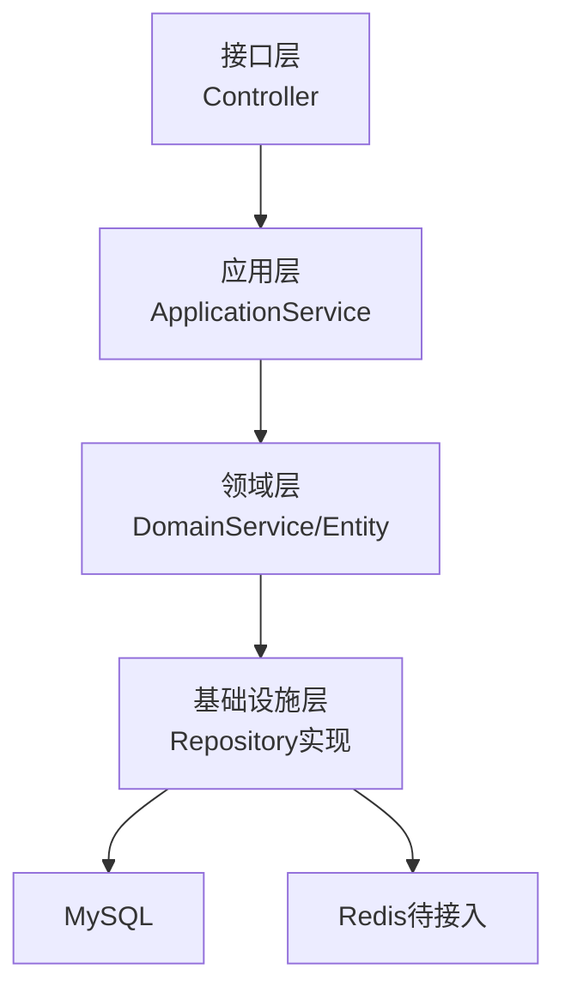
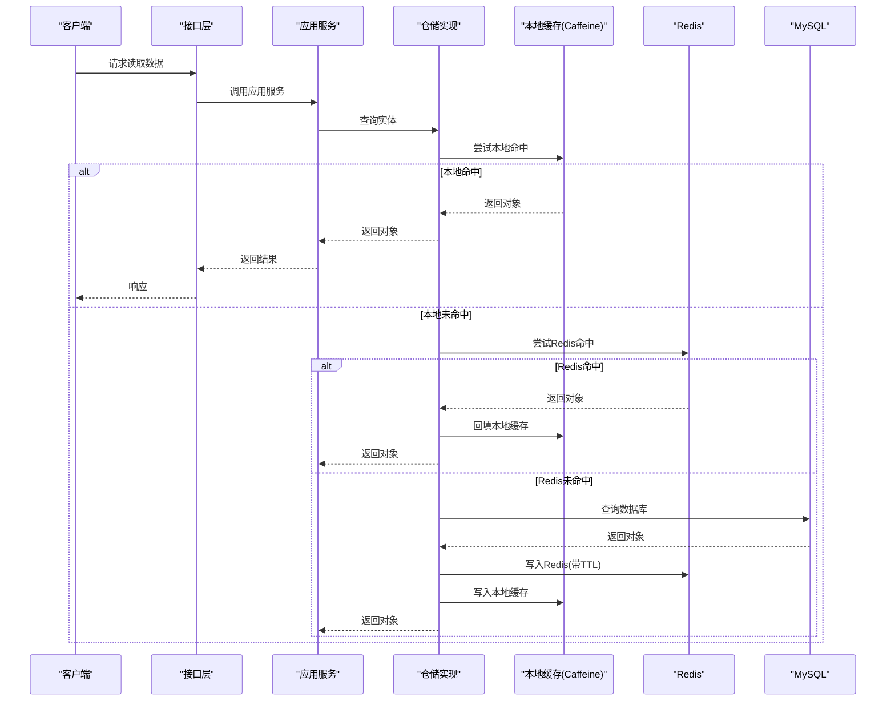
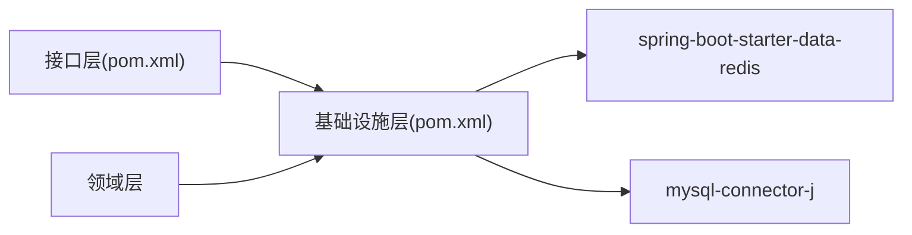

# Redis缓存架构设计

<cite>
**本文引用的文件**
- [application.yml](file://wzoto-backend/wzoto-interfaces/src/main/resources/application.yml)
- [pom.xml（根）](file://wzoto-backend/pom.xml)
- [pom.xml（基础设施层）](file://wzoto-backend/wzoto-infrastructure/pom.xml)
- [pom.xml（接口层）](file://wzoto-backend/wzoto-interfaces/pom.xml)
- [UserRepositoryImpl.java](file://wzoto-backend/wzoto-infrastructure/src/main/java/com/wzoto/infrastructure/repository/UserRepositoryImpl.java)
- [MembershipRepositoryImpl.java](file://wzoto-backend/wzoto-infrastructure/src/main/java/com/wzoto/infrastructure/repository/MembershipRepositoryImpl.java)
</cite>

## 目录
1. [简介](#简介)
2. [项目结构](#项目结构)
3. [核心组件](#核心组件)
4. [架构总览](#架构总览)
5. [详细组件分析](#详细组件分析)
6. [依赖分析](#依赖分析)
7. [性能考虑](#性能考虑)
8. [故障排查指南](#故障排查指南)
9. [结论](#结论)
10. [附录](#附录)

## 简介
本文件为wzoto后端系统的Redis缓存架构设计文档，面向多级缓存策略、缓存分层、失效机制、数据结构选型、序列化策略、一致性方案与监控指标等主题。当前仓库已集成Spring Data Redis依赖并配置了连接信息，但尚未实现具体缓存逻辑。本文在现有基础上给出可落地的设计方案与落地路径，便于后续在仓储层或应用服务层逐步引入缓存能力。

## 项目结构
- 后端采用DDD分层：领域层（domain）、应用层（application）、基础设施层（infrastructure）、接口层（interfaces）。
- 缓存相关的基础设施依赖位于基础设施层，通过spring-boot-starter-data-redis提供Redis客户端能力；连接参数在application.yml中集中配置。
- 业务数据访问以Repository抽象为核心，当前仓储实现直接访问数据库，未来可在仓储实现或应用服务层叠加缓存。

图表来源
- [pom.xml（基础设施层）:25-28](file://wzoto-backend/wzoto-infrastructure/pom.xml#L25-L28)
- [application.yml:6-17](file://wzoto-backend/wzoto-interfaces/src/main/resources/application.yml#L6-L17)

章节来源
- [application.yml:6-17](file://wzoto-backend/wzoto-interfaces/src/main/resources/application.yml#L6-L17)
- [pom.xml（基础设施层）:25-28](file://wzoto-backend/wzoto-infrastructure/pom.xml#L25-L28)

## 核心组件
- 缓存接入点：建议在基础设施层的Repository实现中统一封装读写缓存，保持对上层透明；或在应用服务层按热点场景选择性引入。
- 配置中心：Redis连接信息通过环境变量注入，便于多环境部署。
- 序列化：使用Jackson进行JSON序列化（项目已引入json依赖），也可按需切换为Protobuf或Kryo。
- 监控：基于Micrometer + Spring Boot Actuator暴露命中率、内存、延迟等指标。

章节来源
- [application.yml:6-17](file://wzoto-backend/wzoto-interfaces/src/main/resources/application.yml#L6-L17)
- [pom.xml（基础设施层）:65-70](file://wzoto-backend/wzoto-infrastructure/pom.xml#L65-L70)

## 架构总览
下图展示“多级缓存+一致性”的整体流程：本地Caffeine作为一级缓存，Redis作为二级缓存，MySQL作为持久化存储；读路径优先命中本地缓存，再回源到Redis/DB；写路径遵循Cache-Aside模式，先更新DB再删除缓存键，必要时结合异步任务做Write-Behind补偿。

图表来源
- [application.yml:6-17](file://wzoto-backend/wzoto-interfaces/src/main/resources/application.yml#L6-L17)
- [pom.xml（基础设施层）:25-28](file://wzoto-backend/wzoto-infrastructure/pom.xml#L25-L28)

## 详细组件分析

### 缓存分层与多级策略
- 一级缓存（本地）：建议采用Caffeine，适合进程内高频读、低延迟场景；注意多实例间不一致问题。
- 二级缓存（分布式）：Redis，用于跨实例共享与持久化缓存；设置合理TTL与过期策略。
- 三级缓存（数据库）：最终一致性来源，所有缓存均允许回源。

建议的缓存键命名规范：
- 用户信息：user:info:{userId}
- 会员状态：membership:active:{userId}
- 课程资源：resource:tree:{subjectId}
- 排行榜/时间序列：rank:course:hot:{date}

章节来源
- [application.yml:6-17](file://wzoto-backend/wzoto-interfaces/src/main/resources/application.yml#L6-L17)

### 缓存失效机制
- TTL过期：为热点数据设置合理TTL，避免长期驻留导致内存膨胀。
- 主动失效：写操作后删除对应缓存键，保证下次读时重建。
- 延迟双删：极端一致性强求场景下，先删缓存→写DB→延时再删一次缓存，降低并发竞态导致的脏读概率。
- 布隆过滤器：针对不存在数据的穿透防护，减少大量无效查询落到DB。

章节来源
- [application.yml:6-17](file://wzoto-backend/wzoto-interfaces/src/main/resources/application.yml#L6-L17)

### 数据结构选择与使用场景
- String：适合简单KV，如用户会话、配置项、计数器。
- Hash：适合对象字段集合，如用户资料、课程详情，支持部分字段更新。
- List：适合消息队列、最近N条记录、评论列表等有序集合。
- Set：适合去重集合，如标签、权限集合、黑名单。
- ZSet：适合排行榜、时间排序、滑动窗口统计，如热门课程排行。

性能特点简述：
- String/Hash：O(1)读写，内存友好，适合高吞吐。
- List/Set：插入/查找O(1)/O(n)，适合轻量聚合。
- ZSet：排序O(log n)，适合范围查询与排名。

章节来源
- [application.yml:6-17](file://wzoto-backend/wzoto-interfaces/src/main/resources/application.yml#L6-L17)

### 序列化策略
- JSON（推荐起步）：可读性好、生态成熟，使用Jackson序列化；适用于大多数业务对象。
- Protobuf：体积更小、解析更快，适合大对象或跨语言场景；需定义schema并在两端保持一致。
- 二进制（Kryo/FST）：极致性能与压缩比，但可读性差、版本兼容成本高，需谨慎评估。

建议：
- 默认使用JSON；对超大对象或极高QPS场景评估Protobuf；仅在明确收益且具备版本治理能力时使用二进制序列化。

章节来源
- [pom.xml（基础设施层）:65-70](file://wzoto-backend/wzoto-infrastructure/pom.xml#L65-L70)

### 缓存一致性方案
- Cache-Aside（旁路缓存）：读时先查缓存，未命中则查库并回填；写时先更新DB再删除缓存键。本项目仓储实现目前直连DB，适合作为后续引入该模式的基线。
- Read-Through：由缓存代理负责从DB加载并回填，对上层透明；需要自定义缓存包装器。
- Write-Behind：写操作异步落盘，提高吞吐；需配合幂等与重试机制，确保最终一致。

建议：
- 首选Cache-Aside；对读多写少且强一致要求不高的场景可考虑Read-Through；对高并发写场景可引入Write-Behind并配合审计日志与补偿任务。

章节来源
- [UserRepositoryImpl.java:27-44](file://wzoto-backend/wzoto-infrastructure/src/main/java/com/wzoto/infrastructure/repository/UserRepositoryImpl.java#L27-L44)
- [MembershipRepositoryImpl.java:36-50](file://wzoto-backend/wzoto-infrastructure/src/main/java/com/wzoto/infrastructure/repository/MembershipRepositoryImpl.java#L36-L50)

### 缓存监控方案
- 命中率监控：记录缓存命中/未命中次数，计算命中率；可通过AOP或拦截器在仓储层埋点。
- 内存使用监控：采集Redis内存峰值、碎片率、key数量；结合Prometheus/Grafana可视化。
- 性能指标：P95/P99延迟、错误率、超时率；通过Micrometer暴露至Actuator端点。
- 告警：命中率低于阈值、内存超限、延迟突增时触发告警。

章节来源
- [application.yml:6-17](file://wzoto-backend/wzoto-interfaces/src/main/resources/application.yml#L6-L17)

### 具体Redis配置示例与缓存实现要点
- 连接配置：host/port/password/database通过环境变量注入，便于多环境管理。
- 序列化：默认使用Jackson；如需Protobuf，替换序列化器并配置Key/Value编码器。
- 缓存注解：可使用@Cacheable/@CacheEvict等简化开发，但建议在仓储层统一封装以保证一致性策略可控。
- 键空间隔离：按业务域划分database或前缀，避免冲突。

章节来源
- [application.yml:6-17](file://wzoto-backend/wzoto-interfaces/src/main/resources/application.yml#L6-L17)
- [pom.xml（基础设施层）:25-28](file://wzoto-backend/wzoto-infrastructure/pom.xml#L25-L28)

## 依赖分析
- 基础设施层引入了spring-boot-starter-data-redis，为后续缓存实现提供基础能力。
- 接口层与基础设施层通过Maven模块解耦，缓存实现应集中在基础设施层，避免耦合到接口层。
- 领域层仅定义Repository接口，屏蔽底层存储细节，利于后续引入缓存而不影响上层。

图表来源
- [pom.xml（接口层）:16-41](file://wzoto-backend/wzoto-interfaces/pom.xml#L16-L41)
- [pom.xml（基础设施层）:16-70](file://wzoto-backend/wzoto-infrastructure/pom.xml#L16-L70)

章节来源
- [pom.xml（根）:21-26](file://wzoto-backend/pom.xml#L21-L26)
- [pom.xml（基础设施层）:16-70](file://wzoto-backend/wzoto-infrastructure/pom.xml#L16-L70)
- [pom.xml（接口层）:16-41](file://wzoto-backend/wzoto-interfaces/pom.xml#L16-L41)

## 性能考虑
- 热点数据优先走本地缓存，降低Redis与DB压力。
- 合理设置TTL与容量，避免缓存雪崩与击穿。
- 批量操作与管道：对批量读写使用Pipeline提升吞吐。
- 分片与扩容：按业务维度拆分Redis实例或集群，避免单节点瓶颈。
- 序列化开销：大对象考虑压缩或分片存储，减少网络传输成本。

## 故障排查指南
- 连接失败：检查application.yml中的host/port/password/database是否正确，确认网络可达。
- 缓存未命中：核对键命名规则与TTL设置，确认写路径是否删除了缓存键。
- 内存不足：监控内存使用，清理过期键或调整maxmemory策略。
- 延迟升高：定位慢查询与热点键，优化序列化与数据结构，必要时扩容。

章节来源
- [application.yml:6-17](file://wzoto-backend/wzoto-interfaces/src/main/resources/application.yml#L6-L17)

## 结论
wzoto后端已具备Redis接入的基础条件。建议先在基础设施层仓储实现中引入Cache-Aside模式，结合本地缓存与Redis构建多级缓存体系；随后完善序列化、失效策略与监控告警。通过分阶段演进，既能快速提升性能，又能控制复杂度与风险。

## 附录
- 关键类与文件路径参考：
  - 仓储实现（无缓存现状）：[UserRepositoryImpl.java](file://wzoto-backend/wzoto-infrastructure/src/main/java/com/wzoto/infrastructure/repository/UserRepositoryImpl.java)、[MembershipRepositoryImpl.java](file://wzoto-backend/wzoto-infrastructure/src/main/java/com/wzoto/infrastructure/repository/MembershipRepositoryImpl.java)
  - Redis配置：[application.yml](file://wzoto-backend/wzoto-interfaces/src/main/resources/application.yml)
  - 依赖声明：[pom.xml（基础设施层）](file://wzoto-backend/wzoto-infrastructure/pom.xml)、[pom.xml（接口层）](file://wzoto-backend/wzoto-interfaces/pom.xml)