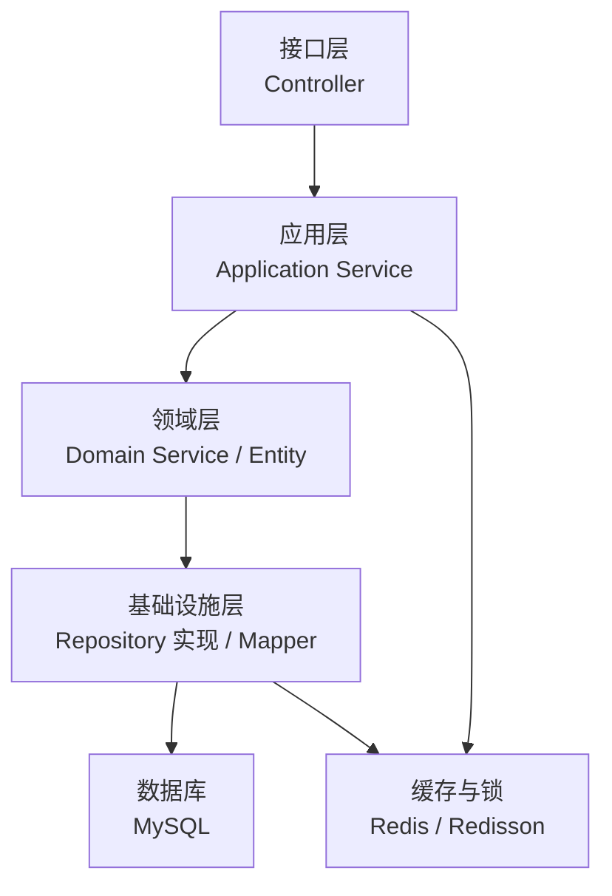
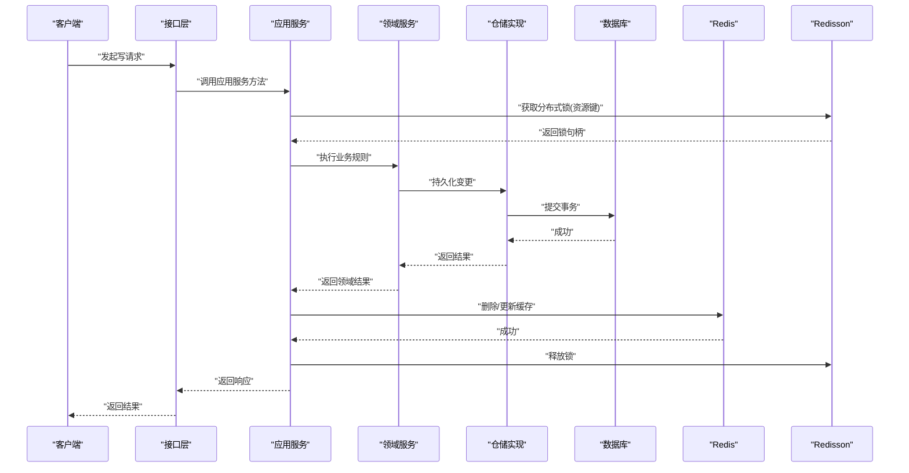
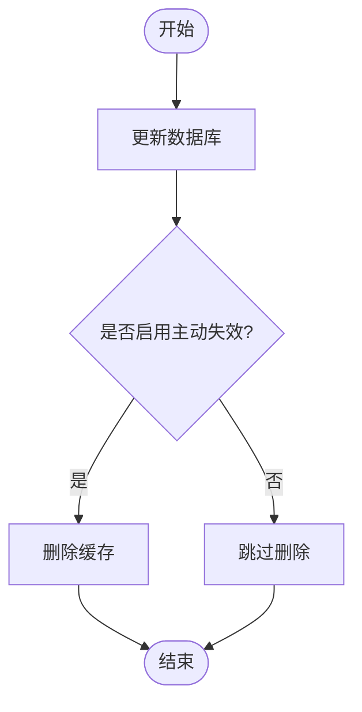
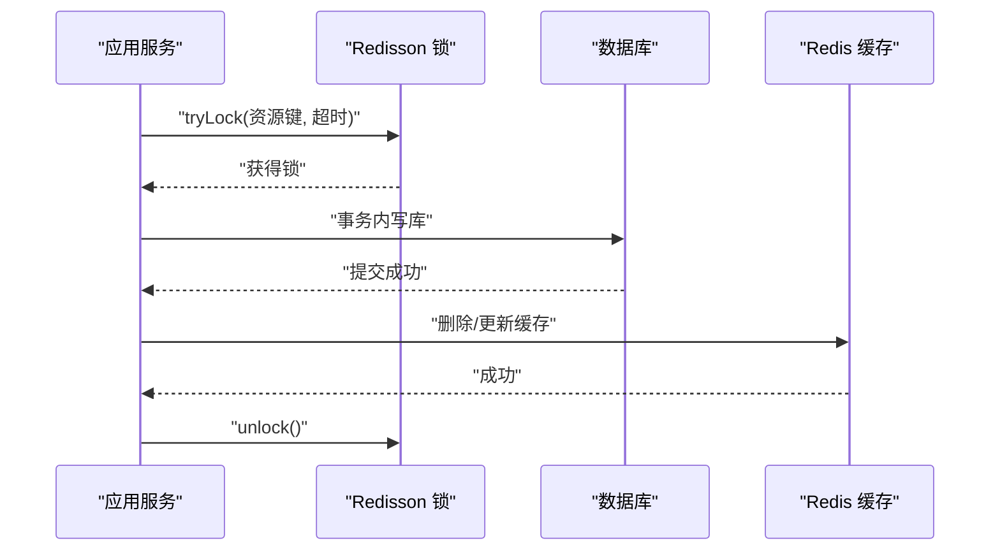
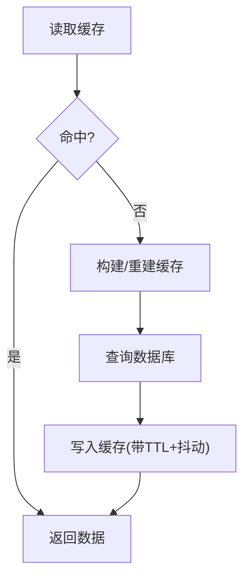
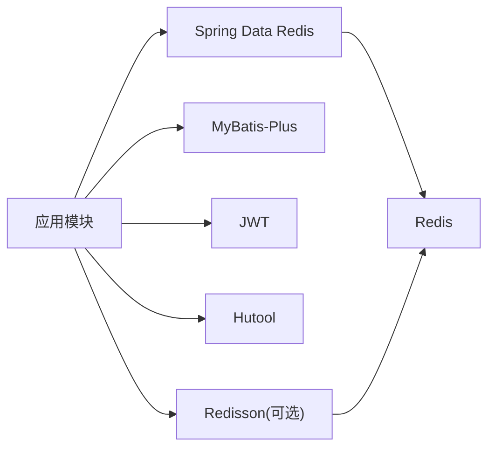

# 缓存一致性保证

<cite>
**本文引用的文件**
- [application.yml](file://wzoto-backend/wzoto-interfaces/src/main/resources/application.yml)
- [pom.xml（基础设施层）](file://wzoto-backend/wzoto-infrastructure/pom.xml)
- [JwtProperties.java](file://wzoto-backend/wzoto-infrastructure/src/main/java/com/wzoto/infrastructure/config/JwtProperties.java)
- [AuthApplicationService.java](file://wzoto-backend/wzoto-application/src/main/java/com/wzoto/application/service/AuthApplicationService.java)
- [LearningResourceApplicationService.java](file://wzoto-backend/wzoto-application/src/main/java/com/wzoto/application/service/LearningResourceApplicationService.java)
- [GlobalExceptionHandler.java](file://wzoto-backend/wzoto-interfaces/src/main/java/com/wzoto/interfaces/common/GlobalExceptionHandler.java)
- [MybatisMetaObjectHandler.java](file://wzoto-backend/wzoto-infrastructure/src/main/java/com/wzoto/infrastructure/config/MybatisMetaObjectHandler.java)
</cite>

## 目录
1. [简介](#简介)
2. [项目结构](#项目结构)
3. [核心组件](#核心组件)
4. [架构总览](#架构总览)
5. [详细组件分析](#详细组件分析)
6. [依赖分析](#依赖分析)
7. [性能考虑](#性能考虑)
8. [故障排查指南](#故障排查指南)
9. [结论](#结论)
10. [附录](#附录)

## 简介
本文件围绕 wzoto 后端在引入 Redis 与分布式锁能力时的“缓存一致性”保障方案，给出可落地的策略与实现建议。当前仓库已具备：
- Spring Data Redis 依赖与连接配置
- 应用服务层的领域编排与事务边界
- 全局异常处理与审计日志
- MyBatis-Plus 自动填充的时间戳字段

基于以上基础，本文从更新顺序、失效机制、分布式锁、并发防护、监控回滚五个维度，提供一套工程化落地方案，并给出与现有代码衔接的集成点与示例路径。

## 项目结构
wzoto 后端采用分层架构：接口层（Controller）、应用层（Application Service）、领域层（Domain Service/Entity/Repository 接口）、基础设施层（Mapper/Repository 实现、配置、工具）。Redis 作为外部中间件，通过 Spring Data Redis 接入；分布式锁可通过 Redisson 在基础设施层封装为可复用的锁服务。

图表来源
- [application.yml:6-17](file://wzoto-backend/wzoto-interfaces/src/main/resources/application.yml#L6-L17)
- [pom.xml（基础设施层）:16-28](file://wzoto-backend/wzoto-infrastructure/pom.xml#L16-L28)

章节来源
- [application.yml:6-17](file://wzoto-backend/wzoto-interfaces/src/main/resources/application.yml#L6-L17)
- [pom.xml（基础设施层）:16-28](file://wzoto-backend/wzoto-infrastructure/pom.xml#L16-L28)

## 核心组件
- 应用服务：承载业务流程编排与事务边界，适合在此统一协调“数据库写 + 缓存更新/删除 + 分布式锁”。
- 基础设施层：提供 Redis 客户端与 Redisson 分布式锁封装，供上层调用。
- 全局异常处理器：对业务异常与系统异常进行统一收敛，便于一致性监控与告警。
- 时间戳自动填充：确保数据变更时间可追踪，辅助一致性校验与回溯。

章节来源
- [AuthApplicationService.java:30-57](file://wzoto-backend/wzoto-application/src/main/java/com/wzoto/application/service/AuthApplicationService.java#L30-L57)
- [LearningResourceApplicationService.java:24-38](file://wzoto-backend/wzoto-application/src/main/java/com/wzoto/application/service/LearningResourceApplicationService.java#L24-L38)
- [GlobalExceptionHandler.java:18-66](file://wzoto-backend/wzoto-interfaces/src/main/java/com/wzoto/interfaces/common/GlobalExceptionHandler.java#L18-L66)
- [MybatisMetaObjectHandler.java:17-28](file://wzoto-backend/wzoto-infrastructure/src/main/java/com/wzoto/infrastructure/config/MybatisMetaObjectHandler.java#L17-L28)

## 架构总览
下图展示一次典型“写后读一致”的流程：应用服务在事务中完成数据库写入，随后通过基础设施层提供的缓存与锁能力，保证缓存与数据库的一致性。

图表来源
- [AuthApplicationService.java:30-57](file://wzoto-backend/wzoto-application/src/main/java/com/wzoto/application/service/AuthApplicationService.java#L30-L57)
- [application.yml:6-17](file://wzoto-backend/wzoto-interfaces/src/main/resources/application.yml#L6-L17)
- [pom.xml（基础设施层）:16-28](file://wzoto-backend/wzoto-infrastructure/pom.xml#L16-L28)

## 详细组件分析

### 更新顺序策略：先删缓存再更新数据库 vs 先更新数据库再删缓存
- 推荐策略：先更新数据库，再删除缓存。理由：
  - 避免“先删缓存再更新数据库”在高并发下出现脏读窗口（读请求可能读到旧缓存或空值，导致重建不一致数据）。
  - 若必须使用“先删缓存”，需配合强一致读（如强制回源数据库）或延迟双删，但复杂度更高。
- 在本项目中，建议在应用服务的事务外执行“删除缓存”，以减少跨资源锁粒度与事务时长。

章节来源
- [AuthApplicationService.java:30-57](file://wzoto-backend/wzoto-application/src/main/java/com/wzoto/application/service/AuthApplicationService.java#L30-L57)
- [LearningResourceApplicationService.java:24-38](file://wzoto-backend/wzoto-application/src/main/java/com/wzoto/application/service/LearningResourceApplicationService.java#L24-L38)

### 失效机制设计
- TTL 过期策略：为热点只读数据设置合理 TTL，降低缓存压力；适用于非强一致场景。
- 主动失效机制：写操作成功后主动删除对应缓存 key，由读时懒加载重建，兼顾一致性与性能。
- 延迟双删策略：先删缓存 → 写库 → 延时再次删缓存，用于补偿极端竞态下的不一致风险。注意延时时间与重试策略。

图表来源
- [application.yml:6-17](file://wzoto-backend/wzoto-interfaces/src/main/resources/application.yml#L6-L17)
- [pom.xml（基础设施层）:16-28](file://wzoto-backend/wzoto-infrastructure/pom.xml#L16-L28)

### 分布式锁使用：Redisson、锁粒度、死锁预防
- 锁粒度控制：以“资源级”为最小粒度（例如按用户ID、资源ID），避免全局限锁导致的性能瓶颈。
- 死锁预防：
  - 固定加锁顺序（如先父级后子级）
  - 设置合理的超时时间
  - 使用可重入锁减少重复加锁
- 在应用服务中，将“获取锁—执行业务—释放锁”包裹在统一模板中，确保异常路径也能释放锁。

图表来源
- [AuthApplicationService.java:30-57](file://wzoto-backend/wzoto-application/src/main/java/com/wzoto/application/service/AuthApplicationService.java#L30-L57)
- [application.yml:6-17](file://wzoto-backend/wzoto-interfaces/src/main/resources/application.yml#L6-L17)
- [pom.xml（基础设施层）:16-28](file://wzoto-backend/wzoto-infrastructure/pom.xml#L16-L28)

### 并发访问控制：击穿、雪崩、热点 Key
- 缓存击穿防护：对热点 key 加互斥重建锁（本地信号量或分布式锁），避免大量线程同时穿透到数据库。
- 缓存雪崩预防：TTL 增加随机抖动；批量预热；限流降级；多实例分片存储。
- 热点 Key 保护：结合布隆过滤器预判不存在 key；读写分离；多级缓存（本地+远程）。

图表来源
- [application.yml:6-17](file://wzoto-backend/wzoto-interfaces/src/main/resources/application.yml#L6-L17)
- [pom.xml（基础设施层）:16-28](file://wzoto-backend/wzoto-infrastructure/pom.xml#L16-L28)

### 一致性监控：校验、告警、回滚
- 数据一致性校验：定期抽样比对缓存与数据库的值（如签名/摘要对比），发现偏差立即告警。
- 异常告警机制：在应用服务与基础设施层埋点，记录失败次数、耗时、错误码；对接告警平台。
- 回滚策略：
  - 数据库侧：利用 @Transactional 保证原子性
  - 缓存侧：若写库成功但删缓存失败，采用异步重试或消息队列最终一致
  - 兜底：读路径支持降级到数据库直查

章节来源
- [AuthApplicationService.java:30-57](file://wzoto-backend/wzoto-application/src/main/java/com/wzoto/application/service/AuthApplicationService.java#L30-L57)
- [GlobalExceptionHandler.java:18-66](file://wzoto-backend/wzoto-interfaces/src/main/java/com/wzoto/interfaces/common/GlobalExceptionHandler.java#L18-L66)
- [MybatisMetaObjectHandler.java:17-28](file://wzoto-backend/wzoto-infrastructure/src/main/java/com/wzoto/infrastructure/config/MybatisMetaObjectHandler.java#L17-L28)

## 依赖分析
- 运行时依赖：Spring Boot、MyBatis-Plus、Spring Data Redis、JWT、Hutool 等。
- 扩展依赖：Redisson（分布式锁）可在基础设施层引入，对外暴露统一的锁服务接口。
- 配置项：Redis 主机、端口、密码、数据库索引等已在 application.yml 中定义。

图表来源
- [pom.xml（基础设施层）:16-28](file://wzoto-backend/wzoto-infrastructure/pom.xml#L16-L28)
- [application.yml:6-17](file://wzoto-backend/wzoto-interfaces/src/main/resources/application.yml#L6-L17)

章节来源
- [pom.xml（基础设施层）:16-28](file://wzoto-backend/wzoto-infrastructure/pom.xml#L16-L28)
- [application.yml:6-17](file://wzoto-backend/wzoto-interfaces/src/main/resources/application.yml#L6-L17)

## 性能考虑
- 优先“写库后删缓存”，减少不一致窗口。
- 热点 key 加 TTL 随机抖动，避免集中过期。
- 读路径支持缓存未命中快速回源，必要时加互斥重建锁。
- 批量操作尽量合并缓存更新，减少网络往返。
- 通过指标采集（命中率、延迟、错误率）持续优化。

## 故障排查指南
- 参数校验失败/绑定失败：检查入参与 DTO 映射，参考全局异常处理器的统一返回格式。
- 业务规则违反：定位领域服务抛出的异常信息，修正业务状态机。
- 运行时异常：查看日志堆栈，确认是否为缓存/锁/数据库异常，必要时开启更细粒度日志。
- 时间戳异常：确认 MyBatis-Plus 自动填充是否生效，检查实体字段命名与配置。

章节来源
- [GlobalExceptionHandler.java:18-66](file://wzoto-backend/wzoto-interfaces/src/main/java/com/wzoto/interfaces/common/GlobalExceptionHandler.java#L18-L66)
- [MybatisMetaObjectHandler.java:17-28](file://wzoto-backend/wzoto-infrastructure/src/main/java/com/wzoto/infrastructure/config/MybatisMetaObjectHandler.java#L17-L28)

## 结论
通过在应用服务层统一编排“数据库写 + 缓存失效 + 分布式锁”，并结合 TTL、主动失效、延迟双删等策略，wzoto 可在高并发场景下实现高效且可靠的缓存一致性。配合完善的监控与回滚机制，可将不一致风险降至最低，并为后续扩展（如多级缓存、事件驱动一致性）预留空间。

## 附录

### 与现有代码的集成要点
- 在应用服务中引入 Redis 与 Redisson 客户端，封装为可复用服务（如 CacheService、LockService）。
- 在写流程中遵循“先更新数据库，再删除缓存”的原则；对热点 key 增加互斥重建锁。
- 在异常路径中确保锁释放与缓存回退，避免资源泄漏。
- 通过全局异常处理器收集一致性相关指标，接入告警。

章节来源
- [AuthApplicationService.java:30-57](file://wzoto-backend/wzoto-application/src/main/java/com/wzoto/application/service/AuthApplicationService.java#L30-L57)
- [LearningResourceApplicationService.java:24-38](file://wzoto-backend/wzoto-application/src/main/java/com/wzoto/application/service/LearningResourceApplicationService.java#L24-L38)
- [application.yml:6-17](file://wzoto-backend/wzoto-interfaces/src/main/resources/application.yml#L6-L17)
- [pom.xml（基础设施层）:16-28](file://wzoto-backend/wzoto-infrastructure/pom.xml#L16-L28)