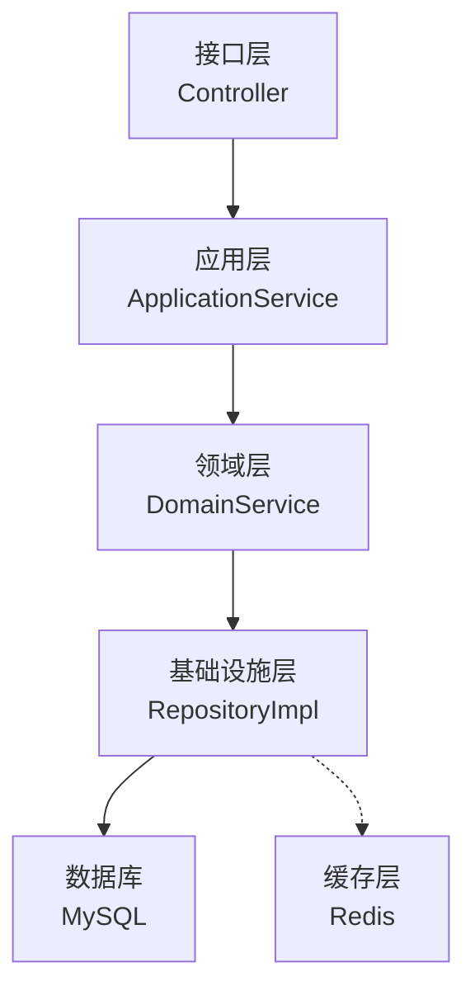
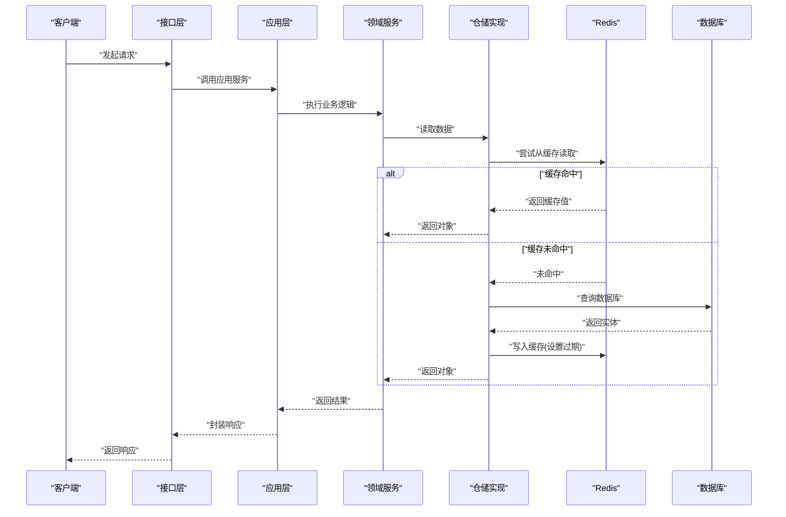
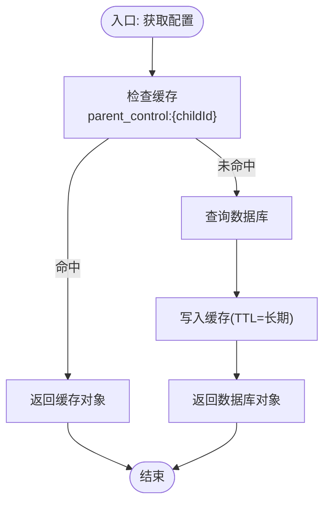
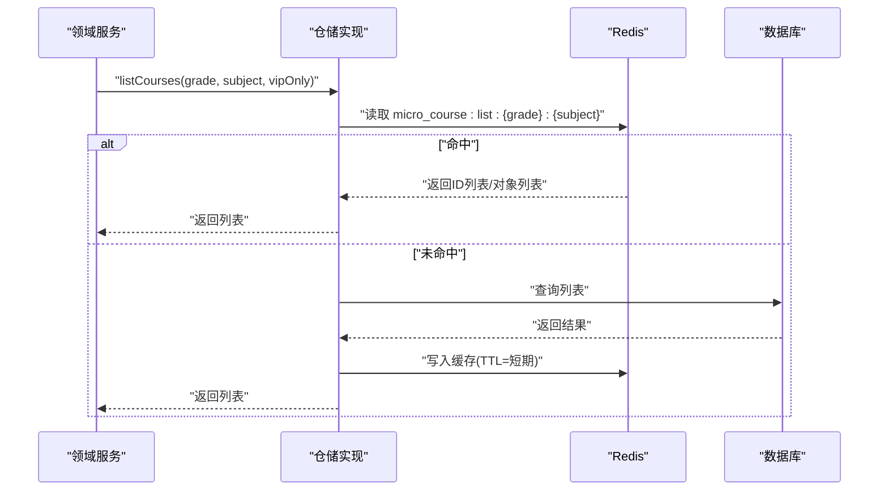
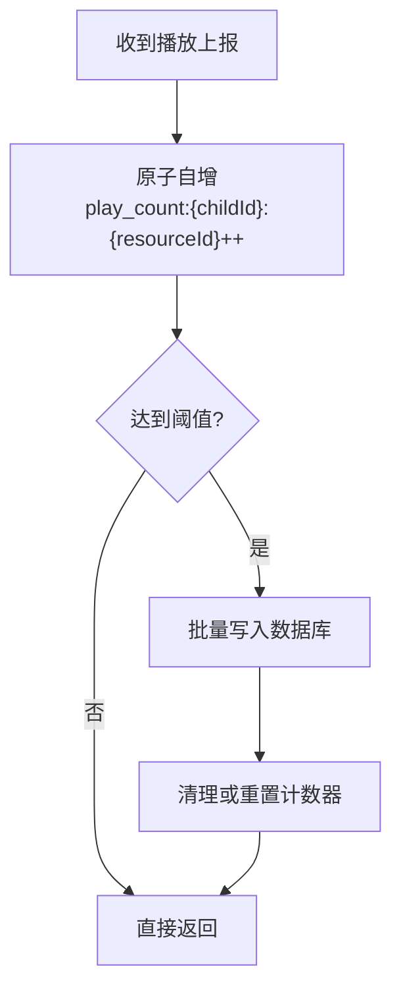
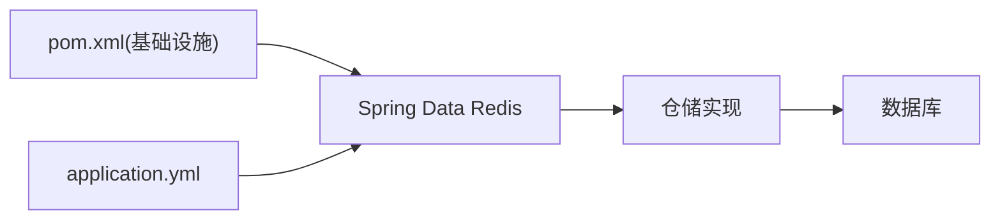

# 缓存策略设计

<cite>
**本文引用的文件**
- [application.yml](file://wzoto-backend/wzoto-interfaces/src/main/resources/application.yml)
- [pom.xml（基础设施模块）](file://wzoto-backend/wzoto-infrastructure/pom.xml)
- [WebMvcConfig.java](file://wzoto-backend/wzoto-infrastructure/src/main/java/com/wzoto/infrastructure/config/WebMvcConfig.java)
- [JwtProperties.java](file://wzoto-backend/wzoto-infrastructure/src/main/java/com/wzoto/infrastructure/config/JwtProperties.java)
- [WechatProperties.java](file://wzoto-backend/wzoto-infrastructure/src/main/java/com/wzoto/infrastructure/config/WechatProperties.java)
- [ParentControlConfigRepositoryImpl.java](file://wzoto-backend/wzoto-infrastructure/src/main/java/com/wzoto/infrastructure/repository/ParentControlConfigRepositoryImpl.java)
- [LearningPlanConfigRepositoryImpl.java](file://wzoto-backend/wzoto-infrastructure/src/main/java/com/wzoto/infrastructure/repository/LearningPlanConfigRepositoryImpl.java)
- [CourseWatchRecordRepositoryImpl.java](file://wzoto-backend/wzoto-infrastructure/src/main/java/com/wzoto/infrastructure/repository/CourseWatchRecordRepositoryImpl.java)
- [MicroCourseDomainService.java](file://wzoto-backend/wzoto-domain/src/main/java/com/wzoto/domain/service/MicroCourseDomainService.java)
- [ParentControlDomainService.java](file://wzoto-backend/wzoto-domain/src/main/java/com/wzoto/domain/service/ParentControlDomainService.java)
</cite>

## 目录
1. [简介](#简介)
2. [项目结构](#项目结构)
3. [核心组件](#核心组件)
4. [架构总览](#架构总览)
5. [详细组件分析](#详细组件分析)
6. [依赖关系分析](#依赖关系分析)
7. [性能考虑](#性能考虑)
8. [故障排查指南](#故障排查指南)
9. [结论](#结论)
10. [附录](#附录)

## 简介
本文件面向 wzoto 后端项目的缓存策略设计，聚焦 Redis 缓存的架构与落地方案。内容涵盖：
- 缓存层设计与数据结构选择、序列化策略
- 查询缓存应用：热点数据、字典数据、配置信息
- 结果缓存策略：接口响应、计算结果、视图数据
- 一致性保证：更新策略、失效机制、分布式锁
- 性能优化：预热、批量操作、内存管理
- 监控指标：命中率、内存使用、性能影响
- 结合现有仓储与服务，给出可落地的实现案例与预期提升效果

## 项目结构
当前后端采用 DDD 分层：
- 接口层：控制器与 DTO/VO
- 应用层：编排业务流程
- 领域层：业务规则与领域服务
- 基础设施层：持久化、外部集成、配置与工具

Redis 能力通过 Spring Data Redis 引入，配置在 application.yml；基础设施模块已声明 spring-boot-starter-data-redis 依赖，具备接入缓存的基础条件。

图表来源
- [application.yml:6-17](file://wzoto-backend/wzoto-interfaces/src/main/resources/application.yml#L6-L17)
- [pom.xml（基础设施模块）:16-28](file://wzoto-backend/wzoto-infrastructure/pom.xml#L16-L28)

章节来源
- [application.yml:6-17](file://wzoto-backend/wzoto-interfaces/src/main/resources/application.yml#L6-L17)
- [pom.xml（基础设施模块）:16-28](file://wzoto-backend/wzoto-infrastructure/pom.xml#L16-L28)

## 核心组件
- 配置中心
  - Redis 连接参数：host/port/password/database，通过环境变量注入
  - JWT、微信等扩展配置，便于后续鉴权与会话相关缓存扩展
- 仓储实现
  - ParentControlConfigRepositoryImpl：家长管控配置读写
  - LearningPlanConfigRepositoryImpl：学习计划配置读写
  - CourseWatchRecordRepositoryImpl：课程观看记录读写
- 领域服务
  - MicroCourseDomainService：微课列表/详情等读多写少场景
  - ParentControlDomainService：默认配置获取与创建

这些组件是后续接入缓存的高价值切入点：配置类、字典类、高频读取的列表与详情。

章节来源
- [application.yml:6-17](file://wzoto-backend/wzoto-interfaces/src/main/resources/application.yml#L6-L17)
- [JwtProperties.java:1-26](file://wzoto-backend/wzoto-infrastructure/src/main/java/com/wzoto/infrastructure/config/JwtProperties.java#L1-L26)
- [WechatProperties.java:1-23](file://wzoto-backend/wzoto-infrastructure/src/main/java/com/wzoto/infrastructure/config/WechatProperties.java#L1-L23)
- [ParentControlConfigRepositoryImpl.java:1-36](file://wzoto-backend/wzoto-infrastructure/src/main/java/com/wzoto/infrastructure/repository/ParentControlConfigRepositoryImpl.java#L1-L36)
- [LearningPlanConfigRepositoryImpl.java:1-37](file://wzoto-backend/wzoto-infrastructure/src/main/java/com/wzoto/infrastructure/repository/LearningPlanConfigRepositoryImpl.java#L1-L37)
- [CourseWatchRecordRepositoryImpl.java:1-39](file://wzoto-backend/wzoto-infrastructure/src/main/java/com/wzoto/infrastructure/repository/CourseWatchRecordRepositoryImpl.java#L1-L39)
- [MicroCourseDomainService.java:1-45](file://wzoto-backend/wzoto-domain/src/main/java/com/wzoto/domain/service/MicroCourseDomainService.java#L1-L45)
- [ParentControlDomainService.java:1-40](file://wzoto-backend/wzoto-domain/src/main/java/com/wzoto/domain/service/ParentControlDomainService.java#L1-L40)

## 架构总览
整体缓存架构以“就近缓存 + 统一键空间”为核心：
- 缓存层：基于 Redis 的集中式缓存，按业务域划分 key 前缀
- 数据层：MySQL 作为权威数据源
- 访问路径：请求进入 Controller → ApplicationService → DomainService → RepositoryImpl → 优先查缓存，未命中则回源 DB 并回填缓存
- 一致性：写后更新/删除缓存，必要时加分布式锁避免击穿

图表来源
- [application.yml:6-17](file://wzoto-backend/wzoto-interfaces/src/main/resources/application.yml#L6-L17)
- [ParentControlConfigRepositoryImpl.java:20-36](file://wzoto-backend/wzoto-infrastructure/src/main/java/com/wzoto/infrastructure/repository/ParentControlConfigRepositoryImpl.java#L20-L36)
- [LearningPlanConfigRepositoryImpl.java:20-37](file://wzoto-backend/wzoto-infrastructure/src/main/java/com/wzoto/infrastructure/repository/LearningPlanConfigRepositoryImpl.java#L20-L37)
- [CourseWatchRecordRepositoryImpl.java:23-39](file://wzoto-backend/wzoto-infrastructure/src/main/java/com/wzoto/infrastructure/repository/CourseWatchRecordRepositoryImpl.java#L23-L39)

## 详细组件分析

### 配置与字典数据缓存（家长管控配置、学习计划配置）
- 适用场景：配置类数据读多写少，变更频率低，适合长 TTL 或事件驱动失效
- 数据结构建议：Hash 存储键值对（如 parent_control:{childId}），利于局部更新
- 序列化策略：JSON（Jackson），可读性好，便于调试
- 键命名规范：domain:entity:id 或 domain:entity:by:field:value
- 失效策略：写后删除缓存；支持定时刷新（如每日凌晨）

图表来源
- [ParentControlConfigRepositoryImpl.java:20-36](file://wzoto-backend/wzoto-infrastructure/src/main/java/com/wzoto/infrastructure/repository/ParentControlConfigRepositoryImpl.java#L20-L36)
- [LearningPlanConfigRepositoryImpl.java:20-37](file://wzoto-backend/wzoto-infrastructure/src/main/java/com/wzoto/infrastructure/repository/LearningPlanConfigRepositoryImpl.java#L20-L37)

章节来源
- [ParentControlConfigRepositoryImpl.java:20-36](file://wzoto-backend/wzoto-infrastructure/src/main/java/com/wzoto/infrastructure/repository/ParentControlConfigRepositoryImpl.java#L20-L36)
- [LearningPlanConfigRepositoryImpl.java:20-37](file://wzoto-backend/wzoto-infrastructure/src/main/java/com/wzoto/infrastructure/repository/LearningPlanConfigRepositoryImpl.java#L20-L37)

### 热点列表与详情缓存（微课列表/详情）
- 适用场景：按年级/学科筛选的列表、热门微课详情，读多写少
- 数据结构建议：
  - 列表：ZSet 或 List 缓存排序后的 ID 列表，Value 为 Hash 或 JSON 对象
  - 详情：Hash 或 JSON 对象，key 为 micro_course:{id}
- 失效策略：写后删除对应列表与详情缓存；支持版本号或时间戳后缀

图表来源
- [MicroCourseDomainService.java:25-45](file://wzoto-backend/wzoto-domain/src/main/java/com/wzoto/domain/service/MicroCourseDomainService.java#L25-L45)

章节来源
- [MicroCourseDomainService.java:25-45](file://wzoto-backend/wzoto-domain/src/main/java/com/wzoto/domain/service/MicroCourseDomainService.java#L25-L45)

### 计数与统计缓存（课程观看记录）
- 适用场景：播放次数、学习进度等计数器，高并发写入
- 数据结构建议：
  - 计数器：String/Long 原子自增，key 为 play_count:{childId}:{resourceId}
  - 聚合统计：ZSet/Hash 用于排行榜或分组统计
- 失效策略：定期落库（批处理），不做强一致，允许最终一致

图表来源
- [CourseWatchRecordRepositoryImpl.java:23-39](file://wzoto-backend/wzoto-infrastructure/src/main/java/com/wzoto/infrastructure/repository/CourseWatchRecordRepositoryImpl.java#L23-L39)

章节来源
- [CourseWatchRecordRepositoryImpl.java:23-39](file://wzoto-backend/wzoto-infrastructure/src/main/java/com/wzoto/infrastructure/repository/CourseWatchRecordRepositoryImpl.java#L23-L39)

### 接口响应缓存（读多写少的查询接口）
- 适用场景：配置查询、字典查询、静态资源描述等
- 策略要点：
  - 短 TTL（如 5-30 分钟）+ 写后失效
  - 针对相同入参生成稳定 cacheKey
  - 大对象分片存储，避免单 key 过大

### 计算结果缓存（复杂聚合/报表）
- 适用场景：学习报告、错题统计、推荐结果
- 策略要点：
  - 异步计算 + 结果缓存
  - 触发式刷新（数据变更后）+ 定时刷新兜底
  - 使用版本号或时间戳后缀控制失效

### 视图数据缓存（页面组装数据）
- 适用场景：首页卡片、课程目录树、学习看板
- 策略要点：
  - 组合多个小对象为视图对象缓存
  - 按用户维度或匿名维度区分 key
  - 写后失效 + 热点 key 保护（防雪崩/穿透）

## 依赖关系分析
- 基础设施模块依赖 spring-boot-starter-data-redis，提供 RedisTemplate 等能力
- 配置集中在 application.yml，便于环境隔离
- 仓储实现与领域服务解耦，便于在仓储层统一接入缓存

图表来源
- [pom.xml（基础设施模块）:16-28](file://wzoto-backend/wzoto-infrastructure/pom.xml#L16-L28)
- [application.yml:6-17](file://wzoto-backend/wzoto-interfaces/src/main/resources/application.yml#L6-L17)

章节来源
- [pom.xml（基础设施模块）:16-28](file://wzoto-backend/wzoto-infrastructure/pom.xml#L16-L28)
- [application.yml:6-17](file://wzoto-backend/wzoto-interfaces/src/main/resources/application.yml#L6-L17)

## 性能考虑
- 缓存预热
  - 启动时加载热点配置与字典到 Redis
  - 定时任务刷新易变但高频的数据
- 批量操作
  - 使用 Pipeline 批量写入/读取，减少网络往返
  - 计数器批量落库，降低 DB 压力
- 内存管理
  - 合理设置 TTL，避免永久驻留
  - 大对象分片或压缩存储
  - 使用 Hash 替代大 JSON，便于增量更新
- 热点保护
  - 布隆过滤器防穿透
  - 互斥锁防击穿（分布式锁）
  - 随机过期防雪崩

## 故障排查指南
- 常见问题
  - 缓存未命中：检查 key 命名、序列化器、TTL 是否过短
  - 缓存不一致：确认写后是否删除/更新缓存；是否存在并发写冲突
  - 性能抖动：观察 Redis 慢查询、内存碎片率、连接池大小
- 定位手段
  - 开启日志埋点：记录命中/未命中、耗时、回源 DB 情况
  - 监控指标：命中率、QPS、P99 延迟、内存使用、错误率
  - 链路追踪：从接口到仓储再到 Redis/DB 的全链路耗时

## 结论
本项目已具备接入 Redis 的基础设施与典型读多写少场景。建议在以下位置优先落地缓存：
- 配置与字典：家长管控配置、学习计划配置
- 热点列表与详情：微课列表/详情
- 计数与统计：课程观看记录
通过统一的键空间、合理的序列化与失效策略，配合预热、批量与内存管理，可显著提升系统吞吐与稳定性，并降低数据库压力。

## 附录
- 键空间规划示例
  - 配置：config:parent_control:{childId}
  - 字典：dict:subject:{code}
  - 列表：micro_course:list:{grade}:{subject}
  - 详情：micro_course:detail:{id}
  - 计数：play_count:{childId}:{resourceId}
- 序列化建议
  - 使用 JSON 序列化，便于跨语言与调试
  - 对大对象进行分片或压缩
- 监控指标建议
  - 命中率、平均/分位延迟、错误率
  - Redis 内存使用、连接数、慢查询
  - 业务侧 QPS、成功率、超时率