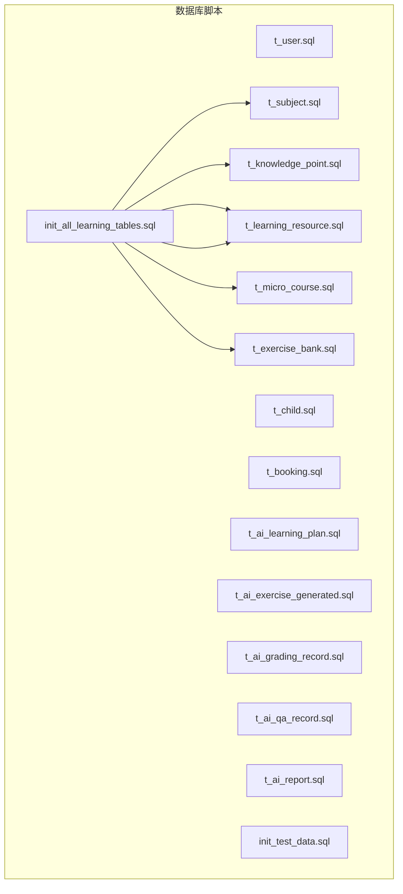
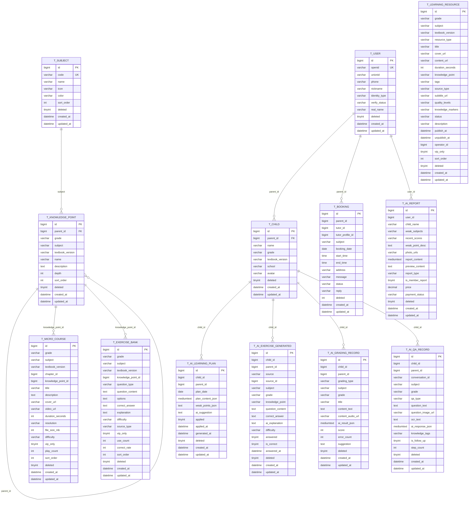
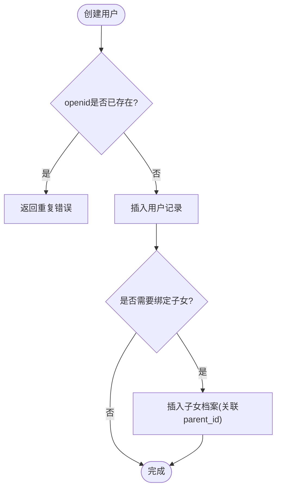
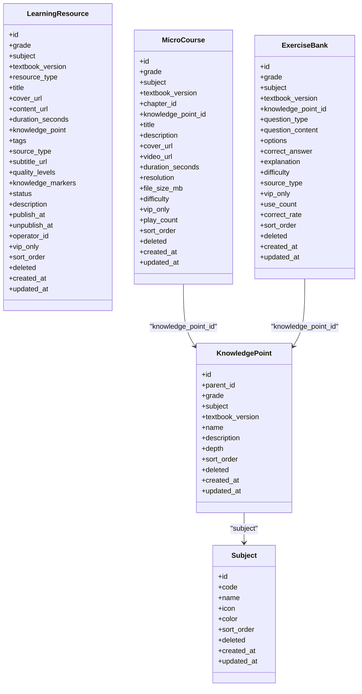
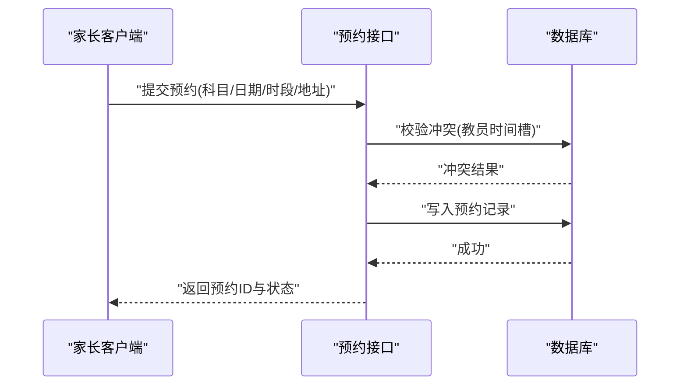
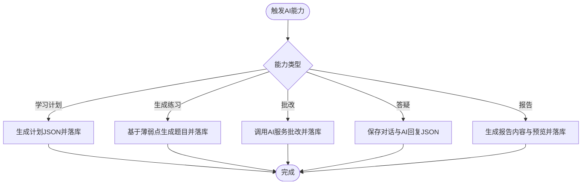
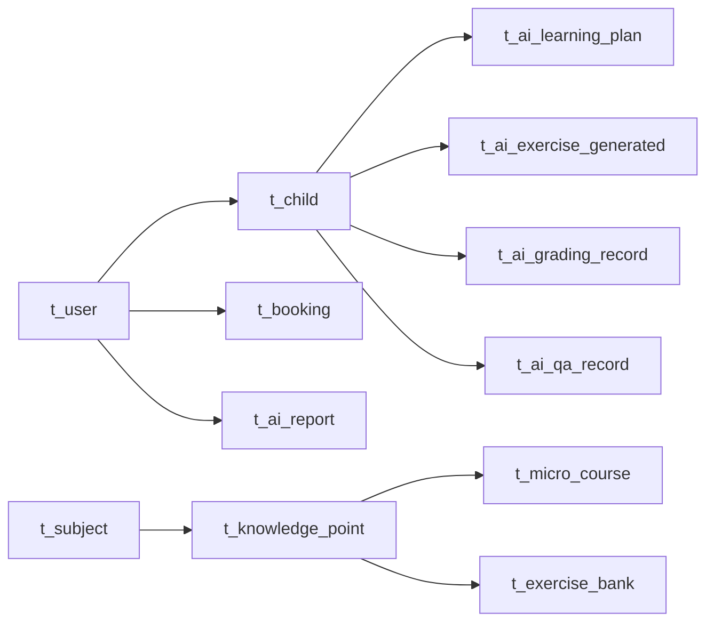

# 数据库设计

<cite>
**本文引用的文件**
- [t_user.sql](file://wzoto-backend/sql/t_user.sql)
- [t_child.sql](file://wzoto-backend/sql/t_child.sql)
- [t_booking.sql](file://wzoto-backend/sql/t_booking.sql)
- [t_subject.sql](file://wzoto-backend/sql/t_subject.sql)
- [t_knowledge_point.sql](file://wzoto-backend/sql/t_knowledge_point.sql)
- [t_learning_resource.sql](file://wzoto-backend/sql/t_learning_resource.sql)
- [t_micro_course.sql](file://wzoto-backend/sql/t_micro_course.sql)
- [t_exercise_bank.sql](file://wzoto-backend/sql/t_exercise_bank.sql)
- [t_ai_learning_plan.sql](file://wzoto-backend/sql/t_ai_learning_plan.sql)
- [t_ai_exercise_generated.sql](file://wzoto-backend/sql/t_ai_exercise_generated.sql)
- [t_ai_grading_record.sql](file://wzoto-backend/sql/t_ai_grading_record.sql)
- [t_ai_qa_record.sql](file://wzoto-backend/sql/t_ai_qa_record.sql)
- [t_ai_report.sql](file://wzoto-backend/sql/t_ai_report.sql)
- [init_all_learning_tables.sql](file://wzoto-backend/sql/init_all_learning_tables.sql)
- [init_test_data.sql](file://wzoto-backend/sql/init_test_data.sql)
</cite>

## 目录
1. [简介](#简介)
2. [项目结构](#项目结构)
3. [核心组件](#核心组件)
4. [架构总览](#架构总览)
5. [详细组件分析](#详细组件分析)
6. [依赖关系分析](#依赖关系分析)
7. [性能考虑](#性能考虑)
8. [故障排查指南](#故障排查指南)
9. [结论](#结论)
10. [附录](#附录)

## 简介
本文件面向wzoto项目的数据库设计，聚焦以下目标：
- 核心表结构设计：用户体系、学习体系、预约体系、AI功能表的字段定义与数据类型。
- 实体关系设计：主外键关系、索引策略、查询优化。
- 数据模型设计：ER图绘制、表关系映射、数据约束定义。
- 数据迁移管理：版本控制、增量更新、回滚策略。
- 数据安全设计：敏感信息加密、访问权限控制、数据备份恢复。
- SQL脚本说明：建表语句、初始数据、测试数据。
- 性能优化建议：查询优化、索引设计、分库分表策略。
- 数据一致性与事务管理方案。

## 项目结构
数据库相关SQL脚本集中于wzoto-backend/sql目录，按主题拆分（用户、子女、预约、学科、知识点、学习资源、微课、习题库、AI能力等），并提供一次性初始化脚本与测试数据脚本。

图表来源
- [init_all_learning_tables.sql:18-27](file://wzoto-backend/sql/init_all_learning_tables.sql#L18-L27)

章节来源
- [init_all_learning_tables.sql:1-31](file://wzoto-backend/sql/init_all_learning_tables.sql#L1-L31)

## 核心组件
本节概述四大类核心表族及其职责：
- 用户体系：用户、子女档案、会员（由测试脚本引用）。
- 学习体系：学科、知识点、学习资源、微课、习题库。
- 预约体系：家长端预约教员上课的订单记录。
- AI功能：学习计划、生成练习、批改记录、问答记录、学情报告。

章节来源
- [t_user.sql:8-26](file://wzoto-backend/sql/t_user.sql#L8-L26)
- [t_child.sql:4-17](file://wzoto-backend/sql/t_child.sql#L4-L17)
- [t_subject.sql:4-15](file://wzoto-backend/sql/t_subject.sql#L4-L15)
- [t_knowledge_point.sql:5-22](file://wzoto-backend/sql/t_knowledge_point.sql#L5-L22)
- [t_learning_resource.sql:4-35](file://wzoto-backend/sql/t_learning_resource.sql#L4-L35)
- [t_micro_course.sql:4-31](file://wzoto-backend/sql/t_micro_course.sql#L4-L31)
- [t_exercise_bank.sql:4-30](file://wzoto-backend/sql/t_exercise_bank.sql#L4-L30)
- [t_booking.sql:1-23](file://wzoto-backend/sql/t_booking.sql#L1-L23)
- [t_ai_learning_plan.sql:5-23](file://wzoto-backend/sql/t_ai_learning_plan.sql#L5-L23)
- [t_ai_exercise_generated.sql:5-29](file://wzoto-backend/sql/t_ai_exercise_generated.sql#L5-L29)
- [t_ai_grading_record.sql:5-27](file://wzoto-backend/sql/t_ai_grading_record.sql#L5-L27)
- [t_ai_qa_record.sql:5-29](file://wzoto-backend/sql/t_ai_qa_record.sql#L5-L29)
- [t_ai_report.sql:4-23](file://wzoto-backend/sql/t_ai_report.sql#L4-L23)

## 架构总览
下图展示核心表之间的概念性关系（以业务语义为主）：用户与家长/学生身份关联；家长可拥有多个子女；学习体系围绕“年级+学科+教材版本”组织；AI能力围绕子女维度进行学习与评测。

图表来源
- [t_user.sql:8-26](file://wzoto-backend/sql/t_user.sql#L8-L26)
- [t_child.sql:4-17](file://wzoto-backend/sql/t_child.sql#L4-L17)
- [t_subject.sql:4-15](file://wzoto-backend/sql/t_subject.sql#L4-L15)
- [t_knowledge_point.sql:5-22](file://wzoto-backend/sql/t_knowledge_point.sql#L5-L22)
- [t_learning_resource.sql:4-35](file://wzoto-backend/sql/t_learning_resource.sql#L4-L35)
- [t_micro_course.sql:4-31](file://wzoto-backend/sql/t_micro_course.sql#L4-L31)
- [t_exercise_bank.sql:4-30](file://wzoto-backend/sql/t_exercise_bank.sql#L4-L30)
- [t_booking.sql:1-23](file://wzoto-backend/sql/t_booking.sql#L1-L23)
- [t_ai_learning_plan.sql:5-23](file://wzoto-backend/sql/t_ai_learning_plan.sql#L5-L23)
- [t_ai_exercise_generated.sql:5-29](file://wzoto-backend/sql/t_ai_exercise_generated.sql#L5-L29)
- [t_ai_grading_record.sql:5-27](file://wzoto-backend/sql/t_ai_grading_record.sql#L5-L27)
- [t_ai_qa_record.sql:5-29](file://wzoto-backend/sql/t_ai_qa_record.sql#L5-L29)
- [t_ai_report.sql:4-23](file://wzoto-backend/sql/t_ai_report.sql#L4-L23)

## 详细组件分析

### 用户体系表
- t_user：用户主表，包含微信标识、手机号、昵称、头像、身份类型、认证状态、真实姓名、逻辑删除与时间戳。提供openid唯一索引与常用查询列的普通索引。
- t_child：子女档案表，关联家长用户，记录年级、教材版本、学校、头像等，支持按家长与年级检索。

图表来源
- [t_user.sql:8-26](file://wzoto-backend/sql/t_user.sql#L8-L26)
- [t_child.sql:4-17](file://wzoto-backend/sql/t_child.sql#L4-L17)

章节来源
- [t_user.sql:8-26](file://wzoto-backend/sql/t_user.sql#L8-L26)
- [t_child.sql:4-17](file://wzoto-backend/sql/t_child.sql#L4-L17)

### 学习体系表
- t_subject：学科字典表，含编码、名称、图标、颜色、排序号等，编码唯一。
- t_knowledge_point：知识点树形结构，支持按年级、学科、教材版本组织，自关联父节点，提供深度与排序。
- t_learning_resource：通用学习资源表，支持视频、习题、PDF、题目等多类型资源，包含元数据、标签、发布状态、VIP可见等。
- t_micro_course：微课视频表，关联章节与知识点，记录播放次数、难度、分辨率、文件大小等。
- t_exercise_bank：习题库表，结构化存储题目内容、选项、答案、解析、难度、来源、正确率等。

图表来源
- [t_subject.sql:4-15](file://wzoto-backend/sql/t_subject.sql#L4-L15)
- [t_knowledge_point.sql:5-22](file://wzoto-backend/sql/t_knowledge_point.sql#L5-L22)
- [t_learning_resource.sql:4-35](file://wzoto-backend/sql/t_learning_resource.sql#L4-L35)
- [t_micro_course.sql:4-31](file://wzoto-backend/sql/t_micro_course.sql#L4-L31)
- [t_exercise_bank.sql:4-30](file://wzoto-backend/sql/t_exercise_bank.sql#L4-L30)

章节来源
- [t_subject.sql:4-15](file://wzoto-backend/sql/t_subject.sql#L4-L15)
- [t_knowledge_point.sql:5-22](file://wzoto-backend/sql/t_knowledge_point.sql#L5-L22)
- [t_learning_resource.sql:4-35](file://wzoto-backend/sql/t_learning_resource.sql#L4-L35)
- [t_micro_course.sql:4-31](file://wzoto-backend/sql/t_micro_course.sql#L4-L31)
- [t_exercise_bank.sql:4-30](file://wzoto-backend/sql/t_exercise_bank.sql#L4-L30)

### 预约体系表
- t_booking：家长端预约教员上课的订单表，包含科目、日期、时间段、地址、留言、状态、回复、逻辑删除与时间戳。提供多列复合索引以优化按家长、教员、状态、日期的查询。

图表来源
- [t_booking.sql:1-23](file://wzoto-backend/sql/t_booking.sql#L1-L23)

章节来源
- [t_booking.sql:1-23](file://wzoto-backend/sql/t_booking.sql#L1-L23)

### AI功能表
- t_ai_learning_plan：AI生成的每日学习计划，包含计划内容JSON、薄弱点JSON、AI建议、应用状态与应用时间。
- t_ai_exercise_generated：AI根据错题/计划/答疑生成的练习题，记录来源、题目内容、答案、解析、作答情况。
- t_ai_grading_record：作文批改与口语评测记录，包含文本/音频、评分、错误数、建议摘要。
- t_ai_qa_record：拍照搜题与文字提问记录，包含会话ID、问题、OCR文本、AI回复JSON、知识点标签、步骤数。
- t_ai_report：学情诊断报告，包含薄弱学科、近期分数、描述、照片URL、完整报告与预览内容、支付状态。

图表来源
- [t_ai_learning_plan.sql:5-23](file://wzoto-backend/sql/t_ai_learning_plan.sql#L5-L23)
- [t_ai_exercise_generated.sql:5-29](file://wzoto-backend/sql/t_ai_exercise_generated.sql#L5-L29)
- [t_ai_grading_record.sql:5-27](file://wzoto-backend/sql/t_ai_grading_record.sql#L5-L27)
- [t_ai_qa_record.sql:5-29](file://wzoto-backend/sql/t_ai_qa_record.sql#L5-L29)
- [t_ai_report.sql:4-23](file://wzoto-backend/sql/t_ai_report.sql#L4-L23)

章节来源
- [t_ai_learning_plan.sql:5-23](file://wzoto-backend/sql/t_ai_learning_plan.sql#L5-L23)
- [t_ai_exercise_generated.sql:5-29](file://wzoto-backend/sql/t_ai_exercise_generated.sql#L5-L29)
- [t_ai_grading_record.sql:5-27](file://wzoto-backend/sql/t_ai_grading_record.sql#L5-L27)
- [t_ai_qa_record.sql:5-29](file://wzoto-backend/sql/t_ai_qa_record.sql#L5-L29)
- [t_ai_report.sql:4-23](file://wzoto-backend/sql/t_ai_report.sql#L4-L23)

## 依赖关系分析
- 学习资源与知识点：微课与习题库通过knowledge_point_id关联知识点；学习资源通过knowledge_point字段进行软关联。
- 用户与子女：家长用户通过parent_id关联子女档案；AI能力大多以child_id为维度进行聚合与分析。
- 预约与用户：预约记录通过parent_id关联家长用户。
- 报告与用户：学情报告通过user_id关联家长用户。

图表来源
- [t_user.sql:8-26](file://wzoto-backend/sql/t_user.sql#L8-L26)
- [t_child.sql:4-17](file://wzoto-backend/sql/t_child.sql#L4-L17)
- [t_booking.sql:1-23](file://wzoto-backend/sql/t_booking.sql#L1-L23)
- [t_subject.sql:4-15](file://wzoto-backend/sql/t_subject.sql#L4-L15)
- [t_knowledge_point.sql:5-22](file://wzoto-backend/sql/t_knowledge_point.sql#L5-L22)
- [t_micro_course.sql:4-31](file://wzoto-backend/sql/t_micro_course.sql#L4-L31)
- [t_exercise_bank.sql:4-30](file://wzoto-backend/sql/t_exercise_bank.sql#L4-L30)
- [t_ai_learning_plan.sql:5-23](file://wzoto-backend/sql/t_ai_learning_plan.sql#L5-L23)
- [t_ai_exercise_generated.sql:5-29](file://wzoto-backend/sql/t_ai_exercise_generated.sql#L5-L29)
- [t_ai_grading_record.sql:5-27](file://wzoto-backend/sql/t_ai_grading_record.sql#L5-L27)
- [t_ai_qa_record.sql:5-29](file://wzoto-backend/sql/t_ai_qa_record.sql#L5-L29)
- [t_ai_report.sql:4-23](file://wzoto-backend/sql/t_ai_report.sql#L4-L23)

章节来源
- [t_user.sql:8-26](file://wzoto-backend/sql/t_user.sql#L8-L26)
- [t_child.sql:4-17](file://wzoto-backend/sql/t_child.sql#L4-L17)
- [t_subject.sql:4-15](file://wzoto-backend/sql/t_subject.sql#L4-L15)
- [t_knowledge_point.sql:5-22](file://wzoto-backend/sql/t_knowledge_point.sql#L5-L22)
- [t_micro_course.sql:4-31](file://wzoto-backend/sql/t_micro_course.sql#L4-L31)
- [t_exercise_bank.sql:4-30](file://wzoto-backend/sql/t_exercise_bank.sql#L4-L30)
- [t_booking.sql:1-23](file://wzoto-backend/sql/t_booking.sql#L1-L23)
- [t_ai_learning_plan.sql:5-23](file://wzoto-backend/sql/t_ai_learning_plan.sql#L5-L23)
- [t_ai_exercise_generated.sql:5-29](file://wzoto-backend/sql/t_ai_exercise_generated.sql#L5-L29)
- [t_ai_grading_record.sql:5-27](file://wzoto-backend/sql/t_ai_grading_record.sql#L5-L27)
- [t_ai_qa_record.sql:5-29](file://wzoto-backend/sql/t_ai_qa_record.sql#L5-L29)
- [t_ai_report.sql:4-23](file://wzoto-backend/sql/t_ai_report.sql#L4-L23)

## 性能考虑
- 索引策略
  - 用户表：openid唯一索引用于快速登录；phone、identity_type、verify_status建立普通索引以支撑常见筛选。
  - 子女表：parent_id与grade建立索引，便于家长视图与年级维度的查询。
  - 学习资源表：grade+subject组合索引、textbook_version、resource_type、vip_only、knowledge_point索引，覆盖多维度浏览与筛选。
  - 微课表：grade+subject组合索引、textbook_version、chapter_id、knowledge_point_id、vip_only、difficulty索引，提升按年级学科与知识点检索效率。
  - 习题库：grade+subject组合索引、knowledge_point_id、question_type、difficulty、source_type、vip_only索引，支撑按知识点与题型的高效查询。
  - 预约表：parent_id、tutor_id、status、booking_date、tutor_id+status复合索引，优化按家长/教员/状态/日期的查询与冲突检测。
  - AI学习规划：child_id、plan_date、child_id+plan_date组合索引、applied索引，支持按子女与日期检索及已应用过滤。
  - AI生成练习：child_id、source、subject、answered、created_at索引，便于按来源与作答状态统计。
  - AI批改记录：child_id、parent_id、grading_type、subject、created_at索引，支持多维分析与趋势统计。
  - AI问答记录：child_id、parent_id、conversation_id、subject、created_at、child_id+subject组合索引，支持会话回放与学科维度分析。
  - AI报告：user_id、created_at索引，支持按用户与时间检索。
- 查询优化
  - 使用组合索引减少回表，优先选择选择性高的列作为前导列。
  - 对大字段（如JSON）避免在WHERE中直接扫描，必要时建立冗余列或物化视图。
  - 分页查询采用游标或基于索引的范围条件，避免深分页。
- 分库分表策略
  - 按家长/子女维度进行水平分片，将高频访问的数据隔离到不同实例或分片。
  - 日志型表（如AI问答、批改记录）按时间分表，降低单表体积。
  - 资源与题库可按年级+学科进行预分片，提高热点查询命中率。
- 缓存与读写分离
  - 读多写少的字典表（学科、知识点）引入缓存层。
  - 读写分离减轻主库压力，异步任务（如AI生成）写入从库或消息队列。

[本节为通用性能指导，不直接分析具体文件]

## 故障排查指南
- 常见问题定位
  - 登录失败：检查openid唯一约束冲突与用户是否存在。
  - 预约冲突：核对t_booking的时间段与教员可用性，利用idx_tutor_status与idx_booking_date快速定位冲突。
  - 资源不可见：检查vip_only与status字段，确认发布时间与下架时间。
  - AI能力异常：核对conversation_id与ai_response_json是否为空，检查OCR与AI服务调用链路。
- 数据一致性
  - 涉及多表写入（如预约、AI生成练习）应使用事务保证原子性。
  - 对于并发场景（如预约时间槽占用），采用行级锁或乐观锁防止超卖。
- 备份与恢复
  - 定期全量备份与增量备份结合，确保RPO/RTO满足要求。
  - 关键表（用户、预约、AI报告）增加审计字段与变更日志，便于回溯。

章节来源
- [t_booking.sql:1-23](file://wzoto-backend/sql/t_booking.sql#L1-L23)
- [t_ai_qa_record.sql:5-29](file://wzoto-backend/sql/t_ai_qa_record.sql#L5-L29)
- [t_ai_grading_record.sql:5-27](file://wzoto-backend/sql/t_ai_grading_record.sql#L5-L27)
- [t_learning_resource.sql:4-35](file://wzoto-backend/sql/t_learning_resource.sql#L4-L35)

## 结论
wzoto数据库设计围绕用户、学习、预约与AI四大域展开，采用清晰的表结构与合理的索引策略，兼顾扩展性与查询性能。通过统一的初始化脚本与测试数据脚本，保障环境一致性。建议在后续演进中持续完善索引、引入缓存与读写分离，并对高增长表实施分库分表与归档策略，以确保系统在高并发与大数据量下的稳定运行。

[本节为总结性内容，不直接分析具体文件]

## 附录

### 数据迁移管理
- 版本控制
  - 每个DDL脚本命名体现版本与模块，如v2_learning_resource_extend.sql。
  - 使用init_all_learning_tables.sql统一编排学习资源相关表的创建顺序，确保依赖关系正确。
- 增量更新
  - 新增字段或索引时，提供独立增量脚本，并在上线前评估影响范围。
  - 对大表变更采用在线DDL工具或分批执行，避免长时间锁表。
- 回滚策略
  - 所有DDL脚本需具备幂等性（IF NOT EXISTS/DROP IF EXISTS），以便安全重试。
  - 数据变更脚本需包含回滚语句，确保可逆。

章节来源
- [init_all_learning_tables.sql:18-27](file://wzoto-backend/sql/init_all_learning_tables.sql#L18-L27)

### 数据安全设计
- 敏感信息加密
  - 手机号等敏感字段建议加密存储，传输过程使用HTTPS。
  - 密码若引入，应采用强哈希算法（如BCrypt）。
- 访问权限控制
  - 基于RBAC或ABAC模型限制对敏感数据的访问。
  - 接口层增加鉴权与审计，记录操作人、时间、IP。
- 数据备份恢复
  - 制定自动化备份策略，保留多版本快照。
  - 定期进行恢复演练，验证备份有效性。

[本节为通用安全指导，不直接分析具体文件]

### 完整SQL脚本说明
- 建表语句
  - 各表DDL位于对应sql文件中，遵循utf8mb4字符集与InnoDB引擎。
  - 学习资源相关表可通过init_all_learning_tables.sql一次性初始化。
- 初始数据
  - init_test_data.sql提供测试用户、会员与AI报告的初始数据，便于本地调试。
- 测试数据
  - 可根据业务需要扩展更多测试用例，覆盖边界条件与异常路径。

章节来源
- [init_all_learning_tables.sql:1-31](file://wzoto-backend/sql/init_all_learning_tables.sql#L1-L31)
- [init_test_data.sql:1-26](file://wzoto-backend/sql/init_test_data.sql#L1-L26)