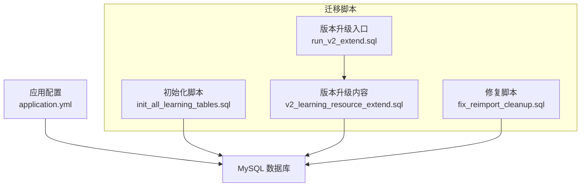
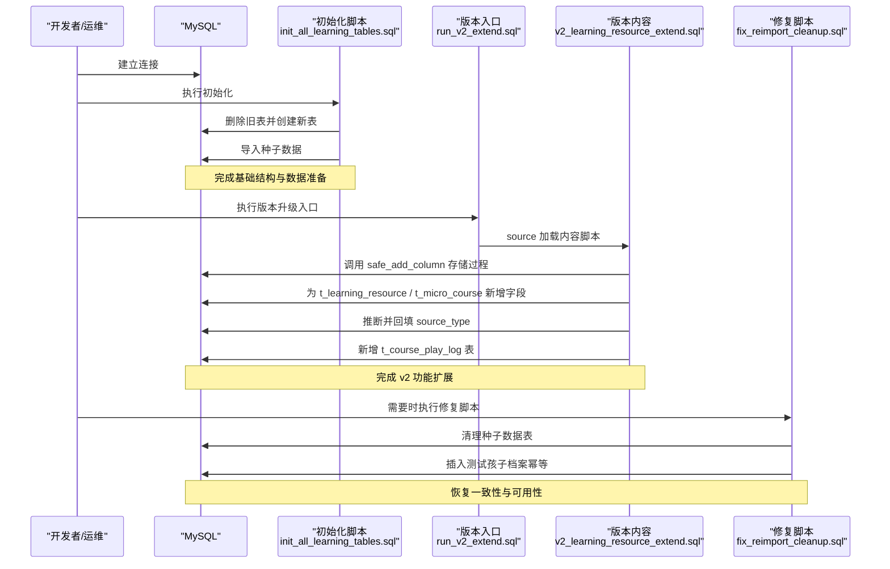
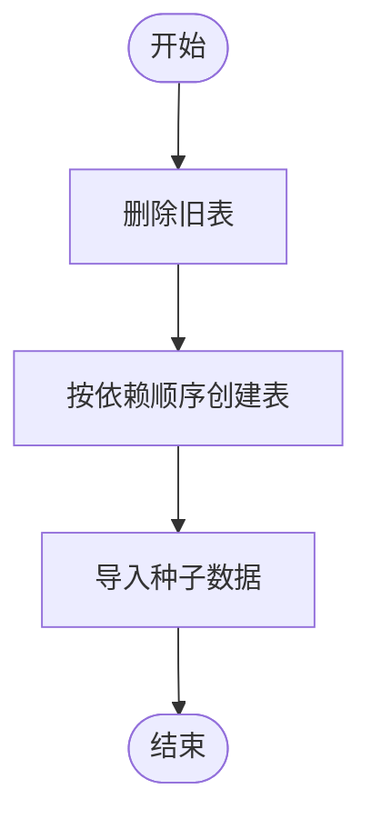
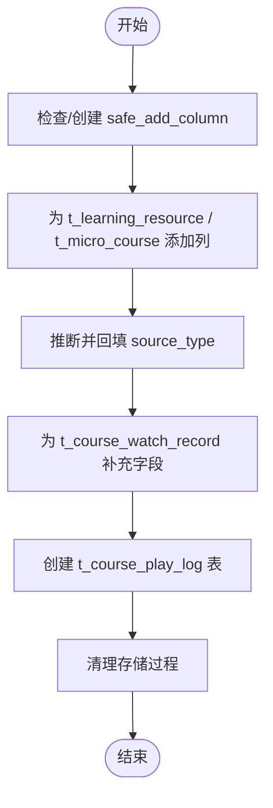
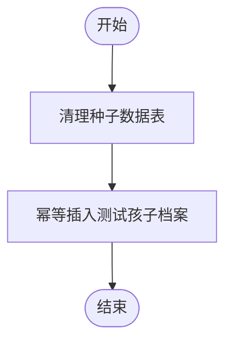
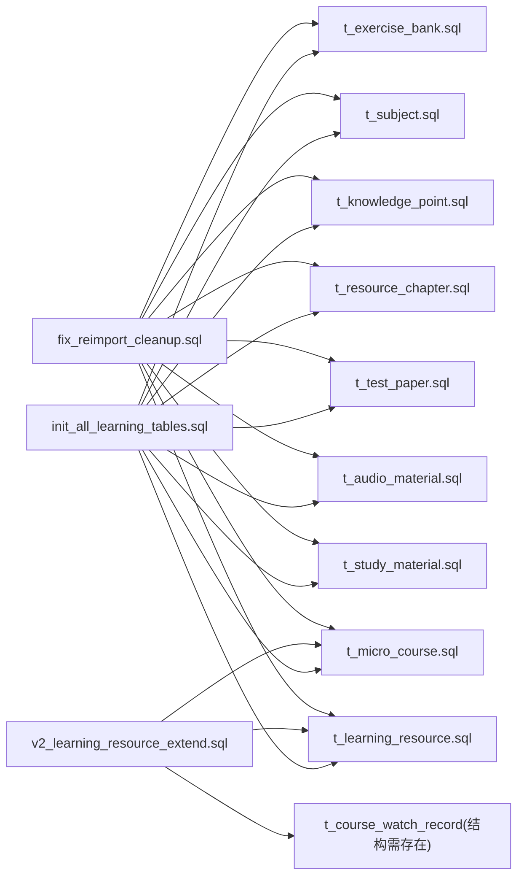

# 数据迁移管理

<cite>
**本文引用的文件**
- [init_all_learning_tables.sql](file://wzoto-backend/sql/init_all_learning_tables.sql)
- [run_v2_extend.sql](file://wzoto-backend/sql/run_v2_extend.sql)
- [v2_learning_resource_extend.sql](file://wzoto-backend/sql/v2_learning_resource_extend.sql)
- [fix_reimport_cleanup.sql](file://wzoto-backend/sql/fix_reimport_cleanup.sql)
- [t_learning_resource.sql](file://wzoto-backend/sql/t_learning_resource.sql)
- [t_micro_course.sql](file://wzoto-backend/sql/t_micro_course.sql)
- [t_subject.sql](file://wzoto-backend/sql/t_subject.sql)
- [t_knowledge_point.sql](file://wzoto-backend/sql/t_knowledge_point.sql)
- [t_resource_chapter.sql](file://wzoto-backend/sql/t_resource_chapter.sql)
- [application.yml](file://wzoto-backend/wzoto-interfaces/src/main/resources/application.yml)
</cite>

## 目录
1. [简介](#简介)
2. [项目结构](#项目结构)
3. [核心组件](#核心组件)
4. [架构总览](#架构总览)
5. [详细组件分析](#详细组件分析)
6. [依赖关系分析](#依赖关系分析)
7. [性能考虑](#性能考虑)
8. [故障排查指南](#故障排查指南)
9. [结论](#结论)
10. [附录](#附录)

## 简介
本文件面向 wzoto 项目的“学习资源”相关数据库迁移，系统性说明版本控制策略、增量更新脚本与修复脚本的设计与实践。重点覆盖：
- 版本号管理与变更追踪：通过命名约定与执行顺序实现可追溯的演进路径。
- 增量更新脚本：初始化流程（init_all_learning_tables.sql）、版本升级（run_v2_extend.sql + v2_learning_resource_extend.sql）。
- 修复脚本设计：数据清理与一致性恢复（fix_reimport_cleanup.sql）。
- 最佳实践：幂等性、依赖关系管理、测试验证。
- 工具链建议：自动化部署、灰度发布、监控告警。
- 失败处理与应急预案：回滚、重试、数据校验与快速止损。

## 项目结构
SQL 迁移脚本集中于 wzoto-backend/sql 目录，按“初始化—增量—修复”分层组织；应用配置位于 wzoto-interfaces 模块的资源文件中，用于连接数据库与运行时参数。

图表来源
- [application.yml:6-11](file://wzoto-backend/wzoto-interfaces/src/main/resources/application.yml#L6-L11)
- [init_all_learning_tables.sql:1-31](file://wzoto-backend/sql/init_all_learning_tables.sql#L1-L31)
- [run_v2_extend.sql:1-3](file://wzoto-backend/sql/run_v2_extend.sql#L1-L3)
- [v2_learning_resource_extend.sql:1-100](file://wzoto-backend/sql/v2_learning_resource_extend.sql#L1-L100)
- [fix_reimport_cleanup.sql:1-23](file://wzoto-backend/sql/fix_reimport_cleanup.sql#L1-L23)

章节来源
- [application.yml:6-11](file://wzoto-backend/wzoto-interfaces/src/main/resources/application.yml#L6-L11)
- [init_all_learning_tables.sql:1-31](file://wzoto-backend/sql/init_all_learning_tables.sql#L1-L31)
- [run_v2_extend.sql:1-3](file://wzoto-backend/sql/run_v2_extend.sql#L1-L3)
- [v2_learning_resource_extend.sql:1-100](file://wzoto-backend/sql/v2_learning_resource_extend.sql#L1-L100)
- [fix_reimport_cleanup.sql:1-23](file://wzoto-backend/sql/fix_reimport_cleanup.sql#L1-L23)

## 核心组件
- 初始化脚本：一次性创建学习资源相关表并导入种子数据，支持重复执行的安全清理与重建。
- 版本升级脚本：以“入口脚本 + 内容脚本”形式提供增量扩展，采用存储过程保证列添加的幂等性。
- 修复脚本：在数据异常或乱码场景下，安全清理并重建必要的基础数据，确保系统一致性。

章节来源
- [init_all_learning_tables.sql:1-31](file://wzoto-backend/sql/init_all_learning_tables.sql#L1-L31)
- [v2_learning_resource_extend.sql:8-28](file://wzoto-backend/sql/v2_learning_resource_extend.sql#L8-L28)
- [fix_reimport_cleanup.sql:1-23](file://wzoto-backend/sql/fix_reimport_cleanup.sql#L1-L23)

## 架构总览
下图展示迁移脚本与数据库对象之间的关系，以及执行顺序与依赖。

图表来源
- [init_all_learning_tables.sql:7-31](file://wzoto-backend/sql/init_all_learning_tables.sql#L7-L31)
- [run_v2_extend.sql:1-3](file://wzoto-backend/sql/run_v2_extend.sql#L1-L3)
- [v2_learning_resource_extend.sql:8-100](file://wzoto-backend/sql/v2_learning_resource_extend.sql#L8-L100)
- [fix_reimport_cleanup.sql:6-23](file://wzoto-backend/sql/fix_reimport_cleanup.sql#L6-L23)

## 详细组件分析

### 初始化流程：init_all_learning_tables.sql
- 目标：一次性创建学习资源相关表并导入种子数据，便于本地开发、测试环境快速搭建。
- 关键行为：
  - 先删除旧表，再按依赖顺序创建学科、知识点、章节、微课、题库、试卷、音频、学习资料、学习资源等表。
  - 使用 source 引入各子表的 DDL 与种子数据脚本，保证职责单一、易于维护。
- 幂等性：通过“先删后建”的方式实现可重复初始化；生产环境应谨慎使用，避免误删线上数据。
- 依赖关系：依赖 t_subject.sql、t_knowledge_point.sql、t_resource_chapter.sql、t_micro_course.sql、t_exercise_bank.sql、t_test_paper.sql、t_audio_material.sql、t_study_material.sql、t_learning_resource.sql 及综合种子数据脚本。

图表来源
- [init_all_learning_tables.sql:7-31](file://wzoto-backend/sql/init_all_learning_tables.sql#L7-L31)

章节来源
- [init_all_learning_tables.sql:7-31](file://wzoto-backend/sql/init_all_learning_tables.sql#L7-L31)
- [t_subject.sql:1-16](file://wzoto-backend/sql/t_subject.sql#L1-L16)
- [t_knowledge_point.sql:1-23](file://wzoto-backend/sql/t_knowledge_point.sql#L1-L23)
- [t_resource_chapter.sql:1-21](file://wzoto-backend/sql/t_resource_chapter.sql#L1-L21)
- [t_micro_course.sql:1-32](file://wzoto-backend/sql/t_micro_course.sql#L1-L32)
- [t_learning_resource.sql:1-36](file://wzoto-backend/sql/t_learning_resource.sql#L1-L36)

### 版本升级：run_v2_extend.sql 与 v2_learning_resource_extend.sql
- 目标：在不破坏现有数据的前提下，为学习资源体系增加播放器与管理后台所需字段与能力。
- 关键行为：
  - 定义 safe_add_column 存储过程，查询 information_schema.COLUMNS 判断列是否存在，不存在则动态添加，确保幂等。
  - 为 t_learning_resource 与 t_micro_course 新增 source_type、subtitle_url、quality_levels、knowledge_markers、status、publish_at/unpublish_at、operator_id、description 等字段。
  - 基于已有 URL 推断 source_type 并回填历史数据，提升兼容性。
  - 为 t_course_watch_record 补充首次/最后观看时间字段。
  - 新建 t_course_play_log 表记录播放明细事件（播放、暂停、seek、心跳、完成），并提供多维度索引。
  - 执行完毕后清理临时存储过程，保持数据库整洁。
- 幂等性：通过存储过程检查列存在性，避免重复执行报错；适合多次执行与灰度回滚。
- 依赖关系：依赖 t_learning_resource、t_micro_course、t_course_watch_record 表结构已存在。

图表来源
- [v2_learning_resource_extend.sql:8-100](file://wzoto-backend/sql/v2_learning_resource_extend.sql#L8-L100)
- [run_v2_extend.sql:1-3](file://wzoto-backend/sql/run_v2_extend.sql#L1-L3)

章节来源
- [run_v2_extend.sql:1-3](file://wzoto-backend/sql/run_v2_extend.sql#L1-L3)
- [v2_learning_resource_extend.sql:8-100](file://wzoto-backend/sql/v2_learning_resource_extend.sql#L8-L100)
- [t_learning_resource.sql:1-36](file://wzoto-backend/sql/t_learning_resource.sql#L1-L36)
- [t_micro_course.sql:1-32](file://wzoto-backend/sql/t_micro_course.sql#L1-L32)

### 修复脚本：fix_reimport_cleanup.sql
- 目标：在数据乱码或污染场景下，清理种子数据表并重建必要的基础数据，恢复一致性。
- 关键行为：
  - 清空学习资源相关表（学习资源、微课、题库、试卷、音频、学习资料、章节、知识点、学科）。
  - 幂等插入测试孩子档案（parent_id=2，年级四年级），避免重复插入。
- 适用场景：本地/测试环境重建、数据污染后的快速恢复；生产环境需谨慎评估影响范围。
- 注意事项：该脚本会删除大量数据，务必在受控环境与备份前提下执行。

图表来源
- [fix_reimport_cleanup.sql:6-23](file://wzoto-backend/sql/fix_reimport_cleanup.sql#L6-L23)

章节来源
- [fix_reimport_cleanup.sql:6-23](file://wzoto-backend/sql/fix_reimport_cleanup.sql#L6-L23)

### 数据模型与索引要点
- t_learning_resource：包含资源类型、标题、封面、内容URL、时长、知识点、标签、视频源类型、字幕、画质等级、知识点标记、状态、发布时间、下架时间、操作员、会员可见、排序、逻辑删除、审计字段；具备年级+学科、教材版本、资源类型、会员可见、知识点等多维索引。
- t_micro_course：微课视频表，包含年级、学科、教材版本、章节/知识点关联、标题、简介、封面、视频URL、时长、分辨率、文件大小、难度、会员可见、播放次数、排序、逻辑删除、审计字段；具备年级+学科、教材版本、章节、知识点、会员可见、难度等索引。
- t_subject：学科主数据，唯一键 code 防止重复。
- t_knowledge_point：树形知识点结构，支持 parent_id 自关联，按年级+学科+教材版本组织，具备深度与父节点索引。
- t_resource_chapter：教材章节目录树，支持层级 depth 与同级排序。

章节来源
- [t_learning_resource.sql:1-36](file://wzoto-backend/sql/t_learning_resource.sql#L1-L36)
- [t_micro_course.sql:1-32](file://wzoto-backend/sql/t_micro_course.sql#L1-L32)
- [t_subject.sql:1-16](file://wzoto-backend/sql/t_subject.sql#L1-L16)
- [t_knowledge_point.sql:1-23](file://wzoto-backend/sql/t_knowledge_point.sql#L1-L23)
- [t_resource_chapter.sql:1-21](file://wzoto-backend/sql/t_resource_chapter.sql#L1-L21)

## 依赖关系分析
- 初始化脚本依赖多个子表 DDL 与种子数据脚本，形成“聚合入口 + 分散实现”的结构，便于分模块维护。
- 版本升级脚本通过存储过程解耦“列存在性检查”与“DDL 执行”，降低耦合度与出错概率。
- 修复脚本独立于初始化与升级，作为应急手段，不改变既有结构，仅做数据层清理与重建。

图表来源
- [init_all_learning_tables.sql:18-31](file://wzoto-backend/sql/init_all_learning_tables.sql#L18-L31)
- [v2_learning_resource_extend.sql:30-96](file://wzoto-backend/sql/v2_learning_resource_extend.sql#L30-L96)
- [fix_reimport_cleanup.sql:8-22](file://wzoto-backend/sql/fix_reimport_cleanup.sql#L8-L22)

章节来源
- [init_all_learning_tables.sql:18-31](file://wzoto-backend/sql/init_all_learning_tables.sql#L18-L31)
- [v2_learning_resource_extend.sql:30-96](file://wzoto-backend/sql/v2_learning_resource_extend.sql#L30-L96)
- [fix_reimport_cleanup.sql:8-22](file://wzoto-backend/sql/fix_reimport_cleanup.sql#L8-L22)

## 性能考虑
- 批量 DDL 与数据操作建议在低峰期执行，减少锁竞争与复制延迟。
- 对大表新增列时，优先采用“允许 NULL + 默认值”的策略，避免在线锁表过久。
- 合理设置索引：如 t_course_play_log 的多维度索引有助于高频查询与统计。
- 使用 source 拆分脚本，有利于定位问题与局部重放。
- 种子数据导入前评估数据量，必要时分批提交事务，避免单条事务过大导致内存压力。

## 故障排查指南
- 常见问题
  - 重复执行报错：确认是否已存在列或表；v2 脚本已通过存储过程保护，若仍报错请检查 MySQL 版本与权限。
  - 字符集乱码：使用 fix_reimport_cleanup.sql 清理并重新导入；确保客户端与服务端均使用 utf8mb4。
  - 依赖缺失：初始化前确保所有子表 DDL 可用；升级前确认目标表结构已就绪。
- 诊断步骤
  - 查看 application.yml 中的数据库连接配置，确认地址、端口、用户名、密码与时区。
  - 检查 information_schema.COLUMNS 中列是否存在，验证 safe_add_column 逻辑。
  - 核对 t_course_play_log 表结构与索引是否创建成功。
- 回滚策略
  - 对于新增列：可通过 ALTER TABLE DROP COLUMN 回滚（谨慎评估业务影响）。
  - 对于新增表：DROP TABLE 回滚（确保无外部依赖）。
  - 对于数据清理：在执行修复脚本前务必备份，必要时从备份恢复。

章节来源
- [application.yml:6-11](file://wzoto-backend/wzoto-interfaces/src/main/resources/application.yml#L6-L11)
- [v2_learning_resource_extend.sql:8-28](file://wzoto-backend/sql/v2_learning_resource_extend.sql#L8-L28)
- [fix_reimport_cleanup.sql:6-23](file://wzoto-backend/sql/fix_reimport_cleanup.sql#L6-L23)

## 结论
本项目采用“初始化—增量—修复”的三层迁移策略，结合幂等设计与清晰的依赖关系，实现了学习资源体系的稳健演进。通过入口脚本与内容脚本分离、存储过程保护列添加、以及独立的修复脚本，既保证了日常迭代的灵活性，也提供了应急恢复的能力。建议在生产环境中配合自动化部署、灰度发布与监控告警，进一步提升迁移的安全性与可观测性。

## 附录

### 版本控制策略与最佳实践
- 版本号管理
  - 以文件名体现版本（如 run_v2_extend.sql），并通过执行顺序保证演进路径清晰。
  - 每个版本脚本应具备幂等性，支持重复执行与灰度回滚。
- 变更追踪
  - 将脚本纳入版本控制系统，附带变更记录与影响范围说明。
  - 在数据库中保留必要的元数据（如 operator_id、created_at/updated_at）以便审计。
- 依赖关系管理
  - 初始化脚本聚合多张表 DDL，但内部通过 source 拆分，便于单独维护与测试。
  - 升级脚本明确依赖目标表结构，避免隐式耦合。
- 测试验证
  - 在测试环境完整执行初始化与升级脚本，验证字段、索引与数据推断逻辑。
  - 对修复脚本进行演练，确保在异常场景下能快速恢复。

### 迁移工具链建议
- 自动化部署
  - 将脚本纳入 CI/CD 流水线，在构建阶段执行预检（语法检查、依赖检查），在发布阶段按序执行。
  - 使用事务包裹关键步骤，失败自动回滚。
- 灰度发布
  - 先在只读实例或影子库执行，验证无误后再在主库滚动执行。
  - 对大表变更采用分批次执行，降低风险。
- 监控告警
  - 记录脚本执行日志与耗时，设置阈值告警。
  - 对 t_course_play_log 等高频写入表监控写入速率与错误率。

### 迁移失败的处理方案与应急预案
- 立即止损
  - 停止后续脚本执行，回滚当前事务（如支持）。
  - 切换流量至稳定版本，避免用户感知到不一致。
- 数据恢复
  - 从最近一次成功备份恢复，或使用修复脚本清理并重建。
  - 对关键字段进行一致性校验（如 source_type 推断结果是否符合预期）。
- 复盘改进
  - 分析失败原因（权限、字符集、依赖缺失、锁等待等），完善前置检查清单。
  - 优化脚本幂等性与错误提示，增强可观测性。