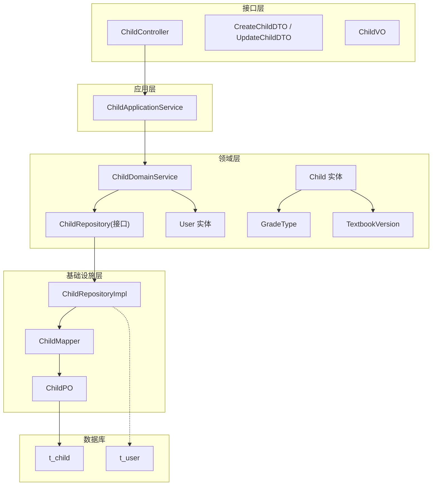
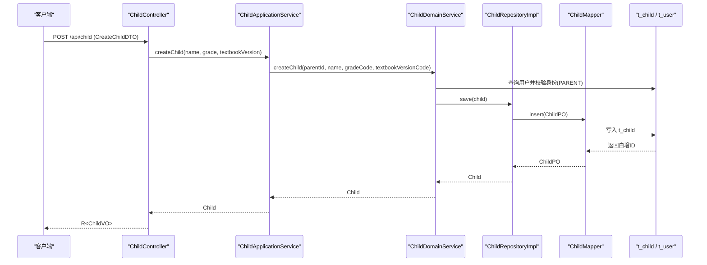
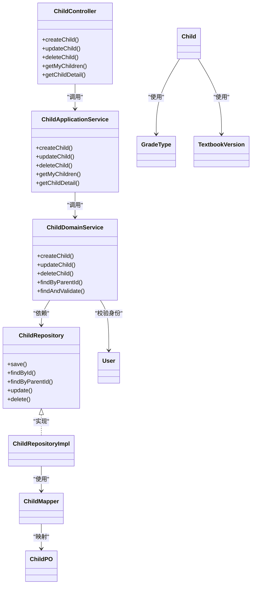
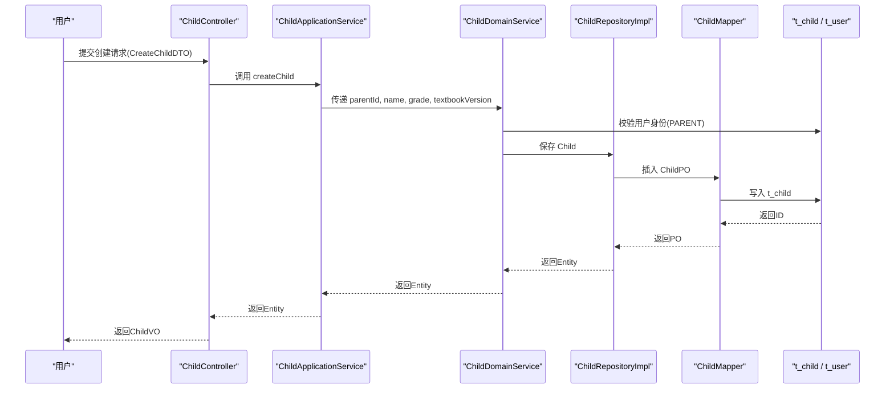

# 儿童管理表(t_child)

<cite>
**本文引用的文件**
- [t_child.sql](file://wzoto-backend/sql/t_child.sql)
- [t_user.sql](file://wzoto-backend/sql/t_user.sql)
- [Child.java](file://wzoto-backend/wzoto-domain/src/main/java/com/wzoto/domain/entity/Child.java)
- [User.java](file://wzoto-backend/wzoto-domain/src/main/java/com/wzoto/domain/entity/User.java)
- [GradeType.java](file://wzoto-backend/wzoto-domain/src/main/java/com/wzoto/domain/valobj/GradeType.java)
- [TextbookVersion.java](file://wzoto-backend/wzoto-domain/src/main/java/com/wzoto/domain/valobj/TextbookVersion.java)
- [ChildDomainService.java](file://wzoto-backend/wzoto-domain/src/main/java/com/wzoto/domain/service/ChildDomainService.java)
- [ChildApplicationService.java](file://wzoto-backend/wzoto-application/src/main/java/com/wzoto/application/service/ChildApplicationService.java)
- [ChildController.java](file://wzoto-backend/wzoto-interfaces/src/main/java/com/wzoto/interfaces/controller/ChildController.java)
- [CreateChildDTO.java](file://wzoto-backend/wzoto-interfaces/src/main/java/com/wzoto/interfaces/dto/child/CreateChildDTO.java)
- [ChildRepository.java](file://wzoto-backend/wzoto-domain/src/main/java/com/wzoto/domain/repository/ChildRepository.java)
- [ChildRepositoryImpl.java](file://wzoto-backend/wzoto-infrastructure/src/main/java/com/wzoto/infrastructure/repository/ChildRepositoryImpl.java)
- [ChildMapper.java](file://wzoto-backend/wzoto-infrastructure/src/main/java/com/wzoto/infrastructure/mapper/ChildMapper.java)
- [ChildPO.java](file://wzoto-backend/wzoto-infrastructure/src/main/java/com/wzoto/infrastructure/pojo/ChildPO.java)
- [ChildVO.java](file://wzoto-backend/wzoto-interfaces/src/main/java/com/wzoto/interfaces/vo/child/ChildVO.java)
</cite>

## 目录
1. [简介](#简介)
2. [项目结构](#项目结构)
3. [核心组件](#核心组件)
4. [架构总览](#架构总览)
5. [详细组件分析](#详细组件分析)
6. [依赖关系分析](#依赖关系分析)
7. [性能考虑](#性能考虑)
8. [故障排查指南](#故障排查指南)
9. [结论](#结论)
10. [附录](#附录)

## 简介
本文件围绕儿童管理表 t_child 的设计与实现，系统阐述其与用户表的关联关系、外键约束策略、字段业务含义与校验规则、年级与学习内容的适配逻辑、状态管理机制、索引设计以及数据完整性约束。同时给出面向“儿童学习档案管理”的扩展思路，帮助读者在现有架构上平滑演进。

## 项目结构
- 数据库层：DDL 定义 t_child 与 t_user 表结构及索引。
- 领域层：Child、User 实体与 GradeType、TextbookVersion 值对象；ChildDomainService 封装领域规则（家长身份校验、归属权校验等）。
- 应用层：ChildApplicationService 编排用例，注入当前登录用户上下文。
- 接口层：ChildController 暴露 REST API，配合 DTO/VO 完成入参出参转换与校验。
- 基础设施层：ChildRepository 接口与 ChildRepositoryImpl 实现，通过 MyBatis-Plus 的 ChildMapper 与 ChildPO 映射到 t_child。

图表来源
- [ChildController.java:20-77](file://wzoto-backend/wzoto-interfaces/src/main/java/com/wzoto/interfaces/controller/ChildController.java#L20-L77)
- [ChildApplicationService.java:12-48](file://wzoto-backend/wzoto-application/src/main/java/com/wzoto/application/service/ChildApplicationService.java#L12-L48)
- [ChildDomainService.java:16-86](file://wzoto-backend/wzoto-domain/src/main/java/com/wzoto/domain/service/ChildDomainService.java#L16-L86)
- [ChildRepository.java:7-22](file://wzoto-backend/wzoto-domain/src/main/java/com/wzoto/domain/repository/ChildRepository.java#L7-L22)
- [ChildRepositoryImpl.java:16-88](file://wzoto-backend/wzoto-infrastructure/src/main/java/com/wzoto/infrastructure/repository/ChildRepositoryImpl.java#L16-L88)
- [ChildMapper.java:7-13](file://wzoto-backend/wzoto-infrastructure/src/main/java/com/wzoto/infrastructure/mapper/ChildMapper.java#L7-L13)
- [ChildPO.java:8-39](file://wzoto-backend/wzoto-infrastructure/src/main/java/com/wzoto/infrastructure/pojo/ChildPO.java#L8-L39)
- [t_child.sql:4-17](file://wzoto-backend/sql/t_child.sql#L4-L17)
- [t_user.sql:8-26](file://wzoto-backend/sql/t_user.sql#L8-L26)

章节来源
- [t_child.sql:4-17](file://wzoto-backend/sql/t_child.sql#L4-L17)
- [t_user.sql:8-26](file://wzoto-backend/sql/t_user.sql#L8-L26)
- [Child.java:20-122](file://wzoto-backend/wzoto-domain/src/main/java/com/wzoto/domain/entity/Child.java#L20-L122)
- [User.java:20-93](file://wzoto-backend/wzoto-domain/src/main/java/com/wzoto/domain/entity/User.java#L20-L93)
- [ChildDomainService.java:27-84](file://wzoto-backend/wzoto-domain/src/main/java/com/wzoto/domain/service/ChildDomainService.java#L27-L84)
- [ChildRepositoryImpl.java:25-88](file://wzoto-backend/wzoto-infrastructure/src/main/java/com/wzoto/infrastructure/repository/ChildRepositoryImpl.java#L25-L88)
- [ChildController.java:31-60](file://wzoto-backend/wzoto-interfaces/src/main/java/com/wzoto/interfaces/controller/ChildController.java#L31-L60)

## 核心组件
- t_child 表：存储子女档案，包含家长ID、姓名、年级、教材版本、学校、头像、逻辑删除标记与时间戳，并建立 parent_id 与 grade 索引。
- t_user 表：存储用户信息，含身份类型（PARENT/STUDENT）与认证状态，作为家长身份校验的依据。
- 领域实体与值对象：Child 表达子女档案，GradeType 与 TextbookVersion 提供强类型的枚举约束。
- 服务与仓储：ChildDomainService 负责业务规则（家长身份、归属权），ChildRepositoryImpl 负责持久化与查询。
- 接口与数据传输：ChildController 暴露 CRUD 接口，CreateChildDTO/UpdateChildDTO 进行入参校验，ChildVO 输出视图模型。

章节来源
- [t_child.sql:4-17](file://wzoto-backend/sql/t_child.sql#L4-L17)
- [t_user.sql:8-26](file://wzoto-backend/sql/t_user.sql#L8-L26)
- [Child.java:20-122](file://wzoto-backend/wzoto-domain/src/main/java/com/wzoto/domain/entity/Child.java#L20-L122)
- [GradeType.java:8-46](file://wzoto-backend/wzoto-domain/src/main/java/com/wzoto/domain/valobj/GradeType.java#L8-L46)
- [TextbookVersion.java:8-36](file://wzoto-backend/wzoto-domain/src/main/java/com/wzoto/domain/valobj/TextbookVersion.java#L8-L36)
- [ChildDomainService.java:27-84](file://wzoto-backend/wzoto-domain/src/main/java/com/wzoto/domain/service/ChildDomainService.java#L27-L84)
- [ChildRepositoryImpl.java:25-88](file://wzoto-backend/wzoto-infrastructure/src/main/java/com/wzoto/infrastructure/repository/ChildRepositoryImpl.java#L25-L88)
- [ChildController.java:31-60](file://wzoto-backend/wzoto-interfaces/src/main/java/com/wzoto/interfaces/controller/ChildController.java#L31-L60)
- [CreateChildDTO.java:6-22](file://wzoto-backend/wzoto-interfaces/src/main/java/com/wzoto/interfaces/dto/child/CreateChildDTO.java#L6-L22)
- [ChildVO.java:8-23](file://wzoto-backend/wzoto-interfaces/src/main/java/com/wzoto/interfaces/vo/child/ChildVO.java#L8-L23)

## 架构总览
下图展示从请求到落库的完整链路，体现控制器、应用服务、领域服务、仓储、持久化对象与数据库之间的交互。

图表来源
- [ChildController.java:31-36](file://wzoto-backend/wzoto-interfaces/src/main/java/com/wzoto/interfaces/controller/ChildController.java#L31-L36)
- [ChildApplicationService.java:22-25](file://wzoto-backend/wzoto-application/src/main/java/com/wzoto/application/service/ChildApplicationService.java#L22-L25)
- [ChildDomainService.java:27-41](file://wzoto-backend/wzoto-domain/src/main/java/com/wzoto/domain/service/ChildDomainService.java#L27-L41)
- [ChildRepositoryImpl.java:25-31](file://wzoto-backend/wzoto-infrastructure/src/main/java/com/wzoto/infrastructure/repository/ChildRepositoryImpl.java#L25-L31)
- [ChildMapper.java:7-13](file://wzoto-backend/wzoto-infrastructure/src/main/java/com/wzoto/infrastructure/mapper/ChildMapper.java#L7-L13)
- [t_child.sql:4-17](file://wzoto-backend/sql/t_child.sql#L4-L17)
- [t_user.sql:8-26](file://wzoto-backend/sql/t_user.sql#L8-L26)

## 详细组件分析

### 表结构与字段语义
- 主键 id：自增主键，唯一标识儿童档案。
- parent_id：家长用户ID，用于限定数据归属与权限控制。
- name：子女姓名，必填，长度限制保证可读性与存储效率。
- grade：年级，使用枚举编码（GRADE_1~GRADE_6），便于统一管理与推荐内容匹配。
- textbook_version：教材版本，支持多版本切换，默认人教版。
- school：学校名称，可选，用于个性化场景。
- avatar：头像URL，可选。
- deleted：逻辑删除标记，0 正常，1 删除。
- created_at / updated_at：审计时间戳。

章节来源
- [t_child.sql:4-17](file://wzoto-backend/sql/t_child.sql#L4-L17)
- [ChildPO.java:11-39](file://wzoto-backend/wzoto-infrastructure/src/main/java/com/wzoto/infrastructure/pojo/ChildPO.java#L11-L39)

### 与用户表的关联关系与外键约束
- 关联方式：通过 t_child.parent_id 引用 t_user.id，形成一对多关系（一个家长可拥有多个子女）。
- 外键约束：当前 DDL 未声明物理外键，采用应用层与领域层联合保障数据一致性。
- 一致性保障：
  - 领域服务在创建前校验 parent_id 对应用户存在且身份为 PARENT。
  - 更新与删除时校验 child 归属当前登录家长。
  - 查询按 parent_id 过滤，避免越权访问。

章节来源
- [t_user.sql:8-26](file://wzoto-backend/sql/t_user.sql#L8-L26)
- [ChildDomainService.java:27-41](file://wzoto-backend/wzoto-domain/src/main/java/com/wzoto/domain/service/ChildDomainService.java#L27-L41)
- [ChildDomainService.java:72-84](file://wzoto-backend/wzoto-domain/src/main/java/com/wzoto/domain/service/ChildDomainService.java#L72-L84)

### 基本信息字段与验证规则
- 姓名：创建时必填，由 DTO 校验；领域层允许后续更新。
- 年级：创建时必填，使用 GradeType.fromCode 校验有效范围；领域层禁止空值更新。
- 教材版本：创建时必填，使用 TextbookVersion.fromCode 校验；支持后续绑定/切换。
- 学校/头像：可选字段，允许为空。
- 逻辑删除：通过领域方法 markDeleted 或仓储 delete 实现软删除。

章节来源
- [CreateChildDTO.java:6-22](file://wzoto-backend/wzoto-interfaces/src/main/java/com/wzoto/interfaces/dto/child/CreateChildDTO.java#L6-L22)
- [GradeType.java:28-46](file://wzoto-backend/wzoto-domain/src/main/java/com/wzoto/domain/valobj/GradeType.java#L28-L46)
- [TextbookVersion.java:27-36](file://wzoto-backend/wzoto-domain/src/main/java/com/wzoto/domain/valobj/TextbookVersion.java#L27-L36)
- [Child.java:57-121](file://wzoto-backend/wzoto-domain/src/main/java/com/wzoto/domain/entity/Child.java#L57-L121)

### 年龄适配与学习内容推荐机制
- 年级来源：当前以显式选择为主（grade 字段），不直接根据出生日期计算。
- 推荐机制：以 grade 作为内容筛选的关键维度，结合 textbook_version 精准匹配教材版本。
- 可扩展点：如需基于出生日期自动计算年级，可在领域服务中新增“根据出生日期推算年级”的方法，并在更新时触发推荐内容刷新。

章节来源
- [Child.java:57-106](file://wzoto-backend/wzoto-domain/src/main/java/com/wzoto/domain/entity/Child.java#L57-L106)
- [GradeType.java:8-46](file://wzoto-backend/wzoto-domain/src/main/java/com/wzoto/domain/valobj/GradeType.java#L8-L46)
- [TextbookVersion.java:8-36](file://wzoto-backend/wzoto-domain/src/main/java/com/wzoto/domain/valobj/TextbookVersion.java#L8-L36)

### 儿童状态管理
- 启用/禁用：当前未提供显式的“启用/禁用”字段，采用逻辑删除（deleted）表示归档/停用。
- 行为控制：逻辑删除后不再参与常规查询；如需细粒度启用控制，可增加 is_active 字段并在查询与业务规则中处理。

章节来源
- [t_child.sql:12-16](file://wzoto-backend/sql/t_child.sql#L12-L16)
- [Child.java:115-121](file://wzoto-backend/wzoto-domain/src/main/java/com/wzoto/domain/entity/Child.java#L115-L121)
- [ChildRepositoryImpl.java:53-56](file://wzoto-backend/wzoto-infrastructure/src/main/java/com/wzoto/infrastructure/repository/ChildRepositoryImpl.java#L53-L56)

### 索引设计与查询优化
- idx_parent_id：加速按家长维度查询子女列表，支撑“我的孩子”高频场景。
- idx_grade：支持按年级筛选，便于资源推荐、任务分发等场景。
- 建议：若未来频繁按 school 或 textbook_version 组合查询，可考虑复合索引以提升性能。

章节来源
- [t_child.sql:15-16](file://wzoto-backend/sql/t_child.sql#L15-L16)
- [ChildRepositoryImpl.java:39-44](file://wzoto-backend/wzoto-infrastructure/src/main/java/com/wzoto/infrastructure/repository/ChildRepositoryImpl.java#L39-L44)

### 数据完整性约束与业务规则
- 非空与枚举校验：通过 DTO 注解与值对象 fromCode 保证输入合法性。
- 归属权校验：更新/删除前校验 child.belongsTo(parentId)，防止越权。
- 身份校验：仅 PARENT 身份可创建子女档案。
- 逻辑删除：统一通过领域方法或仓储删除接口处理，保持审计一致。

章节来源
- [CreateChildDTO.java:6-22](file://wzoto-backend/wzoto-interfaces/src/main/java/com/wzoto/interfaces/dto/child/CreateChildDTO.java#L6-L22)
- [GradeType.java:28-46](file://wzoto-backend/wzoto-domain/src/main/java/com/wzoto/domain/valobj/GradeType.java#L28-L46)
- [TextbookVersion.java:27-36](file://wzoto-backend/wzoto-domain/src/main/java/com/wzoto/domain/valobj/TextbookVersion.java#L27-L36)
- [ChildDomainService.java:27-84](file://wzoto-backend/wzoto-domain/src/main/java/com/wzoto/domain/service/ChildDomainService.java#L27-L84)
- [Child.java:108-121](file://wzoto-backend/wzoto-domain/src/main/java/com/wzoto/domain/entity/Child.java#L108-L121)

### 学习档案管理扩展设计思路
- 独立学习档案表：新增 t_learning_profile，记录科目掌握度、薄弱点、目标分数等，与 child_id 关联。
- 学习计划与任务：结合 t_learning_plan_config、t_learning_task，按年级与教材版本生成个性化计划。
- 成就与报告：通过 t_child_achievement、t_ai_report 沉淀学习成果，驱动可视化看板。
- 推荐引擎：以 grade + textbook_version 为核心维度，结合历史表现动态调整推荐权重。

[本节为概念性扩展说明，不直接分析具体文件]

## 依赖关系分析
- 控制器依赖应用服务，应用服务依赖领域服务，领域服务依赖仓储接口，仓储实现依赖 MyBatis-Plus Mapper，最终操作数据库表。
- 值对象与实体解耦了字符串与业务语义，降低耦合度，提升可维护性。
- 用户表与儿童表通过 parent_id 建立逻辑关联，领域层承担身份与归属校验职责。

图表来源
- [ChildController.java:20-77](file://wzoto-backend/wzoto-interfaces/src/main/java/com/wzoto/interfaces/controller/ChildController.java#L20-L77)
- [ChildApplicationService.java:12-48](file://wzoto-backend/wzoto-application/src/main/java/com/wzoto/application/service/ChildApplicationService.java#L12-L48)
- [ChildDomainService.java:16-86](file://wzoto-backend/wzoto-domain/src/main/java/com/wzoto/domain/service/ChildDomainService.java#L16-L86)
- [ChildRepository.java:7-22](file://wzoto-backend/wzoto-domain/src/main/java/com/wzoto/domain/repository/ChildRepository.java#L7-L22)
- [ChildRepositoryImpl.java:16-88](file://wzoto-backend/wzoto-infrastructure/src/main/java/com/wzoto/infrastructure/repository/ChildRepositoryImpl.java#L16-L88)
- [ChildMapper.java:7-13](file://wzoto-backend/wzoto-infrastructure/src/main/java/com/wzoto/infrastructure/mapper/ChildMapper.java#L7-L13)
- [ChildPO.java:8-39](file://wzoto-backend/wzoto-infrastructure/src/main/java/com/wzoto/infrastructure/pojo/ChildPO.java#L8-L39)
- [Child.java:20-122](file://wzoto-backend/wzoto-domain/src/main/java/com/wzoto/domain/entity/Child.java#L20-L122)
- [User.java:20-93](file://wzoto-backend/wzoto-domain/src/main/java/com/wzoto/domain/entity/User.java#L20-L93)
- [GradeType.java:8-46](file://wzoto-backend/wzoto-domain/src/main/java/com/wzoto/domain/valobj/GradeType.java#L8-L46)
- [TextbookVersion.java:8-36](file://wzoto-backend/wzoto-domain/src/main/java/com/wzoto/domain/valobj/TextbookVersion.java#L8-L36)

## 性能考虑
- 查询优化：充分利用 idx_parent_id 与 idx_grade 索引，避免全表扫描。
- 分页与排序：在“我的孩子”列表中使用 createdAt 倒序，减少不必要的数据传输。
- 缓存建议：对热门年级与教材版本的资源推荐结果可引入缓存，降低数据库压力。
- 扩展索引：如新增 school 或 textbook_version 的高频查询条件，评估添加复合索引的收益。

[本节提供通用指导，不直接分析具体文件]

## 故障排查指南
- 创建失败：检查 CreateChildDTO 校验是否通过；确认 parent_id 对应用户存在且身份为 PARENT。
- 更新/删除失败：确认 child 存在且 belongsTo(currentParentId)；检查逻辑删除状态。
- 查询异常：核对 parent_id 是否正确传入；确认索引是否存在且命中。
- 枚举错误：确保 grade 与 textbook_version 使用合法编码，避免 fromCode 抛出异常。

章节来源
- [ChildDomainService.java:27-84](file://wzoto-backend/wzoto-domain/src/main/java/com/wzoto/domain/service/ChildDomainService.java#L27-L84)
- [ChildRepositoryImpl.java:33-56](file://wzoto-backend/wzoto-infrastructure/src/main/java/com/wzoto/infrastructure/repository/ChildRepositoryImpl.java#L33-L56)
- [GradeType.java:28-46](file://wzoto-backend/wzoto-domain/src/main/java/com/wzoto/domain/valobj/GradeType.java#L28-L46)
- [TextbookVersion.java:27-36](file://wzoto-backend/wzoto-domain/src/main/java/com/wzoto/domain/valobj/TextbookVersion.java#L27-L36)

## 结论
t_child 表以简洁的字段设计承载儿童档案的核心信息，并通过领域层与服务层的协作实现严格的身份与归属校验。借助年级与教材版本的枚举化管理，系统能够稳定地支撑个性化学习与推荐。未来可通过学习档案扩展进一步丰富能力，满足更精细化的教学需求。

## 附录

### 关键流程时序图（创建子女档案）

图表来源
- [ChildController.java:31-36](file://wzoto-backend/wzoto-interfaces/src/main/java/com/wzoto/interfaces/controller/ChildController.java#L31-L36)
- [ChildApplicationService.java:22-25](file://wzoto-backend/wzoto-application/src/main/java/com/wzoto/application/service/ChildApplicationService.java#L22-L25)
- [ChildDomainService.java:27-41](file://wzoto-backend/wzoto-domain/src/main/java/com/wzoto/domain/service/ChildDomainService.java#L27-L41)
- [ChildRepositoryImpl.java:25-31](file://wzoto-backend/wzoto-infrastructure/src/main/java/com/wzoto/infrastructure/repository/ChildRepositoryImpl.java#L25-L31)
- [ChildMapper.java:7-13](file://wzoto-backend/wzoto-infrastructure/src/main/java/com/wzoto/infrastructure/mapper/ChildMapper.java#L7-L13)
- [t_child.sql:4-17](file://wzoto-backend/sql/t_child.sql#L4-L17)
- [t_user.sql:8-26](file://wzoto-backend/sql/t_user.sql#L8-L26)