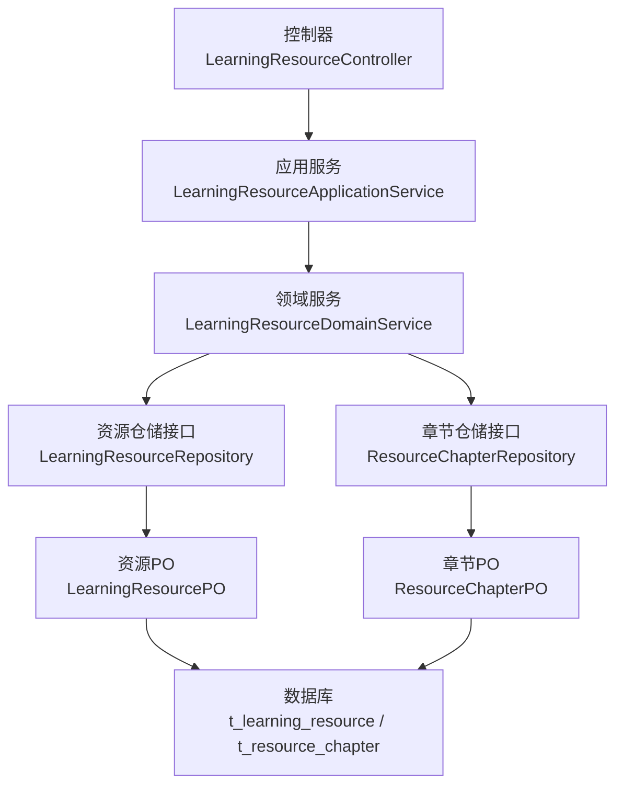
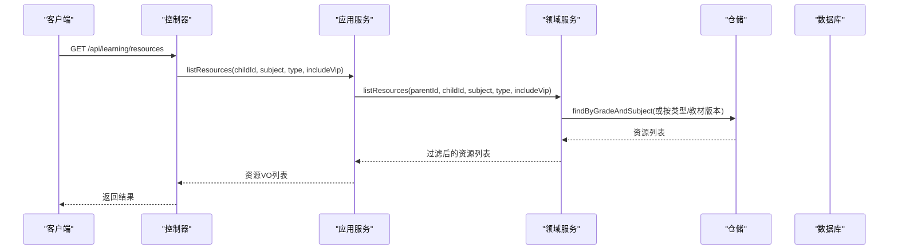
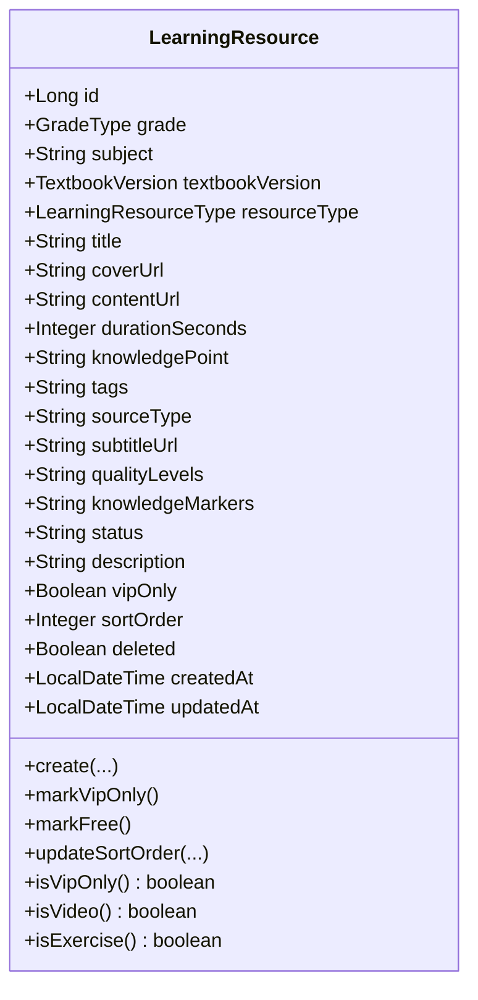
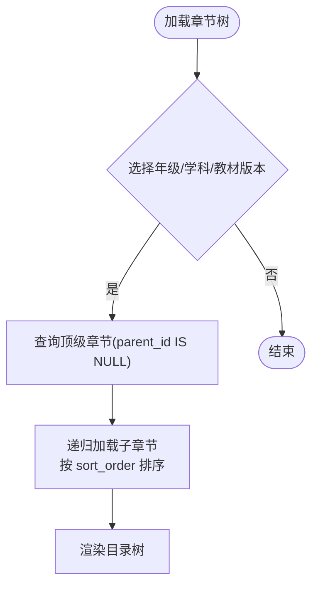
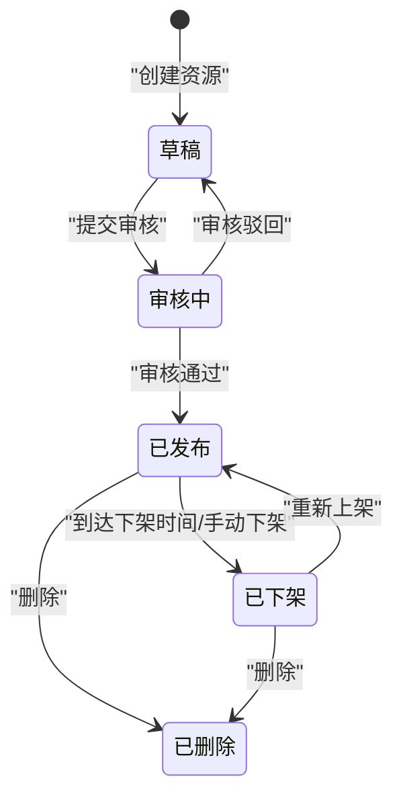
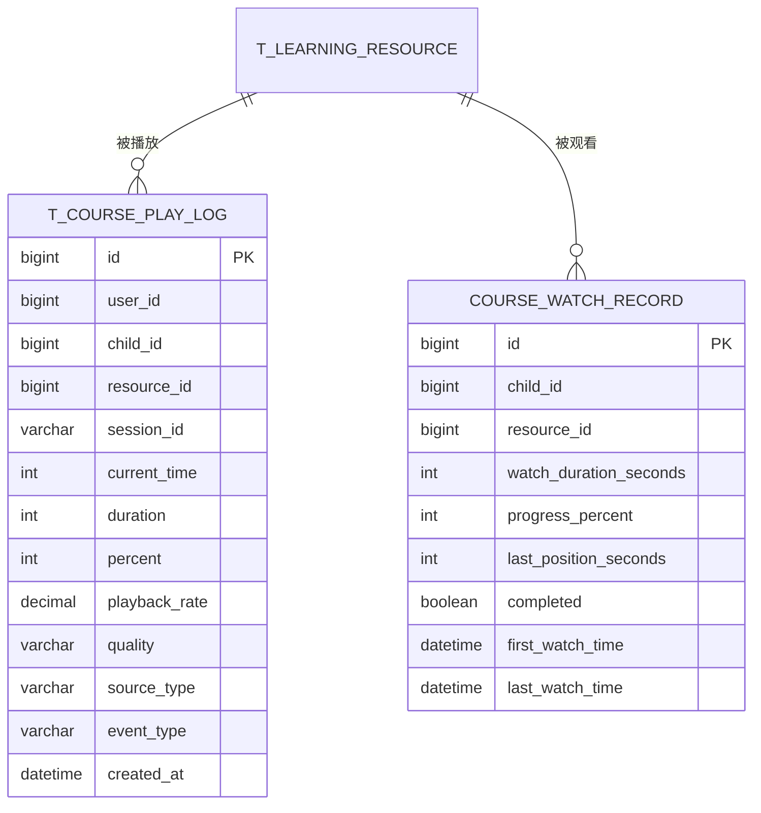
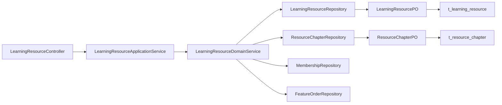

# 学习资源表(t_learning_resource, t_resource_chapter)

<cite>
**本文引用的文件**
- [t_learning_resource.sql](file://wzoto-backend/sql/t_learning_resource.sql)
- [t_resource_chapter.sql](file://wzoto-backend/sql/t_resource_chapter.sql)
- [v2_learning_resource_extend.sql](file://wzoto-backend/sql/v2_learning_resource_extend.sql)
- [LearningResource.java](file://wzoto-backend/wzoto-domain/src/main/java/com/wzoto/domain/entity/LearningResource.java)
- [ResourceChapter.java](file://wzoto-backend/wzoto-domain/src/main/java/com/wzoto/domain/entity/ResourceChapter.java)
- [LearningResourceType.java](file://wzoto-backend/wzoto-domain/src/main/java/com/wzoto/domain/valobj/LearningResourceType.java)
- [LearningResourceApplicationService.java](file://wzoto-backend/wzoto-application/src/main/java/com/wzoto/application/service/LearningResourceApplicationService.java)
- [LearningResourceController.java](file://wzoto-backend/wzoto-interfaces/src/main/java/com/wzoto/interfaces/controller/LearningResourceController.java)
- [LearningResourceDomainService.java](file://wzoto-backend/wzoto-domain/src/main/java/com/wzoto/domain/service/LearningResourceDomainService.java)
- [LearningResourceRepository.java](file://wzoto-backend/wzoto-domain/src/main/java/com/wzoto/domain/repository/LearningResourceRepository.java)
- [ResourceChapterRepository.java](file://wzoto-backend/wzoto-domain/src/main/java/com/wzoto/domain/repository/ResourceChapterRepository.java)
- [LearningResourcePO.java](file://wzoto-backend/wzoto-infrastructure/src/main/java/com/wzoto/infrastructure/pojo/LearningResourcePO.java)
- [ResourceChapterPO.java](file://wzoto-backend/wzoto-infrastructure/src/main/java/com/wzoto/infrastructure/pojo/ResourceChapterPO.java)
</cite>

## 目录
1. [简介](#简介)
2. [项目结构](#项目结构)
3. [核心组件](#核心组件)
4. [架构总览](#架构总览)
5. [详细组件分析](#详细组件分析)
6. [依赖关系分析](#依赖关系分析)
7. [性能考虑](#性能考虑)
8. [故障排查指南](#故障排查指南)
9. [结论](#结论)
10. [附录](#附录)

## 简介
本文件围绕学习资源体系的核心数据模型与业务流转，系统化说明以下主题：
- 学习资源表 t_learning_resource 的设计要点：资源类型分类、元数据管理、访问权限控制（VIP）、状态字段与时间窗口。
- 章节表 t_resource_chapter 的结构：父子层级、排序机制、按年级/学科/教材版本组织内容树。
- 资源版本管理与更新历史：当前代码库未提供显式版本表或回滚机制，给出可落地的演进建议。
- 资源状态流转：基于现有字段的状态含义与扩展建议（草稿/审核中/已发布/已下架）。
- 多媒体资源处理：视频来源类型、字幕、画质等级等元数据；结合存储策略、CDN与缓存的落地方案建议。
- 检索优化索引：基于标题、标签、学科、知识点等多维度的索引设计与查询建议。
- 使用统计与学习进度跟踪：播放明细日志表与观看记录的数据模型与聚合方式。

## 项目结构
围绕学习资源的分层结构如下：
- 接口层：控制器暴露资源列表、详情、解锁等能力。
- 应用层：编排领域服务调用，完成参数校验与上下文组装。
- 领域层：实体、值对象、仓储接口与领域服务，承载核心规则（如VIP过滤、解锁订单创建）。
- 基础设施层：PO映射与持久化实现（MyBatis-Plus注解），SQL脚本定义表结构与索引。

图表来源
- [LearningResourceController.java:27-51](file://wzoto-backend/wzoto-interfaces/src/main/java/com/wzoto/interfaces/controller/LearningResourceController.java#L27-L51)
- [LearningResourceApplicationService.java:24-38](file://wzoto-backend/wzoto-application/src/main/java/com/wzoto/application/service/LearningResourceApplicationService.java#L24-L38)
- [LearningResourceDomainService.java:37-86](file://wzoto-backend/wzoto-domain/src/main/java/com/wzoto/domain/service/LearningResourceDomainService.java#L37-L86)
- [LearningResourceRepository.java:13-28](file://wzoto-backend/wzoto-domain/src/main/java/com/wzoto/domain/repository/LearningResourceRepository.java#L13-L28)
- [ResourceChapterRepository.java:8-13](file://wzoto-backend/wzoto-domain/src/main/java/com/wzoto/domain/repository/ResourceChapterRepository.java#L8-L13)
- [LearningResourcePO.java:12-68](file://wzoto-backend/wzoto-infrastructure/src/main/java/com/wzoto/infrastructure/pojo/LearningResourcePO.java#L12-L68)
- [ResourceChapterPO.java:8-26](file://wzoto-backend/wzoto-infrastructure/src/main/java/com/wzoto/infrastructure/pojo/ResourceChapterPO.java#L8-L26)

章节来源
- [LearningResourceController.java:1-79](file://wzoto-backend/wzoto-interfaces/src/main/java/com/wzoto/interfaces/controller/LearningResourceController.java#L1-L79)
- [LearningResourceApplicationService.java:1-40](file://wzoto-backend/wzoto-application/src/main/java/com/wzoto/application/service/LearningResourceApplicationService.java#L1-L40)
- [LearningResourceDomainService.java:1-113](file://wzoto-backend/wzoto-domain/src/main/java/com/wzoto/domain/service/LearningResourceDomainService.java#L1-L113)
- [LearningResourceRepository.java:1-29](file://wzoto-backend/wzoto-domain/src/main/java/com/wzoto/domain/repository/LearningResourceRepository.java#L1-L29)
- [ResourceChapterRepository.java:1-14](file://wzoto-backend/wzoto-domain/src/main/java/com/wzoto/domain/repository/ResourceChapterRepository.java#L1-L14)
- [LearningResourcePO.java:1-69](file://wzoto-backend/wzoto-infrastructure/src/main/java/com/wzoto/infrastructure/pojo/LearningResourcePO.java#L1-L69)
- [ResourceChapterPO.java:1-27](file://wzoto-backend/wzoto-infrastructure/src/main/java/com/wzoto/infrastructure/pojo/ResourceChapterPO.java#L1-L27)

## 核心组件
- 学习资源实体 LearningResource：封装资源类型、元数据、VIP限制、排序等，并提供基础领域行为（标记VIP、判断是否视频/习题等）。
- 章节实体 ResourceChapter：描述教材章节的层级、排序与归属维度（年级/学科/教材版本）。
- 资源类型 LearningResourceType：枚举化资源类型（视频、练习、PDF、题目），便于统一分类与展示。
- 应用服务与控制器：对外提供资源列表、详情、解锁接口，并记录业务埋点。
- 领域服务：实现资源列表过滤（会员/VIP）、详情获取、付费解锁流程。
- PO与SQL：持久化对象与DDL/扩展脚本，定义表结构、索引与新增字段。

章节来源
- [LearningResource.java:21-152](file://wzoto-backend/wzoto-domain/src/main/java/com/wzoto/domain/entity/LearningResource.java#L21-L152)
- [ResourceChapter.java:19-31](file://wzoto-backend/wzoto-domain/src/main/java/com/wzoto/domain/entity/ResourceChapter.java#L19-L31)
- [LearningResourceType.java:9-32](file://wzoto-backend/wzoto-domain/src/main/java/com/wzoto/domain/valobj/LearningResourceType.java#L9-L32)
- [LearningResourceController.java:27-51](file://wzoto-backend/wzoto-interfaces/src/main/java/com/wzoto/interfaces/controller/LearningResourceController.java#L27-L51)
- [LearningResourceApplicationService.java:24-38](file://wzoto-backend/wzoto-application/src/main/java/com/wzoto/application/service/LearningResourceApplicationService.java#L24-L38)
- [LearningResourceDomainService.java:37-86](file://wzoto-backend/wzoto-domain/src/main/java/com/wzoto/domain/service/LearningResourceDomainService.java#L37-L86)
- [t_learning_resource.sql:4-35](file://wzoto-backend/sql/t_learning_resource.sql#L4-L35)
- [t_resource_chapter.sql:5-20](file://wzoto-backend/sql/t_resource_chapter.sql#L5-L20)
- [v2_learning_resource_extend.sql:30-39](file://wzoto-backend/sql/v2_learning_resource_extend.sql#L30-L39)

## 架构总览
学习资源相关请求从控制器进入，经应用服务到领域服务，最终通过仓储访问数据库。资源列表会依据子女档案的年级、教材版本与会员状态进行过滤；VIP资源需会员或单次解锁。

图表来源
- [LearningResourceController.java:27-35](file://wzoto-backend/wzoto-interfaces/src/main/java/com/wzoto/interfaces/controller/LearningResourceController.java#L27-L35)
- [LearningResourceApplicationService.java:24-29](file://wzoto-backend/wzoto-application/src/main/java/com/wzoto/application/service/LearningResourceApplicationService.java#L24-L29)
- [LearningResourceDomainService.java:37-57](file://wzoto-backend/wzoto-domain/src/main/java/com/wzoto/domain/service/LearningResourceDomainService.java#L37-L57)
- [LearningResourceRepository.java:19-25](file://wzoto-backend/wzoto-domain/src/main/java/com/wzoto/domain/repository/LearningResourceRepository.java#L19-L25)

## 详细组件分析

### 学习资源表 t_learning_resource 设计
- 资源类型分类：通过 resource_type 字段区分视频、练习、PDF、题目；领域层以 LearningResourceType 枚举统一管理。
- 资源元数据管理：
  - 基本元数据：标题、封面、内容URL、时长、知识点、标签、描述。
  - 多媒体元数据：source_type（MP4/BILIBILI/SMARTEDU/UPLOAD/CUSTOM）、subtitle_url、quality_levels（JSON）、knowledge_markers（JSON）。
  - 发布与运营：status、publish_at、unpublish_at、operator_id、vip_only、sort_order。
- 访问权限控制：
  - vip_only 标识是否为仅会员可见资源。
  - 列表查询时，若用户无学习会员且 includeVip 为假，则过滤掉 VIP 资源；否则允许查看。
  - 解锁流程：对 VIP 资源创建一次性解锁订单（FeatureOrder），用于非会员单课购买场景。
- 索引与检索优化：
  - 已有索引：grade+subject、textbook_version、resource_type、vip_only、knowledge_point。
  - 建议增强：对 title、tags、knowledge_point 建立全文或前缀索引；对 status、publish_at/unpublish_at 建立复合索引以支持发布窗口筛选。

图表来源
- [LearningResource.java:21-152](file://wzoto-backend/wzoto-domain/src/main/java/com/wzoto/domain/entity/LearningResource.java#L21-L152)
- [LearningResourceType.java:9-32](file://wzoto-backend/wzoto-domain/src/main/java/com/wzoto/domain/valobj/LearningResourceType.java#L9-L32)
- [t_learning_resource.sql:4-35](file://wzoto-backend/sql/t_learning_resource.sql#L4-L35)
- [v2_learning_resource_extend.sql:30-39](file://wzoto-backend/sql/v2_learning_resource_extend.sql#L30-L39)

章节来源
- [t_learning_resource.sql:4-35](file://wzoto-backend/sql/t_learning_resource.sql#L4-L35)
- [v2_learning_resource_extend.sql:30-39](file://wzoto-backend/sql/v2_learning_resource_extend.sql#L30-L39)
- [LearningResource.java:21-152](file://wzoto-backend/wzoto-domain/src/main/java/com/wzoto/domain/entity/LearningResource.java#L21-L152)
- [LearningResourceType.java:9-32](file://wzoto-backend/wzoto-domain/src/main/java/com/wzoto/domain/valobj/LearningResourceType.java#L9-L32)
- [LearningResourceDomainService.java:37-86](file://wzoto-backend/wzoto-domain/src/main/java/com/wzoto/domain/service/LearningResourceDomainService.java#L37-L86)

### 章节表 t_resource_chapter 设计
- 章节与资源关联：章节作为内容导航树，资源可按年级/学科/教材版本挂载到对应章节下（建议在资源表增加 chapter_id 或通过中间表关联，当前代码未体现直接外键）。
- 章节排序机制：sort_order 控制同级顺序；depth 表示层级（册/单元/课/章）；parent_id 构建父子关系。
- 内容组织方式：按 grade、subject、textbook_version 三维度组织目录树，便于前端渲染课程目录。

图表来源
- [t_resource_chapter.sql:5-20](file://wzoto-backend/sql/t_resource_chapter.sql#L5-L20)
- [ResourceChapterRepository.java:8-13](file://wzoto-backend/wzoto-domain/src/main/java/com/wzoto/domain/repository/ResourceChapterRepository.java#L8-L13)

章节来源
- [t_resource_chapter.sql:5-20](file://wzoto-backend/sql/t_resource_chapter.sql#L5-L20)
- [ResourceChapter.java:19-31](file://wzoto-backend/wzoto-domain/src/main/java/com/wzoto/domain/entity/ResourceChapter.java#L19-L31)
- [ResourceChapterRepository.java:8-13](file://wzoto-backend/wzoto-domain/src/main/java/com/wzoto/domain/repository/ResourceChapterRepository.java#L8-L13)

### 资源版本管理与更新历史
- 现状：当前代码库未提供显式的资源版本表或回滚机制；资源更新通过 update 操作覆盖。
- 建议方案：
  - 引入 t_learning_resource_version 表，记录每次变更的版本号、变更摘要、操作人、时间戳。
  - 在领域服务中，更新资源前先保存旧版本快照，再写入新版本。
  - 提供“回滚”接口：根据版本号恢复资源元数据至指定版本。
  - 审计字段：operator_id、updated_at 可用于追踪最近一次变更。

[本节为概念性建议，不直接分析具体文件]

### 资源状态流转
- 现有字段：status（默认 PUBLISHED），publish_at、unpublish_at 控制上架/下架时间窗口。
- 建议状态集：DRAFT（草稿）、UNDER_REVIEW（审核中）、PUBLISHED（已发布）、UNPUBLISHED（已下架）、DELETED（已删除）。
- 流转规则：
  - 新建资源为 DRAFT，提交审核后变为 UNDER_REVIEW，通过后转为 PUBLISHED。
  - 到达 unpublish_at 自动转为 UNPUBLISHED；可在后台手动切换。
  - 列表查询时，结合 publish_at/unpublish_at 与 status 过滤可见资源。
- 当前实现：列表过滤主要基于会员/VIP 与年级/学科/教材版本；状态过滤可在仓储层扩展条件。

[本节为概念性流程图，不直接映射具体代码文件]

### 多媒体资源处理
- 元数据支撑：
  - source_type：区分 MP4、B站、智慧教育平台、上传、自定义外链。
  - subtitle_url：字幕文件地址（VTT/SRT）。
  - quality_levels：多画质等级配置（JSON）。
  - knowledge_markers：知识点标记（JSON），用于播放器内打点。
- 存储策略建议：
  - 本地/对象存储：视频文件存放于对象存储（如 OSS/S3），生成 CDN 加速域名。
  - 分片与转码：上传后触发转码，生成多清晰度文件，写入 quality_levels。
  - 安全访问：使用临时签名 URL 或鉴权网关保护私有资源。
- 缓存机制建议：
  - 元数据缓存：Redis 缓存资源详情与目录树，设置合理过期策略。
  - 播放列表缓存：热门资源列表缓存，降低数据库压力。
  - 播放日志：心跳事件批量落库，避免高频写盘。

[本节为通用实践建议，不直接分析具体文件]

### 资源检索优化与索引设计
- 现有索引：
  - idx_grade_subject：年级+学科组合查询。
  - idx_textbook_version：教材版本筛选。
  - idx_resource_type：资源类型过滤。
  - idx_vip_only：VIP 资源快速过滤。
  - idx_knowledge_point：知识点维度检索。
- 建议增强：
  - 标题与标签：对 title、tags 建立全文索引或前缀索引，支持模糊搜索。
  - 发布窗口：对 status、publish_at、unpublish_at 建立复合索引，支持“已发布且在有效期内”的快速筛选。
  - 多维度组合：grade+subject+resource_type、grade+subject+textbook_version 等常用查询路径可建立覆盖索引。

章节来源
- [t_learning_resource.sql:30-34](file://wzoto-backend/sql/t_learning_resource.sql#L30-L34)
- [v2_learning_resource_extend.sql:30-39](file://wzoto-backend/sql/v2_learning_resource_extend.sql#L30-L39)

### 使用统计与学习进度跟踪
- 播放明细日志表 t_course_play_log：
  - 字段：user_id、child_id、resource_id、session_id、current_time、duration、percent、playback_rate、quality、source_type、event_type（PLAY/PAUSE/SEEK/HEARTBEAT/FINISH）。
  - 索引：idx_user_resource、idx_child_id、idx_session、idx_created，支持多维聚合与回放分析。
- 观看记录 CourseWatchRecord：
  - 记录首次/最后观看时间、累计观看时长、进度百分比、是否完成等。
  - 领域行为：recordProgress 更新进度与时间戳。
- 报告聚合：
  - 学习报告服务汇总答题与观看数据，输出日/周/月维度报告，包含正确率、观看时长、完成视频数、薄弱知识点等。

图表来源
- [v2_learning_resource_extend.sql:76-96](file://wzoto-backend/sql/v2_learning_resource_extend.sql#L76-L96)
- [CourseWatchRecord.java:54-93](file://wzoto-backend/wzoto-domain/src/main/java/com/wzoto/domain/entity/CourseWatchRecord.java#L54-L93)

章节来源
- [v2_learning_resource_extend.sql:76-96](file://wzoto-backend/sql/v2_learning_resource_extend.sql#L76-L96)
- [CourseWatchRecord.java:54-93](file://wzoto-backend/wzoto-domain/src/main/java/com/wzoto/domain/entity/CourseWatchRecord.java#L54-L93)

## 依赖关系分析
- 控制器依赖应用服务，应用服务依赖领域服务，领域服务依赖多个仓储接口。
- 领域服务依赖会员与订单仓储以实现 VIP 过滤与解锁逻辑。
- 基础设施层通过 PO 与 MyBatis-Plus 注解映射到数据库表。

图表来源
- [LearningResourceController.java:27-51](file://wzoto-backend/wzoto-interfaces/src/main/java/com/wzoto/interfaces/controller/LearningResourceController.java#L27-L51)
- [LearningResourceApplicationService.java:24-38](file://wzoto-backend/wzoto-application/src/main/java/com/wzoto/application/service/LearningResourceApplicationService.java#L24-L38)
- [LearningResourceDomainService.java:37-86](file://wzoto-backend/wzoto-domain/src/main/java/com/wzoto/domain/service/LearningResourceDomainService.java#L37-L86)
- [LearningResourceRepository.java:13-28](file://wzoto-backend/wzoto-domain/src/main/java/com/wzoto/domain/repository/LearningResourceRepository.java#L13-L28)
- [ResourceChapterRepository.java:8-13](file://wzoto-backend/wzoto-domain/src/main/java/com/wzoto/domain/repository/ResourceChapterRepository.java#L8-L13)
- [LearningResourcePO.java:12-68](file://wzoto-backend/wzoto-infrastructure/src/main/java/com/wzoto/infrastructure/pojo/LearningResourcePO.java#L12-L68)
- [ResourceChapterPO.java:8-26](file://wzoto-backend/wzoto-infrastructure/src/main/java/com/wzoto/infrastructure/pojo/ResourceChapterPO.java#L8-L26)

章节来源
- [LearningResourceDomainService.java:37-86](file://wzoto-backend/wzoto-domain/src/main/java/com/wzoto/domain/service/LearningResourceDomainService.java#L37-L86)
- [LearningResourceRepository.java:13-28](file://wzoto-backend/wzoto-domain/src/main/java/com/wzoto/domain/repository/LearningResourceRepository.java#L13-L28)
- [ResourceChapterRepository.java:8-13](file://wzoto-backend/wzoto-domain/src/main/java/com/wzoto/domain/repository/ResourceChapterRepository.java#L8-L13)

## 性能考虑
- 查询优化：
  - 利用现有索引（grade+subject、textbook_version、resource_type、vip_only、knowledge_point）提升常见筛选效率。
  - 对标题、标签、知识点建立全文或前缀索引，减少 LIKE 扫描。
  - 对发布窗口（status、publish_at、unpublish_at）建立复合索引，提高“已发布且在有效期”的过滤性能。
- 缓存策略：
  - 资源详情与目录树采用 Redis 缓存，热点数据设置短 TTL 或主动失效。
  - 播放列表分页缓存，避免重复计算。
- 写入优化：
  - 播放心跳事件批量写入，降低数据库压力。
  - 大字段（JSON）谨慎使用，必要时拆分到独立表或归档。

[本节为通用性能建议，不直接分析具体文件]

## 故障排查指南
- 资源不存在：当查询资源详情时若未找到，将抛出异常；检查 resourceId 是否正确以及是否存在软删除。
- 无权操作子女档案：列表查询时会校验 parent 与 child 关系，确保权限正确。
- VIP 资源不可见：若无学习会员且 includeVip 为假，VIP 资源会被过滤；可通过解锁流程创建订单。
- 播放日志缺失：检查 t_course_play_log 写入是否成功，确认 session_id 与 resource_id 关联正确。

章节来源
- [LearningResourceDomainService.java:62-68](file://wzoto-backend/wzoto-domain/src/main/java/com/wzoto/domain/service/LearningResourceDomainService.java#L62-L68)
- [LearningResourceDomainService.java:37-57](file://wzoto-backend/wzoto-domain/src/main/java/com/wzoto/domain/service/LearningResourceDomainService.java#L37-L57)
- [LearningResourceDomainService.java:73-86](file://wzoto-backend/wzoto-domain/src/main/java/com/wzoto/domain/service/LearningResourceDomainService.java#L73-L86)
- [v2_learning_resource_extend.sql:76-96](file://wzoto-backend/sql/v2_learning_resource_extend.sql#L76-L96)

## 结论
本系统围绕 t_learning_resource 与 t_resource_chapter 构建了清晰的学习资源与章节目录模型，并通过领域服务实现了基于会员与VIP的资源访问控制。当前版本已具备多媒体元数据、发布窗口与播放日志的基础能力。后续可进一步增强版本管理、审核流程、全文检索与缓存策略，以提升系统的可扩展性与性能表现。

[本节为总结性内容，不直接分析具体文件]

## 附录
- 关键接口路径：
  - 资源列表：GET /api/learning/resources
  - 资源详情：GET /api/learning/resource/{id}
  - 资源解锁：POST /api/learning/resource/{id}/unlock
- 关键字段参考：
  - 资源类型：VIDEO/EXERCISE/PDF/QUESTION
  - 视频来源：MP4/BILIBILI/SMARTEDU/UPLOAD/CUSTOM
  - 状态：DRAFT/UNDER_REVIEW/PUBLISHED/UNPUBLISHED/DELETED（建议）
  - 发布窗口：publish_at、unpublish_at

[本节为补充信息，不直接分析具体文件]