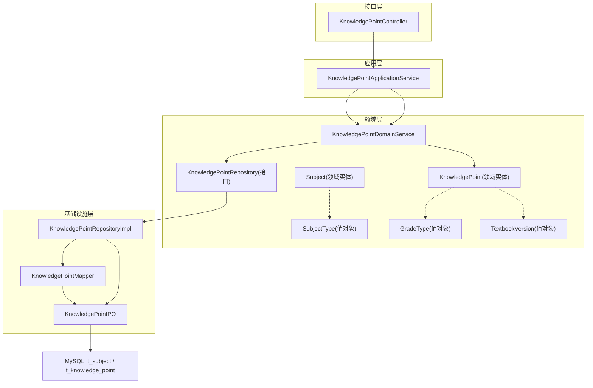
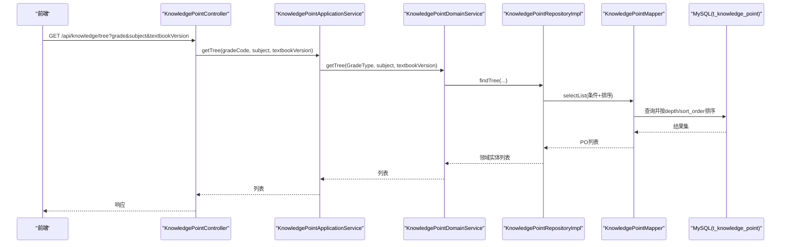
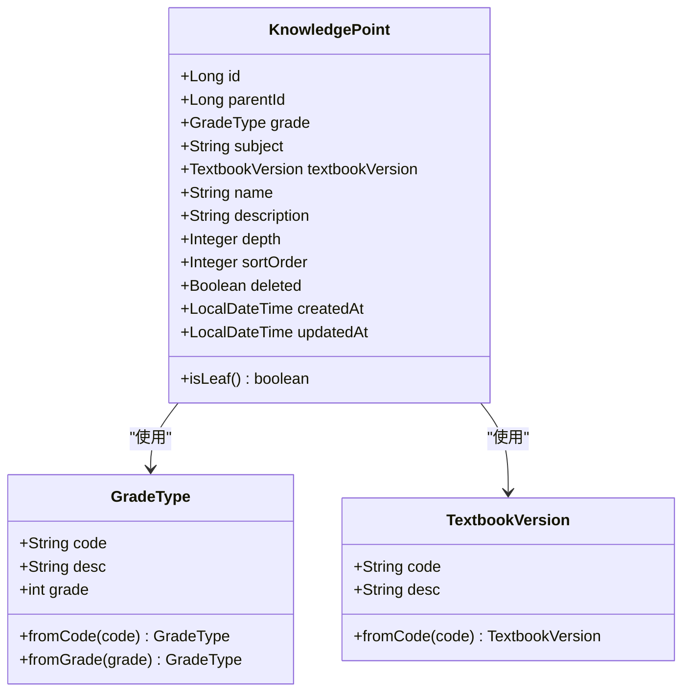
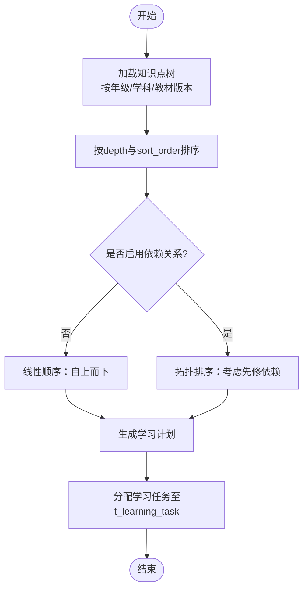
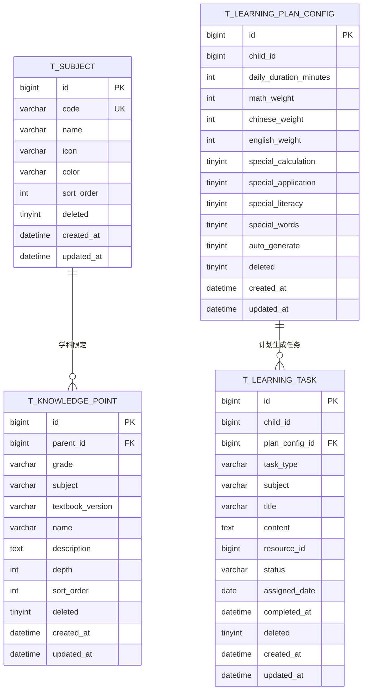
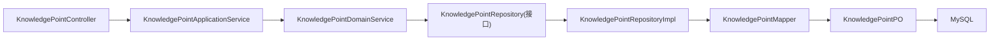

# 学科知识表(t_subject, t_knowledge_point)

<cite>
**本文引用的文件**
- [t_subject.sql](file://wzoto-backend/sql/t_subject.sql)
- [t_knowledge_point.sql](file://wzoto-backend/sql/t_knowledge_point.sql)
- [Subject.java](file://wzoto-backend/wzoto-domain/src/main/java/com/wzoto/domain/entity/Subject.java)
- [KnowledgePoint.java](file://wzoto-backend/wzoto-domain/src/main/java/com/wzoto/domain/entity/KnowledgePoint.java)
- [SubjectType.java](file://wzoto-backend/wzoto-domain/src/main/java/com/wzoto/domain/valobj/SubjectType.java)
- [GradeType.java](file://wzoto-backend/wzoto-domain/src/main/java/com/wzoto/domain/valobj/GradeType.java)
- [TextbookVersion.java](file://wzoto-backend/wzoto-domain/src/main/java/com/wzoto/domain/valobj/TextbookVersion.java)
- [KnowledgePointApplicationService.java](file://wzoto-backend/wzoto-application/src/main/java/com/wzoto/application/service/KnowledgePointApplicationService.java)
- [KnowledgePointDomainService.java](file://wzoto-backend/wzoto-domain/src/main/java/com/wzoto/domain/service/KnowledgePointDomainService.java)
- [KnowledgePointRepository.java](file://wzoto-backend/wzoto-domain/src/main/java/com/wzoto/domain/repository/KnowledgePointRepository.java)
- [KnowledgePointRepositoryImpl.java](file://wzoto-backend/wzoto-infrastructure/src/main/java/com/wzoto/infrastructure/repository/KnowledgePointRepositoryImpl.java)
- [KnowledgePointMapper.java](file://wzoto-backend/wzoto-infrastructure/src/main/java/com/wzoto/infrastructure/mapper/KnowledgePointMapper.java)
- [KnowledgePointPO.java](file://wzoto-backend/wzoto-infrastructure/src/main/java/com/wzoto/infrastructure/pojo/KnowledgePointPO.java)
- [KnowledgePointController.java](file://wzoto-backend/wzoto-interfaces/src/main/java/com/wzoto/interfaces/controller/KnowledgePointController.java)
- [seed_data_subject_knowledge.sql](file://wzoto-backend/sql/seed_data_subject_knowledge.sql)
- [t_learning_plan_config.sql](file://wzoto-backend/sql/t_learning_plan_config.sql)
- [t_learning_task.sql](file://wzoto-backend/sql/t_learning_task.sql)
</cite>

## 目录
1. [简介](#简介)
2. [项目结构](#项目结构)
3. [核心组件](#核心组件)
4. [架构总览](#架构总览)
5. [详细组件分析](#详细组件分析)
6. [依赖关系分析](#依赖关系分析)
7. [性能考虑](#性能考虑)
8. [故障排查指南](#故障排查指南)
9. [结论](#结论)
10. [附录](#附录)

## 简介
本文件围绕学科知识体系的核心数据模型与实现，系统阐述学科表（t_subject）与知识点表（t_knowledge_point）的层级结构设计、学科分类与编码规范、状态管理策略；深入解析知识点树形结构的数据库实现方案（父级与子级关联、深度与排序），并说明学习路径规划所需的数据支撑（依赖关系的存储方式与学习顺序算法基础）。同时提供完整的表关系图、数据流向说明，以及针对知识点标签体系与搜索优化的索引策略建议。

## 项目结构
本项目采用分层架构：接口层（控制器）、应用层（应用服务）、领域层（领域实体、值对象、领域服务、仓储接口）、基础设施层（MyBatis Mapper、PO、仓储实现）。学科与知识点贯穿多层，形成从请求到持久化的完整链路。

图表来源
- [KnowledgePointController.java:1-37](file://wzoto-backend/wzoto-interfaces/src/main/java/com/wzoto/interfaces/controller/KnowledgePointController.java#L1-L37)
- [KnowledgePointApplicationService.java:1-33](file://wzoto-backend/wzoto-application/src/main/java/com/wzoto/application/service/KnowledgePointApplicationService.java#L1-L33)
- [KnowledgePointDomainService.java:1-39](file://wzoto-backend/wzoto-domain/src/main/java/com/wzoto/domain/service/KnowledgePointDomainService.java#L1-L39)
- [KnowledgePointRepository.java:1-14](file://wzoto-backend/wzoto-domain/src/main/java/com/wzoto/domain/repository/KnowledgePointRepository.java#L1-L14)
- [KnowledgePointRepositoryImpl.java:1-74](file://wzoto-backend/wzoto-infrastructure/src/main/java/com/wzoto/infrastructure/repository/KnowledgePointRepositoryImpl.java#L1-L74)
- [KnowledgePointMapper.java:1-10](file://wzoto-backend/wzoto-infrastructure/src/main/java/com/wzoto/infrastructure/mapper/KnowledgePointMapper.java#L1-L10)
- [KnowledgePointPO.java:1-28](file://wzoto-backend/wzoto-infrastructure/src/main/java/com/wzoto/infrastructure/pojo/KnowledgePointPO.java#L1-L28)
- [Subject.java:1-28](file://wzoto-backend/wzoto-domain/src/main/java/com/wzoto/domain/entity/Subject.java#L1-L28)
- [KnowledgePoint.java:1-39](file://wzoto-backend/wzoto-domain/src/main/java/com/wzoto/domain/entity/KnowledgePoint.java#L1-L39)
- [SubjectType.java:1-36](file://wzoto-backend/wzoto-domain/src/main/java/com/wzoto/domain/valobj/SubjectType.java#L1-L36)
- [GradeType.java:1-46](file://wzoto-backend/wzoto-domain/src/main/java/com/wzoto/domain/valobj/GradeType.java#L1-L46)
- [TextbookVersion.java:1-36](file://wzoto-backend/wzoto-domain/src/main/java/com/wzoto/domain/valobj/TextbookVersion.java#L1-L36)

章节来源
- [KnowledgePointController.java:1-37](file://wzoto-backend/wzoto-interfaces/src/main/java/com/wzoto/interfaces/controller/KnowledgePointController.java#L1-L37)
- [KnowledgePointApplicationService.java:1-33](file://wzoto-backend/wzoto-application/src/main/java/com/wzoto/application/service/KnowledgePointApplicationService.java#L1-L33)
- [KnowledgePointDomainService.java:1-39](file://wzoto-backend/wzoto-domain/src/main/java/com/wzoto/domain/service/KnowledgePointDomainService.java#L1-L39)
- [KnowledgePointRepositoryImpl.java:1-74](file://wzoto-backend/wzoto-infrastructure/src/main/java/com/wzoto/infrastructure/repository/KnowledgePointRepositoryImpl.java#L1-L74)

## 核心组件
- 学科表（t_subject）：定义主学科（数学、语文、英语）及其展示属性（名称、图标、主题色、排序），并通过唯一编码约束学科标识。
- 知识点表（t_knowledge_point）：以 parent_id 自关联构建树形结构，按年级、学科、教材版本组织内容；通过 depth 与 sort_order 控制层级与同级顺序。
- 领域实体与值对象：Subject、KnowledgePoint 承载业务语义；SubjectType、GradeType、TextbookVersion 提供枚举化约束与转换能力。
- 应用与领域服务：封装查询树、获取子节点、按年级学科检索等用例；仓储实现基于 MyBatis Plus 完成条件查询与排序。
- 控制器：暴露 REST 接口用于前端获取知识点树、子节点与详情。

章节来源
- [t_subject.sql:1-16](file://wzoto-backend/sql/t_subject.sql#L1-L16)
- [t_knowledge_point.sql:1-23](file://wzoto-backend/sql/t_knowledge_point.sql#L1-L23)
- [Subject.java:1-28](file://wzoto-backend/wzoto-domain/src/main/java/com/wzoto/domain/entity/Subject.java#L1-L28)
- [KnowledgePoint.java:1-39](file://wzoto-backend/wzoto-domain/src/main/java/com/wzoto/domain/entity/KnowledgePoint.java#L1-L39)
- [SubjectType.java:1-36](file://wzoto-backend/wzoto-domain/src/main/java/com/wzoto/domain/valobj/SubjectType.java#L1-L36)
- [GradeType.java:1-46](file://wzoto-backend/wzoto-domain/src/main/java/com/wzoto/domain/valobj/GradeType.java#L1-L46)
- [TextbookVersion.java:1-36](file://wzoto-backend/wzoto-domain/src/main/java/com/wzoto/domain/valobj/TextbookVersion.java#L1-L36)
- [KnowledgePointApplicationService.java:1-33](file://wzoto-backend/wzoto-application/src/main/java/com/wzoto/application/service/KnowledgePointApplicationService.java#L1-L33)
- [KnowledgePointDomainService.java:1-39](file://wzoto-backend/wzoto-domain/src/main/java/com/wzoto/domain/service/KnowledgePointDomainService.java#L1-L39)
- [KnowledgePointRepositoryImpl.java:1-74](file://wzoto-backend/wzoto-infrastructure/src/main/java/com/wzoto/infrastructure/repository/KnowledgePointRepositoryImpl.java#L1-L74)
- [KnowledgePointController.java:1-37](file://wzoto-backend/wzoto-interfaces/src/main/java/com/wzoto/interfaces/controller/KnowledgePointController.java#L1-L37)

## 架构总览
下图展示了从前端请求到数据库返回的完整调用链，以及知识点树的查询流程。

图表来源
- [KnowledgePointController.java:1-37](file://wzoto-backend/wzoto-interfaces/src/main/java/com/wzoto/interfaces/controller/KnowledgePointController.java#L1-L37)
- [KnowledgePointApplicationService.java:1-33](file://wzoto-backend/wzoto-application/src/main/java/com/wzoto/application/service/KnowledgePointApplicationService.java#L1-L33)
- [KnowledgePointDomainService.java:1-39](file://wzoto-backend/wzoto-domain/src/main/java/com/wzoto/domain/service/KnowledgePointDomainService.java#L1-L39)
- [KnowledgePointRepositoryImpl.java:1-74](file://wzoto-backend/wzoto-infrastructure/src/main/java/com/wzoto/infrastructure/repository/KnowledgePointRepositoryImpl.java#L1-L74)
- [KnowledgePointMapper.java:1-10](file://wzoto-backend/wzoto-infrastructure/src/main/java/com/wzoto/infrastructure/mapper/KnowledgePointMapper.java#L1-L10)
- [t_knowledge_point.sql:1-23](file://wzoto-backend/sql/t_knowledge_point.sql#L1-L23)

## 详细组件分析

### 学科表（t_subject）设计
- 字段要点
  - code：学科编码（如 MATH/CHINESE/ENGLISH），具备唯一性约束，作为跨模块统一标识。
  - name/icon/color：面向前端的展示信息，便于渲染学科卡片与导航。
  - sort_order：控制学科在界面中的显示顺序。
  - deleted/created_at/updated_at：软删除与审计字段。
- 学科分类体系与编码规范
  - 主学科划分标准：语数英三大主科，分别对应 CHINESE、MATH、ENGLISH。
  - 编码规范：使用大写英文常量，避免大小写歧义；新增学科需同步更新枚举与种子数据。
  - 状态管理：通过 deleted 位标志进行软删除，查询时默认过滤已删除记录（由框架或查询逻辑保证）。
- 相关实现
  - 领域实体 Subject 映射表结构。
  - 值对象 SubjectType 提供枚举化校验与展示信息（名称、图标、颜色）。
  - 种子数据 seed_data_subject_knowledge.sql 初始化三大学科。

章节来源
- [t_subject.sql:1-16](file://wzoto-backend/sql/t_subject.sql#L1-L16)
- [Subject.java:1-28](file://wzoto-backend/wzoto-domain/src/main/java/com/wzoto/domain/entity/Subject.java#L1-L28)
- [SubjectType.java:1-36](file://wzoto-backend/wzoto-domain/src/main/java/com/wzoto/domain/valobj/SubjectType.java#L1-L36)
- [seed_data_subject_knowledge.sql:7-11](file://wzoto-backend/sql/seed_data_subject_knowledge.sql#L7-L11)

### 知识点表（t_knowledge_point）设计与树形结构
- 字段要点
  - parent_id：自关联父节点ID，NULL 表示顶级章节（如“一年级上册”）。
  - grade/subject/textbook_version：三维维度限定知识点范围（年级、学科、教材版本）。
  - name/description：知识点标题与描述。
  - depth：层级深度（1=册，2=单元/章，3=节，4=小节，5=知识点），用于判断是否为叶子节点。
  - sort_order：同级排序号，确保稳定的展示顺序。
  - deleted/created_at/updated_at：软删除与审计字段。
- 树形结构的数据库实现方案
  - 自关联 parent_id 构成父子关系，支持任意深度的树形结构。
  - 通过 grade/subject/textbook_version 组合筛选出特定范围的树。
  - 查询时按 depth 升序、sort_order 升序排列，便于前端组装为树形结构。
- 相关实现
  - 领域实体 KnowledgePoint 提供 isLeaf() 方法，依据 depth >= 5 判定叶子节点。
  - 仓储实现 KnowledgePointRepositoryImpl 提供 findTree/getChildren/findById 等方法，使用 LambdaQueryWrapper 构造条件与排序。
  - 控制器暴露 /tree、/children/{parentId}、/{id} 三个接口。

图表来源
- [KnowledgePoint.java:1-39](file://wzoto-backend/wzoto-domain/src/main/java/com/wzoto/domain/entity/KnowledgePoint.java#L1-L39)
- [GradeType.java:1-46](file://wzoto-backend/wzoto-domain/src/main/java/com/wzoto/domain/valobj/GradeType.java#L1-L46)
- [TextbookVersion.java:1-36](file://wzoto-backend/wzoto-domain/src/main/java/com/wzoto/domain/valobj/TextbookVersion.java#L1-L36)

章节来源
- [t_knowledge_point.sql:1-23](file://wzoto-backend/sql/t_knowledge_point.sql#L1-L23)
- [KnowledgePoint.java:1-39](file://wzoto-backend/wzoto-domain/src/main/java/com/wzoto/domain/entity/KnowledgePoint.java#L1-L39)
- [KnowledgePointRepositoryImpl.java:1-74](file://wzoto-backend/wzoto-infrastructure/src/main/java/com/wzoto/infrastructure/repository/KnowledgePointRepositoryImpl.java#L1-L74)
- [KnowledgePointController.java:1-37](file://wzoto-backend/wzoto-interfaces/src/main/java/com/wzoto/interfaces/controller/KnowledgePointController.java#L1-L37)

### 知识点属性设计与业务含义
- 难度等级：当前表未直接包含难度字段，可在后续扩展 difficulty 字段或在资源/任务层体现难度。
- 学习目标：可通过 description 字段承载简要目标描述；更细粒度的目标可结合资源或任务表进行表达。
- 前置知识要求：当前未显式存储依赖关系；可通过后续依赖表或图谱服务维护先修关系，支撑学习路径规划。
- 层级与顺序：depth 与 sort_order 共同决定知识点在树中的位置与展示顺序，是学习路径的基础。

章节来源
- [t_knowledge_point.sql:1-23](file://wzoto-backend/sql/t_knowledge_point.sql#L1-L23)
- [KnowledgePoint.java:1-39](file://wzoto-backend/wzoto-domain/src/main/java/com/wzoto/domain/entity/KnowledgePoint.java#L1-L39)

### 学习路径规划的数据支持与算法基础
- 依赖关系的存储方式
  - 当前知识点表未包含显式的依赖字段；建议在后续引入依赖关系表（如 t_knowledge_dependency），记录 source_kp_id -> target_kp_id 的先修关系，或通过图谱服务维护依赖图。
  - 利用现有 tree 结构（parent_id、depth、sort_order）可近似表达“先学上级再学下级”的顺序。
- 学习顺序的算法基础
  - 基于 depth 升序与 sort_order 升序的查询结果，可实现自上而下的遍历顺序。
  - 若引入依赖关系，可使用拓扑排序生成学习序列，并结合掌握度与薄弱点权重动态调整。
- 与学习计划/任务的衔接
  - 学习计划配置（t_learning_plan_config）提供每日时长与学科权重，指导任务生成策略。
  - 学习任务（t_learning_task）将知识点与具体资源关联，驱动学习执行与进度追踪。

图表来源
- [KnowledgePointRepositoryImpl.java:47-56](file://wzoto-backend/wzoto-infrastructure/src/main/java/com/wzoto/infrastructure/repository/KnowledgePointRepositoryImpl.java#L47-L56)
- [t_learning_plan_config.sql:1-22](file://wzoto-backend/sql/t_learning_plan_config.sql#L1-L22)
- [t_learning_task.sql:1-25](file://wzoto-backend/sql/t_learning_task.sql#L1-L25)

章节来源
- [KnowledgePointRepositoryImpl.java:1-74](file://wzoto-backend/wzoto-infrastructure/src/main/java/com/wzoto/infrastructure/repository/KnowledgePointRepositoryImpl.java#L1-L74)
- [t_learning_plan_config.sql:1-22](file://wzoto-backend/sql/t_learning_plan_config.sql#L1-L22)
- [t_learning_task.sql:1-25](file://wzoto-backend/sql/t_learning_task.sql#L1-L25)

### 表关系图与数据流向

图表来源
- [t_subject.sql:1-16](file://wzoto-backend/sql/t_subject.sql#L1-L16)
- [t_knowledge_point.sql:1-23](file://wzoto-backend/sql/t_knowledge_point.sql#L1-L23)
- [t_learning_plan_config.sql:1-22](file://wzoto-backend/sql/t_learning_plan_config.sql#L1-L22)
- [t_learning_task.sql:1-25](file://wzoto-backend/sql/t_learning_task.sql#L1-L25)

章节来源
- [t_subject.sql:1-16](file://wzoto-backend/sql/t_subject.sql#L1-L16)
- [t_knowledge_point.sql:1-23](file://wzoto-backend/sql/t_knowledge_point.sql#L1-L23)
- [t_learning_plan_config.sql:1-22](file://wzoto-backend/sql/t_learning_plan_config.sql#L1-L22)
- [t_learning_task.sql:1-25](file://wzoto-backend/sql/t_learning_task.sql#L1-L25)

## 依赖关系分析
- 组件耦合
  - 控制器依赖应用服务；应用服务依赖领域服务；领域服务依赖仓储接口；仓储实现依赖 Mapper 与 PO。
  - 领域实体与值对象解耦了业务语义与存储细节。
- 外部依赖
  - MyBatis Plus 提供条件构建与分页能力；MySQL 提供索引优化与事务保障。
- 循环依赖
  - 当前未发现循环依赖；各层职责清晰，单向依赖。

图表来源
- [KnowledgePointController.java:1-37](file://wzoto-backend/wzoto-interfaces/src/main/java/com/wzoto/interfaces/controller/KnowledgePointController.java#L1-L37)
- [KnowledgePointApplicationService.java:1-33](file://wzoto-backend/wzoto-application/src/main/java/com/wzoto/application/service/KnowledgePointApplicationService.java#L1-L33)
- [KnowledgePointDomainService.java:1-39](file://wzoto-backend/wzoto-domain/src/main/java/com/wzoto/domain/service/KnowledgePointDomainService.java#L1-L39)
- [KnowledgePointRepository.java:1-14](file://wzoto-backend/wzoto-domain/src/main/java/com/wzoto/domain/repository/KnowledgePointRepository.java#L1-L14)
- [KnowledgePointRepositoryImpl.java:1-74](file://wzoto-backend/wzoto-infrastructure/src/main/java/com/wzoto/infrastructure/repository/KnowledgePointRepositoryImpl.java#L1-L74)
- [KnowledgePointMapper.java:1-10](file://wzoto-backend/wzoto-infrastructure/src/main/java/com/wzoto/infrastructure/mapper/KnowledgePointMapper.java#L1-L10)
- [KnowledgePointPO.java:1-28](file://wzoto-backend/wzoto-infrastructure/src/main/java/com/wzoto/infrastructure/pojo/KnowledgePointPO.java#L1-L28)

章节来源
- [KnowledgePointRepositoryImpl.java:1-74](file://wzoto-backend/wzoto-infrastructure/src/main/java/com/wzoto/infrastructure/repository/KnowledgePointRepositoryImpl.java#L1-L74)

## 性能考虑
- 查询性能
  - 知识点表已建立复合索引 idx_grade_subject、单列索引 idx_parent_id、idx_textbook_version、idx_depth，满足常见筛选与排序需求。
  - 查询时使用 depth 与 sort_order 排序，避免内存排序开销。
- 扩展建议
  - 如需高频按名称模糊搜索，可增加全文索引或引入搜索引擎（如 Elasticsearch）。
  - 如需复杂依赖查询，建议引入依赖关系表并建立相应索引（source_kp_id、target_kp_id）。
- 缓存策略
  - 对静态树结构（年级/学科/教材版本）可考虑缓存，减少重复查询。

[本节为通用性能建议，不直接分析具体文件]

## 故障排查指南
- 常见问题
  - 知识点不存在：领域服务 getById 会抛出异常，检查传入 ID 是否正确。
  - 树为空：确认年级、学科、教材版本参数是否与数据一致；检查 deleted 标记。
  - 排序异常：核对 sort_order 与 depth 设置是否符合预期。
- 定位步骤
  - 通过控制器接口逐步验证参数传递。
  - 检查仓储实现的查询条件与排序。
  - 查看数据库索引与数据完整性。

章节来源
- [KnowledgePointDomainService.java:28-34](file://wzoto-backend/wzoto-domain/src/main/java/com/wzoto/domain/service/KnowledgePointDomainService.java#L28-L34)
- [KnowledgePointRepositoryImpl.java:23-56](file://wzoto-backend/wzoto-infrastructure/src/main/java/com/wzoto/infrastructure/repository/KnowledgePointRepositoryImpl.java#L23-L56)
- [t_knowledge_point.sql:1-23](file://wzoto-backend/sql/t_knowledge_point.sql#L1-L23)

## 结论
本项目通过 t_subject 与 t_knowledge_point 构建了清晰的学科与知识点层级结构，采用 parent_id 自关联与 depth/sort_order 控制树形结构与顺序，配合枚举化的值对象与分层架构，实现了高内聚、低耦合的知识体系管理。学习路径规划可基于现有树结构与后续依赖关系扩展，结合学习计划与任务表形成闭环。索引策略已覆盖主要查询场景，未来可按需增强搜索与依赖查询能力。

[本节为总结性内容，不直接分析具体文件]

## 附录
- 种子数据示例：seed_data_subject_knowledge.sql 提供了 1-6 年级语数英的知识点树样例，便于快速验证功能。
- 学习计划与任务：t_learning_plan_config 与 t_learning_task 为学习路径落地提供数据支撑。

章节来源
- [seed_data_subject_knowledge.sql:1-227](file://wzoto-backend/sql/seed_data_subject_knowledge.sql#L1-L227)
- [t_learning_plan_config.sql:1-22](file://wzoto-backend/sql/t_learning_plan_config.sql#L1-L22)
- [t_learning_task.sql:1-25](file://wzoto-backend/sql/t_learning_task.sql#L1-L25)