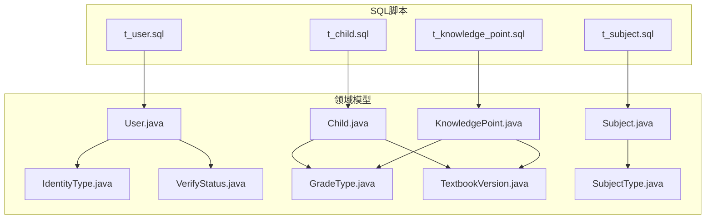
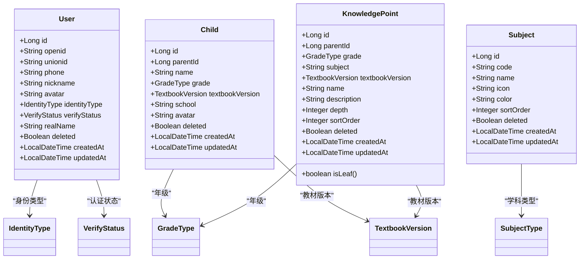
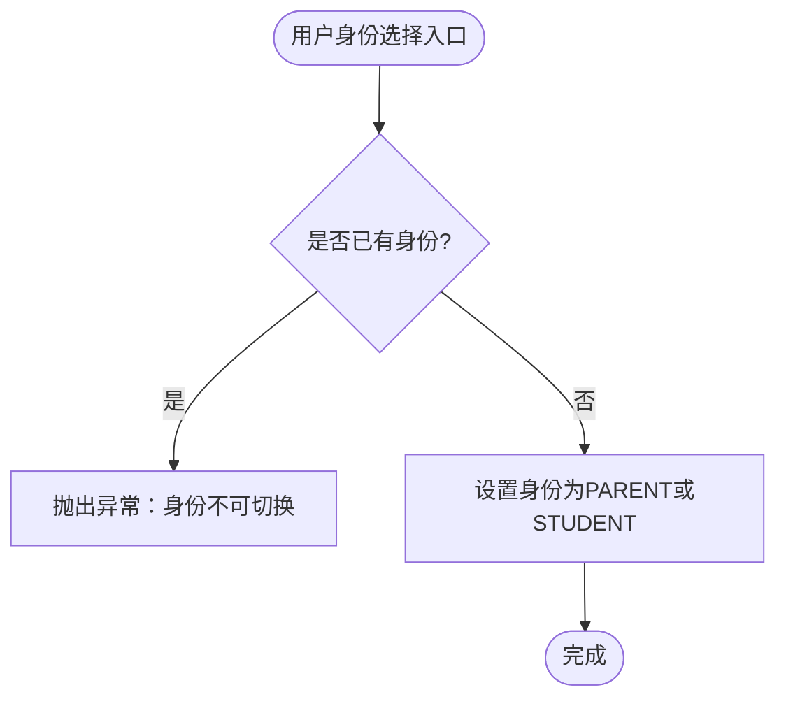
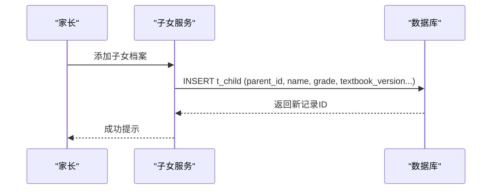
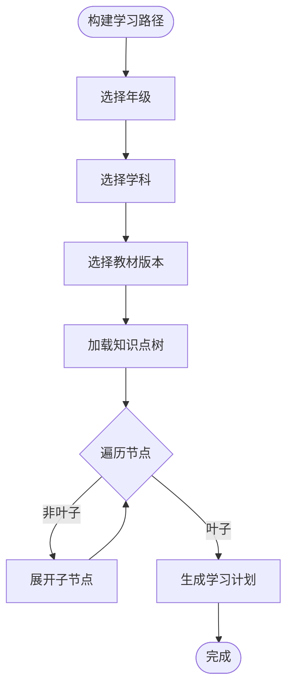
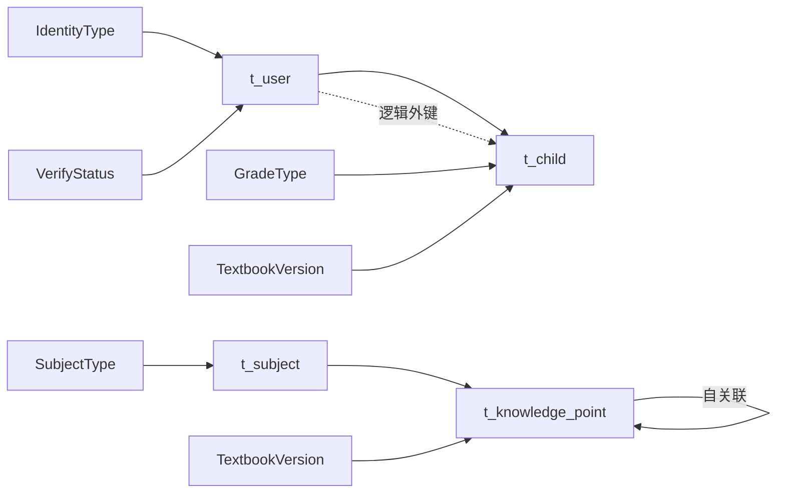

# 核心表结构

<cite>
**本文引用的文件**
- [t_user.sql](file://wzoto-backend/sql/t_user.sql)
- [t_child.sql](file://wzoto-backend/sql/t_child.sql)
- [t_subject.sql](file://wzoto-backend/sql/t_subject.sql)
- [t_knowledge_point.sql](file://wzoto-backend/sql/t_knowledge_point.sql)
- [User.java](file://wzoto-backend/wzoto-domain/src/main/java/com/wzoto/domain/entity/User.java)
- [Child.java](file://wzoto-backend/wzoto-domain/src/main/java/com/wzoto/domain/entity/Child.java)
- [Subject.java](file://wzoto-backend/wzoto-domain/src/main/java/com/wzoto/domain/entity/Subject.java)
- [KnowledgePoint.java](file://wzoto-backend/wzoto-domain/src/main/java/com/wzoto/domain/entity/KnowledgePoint.java)
- [IdentityType.java](file://wzoto-backend/wzoto-domain/src/main/java/com/wzoto/domain/valobj/IdentityType.java)
- [VerifyStatus.java](file://wzoto-backend/wzoto-domain/src/main/java/com/wzoto/domain/valobj/VerifyStatus.java)
- [GradeType.java](file://wzoto-backend/wzoto-domain/src/main/java/com/wzoto/domain/valobj/GradeType.java)
- [TextbookVersion.java](file://wzoto-backend/wzoto-domain/src/main/java/com/wzoto/domain/valobj/TextbookVersion.java)
- [SubjectType.java](file://wzoto-backend/wzoto-domain/src/main/java/com/wzoto/domain/valobj/SubjectType.java)
</cite>

## 目录
1. [简介](#简介)
2. [项目结构](#项目结构)
3. [核心组件](#核心组件)
4. [架构总览](#架构总览)
5. [详细组件分析](#详细组件分析)
6. [依赖关系分析](#依赖关系分析)
7. [性能考虑](#性能考虑)
8. [故障排查指南](#故障排查指南)
9. [结论](#结论)
10. [附录](#附录)

## 简介
本文件聚焦于wzoto系统核心表结构，围绕用户体系、儿童管理与学科知识三大主题，系统化说明以下要点：
- 用户体系表 t_user 的字段定义、数据类型、约束条件与索引策略，覆盖基本信息、认证信息与权限控制。
- 儿童管理表 t_child 的字段结构、与家长用户的关联关系及年级适配逻辑。
- 学科知识表 t_subject 与 t_knowledge_point 的层级结构与知识点分类体系，支撑学习路径规划。
- 各表的主键设计、外键约束、索引策略与数据完整性约束。
- 建表语句解析与字段含义说明，结合领域实体与值对象，给出业务规则验证点。

## 项目结构
与核心表结构直接相关的代码位于后端模块：
- SQL脚本：wzoto-backend/sql 下包含 t_user、t_child、t_subject、t_knowledge_point 等建表语句。
- 领域模型：wzoto-domain 下的实体类与值对象定义了业务语义与约束。
- 基础设施层：wzoto-infrastructure 提供持久化映射（Mapper）与仓库实现，负责将领域模型与数据库表进行映射。

图表来源
- [t_user.sql:1-26](file://wzoto-backend/sql/t_user.sql#L1-L26)
- [t_child.sql:1-18](file://wzoto-backend/sql/t_child.sql#L1-L18)
- [t_subject.sql:1-16](file://wzoto-backend/sql/t_subject.sql#L1-L16)
- [t_knowledge_point.sql:1-23](file://wzoto-backend/sql/t_knowledge_point.sql#L1-L23)
- [User.java:1-93](file://wzoto-backend/wzoto-domain/src/main/java/com/wzoto/domain/entity/User.java#L1-L93)
- [Child.java:1-122](file://wzoto-backend/wzoto-domain/src/main/java/com/wzoto/domain/entity/Child.java#L1-L122)
- [Subject.java:1-28](file://wzoto-backend/wzoto-domain/src/main/java/com/wzoto/domain/entity/Subject.java#L1-L28)
- [KnowledgePoint.java:1-39](file://wzoto-backend/wzoto-domain/src/main/java/com/wzoto/domain/entity/KnowledgePoint.java#L1-L39)
- [IdentityType.java:1-31](file://wzoto-backend/wzoto-domain/src/main/java/com/wzoto/domain/valobj/IdentityType.java#L1-L31)
- [VerifyStatus.java:1-31](file://wzoto-backend/wzoto-domain/src/main/java/com/wzoto/domain/valobj/VerifyStatus.java#L1-L31)
- [GradeType.java:1-46](file://wzoto-backend/wzoto-domain/src/main/java/com/wzoto/domain/valobj/GradeType.java#L1-L46)
- [TextbookVersion.java:1-36](file://wzoto-backend/wzoto-domain/src/main/java/com/wzoto/domain/valobj/TextbookVersion.java#L1-L36)
- [SubjectType.java:1-36](file://wzoto-backend/wzoto-domain/src/main/java/com/wzoto/domain/valobj/SubjectType.java#L1-L36)

章节来源
- [t_user.sql:1-26](file://wzoto-backend/sql/t_user.sql#L1-L26)
- [t_child.sql:1-18](file://wzoto-backend/sql/t_child.sql#L1-L18)
- [t_subject.sql:1-16](file://wzoto-backend/sql/t_subject.sql#L1-L16)
- [t_knowledge_point.sql:1-23](file://wzoto-backend/sql/t_knowledge_point.sql#L1-L23)

## 核心组件
本节对四个核心表及其领域模型进行概览式说明，重点包括主键、字段类型、约束与索引策略，以及与领域实体的对应关系。

- t_user（用户表）
  - 主键：自增BIGINT id
  - 唯一约束：openid（微信唯一标识）
  - 关键字段：unionid、phone、nickname、avatar、identity_type、verify_status、real_name、deleted、created_at、updated_at
  - 索引：idx_phone、idx_identity_type、idx_verify_status
  - 领域映射：User 实体 + IdentityType、VerifyStatus 值对象

- t_child（子女档案表）
  - 主键：自增BIGINT id
  - 关键字段：parent_id、name、grade、textbook_version、school、avatar、deleted、created_at、updated_at
  - 索引：idx_parent_id、idx_grade
  - 领域映射：Child 实体 + GradeType、TextbookVersion 值对象

- t_subject（学科表）
  - 主键：自增BIGINT id
  - 唯一约束：code（学科编码）
  - 关键字段：name、icon、color、sort_order、deleted、created_at、updated_at
  - 领域映射：Subject 实体 + SubjectType 值对象

- t_knowledge_point（知识点表）
  - 主键：自增BIGINT id
  - 树形结构：parent_id 自关联；depth 表示层级深度；sort_order 同级排序
  - 关键字段：grade、subject、textbook_version、name、description、deleted、created_at、updated_at
  - 索引：idx_grade_subject、idx_parent_id、idx_textbook_version、idx_depth
  - 领域映射：KnowledgePoint 实体 + GradeType、TextbookVersion 值对象

章节来源
- [t_user.sql:1-26](file://wzoto-backend/sql/t_user.sql#L1-L26)
- [t_child.sql:1-18](file://wzoto-backend/sql/t_child.sql#L1-L18)
- [t_subject.sql:1-16](file://wzoto-backend/sql/t_subject.sql#L1-L16)
- [t_knowledge_point.sql:1-23](file://wzoto-backend/sql/t_knowledge_point.sql#L1-L23)
- [User.java:1-93](file://wzoto-backend/wzoto-domain/src/main/java/com/wzoto/domain/entity/User.java#L1-L93)
- [Child.java:1-122](file://wzoto-backend/wzoto-domain/src/main/java/com/wzoto/domain/entity/Child.java#L1-L122)
- [Subject.java:1-28](file://wzoto-backend/wzoto-domain/src/main/java/com/wzoto/domain/entity/Subject.java#L1-L28)
- [KnowledgePoint.java:1-39](file://wzoto-backend/wzoto-domain/src/main/java/com/wzoto/domain/entity/KnowledgePoint.java#L1-L39)
- [IdentityType.java:1-31](file://wzoto-backend/wzoto-domain/src/main/java/com/wzoto/domain/valobj/IdentityType.java#L1-L31)
- [VerifyStatus.java:1-31](file://wzoto-backend/wzoto/domain/valobj/VerifyStatus.java#L1-L31)
- [GradeType.java:1-46](file://wzoto-backend/wzoto-domain/src/main/java/com/wzoto/domain/valobj/GradeType.java#L1-L46)
- [TextbookVersion.java:1-36](file://wzoto-backend/wzoto-domain/src/main/java/com/wzoto/domain/valobj/TextbookVersion.java#L1-L36)
- [SubjectType.java:1-36](file://wzoto-backend/wzoto-domain/src/main/java/com/wzoto/domain/valobj/SubjectType.java#L1-L36)

## 架构总览
下图展示核心表与领域模型的映射关系，以及关键值对象的参与方式。

图表来源
- [User.java:1-93](file://wzoto-backend/wzoto-domain/src/main/java/com/wzoto/domain/entity/User.java#L1-L93)
- [Child.java:1-122](file://wzoto-backend/wzoto-domain/src/main/java/com/wzoto/domain/entity/Child.java#L1-L122)
- [Subject.java:1-28](file://wzoto-backend/wzoto-domain/src/main/java/com/wzoto/domain/entity/Subject.java#L1-L28)
- [KnowledgePoint.java:1-39](file://wzoto-backend/wzoto-domain/src/main/java/com/wzoto/domain/entity/KnowledgePoint.java#L1-L39)
- [IdentityType.java:1-31](file://wzoto-backend/wzoto-domain/src/main/java/com/wzoto/domain/valobj/IdentityType.java#L1-L31)
- [VerifyStatus.java:1-31](file://wzoto-backend/wzoto-domain/src/main/java/com/wzoto/domain/valobj/VerifyStatus.java#L1-L31)
- [GradeType.java:1-46](file://wzoto-backend/wzoto-domain/src/main/java/com/wzoto/domain/valobj/GradeType.java#L1-L46)
- [TextbookVersion.java:1-36](file://wzoto-backend/wzoto-domain/src/main/java/com/wzoto/domain/valobj/TextbookVersion.java#L1-L36)
- [SubjectType.java:1-36](file://wzoto-backend/wzoto-domain/src/main/java/com/wzoto/domain/valobj/SubjectType.java#L1-L36)

## 详细组件分析

### 用户体系表 t_user
- 主键与唯一性
  - 主键：id（自增BIGINT）
  - 唯一约束：uk_openid(openid)，确保微信openid全局唯一
- 字段与数据类型
  - openid：VARCHAR(64)，必填，用于微信登录识别
  - unionid：VARCHAR(64)，可选，跨应用唯一标识
  - phone：VARCHAR(20)，可选，手机号
  - nickname：VARCHAR(64)，默认“微信用户”
  - avatar：VARCHAR(512)，头像URL
  - identity_type：VARCHAR(16)，枚举值 PARENT/STUDENT
  - verify_status：VARCHAR(16)，枚举值 NONE/PENDING/APPROVED/REJECTED
  - real_name：VARCHAR(32)，真实姓名（认证后填写）
  - deleted：TINYINT(1)，逻辑删除标志
  - created_at/updated_at：DATETIME，自动维护创建与更新时间
- 索引策略
  - idx_phone(phone)：按手机号查询优化
  - idx_identity_type(identity_type)：按身份筛选
  - idx_verify_status(verify_status)：按认证状态筛选
- 领域行为与业务规则
  - 身份一经选择不可随意切换（selectIdentity方法校验）
  - 绑定手机号（bindPhone）
  - 是否已选择身份（hasIdentity）
  - 是否已通过实名认证（isVerified）

图表来源
- [User.java:63-71](file://wzoto-backend/wzoto-domain/src/main/java/com/wzoto/domain/entity/User.java#L63-L71)
- [IdentityType.java:1-31](file://wzoto-backend/wzoto-domain/src/main/java/com/wzoto/domain/valobj/IdentityType.java#L1-L31)

章节来源
- [t_user.sql:1-26](file://wzoto-backend/sql/t_user.sql#L1-L26)
- [User.java:1-93](file://wzoto-backend/wzoto-domain/src/main/java/com/wzoto/domain/entity/User.java#L1-L93)
- [IdentityType.java:1-31](file://wzoto-backend/wzoto-domain/src/main/java/com/wzoto/domain/valobj/IdentityType.java#L1-L31)
- [VerifyStatus.java:1-31](file://wzoto-backend/wzoto-domain/src/main/java/com/wzoto/domain/valobj/VerifyStatus.java#L1-L31)

### 儿童管理表 t_child
- 主键与关联
  - 主键：id（自增BIGINT）
  - parent_id：家长用户ID（逻辑外键，建议在应用层校验归属）
- 字段与数据类型
  - name：VARCHAR(50)，必填
  - grade：VARCHAR(16)，枚举值 GRADE_1~GRADE_6
  - textbook_version：VARCHAR(32)，默认RENJIAO，支持多版本教材
  - school：VARCHAR(128)，学校名称
  - avatar：VARCHAR(512)，头像URL
  - deleted：TINYINT(1)，逻辑删除
  - created_at/updated_at：时间戳
- 索引策略
  - idx_parent_id(parent_id)：按家长快速检索子女
  - idx_grade(grade)：按年级筛选
- 领域行为与业务规则
  - 创建子女档案（create）
  - 更新基本信息（update）
  - 更新年级（updateGrade）
  - 绑定/切换教材版本（bindTextbook）
  - 校验归属（belongsTo）
  - 逻辑删除（markDeleted）

图表来源
- [t_child.sql:1-18](file://wzoto-backend/sql/t_child.sql#L1-L18)
- [Child.java:54-65](file://wzoto-backend/wzoto-domain/src/main/java/com/wzoto/domain/entity/Child.java#L54-L65)

章节来源
- [t_child.sql:1-18](file://wzoto-backend/sql/t_child.sql#L1-L18)
- [Child.java:1-122](file://wzoto-backend/wzoto-domain/src/main/java/com/wzoto/domain/entity/Child.java#L1-L122)
- [GradeType.java:1-46](file://wzoto-backend/wzoto-domain/src/main/java/com/wzoto/domain/valobj/GradeType.java#L1-L46)
- [TextbookVersion.java:1-36](file://wzoto-backend/wzoto-domain/src/main/java/com/wzoto/domain/valobj/TextbookVersion.java#L1-L36)

### 学科知识表 t_subject 与 t_knowledge_point
- t_subject（学科表）
  - 主键：id（自增BIGINT）
  - 唯一约束：uk_code(code)
  - 字段：name、icon、color、sort_order、deleted、created_at、updated_at
  - 领域映射：Subject 实体 + SubjectType 值对象
- t_knowledge_point（知识点表）
  - 主键：id（自增BIGINT）
  - 树形结构：parent_id 自关联；depth 表示层级深度（1=册 2=单元 3=章 4=节 5=知识点）
  - 关键字段：grade、subject、textbook_version、name、description、sort_order、deleted、created_at、updated_at
  - 索引：idx_grade_subject(grade, subject)、idx_parent_id(parent_id)、idx_textbook_version(textbook_version)、idx_depth(depth)
  - 领域映射：KnowledgePoint 实体 + GradeType、TextbookVersion 值对象；isLeaf()判断叶子节点

图表来源
- [t_knowledge_point.sql:1-23](file://wzoto-backend/sql/t_knowledge_point.sql#L1-L23)
- [KnowledgePoint.java:34-37](file://wzoto-backend/wzoto-domain/src/main/java/com/wzoto/domain/entity/KnowledgePoint.java#L34-L37)
- [GradeType.java:1-46](file://wzoto-backend/wzoto-domain/src/main/java/com/wzoto/domain/valobj/GradeType.java#L1-L46)
- [TextbookVersion.java:1-36](file://wzoto-backend/wzoto-domain/src/main/java/com/wzoto/domain/valobj/TextbookVersion.java#L1-L36)
- [SubjectType.java:1-36](file://wzoto-backend/wzoto-domain/src/main/java/com/wzoto/domain/valobj/SubjectType.java#L1-L36)

章节来源
- [t_subject.sql:1-16](file://wzoto-backend/sql/t_subject.sql#L1-L16)
- [t_knowledge_point.sql:1-23](file://wzoto-backend/sql/t_knowledge_point.sql#L1-L23)
- [Subject.java:1-28](file://wzoto-backend/wzoto-domain/src/main/java/com/wzoto/domain/entity/Subject.java#L1-L28)
- [KnowledgePoint.java:1-39](file://wzoto-backend/wzoto-domain/src/main/java/com/wzoto/domain/entity/KnowledgePoint.java#L1-L39)
- [SubjectType.java:1-36](file://wzoto-backend/wzoto-domain/src/main/java/com/wzoto/domain/valobj/SubjectType.java#L1-L36)

## 依赖关系分析
- 表间依赖
  - t_child.parent_id 逻辑上依赖 t_user.id（应用层校验归属）
  - t_knowledge_point.parent_id 自关联形成树形结构
- 值对象依赖
  - User 依赖 IdentityType、VerifyStatus
  - Child 依赖 GradeType、TextbookVersion
  - KnowledgePoint 依赖 GradeType、TextbookVersion
  - Subject 依赖 SubjectType
- 索引与查询优化
  - t_user：openid唯一索引、phone/identity_type/verify_status索引
  - t_child：parent_id/grade索引
  - t_knowledge_point：grade+subject复合索引、parent_id/textbook_version/depth索引

图表来源
- [t_user.sql:1-26](file://wzoto-backend/sql/t_user.sql#L1-L26)
- [t_child.sql:1-18](file://wzoto-backend/sql/t_child.sql#L1-L18)
- [t_knowledge_point.sql:1-23](file://wzoto-backend/sql/t_knowledge_point.sql#L1-L23)
- [t_subject.sql:1-16](file://wzoto-backend/sql/t_subject.sql#L1-L16)
- [IdentityType.java:1-31](file://wzoto-backend/wzoto-domain/src/main/java/com/wzoto/domain/valobj/IdentityType.java#L1-L31)
- [VerifyStatus.java:1-31](file://wzoto-backend/wzoto-domain/src/main/java/com/wzoto/domain/valobj/VerifyStatus.java#L1-L31)
- [GradeType.java:1-46](file://wzoto-backend/wzoto-domain/src/main/java/com/wzoto/domain/valobj/GradeType.java#L1-L46)
- [TextbookVersion.java:1-36](file://wzoto-backend/wzoto-domain/src/main/java/com/wzoto/domain/valobj/TextbookVersion.java#L1-L36)
- [SubjectType.java:1-36](file://wzoto-backend/wzoto-domain/src/main/java/com/wzoto/domain/valobj/SubjectType.java#L1-L36)

## 性能考虑
- 索引设计
  - 高频查询字段建立索引：user.phone、user.identity_type、user.verify_status；child.parent_id、child.grade；knowledge_point.grade+subject、knowledge_point.parent_id、knowledge_point.textbook_version、knowledge_point.depth
  - 复合索引提升范围查询效率：如 knowledge_point 的 grade+subject
- 树形结构查询
  - 使用 parent_id 自关联与 depth 字段，配合递归查询或多次查询组装树
  - 建议缓存热点学科/年级/版本的知识点树根节点
- 逻辑删除
  - 所有表均使用 deleted 标志位，避免物理删除带来的级联风险
- 存储引擎与字符集
  - InnoDB + utf8mb4_unicode_ci，保证中文兼容与事务一致性

[本节为通用性能建议，不直接分析具体文件]

## 故障排查指南
- 用户身份冲突
  - 现象：重复选择身份报错
  - 原因：User.selectIdentity 校验身份已存在时抛出异常
  - 处理：检查前端是否允许重复提交；在应用层增加幂等保护
  - 参考：[User.java:63-71](file://wzoto-backend/wzoto-domain/src/main/java/com/wzoto/domain/entity/User.java#L63-L71)
- 子女归属校验失败
  - 现象：操作其他家长的子女时报错
  - 原因：Child.belongsTo 校验 parentId 不匹配
  - 处理：确保请求上下文携带正确的家长ID；接口层做鉴权
  - 参考：[Child.java:108-113](file://wzoto-backend/wzoto-domain/src/main/java/com/wzoto/domain/entity/Child.java#L108-L113)
- 知识点树构建异常
  - 现象：无法正确渲染学习路径
  - 原因：parent_id 缺失或 depth 不一致
  - 处理：校验数据完整性；必要时重建索引与缓存
  - 参考：[KnowledgePoint.java:34-37](file://wzoto-backend/wzoto-domain/src/main/java/com/wzoto/domain/entity/KnowledgePoint.java#L34-L37)

章节来源
- [User.java:63-71](file://wzoto-backend/wzoto-domain/src/main/java/com/wzoto/domain/entity/User.java#L63-L71)
- [Child.java:108-113](file://wzoto-backend/wzoto-domain/src/main/java/com/wzoto/domain/entity/Child.java#L108-L113)
- [KnowledgePoint.java:34-37](file://wzoto-backend/wzoto-domain/src/main/java/com/wzoto/domain/entity/KnowledgePoint.java#L34-L37)

## 结论
- t_user 通过唯一openid与多维度索引，支撑微信生态下的用户识别与权限控制。
- t_child 以 parent_id 逻辑关联家长，结合年级与教材版本，满足小学生学习场景的个性化需求。
- t_subject 与 t_knowledge_point 构成学科知识体系的核心骨架，通过树形结构与多维索引，高效支撑学习路径规划。
- 领域模型与值对象严格约束业务规则，保障数据一致性与可维护性。
- 建议在生产环境完善应用层外键校验、幂等设计与缓存策略，进一步提升稳定性与性能。

[本节为总结性内容，不直接分析具体文件]

## 附录
- 建表语句与字段含义速览
  - t_user：用户基本信息、认证状态、身份类型、逻辑删除与时间戳
  - t_child：子女档案、家长关联、年级与教材版本、逻辑删除与时间戳
  - t_subject：学科基础信息、排序与视觉元素、逻辑删除与时间戳
  - t_knowledge_point：知识点树、年级/学科/版本维度、层级深度与排序、逻辑删除与时间戳
- 值对象枚举
  - IdentityType：PARENT/STUDENT
  - VerifyStatus：NONE/PENDING/APPROVED/REJECTED
  - GradeType：GRADE_1~GRADE_6
  - TextbookVersion：RENJIAO/BEISHIDA/JIAOSHE/SUDAJIAO/WAIXIN/SHANGHAJIAO/OTHER
  - SubjectType：MATH/CHINESE/ENGLISH

章节来源
- [t_user.sql:1-26](file://wzoto-backend/sql/t_user.sql#L1-L26)
- [t_child.sql:1-18](file://wzoto-backend/sql/t_child.sql#L1-L18)
- [t_subject.sql:1-16](file://wzoto-backend/sql/t_subject.sql#L1-L16)
- [t_knowledge_point.sql:1-23](file://wzoto-backend/sql/t_knowledge_point.sql#L1-L23)
- [IdentityType.java:1-31](file://wzoto-backend/wzoto-domain/src/main/java/com/wzoto/domain/valobj/IdentityType.java#L1-L31)
- [VerifyStatus.java:1-31](file://wzoto-backend/wzoto-domain/src/main/java/com/wzoto/domain/valobj/VerifyStatus.java#L1-L31)
- [GradeType.java:1-46](file://wzoto-backend/wzoto-domain/src/main/java/com/wzoto/domain/valobj/GradeType.java#L1-L46)
- [TextbookVersion.java:1-36](file://wzoto-backend/wzoto-domain/src/main/java/com/wzoto/domain/valobj/TextbookVersion.java#L1-L36)
- [SubjectType.java:1-36](file://wzoto-backend/wzoto-domain/src/main/java/com/wzoto/domain/valobj/SubjectType.java#L1-L36)