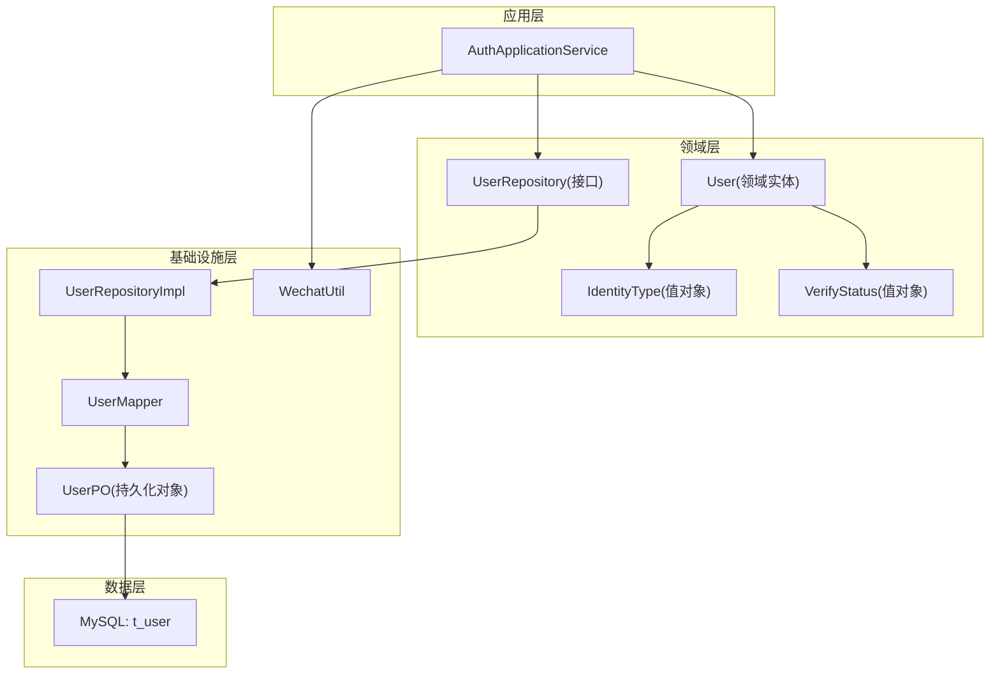
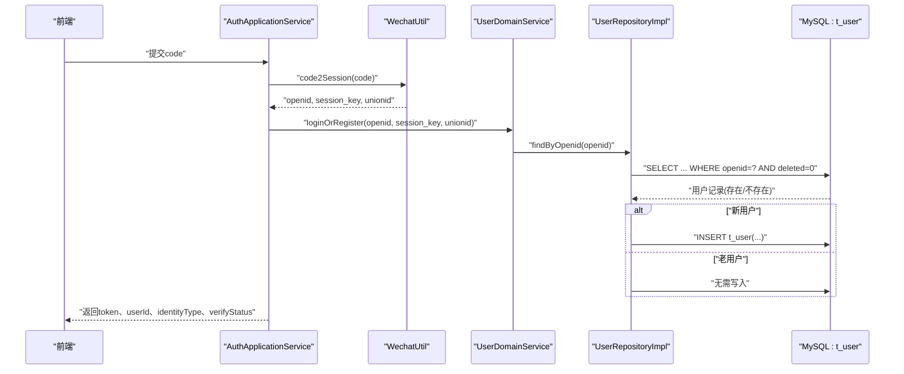
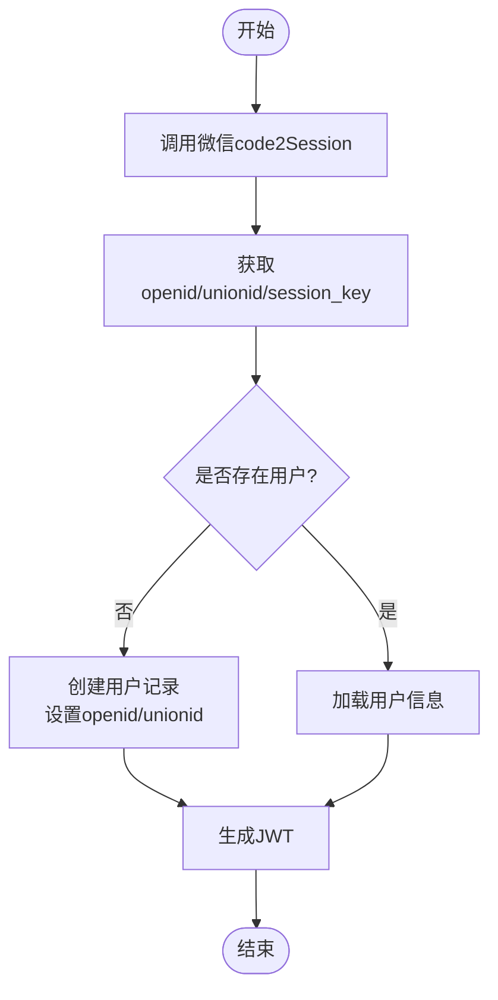
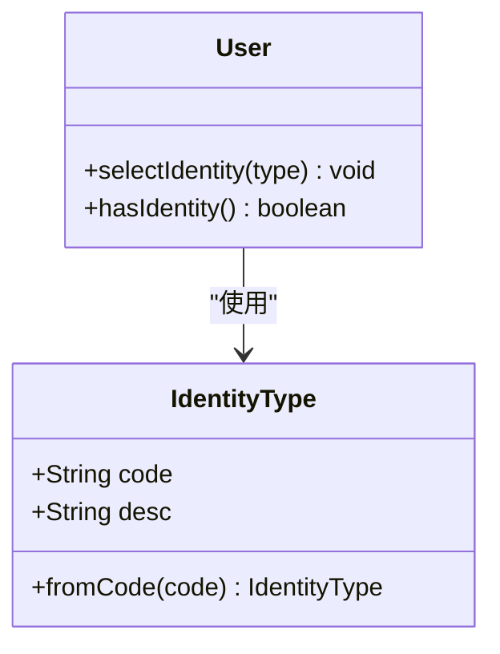
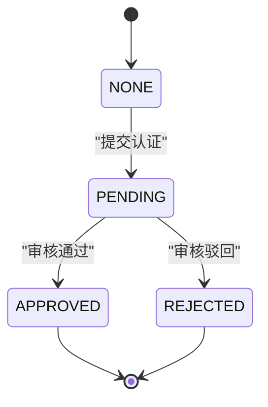
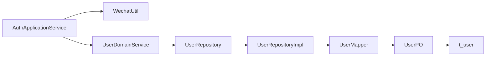

# 用户表(t_user)

<cite>
**本文引用的文件**
- [t_user.sql](file://wzoto-backend/sql/t_user.sql)
- [User.java](file://wzoto-backend/wzoto-domain/src/main/java/com/wzoto/domain/entity/User.java)
- [IdentityType.java](file://wzoto-backend/wzoto-domain/src/main/java/com/wzoto/domain/valobj/IdentityType.java)
- [VerifyStatus.java](file://wzoto-backend/wzoto-domain/src/main/java/com/wzoto/domain/valobj/VerifyStatus.java)
- [UserPO.java](file://wzoto-backend/wzoto-infrastructure/src/main/java/com/wzoto/infrastructure/pojo/UserPO.java)
- [UserMapper.java](file://wzoto-backend/wzoto-infrastructure/src/main/java/com/wzoto/infrastructure/mapper/UserMapper.java)
- [UserRepository.java](file://wzoto-backend/wzoto-domain/src/main/java/com/wzoto/domain/repository/UserRepository.java)
- [UserRepositoryImpl.java](file://wzoto-backend/wzoto-infrastructure/src/main/java/com/wzoto/infrastructure/repository/UserRepositoryImpl.java)
- [AuthApplicationService.java](file://wzoto-backend/wzoto-application/src/main/java/com/wzoto/application/service/AuthApplicationService.java)
- [WechatUtil.java](file://wzoto-backend/wzoto-infrastructure/src/main/java/com/wzoto/infrastructure/util/WechatUtil.java)
</cite>

## 目录
1. [简介](#简介)
2. [项目结构](#项目结构)
3. [核心组件](#核心组件)
4. [架构总览](#架构总览)
5. [详细组件分析](#详细组件分析)
6. [依赖关系分析](#依赖关系分析)
7. [性能考虑](#性能考虑)
8. [故障排查指南](#故障排查指南)
9. [结论](#结论)
10. [附录](#附录)

## 简介
本文件围绕用户表 t_user 的设计与实现，系统性说明其设计理念、字段含义、数据类型选择原因与约束条件；重点阐述微信OAuth集成中 openid 与 unionid 的设计；解释身份类型 identity_type 的枚举值（PARENT/STUDENT）与认证状态 verify_status 的状态流转（NONE/PENDING/APPROVED/REJECTED）；说明软删除 deleted 的实现原理；并给出索引策略 uk_openid、idx_phone、idx_identity_type、idx_verify_status 的查询优化作用。最后提供完整的建表语句解析与业务规则说明。

## 项目结构
t_user 表位于数据库层，领域模型通过 User 实体表达业务语义，基础设施层通过 UserPO 与 MyBatis-Plus 进行持久化映射，应用服务 AuthApplicationService 编排微信登录流程并生成JWT。

图表来源
- [AuthApplicationService.java:26-57](file://wzoto-backend/wzoto-application/src/main/java/com/wzoto/application/service/AuthApplicationService.java#L26-L57)
- [User.java:20-93](file://wzoto-backend/wzoto-domain/src/main/java/com/wzoto/domain/entity/User.java#L20-L93)
- [IdentityType.java:10-30](file://wzoto-backend/wzoto-domain/src/main/java/com/wzoto/domain/valobj/IdentityType.java#L10-L30)
- [VerifyStatus.java:9-31](file://wzoto-backend/wzoto-domain/src/main/java/com/wzoto/domain/valobj/VerifyStatus.java#L9-L31)
- [UserRepository.java:8-39](file://wzoto-backend/wzoto-domain/src/main/java/com/wzoto/domain/repository/UserRepository.java#L8-L39)
- [UserRepositoryImpl.java:27-123](file://wzoto-backend/wzoto-infrastructure/src/main/java/com/wzoto/infrastructure/repository/UserRepositoryImpl.java#L27-L123)
- [UserMapper.java:1-12](file://wzoto-backend/wzoto-infrastructure/src/main/java/com/wzoto/infrastructure/mapper/UserMapper.java#L1-L12)
- [UserPO.java:20-49](file://wzoto-backend/wzoto-infrastructure/src/main/java/com/wzoto/infrastructure/pojo/UserPO.java#L20-L49)
- [WechatUtil.java:21-45](file://wzoto-backend/wzoto-infrastructure/src/main/java/com/wzoto/infrastructure/util/WechatUtil.java#L21-L45)

章节来源
- [t_user.sql:7-26](file://wzoto-backend/sql/t_user.sql#L7-L26)
- [User.java:20-93](file://wzoto-backend/wzoto-domain/src/main/java/com/wzoto/domain/entity/User.java#L20-L93)
- [UserPO.java:20-49](file://wzoto-backend/wzoto-infrastructure/src/main/java/com/wzoto/infrastructure/pojo/UserPO.java#L20-L49)
- [UserRepositoryImpl.java:27-123](file://wzoto-backend/wzoto-infrastructure/src/main/java/com/wzoto/infrastructure/repository/UserRepositoryImpl.java#L27-L123)
- [AuthApplicationService.java:26-57](file://wzoto-backend/wzoto-application/src/main/java/com/wzoto/application/service/AuthApplicationService.java#L26-L57)
- [WechatUtil.java:21-45](file://wzoto-backend/wzoto-infrastructure/src/main/java/com/wzoto/infrastructure/util/WechatUtil.java#L21-L45)

## 核心组件
- 领域实体 User：承载用户业务语义，包含身份选择不可切换、是否已认证等规则。
- 值对象 IdentityType 与 VerifyStatus：以枚举形式限定身份类型与认证状态，避免非法值。
- 持久化对象 UserPO：与 t_user 表一一对应，负责字段映射。
- 仓储 UserRepository/Impl：封装按 openid 查找、保存、更新身份与手机号等操作，并在查询时过滤软删除记录。
- 应用服务 AuthApplicationService：编排微信登录流程，调用 WechatUtil 获取 openid/unionid/session_key，完成登录或注册，并生成JWT。
- 工具 WechatUtil：封装微信小程序 code2Session 调用，返回 openid、session_key、unionid。

章节来源
- [User.java:20-93](file://wzoto-backend/wzoto-domain/src/main/java/com/wzoto/domain/entity/User.java#L20-L93)
- [IdentityType.java:10-30](file://wzoto-backend/wzoto-domain/src/main/java/com/wzoto/domain/valobj/IdentityType.java#L10-L30)
- [VerifyStatus.java:9-31](file://wzoto-backend/wzoto-domain/src/main/java/com/wzoto/domain/valobj/VerifyStatus.java#L9-L31)
- [UserRepository.java:8-39](file://wzoto-backend/wzoto-domain/src/main/java/com/wzoto/domain/repository/UserRepository.java#L8-L39)
- [UserRepositoryImpl.java:27-123](file://wzoto-backend/wzoto-infrastructure/src/main/java/com/wzoto/infrastructure/repository/UserRepositoryImpl.java#L27-L123)
- [AuthApplicationService.java:26-57](file://wzoto-backend/wzoto-application/src/main/java/com/wzoto/application/service/AuthApplicationService.java#L26-L57)
- [WechatUtil.java:21-45](file://wzoto-backend/wzoto-infrastructure/src/main/java/com/wzoto/infrastructure/util/WechatUtil.java#L21-L45)

## 架构总览
下图展示从前端发起微信登录到用户落库、生成JWT的完整链路，体现 t_user 在其中的关键角色。

图表来源
- [AuthApplicationService.java:26-57](file://wzoto-backend/wzoto-application/src/main/java/com/wzoto/application/service/AuthApplicationService.java#L26-L57)
- [WechatUtil.java:21-45](file://wzoto-backend/wzoto-infrastructure/src/main/java/com/wzoto/infrastructure/util/WechatUtil.java#L21-L45)
- [UserRepositoryImpl.java:27-34](file://wzoto-backend/wzoto-infrastructure/src/main/java/com/wzoto/infrastructure/repository/UserRepositoryImpl.java#L27-L34)
- [t_user.sql:7-26](file://wzoto-backend/sql/t_user.sql#L7-L26)

## 详细组件分析

### 表结构与字段设计
- id: BIGINT 自增主键，唯一标识用户。
- openid: VARCHAR(64) NOT NULL，微信用户唯一标识，建立唯一索引 uk_openid，确保同一微信用户在系统中唯一。
- unionid: VARCHAR(64) DEFAULT NULL，用于跨应用/小程序统一用户识别，便于多端账号打通。
- phone: VARCHAR(20) DEFAULT NULL，绑定手机号，支持普通索引 idx_phone 加速按手机号查询。
- nickname: VARCHAR(64) DEFAULT '微信用户'，默认昵称。
- avatar: VARCHAR(512) DEFAULT NULL，头像URL。
- identity_type: VARCHAR(16) DEFAULT NULL，身份类型，取值 PARENT/STUDENT，由领域枚举 IdentityType 约束。
- verify_status: VARCHAR(16) DEFAULT 'NONE'，认证状态，取值 NONE/PENDING/APPROVED/REJECTED，由领域枚举 VerifyStatus 约束。
- real_name: VARCHAR(32) DEFAULT NULL，真实姓名，认证通过后填写。
- deleted: TINYINT(1) DEFAULT 0，软删除标记，0表示未删除，1表示已删除。
- created_at/updated_at: DATETIME，创建与更新时间，自动维护。

章节来源
- [t_user.sql:7-26](file://wzoto-backend/sql/t_user.sql#L7-L26)
- [UserPO.java:20-49](file://wzoto-backend/wzoto-infrastructure/src/main/java/com/wzoto/infrastructure/pojo/UserPO.java#L20-L49)

### 微信OAuth集成：openid 与 unionid
- openid 是单应用的唯一用户标识，系统通过唯一索引 uk_openid 保证每个微信用户仅能注册一次。
- unionid 用于在同一主体下的多个应用/小程序间识别同一用户，便于多端数据打通。
- 登录流程：前端将 code 传给后端，后端调用 WechatUtil.code2Session 获取 openid、session_key、unionid；随后根据 openid 查询或新建用户，并生成JWT返回前端。

图表来源
- [AuthApplicationService.java:26-57](file://wzoto-backend/wzoto-application/src/main/java/com/wzoto/application/service/AuthApplicationService.java#L26-L57)
- [WechatUtil.java:21-45](file://wzoto-backend/wzoto-infrastructure/src/main/java/com/wzoto/infrastructure/util/WechatUtil.java#L21-L45)
- [UserRepositoryImpl.java:27-34](file://wzoto-backend/wzoto-infrastructure/src/main/java/com/wzoto/infrastructure/repository/UserRepositoryImpl.java#L27-L34)

章节来源
- [AuthApplicationService.java:26-57](file://wzoto-backend/wzoto-application/src/main/java/com/wzoto/application/service/AuthApplicationService.java#L26-L57)
- [WechatUtil.java:21-45](file://wzoto-backend/wzoto-infrastructure/src/main/java/com/wzoto/infrastructure/util/WechatUtil.java#L21-L45)
- [UserRepositoryImpl.java:27-34](file://wzoto-backend/wzoto-infrastructure/src/main/java/com/wzoto/infrastructure/repository/UserRepositoryImpl.java#L27-L34)

### 身份类型 identity_type：PARENT/STUDENT
- 使用枚举 IdentityType 定义合法值 PARENT（家长）、STUDENT（大学生），并通过 fromCode 校验输入。
- 领域规则：身份一经选择不可随意切换，User.selectIdentity 在已有身份时抛出异常阻止覆盖。
- 存储为字符串，便于扩展且与数据库字段一致。

图表来源
- [IdentityType.java:10-30](file://wzoto-backend/wzoto-domain/src/main/java/com/wzoto/domain/valobj/IdentityType.java#L10-L30)
- [User.java:63-85](file://wzoto-backend/wzoto-domain/src/main/java/com/wzoto/domain/entity/User.java#L63-L85)

章节来源
- [IdentityType.java:10-30](file://wzoto-backend/wzoto-domain/src/main/java/com/wzoto/domain/valobj/IdentityType.java#L10-L30)
- [User.java:63-85](file://wzoto-backend/wzoto-domain/src/main/java/com/wzoto/domain/entity/User.java#L63-L85)

### 认证状态 verify_status：NONE/PENDING/APPROVED/REJECTED
- 使用枚举 VerifyStatus 定义四种状态：NONE（未审核）、PENDING（审核中）、APPROVED（已通过）、REJECTED（已驳回）。
- 典型流转：
  - NONE → PENDING：用户提交认证申请。
  - PENDING → APPROVED：管理员审核通过。
  - PENDING → REJECTED：管理员审核不通过。
  - APPROVED/REJECTED 为终态，通常不再变更。
- 查询与展示：应用层通过 VerifyStatus.fromCode 转换，UI 层可显示对应描述。

图表来源
- [VerifyStatus.java:9-31](file://wzoto-backend/wzoto-domain/src/main/java/com/wzoto/domain/valobj/VerifyStatus.java#L9-L31)

章节来源
- [VerifyStatus.java:9-31](file://wzoto-backend/wzoto-domain/src/main/java/com/wzoto/domain/valobj/VerifyStatus.java#L9-L31)

### 软删除机制：deleted 字段
- 使用 TINYINT(1) 表示逻辑删除，0 表示未删除，1 表示已删除。
- 查询时默认过滤 deleted=0，避免读取已删除数据。
- 仓储层 findByOpenid/findByNickname 等方法显式添加 deleted=false 条件，确保一致性。
- 优点：保留历史数据、便于审计与恢复；缺点：需在所有查询中注意过滤条件。

章节来源
- [t_user.sql:18-26](file://wzoto-backend/sql/t_user.sql#L18-L26)
- [UserRepositoryImpl.java:27-34](file://wzoto-backend/wzoto-infrastructure/src/main/java/com/wzoto/infrastructure/repository/UserRepositoryImpl.java#L27-L34)
- [UserRepositoryImpl.java:75-83](file://wzoto-backend/wzoto-infrastructure/src/main/java/com/wzoto/infrastructure/repository/UserRepositoryImpl.java#L75-L83)

### 索引策略与查询优化
- uk_openid (UNIQUE): 保证微信用户唯一性，同时加速按 openid 精确查找，登录流程高频使用。
- idx_phone (INDEX): 加速按手机号查询，适用于绑定手机号、找回账号等场景。
- idx_identity_type (INDEX): 加速按身份类型筛选，如“列出所有家长”、“学生列表”。
- idx_verify_status (INDEX): 加速按认证状态筛选，如“待审核列表”、“已通过列表”。

章节来源
- [t_user.sql:21-26](file://wzoto-backend/sql/t_user.sql#L21-L26)

### 建表语句解析与业务规则
- 字符集 utf8mb4，支持表情与多语言。
- 时间字段 created_at/updated_at 默认当前时间，updated_at 自动更新。
- 业务规则：
  - 身份一旦选择不可切换（领域层强制）。
  - 认证状态遵循状态机流转（NONE→PENDING→APPROVED/REJECTED）。
  - 软删除需在所有查询中过滤 deleted=0。
  - 微信用户唯一性由 uk_openid 保障。

章节来源
- [t_user.sql:7-26](file://wzoto-backend/sql/t_user.sql#L7-L26)
- [User.java:63-93](file://wzoto-backend/wzoto-domain/src/main/java/com/wzoto/domain/entity/User.java#L63-L93)
- [VerifyStatus.java:9-31](file://wzoto-backend/wzoto-domain/src/main/java/com/wzoto/domain/valobj/VerifyStatus.java#L9-L31)

## 依赖关系分析
- 应用层 AuthApplicationService 依赖 WechatUtil 与 UserDomainService（领域服务），后者再调用 UserRepository 完成数据访问。
- 领域层 User 依赖 IdentityType 与 VerifyStatus 值对象，保证业务语义与约束。
- 基础设施层 UserRepositoryImpl 依赖 UserMapper 与 UserPO，负责对象转换与SQL执行。
- 数据层 t_user 通过索引支撑高频查询。

图表来源
- [AuthApplicationService.java:26-57](file://wzoto-backend/wzoto-application/src/main/java/com/wzoto/application/service/AuthApplicationService.java#L26-L57)
- [UserRepositoryImpl.java:27-123](file://wzoto-backend/wzoto-infrastructure/src/main/java/com/wzoto/infrastructure/repository/UserRepositoryImpl.java#L27-L123)
- [UserMapper.java:1-12](file://wzoto-backend/wzoto-infrastructure/src/main/java/com/wzoto/infrastructure/mapper/UserMapper.java#L1-L12)
- [UserPO.java:20-49](file://wzoto-backend/wzoto-infrastructure/src/main/java/com/wzoto/infrastructure/pojo/UserPO.java#L20-L49)
- [t_user.sql:7-26](file://wzoto-backend/sql/t_user.sql#L7-L26)

章节来源
- [AuthApplicationService.java:26-57](file://wzoto-backend/wzoto-application/src/main/java/com/wzoto/application/service/AuthApplicationService.java#L26-L57)
- [UserRepositoryImpl.java:27-123](file://wzoto-backend/wzoto-infrastructure/src/main/java/com/wzoto/infrastructure/repository/UserRepositoryImpl.java#L27-L123)

## 性能考虑
- 使用 uk_openid 提升登录时的精确查找性能，并防止重复注册。
- idx_phone、idx_identity_type、idx_verify_status 分别优化手机号查询、身份筛选与认证状态筛选。
- 软删除在查询时增加 deleted=false 条件，建议在常用查询路径上复用该条件，避免遗漏导致脏读。
- 对于高并发登录场景，建议结合缓存（如Redis）缓存用户基本信息，减少数据库压力。
- 对大文本字段（如 avatar URL）保持合理长度，避免过大行影响IO。

[本节为通用性能建议，不直接分析具体文件]

## 故障排查指南
- 微信登录失败：检查 WechatUtil.code2Session 返回的 errcode 与 errmsg，确认 appId、appSecret、js_code 正确。
- 重复注册问题：确认 uk_openid 唯一约束生效；若出现冲突，检查是否有旧数据未处理或并发写入未加锁。
- 身份切换异常：User.selectIdentity 在已有身份时会抛异常，检查业务入口是否正确限制切换。
- 认证状态异常：核对 VerifyStatus 枚举值与数据库存储一致；检查状态流转逻辑是否符合预期。
- 软删除查询不到数据：确认查询条件包含 deleted=false；检查仓储实现是否统一处理。

章节来源
- [WechatUtil.java:21-45](file://wzoto-backend/wzoto-infrastructure/src/main/java/com/wzoto/infrastructure/util/WechatUtil.java#L21-L45)
- [User.java:63-71](file://wzoto-backend/wzoto-domain/src/main/java/com/wzoto/domain/entity/User.java#L63-L71)
- [UserRepositoryImpl.java:27-34](file://wzoto-backend/wzoto-infrastructure/src/main/java/com/wzoto/infrastructure/repository/UserRepositoryImpl.java#L27-L34)

## 结论
t_user 表以 openid 为核心标识，结合 unionid 实现多端用户打通；通过 IdentityType 与 VerifyStatus 值对象严格约束身份与认证状态；采用软删除保障数据安全与可追溯；索引策略覆盖常见查询场景，兼顾性能与一致性。整体设计清晰、可扩展性强，适合教育类平台的多角色用户管理需求。

[本节为总结，不直接分析具体文件]

## 附录
- 完整建表语句参考：[t_user.sql:7-26](file://wzoto-backend/sql/t_user.sql#L7-L26)
- 领域实体与值对象：
  - [User.java:20-93](file://wzoto-backend/wzoto-domain/src/main/java/com/wzoto/domain/entity/User.java#L20-L93)
  - [IdentityType.java:10-30](file://wzoto-backend/wzoto-domain/src/main/java/com/wzoto/domain/valobj/IdentityType.java#L10-L30)
  - [VerifyStatus.java:9-31](file://wzoto-backend/wzoto-domain/src/main/java/com/wzoto/domain/valobj/VerifyStatus.java#L9-L31)
- 仓储与持久化：
  - [UserRepository.java:8-39](file://wzoto-backend/wzoto-domain/src/main/java/com/wzoto/domain/repository/UserRepository.java#L8-L39)
  - [UserRepositoryImpl.java:27-123](file://wzoto-backend/wzoto-infrastructure/src/main/java/com/wzoto/infrastructure/repository/UserRepositoryImpl.java#L27-L123)
  - [UserMapper.java:1-12](file://wzoto-backend/wzoto-infrastructure/src/main/java/com/wzoto/infrastructure/mapper/UserMapper.java#L1-L12)
  - [UserPO.java:20-49](file://wzoto-backend/wzoto-infrastructure/src/main/java/com/wzoto/infrastructure/pojo/UserPO.java#L20-L49)
- 微信登录流程：
  - [AuthApplicationService.java:26-57](file://wzoto-backend/wzoto-application/src/main/java/com/wzoto/application/service/AuthApplicationService.java#L26-L57)
  - [WechatUtil.java:21-45](file://wzoto-backend/wzoto-infrastructure/src/main/java/com/wzoto/infrastructure/util/WechatUtil.java#L21-L45)