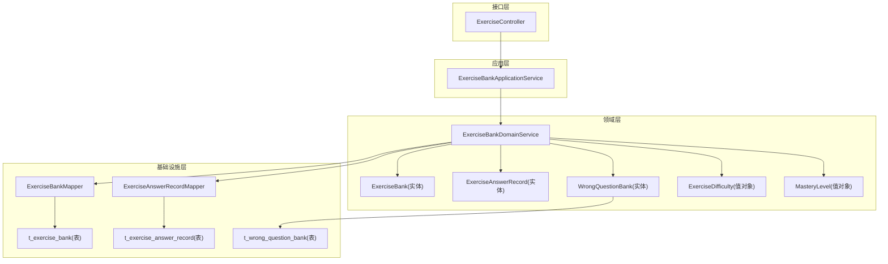
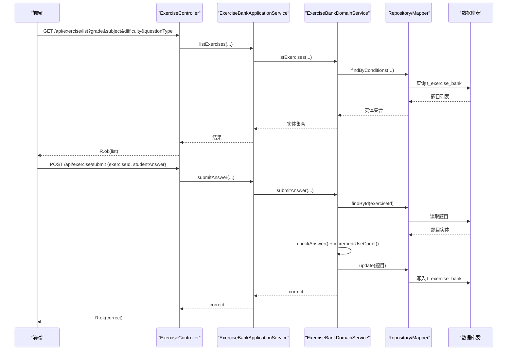
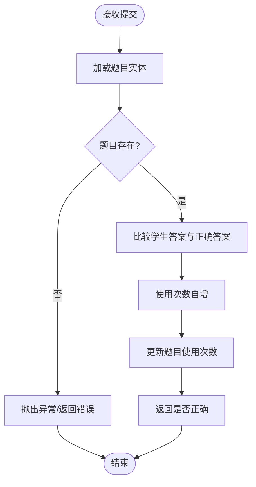
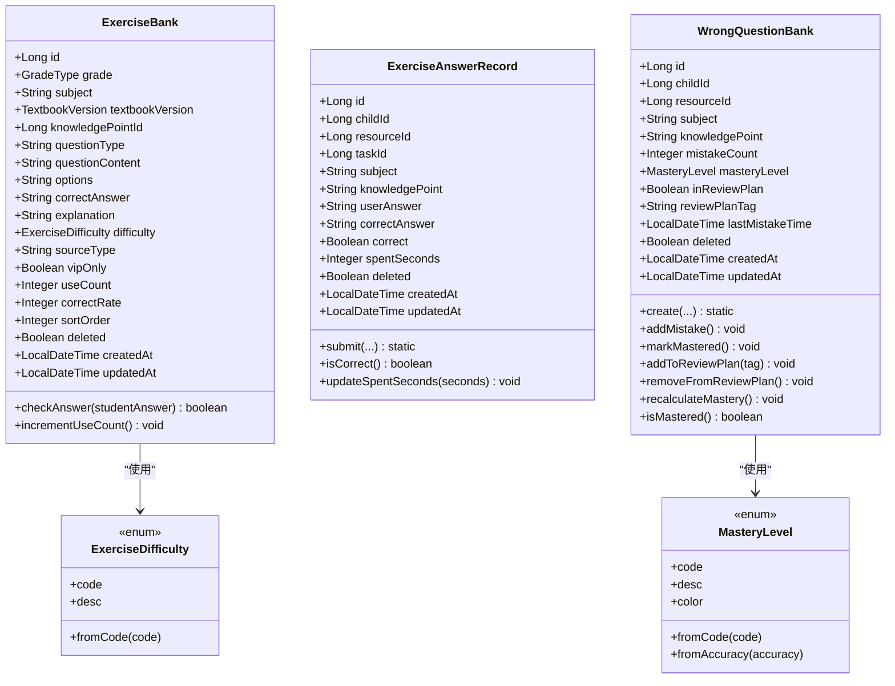
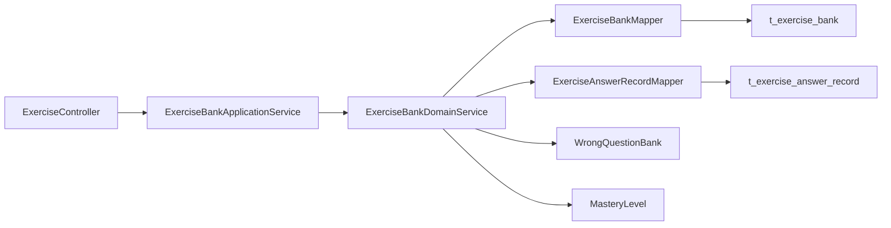
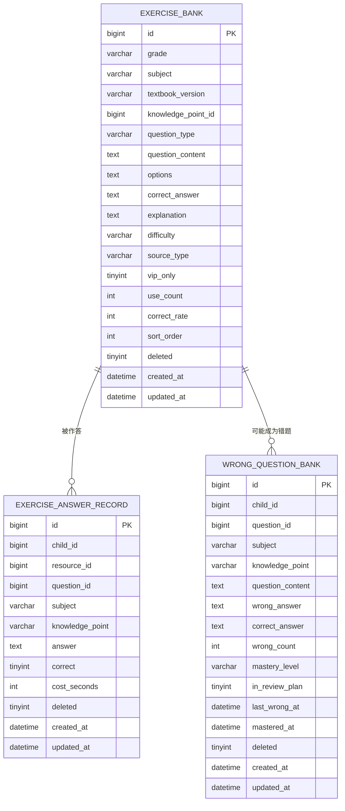

# 练习题库表(t_exercise_bank, t_exercise_answer_record)

<cite>
**本文引用的文件**
- [t_exercise_bank.sql](file://wzoto-backend/sql/t_exercise_bank.sql)
- [t_exercise_answer_record.sql](file://wzoto-backend/sql/t_exercise_answer_record.sql)
- [ExerciseBank.java](file://wzoto-backend/wzoto-domain/src/main/java/com/wzoto/domain/entity/ExerciseBank.java)
- [ExerciseAnswerRecord.java](file://wzoto-backend/wzoto-domain/src/main/java/com/wzoto/domain/entity/ExerciseAnswerRecord.java)
- [WrongQuestionBank.java](file://wzoto-backend/wzoto-domain/src/main/java/com/wzoto/domain/entity/WrongQuestionBank.java)
- [ExerciseDifficulty.java](file://wzoto-backend/wzoto-domain/src/main/java/com/wzoto/domain/valobj/ExerciseDifficulty.java)
- [MasteryLevel.java](file://wzoto-backend/wzoto-domain/src/main/java/com/wzoto/domain/valobj/MasteryLevel.java)
- [ExerciseBankDomainService.java](file://wzoto-backend/wzoto-domain/src/main/java/com/wzoto/domain/service/ExerciseBankDomainService.java)
- [ExerciseBankApplicationService.java](file://wzoto-backend/wzoto-application/src/main/java/com/wzoto/application/service/ExerciseBankApplicationService.java)
- [ExerciseController.java](file://wzoto-backend/wzoto-interfaces/src/main/java/com/wzoto/interfaces/controller/ExerciseController.java)
- [ExerciseBankMapper.java](file://wzoto-backend/wzoto-infrastructure/src/main/java/com/wzoto/infrastructure/mapper/ExerciseBankMapper.java)
- [ExerciseAnswerRecordMapper.java](file://wzoto-backend/wzoto-infrastructure/src/main/java/com/wzoto/infrastructure/mapper/ExerciseAnswerRecordMapper.java)
- [LearningReportDomainService.java](file://wzoto-backend/wzoto-domain/src/main/java/com/wzoto/domain/service/LearningReportDomainService.java)
</cite>

## 目录
1. [简介](#简介)
2. [项目结构](#项目结构)
3. [核心组件](#核心组件)
4. [架构总览](#架构总览)
5. [详细组件分析](#详细组件分析)
6. [依赖关系分析](#依赖关系分析)
7. [性能考虑](#性能考虑)
8. [故障排查指南](#故障排查指南)
9. [结论](#结论)
10. [附录](#附录)

## 简介
本文件围绕练习题库与答题记录两大核心能力，系统化说明以下要点：
- 题库表 t_exercise_bank 的设计：题目类型、难度等级、知识点关联、富文本与图片附件承载方式、答案解析存储。
- 答题记录表 t_exercise_answer_record 的结构：用户答题历史、答案存储格式、正确性判断逻辑、用时统计。
- 错题收集机制：错误标记、重复练习策略、掌握度评估。
- 检索优化索引设计：基于学科、知识点、难度的多维查询支持。
- 数据统计与分析的数据模型：基于答题记录的统计口径与聚合维度。

## 项目结构
围绕“题库—作答—错题—报表”的主线，系统采用分层架构：接口层暴露REST API，应用层编排业务流程，领域层封装实体与业务规则，基础设施层提供数据访问映射。

图表来源
- [ExerciseController.java:1-56](file://wzoto-backend/wzoto-interfaces/src/main/java/com/wzoto/interfaces/controller/ExerciseController.java#L1-L56)
- [ExerciseBankApplicationService.java:1-43](file://wzoto-backend/wzoto-application/src/main/java/com/wzoto/application/service/ExerciseBankApplicationService.java#L1-L43)
- [ExerciseBankDomainService.java:1-87](file://wzoto-backend/wzoto-domain/src/main/java/com/wzoto/domain/service/ExerciseBankDomainService.java#L1-L87)
- [ExerciseBank.java:1-52](file://wzoto-backend/wzoto-domain/src/main/java/com/wzoto/domain/entity/ExerciseBank.java#L1-L52)
- [ExerciseAnswerRecord.java:1-99](file://wzoto-backend/wzoto-domain/src/main/java/com/wzoto/domain/entity/ExerciseAnswerRecord.java#L1-L99)
- [WrongQuestionBank.java:1-133](file://wzoto-backend/wzoto-domain/src/main/java/com/wzoto/domain/entity/WrongQuestionBank.java#L1-L133)
- [ExerciseDifficulty.java:1-32](file://wzoto-backend/wzoto-domain/src/main/java/com/wzoto/domain/valobj/ExerciseDifficulty.java#L1-L32)
- [MasteryLevel.java:1-48](file://wzoto-backend/wzoto-domain/src/main/java/com/wzoto/domain/valobj/MasteryLevel.java#L1-L48)
- [ExerciseBankMapper.java:1-10](file://wzoto-backend/wzoto-infrastructure/src/main/java/com/wzoto/infrastructure/mapper/ExerciseBankMapper.java#L1-L10)
- [ExerciseAnswerRecordMapper.java:1-13](file://wzoto-backend/wzoto-infrastructure/src/main/java/com/wzoto/infrastructure/mapper/ExerciseAnswerRecordMapper.java#L1-L13)
- [t_exercise_bank.sql:1-31](file://wzoto-backend/sql/t_exercise_bank.sql#L1-L31)
- [t_exercise_answer_record.sql:1-23](file://wzoto-backend/sql/t_exercise_answer_record.sql#L1-L23)
- [t_wrong_question_bank.sql:1-28](file://wzoto-backend/sql/t_wrong_question_bank.sql#L1-L28)

章节来源
- [ExerciseController.java:1-56](file://wzoto-backend/wzoto-interfaces/src/main/java/com/wzoto/interfaces/controller/ExerciseController.java#L1-L56)
- [ExerciseBankApplicationService.java:1-43](file://wzoto-backend/wzoto-application/src/main/java/com/wzoto/application/service/ExerciseBankApplicationService.java#L1-L43)
- [ExerciseBankDomainService.java:1-87](file://wzoto-backend/wzoto-domain/src/main/java/com/wzoto/domain/service/ExerciseBankDomainService.java#L1-L87)

## 核心组件
- 题库实体 ExerciseBank：承载题目元数据（年级、学科、教材版本、知识点、题型、内容、选项、正确答案、解析、难度、来源、VIP限制、使用次数、正确率、排序）、并提供答案校验与使用计数自增等域行为。
- 答题记录实体 ExerciseAnswerRecord：记录每次作答的子女ID、资源/任务标识、学科、知识点、用户答案、正确答案、是否正确、耗时、时间戳；提供提交构造、正确性判定、耗时更新等行为。
- 错题库实体 WrongQuestionBank：维护错误次数、掌握度、是否加入复习计划、最近错误时间等，并支持错误累计、掌握度重算、加入/移除复习计划。
- 值对象：
  - ExerciseDifficulty：基础/提高/挑战三级难度。
  - MasteryLevel：未掌握/一般/熟练三级掌握度，支持按正确率换算。
- 领域服务 ExerciseBankDomainService：按条件查题、获取详情、自动批改、组卷与按知识点查询。
- 应用服务与控制器：对外暴露列表、详情、提交答案、试卷查询等API。

章节来源
- [ExerciseBank.java:1-52](file://wzoto-backend/wzoto-domain/src/main/java/com/wzoto/domain/entity/ExerciseBank.java#L1-L52)
- [ExerciseAnswerRecord.java:1-99](file://wzoto-backend/wzoto-domain/src/main/java/com/wzoto/domain/entity/ExerciseAnswerRecord.java#L1-L99)
- [WrongQuestionBank.java:1-133](file://wzoto-backend/wzoto-domain/src/main/java/com/wzoto/domain/entity/WrongQuestionBank.java#L1-L133)
- [ExerciseDifficulty.java:1-32](file://wzoto-backend/wzoto-domain/src/main/java/com/wzoto/domain/valobj/ExerciseDifficulty.java#L1-L32)
- [MasteryLevel.java:1-48](file://wzoto-backend/wzoto/domain/valobj/MasteryLevel.java#L1-L48)
- [ExerciseBankDomainService.java:1-87](file://wzoto-backend/wzoto-domain/src/main/java/com/wzoto/domain/service/ExerciseBankDomainService.java#L1-L87)

## 架构总览
从前端到数据库的关键调用链如下：

图表来源
- [ExerciseController.java:24-42](file://wzoto-backend/wzoto-interfaces/src/main/java/com/wzoto/interfaces/controller/ExerciseController.java#L24-L42)
- [ExerciseBankApplicationService.java:21-32](file://wzoto-backend/wzoto-application/src/main/java/com/wzoto/application/service/ExerciseBankApplicationService.java#L21-L32)
- [ExerciseBankDomainService.java:28-57](file://wzoto-backend/wzoto-domain/src/main/java/com/wzoto/domain/service/ExerciseBankDomainService.java#L28-L57)
- [ExerciseBank.java:41-50](file://wzoto-backend/wzoto-domain/src/main/java/com/wzoto/domain/entity/ExerciseBank.java#L41-L50)
- [t_exercise_bank.sql:4-30](file://wzoto-backend/sql/t_exercise_bank.sql#L4-L30)

## 详细组件分析

### 题库表 t_exercise_bank 设计
- 字段与含义
  - 年级 grade、学科 subject、教材版本 textbook_version：用于精准定位题目范围。
  - 知识点 knowledge_point_id：与知识点体系关联，支撑按知识点检索与学习路径组织。
  - 题型 question_type：选择题、填空题、判断题、简答题等。
  - 题干与选项：question_content 与 options 以 JSON 存储，便于承载富文本与结构化选项。
  - 正确答案 correct_answer 与解析 explanation：支持标准答案比对与讲解展示。
  - 难度 difficulty：EASY/MEDIUM/HARD，对应基础/提高/挑战。
  - 来源 source_type：SYSTEM/AI生成/USER自定义，便于区分题目来源。
  - vip_only：是否仅会员可见。
  - use_count 与 correct_rate：使用次数与正确率，辅助统计与推荐。
  - sort_order：排序号。
  - deleted：软删除。
  - created_at/updated_at：审计时间。
- 索引设计
  - idx_grade_subject：联合查询年级+学科。
  - idx_knowledge_point_id：按知识点检索。
  - idx_question_type：按题型筛选。
  - idx_difficulty：按难度筛选。
  - idx_source_type：按来源筛选。
  - idx_vip_only：会员限制过滤。
- 富文本与图片附件
  - 通过 question_content/options/explanation 的 JSON 字段承载富文本与图片引用（如URL或资源ID），实现灵活的内容表达与扩展。
- 复杂度与性能
  - 单题查询 O(1)（主键）；条件查询利用复合索引降低扫描成本；JSON 字段适合小中型内容，避免大字段导致IO放大。

章节来源
- [t_exercise_bank.sql:4-30](file://wzoto-backend/sql/t_exercise_bank.sql#L4-L30)
- [ExerciseBank.java:20-39](file://wzoto-backend/wzoto-domain/src/main/java/com/wzoto/domain/entity/ExerciseBank.java#L20-L39)
- [ExerciseDifficulty.java:9-16](file://wzoto-backend/wzoto-domain/src/main/java/com/wzoto/domain/valobj/ExerciseDifficulty.java#L9-L16)

### 答题记录表 t_exercise_answer_record 设计
- 字段与含义
  - child_id：子女ID，用于多子账号隔离。
  - resource_id/task_id/question_id：可关联学习资源、任务或具体题目。
  - subject/knowledge_point：学科与知识点，便于按维度统计。
  - answer/correct/cost_seconds：学生答案、是否正确、耗时（秒）。
  - deleted/created_at/updated_at：软删除与审计时间。
- 索引设计
  - idx_child_id：按子女查询。
  - idx_subject：按学科统计。
  - idx_resource_id：按资源维度回溯。
  - idx_created_at：时间范围统计。
  - idx_child_subject：子女+学科组合查询。
- 答案存储与正确性判断
  - 答案以字符串存储，正确性由领域层在提交时计算并落库；也可结合题库正确答案进行二次校验。
- 用时统计
  - cost_seconds 记录单次作答耗时，可用于平均用时、慢题识别等行为分析。

章节来源
- [t_exercise_answer_record.sql:4-22](file://wzoto-backend/sql/t_exercise_answer_record.sql#L4-L22)
- [ExerciseAnswerRecord.java:18-57](file://wzoto-backend/wzoto-domain/src/main/java/com/wzoto/domain/entity/ExerciseAnswerRecord.java#L18-L57)

### 错题收集机制
- 错误标记与重复练习
  - WrongQuestionBank 维护错误次数 mistake_count、最近错误时间 last_mistake_time，支持批量加入复习计划 in_review_plan/review_plan_tag。
- 掌握度评估
  - mastery_level 为 NOT_MASTERED/GENERAL/PROFICIENT，可通过 recalculateMastery() 根据错误次数重算；亦可通过 MasteryLevel.fromAccuracy(accuracy) 按正确率换算。
- 复习策略
  - 将错题加入复习计划后，可结合学习计划与推送策略进行间隔重复训练，直至掌握度提升。

章节来源
- [WrongQuestionBank.java:19-133](file://wzoto-backend/wzoto-domain/src/main/java/com/wzoto/domain/entity/WrongQuestionBank.java#L19-L133)
- [MasteryLevel.java:9-48](file://wzoto-backend/wzoto-domain/src/main/java/com/wzoto/domain/valobj/MasteryLevel.java#L9-L48)
- [t_wrong_question_bank.sql:4-27](file://wzoto-backend/sql/t_wrong_question_bank.sql#L4-L27)

### 题目检索与多维查询
- 查询维度
  - 年级、学科、教材版本、知识点、题型、难度、来源、是否会员限定。
- 索引支撑
  - 年级+学科、知识点、题型、难度、来源、vip_only 等索引保障高并发下的快速过滤。
- 典型场景
  - 按知识点拉取题目用于微课配套练习；按难度梯度生成自适应练习；按题型筛选专项训练。

章节来源
- [ExerciseBankDomainService.java:28-31](file://wzoto-backend/wzoto-domain/src/main/java/com/wzoto/domain/service/ExerciseBankDomainService.java#L28-L31)
- [t_exercise_bank.sql:24-29](file://wzoto-backend/sql/t_exercise_bank.sql#L24-L29)

### 答题过程追踪与行为分析
- 开始/结束时间与用时
  - 通过 cost_seconds 记录单次作答耗时；结合 created_at 可计算起止时间窗口。
- 行为分析
  - 基于 subject/knowledge_point 聚合正确率、平均用时、慢题分布，识别薄弱点。
  - 结合错题记录与掌握度，形成“练—测—评—复”闭环。

章节来源
- [ExerciseAnswerRecord.java:38-48](file://wzoto-backend/wzoto-domain/src/main/java/com/wzoto/domain/entity/ExerciseAnswerRecord.java#L38-L48)
- [LearningReportDomainService.java:62-81](file://wzoto-backend/wzoto-domain/src/main/java/com/wzoto/domain/service/LearningReportDomainService.java#L62-L81)

### 自动批改流程

图表来源
- [ExerciseBankDomainService.java:47-57](file://wzoto-backend/wzoto-domain/src/main/java/com/wzoto/domain/service/ExerciseBankDomainService.java#L47-L57)
- [ExerciseBank.java:41-50](file://wzoto-backend/wzoto-domain/src/main/java/com/wzoto/domain/entity/ExerciseBank.java#L41-L50)

章节来源
- [ExerciseBankDomainService.java:47-57](file://wzoto-backend/wzoto-domain/src/main/java/com/wzoto/domain/service/ExerciseBankDomainService.java#L47-L57)
- [ExerciseBank.java:41-50](file://wzoto-backend/wzoto-domain/src/main/java/com/wzoto/domain/entity/ExerciseBank.java#L41-L50)

### 类图（核心实体与值对象）

图表来源
- [ExerciseBank.java:20-50](file://wzoto-backend/wzoto-domain/src/main/java/com/wzoto/domain/entity/ExerciseBank.java#L20-L50)
- [ExerciseAnswerRecord.java:18-98](file://wzoto-backend/wzoto-domain/src/main/java/com/wzoto/domain/entity/ExerciseAnswerRecord.java#L18-L98)
- [WrongQuestionBank.java:19-133](file://wzoto-backend/wzoto-domain/src/main/java/com/wzoto/domain/entity/WrongQuestionBank.java#L19-L133)
- [ExerciseDifficulty.java:9-31](file://wzoto-backend/wzoto-domain/src/main/java/com/wzoto/domain/valobj/ExerciseDifficulty.java#L9-L31)
- [MasteryLevel.java:9-48](file://wzoto-backend/wzoto-domain/src/main/java/com/wzoto/domain/valobj/MasteryLevel.java#L9-L48)

## 依赖关系分析
- 控制层依赖应用层，应用层依赖领域服务，领域服务依赖仓储/映射器，最终访问数据库表。
- 关键耦合点：
  - 自动批改：领域服务对题目实体的状态变更（use_count）与持久化。
  - 错题管理：错题库与掌握度值对象的协作，驱动复习计划与学习报告。
  - 报表统计：基于答题记录的时间范围与学科维度聚合。

图表来源
- [ExerciseController.java:1-56](file://wzoto-backend/wzoto-interfaces/src/main/java/com/wzoto/interfaces/controller/ExerciseController.java#L1-L56)
- [ExerciseBankApplicationService.java:1-43](file://wzoto-backend/wzoto-application/src/main/java/com/wzoto/application/service/ExerciseBankApplicationService.java#L1-L43)
- [ExerciseBankDomainService.java:1-87](file://wzoto-backend/wzoto-domain/src/main/java/com/wzoto/domain/service/ExerciseBankDomainService.java#L1-L87)
- [ExerciseBankMapper.java:1-10](file://wzoto-backend/wzoto-infrastructure/src/main/java/com/wzoto/infrastructure/mapper/ExerciseBankMapper.java#L1-L10)
- [ExerciseAnswerRecordMapper.java:1-13](file://wzoto-backend/wzoto-infrastructure/src/main/java/com/wzoto/infrastructure/mapper/ExerciseAnswerRecordMapper.java#L1-L13)
- [t_exercise_bank.sql:4-30](file://wzoto-backend/sql/t_exercise_bank.sql#L4-L30)
- [t_exercise_answer_record.sql:4-22](file://wzoto-backend/sql/t_exercise_answer_record.sql#L4-L22)

## 性能考虑
- 索引策略
  - 题库：年级+学科、知识点、题型、难度、来源、vip_only 等多维索引，覆盖常见过滤条件。
  - 答题记录：child_id、subject、resource_id、created_at、child_subject 组合索引，支撑高频查询与统计。
- 读写分离建议
  - 读多写少场景（如题目列表、详情）可引入缓存；写操作（提交答案、更新使用次数）需保证事务一致性。
- 大字段处理
  - 富文本与图片引用存储在 JSON 字段中，注意控制大小与分页加载；必要时拆分资源表。
- 统计查询
  - 报表聚合尽量走物化视图或定时任务，避免在线长事务与大表全扫。

[本节为通用性能建议，不直接分析具体文件]

## 故障排查指南
- 题目不存在
  - 现象：提交答案时报错或返回空。
  - 排查：检查 exerciseId 是否存在于 t_exercise_bank；确认软删除标志。
  - 依据：领域服务在找不到题目时抛出异常。
- 答案判错
  - 现象：提交后正确性与预期不符。
  - 排查：核对 correct_answer 与学生答案的规范化（去空格、大小写）；确认 compare 逻辑。
  - 依据：实体提供答案校验方法。
- 用时为负或为空
  - 现象：统计异常。
  - 排查：确保前端传递非负耗时；领域层对耗时更新有参数校验。
- 错题未进入复习计划
  - 现象：复习列表无错题。
  - 排查：检查 in_review_plan 与 review_plan_tag 设置；确认批量添加事务是否成功。

章节来源
- [ExerciseBankDomainService.java:47-57](file://wzoto-backend/wzoto-domain/src/main/java/com/wzoto/domain/service/ExerciseBankDomainService.java#L47-L57)
- [ExerciseBank.java:41-50](file://wzoto-backend/wzoto-domain/src/main/java/com/wzoto/domain/entity/ExerciseBank.java#L41-L50)
- [ExerciseAnswerRecord.java:89-98](file://wzoto-backend/wzoto-domain/src/main/java/com/wzoto/domain/entity/ExerciseAnswerRecord.java#L89-L98)
- [WrongQuestionBank.java:96-110](file://wzoto-backend/wzoto-domain/src/main/java/com/wzoto/domain/entity/WrongQuestionBank.java#L96-L110)

## 结论
- 题库表与答题记录表共同构成“练—测—评—复”的核心数据底座。
- 通过多维索引与值对象约束，实现了高效检索与严谨的业务规则。
- 错题机制与掌握度评估为个性化学习提供数据支撑。
- 建议在后续迭代中完善富文本资源表、引入缓存与离线统计，进一步提升性能与可扩展性。

[本节为总结性内容，不直接分析具体文件]

## 附录

### 数据模型与ER关系（概念示意）

图表来源
- [t_exercise_bank.sql:4-30](file://wzoto-backend/sql/t_exercise_bank.sql#L4-L30)
- [t_exercise_answer_record.sql:4-22](file://wzoto-backend/sql/t_exercise_answer_record.sql#L4-L22)
- [t_wrong_question_bank.sql:4-27](file://wzoto-backend/sql/t_wrong_question_bank.sql#L4-L27)

### API 概览（与本题库相关）
- GET /api/exercise/list：按年级、学科、难度、题型筛选题目列表。
- GET /api/exercise/{id}：获取题目详情。
- POST /api/exercise/submit：提交答案并自动批改。
- GET /api/exercise/paper/{id}：获取试卷详情。
- GET /api/exercise/paper/list：按年级、学科、试卷类型获取试卷列表。

章节来源
- [ExerciseController.java:24-54](file://wzoto-backend/wzoto-interfaces/src/main/java/com/wzoto/interfaces/controller/ExerciseController.java#L24-L54)