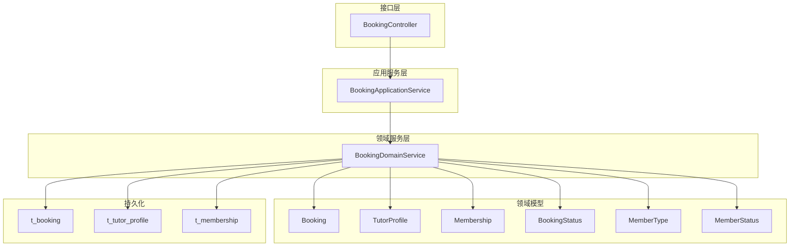
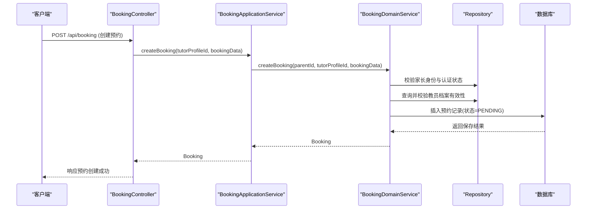
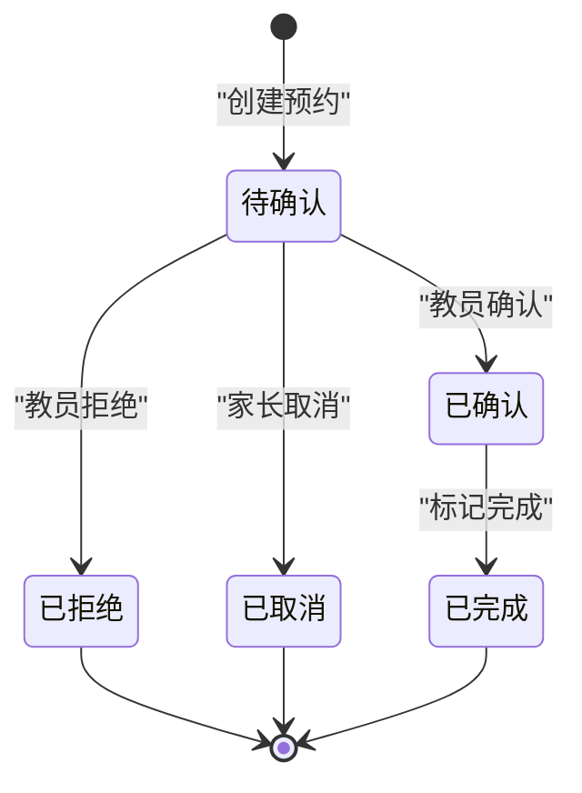
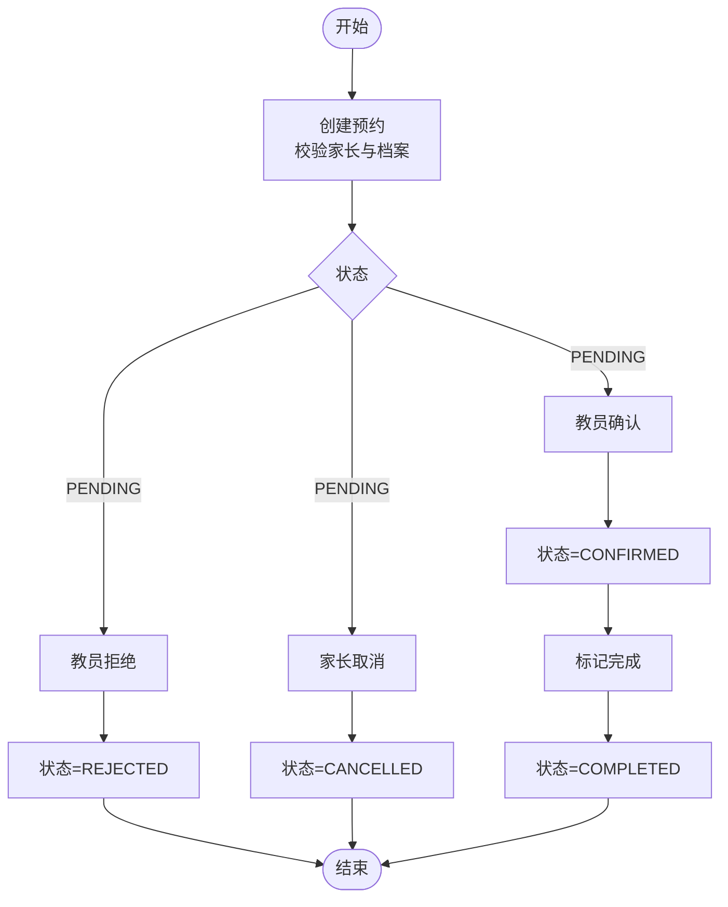
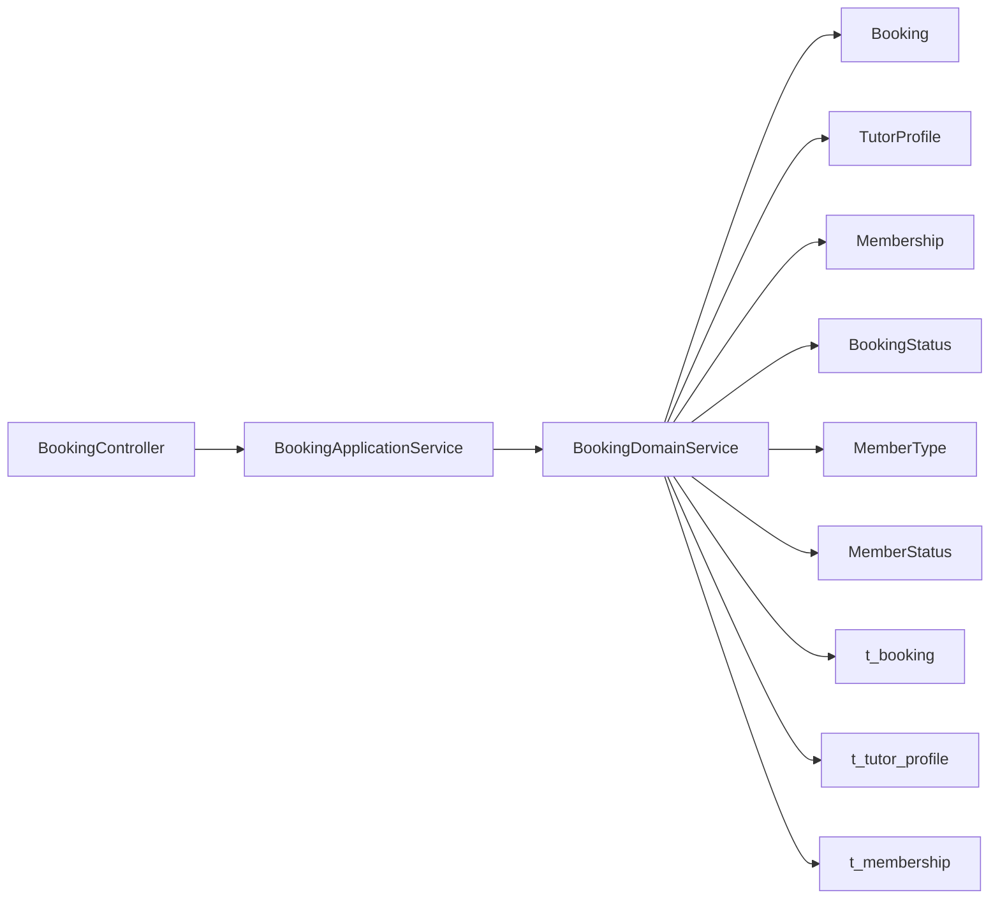

# 预约系统表

<cite>
**本文引用的文件**
- [t_booking.sql](file://wzoto-backend/sql/t_booking.sql)
- [t_tutor_profile.sql](file://wzoto-backend/sql/t_tutor_profile.sql)
- [t_membership.sql](file://wzoto-backend/sql/t_membership.sql)
- [Booking.java](file://wzoto-backend/wzoto-domain/src/main/java/com/wzoto/domain/entity/Booking.java)
- [TutorProfile.java](file://wzoto-backend/wzoto-domain/src/main/java/com/wzoto/domain/entity/TutorProfile.java)
- [Membership.java](file://wzoto-backend/wzoto-domain/src/main/java/com/wzoto/domain/entity/Membership.java)
- [BookingStatus.java](file://wzoto-backend/wzoto-domain/src/main/java/com/wzoto/domain/valobj/BookingStatus.java)
- [MemberType.java](file://wzoto-backend/wzoto-domain/src/main/java/com/wzoto/domain/valobj/MemberType.java)
- [MemberStatus.java](file://wzoto-backend/wzoto-domain/src/main/java/com/wzoto/domain/valobj/MemberStatus.java)
- [BookingDomainService.java](file://wzoto-backend/wzoto-domain/src/main/java/com/wzoto/domain/service/BookingDomainService.java)
- [BookingApplicationService.java](file://wzoto-backend/wzoto-application/src/main/java/com/wzoto/application/service/BookingApplicationService.java)
- [BookingController.java](file://wzoto-backend/wzoto-interfaces/src/main/java/com/wzoto/interfaces/controller/BookingController.java)
- [CreateBookingDTO.java](file://wzoto-backend/wzoto-interfaces/src/main/java/com/wzoto/interfaces/dto/booking/CreateBookingDTO.java)
</cite>

## 目录
1. [简介](#简介)
2. [项目结构](#项目结构)
3. [核心组件](#核心组件)
4. [架构总览](#架构总览)
5. [详细组件分析](#详细组件分析)
6. [依赖关系分析](#依赖关系分析)
7. [性能考虑](#性能考虑)
8. [故障排查指南](#故障排查指南)
9. [结论](#结论)
10. [附录](#附录)

## 简介
本文件围绕 wzoto 预约系统的核心数据模型与业务流程，系统性说明以下要点：
- 预约表 t_booking 的状态管理、时间冲突检测策略与流程控制
- 教员档案表 t_tutor_profile 的技能标签、评价系统与可用性管理
- 会员体系表 t_membership 的会员类型、权益管理与续费机制
- 预约业务全流程：创建、确认、拒绝、取消、完成
- 数据一致性保障：并发控制、事务边界、状态同步
- 性能优化方案：时间槽计算、冲突检测、批量操作优化

## 项目结构
本项目采用分层架构：接口层（Controller）→ 应用服务层（Application Service）→ 领域服务层（Domain Service）→ 领域实体与值对象 → 仓储与持久化。预约相关的关键文件包括 SQL DDL、领域实体、值对象、领域服务、应用服务与控制器。

图表来源
- [BookingController.java:1-96](file://wzoto-backend/wzoto-interfaces/src/main/java/com/wzoto/interfaces/controller/BookingController.java#L1-L96)
- [BookingApplicationService.java:1-53](file://wzoto-backend/wzoto-application/src/main/java/com/wzoto/application/service/BookingApplicationService.java#L1-L53)
- [BookingDomainService.java:1-122](file://wzoto-backend/wzoto-domain/src/main/java/com/wzoto/domain/service/BookingDomainService.java#L1-L122)
- [Booking.java:1-114](file://wzoto-backend/wzoto-domain/src/main/java/com/wzoto/domain/entity/Booking.java#L1-L114)
- [TutorProfile.java:1-106](file://wzoto-backend/wzoto-domain/src/main/java/com/wzoto/domain/entity/TutorProfile.java#L1-L106)
- [Membership.java:1-79](file://wzoto-backend/wzoto-domain/src/main/java/com/wzoto/domain/entity/Membership.java#L1-L79)
- [BookingStatus.java:1-30](file://wzoto-backend/wzoto-domain/src/main/java/com/wzoto/domain/valobj/BookingStatus.java#L1-L30)
- [MemberType.java:1-50](file://wzoto-backend/wzoto-domain/src/main/java/com/wzoto/domain/valobj/MemberType.java#L1-L50)
- [MemberStatus.java:1-29](file://wzoto-backend/wzoto-domain/src/main/java/com/wzoto/domain/valobj/MemberStatus.java#L1-L29)

章节来源
- [BookingController.java:1-96](file://wzoto-backend/wzoto-interfaces/src/main/java/com/wzoto/interfaces/controller/BookingController.java#L1-L96)
- [BookingApplicationService.java:1-53](file://wzoto-backend/wzoto-application/src/main/java/com/wzoto/application/service/BookingApplicationService.java#L1-L53)
- [BookingDomainService.java:1-122](file://wzoto-backend/wzoto-domain/src/main/java/com/wzoto/domain/service/BookingDomainService.java#L1-L122)

## 核心组件
- 预约实体 Booking：封装预约生命周期方法（创建、确认、拒绝、取消、完成），并维护状态机约束。
- 教员档案 TutorProfile：维护可辅导科目、上课区域、可用时段、评分与订单数等教学能力信息。
- 会员 Membership：维护会员类型、有效期、自动续费与交易号，提供开通、续费与过期检查行为。
- 值对象：
  - BookingStatus：定义 PENDING/CONFIRMED/COMPLETED/CANCELLED/REJECTED 五种状态及转换规则。
  - MemberType：定义家长月卡/年卡、教员月卡、学习会员月卡/年卡及其价格与天数。
  - MemberStatus：定义 ACTIVE/EXPIRED/CANCELLED 三种状态。

章节来源
- [Booking.java:1-114](file://wzoto-backend/wzoto-domain/src/main/java/com/wzoto/domain/entity/Booking.java#L1-L114)
- [TutorProfile.java:1-106](file://wzoto-backend/wzoto-domain/src/main/java/com/wzoto/domain/entity/TutorProfile.java#L1-L106)
- [Membership.java:1-79](file://wzoto-backend/wzoto-domain/src/main/java/com/wzoto/domain/entity/Membership.java#L1-L79)
- [BookingStatus.java:1-30](file://wzoto-backend/wzoto-domain/src/main/java/com/wzoto/domain/valobj/BookingStatus.java#L1-L30)
- [MemberType.java:1-50](file://wzoto-backend/wzoto-domain/src/main/java/com/wzoto/domain/valobj/MemberType.java#L1-L50)
- [MemberStatus.java:1-29](file://wzoto-backend/wzoto-domain/src/main/java/com/wzoto/domain/valobj/MemberStatus.java#L1-L29)

## 架构总览
预约请求从 Controller 进入，经 Application Service 注入当前用户上下文，再交由 Domain Service 执行业务规则与状态流转，最终通过 Repository 持久化到数据库。

图表来源
- [BookingController.java:28-41](file://wzoto-backend/wzoto-interfaces/src/main/java/com/wzoto/interfaces/controller/BookingController.java#L28-L41)
- [BookingApplicationService.java:20-23](file://wzoto-backend/wzoto-application/src/main/java/com/wzoto/application/service/BookingApplicationService.java#L20-L23)
- [BookingDomainService.java:31-53](file://wzoto-backend/wzoto-domain/src/main/java/com/wzoto/domain/service/BookingDomainService.java#L31-L53)

## 详细组件分析

### 预约表 t_booking 设计
- 字段与索引
  - 关键字段：parent_id、tutor_id、tutor_profile_id、subject、booking_date、start_time、end_time、status、reply、deleted、created_at、updated_at
  - 索引：按 parent_id、tutor_id、status、booking_date、以及 tutor_id+status 复合索引，支撑多视角查询与状态筛选
- 状态管理
  - 状态枚举：PENDING、CONFIRMED、COMPLETED、CANCELLED、REJECTED
  - 状态机约束由 Booking 实体方法保证：仅 PENDING 可确认或拒绝；仅 CONFIRMED 可标记完成；非已完成/已取消方可取消
- 时间冲突检测
  - 建议在“创建预约”时基于 tutor_id + booking_date 查询该教员在该日期的所有有效预约（如 PENDING/CONFIRMED），判断时间区间是否重叠
  - 若存在重叠则拒绝创建；否则允许创建并落库为 PENDING
- 流程控制
  - 家长发起预约后，状态为 PENDING；教员确认后变为 CONFIRMED；完成后变为 COMPLETED；家长可取消至 CANCELLED；教员可拒绝至 REJECTED

章节来源
- [t_booking.sql:1-23](file://wzoto-backend/sql/t_booking.sql#L1-L23)
- [BookingStatus.java:1-30](file://wzoto-backend/wzoto-domain/src/main/java/com/wzoto/domain/valobj/BookingStatus.java#L1-L30)
- [Booking.java:58-114](file://wzoto-backend/wzoto-domain/src/main/java/com/wzoto/domain/entity/Booking.java#L58-L114)
- [BookingDomainService.java:31-101](file://wzoto-backend/wzoto-domain/src/main/java/com/wzoto/domain/service/BookingDomainService.java#L31-L101)

#### 预约状态机图

图表来源
- [BookingStatus.java:11-17](file://wzoto-backend/wzoto-domain/src/main/java/com/wzoto/domain/valobj/BookingStatus.java#L11-L17)
- [Booking.java:61-113](file://wzoto-backend/wzoto-domain/src/main/java/com/wzoto/domain/entity/Booking.java#L61-L113)

### 教员档案表 t_tutor_profile 设计
- 字段与索引
  - 关键字段：user_id、university、major、grade、subjects、hourly_rate、bio、experience、districts、available_times、rating、review_count、order_count、active、deleted
  - 索引：唯一 user_id；active+rating 复合索引用于推荐排序；subjects 前缀索引用于科目检索
- 技能标签
  - subjects 以逗号分隔存储可辅导科目，配合前缀索引支持快速匹配
- 评价系统
  - rating 为平均分，review_count 统计评价数量，order_count 统计完成订单数，用于展示与排序
- 可用性管理
  - available_times 以 JSON 存储可用时段（如 day/start/end），结合课程日期进行时间槽匹配
  - active 控制上架/下架，影响预约创建时的档案有效性校验

章节来源
- [t_tutor_profile.sql:1-24](file://wzoto-backend/sql/t_tutor_profile.sql#L1-L24)
- [TutorProfile.java:1-106](file://wzoto-backend/wzoto-domain/src/main/java/com/wzoto/domain/entity/TutorProfile.java#L1-L106)

### 会员体系表 t_membership 设计
- 字段与索引
  - 关键字段：user_id、member_type、status、start_time、expire_time、auto_renew、transaction_id、deleted
  - 索引：user_id、status、expire_time，便于查询当前有效会员与到期扫描
- 会员类型
  - MemberType 定义家长月卡/年卡、教员月卡、学习会员月卡/年卡，含价格与天数
- 权益管理
  - status 表示生效中/已过期/已取消；isActive 结合 expire_time 判定当前是否有效
- 续费机制
  - renew 支持在有效期内续期（从 expireTime 起算）或在过期后重新开通（从当前时间起算），并可设置 auto_renew 标志

章节来源
- [t_membership.sql:1-20](file://wzoto-backend/sql/t_membership.sql#L1-L20)
- [MemberType.java:1-50](file://wzoto-backend/wzoto-domain/src/main/java/com/wzoto/domain/valobj/MemberType.java#L1-L50)
- [MemberStatus.java:1-29](file://wzoto-backend/wzoto-domain/src/main/java/com/wzoto/domain/valobj/MemberStatus.java#L1-L29)
- [Membership.java:35-77](file://wzoto-backend/wzoto-domain/src/main/java/com/wzoto/domain/entity/Membership.java#L35-L77)

### 预约业务流程
- 创建预约
  - 校验家长身份与实名认证；校验教员档案存在且上架；生成 PENDING 预约
- 确认流程
  - 仅对应教员可对 PENDING 状态进行确认，转为 CONFIRMED
- 拒绝机制
  - 仅对应教员可对 PENDING 状态进行拒绝，转为 REJECTED 并记录原因
- 取消机制
  - 家长可对非已完成/已取消的预约进行取消，转为 CANCELLED
- 完成流程
  - 仅对 CONFIRMED 状态的预约可标记完成，转为 COMPLETED

图表来源
- [BookingDomainService.java:31-101](file://wzoto-backend/wzoto-domain/src/main/java/com/wzoto/domain/service/BookingDomainService.java#L31-L101)
- [Booking.java:58-114](file://wzoto-backend/wzoto-domain/src/main/java/com/wzoto/domain/entity/Booking.java#L58-L114)

章节来源
- [BookingController.java:28-66](file://wzoto-backend/wzoto-interfaces/src/main/java/com/wzoto/interfaces/controller/BookingController.java#L28-L66)
- [BookingApplicationService.java:20-48](file://wzoto-backend/wzoto-application/src/main/java/com/wzoto/application/service/BookingApplicationService.java#L20-L48)
- [BookingDomainService.java:31-101](file://wzoto-backend/wzoto-domain/src/main/java/com/wzoto/domain/service/BookingDomainService.java#L31-L101)

### 数据一致性保证
- 并发控制
  - 建议对“同一教员同一天”的预约写入使用行级锁或乐观锁（版本号）避免重复占用同一时间段
  - 在创建预约前，先以 tutor_id + booking_date 查询并锁定相关记录，再进行时间冲突检测与插入
- 事务管理
  - 将“冲突检测 + 插入预约”置于同一事务中，确保原子性；异常回滚避免脏数据
- 状态同步
  - 所有状态变更通过领域实体的方法执行，并由领域服务统一调用仓储更新，保证状态机一致
- 幂等性
  - 对确认/拒绝/取消等操作增加幂等键或前置状态校验，防止重复提交导致状态错乱

章节来源
- [Booking.java:61-113](file://wzoto-backend/wzoto-domain/src/main/java/com/wzoto/domain/entity/Booking.java#L61-L113)
- [BookingDomainService.java:58-101](file://wzoto-backend/wzoto-domain/src/main/java/com/wzoto/domain/service/BookingDomainService.java#L58-L101)

### 性能优化方案
- 时间槽计算
  - 基于 available_times JSON 解析出各天的可用起止时间，结合授课时长计算候选时间槽
  - 使用索引 idx_tutor_status 与 idx_booking_date 加速查询某教员某日的有效预约集合
- 冲突检测
  - 时间区间重叠判定：新预约[start,end]与已有预约[s,e]满足 max(start,s) < min(end,e) 即冲突
  - 批量预检：一次查询某教员某日全部有效预约，内存中进行冲突检测，减少多次往返
- 批量操作优化
  - 列表查询使用分页与必要字段投影，避免全量加载
  - 对高频查询（如按 tutor_id + status）建立复合索引，提升过滤效率
  - 对大对象字段（如 available_times）按需读取，减少 IO

章节来源
- [t_tutor_profile.sql:1-24](file://wzoto-backend/sql/t_tutor_profile.sql#L1-L24)
- [t_booking.sql:1-23](file://wzoto-backend/sql/t_booking.sql#L1-L23)
- [TutorProfile.java:43-44](file://wzoto-backend/wzoto-domain/src/main/java/com/wzoto/domain/entity/TutorProfile.java#L43-L44)

## 依赖关系分析
- 控制器依赖应用服务，应用服务依赖领域服务，领域服务依赖领域实体与仓储
- 值对象被多个实体与服务复用，保证状态与类型的一致性
- 数据库表与实体一一对应，索引设计服务于查询场景

图表来源
- [BookingController.java:1-96](file://wzoto-backend/wzoto-interfaces/src/main/java/com/wzoto/interfaces/controller/BookingController.java#L1-L96)
- [BookingApplicationService.java:1-53](file://wzoto-backend/wzoto-application/src/main/java/com/wzoto/application/service/BookingApplicationService.java#L1-L53)
- [BookingDomainService.java:1-122](file://wzoto-backend/wzoto-domain/src/main/java/com/wzoto/domain/service/BookingDomainService.java#L1-L122)

章节来源
- [BookingController.java:1-96](file://wzoto-backend/wzoto-interfaces/src/main/java/com/wzoto/interfaces/controller/BookingController.java#L1-L96)
- [BookingApplicationService.java:1-53](file://wzoto-backend/wzoto-application/src/main/java/com/wzoto/application/service/BookingApplicationService.java#L1-L53)
- [BookingDomainService.java:1-122](file://wzoto-backend/wzoto-domain/src/main/java/com/wzoto/domain/service/BookingDomainService.java#L1-L122)

## 性能考虑
- 查询优化
  - 利用复合索引（tutor_id + status、booking_date）缩小扫描范围
  - 列表接口分页加载，避免一次性拉取大量数据
- 写入优化
  - 冲突检测与写入在同一事务内，必要时加锁避免竞态
  - 对频繁更新的字段（如 order_count、rating）采用增量更新
- 缓存策略
  - 教员档案与可用时段可短期缓存，降低热点访问压力
  - 缓存失效策略：教员资料更新或预约状态变更后主动失效

[本节为通用性能建议，不直接分析具体文件]

## 故障排查指南
- 常见错误
  - 未认证家长发起预约：需先完成实名认证
  - 教员档案不存在或已下架：无法创建预约
  - 状态不允许操作：例如对已完成或已取消的预约再次取消
- 定位步骤
  - 检查接口入参是否符合 DTO 校验规则
  - 查看领域服务中的身份与状态校验逻辑
  - 核对数据库索引与查询条件是否命中
- 日志与监控
  - 在关键路径添加日志（创建、确认、拒绝、取消、完成）
  - 监控失败率与耗时，定位瓶颈

章节来源
- [CreateBookingDTO.java:1-30](file://wzoto-backend/wzoto-interfaces/src/main/java/com/wzoto/interfaces/dto/booking/CreateBookingDTO.java#L1-L30)
- [BookingDomainService.java:31-101](file://wzoto-backend/wzoto-domain/src/main/java/com/wzoto/domain/service/BookingDomainService.java#L31-L101)
- [Booking.java:61-113](file://wzoto-backend/wzoto-domain/src/main/java/com/wzoto/domain/entity/Booking.java#L61-L113)

## 结论
本方案通过清晰的领域模型与状态机约束，结合合理的数据库索引与事务边界，实现了稳健的预约系统。未来可在时间冲突检测、通知提醒、批量操作等方面进一步增强，以提升用户体验与系统吞吐。

[本节为总结性内容，不直接分析具体文件]

## 附录
- API 参考
  - 创建预约：POST /api/booking，入参见 CreateBookingDTO
  - 确认预约：POST /api/booking/{id}/confirm
  - 拒绝预约：POST /api/booking/{id}/reject?reason=...
  - 取消预约：POST /api/booking/{id}/cancel
  - 我的预约：GET /api/booking/my
  - 预约详情：GET /api/booking/{id}

章节来源
- [BookingController.java:28-72](file://wzoto-backend/wzoto-interfaces/src/main/java/com/wzoto/interfaces/controller/BookingController.java#L28-L72)
- [CreateBookingDTO.java:1-30](file://wzoto-backend/wzoto-interfaces/src/main/java/com/wzoto/interfaces/dto/booking/CreateBookingDTO.java#L1-L30)