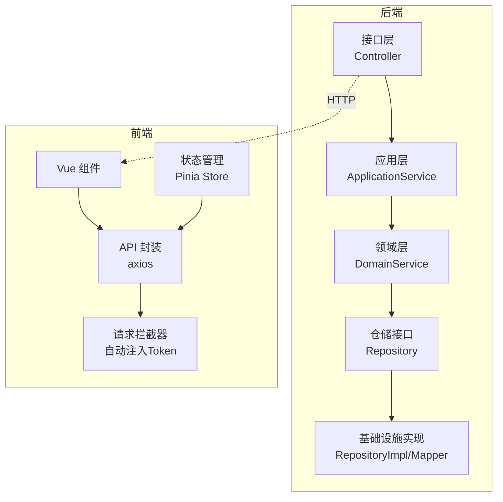
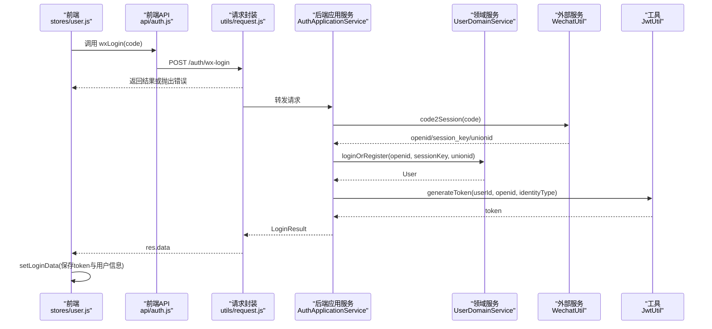
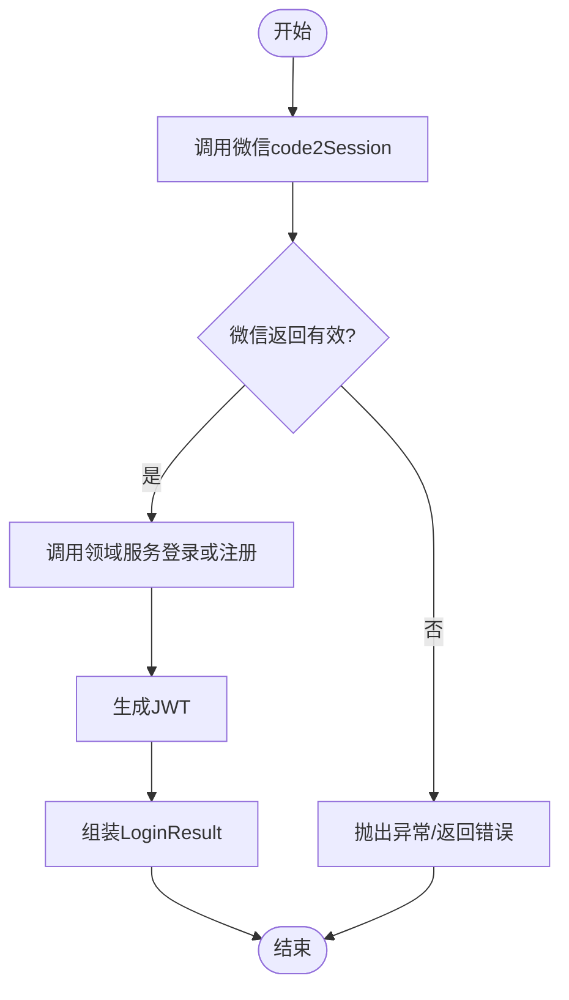
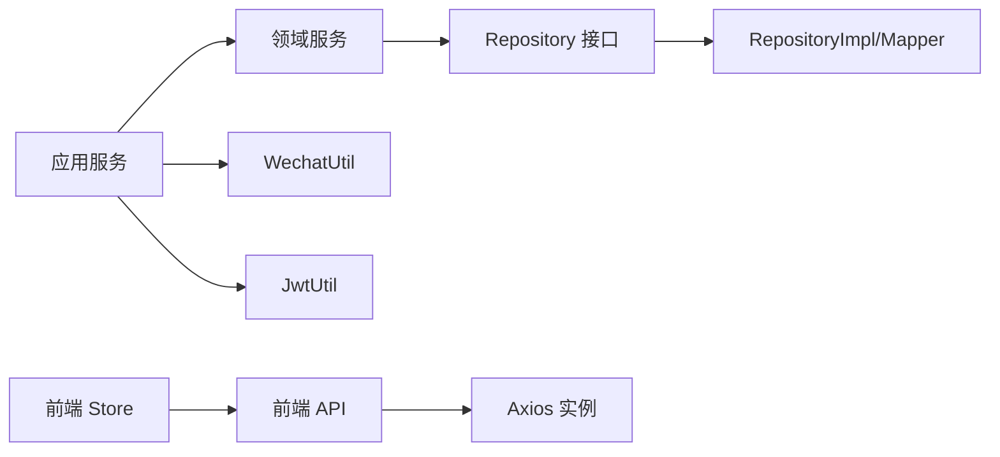

# 单元测试

<cite>
**本文引用的文件**
- [wzoto-backend/pom.xml](file://wzoto-backend/pom.xml)
- [AuthApplicationService.java](file://wzoto-backend/wzoto-application/src/main/java/com/wzoto/application/service/AuthApplicationService.java)
- [LearningResourceApplicationService.java](file://wzoto-backend/wzoto-application/src/main/java/com/wzoto/application/service/LearningResourceApplicationService.java)
- [AiQaApplicationService.java](file://wzoto-backend/wzoto-application/src/main/java/com/wzoto/application/service/AiQaApplicationService.java)
- [UserDomainService.java](file://wzoto-backend/wzoto-domain/src/main/java/com/wzoto/domain/service/UserDomainService.java)
- [auth.js](file://wzoto-frontend/src/api/auth.js)
- [request.js](file://wzoto-frontend/src/utils/request.js)
- [user.js](file://wzoto-frontend/src/stores/user.js)
- [HelloWorld.vue](file://wzoto-frontend/src/components/HelloWorld.vue)
- [auto-test.mjs](file://wzoto-frontend/tests/auto-test.mjs)
</cite>

## 目录
1. [简介](#简介)
2. [项目结构](#项目结构)
3. [核心组件](#核心组件)
4. [架构总览](#架构总览)
5. [详细组件分析](#详细组件分析)
6. [依赖分析](#依赖分析)
7. [性能考虑](#性能考虑)
8. [故障排查指南](#故障排查指南)
9. [结论](#结论)
10. [附录](#附录)

## 简介
本文件为 wzoto 项目的单元测试详细文档，覆盖后端与前端：
- 后端：基于 JUnit 5 与 Mockito，对领域服务与应用服务进行单元测试，覆盖实体验证、业务逻辑、异常处理。
- 前端：基于 Jest 与 Vue Test Utils，对 Vue 组件、组合式函数（Pinia store）、工具函数进行测试。
- 测试规范：命名约定、断言方法、模拟数据准备。
- 示例场景：用户认证、学习资源获取、AI 功能调用等核心流程的测试设计与用例组织。
- 覆盖率要求与最佳实践：给出可执行的覆盖率目标与落地建议。

## 项目结构
wzoto 采用分层架构：
- 接口层（interfaces）：控制器与 DTO/VO。
- 应用层（application）：编排业务流程的应用服务。
- 领域层（domain）：实体、值对象、领域服务与仓储接口。
- 基础设施层（infrastructure）：仓储实现、外部集成（如微信、JWT）。

前端采用 Vue 3 + Vite，包含 API 封装、状态管理（Pinia）、页面与组件、工具函数与自动化脚本。

图表来源
- [AuthApplicationService.java:1-119](file://wzoto-backend/wzoto-application/src/main/java/com/wzoto/application/service/AuthApplicationService.java#L1-L119)
- [UserDomainService.java:1-76](file://wzoto-backend/wzoto-domain/src/main/java/com/wzoto/domain/service/UserDomainService.java#L1-L76)
- [request.js:1-59](file://wzoto-frontend/src/utils/request.js#L1-L59)
- [user.js:1-126](file://wzoto-frontend/src/stores/user.js#L1-L126)

章节来源
- [wzoto-backend/pom.xml:1-126](file://wzoto-backend/pom.xml#L1-L126)

## 核心组件
- 应用服务
  - AuthApplicationService：编排微信登录、身份选择、绑定手机号，并生成 JWT。
  - LearningResourceApplicationService：查询学习资源列表、详情与解锁资源。
  - AiQaApplicationService：发起 AI 答疑、追问、历史与对话记录查询。
- 领域服务
  - UserDomainService：用户登录/注册、身份选择、绑定手机号的领域规则。
- 前端
  - api/auth.js：封装认证相关 HTTP 接口。
  - utils/request.js：Axios 实例、请求/响应拦截器、统一错误处理。
  - stores/user.js：用户状态管理，封装登录、身份选择、绑定手机、拉取用户信息、登出。
  - components/HelloWorld.vue：示例组件，用于演示组件测试。
  - tests/auto-test.mjs：Playwright 端到端自动化脚本（非单元测试，但可作为补充验证）。

章节来源
- [AuthApplicationService.java:1-119](file://wzoto-backend/wzoto-application/src/main/java/com/wzoto/application/service/AuthApplicationService.java#L1-L119)
- [LearningResourceApplicationService.java:1-40](file://wzoto-backend/wzoto-application/src/main/java/com/wzoto/application/service/LearningResourceApplicationService.java#L1-L40)
- [AiQaApplicationService.java:1-43](file://wzoto-backend/wzoto-application/src/main/java/com/wzoto/application/service/AiQaApplicationService.java#L1-L43)
- [UserDomainService.java:1-76](file://wzoto-backend/wzoto-domain/src/main/java/com/wzoto/domain/service/UserDomainService.java#L1-L76)
- [auth.js:1-30](file://wzoto-frontend/src/api/auth.js#L1-L30)
- [request.js:1-59](file://wzoto-frontend/src/utils/request.js#L1-L59)
- [user.js:1-126](file://wzoto-frontend/src/stores/user.js#L1-L126)
- [HelloWorld.vue:1-96](file://wzoto-frontend/src/components/HelloWorld.vue#L1-L96)
- [auto-test.mjs:1-39](file://wzoto-frontend/tests/auto-test.mjs#L1-L39)

## 架构总览
下图展示“用户认证”在前后端的调用链路与关键交互点，便于定位测试边界与模拟范围。

图表来源
- [user.js:33-41](file://wzoto-frontend/src/stores/user.js#L33-L41)
- [auth.js:6-8](file://wzoto-frontend/src/api/auth.js#L6-L8)
- [request.js:13-23](file://wzoto-frontend/src/utils/request.js#L13-L23)
- [AuthApplicationService.java:26-57](file://wzoto-backend/wzoto-application/src/main/java/com/wzoto/application/service/AuthApplicationService.java#L26-L57)
- [UserDomainService.java:20-46](file://wzoto-backend/wzoto-domain/src/main/java/com/wzoto/domain/service/UserDomainService.java#L20-L46)

## 详细组件分析

### 后端单元测试策略（JUnit 5 + Mockito）
- 测试目标
  - 领域服务：验证实体不变式与业务规则（如身份不可随意切换、手机号绑定校验）。
  - 应用服务：验证流程编排（微信登录→领域服务→JWT），以及事务边界与返回值组装。
  - 异常处理：非法参数、未找到用户、外部服务异常等路径。
- 测试分层
  - 单元测试：仅使用 Mockito 模拟依赖（仓储、外部工具），不启动 Spring 容器。
  - 集成测试（可选）：使用内存数据库或 Testcontainers 验证持久化与 SQL。
- 推荐包结构
  - application.service.*Test：应用服务单测
  - domain.service.*Test：领域服务单测
  - infrastructure.util.*Test：工具类单测（如 JWT 编解码）
- 断言要点
  - 输入参数校验（空值、非法枚举）
  - 依赖调用次数与顺序（Mockito verify）
  - 返回值结构与字段完整性
  - 异常类型与消息

章节来源
- [UserDomainService.java:20-76](file://wzoto-backend/wzoto-domain/src/main/java/com/wzoto/domain/service/UserDomainService.java#L20-L76)
- [AuthApplicationService.java:26-119](file://wzoto-backend/wzoto-application/src/main/java/com/wzoto/application/service/AuthApplicationService.java#L26-L119)

#### 用户认证应用服务测试设计
- 测试用例
  - 成功登录：模拟 WechatUtil.code2Session 返回有效 openid/session_key/unionid；验证 UserDomainService.loginOrRegister 被调用一次；验证 JwtUtil.generateToken 被调用一次；断言返回的 LoginResult 包含必要字段。
  - 身份选择：模拟 selectIdentity 成功；验证重新生成 Token；断言返回 identityType 与 hasIdentity。
  - 绑定手机号：模拟 bindPhone 成功；断言返回不包含 token。
  - 异常路径：模拟外部服务异常或领域服务抛异常；断言上层正确传播异常。
- 模拟策略
  - @Mock WechatUtil、UserDomainService、JwtUtil
  - @InjectMocks AuthApplicationService
  - 使用 when(...).thenReturn(...) 构造分支数据

图表来源
- [AuthApplicationService.java:26-57](file://wzoto-backend/wzoto-application/src/main/java/com/wzoto/application/service/AuthApplicationService.java#L26-L57)

章节来源
- [AuthApplicationService.java:26-119](file://wzoto-backend/wzoto-application/src/main/java/com/wzoto/application/service/AuthApplicationService.java#L26-L119)

#### 学习资源应用服务测试设计
- 测试用例
  - 列表查询：传入 childId、subject、resourceTypeCode、includeVip；验证调用领域服务并返回资源列表。
  - 资源详情：传入 resourceId；验证返回资源对象。
  - 解锁资源：传入 userId（来自上下文）与 resourceId；验证返回 FeatureOrder。
- 模拟策略
  - @Mock LearningResourceDomainService
  - 通过 UserContext.getCurrentUserId() 提供当前用户（可在测试中设置或 Mock 静态上下文）

章节来源
- [LearningResourceApplicationService.java:24-38](file://wzoto-backend/wzoto-application/src/main/java/com/wzoto/application/service/LearningResourceApplicationService.java#L24-L38)

#### AI 答疑应用服务测试设计
- 测试用例
  - 提问：传入 childId、subject、qaTypeCode、questionText、questionImageUrl、ocrText、isVip；验证转换为 AiQaType 并调用领域服务。
  - 追问：传入 conversationId 与 questionText；验证调用 followUp。
  - 历史与对话：传入 childId 或 conversationId；验证返回列表。
- 模拟策略
  - @Mock AiQaDomainService
  - 验证 AiQaType.fromCode 的转换逻辑（可在值对象层单测）

章节来源
- [AiQaApplicationService.java:21-41](file://wzoto-backend/wzoto-application/src/main/java/com/wzoto/application/service/AiQaApplicationService.java#L21-L41)

### 前端单元测试策略（Jest + Vue Test Utils）
- 测试目标
  - 组件：渲染、事件触发、插槽、props 传递、路由跳转。
  - 组合式函数/Store：状态变更、异步操作、副作用。
  - 工具函数：纯函数输入输出、边界条件。
- 推荐包结构
  - src/__tests__/components：组件测试
  - src/__tests__/stores：Store 测试
  - src/__tests__/utils：工具函数测试
- 断言要点
  - DOM 内容、属性、样式类名
  - 事件触发后的状态变化
  - 异步更新后断言（await nextTick）
  - 网络请求拦截（jest.fn/jest.spyOn）

章节来源
- [HelloWorld.vue:1-96](file://wzoto-frontend/src/components/HelloWorld.vue#L1-L96)
- [user.js:1-126](file://wzoto-frontend/src/stores/user.js#L1-L126)
- [request.js:1-59](file://wzoto-frontend/src/utils/request.js#L1-L59)

#### 组件测试示例（HelloWorld）
- 测试点
  - 初始渲染：计数为 0，按钮文本包含“Count is 0”。
  - 点击事件：点击按钮后计数递增，文本更新。
  - 模板结构：存在必要的图片与链接节点。
- 模拟策略
  - 使用 mount 挂载组件，trigger('click') 触发事件，assert 文本与状态。

章节来源
- [HelloWorld.vue:7-23](file://wzoto-frontend/src/components/HelloWorld.vue#L7-L23)

#### Store 测试示例（用户状态）
- 测试点
  - 登录：调用 wxLoginApi 成功后，setLoginData 写入 token、userId、identityType 等。
  - 选择身份：调用 selectIdentityApi 成功后更新状态。
  - 绑定手机：调用 bindPhoneApi 成功后更新 phone。
  - 拉取用户信息：fetchUserInfo 成功时更新各字段；失败返回 null。
  - 登出：清空所有状态并移除本地存储。
- 模拟策略
  - jest.spyOn(api/auth.js) 的方法，返回 Promise.resolve({ data })。
  - 使用 localStorage mock。

章节来源
- [user.js:33-117](file://wzoto-frontend/src/stores/user.js#L33-L117)
- [auth.js:6-28](file://wzoto-frontend/src/api/auth.js#L6-L28)

#### 工具函数测试示例（请求拦截器）
- 测试点
  - 请求拦截：当 userStore.token 存在时，Authorization 头包含 Bearer token。
  - 响应拦截：code !== 200 时抛出错误；code === 401 时执行登出并跳转。
  - 网络错误：无 response 时提示网络连接失败。
- 模拟策略
  - 使用 jest.mock('@/stores/user') 提供 token。
  - 使用 jest.spyOn(window, 'location') 验证跳转。
  - 使用 axios 的适配器或拦截器钩子进行断言。

章节来源
- [request.js:13-55](file://wzoto-frontend/src/utils/request.js#L13-L55)

## 依赖分析
- 后端模块依赖
  - 应用服务依赖领域服务与基础设施工具（微信、JWT）。
  - 领域服务依赖仓储接口，解耦具体实现。
- 前端依赖
  - Store 依赖 API 封装；API 封装依赖 Axios 实例与全局错误处理。
  - 组件依赖 Store 与路由。

图表来源
- [AuthApplicationService.java:22-24](file://wzoto-backend/wzoto-application/src/main/java/com/wzoto/application/service/AuthApplicationService.java#L22-L24)
- [UserDomainService.java:18-18](file://wzoto-backend/wzoto-domain/src/main/java/com/wzoto/domain/service/UserDomainService.java#L18-L18)
- [request.js:1-11](file://wzoto-frontend/src/utils/request.js#L1-L11)
- [user.js:3-3](file://wzoto-frontend/src/stores/user.js#L3-L3)

章节来源
- [wzoto-backend/pom.xml:21-26](file://wzoto-backend/pom.xml#L21-L26)

## 性能考虑
- 后端
  - 避免在单测中启动完整 Spring 容器，优先使用 Mockito 隔离依赖。
  - 对涉及 IO 的依赖（微信、数据库）一律 Mock，保证测试快速稳定。
  - 关注事务边界，确保测试覆盖回滚路径。
- 前端
  - 使用轻量级 mock 替代真实网络请求，减少 CI 时间。
  - 对异步更新使用 await nextTick 后再断言，避免竞态问题。
  - 合理拆分测试用例，避免单个测试过重。

[本节为通用指导，无需引用具体文件]

## 故障排查指南
- 后端常见问题
  - 依赖注入失败：确认 @Mock/@InjectMocks 配置正确，且依赖类可被 Mockito 代理。
  - 事务回滚未生效：检查 @Transactional 注解与异常类型是否匹配。
  - 外部服务异常：使用 whenThrow 模拟超时或网络错误，验证上层处理。
- 前端常见问题
  - 路由跳转未生效：mock window.location 并断言 href。
  - 异步状态未更新：确保在断言前 await nextTick。
  - 401 未登录：验证拦截器是否正确触发登出与跳转。

章节来源
- [request.js:25-55](file://wzoto-frontend/src/utils/request.js#L25-L55)

## 结论
- 通过分层单测策略，将复杂业务拆解为可验证的小单元，提升代码质量与回归效率。
- 后端聚焦领域规则与流程编排，前端聚焦组件行为与状态流转。
- 配合覆盖率目标与持续集成，形成稳定的质量保障体系。

[本节为总结性内容，无需引用具体文件]

## 附录

### 测试用例编写规范
- 命名约定
  - 后端：{Service}Test，方法名描述场景，如 shouldReturnToken_whenLoginSucceeds。
  - 前端：{Component}.spec.js 或 {Store}.test.js，describe 块按功能分组。
- 断言方法
  - 后端：assertEquals、assertThrows、verify(mock).method(...)。
  - 前端：expect(wrapper.html()).toContain(...)、expect(store.state.xxx).toBe(...)。
- 模拟数据准备
  - 后端：使用 Builder 或工厂方法创建最小可用对象。
  - 前端：使用 fixtures 目录集中管理样例数据。

[本节为通用指导，无需引用具体文件]

### 覆盖率要求与最佳实践
- 覆盖率目标
  - 行覆盖率 ≥ 80%，分支覆盖率 ≥ 70%。
  - 关键路径（认证、支付、AI 调用）覆盖率 ≥ 90%。
- 最佳实践
  - 每个公共方法至少一个正向用例与一个异常用例。
  - 对外部依赖一律 Mock，避免不稳定因素。
  - 保持测试独立、可重复、快速执行。
  - 定期清理失效测试，维护测试可读性。

[本节为通用指导，无需引用具体文件]

### 端到端自动化脚本说明（补充）
- auto-test.mjs 使用 Playwright 打开前端应用，等待页面就绪并截图，作为 UI 回归的补充手段。
- 该脚本不属于单元测试范畴，但可与单测结合形成多层次质量保障。

章节来源
- [auto-test.mjs:1-39](file://wzoto-frontend/tests/auto-test.mjs#L1-L39)