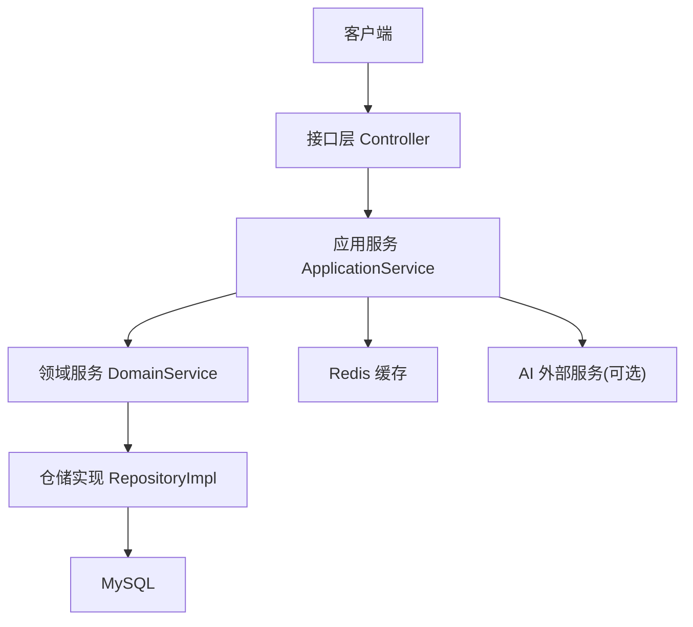
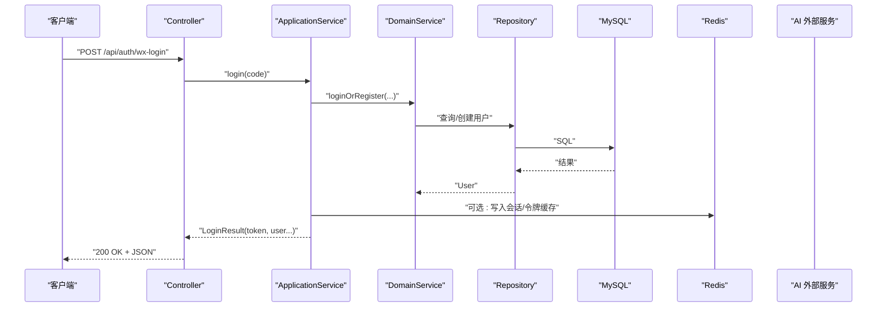
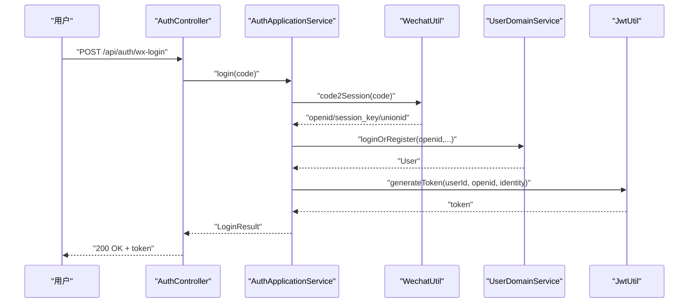
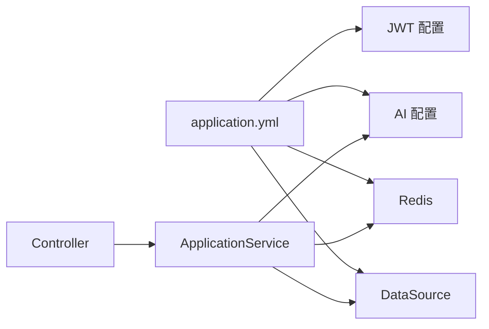

# 性能测试

<cite>
**本文引用的文件**
- [AuthController.java](file://wzoto-backend/wzoto-interfaces/src/main/java/com/wzoto/interfaces/controller/AuthController.java)
- [LearningResourceController.java](file://wzoto-backend/wzoto-interfaces/src/main/java/com/wzoto/interfaces/controller/LearningResourceController.java)
- [AiQaController.java](file://wzoto-backend/wzoto-interfaces/src/main/java/com/wzoto/interfaces/controller/AiQaController.java)
- [AuthApplicationService.java](file://wzoto-backend/wzoto-application/src/main/java/com/wzoto/application/service/AuthApplicationService.java)
- [LearningResourceApplicationService.java](file://wzoto-backend/wzoto-application/src/main/java/com/wzoto/application/service/LearningResourceApplicationService.java)
- [AiQaApplicationService.java](file://wzoto-backend/wzoto-application/src/main/java/com/wzoto/application/service/AiQaApplicationService.java)
- [application.yml](file://wzoto-backend/wzoto-interfaces/src/main/resources/application.yml)
</cite>

## 目录
1. [简介](#简介)
2. [项目结构](#项目结构)
3. [核心组件](#核心组件)
4. [架构总览](#架构总览)
5. [详细组件分析](#详细组件分析)
6. [依赖关系分析](#依赖关系分析)
7. [性能考虑](#性能考虑)
8. [故障排查指南](#故障排查指南)
9. [结论](#结论)
10. [附录](#附录)

## 简介
本文件面向wzoto项目的性能测试与优化，覆盖负载测试、基准测试、内存泄漏检测、性能监控方案以及关键场景的测试用例与优化建议。重点围绕以下接口：
- 用户登录（微信登录/开发环境登录）
- 学习资源列表与详情
- AI答疑问答与会话

文档提供JMeter/k6压测脚本设计思路、数据库慢查询定位方法、缓存命中率观测方式，并给出针对数据库索引、API响应和前端资源的优化策略。

## 项目结构
后端采用分层架构：接口层（Controller）→应用服务（Application Service）→领域服务（Domain Service）→基础设施（Repository/Mapper/Util）。配置集中在application.yml，包含数据库、Redis、JWT、AI等开关与参数。

图表来源
- [application.yml:6-17](file://wzoto-backend/wzoto-interfaces/src/main/resources/application.yml#L6-L17)

章节来源
- [application.yml:1-51](file://wzoto-backend/wzoto-interfaces/src/main/resources/application.yml#L1-L51)

## 核心组件
- 认证流程：微信登录、身份选择、绑定手机号、开发环境直登；生成JWT令牌。
- 学习资源：按学段/科目/类型筛选、VIP解锁、详情获取。
- AI答疑：提问、追问、历史与会话拉取。

章节来源
- [AuthController.java:21-149](file://wzoto-backend/wzoto-interfaces/src/main/java/com/wzoto/interfaces/controller/AuthController.java#L21-L149)
- [LearningResourceController.java:16-79](file://wzoto-backend/wzoto-interfaces/src/main/java/com/wzoto/interfaces/controller/LearningResourceController.java#L16-L79)
- [AiQaController.java:16-51](file://wzoto-backend/wzoto-interfaces/src/main/java/com/wzoto/interfaces/controller/AiQaController.java#L16-L51)
- [AuthApplicationService.java:13-119](file://wzoto-backend/wzoto-application/src/main/java/com/wzoto/application/service/AuthApplicationService.java#L13-L119)
- [LearningResourceApplicationService.java:14-40](file://wzoto-backend/wzoto-application/src/main/java/com/wzoto/application/service/LearningResourceApplicationService.java#L14-L40)
- [AiQaApplicationService.java:13-43](file://wzoto-backend/wzoto-application/src/main/java/com/wzoto/application/service/AiQaApplicationService.java#L13-L43)

## 架构总览
下图展示典型请求链路：客户端发起HTTP请求，经Controller路由到应用服务，必要时调用领域服务与仓储访问数据库或缓存，AI功能可调用外部AI服务。

图表来源
- [AuthController.java:65-75](file://wzoto-backend/wzoto-interfaces/src/main/java/com/wzoto/interfaces/controller/AuthController.java#L65-L75)
- [AuthApplicationService.java:26-57](file://wzoto-backend/wzoto-application/src/main/java/com/wzoto/application/service/AuthApplicationService.java#L26-L57)
- [application.yml:6-17](file://wzoto-backend/wzoto-interfaces/src/main/resources/application.yml#L6-L17)

## 详细组件分析

### 用户登录峰值测试（微信登录/开发环境登录）
- 目标
  - 验证在高并发下登录接口的吞吐与延迟稳定性。
  - 评估JWT生成、微信code2Session、用户落库/更新、缓存写入对整体时延的影响。
- 关键路径
  - 微信登录：/api/auth/wx-login
  - 开发环境登录：/api/auth/dev-login
- 压测设计（JMeter/k6）
  - 并发模型：阶梯式加压（如50/100/200/500并发），持续5-10分钟，观察RT/P95/P99与错误率。
  - 数据准备：预生成N个不同openid/昵称的用户，避免热点键竞争；使用CSV或变量池随机选取。
  - 指标阈值：P95 < 300ms，错误率 < 0.1%（在合理硬件条件下）。
- 关注点
  - 微信外部接口超时与重试策略。
  - 数据库连接池大小与慢查询。
  - JWT签名计算CPU占用。
- 参考实现位置
  - 控制器入口：[AuthController.java:65-75](file://wzoto-backend/wzoto-interfaces/src/main/java/com/wzoto/interfaces/controller/AuthController.java#L65-L75)
  - 应用服务编排：[AuthApplicationService.java:26-57](file://wzoto-backend/wzoto-application/src/main/java/com/wzoto/application/service/AuthApplicationService.java#L26-L57)

章节来源
- [AuthController.java:65-75](file://wzoto-backend/wzoto-interfaces/src/main/java/com/wzoto/interfaces/controller/AuthController.java#L65-L75)
- [AuthApplicationService.java:26-57](file://wzoto-backend/wzoto-application/src/main/java/com/wzoto/application/service/AuthApplicationService.java#L26-L57)

### 学习资源加载测试（列表/详情/解锁）
- 目标
  - 评估资源列表分页/过滤、详情读取、VIP解锁的性能与可扩展性。
- 关键路径
  - 列表：GET /api/learning/resources?childId=&subject=&resourceType=&includeVip=
  - 详情：GET /api/learning/resource/{id}
  - 解锁：POST /api/learning/resource/{id}/unlock
- 压测设计
  - 列表：高读低写场景，模拟多子账号并发拉取不同科目/类型的资源，关注缓存命中与DB压力。
  - 解锁：写路径，关注事务与并发冲突（幂等、去重、分布式锁）。
- 关注点
  - 列表是否走缓存、是否按需加载大字段。
  - 解锁操作的事务边界与幂等性。
- 参考实现位置
  - 控制器：[LearningResourceController.java:27-51](file://wzoto-backend/wzoto-interfaces/src/main/java/com/wzoto/interfaces/controller/LearningResourceController.java#L27-L51)
  - 应用服务：[LearningResourceApplicationService.java:24-38](file://wzoto-backend/wzoto-application/src/main/java/com/wzoto/application/service/LearningResourceApplicationService.java#L24-L38)

章节来源
- [LearningResourceController.java:27-51](file://wzoto-backend/wzoto-interfaces/src/main/java/com/wzoto/interfaces/controller/LearningResourceController.java#L27-L51)
- [LearningResourceApplicationService.java:24-38](file://wzoto-backend/wzoto-application/src/main/java/com/wzoto/application/service/LearningResourceApplicationService.java#L24-L38)

### AI功能并发测试（问答/追问/历史）
- 目标
  - 评估AI问答链路的吞吐与时延，识别外部AI服务瓶颈与本地处理开销。
- 关键路径
  - 提问：POST /api/ai/qa/ask
  - 追问：POST /api/ai/qa/follow-up
  - 历史/会话：GET /api/ai/qa/history/{childId}, GET /api/ai/qa/session/{conversationId}
- 压测设计
  - 异步化：将AI调用改为异步/流式返回，前端轮询或SSE/WS接收增量结果。
  - 限流与降级：外部AI不可用时快速失败或返回缓存/兜底答案。
  - 并发梯度：从低到高逐步加压，记录P95/P99与队列堆积情况。
- 关注点
  - 外部网络抖动、超时重试、熔断降级。
  - 对话状态存储（Redis/DB）的读写放大问题。
- 参考实现位置
  - 控制器：[AiQaController.java:25-49](file://wzoto-backend/wzoto-interfaces/src/main/java/com/wzoto/interfaces/controller/AiQaController.java#L25-L49)
  - 应用服务：[AiQaApplicationService.java:21-40](file://wzoto-backend/wzoto-application/src/main/java/com/wzoto/application/service/AiQaApplicationService.java#L21-L40)

章节来源
- [AiQaController.java:25-49](file://wzoto-backend/wzoto-interfaces/src/main/java/com/wzoto/interfaces/controller/AiQaController.java#L25-L49)
- [AiQaApplicationService.java:21-40](file://wzoto-backend/wzoto-application/src/main/java/com/wzoto/application/service/AiQaApplicationService.java#L21-L40)

### 登录流程时序图（用于压测与排障）

图表来源
- [AuthController.java:65-75](file://wzoto-backend/wzoto-interfaces/src/main/java/com/wzoto/interfaces/controller/AuthController.java#L65-L75)
- [AuthApplicationService.java:26-57](file://wzoto-backend/wzoto-application/src/main/java/com/wzoto/application/service/AuthApplicationService.java#L26-L57)

## 依赖关系分析
- 配置依赖
  - 数据库：MySQL驱动、URL、账号密码由环境变量注入。
  - 缓存：Redis主机、端口、密码由环境变量注入。
  - JWT：密钥与过期时间通过环境变量配置。
  - AI：启用开关、Base URL、API Key、模型与温度可调。
- 模块耦合
  - Controller仅负责入参校验与响应封装，业务编排下沉至ApplicationService。
  - ApplicationService组合领域服务与工具类（JWT、微信、AI），保持单一职责。

图表来源
- [application.yml:6-47](file://wzoto-backend/wzoto-interfaces/src/main/resources/application.yml#L6-L47)

章节来源
- [application.yml:6-47](file://wzoto-backend/wzoto-interfaces/src/main/resources/application.yml#L6-L47)

## 性能考虑
- 负载测试
  - 工具：JMeter或k6均可。推荐以“阶梯并发+固定时长”的方式建立基线，再回归对比。
  - 场景：登录峰值、资源列表高并发读取、AI问答高并发提问。
  - 指标：TPS/QPS、P95/P99 RT、错误率、CPU/内存/IO、DB连接池使用率、Redis命中率。
- 基准测试
  - 为关键接口建立RT基线（冷/热启动分别测量），纳入CI门禁，防止退化。
  - 数据库查询性能：开启慢查询日志，结合执行计划优化索引与SQL。
- 内存泄漏检测
  - 后端：使用JDK jmap/jstat或VisualVM采集堆快照，定位大对象与潜在泄漏点。
  - 前端：浏览器开发者工具的Memory面板进行Heap Snapshot与Allocation instrumentation，关注长生命周期对象与事件监听未释放。
- 性能监控
  - 应用指标：收集接口耗时、错误率、线程池/连接池水位。
  - 慢查询：定期导出慢查询SQL，分析全表扫描与回表。
  - 缓存命中率：统计Redis key命中率与淘汰策略，避免热点key倾斜。

## 故障排查指南
- 登录失败或超时
  - 检查微信code2Session返回值与重试策略。
  - 核对JWT密钥与过期时间配置。
  - 查看数据库连接池与慢查询。
- 资源列表卡顿
  - 确认是否命中缓存；若无命中，检查SQL与索引。
  - 评估是否需分页/懒加载大字段。
- AI问答缓慢
  - 外部AI超时与重试导致排队；增加超时控制与熔断。
  - 将同步调用改为异步/流式，降低前端等待时间。
- 监控与日志
  - 利用application.yml中的日志级别与MyBatis输出定位慢SQL。
  - 结合APM或自研埋点，记录关键路径耗时。

章节来源
- [application.yml:19-23](file://wzoto-backend/wzoto-interfaces/src/main/resources/application.yml#L19-L23)
- [application.yml:31-47](file://wzoto-backend/wzoto-interfaces/src/main/resources/application.yml#L31-L47)

## 结论
通过对登录、学习资源与AI答疑三大关键路径的压测与监控，可以系统性地发现瓶颈并制定优化策略。建议将基准测试纳入CI，持续回归；同时完善缓存、索引与异步化改造，确保在高并发下的稳定与高效。

## 附录

### 性能测试用例清单（示例）
- 用户登录峰值测试
  - 场景：阶梯并发50→500，持续5分钟
  - 指标：P95 RT、错误率、JWT CPU、DB连接池
  - 通过标准：P95 < 300ms，错误率 < 0.1%
- 学习资源加载测试
  - 场景：100并发读取不同科目/类型资源
  - 指标：缓存命中率、DB QPS、列表RT
  - 通过标准：命中率 > 80%，P95 < 200ms
- AI功能并发测试
  - 场景：50并发提问，支持异步/流式
  - 指标：首包时间、端到端RT、外部AI超时率
  - 通过标准：首包 < 1s，端到端P95 < 3s（含外部AI）

### 优化建议
- 数据库索引优化
  - 为高频查询条件列建立复合索引（如childId、subject、resourceType）。
  - 避免SELECT *，只取必要字段，减少回表。
- API响应优化
  - 列表接口增加分页与缓存；详情接口按需加载富文本/媒体。
  - 统一响应体结构，减少序列化开销。
- 前端资源优化
  - 静态资源CDN与压缩；图片懒加载与WebP格式。
  - 首屏关键CSS/JS内联，非关键资源异步加载。
- 缓存策略
  - 热点数据（资源列表、用户信息）进Redis，设置合理TTL与防击穿策略。
  - 对AI会话短期结果做缓存，提升追问体验。
- 异步与降级
  - AI调用异步化，前端轮询或SSE；异常时降级为缓存/兜底内容。
  - 引入熔断器，保护下游服务。