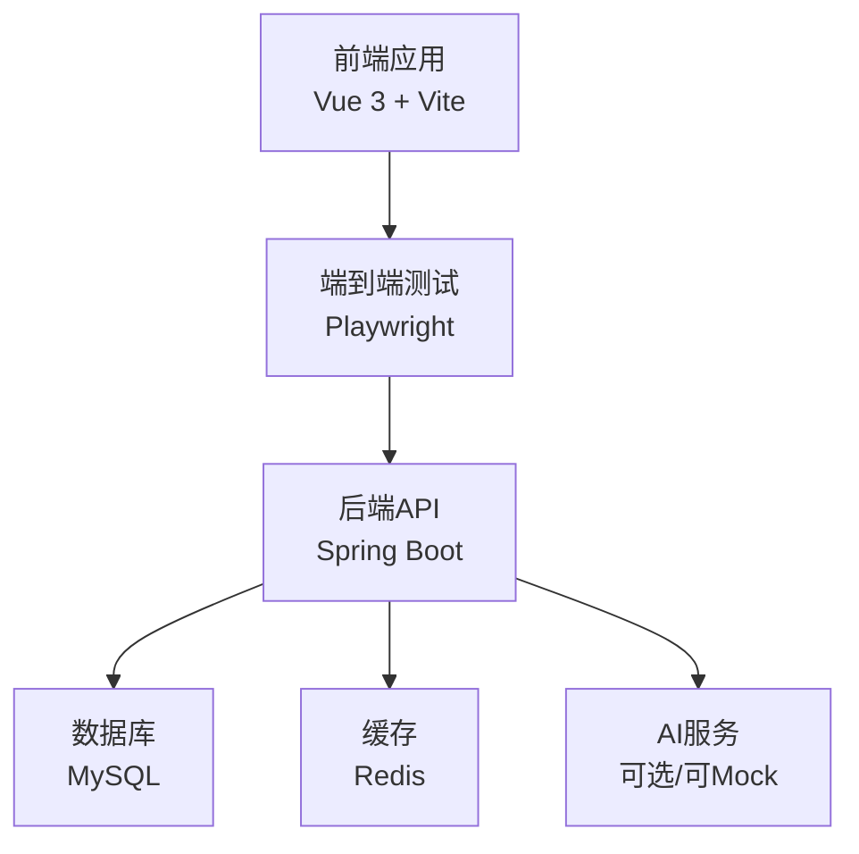
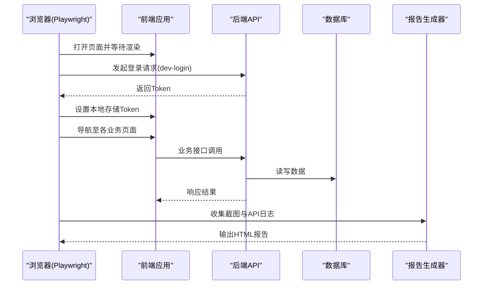
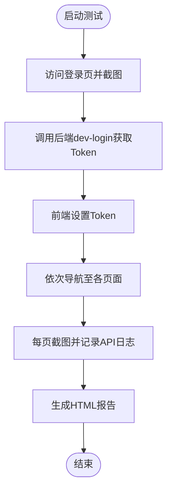
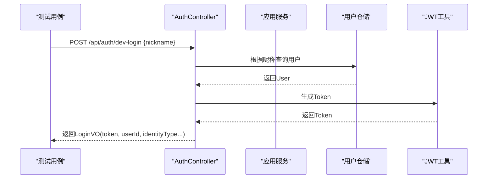
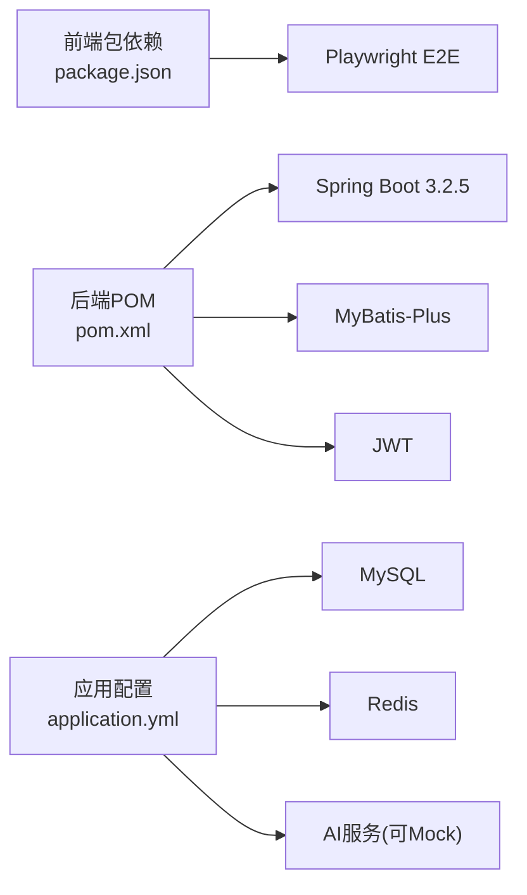

# 测试策略

<cite>
**本文引用的文件**
- [wzoto-frontend/tests/auto-test.mjs](file://wzoto-frontend/tests/auto-test.mjs)
- [wzoto-frontend/package.json](file://wzoto-frontend/package.json)
- [wzoto-backend/pom.xml](file://wzoto-backend/pom.xml)
- [wzoto-backend/wzoto-interfaces/src/main/resources/application.yml](file://wzoto-backend/wzoto-interfaces/src/main/resources/application.yml)
- [wzoto-backend/sql/init_test_data.sql](file://wzoto-backend/sql/init_test_data.sql)
- [wzoto-backend/sql/init_all_learning_tables.sql](file://wzoto-backend/sql/init_all_learning_tables.sql)
- [wzoto-backend/scripts/generate-learning-resources.mjs](file://wzoto-backend/scripts/generate-learning-resources.mjs)
- [wzoto-backend/wzoto-interfaces/src/main/java/com/wzoto/interfaces/controller/AuthController.java](file://wzoto-backend/wzoto-interfaces/src/main/java/com/wzoto/interfaces/controller/AuthController.java)
</cite>

## 目录
1. [简介](#简介)
2. [项目结构](#项目结构)
3. [核心组件](#核心组件)
4. [架构总览](#架构总览)
5. [详细组件分析](#详细组件分析)
6. [依赖分析](#依赖分析)
7. [性能考虑](#性能考虑)
8. [故障排查指南](#故障排查指南)
9. [结论](#结论)
10. [附录](#附录)

## 简介
本测试策略面向wzoto项目的端到端质量保障，覆盖测试金字塔（单元测试、集成测试、端到端测试）与自动化流水线。结合现有前端Playwright脚本与后端Spring Boot工程，给出分层测试范围、工具选型、覆盖率要求、数据管理、性能测试方案以及持续集成的执行与报告规范，确保在快速迭代中维持稳定交付。

## 项目结构
- 前端：Vue 3 + Vite，使用Playwright进行端到端UI自动化，已具备页面截图与HTML报告生成能力。
- 后端：Spring Boot多模块（domain/infrastructure/application/interfaces），提供REST API；配置MySQL与Redis；提供开发环境快捷登录接口用于E2E流程打通。
- 数据库：SQL脚本集中存放，包含学习资源相关表DDL与种子数据初始化脚本。

**图表来源**
- [wzoto-frontend/tests/auto-test.mjs:1-366](file://wzoto-frontend/tests/auto-test.mjs#L1-L366)
- [wzoto-backend/wzoto-interfaces/src/main/resources/application.yml:1-51](file://wzoto-backend/wzoto-interfaces/src/main/resources/application.yml#L1-L51)

**章节来源**
- [wzoto-frontend/package.json:1-27](file://wzoto-frontend/package.json#L1-L27)
- [wzoto-backend/pom.xml:1-126](file://wzoto-backend/pom.xml#L1-L126)
- [wzoto-backend/wzoto-interfaces/src/main/resources/application.yml:1-51](file://wzoto-backend/wzoto-interfaces/src/main/resources/application.yml#L1-L51)

## 核心组件
- 端到端测试入口：基于Playwright的自动化脚本，覆盖家长端与学生端关键页面，自动截图并生成HTML报告，同时捕获API调用日志。
- 认证与鉴权：后端提供微信登录、身份选择、手机号绑定及开发环境快捷登录接口，便于E2E流程免密登录。
- 数据准备：提供测试用户、会员与AI报告的初始化SQL；学习资源相关表结构与种子数据脚本。

**章节来源**
- [wzoto-frontend/tests/auto-test.mjs:1-366](file://wzoto-frontend/tests/auto-test.mjs#L1-L366)
- [wzoto-backend/wzoto-interfaces/src/main/java/com/wzoto/interfaces/controller/AuthController.java:1-149](file://wzoto-backend/wzoto-interfaces/src/main/java/com/wzoto/interfaces/controller/AuthController.java#L1-L149)
- [wzoto-backend/sql/init_test_data.sql:1-26](file://wzoto-backend/sql/init_test_data.sql#L1-L26)
- [wzoto-backend/sql/init_all_learning_tables.sql:1-30](file://wzoto-backend/sql/init_all_learning_tables.sql#L1-L30)

## 架构总览
下图展示从前端E2E到后端API、再到数据库与外部服务的调用链，以及测试报告生成路径。

**图表来源**
- [wzoto-frontend/tests/auto-test.mjs:1-366](file://wzoto-frontend/tests/auto-test.mjs#L1-L366)
- [wzoto-backend/wzoto-interfaces/src/main/java/com/wzoto/interfaces/controller/AuthController.java:102-127](file://wzoto-backend/wzoto-interfaces/src/main/java/com/wzoto/interfaces/controller/AuthController.java#L102-L127)
- [wzoto-backend/wzoto-interfaces/src/main/resources/application.yml:6-17](file://wzoto-backend/wzoto-interfaces/src/main/resources/application.yml#L6-L17)

## 详细组件分析

### 端到端测试（E2E）
- 目标：验证家长端与学生端核心页面的可用性、交互正确性与移动端适配。
- 范围：登录页、首页、学习计划、任务、报告、资源、家长管控、错题本、AI答疑、成就、学生课程/练习/AI问答/口语/作文等。
- 实现要点：
  - 使用Chromium无头模式，固定视口模拟移动端。
  - 通过后端dev-login获取Token并注入前端本地存储。
  - 监听API响应，记录状态码与部分响应体，用于报告。
  - 每个关键页面截图并写入统一目录，最终生成HTML报告。
- 建议扩展：
  - 增加断言（元素可见性、文本匹配、表单提交成功提示）。
  - 将用例按功能域拆分，支持并行执行与失败重试。
  - 接入CI，自动生成并归档报告。

**图表来源**
- [wzoto-frontend/tests/auto-test.mjs:1-366](file://wzoto-frontend/tests/auto-test.mjs#L1-L366)

**章节来源**
- [wzoto-frontend/tests/auto-test.mjs:1-366](file://wzoto-frontend/tests/auto-test.mjs#L1-L366)

### 后端API测试
- 框架与依赖：Spring Boot 3.2.5，Maven构建；构建日志显示已下载Mockito、Testcontainers等BOM，为后续集成测试提供基础。
- 推荐实践：
  - 单元测试：对领域服务与值对象逻辑进行隔离测试，使用JUnit 5与AssertJ断言。
  - Mock外部依赖：使用Mockito对AI服务、第三方SDK进行模拟，保证测试稳定性。
  - 集成测试：使用@SpringBootTest与Testcontainers启动真实MySQL/Redis容器，验证仓储与事务。
  - API测试：使用WebMvcTest或TestRestTemplate对控制器进行契约测试，校验入参校验、鉴权拦截、响应结构。
- 重点接口：
  - 认证：/api/auth/me、/api/auth/wx-login、/api/auth/select-identity、/api/auth/bind-phone、/api/auth/dev-login。
  - 业务：学习资源、计划、任务、报告、错题、AI答疑等控制器（与前端页面一一对应）。

**图表来源**
- [wzoto-backend/wzoto-interfaces/src/main/java/com/wzoto/interfaces/controller/AuthController.java:102-127](file://wzoto-backend/wzoto-interfaces/src/main/java/com/wzoto/interfaces/controller/AuthController.java#L102-L127)

**章节来源**
- [wzoto-backend/pom.xml:1-126](file://wzoto-backend/pom.xml#L1-L126)
- [wzoto-backend/wzoto-interfaces/src/main/java/com/wzoto/interfaces/controller/AuthController.java:1-149](file://wzoto-backend/wzoto-interfaces/src/main/java/com/wzoto/interfaces/controller/AuthController.java#L1-L149)

### 数据库测试
- 环境：application.yml配置MySQL与Redis连接信息，支持环境变量注入。
- 数据准备：
  - init_test_data.sql：预置管理员、家长、学生、免费家长账号与会员、AI报告数据。
  - init_all_learning_tables.sql：创建学习资源相关表并引入种子数据。
  - generate-learning-resources.mjs：批量生成学习资源、微课、习题库、试卷、音频等种子数据。
- 建议：
  - 集成测试中使用Testcontainers启动临时数据库，执行DDL与种子脚本后运行用例。
  - 每个测试类前后进行数据快照或事务回滚，确保隔离。
  - 针对复杂查询与聚合场景编写专项用例。

**章节来源**
- [wzoto-backend/wzoto-interfaces/src/main/resources/application.yml:6-17](file://wzoto-backend/wzoto-interfaces/src/main/resources/application.yml#L6-L17)
- [wzoto-backend/sql/init_test_data.sql:1-26](file://wzoto-backend/sql/init_test_data.sql#L1-L26)
- [wzoto-backend/sql/init_all_learning_tables.sql:1-30](file://wzoto-backend/sql/init_all_learning_tables.sql#L1-L30)
- [wzoto-backend/scripts/generate-learning-resources.mjs:472-531](file://wzoto-backend/scripts/generate-learning-resources.mjs#L472-L531)

### 前端测试
- 现状：已具备Playwright E2E脚本，覆盖主要页面并生成报告。
- 建议补充：
  - 单元测试：使用Vitest/Jest对工具函数、Store、组合式函数进行断言。
  - 组件测试：使用Vue Test Utils对独立组件进行渲染与交互测试。
  - 网络层：对HTTP封装进行Mock，避免真实请求影响测试稳定性。
  - 可视化：对图表组件进行快照对比或关键指标断言。

**章节来源**
- [wzoto-frontend/package.json:1-27](file://wzoto-frontend/package.json#L1-L27)
- [wzoto-frontend/tests/auto-test.mjs:1-366](file://wzoto-frontend/tests/auto-test.mjs#L1-L366)

## 依赖分析
- 前端依赖：Vue 3、Element Plus、Pinia、ECharts、Axios、Vite；测试依赖Playwright。
- 后端依赖：Spring Boot 3.2.5、MyBatis-Plus、Hutool、JWT；构建日志显示已拉取Mockito、Testcontainers等BOM，便于后续测试落地。
- 外部服务：MySQL、Redis、可选AI服务（可通过配置开关启用或Mock）。

**图表来源**
- [wzoto-frontend/package.json:1-27](file://wzoto-frontend/package.json#L1-L27)
- [wzoto-backend/pom.xml:1-126](file://wzoto-backend/pom.xml#L1-L126)
- [wzoto-backend/wzoto-interfaces/src/main/resources/application.yml:1-51](file://wzoto-backend/wzoto-interfaces/src/main/resources/application.yml#L1-L51)

**章节来源**
- [wzoto-frontend/package.json:1-27](file://wzoto-frontend/package.json#L1-L27)
- [wzoto-backend/pom.xml:1-126](file://wzoto-backend/pom.xml#L1-L126)
- [wzoto-backend/wzoto-interfaces/src/main/resources/application.yml:1-51](file://wzoto-backend/wzoto-interfaces/src/main/resources/application.yml#L1-L51)

## 性能考虑
- 负载测试：使用k6或JMeter对关键API（登录、资源列表、报告生成）进行并发压测，关注TPS、延迟分布与错误率。
- 压力测试：逐步提升并发直至系统瓶颈，观察CPU、内存、GC、数据库连接池与慢查询。
- 基准测试：建立性能基线，纳入回归检测；对热点接口进行索引优化与缓存命中评估。
- 前端性能：监控首屏加载、路由切换耗时、图表渲染性能；必要时懒加载与分页。

[本节为通用指导，不直接分析具体文件]

## 故障排查指南
- 登录失败：检查后端dev-login是否可用、数据库是否存在对应昵称用户、JWT密钥配置是否正确。
- 页面空白或无法加载：确认前端端口与后端API地址配置一致，浏览器控制台是否有跨域或401错误。
- 报告缺失截图：检查Playwright工作目录权限、屏幕分辨率与元素可见性等待时间。
- 数据库连接异常：核对application.yml中的MySQL/Redis地址、端口、密码与环境变量注入。
- 外部服务不可用：AI服务关闭时确保Mock生效，避免阻塞测试。

**章节来源**
- [wzoto-backend/wzoto-interfaces/src/main/resources/application.yml:1-51](file://wzoto-backend/wzoto-interfaces/src/main/resources/application.yml#L1-L51)
- [wzoto-frontend/tests/auto-test.mjs:1-366](file://wzoto-frontend/tests/auto-test.mjs#L1-L366)

## 结论
通过以Playwright为核心的E2E自动化与后端分层测试体系，wzoto可在保证用户体验的同时提升交付质量。建议尽快补齐后端单元测试与集成测试，完善覆盖率门禁与CI流水线，形成“快速反馈+稳定回归”的闭环。

[本节为总结，不直接分析具体文件]

## 附录

### 测试金字塔与覆盖范围
- 单元测试：领域服务、值对象、工具函数；目标覆盖率≥80%。
- 集成测试：仓储与数据库交互、事务边界、外部依赖Mock；关键路径覆盖率≥70%。
- 端到端测试：家长端与学生端核心流程；关键页面通过率100%，失败需阻断发布。

### 后端测试规范
- 框架：JUnit 5 + AssertJ + Mockito；API测试使用WebMvcTest/TestRestTemplate。
- 数据库：Testcontainers + Flyway/Liquibase或SQL脚本初始化；测试前后数据隔离。
- 鉴权：对需要鉴权的接口构造有效Token或使用@WithMockUser。
- 示例路径：参考认证控制器与dev-login流程设计用例。

**章节来源**
- [wzoto-backend/wzoto-interfaces/src/main/java/com/wzoto/interfaces/controller/AuthController.java:102-127](file://wzoto-backend/wzoto-interfaces/src/main/java/com/wzoto/interfaces/controller/AuthController.java#L102-L127)

### 前端测试规范
- 单元与组件：Vitest/Jest + Vue Test Utils；对Store、工具函数与组件交互进行断言。
- E2E：延续Playwright脚本，增加断言与重试机制，按功能域组织用例。
- 网络层：Mock Axios请求，避免真实依赖。

**章节来源**
- [wzoto-frontend/package.json:1-27](file://wzoto-frontend/package.json#L1-L27)
- [wzoto-frontend/tests/auto-test.mjs:1-366](file://wzoto-frontend/tests/auto-test.mjs#L1-L366)

### 自动化测试与持续集成
- 触发时机：Push/Pull Request触发全量或增量测试。
- 执行顺序：先后端单测/集成测试，再前端E2E；并行化缩短时长。
- 报告归档：保存HTML报告、截图与API日志；失败通知与质量门禁。
- 质量门禁：覆盖率阈值、E2E通过率、关键API契约测试通过。

[本节为通用指导，不直接分析具体文件]

### 测试数据管理
- 准备：使用init_test_data.sql与学习资源种子脚本初始化；按需生成更多样本数据。
- 隔离：每个测试用例使用独立事务或容器实例；避免相互污染。
- 清理：测试结束后清理临时数据或销毁容器；保留最小必要数据用于演示。

**章节来源**
- [wzoto-backend/sql/init_test_data.sql:1-26](file://wzoto-backend/sql/init_test_data.sql#L1-L26)
- [wzoto-backend/sql/init_all_learning_tables.sql:1-30](file://wzoto-backend/sql/init_all_learning_tables.sql#L1-L30)
- [wzoto-backend/scripts/generate-learning-resources.mjs:472-531](file://wzoto-backend/scripts/generate-learning-resources.mjs#L472-L531)

### 工具与框架推荐
- 后端：JUnit 5、AssertJ、Mockito、Testcontainers、SpringBootTest、WireMock（外部API）、JaCoCo（覆盖率）。
- 前端：Vitest/Jest、Vue Test Utils、Playwright、Cypress（备选）、Storybook（组件文档与测试）。
- 性能：k6、JMeter、Gatling；前端Lighthouse、WebPageTest。
- 报告：JaCoCo HTML、Playwright HTML报告、Allure（可选）。

[本节为通用指导，不直接分析具体文件]

### 覆盖率要求与最佳实践
- 覆盖率：单测≥80%，集成≥70%，E2E关键路径100%。
- 命名与结构：用例与生产代码同构，清晰表达意图。
- 断言：优先行为断言而非实现细节；关注边界与异常分支。
- 稳定性：避免硬编码等待，使用条件等待与重试；对外部依赖进行Mock。
- 可维护性：抽取公共夹具与工厂方法；用例数据与逻辑分离。

[本节为通用指导，不直接分析具体文件]