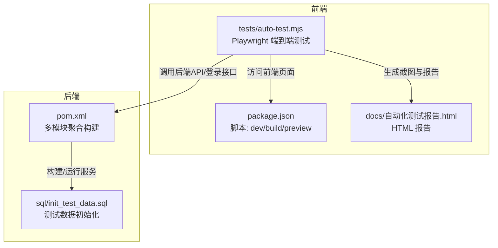
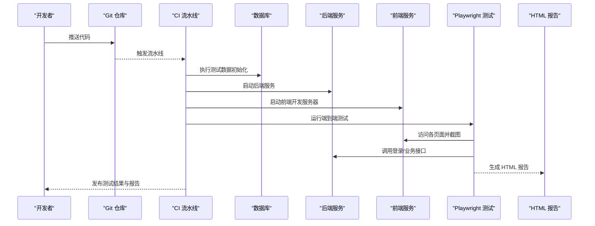
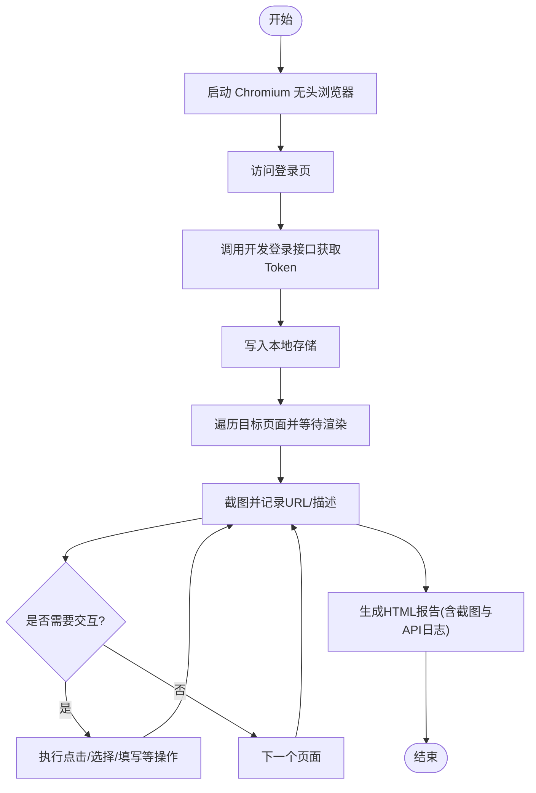
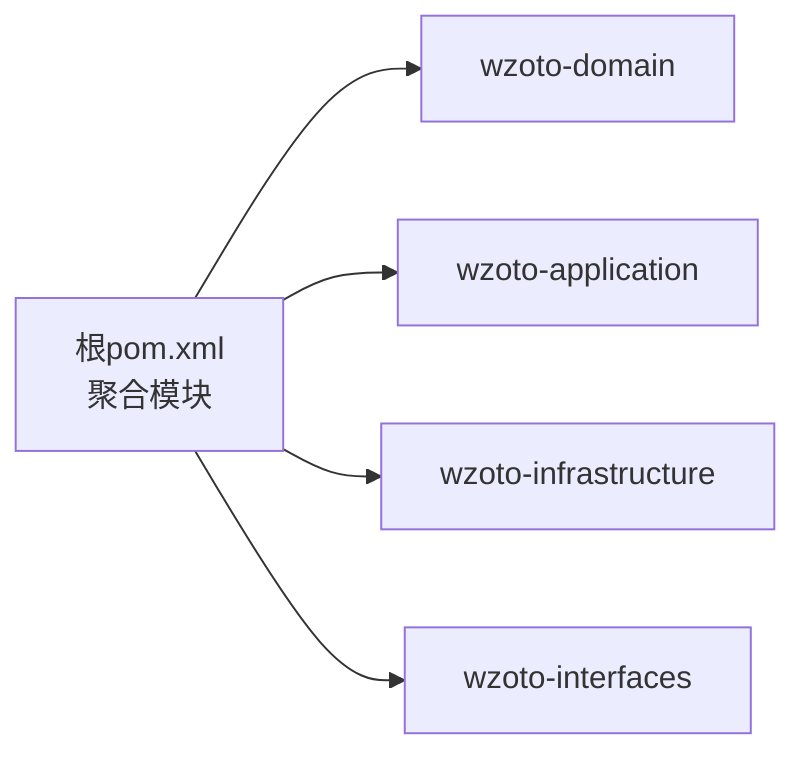
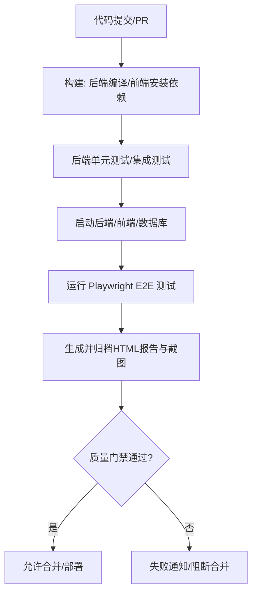
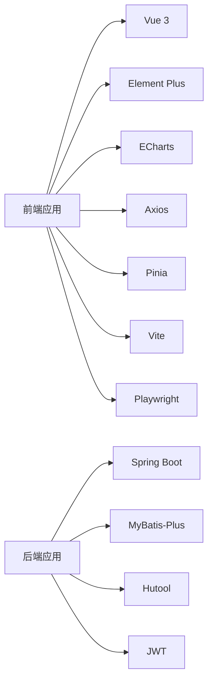

# 测试自动化

<cite>
**本文引用的文件**
- [wzoto-backend/pom.xml](file://wzoto-backend/pom.xml)
- [wzoto-frontend/package.json](file://wzoto-frontend/package.json)
- [wzoto-frontend/tests/auto-test.mjs](file://wzoto-frontend/tests/auto-test.mjs)
- [wzoto-backend/sql/init_test_data.sql](file://wzoto-backend/sql/init_test_data.sql)
- [docs/自动化测试报告.html](file://docs/自动化测试报告.html)
</cite>

## 目录
1. [简介](#简介)
2. [项目结构](#项目结构)
3. [核心组件](#核心组件)
4. [架构总览](#架构总览)
5. [详细组件分析](#详细组件分析)
6. [依赖关系分析](#依赖关系分析)
7. [性能考虑](#性能考虑)
8. [故障排查指南](#故障排查指南)
9. [结论](#结论)
10. [附录](#附录)

## 简介
本文件面向 wzoto 项目的测试自动化，覆盖持续集成中的测试执行、测试报告生成、测试数据管理、自动化脚本与容器化环境、以及失败处理策略。重点说明：
- 前端 E2E 自动化（Playwright）如何驱动浏览器访问页面、截图并生成 HTML 报告
- 后端 Maven 多模块工程结构与构建配置
- 测试数据准备与清理策略（基于 SQL 初始化脚本）
- 在 CI/CD 中串联单元测试、集成测试、E2E 测试的流水线设计建议
- 失败通知、回滚策略与问题追踪机制

## 项目结构
wzoto 采用前后端分离与后端分层架构：
- 前端：Vue 3 + Vite，使用 Playwright 进行端到端 UI 测试，自动生成截图与 HTML 报告
- 后端：Spring Boot 多模块（domain/application/infrastructure/interfaces），Maven 统一构建
- 数据库：SQL 脚本提供测试数据初始化能力

图表来源
- [wzoto-frontend/package.json:1-27](file://wzoto-frontend/package.json#L1-L27)
- [wzoto-frontend/tests/auto-test.mjs:1-366](file://wzoto-frontend/tests/auto-test.mjs#L1-L366)
- [wzoto-backend/pom.xml:1-126](file://wzoto-backend/pom.xml#L1-L126)
- [wzoto-backend/sql/init_test_data.sql:1-26](file://wzoto-backend/sql/init_test_data.sql#L1-L26)
- [docs/自动化测试报告.html:1-200](file://docs/自动化测试报告.html#L1-L200)

章节来源
- [wzoto-frontend/package.json:1-27](file://wzoto-frontend/package.json#L1-L27)
- [wzoto-backend/pom.xml:1-126](file://wzoto-backend/pom.xml#L1-L126)

## 核心组件
- 前端 E2E 测试脚本：基于 Playwright 的 Chromium 无头浏览器，按页面顺序导航、截图、记录 API 响应，最终生成 HTML 报告
- 后端 Maven 构建：聚合多模块，统一 Java 版本与依赖管理，便于在 CI 中执行编译与测试
- 测试数据脚本：提供预置用户、会员与 AI 报告等基础数据，支撑 E2E 流程中的登录与业务页面展示

章节来源
- [wzoto-frontend/tests/auto-test.mjs:1-366](file://wzoto-frontend/tests/auto-test.mjs#L1-L366)
- [wzoto-backend/pom.xml:1-126](file://wzoto-backend/pom.xml#L1-L126)
- [wzoto-backend/sql/init_test_data.sql:1-26](file://wzoto-backend/sql/init_test_data.sql#L1-L26)

## 架构总览
下图展示了从代码提交到测试执行的端到端流程，包括前端 E2E 测试、后端服务启动、数据库初始化与报告产出。

图表来源
- [wzoto-frontend/tests/auto-test.mjs:1-366](file://wzoto-frontend/tests/auto-test.mjs#L1-L366)
- [wzoto-backend/sql/init_test_data.sql:1-26](file://wzoto-backend/sql/init_test_data.sql#L1-L26)
- [docs/自动化测试报告.html:1-200](file://docs/自动化测试报告.html#L1-L200)

## 详细组件分析

### 前端 E2E 测试（Playwright）
- 浏览器与环境
  - 使用 Chromium 无头模式，模拟移动端视口（375×812 @2x）
  - 监听 /api/* 请求，收集状态码与部分响应体用于报告
- 测试步骤
  - 访问登录页、通过开发模式接口获取 Token 并写入本地存储
  - 依次访问家长端与学生端多个页面，等待渲染后截图
  - 对“新增子女”等交互进行简单操作（点击、选择、填写、保存）
- 报告生成
  - 将截图与页面信息汇总为 HTML 报告，包含统计摘要、页面截图、API 调用记录
  - 报告输出至 docs 目录，便于归档与查看

图表来源
- [wzoto-frontend/tests/auto-test.mjs:1-366](file://wzoto-frontend/tests/auto-test.mjs#L1-L366)

章节来源
- [wzoto-frontend/tests/auto-test.mjs:1-366](file://wzoto-frontend/tests/auto-test.mjs#L1-L366)
- [docs/自动化测试报告.html:1-200](file://docs/自动化测试报告.html#L1-L200)

### 后端 Maven 构建与测试
- 多模块聚合：根 pom 统一管理 Java 版本、依赖与插件，子模块包含 domain、application、infrastructure、interfaces
- 构建与测试：可在 CI 中执行编译与测试命令；如需引入单元测试或集成测试，建议在对应模块添加测试用例与测试依赖

图表来源
- [wzoto-backend/pom.xml:1-126](file://wzoto-backend/pom.xml#L1-L126)

章节来源
- [wzoto-backend/pom.xml:1-126](file://wzoto-backend/pom.xml#L1-L126)

### 测试数据管理
- 数据准备：通过 SQL 脚本插入管理员、家长、学生等账号及会员、AI 报告等基础数据，供 E2E 登录与页面展示使用
- 数据清理策略：建议在每次测试前重置数据库或使用事务隔离；对于 E2E 产生的脏数据，可通过删除脚本或重建库来恢复
- 环境隔离：为不同环境（dev/test/staging/prod）维护独立数据库实例，避免数据污染

章节来源
- [wzoto-backend/sql/init_test_data.sql:1-26](file://wzoto-backend/sql/init_test_data.sql#L1-L26)

### 自动化测试脚本与命令
- 前端
  - 安装依赖：npm install
  - 运行 E2E：node tests/auto-test.mjs（需确保前端与后端服务已启动）
  - 构建产物：npm run build（可选，用于静态资源验证）
- 后端
  - 构建与测试：mvn clean compile test（按需扩展单元测试/集成测试）
- 容器化建议
  - 使用 Docker 镜像封装 Node.js 与 Chromium 环境，运行 Playwright 测试
  - 使用 Docker Compose 编排前端、后端与数据库，一键拉起测试环境

章节来源
- [wzoto-frontend/package.json:1-27](file://wzoto-frontend/package.json#L1-L27)
- [wzoto-backend/pom.xml:1-126](file://wzoto-backend/pom.xml#L1-L126)

### 持续集成（CI/CD）流水线设计建议
- 触发条件：push 到主分支或创建 PR 时触发
- 阶段划分
  - 构建：后端 mvn 编译，前端 npm 安装依赖
  - 测试：后端单元测试/集成测试（如已实现），前端 E2E 测试
  - 报告：归档 HTML 报告与截图，作为构建产物
  - 门禁：根据测试结果决定是否允许合并
- 环境与依赖
  - 缓存 Node_modules 与 Maven 依赖，加速构建
  - 提供数据库初始化脚本，确保测试数据就绪

[此图为概念性流程图，不直接映射具体源码文件]

### 测试报告与质量门禁
- 报告内容：页面截图、URL、描述、API 调用统计（成功/重定向/错误）
- 覆盖率：当前未集成前端/后端覆盖率工具；可结合 Jest/Vitest（前端）与 JaCoCo（后端）补充
- 质量门禁：建议在 CI 中设置阈值（如 E2E 通过率、关键页面截图存在性、API 错误率上限），未达标则阻断合并

章节来源
- [docs/自动化测试报告.html:1-200](file://docs/自动化测试报告.html#L1-L200)

### 失败处理与问题追踪
- 错误通知：CI 失败时发送通知（邮件/IM），附带报告链接与关键日志
- 回滚策略：若线上回归失败，自动回滚到上一个稳定版本
- 问题追踪：将失败截图与日志关联到缺陷管理系统，便于复现与修复

[本节为通用实践说明，不直接引用具体源码文件]

## 依赖关系分析
- 前端依赖：Vue、Element Plus、ECharts、Axios、Pinia、Vite、Playwright
- 后端依赖：Spring Boot、MyBatis-Plus、Hutool、JWT
- 测试依赖：Playwright（Chromium）、Node.js 运行时

图表来源
- [wzoto-frontend/package.json:1-27](file://wzoto-frontend/package.json#L1-L27)
- [wzoto-backend/pom.xml:1-126](file://wzoto-backend/pom.xml#L1-L126)

章节来源
- [wzoto-frontend/package.json:1-27](file://wzoto-frontend/package.json#L1-L27)
- [wzoto-backend/pom.xml:1-126](file://wzoto-backend/pom.xml#L1-L126)

## 性能考虑
- 并行执行：可将多个页面测试拆分为并行任务，缩短整体时长
- 资源复用：复用浏览器上下文与页面实例，减少启动开销
- 网络优化：启用依赖缓存，限制截图分辨率与数量，降低 IO 压力
- 数据库：为测试库建立必要索引，提升查询性能

[本节为通用指导，不直接引用具体源码文件]

## 故障排查指南
- 前端 E2E 失败
  - 检查前端与后端服务是否可用，端口是否正确
  - 确认登录接口返回正常，Token 写入成功
  - 查看 HTML 报告中的 API 调用记录，定位错误状态码
- 后端构建失败
  - 检查 Java 版本与 Maven 配置是否匹配
  - 确认依赖下载与缓存是否正常
- 数据库问题
  - 确认测试数据脚本执行成功
  - 检查表结构与字段是否与代码一致

章节来源
- [wzoto-frontend/tests/auto-test.mjs:1-366](file://wzoto-frontend/tests/auto-test.mjs#L1-L366)
- [wzoto-backend/pom.xml:1-126](file://wzoto-backend/pom.xml#L1-L126)
- [wzoto-backend/sql/init_test_data.sql:1-26](file://wzoto-backend/sql/init_test_data.sql#L1-L26)

## 结论
wzoto 项目已具备前端 E2E 自动化能力，能够覆盖家长端与学生端主要页面的可视化验证，并生成直观的 HTML 报告。配合后端 Maven 构建与 SQL 测试数据脚本，可在 CI 中形成完整的“构建—测试—报告”闭环。建议后续补充覆盖率与质量门禁，完善失败通知与回滚策略，进一步提升交付质量与效率。

## 附录
- 常用命令
  - 前端：npm install；node tests/auto-test.mjs；npm run build
  - 后端：mvn clean compile test
- 报告位置：docs/自动化测试报告.html
- 测试数据：wzoto-backend/sql/init_test_data.sql