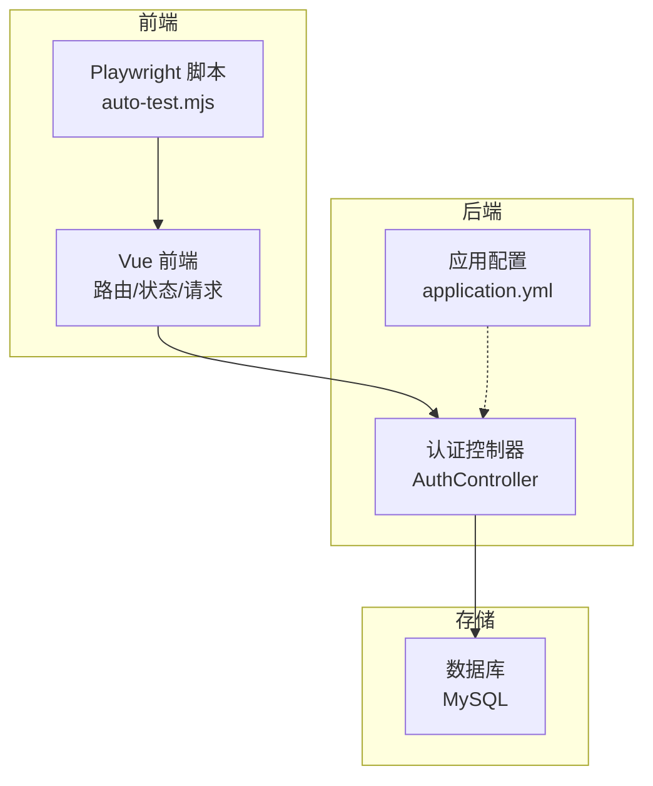
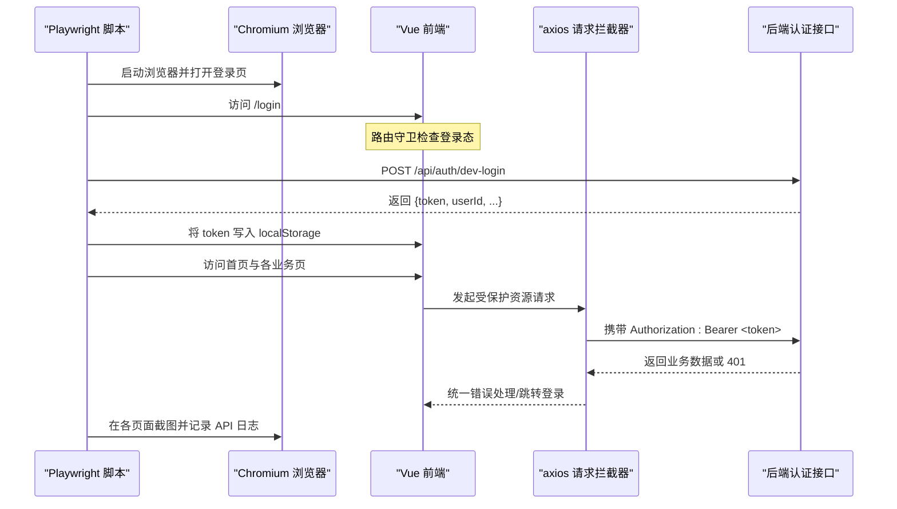
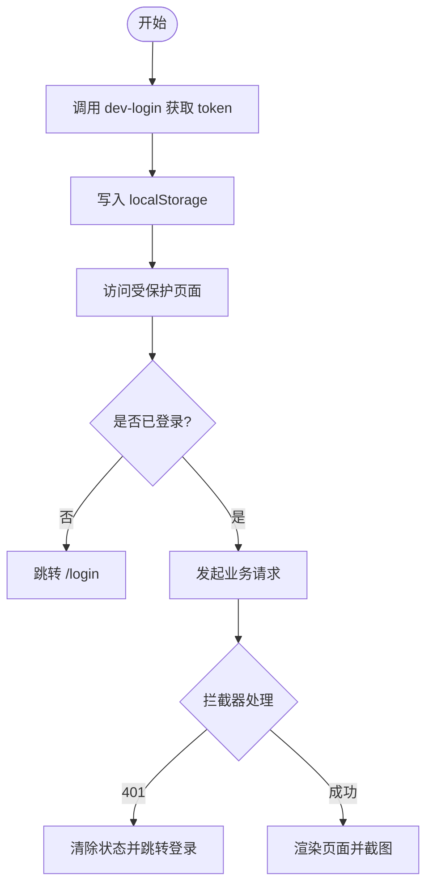
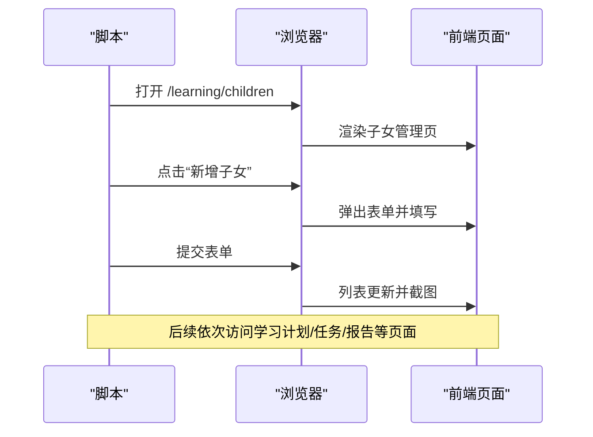
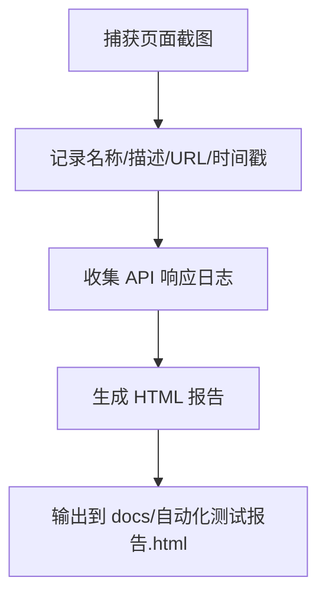
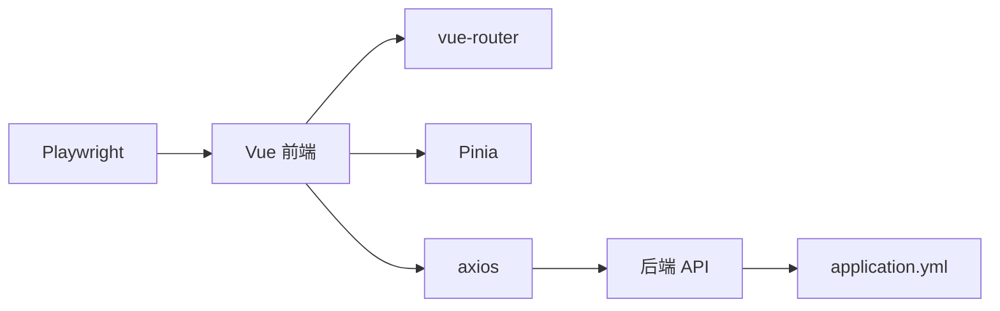

# 端到端测试

<cite>
**本文引用的文件**
- [wzoto-frontend/tests/auto-test.mjs](file://wzoto-frontend/tests/auto-test.mjs)
- [wzoto-frontend/package.json](file://wzoto-frontend/package.json)
- [wzoto-frontend/src/router/index.js](file://wzoto-frontend/src/router/index.js)
- [wzoto-frontend/src/stores/user.js](file://wzoto-frontend/src/stores/user.js)
- [wzoto-frontend/src/utils/request.js](file://wzoto-frontend/src/utils/request.js)
- [wzoto-backend/wzoto-interfaces/src/main/java/com/wzoto/interfaces/controller/AuthController.java](file://wzoto-backend/wzoto-interfaces/src/main/java/com/wzoto/interfaces/controller/AuthController.java)
- [wzoto-backend/sql/init_test_data.sql](file://wzoto-backend/sql/init_test_data.sql)
- [wzoto-backend/wzoto-interfaces/src/main/resources/application.yml](file://wzoto-backend/wzoto-interfaces/src/main/resources/application.yml)
- [docs/自动化测试报告.html](file://docs/自动化测试报告.html)
</cite>

## 目录
1. [简介](#简介)
2. [项目结构](#项目结构)
3. [核心组件](#核心组件)
4. [架构总览](#架构总览)
5. [详细组件分析](#详细组件分析)
6. [依赖关系分析](#依赖关系分析)
7. [性能与执行策略](#性能与执行策略)
8. [故障排查指南](#故障排查指南)
9. [结论](#结论)
10. [附录](#附录)

## 简介
本文件面向 wzoto 项目的端到端（E2E）测试，基于 Playwright 对前端应用进行浏览器自动化、页面交互模拟与截图验证。文档覆盖以下目标：
- 测试场景设计：用户登录流程、学习路径测试、AI功能体验、移动端适配测试
- 测试执行策略：无头模式运行、多浏览器兼容性、并行测试执行
- 测试报告生成：HTML 报告、截图保存、API 调用日志记录
- 完整脚本示例：从登录到完成学习的用户旅程，以及错误处理与异常用例
- 测试数据管理与环境隔离策略

## 项目结构
- 前端工程位于 wzoto-frontend，使用 Vue 3 + Vite，路由与状态管理由 vue-router 与 Pinia 提供，网络请求通过 axios 封装并统一拦截处理
- E2E 测试脚本位于 wzoto-frontend/tests/auto-test.mjs，基于 Playwright Chromium 驱动浏览器，按步骤访问各页面并截图
- 后端接口位于 wzoto-backend，认证相关接口集中在 AuthController，开发环境提供 dev-login 快捷登录
- 测试报告与截图输出至 docs 目录下的 HTML 报告与 screenshots 子目录

图表来源
- [wzoto-frontend/tests/auto-test.mjs:1-39](file://wzoto-frontend/tests/auto-test.mjs#L1-L39)
- [wzoto-backend/wzoto-interfaces/src/main/java/com/wzoto/interfaces/controller/AuthController.java:24-127](file://wzoto-backend/wzoto-interfaces/src/main/java/com/wzoto/interfaces/controller/AuthController.java#L24-L127)
- [wzoto-backend/wzoto-interfaces/src/main/resources/application.yml:1-16](file://wzoto-backend/wzoto-interfaces/src/main/resources/application.yml#L1-L16)

章节来源
- [wzoto-frontend/tests/auto-test.mjs:1-39](file://wzoto-frontend/tests/auto-test.mjs#L1-L39)
- [wzoto-frontend/package.json:1-27](file://wzoto-frontend/package.json#L1-L27)

## 核心组件
- 浏览器自动化与页面导航：使用 Playwright 启动 Chromium，设置移动端视口与缩放，依次访问登录页、首页及各业务页面
- 登录与鉴权：通过后端 dev-login 获取 JWT，写入 localStorage；前端 request 拦截器自动注入 Authorization 头，未登录或 token 过期时跳转登录
- 页面等待与稳定性：在关键页面加载后等待 DOM 元素或固定时长，确保渲染完成后再截图
- 截图与报告：每步操作后截取全页图片，收集 URL、时间戳等信息，最终生成包含统计与截图的 HTML 报告
- API 日志：监听页面响应，过滤 /api/ 路径，记录 URL、状态码与部分响应体，用于问题定位

章节来源
- [wzoto-frontend/tests/auto-test.mjs:14-57](file://wzoto-frontend/tests/auto-test.mjs#L14-L57)
- [wzoto-frontend/src/utils/request.js:13-55](file://wzoto-frontend/src/utils/request.js#L13-L55)
- [wzoto-backend/wzoto-interfaces/src/main/java/com/wzoto/interfaces/controller/AuthController.java:102-127](file://wzoto-backend/wzoto-interfaces/src/main/java/com/wzoto/interfaces/controller/AuthController.java#L102-L127)

## 架构总览
下图展示了 E2E 测试从浏览器到前端的交互链路，以及前端与后端认证接口的调用关系。

图表来源
- [wzoto-frontend/tests/auto-test.mjs:60-86](file://wzoto-frontend/tests/auto-test.mjs#L60-L86)
- [wzoto-frontend/src/utils/request.js:13-55](file://wzoto-frontend/src/utils/request.js#L13-L55)
- [wzoto-backend/wzoto-interfaces/src/main/java/com/wzoto/interfaces/controller/AuthController.java:102-127](file://wzoto-backend/wzoto-interfaces/src/main/java/com/wzoto/interfaces/controller/AuthController.java#L102-L127)

## 详细组件分析

### 登录流程与鉴权
- 开发环境快捷登录：通过 /api/auth/dev-login 传入昵称获取 JWT，便于 E2E 快速进入系统
- 前端状态管理：Pinia store 负责 token 持久化与用户信息拉取；路由守卫根据登录态与身份控制页面访问
- 请求拦截：axios 拦截器自动注入 Authorization 头，并在 401 时清除状态并跳转登录

图表来源
- [wzoto-backend/wzoto-interfaces/src/main/java/com/wzoto/interfaces/controller/AuthController.java:102-127](file://wzoto-backend/wzoto-interfaces/src/main/java/com/wzoto/interfaces/controller/AuthController.java#L102-L127)
- [wzoto-frontend/src/stores/user.js:67-85](file://wzoto-frontend/src/stores/user.js#L67-L85)
- [wzoto-frontend/src/utils/request.js:13-55](file://wzoto-frontend/src/utils/request.js#L13-L55)
- [wzoto-frontend/src/router/index.js:197-247](file://wzoto-frontend/src/router/index.js#L197-L247)

章节来源
- [wzoto-backend/wzoto-interfaces/src/main/java/com/wzoto/interfaces/controller/AuthController.java:102-127](file://wzoto-backend/wzoto-interfaces/src/main/java/com/wzoto/interfaces/controller/AuthController.java#L102-L127)
- [wzoto-frontend/src/stores/user.js:6-29](file://wzoto-frontend/src/stores/user.js#L6-L29)
- [wzoto-frontend/src/router/index.js:197-247](file://wzoto-frontend/src/router/index.js#L197-L247)
- [wzoto-frontend/src/utils/request.js:13-55](file://wzoto-frontend/src/utils/request.js#L13-L55)

### 学习路径测试（家长端与学生端）
- 家长端：首页 → 学习首页 → 子女管理（新增子女）→ 学习计划 → 学习任务 → 学情报告 → 学习资源 → 时长管控 → 错题本 → AI答疑 → 成长激励
- 学生端：学习中心 → 课程专区 → 专项练习 → AI答疑 → 错题本 → 口语跟读 → 作文批改
- 每个页面均进行截图与描述记录，形成完整的用户旅程闭环

图表来源
- [wzoto-frontend/tests/auto-test.mjs:94-149](file://wzoto-frontend/tests/auto-test.mjs#L94-L149)
- [wzoto-frontend/tests/auto-test.mjs:151-197](file://wzoto-frontend/tests/auto-test.mjs#L151-L197)
- [wzoto-frontend/tests/auto-test.mjs:199-240](file://wzoto-frontend/tests/auto-test.mjs#L199-L240)

章节来源
- [wzoto-frontend/tests/auto-test.mjs:82-240](file://wzoto-frontend/tests/auto-test.mjs#L82-L240)

### AI 功能体验
- 家长端 AI 答疑：查看孩子提问与 AI 分步启发记录
- 学生端 AI 答疑：支持拍照上传、文字提问、对话式回答与追问续问
- 测试中通过页面导航与截图验证 UI 可用性，结合 API 日志辅助定位后端响应

章节来源
- [wzoto-frontend/tests/auto-test.mjs:187-221](file://wzoto-frontend/tests/auto-test.mjs#L187-L221)

### 移动端适配测试
- 使用 375×812 @2x 视口模拟主流手机尺寸，验证布局与交互在移动端的表现
- 所有页面截图均在移动端视口下采集，便于回归对比

章节来源
- [wzoto-frontend/tests/auto-test.mjs:39-45](file://wzoto-frontend/tests/auto-test.mjs#L39-L45)

### 截图与报告生成
- 截图：每步操作后调用 page.screenshot 保存为 PNG，路径为 docs/screenshots
- 报告：汇总测试页面数、API 调用次数与成功率，生成 docs/自动化测试报告.html，支持放大查看截图

图表来源
- [wzoto-frontend/tests/auto-test.mjs:14-24](file://wzoto-frontend/tests/auto-test.mjs#L14-L24)
- [wzoto-frontend/tests/auto-test.mjs:241-248](file://wzoto-frontend/tests/auto-test.mjs#L241-L248)
- [wzoto-frontend/tests/auto-test.mjs:251-360](file://wzoto-frontend/tests/auto-test.mjs#L251-L360)
- [docs/自动化测试报告.html:1-200](file://docs/自动化测试报告.html#L1-L200)

章节来源
- [wzoto-frontend/tests/auto-test.mjs:14-24](file://wzoto-frontend/tests/auto-test.mjs#L14-L24)
- [wzoto-frontend/tests/auto-test.mjs:251-360](file://wzoto-frontend/tests/auto-test.mjs#L251-L360)
- [docs/自动化测试报告.html:1-200](file://docs/自动化测试报告.html#L1-L200)

## 依赖关系分析
- 前端依赖：Vue Router 定义路由与元信息，Pinia 管理用户状态，axios 封装请求与拦截
- 后端依赖：Spring Boot 应用，端口与数据源、Redis、MyBatis-Plus 配置在 application.yml；认证接口实现于 AuthController
- 测试依赖：Playwright 作为浏览器自动化框架，Chromium 为默认浏览器

图表来源
- [wzoto-frontend/package.json:11-25](file://wzoto-frontend/package.json#L11-L25)
- [wzoto-backend/wzoto-interfaces/src/main/resources/application.yml:1-16](file://wzoto-backend/wzoto-interfaces/src/main/resources/application.yml#L1-L16)

章节来源
- [wzoto-frontend/package.json:11-25](file://wzoto-frontend/package.json#L11-L25)
- [wzoto-backend/wzoto-interfaces/src/main/resources/application.yml:1-16](file://wzoto-backend/wzoto-interfaces/src/main/resources/application.yml#L1-L16)

## 性能与执行策略
- 无头模式运行：脚本以 headless 模式启动浏览器，适合 CI/CD 环境稳定执行
- 多浏览器兼容性：当前使用 Chromium，可通过替换浏览器引擎扩展至 Firefox/WebKit
- 并行测试执行：建议将不同页面或场景拆分为独立脚本，利用 Playwright 的并发能力并行执行，缩短整体耗时
- 页面等待优化：优先使用 waitForSelector 等待关键元素，减少固定等待时间，提升鲁棒性与速度
- 截图与日志：合理控制截图频率与大小，避免 I/O 瓶颈；仅记录必要 API 日志，降低内存占用

[本节为通用指导，不直接分析具体文件]

## 故障排查指南
- 登录失败或 401 跳转：检查后端 dev-login 是否可用、JWT 是否写入 localStorage、axios 拦截器是否正确注入 Authorization
- 页面元素不可见：确认路由守卫与身份校验逻辑，必要时先选择身份或绑定手机号
- 网络错误：检查前端 baseURL、后端服务端口与 CORS 配置
- 截图缺失或报告不完整：确认截图目录存在且可写，报告生成函数正常执行

章节来源
- [wzoto-frontend/src/utils/request.js:25-55](file://wzoto-frontend/src/utils/request.js#L25-L55)
- [wzoto-frontend/src/router/index.js:197-247](file://wzoto-frontend/src/router/index.js#L197-L247)
- [wzoto-backend/wzoto-interfaces/src/main/java/com/wzoto/interfaces/controller/AuthController.java:102-127](file://wzoto-backend/wzoto-interfaces/src/main/java/com/wzoto/interfaces/controller/AuthController.java#L102-L127)

## 结论
本 E2E 方案通过 Playwright 实现了从登录到学习全流程的自动化验证，覆盖家长端与学生端的核心页面，并结合截图与 API 日志生成可视化报告。建议在后续迭代中引入多浏览器并行执行、更细粒度的断言与稳定的元素选择器，进一步提升测试覆盖率与执行效率。

[本节为总结性内容，不直接分析具体文件]

## 附录

### 测试数据与环境隔离
- 测试数据：通过 init_test_data.sql 预置管理员、测试家长、测试大学生等账号，配合 dev-login 快速登录
- 环境隔离：建议使用独立的数据库实例或命名空间，避免测试数据污染生产环境；前后端端口与上下文路径在 application.yml 中明确配置

章节来源
- [wzoto-backend/sql/init_test_data.sql:1-26](file://wzoto-backend/sql/init_test_data.sql#L1-L26)
- [wzoto-backend/wzoto-interfaces/src/main/resources/application.yml:1-16](file://wzoto-backend/wzoto-interfaces/src/main/resources/application.yml#L1-L16)

### 完整用户旅程脚本示例（路径引用）
- 登录与令牌注入：[wzoto-frontend/tests/auto-test.mjs:60-86](file://wzoto-frontend/tests/auto-test.mjs#L60-L86)
- 家长端学习路径：[wzoto-frontend/tests/auto-test.mjs:82-197](file://wzoto-frontend/tests/auto-test.mjs#L82-L197)
- 学生端学习路径：[wzoto-frontend/tests/auto-test.mjs:199-240](file://wzoto-frontend/tests/auto-test.mjs#L199-L240)
- 截图与报告生成：[wzoto-frontend/tests/auto-test.mjs:14-24](file://wzoto-frontend/tests/auto-test.mjs#L14-L24), [wzoto-frontend/tests/auto-test.mjs:251-360](file://wzoto-frontend/tests/auto-test.mjs#L251-L360)

### 错误处理与异常用例
- 未登录访问受保护页面：路由守卫将重定向至登录页
- Token 过期或无效：axios 拦截器清理状态并跳转登录
- 网络异常：统一提示与降级处理，保证用户体验

章节来源
- [wzoto-frontend/src/router/index.js:197-247](file://wzoto-frontend/src/router/index.js#L197-L247)
- [wzoto-frontend/src/utils/request.js:25-55](file://wzoto-frontend/src/utils/request.js#L25-L55)